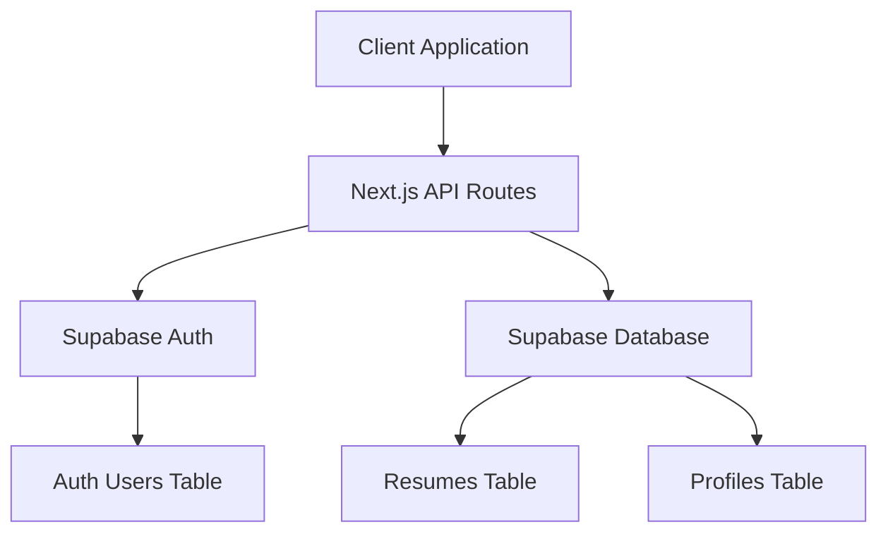
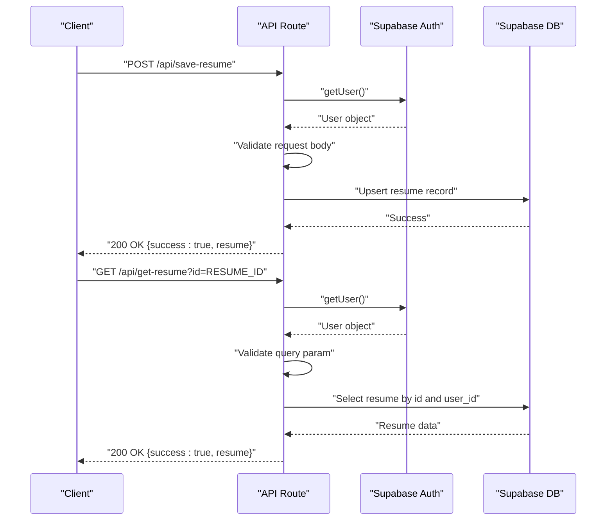
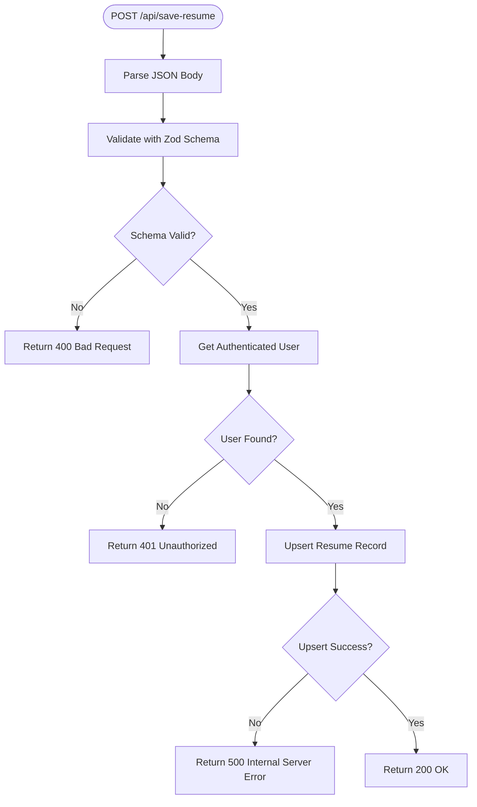
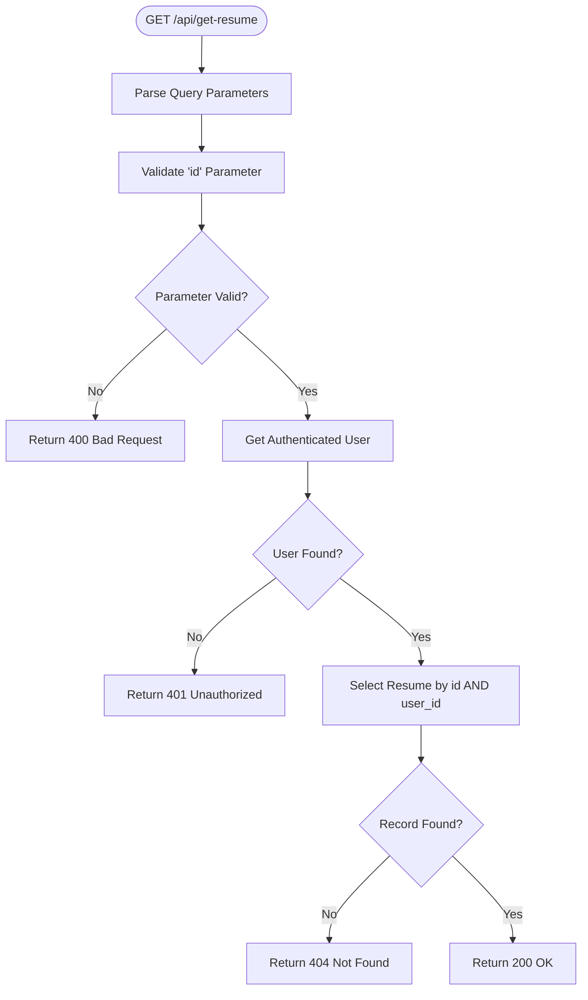
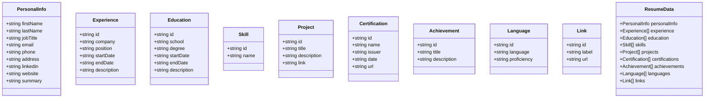
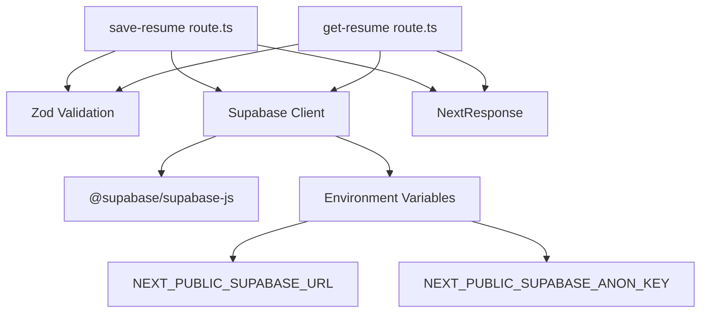

# API Documentation

<cite>
**Referenced Files in This Document**
- [save-resume route.ts](file://src/app/api/save-resume/route.ts)
- [get-resume route.ts](file://src/app/api/get-resume/route.ts)
- [supabase client](file://src/lib/supabase.ts)
- [types.ts](file://src/lib/types.ts)
- [use-auth-guard.ts](file://src/hooks/use-auth-guard.ts)
- [supabase-setup.sql](file://supabase-setup.sql)
</cite>

## Table of Contents
1. [Introduction](#introduction)
2. [Project Structure](#project-structure)
3. [Core Components](#core-components)
4. [Architecture Overview](#architecture-overview)
5. [Detailed Component Analysis](#detailed-component-analysis)
6. [Dependency Analysis](#dependency-analysis)
7. [Performance Considerations](#performance-considerations)
8. [Troubleshooting Guide](#troubleshooting-guide)
9. [Conclusion](#conclusion)

## Introduction
This document provides comprehensive API documentation for the nh.intern REST API endpoints focused on resume management. It covers:
- Authentication requirements and access control
- Request/response schemas for saving and retrieving resumes
- Data validation rules and error handling
- Practical usage examples and client integration patterns
- Security best practices and debugging guidance

The API exposes two endpoints:
- POST /api/save-resume: Save or update a resume for the authenticated user
- GET /api/get-resume: Retrieve a resume by ID for the authenticated user

## Project Structure
The API endpoints are implemented as Next.js App Router API routes under src/app/api. They integrate with Supabase for authentication and data persistence.



**Diagram sources**
- [save-resume route.ts:1-83](file://src/app/api/save-resume/route.ts#L1-L83)
- [get-resume route.ts:1-58](file://src/app/api/get-resume/route.ts#L1-L58)
- [supabase client:1-11](file://src/lib/supabase.ts#L1-L11)
- [supabase-setup.sql:1-58](file://supabase-setup.sql#L1-L58)

**Section sources**
- [save-resume route.ts:1-83](file://src/app/api/save-resume/route.ts#L1-L83)
- [get-resume route.ts:1-58](file://src/app/api/get-resume/route.ts#L1-L58)
- [supabase client:1-11](file://src/lib/supabase.ts#L1-L11)
- [supabase-setup.sql:1-58](file://supabase-setup.sql#L1-L58)

## Core Components
- Supabase client initialization with environment variables for URL and anonymous key
- Zod-based request validation schemas for both endpoints
- NextResponse-based JSON responses with appropriate HTTP status codes
- Supabase RLS policies ensuring users can only access their own resumes

Key integration points:
- Authentication: Supabase auth.getUser() verifies session and retrieves user ID
- Data storage: Upsert into resumes table with JSONB data field
- Access control: RLS policies restrict operations to user_id

**Section sources**
- [supabase client:1-11](file://src/lib/supabase.ts#L1-L11)
- [save-resume route.ts:6-29](file://src/app/api/save-resume/route.ts#L6-L29)
- [get-resume route.ts:6-8](file://src/app/api/get-resume/route.ts#L6-L8)
- [supabase-setup.sql:11-19](file://supabase-setup.sql#L11-L19)

## Architecture Overview
The API follows a layered architecture:
- Presentation layer: Next.js API routes
- Domain layer: Zod validation and business logic
- Infrastructure layer: Supabase client and database



**Diagram sources**
- [save-resume route.ts:31-82](file://src/app/api/save-resume/route.ts#L31-L82)
- [get-resume route.ts:10-57](file://src/app/api/get-resume/route.ts#L10-L57)
- [supabase client:1-11](file://src/lib/supabase.ts#L1-L11)

## Detailed Component Analysis

### POST /api/save-resume
Purpose: Save or update a resume for the authenticated user.

#### Authentication and Authorization
- Requires authenticated user session
- Uses Supabase auth.getUser() to retrieve user ID
- Enforces access control through Supabase RLS policies

#### Request Schema
Content-Type: application/json

Request Body:
- id: string (required) - Unique resume identifier
- data: object (required) - Complete resume data structure

Resume Data Structure (selected fields):
- personalInfo: object (required)
  - firstName: string
  - lastName: string
  - jobTitle: string
  - email: string
  - phone: string
  - address: string
  - linkedin: string
  - website: string
  - summary: string
- experience: array (optional) - Array of experience entries
- education: array (optional) - Array of education entries
- skills: array (optional) - Array of skill entries
- projects: array (optional) - Array of project entries
- certifications: array (optional) - Array of certification entries
- achievements: array (optional) - Array of achievement entries
- languages: array (optional) - Array of language entries
- links: array (optional) - Array of link entries

Validation Rules:
- id must be a non-empty string
- personalInfo fields are strings (no enforced length limits)
- Arrays are optional and can contain any values
- All fields are validated using Zod schema

#### Response Formats
Success Response (200 OK):
```json
{
  "success": true,
  "resume": {
    "id": "string",
    "user_id": "uuid",
    "data": {},
    "updated_at": "timestamp"
  }
}
```

Error Responses:
- 400 Bad Request: Invalid resume data
  ```json
  {
    "error": "Invalid resume data",
    "details": []
  }
  ```
- 401 Unauthorized: Authentication required
  ```json
  {
    "error": "Authentication required to save resumes"
  }
  ```
- 500 Internal Server Error: Database operation failed
  ```json
  {
    "error": "Database error: <message>"
  }
  ```

#### Processing Logic Flow


**Diagram sources**
- [save-resume route.ts:31-82](file://src/app/api/save-resume/route.ts#L31-L82)

**Section sources**
- [save-resume route.ts:6-29](file://src/app/api/save-resume/route.ts#L6-L29)
- [save-resume route.ts:31-82](file://src/app/api/save-resume/route.ts#L31-L82)
- [types.ts:69-79](file://src/lib/types.ts#L69-L79)

### GET /api/get-resume
Purpose: Retrieve a resume by ID for the authenticated user.

#### Authentication and Authorization
- Requires authenticated user session
- Uses Supabase auth.getUser() to retrieve user ID
- Enforces access control through Supabase RLS policies

#### Query Parameters
- id: string (required) - Unique resume identifier

Validation Rules:
- id must be a non-empty string

#### Response Formats
Success Response (200 OK):
```json
{
  "success": true,
  "resume": {
    "id": "string",
    "user_id": "uuid",
    "data": {},
    "updated_at": "timestamp"
  }
}
```

Error Responses:
- 400 Bad Request: Invalid resume ID
  ```json
  {
    "error": "Invalid resume ID",
    "details": []
  }
  ```
- 401 Unauthorized: Authentication required
  ```json
  {
    "error": "Authentication required to view resumes"
  }
  ```
- 404 Not Found: Resume not found or access denied
  ```json
  {
    "error": "Resume not found or access denied"
  }
  ```
- 500 Internal Server Error: Database operation failed
  ```json
  {
    "error": "Failed to load resume. Please try again."
  }
  ```

#### Processing Logic Flow


**Diagram sources**
- [get-resume route.ts:10-57](file://src/app/api/get-resume/route.ts#L10-L57)

**Section sources**
- [get-resume route.ts:6-8](file://src/app/api/get-resume/route.ts#L6-L8)
- [get-resume route.ts:10-57](file://src/app/api/get-resume/route.ts#L10-L57)

### Data Model and Types
The resume data structure is defined in TypeScript interfaces and used for validation and type safety.



**Diagram sources**
- [types.ts:1-103](file://src/lib/types.ts#L1-L103)

**Section sources**
- [types.ts:1-103](file://src/lib/types.ts#L1-L103)

## Dependency Analysis
The API relies on several key dependencies and external services:



**Diagram sources**
- [save-resume route.ts:1-3](file://src/app/api/save-resume/route.ts#L1-L3)
- [get-resume route.ts:1-3](file://src/app/api/get-resume/route.ts#L1-L3)
- [supabase client:1-11](file://src/lib/supabase.ts#L1-L11)
- [package.json:11-30](file://package.json#L11-L30)

Key dependencies:
- @supabase/supabase-js: Database and authentication client
- zod: Runtime type validation
- next/server: Response handling

**Section sources**
- [package.json:11-30](file://package.json#L11-L30)
- [save-resume route.ts:1-3](file://src/app/api/save-resume/route.ts#L1-L3)
- [get-resume route.ts:1-3](file://src/app/api/get-resume/route.ts#L1-L3)

## Performance Considerations
- Database operations: Both endpoints perform single-row operations with minimal overhead
- Validation: Zod validation occurs synchronously during request processing
- Authentication: Supabase getUser() adds network latency but ensures security
- Rate limiting: No built-in rate limiting; consider implementing at the application or infrastructure level
- Caching: Consider implementing caching strategies for frequently accessed resumes

## Troubleshooting Guide

### Common Error Scenarios

#### Authentication Issues
- 401 Unauthorized when accessing either endpoint
  - Verify client is authenticated before making requests
  - Check that Supabase session is valid and not expired
  - Ensure proper handling of auth state changes

#### Data Validation Errors
- 400 Bad Request for save-resume
  - Ensure resume ID is provided and non-empty
  - Validate that personalInfo contains all required fields
  - Check that arrays contain valid JSON structures

#### Database Access Issues
- 404 Not Found for get-resume
  - Verify resume ID exists and belongs to current user
  - Check that RLS policies are properly configured
  - Confirm user_id matches authenticated user

#### Environment Configuration
- Supabase client initialization failures
  - Verify NEXT_PUBLIC_SUPABASE_URL is set correctly
  - Ensure NEXT_PUBLIC_SUPABASE_ANON_KEY is configured
  - Check for proper environment variable loading

### Debugging Techniques
1. Enable logging in API routes to capture request details
2. Use browser developer tools to inspect network requests
3. Test authentication state before API calls
4. Validate request schemas locally before sending to API
5. Monitor Supabase dashboard for query performance and errors

### Security Best Practices
1. Always require authentication for resume operations
2. Implement proper CORS configuration
3. Validate and sanitize all incoming data
4. Use HTTPS in production environments
5. Regularly review and audit RLS policies
6. Implement rate limiting at the application level
7. Monitor API usage and error rates

**Section sources**
- [save-resume route.ts:31-82](file://src/app/api/save-resume/route.ts#L31-L82)
- [get-resume route.ts:10-57](file://src/app/api/get-resume/route.ts#L10-L57)
- [use-auth-guard.ts:1-51](file://src/hooks/use-auth-guard.ts#L1-L51)

## Conclusion
The nh.intern API provides a secure and efficient mechanism for managing user resumes with robust authentication and validation. The endpoints follow RESTful principles with clear request/response schemas and comprehensive error handling. By adhering to the documented patterns and security practices, clients can reliably integrate with the API for resume creation, updates, and retrieval.