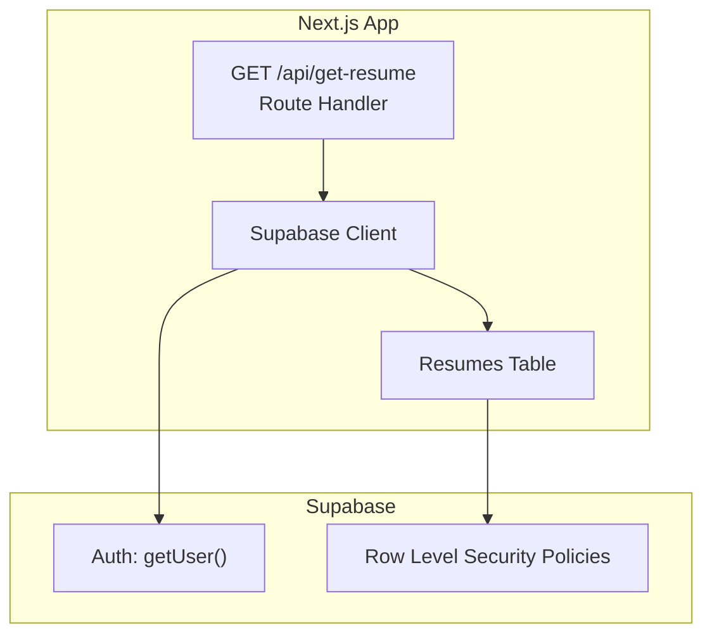
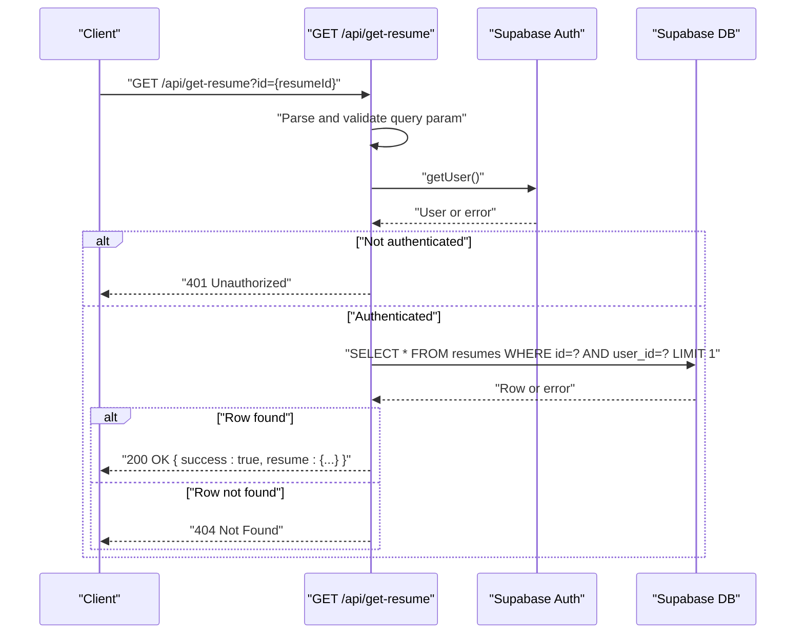
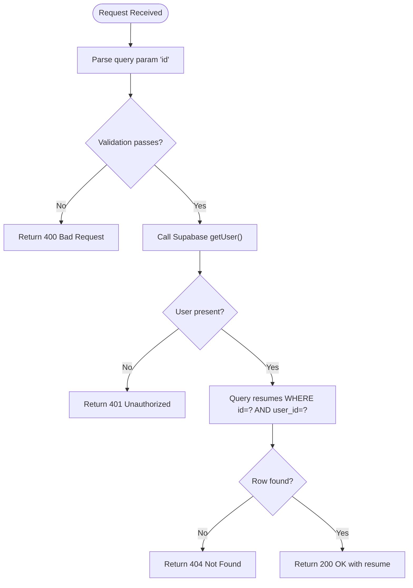
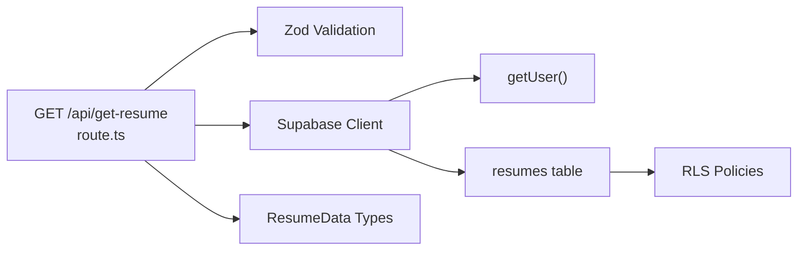

# Get Resume Endpoint

<cite>
**Referenced Files in This Document**
- [route.ts](file://src/app/api/get-resume/route.ts)
- [supabase.ts](file://src/lib/supabase.ts)
- [types.ts](file://src/lib/types.ts)
- [use-auth-guard.ts](file://src/hooks/use-auth-guard.ts)
- [save-resume route.ts](file://src/app/api/save-resume/route.ts)
- [supabase-setup.sql](file://supabase-setup.sql)
- [login page.tsx](file://src/app/login/page.tsx)
- [signup page.tsx](file://src/app/signup/page.tsx)
- [builder page.tsx](file://src/app/builder/page.tsx)
</cite>

## Table of Contents
1. [Introduction](#introduction)
2. [Project Structure](#project-structure)
3. [Core Components](#core-components)
4. [Architecture Overview](#architecture-overview)
5. [Detailed Component Analysis](#detailed-component-analysis)
6. [Dependency Analysis](#dependency-analysis)
7. [Performance Considerations](#performance-considerations)
8. [Troubleshooting Guide](#troubleshooting-guide)
9. [Conclusion](#conclusion)
10. [Appendices](#appendices)

## Introduction
This document provides comprehensive API documentation for the GET /api/get-resume endpoint. It covers the endpoint’s purpose, query parameter structure, authentication requirements, data retrieval logic, response format, error handling, access control, and practical client implementation guidelines. It also includes examples of successful responses, authentication failures, and record-not-found scenarios.

## Project Structure
The GET /api/get-resume endpoint is implemented as a Next.js Route Handler under the app API surface. It integrates with Supabase for authentication and database access, and relies on shared types for resume data modeling.

**Diagram sources**
- [route.ts:1-58](file://src/app/api/get-resume/route.ts#L1-L58)
- [supabase.ts:1-35](file://src/lib/supabase.ts#L1-L35)
- [supabase-setup.sql:1-58](file://supabase-setup.sql#L1-L58)

**Section sources**
- [route.ts:1-58](file://src/app/api/get-resume/route.ts#L1-L58)
- [supabase.ts:1-35](file://src/lib/supabase.ts#L1-L35)
- [supabase-setup.sql:1-58](file://supabase-setup.sql#L1-L58)

## Core Components
- Endpoint: GET /api/get-resume
- Purpose: Retrieve a single resume document by its unique identifier for the authenticated user.
- Authentication: Required. Uses Supabase Auth to obtain the current user.
- Authorization: Enforced via Supabase Row Level Security (RLS) policies and an explicit filter on user_id.
- Data Retrieval: Queries the resumes table with filters for id and user_id, returning a single row.
- Response: JSON payload containing a success flag and the resume data.

Key implementation references:
- Query parameter parsing and validation: [route.ts:10-22](file://src/app/api/get-resume/route.ts#L10-L22)
- Authentication check: [route.ts:24-32](file://src/app/api/get-resume/route.ts#L24-L32)
- Database query with filters: [route.ts:34-39](file://src/app/api/get-resume/route.ts#L34-L39)
- Success response: [route.ts](file://src/app/api/get-resume/route.ts#L49)
- Error responses: [route.ts:18-21](file://src/app/api/get-resume/route.ts#L18-L21), [route.ts:28-31](file://src/app/api/get-resume/route.ts#L28-L31), [route.ts:42-46](file://src/app/api/get-resume/route.ts#L42-L46), [route.ts:51-55](file://src/app/api/get-resume/route.ts#L51-L55)

**Section sources**
- [route.ts:10-58](file://src/app/api/get-resume/route.ts#L10-L58)

## Architecture Overview
The endpoint follows a straightforward flow: parse and validate the query parameter, authenticate the caller, authorize access via Supabase RLS, query the database, and return a JSON response.

**Diagram sources**
- [route.ts:10-58](file://src/app/api/get-resume/route.ts#L10-L58)
- [supabase.ts:1-35](file://src/lib/supabase.ts#L1-L35)

## Detailed Component Analysis

### Endpoint Definition
- Method: GET
- Path: /api/get-resume
- Query Parameters:
  - id (required): String. Unique resume identifier. Must be non-empty.
- Authentication:
  - Required. The endpoint calls Supabase Auth to retrieve the current user.
- Authorization:
  - Enforced by Supabase RLS policies and an explicit user_id filter in the query.
- Data Retrieval:
  - Selects a single row from the resumes table where id equals the provided id and user_id equals the authenticated user’s id.
- Response:
  - On success: { success: true, resume: { id, user_id, data, updated_at } }
  - On validation failure: 400 with error details
  - On authentication failure: 401
  - On not found or access denied: 404
  - On unexpected server errors: 500

Examples:
- Successful response structure: [route.ts](file://src/app/api/get-resume/route.ts#L49)
- Validation error response: [route.ts:18-21](file://src/app/api/get-resume/route.ts#L18-L21)
- Authentication failure response: [route.ts:28-31](file://src/app/api/get-resume/route.ts#L28-L31)
- Not found/access denied response: [route.ts:42-46](file://src/app/api/get-resume/route.ts#L42-L46)

Access control and filtering:
- Supabase RLS policy ensures users can only SELECT rows where user_id matches their own auth.uid(): [supabase-setup.sql](file://supabase-setup.sql#L16)
- The endpoint adds an additional user_id equality filter to the query for explicit enforcement: [route.ts](file://src/app/api/get-resume/route.ts#L38)

Data model and shape:
- The resume row returned includes id, user_id, data (JSONB), and updated_at. The data field contains the structured resume content defined by TypeScript interfaces: [types.ts:69-79](file://src/lib/types.ts#L69-L79)

**Section sources**
- [route.ts:10-58](file://src/app/api/get-resume/route.ts#L10-L58)
- [supabase-setup.sql:14-19](file://supabase-setup.sql#L14-L19)
- [types.ts:69-79](file://src/lib/types.ts#L69-L79)

### Authentication and Authorization Flow

**Diagram sources**
- [route.ts:10-58](file://src/app/api/get-resume/route.ts#L10-L58)

**Section sources**
- [route.ts:10-58](file://src/app/api/get-resume/route.ts#L10-L58)

### Client Implementation Guidelines
Recommended patterns for clients:
- Always ensure the user is authenticated before calling the endpoint.
- Construct the URL with the resume id as a query parameter.
- Handle response shapes and error codes appropriately.
- Consider optimistic UI updates and cache invalidation after edits.

Common usage patterns:
- Load a resume on demand when navigating to a resume-specific view.
- Refresh cached data after a successful save operation.

Note: The frontend pages demonstrate typical SPA navigation and state management but do not directly call this endpoint. See:
- Builder page (SPA routing and state): [builder page.tsx:1-79](file://src/app/builder/page.tsx#L1-L79)
- Login and signup pages (auth flows): [login page.tsx:1-113](file://src/app/login/page.tsx#L1-L113), [signup page.tsx:1-150](file://src/app/signup/page.tsx#L1-L150)

**Section sources**
- [builder page.tsx:1-79](file://src/app/builder/page.tsx#L1-L79)
- [login page.tsx:1-113](file://src/app/login/page.tsx#L1-L113)
- [signup page.tsx:1-150](file://src/app/signup/page.tsx#L1-L150)

## Dependency Analysis
- Route handler depends on:
  - Supabase client for authentication and database operations
  - Zod schema for input validation
  - Shared types for resume data modeling
- Supabase configuration:
  - Client initialized with auto-refresh tokens and session persistence
  - Global headers and DB schema configured
- Database schema and policies:
  - Resumes table with JSONB data column
  - RLS policies restricting access to own records
  - user_id foreign key relationship to auth.users

**Diagram sources**
- [route.ts:1-58](file://src/app/api/get-resume/route.ts#L1-L58)
- [supabase.ts:1-35](file://src/lib/supabase.ts#L1-L35)
- [types.ts:69-79](file://src/lib/types.ts#L69-L79)
- [supabase-setup.sql:1-58](file://supabase-setup.sql#L1-L58)

**Section sources**
- [route.ts:1-58](file://src/app/api/get-resume/route.ts#L1-L58)
- [supabase.ts:1-35](file://src/lib/supabase.ts#L1-L35)
- [types.ts:69-79](file://src/lib/types.ts#L69-L79)
- [supabase-setup.sql:1-58](file://supabase-setup.sql#L1-L58)

## Performance Considerations
- Single-row retrieval: The endpoint queries a single row filtered by id and user_id, minimizing database overhead.
- Indexing: Ensure the resumes table has appropriate indexes on id and user_id for fast lookups.
- Caching: Clients may cache responses keyed by id. Invalidate or refresh cache after a successful save operation.
- Network timeouts: The Supabase client is configured with sensible defaults; avoid long polling on this endpoint.

[No sources needed since this section provides general guidance]

## Troubleshooting Guide
Common issues and resolutions:
- 400 Bad Request: The id query parameter is missing or invalid. Verify the id is a non-empty string.
- 401 Unauthorized: The user is not authenticated. Ensure the client has an active session and Supabase Auth is initialized.
- 404 Not Found: The resume does not exist or belongs to another user. Confirm the id and that the user owns the record.
- 500 Internal Server Error: Unexpected server-side failure. Check server logs and retry.

Related references:
- Validation and error responses: [route.ts:18-21](file://src/app/api/get-resume/route.ts#L18-L21), [route.ts:28-31](file://src/app/api/get-resume/route.ts#L28-L31), [route.ts:42-46](file://src/app/api/get-resume/route.ts#L42-L46), [route.ts:51-55](file://src/app/api/get-resume/route.ts#L51-L55)
- Supabase client initialization and warnings: [supabase.ts:27-33](file://src/lib/supabase.ts#L27-L33)
- Supabase RLS policies: [supabase-setup.sql](file://supabase-setup.sql#L16)

**Section sources**
- [route.ts:18-55](file://src/app/api/get-resume/route.ts#L18-L55)
- [supabase.ts:27-33](file://src/lib/supabase.ts#L27-L33)
- [supabase-setup.sql](file://supabase-setup.sql#L16)

## Conclusion
The GET /api/get-resume endpoint provides a secure, validated, and efficient way to retrieve a user’s resume by id. It enforces authentication and authorization through Supabase Auth and RLS, returns a well-structured JSON response, and handles common error conditions gracefully. Clients should ensure proper authentication, validate inputs, and manage caching appropriately.

[No sources needed since this section summarizes without analyzing specific files]

## Appendices

### API Definition
- Method: GET
- Path: /api/get-resume
- Query Parameters:
  - id (required): String. Non-empty resume identifier.
- Authentication: Required
- Authorization: Enforced by Supabase RLS and user_id filter
- Responses:
  - 200 OK: { success: true, resume: { id, user_id, data, updated_at } }
  - 400 Bad Request: Validation error with details
  - 401 Unauthorized: Authentication required
  - 404 Not Found: Resume not found or access denied
  - 500 Internal Server Error: Unexpected failure

**Section sources**
- [route.ts:10-58](file://src/app/api/get-resume/route.ts#L10-L58)

### Access Control and Data Filtering
- Supabase RLS policy restricts resumes to owners: [supabase-setup.sql](file://supabase-setup.sql#L16)
- Endpoint additionally filters by user_id: [route.ts](file://src/app/api/get-resume/route.ts#L38)
- Save endpoint demonstrates upsert with user_id and JSONB data: [save-resume route.ts:56-64](file://src/app/api/save-resume/route.ts#L56-L64)

**Section sources**
- [supabase-setup.sql](file://supabase-setup.sql#L16)
- [route.ts](file://src/app/api/get-resume/route.ts#L38)
- [save-resume route.ts:56-64](file://src/app/api/save-resume/route.ts#L56-L64)

### Client-Side Authentication Guard
- Frontend auth guard checks session and redirects unauthenticated users: [use-auth-guard.ts:11-56](file://src/hooks/use-auth-guard.ts#L11-L56)
- Login and signup pages show Supabase auth flows: [login page.tsx:19-55](file://src/app/login/page.tsx#L19-L55), [signup page.tsx:21-72](file://src/app/signup/page.tsx#L21-L72)

**Section sources**
- [use-auth-guard.ts:11-56](file://src/hooks/use-auth-guard.ts#L11-L56)
- [login page.tsx:19-55](file://src/app/login/page.tsx#L19-L55)
- [signup page.tsx:21-72](file://src/app/signup/page.tsx#L21-L72)