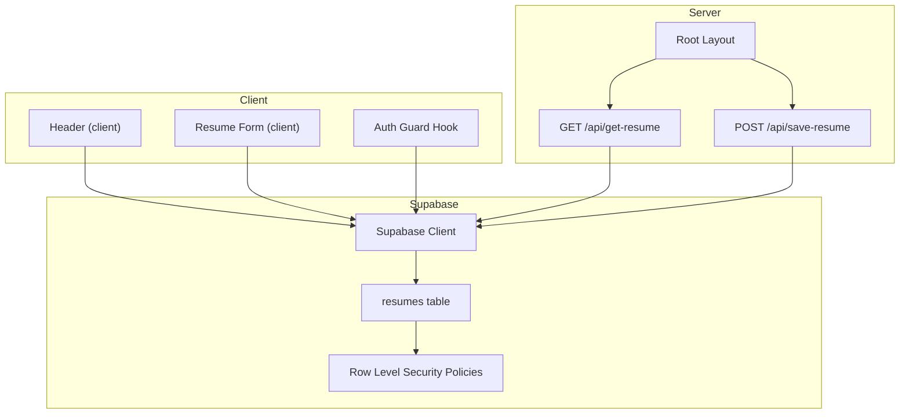
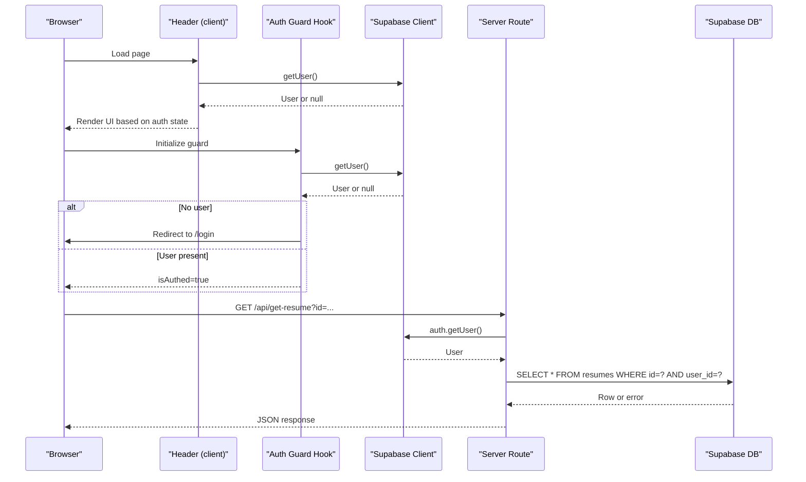
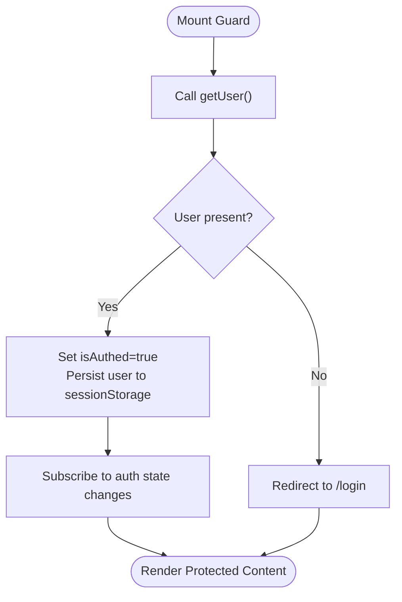
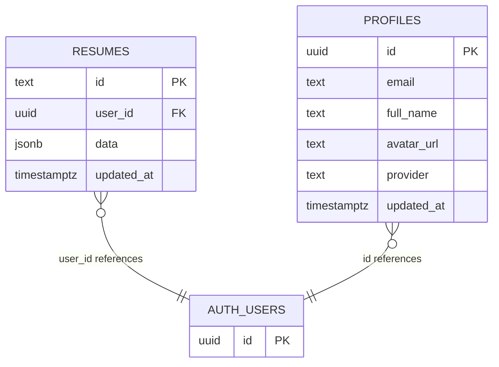
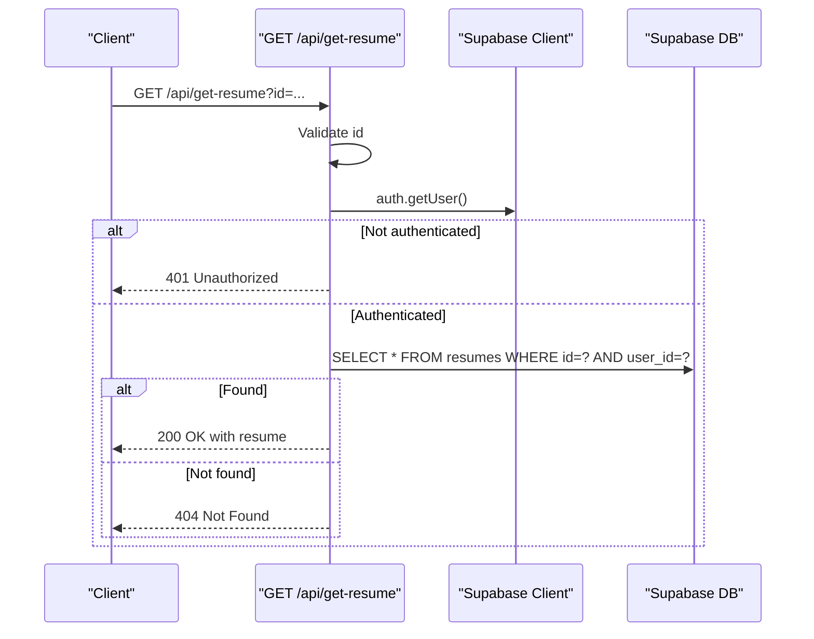
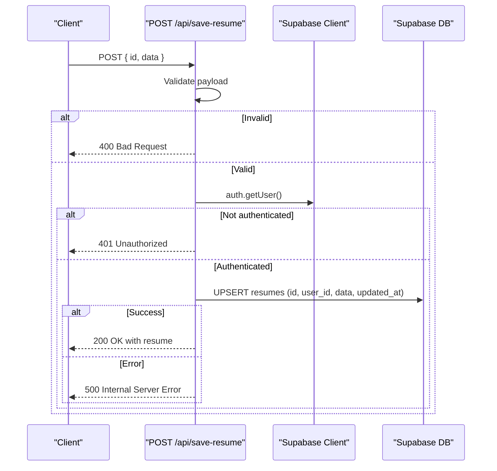
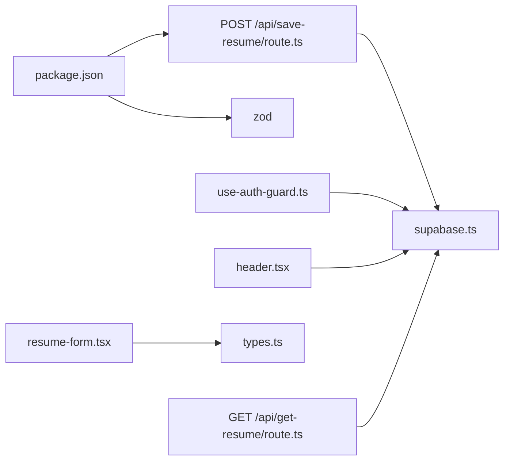

# Supabase Integration

<cite>
**Referenced Files in This Document**
- [supabase.ts](file://src/lib/supabase.ts)
- [use-auth-guard.ts](file://src/hooks/use-auth-guard.ts)
- [route.ts](file://src/app/api/get-resume/route.ts)
- [route.ts](file://src/app/api/save-resume/route.ts)
- [supabase-setup.sql](file://supabase-setup.sql)
- [types.ts](file://src/lib/types.ts)
- [header.tsx](file://src/components/layout/header.tsx)
- [resume-form.tsx](file://src/components/resume/resume-form.tsx)
- [package.json](file://package.json)
- [GOOGLE_OAUTH_SETUP.md](file://GOOGLE_OAUTH_SETUP.md)
- [next.config.ts](file://next.config.ts)
- [tsconfig.json](file://tsconfig.json)
- [layout.tsx](file://src/app/layout.tsx)
</cite>

## Table of Contents
1. [Introduction](#introduction)
2. [Project Structure](#project-structure)
3. [Core Components](#core-components)
4. [Architecture Overview](#architecture-overview)
5. [Detailed Component Analysis](#detailed-component-analysis)
6. [Dependency Analysis](#dependency-analysis)
7. [Performance Considerations](#performance-considerations)
8. [Troubleshooting Guide](#troubleshooting-guide)
9. [Conclusion](#conclusion)
10. [Appendices](#appendices)

## Introduction
This document explains how Supabase is integrated into the nh.intern application. It covers client initialization, authentication configuration, session management, and database connectivity. It also documents the resumes table schema, CRUD operations via API routes, access control patterns, environment configuration, security considerations, and integration patterns with Next.js server components and client-side guards.

## Project Structure
The Supabase integration centers around a shared client module, authentication guards, and two API endpoints for resume operations. Supporting files define the database schema and TypeScript types for resume data.

**Diagram sources**
- [header.tsx:12-32](file://src/components/layout/header.tsx#L12-L32)
- [resume-form.tsx:19-82](file://src/components/resume/resume-form.tsx#L19-L82)
- [use-auth-guard.ts:11-56](file://src/hooks/use-auth-guard.ts#L11-L56)
- [layout.tsx:25-49](file://src/app/layout.tsx#L25-L49)
- [route.ts:10-57](file://src/app/api/get-resume/route.ts#L10-L57)
- [route.ts:31-82](file://src/app/api/save-resume/route.ts#L31-L82)
- [supabase.ts:10-25](file://src/lib/supabase.ts#L10-L25)
- [supabase-setup.sql:4-19](file://supabase-setup.sql#L4-L19)

**Section sources**
- [supabase.ts:1-35](file://src/lib/supabase.ts#L1-L35)
- [use-auth-guard.ts:1-57](file://src/hooks/use-auth-guard.ts#L1-L57)
- [route.ts:1-58](file://src/app/api/get-resume/route.ts#L1-L58)
- [route.ts:1-83](file://src/app/api/save-resume/route.ts#L1-L83)
- [supabase-setup.sql:1-58](file://supabase-setup.sql#L1-L58)
- [types.ts:1-103](file://src/lib/types.ts#L1-L103)
- [header.tsx:1-101](file://src/components/layout/header.tsx#L1-L101)
- [resume-form.tsx:1-84](file://src/components/resume/resume-form.tsx#L1-L84)
- [layout.tsx:1-50](file://src/app/layout.tsx#L1-L50)

## Core Components
- Supabase client initialization with environment variables, automatic token refresh, persisted sessions, and request headers.
- Authentication guard hook that checks user sessions and subscribes to auth state changes.
- API endpoints for retrieving and saving resumes with user authentication and access control.
- Database schema for resumes and profiles with Row Level Security (RLS) policies.
- TypeScript types for resume data structures.

**Section sources**
- [supabase.ts:10-25](file://src/lib/supabase.ts#L10-L25)
- [use-auth-guard.ts:11-56](file://src/hooks/use-auth-guard.ts#L11-L56)
- [route.ts:10-57](file://src/app/api/get-resume/route.ts#L10-L57)
- [route.ts:31-82](file://src/app/api/save-resume/route.ts#L31-L82)
- [supabase-setup.sql:4-19](file://supabase-setup.sql#L4-L19)
- [types.ts:69-103](file://src/lib/types.ts#L69-L103)

## Architecture Overview
The application uses a client-side Supabase client initialized from a shared module. Client components and hooks use the client to manage authentication state. Server routes validate authentication and enforce access control by checking the authenticated user and applying RLS policies on the resumes table.

**Diagram sources**
- [header.tsx:16-24](file://src/components/layout/header.tsx#L16-L24)
- [use-auth-guard.ts:17-36](file://src/hooks/use-auth-guard.ts#L17-L36)
- [route.ts:24-47](file://src/app/api/get-resume/route.ts#L24-L47)
- [supabase.ts:10-25](file://src/lib/supabase.ts#L10-L25)

## Detailed Component Analysis

### Supabase Client Initialization
- Environment variables:
  - NEXT_PUBLIC_SUPABASE_URL: Supabase project URL (fallback value included for development).
  - NEXT_PUBLIC_SUPABASE_ANON_KEY: Supabase anonymous API key.
- Client configuration:
  - Auto-refresh tokens, persisted sessions, and detection of session in URL.
  - Global headers include an application name for observability.
  - Database schema set to public.
  - Development mode performs a non-blocking session retrieval test with warnings on failure.

**Section sources**
- [supabase.ts:3-8](file://src/lib/supabase.ts#L3-L8)
- [supabase.ts:10-25](file://src/lib/supabase.ts#L10-L25)
- [supabase.ts:27-33](file://src/lib/supabase.ts#L27-L33)

### Authentication Guard (Client-Side)
- Purpose: Ensure protected pages are only rendered for authenticated users.
- Behavior:
  - On mount, fetch current user and redirect to /login if missing.
  - Subscribe to auth state changes and update internal state accordingly.
  - Persist minimal user info to sessionStorage for backward compatibility.
  - On network errors during auth check, still renders to avoid blocking UX.

**Diagram sources**
- [use-auth-guard.ts:17-36](file://src/hooks/use-auth-guard.ts#L17-L36)
- [use-auth-guard.ts:42-50](file://src/hooks/use-auth-guard.ts#L42-L50)

**Section sources**
- [use-auth-guard.ts:11-56](file://src/hooks/use-auth-guard.ts#L11-L56)

### Resumes Table Schema and Access Control
- Table definition:
  - id: text (primary key).
  - user_id: uuid referencing auth.users with cascade delete.
  - data: jsonb storing structured resume content.
  - updated_at: timestamp with timezone.
- Row Level Security:
  - Users can select, insert, update, and delete only their own rows where user_id matches auth.uid().
- Profiles table:
  - Extended user data with RLS policies allowing self-view and self-update.
  - Trigger to synchronize auth.users to profiles on creation.

**Diagram sources**
- [supabase-setup.sql:4-9](file://supabase-setup.sql#L4-L9)
- [supabase-setup.sql:21-29](file://supabase-setup.sql#L21-L29)
- [supabase-setup.sql:38-57](file://supabase-setup.sql#L38-L57)

**Section sources**
- [supabase-setup.sql:4-19](file://supabase-setup.sql#L4-L19)
- [supabase-setup.sql:21-37](file://supabase-setup.sql#L21-L37)
- [supabase-setup.sql:38-57](file://supabase-setup.sql#L38-L57)

### Resume Data Types
- Strongly typed resume structure including personal info, experience, education, skills, projects, certifications, achievements, languages, and links.
- Initial empty state for form scaffolding.

**Section sources**
- [types.ts:1-103](file://src/lib/types.ts#L1-L103)

### GET /api/get-resume
- Validates query parameter id.
- Requires authenticated user via getUser().
- Fetches a single resume row filtered by id and user_id.
- Returns 401 if unauthenticated, 404 if not found, or 500 on unexpected errors.

**Diagram sources**
- [route.ts:10-22](file://src/app/api/get-resume/route.ts#L10-L22)
- [route.ts:24-32](file://src/app/api/get-resume/route.ts#L24-L32)
- [route.ts:34-47](file://src/app/api/get-resume/route.ts#L34-L47)

**Section sources**
- [route.ts:10-57](file://src/app/api/get-resume/route.ts#L10-L57)

### POST /api/save-resume
- Validates request body against a Zod schema for resume data.
- Requires authenticated user via getUser().
- Upserts a resume row with id, user_id, data payload, and updated_at timestamp.
- Returns 400 for invalid data, 401 for missing auth, 500 on DB errors, otherwise 200 with saved resume.

**Diagram sources**
- [route.ts:31-42](file://src/app/api/save-resume/route.ts#L31-L42)
- [route.ts:46-54](file://src/app/api/save-resume/route.ts#L46-L54)
- [route.ts:56-74](file://src/app/api/save-resume/route.ts#L56-L74)

**Section sources**
- [route.ts:31-82](file://src/app/api/save-resume/route.ts#L31-L82)

### Frontend Integration Patterns
- Header component:
  - Uses client directive to fetch current user and subscribe to auth state changes.
  - Displays user email and logout option when authenticated.
- Resume form:
  - Client component that composes multiple field sections and updates resume data.

**Section sources**
- [header.tsx:12-32](file://src/components/layout/header.tsx#L12-L32)
- [resume-form.tsx:19-82](file://src/components/resume/resume-form.tsx#L19-L82)

### Next.js Integration
- Root layout wraps children with theme provider and error boundary.
- Next.js configuration and TypeScript paths are set up for the project.

**Section sources**
- [layout.tsx:25-49](file://src/app/layout.tsx#L25-L49)
- [next.config.ts:1-8](file://next.config.ts#L1-L8)
- [tsconfig.json:21-23](file://tsconfig.json#L21-L23)

## Dependency Analysis
- Runtime dependencies include @supabase/supabase-js and zod for schema validation.
- Supabase client is imported by hooks, components, and server routes.
- API routes depend on the shared client for authentication and database operations.

**Diagram sources**
- [package.json:11-31](file://package.json#L11-L31)
- [use-auth-guard.ts:3](file://src/hooks/use-auth-guard.ts#L3)
- [header.tsx:8](file://src/components/layout/header.tsx#L8)
- [resume-form.tsx:12](file://src/components/resume/resume-form.tsx#L12)
- [route.ts](file://src/app/api/get-resume/route.ts#L2)
- [route.ts](file://src/app/api/save-resume/route.ts#L2)
- [supabase.ts:1](file://src/lib/supabase.ts#L1)

**Section sources**
- [package.json:11-31](file://package.json#L11-L31)
- [supabase.ts:1](file://src/lib/supabase.ts#L1)
- [use-auth-guard.ts:3](file://src/hooks/use-auth-guard.ts#L3)
- [header.tsx:8](file://src/components/layout/header.tsx#L8)
- [resume-form.tsx:12](file://src/components/resume/resume-form.tsx#L12)
- [route.ts](file://src/app/api/get-resume/route.ts#L2)
- [route.ts](file://src/app/api/save-resume/route.ts#L2)

## Performance Considerations
- Client initialization sets autoRefreshToken and persistSession to minimize re-auth prompts and improve UX.
- API routes validate inputs early to fail fast and reduce unnecessary database calls.
- Using single-row selectors and upserts keeps database operations efficient.
- Consider adding caching headers or CDN for static assets and monitoring Supabase metrics for latency.

## Troubleshooting Guide
- Authentication issues:
  - Symptom: Redirect to /login unexpectedly or inability to access protected routes.
  - Checks:
    - Verify NEXT_PUBLIC_SUPABASE_URL and NEXT_PUBLIC_SUPABASE_ANON_KEY are set in environment.
    - Confirm Supabase project allows requests from the site URL and callback redirects.
    - Inspect browser storage for persisted session and sessionStorage entries.
- Connection problems:
  - Symptom: Warnings about Supabase connection during development startup.
  - Checks:
    - Ensure Supabase project is reachable and credentials are correct.
    - Review network tab for blocked requests or CORS errors.
- Database access errors:
  - Symptom: 404 when fetching resumes or 500 on save.
  - Checks:
    - Confirm the authenticated user matches the resume’s user_id.
    - Verify RLS policies allow select/update/delete for the authenticated user.
    - Check that the resumes table exists and schema is public.
- OAuth sign-in issues:
  - Follow the Google OAuth setup guide to configure client IDs, authorized origins, and redirect URIs in Google Cloud Console and Supabase Dashboard.

**Section sources**
- [supabase.ts:27-33](file://src/lib/supabase.ts#L27-L33)
- [GOOGLE_OAUTH_SETUP.md:1-49](file://GOOGLE_OAUTH_SETUP.md#L1-L49)
- [supabase-setup.sql:11-19](file://supabase-setup.sql#L11-L19)

## Conclusion
The nh.intern application integrates Supabase through a centralized client, robust authentication guards, and secure API endpoints. The resumes table enforces strict access control via RLS, while the frontend components and hooks provide a responsive authentication experience. Following the configuration and troubleshooting guidance ensures reliable authentication, database connectivity, and user session handling.

## Appendices

### Configuration Requirements and Environment Variables
- NEXT_PUBLIC_SUPABASE_URL: Supabase project URL.
- NEXT_PUBLIC_SUPABASE_ANON_KEY: Supabase anonymous API key.
- Ensure these variables are present in the runtime environment and match the Supabase project settings.

**Section sources**
- [supabase.ts:3-8](file://src/lib/supabase.ts#L3-L8)

### Security Considerations
- RLS policies restrict access to user-owned records.
- Use HTTPS and secure cookies for production deployments.
- Limit exposed environment variables and rotate keys periodically.
- Validate and sanitize all incoming data using Zod schemas in API routes.

**Section sources**
- [supabase-setup.sql:11-19](file://supabase-setup.sql#L11-L19)
- [route.ts:15-22](file://src/app/api/get-resume/route.ts#L15-L22)
- [route.ts:36-42](file://src/app/api/save-resume/route.ts#L36-L42)