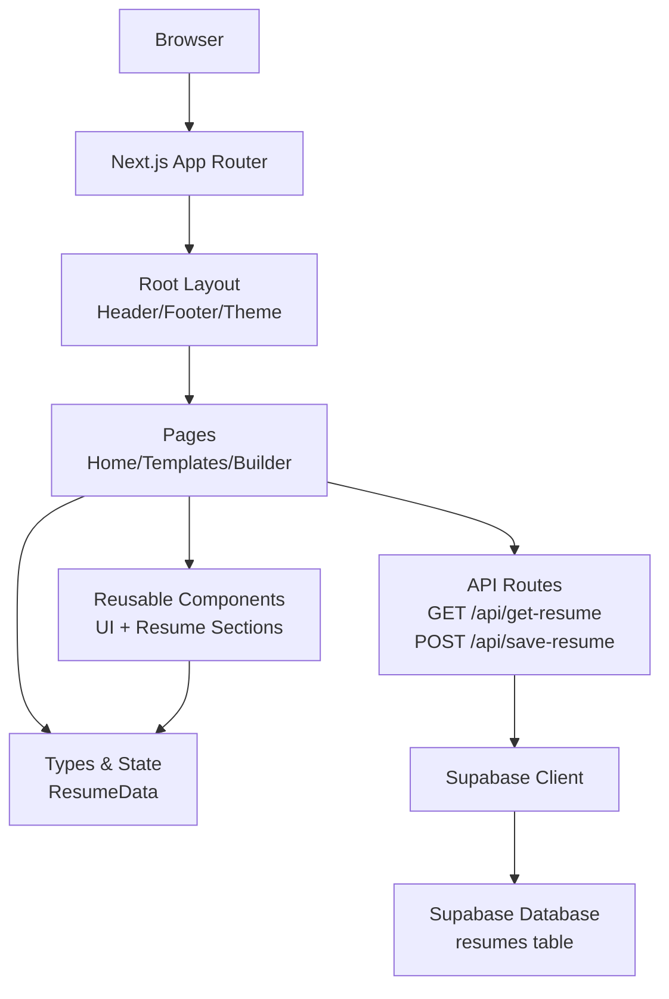
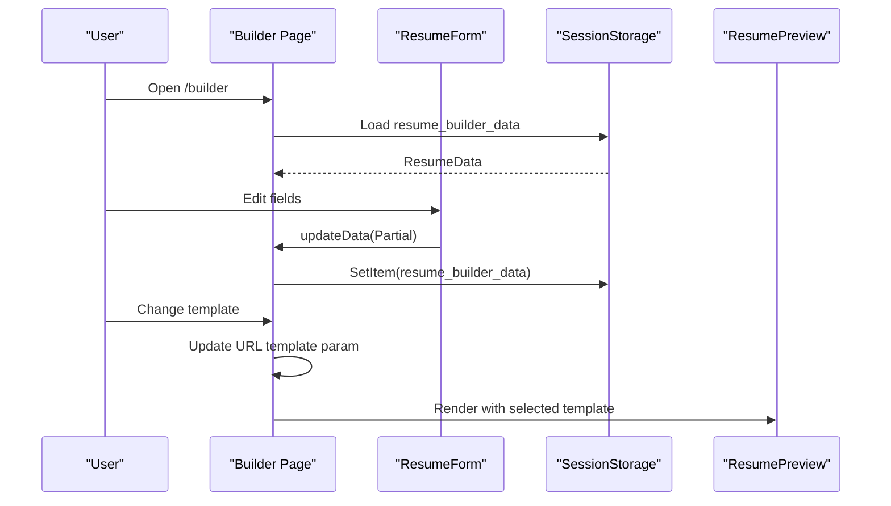
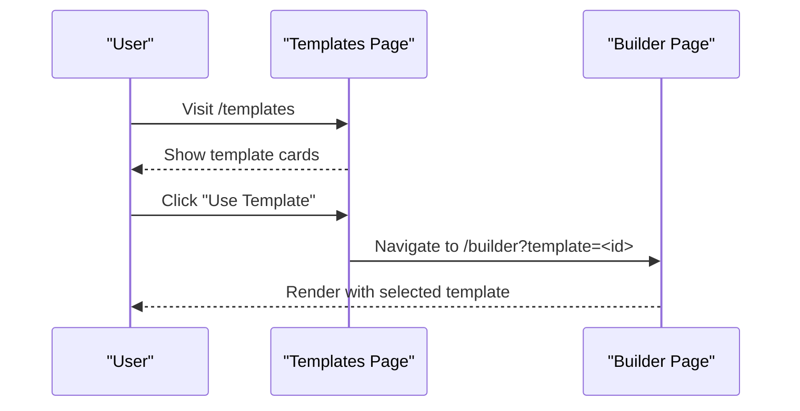
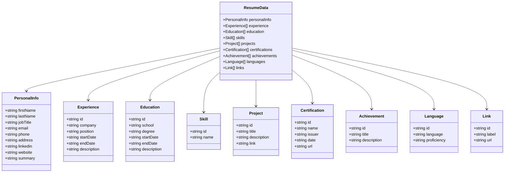
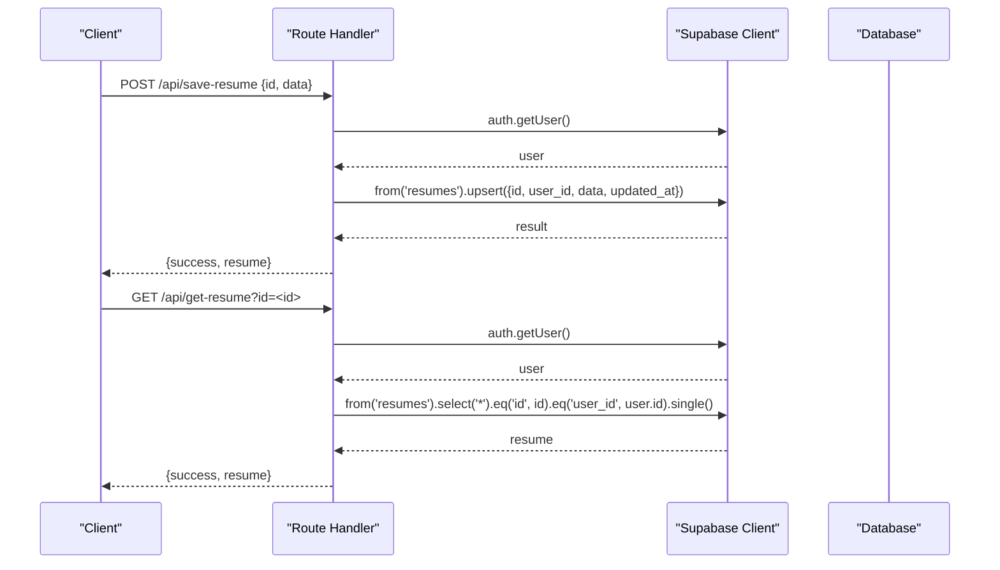
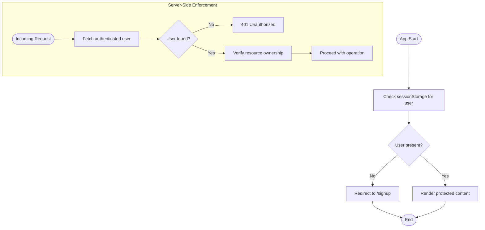
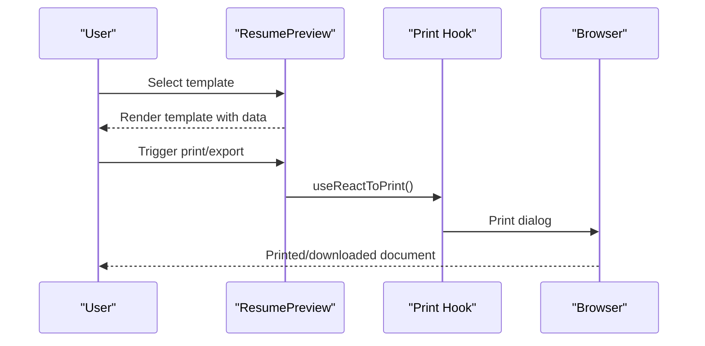
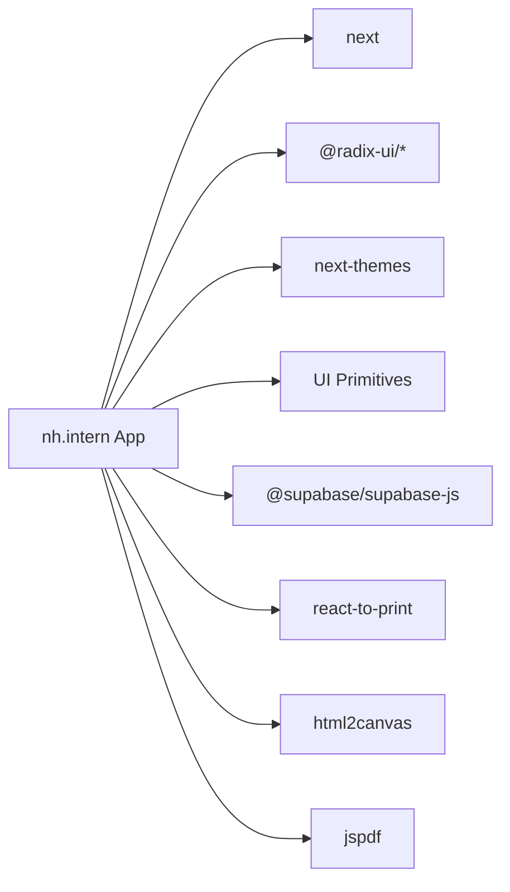

# Architecture Overview

<cite>
**Referenced Files in This Document**
- [README.md](file://README.md)
- [package.json](file://package.json)
- [next.config.ts](file://next.config.ts)
- [tsconfig.json](file://tsconfig.json)
- [src/app/layout.tsx](file://src/app/layout.tsx)
- [src/components/theme-provider.tsx](file://src/components/theme-provider.tsx)
- [src/components/layout/header.tsx](file://src/components/layout/header.tsx)
- [src/components/layout/footer.tsx](file://src/components/layout/footer.tsx)
- [src/components/layout/theme-toggle.tsx](file://src/components/layout/theme-toggle.tsx)
- [src/lib/supabase.ts](file://src/lib/supabase.ts)
- [src/lib/types.ts](file://src/lib/types.ts)
- [src/hooks/use-auth-guard.ts](file://src/hooks/use-auth-guard.ts)
- [src/app/page.tsx](file://src/app/page.tsx)
- [src/app/templates/page.tsx](file://src/app/templates/page.tsx)
- [src/app/builder/page.tsx](file://src/app/builder/page.tsx)
- [src/components/resume/resume-form.tsx](file://src/components/resume/resume-form.tsx)
- [src/components/resume/resume-preview.tsx](file://src/components/resume/resume-preview.tsx)
- [src/components/resume/template-switcher.tsx](file://src/components/resume/template-switcher.tsx)
- [src/components/resume/personal-info.tsx](file://src/components/resume/personal-info.tsx)
- [src/components/resume/experience.tsx](file://src/components/resume/experience.tsx)
- [src/components/resume/education.tsx](file://src/components/resume/education.tsx)
- [src/components/resume/skills.tsx](file://src/components/resume/skills.tsx)
- [src/components/resume/projects.tsx](file://src/components/resume/projects.tsx)
- [src/components/resume/certifications.tsx](file://src/components/resume/certifications.tsx)
- [src/components/resume/achievements.tsx](file://src/components/resume/achievements.tsx)
- [src/components/resume/languages.tsx](file://src/components/resume/languages.tsx)
- [src/components/resume/links.tsx](file://src/components/resume/links.tsx)
- [src/components/resume/progress-bar.tsx](file://src/components/resume/progress-bar.tsx)
- [src/app/api/get-resume/route.ts](file://src/app/api/get-resume/route.ts)
- [src/app/api/save-resume/route.ts](file://src/app/api/save-resume/route.ts)
</cite>

## Table of Contents
1. [Introduction](#introduction)
2. [Project Structure](#project-structure)
3. [Core Components](#core-components)
4. [Architecture Overview](#architecture-overview)
5. [Detailed Component Analysis](#detailed-component-analysis)
6. [Dependency Analysis](#dependency-analysis)
7. [Performance Considerations](#performance-considerations)
8. [Troubleshooting Guide](#troubleshooting-guide)
9. [Conclusion](#conclusion)
10. [Appendices](#appendices)

## Introduction
This document describes the architecture of the nh.intern application, a Next.js-powered resume builder. It follows the Next.js App Router pattern with a component-based design and React hooks for state management. The system integrates with Supabase for authentication and data persistence, and exposes API routes for saving and retrieving resume documents. The architecture emphasizes separation of concerns across frontend pages, reusable UI components, and backend API routes, while maintaining responsive design and theme support.

## Project Structure
The project is organized around Next.js App Router conventions:
- Pages under src/app define route segments (/, /templates, /builder).
- Shared UI components live under src/components.
- Utilities and integrations (Supabase client, types) live under src/lib.
- Hooks and providers live under src/hooks and src/components respectively.
- Global styles and fonts are configured in the root layout.

```mermaid
graph TB
subgraph "Next.js App Router"
ROOT["src/app/layout.tsx"]
HOME["src/app/page.tsx"]
TEMPLATES["src/app/templates/page.tsx"]
BUILDER["src/app/builder/page.tsx"]
API_GET["src/app/api/get-resume/route.ts"]
API_SAVE["src/app/api/save-resume/route.ts"]
end
subgraph "Components"
HEADER["src/components/layout/header.tsx"]
THEME["src/components/theme-provider.tsx"]
FOOTER["src/components/layout/footer.tsx"]
RESUME_FORM["src/components/resume/resume-form.tsx"]
RESUME_PREVIEW["src/components/resume/resume-preview.tsx"]
TEMPLATE_SWITCHER["src/components/resume/template-switcher.tsx"]
PERSONAL_INFO["src/components/resume/personal-info.tsx"]
EXPERIENCE["src/components/resume/experience.tsx"]
EDUCATION["src/components/resume/education.tsx"]
SKILLS["src/components/resume/skills.tsx"]
PROJECTS["src/components/resume/projects.tsx"]
CERTIFICATIONS["src/components/resume/certifications.tsx"]
ACHIEVEMENTS["src/components/resume/achievements.tsx"]
LANGUAGES["src/components/resume/languages.tsx"]
LINKS["src/components/resume/links.tsx"]
PROGRESS["src/components/resume/progress-bar.tsx"]
end
subgraph "Lib & Hooks"
TYPES["src/lib/types.ts"]
SUPABASE["src/lib/supabase.ts"]
AUTH_GUARD["src/hooks/use-auth-guard.ts"]
end
ROOT --> HEADER
ROOT --> THEME
ROOT --> FOOTER
HOME --> HEADER
TEMPLATES --> HEADER
BUILDER --> HEADER
BUILDER --> RESUME_FORM
BUILDER --> RESUME_PREVIEW
BUILDER --> TEMPLATE_SWITCHER
RESUME_FORM --> PERSONAL_INFO
RESUME_FORM --> EXPERIENCE
RESUME_FORM --> EDUCATION
RESUME_FORM --> SKILLS
RESUME_FORM --> PROJECTS
RESUME_FORM --> CERTIFICATIONS
RESUME_FORM --> ACHIEVEMENTS
RESUME_FORM --> LANGUAGES
RESUME_FORM --> LINKS
RESUME_FORM --> PROGRESS
BUILDER --> TYPES
RESUME_PREVIEW --> TYPES
API_GET --> SUPABASE
API_SAVE --> SUPABASE
HOME --> TYPES
TEMPLATES --> TYPES
AUTH_GUARD --> BUILDER
```

**Diagram sources**
- [src/app/layout.tsx:24-46](file://src/app/layout.tsx#L24-L46)
- [src/app/page.tsx:1-178](file://src/app/page.tsx#L1-L178)
- [src/app/templates/page.tsx:1-178](file://src/app/templates/page.tsx#L1-L178)
- [src/app/builder/page.tsx:1-79](file://src/app/builder/page.tsx#L1-L79)
- [src/components/resume/resume-form.tsx:1-84](file://src/components/resume/resume-form.tsx#L1-L84)
- [src/components/resume/resume-preview.tsx:789-800](file://src/components/resume/resume-preview.tsx#L789-L800)
- [src/components/resume/template-switcher.tsx](file://src/components/resume/template-switcher.tsx)
- [src/components/resume/personal-info.tsx](file://src/components/resume/personal-info.tsx)
- [src/components/resume/experience.tsx](file://src/components/resume/experience.tsx)
- [src/components/resume/education.tsx](file://src/components/resume/education.tsx)
- [src/components/resume/skills.tsx](file://src/components/resume/skills.tsx)
- [src/components/resume/projects.tsx](file://src/components/resume/projects.tsx)
- [src/components/resume/certifications.tsx](file://src/components/resume/certifications.tsx)
- [src/components/resume/achievements.tsx](file://src/components/resume/achievements.tsx)
- [src/components/resume/languages.tsx](file://src/components/resume/languages.tsx)
- [src/components/resume/links.tsx](file://src/components/resume/links.tsx)
- [src/components/resume/progress-bar.tsx](file://src/components/resume/progress-bar.tsx)
- [src/lib/types.ts:69-103](file://src/lib/types.ts#L69-L103)
- [src/lib/supabase.ts:1-11](file://src/lib/supabase.ts#L1-L11)
- [src/hooks/use-auth-guard.ts:1-25](file://src/hooks/use-auth-guard.ts#L1-L25)
- [src/app/api/get-resume/route.ts:1-50](file://src/app/api/get-resume/route.ts#L1-L50)
- [src/app/api/save-resume/route.ts:1-52](file://src/app/api/save-resume/route.ts#L1-L52)

**Section sources**
- [README.md:1-37](file://README.md#L1-L37)
- [package.json:1-42](file://package.json#L1-L42)
- [src/app/layout.tsx:1-47](file://src/app/layout.tsx#L1-L47)

## Core Components
- Layout and Theming
  - Root layout composes global fonts, theme provider, and shared header/footer.
  - Theme provider enables light/dark mode switching with persistent preference.
- Authentication Guard
  - Client-side guard checks session storage for user presence and redirects unauthenticated users to sign up.
- Resume Builder
  - Builder page orchestrates form editing and live preview, with template selection and progress tracking.
  - Resume form composes domain-specific sections (personal info, experience, education, skills, projects, certifications, achievements, languages, links).
  - Resume preview renders a selected template with print/export capabilities.
- Templates Catalog
  - Templates page lists available resume designs with hover actions and direct linking to the builder with a chosen template.
- API Routes
  - Save resume persists or updates a resume record bound to the authenticated user.
  - Get resume retrieves a single resume by ID owned by the authenticated user.

**Section sources**
- [src/app/layout.tsx:24-46](file://src/app/layout.tsx#L24-L46)
- [src/components/theme-provider.tsx:1-10](file://src/components/theme-provider.tsx#L1-L10)
- [src/components/layout/header.tsx:1-44](file://src/components/layout/header.tsx#L1-L44)
- [src/hooks/use-auth-guard.ts:1-25](file://src/hooks/use-auth-guard.ts#L1-L25)
- [src/app/builder/page.tsx:1-79](file://src/app/builder/page.tsx#L1-L79)
- [src/components/resume/resume-form.tsx:1-84](file://src/components/resume/resume-form.tsx#L1-L84)
- [src/components/resume/resume-preview.tsx:789-800](file://src/components/resume/resume-preview.tsx#L789-L800)
- [src/app/templates/page.tsx:1-178](file://src/app/templates/page.tsx#L1-L178)
- [src/app/api/save-resume/route.ts:1-52](file://src/app/api/save-resume/route.ts#L1-L52)
- [src/app/api/get-resume/route.ts:1-50](file://src/app/api/get-resume/route.ts#L1-L50)

## Architecture Overview
The system follows a layered architecture:
- Presentation Layer: Next.js App Router pages and components.
- Domain Layer: Resume data model and form composition.
- Integration Layer: Supabase client and API routes.
- Persistence Layer: Supabase database (resumes table).

**Diagram sources**
- [src/app/layout.tsx:24-46](file://src/app/layout.tsx#L24-L46)
- [src/app/page.tsx:1-178](file://src/app/page.tsx#L1-L178)
- [src/app/templates/page.tsx:1-178](file://src/app/templates/page.tsx#L1-L178)
- [src/app/builder/page.tsx:1-79](file://src/app/builder/page.tsx#L1-L79)
- [src/components/resume/resume-form.tsx:1-84](file://src/components/resume/resume-form.tsx#L1-L84)
- [src/lib/types.ts:69-103](file://src/lib/types.ts#L69-L103)
- [src/app/api/get-resume/route.ts:1-50](file://src/app/api/get-resume/route.ts#L1-L50)
- [src/app/api/save-resume/route.ts:1-52](file://src/app/api/save-resume/route.ts#L1-L52)
- [src/lib/supabase.ts:1-11](file://src/lib/supabase.ts#L1-L11)

## Detailed Component Analysis

### Builder Page and Live Editing
The builder coordinates real-time editing and preview:
- Initializes state from session storage to persist edits locally.
- Updates state on form changes and syncs to session storage.
- Navigates template selection via URL search params.
- Renders a split-pane editor and preview with a selected template.

**Diagram sources**
- [src/app/builder/page.tsx:11-79](file://src/app/builder/page.tsx#L11-L79)
- [src/components/resume/resume-form.tsx:19-84](file://src/components/resume/resume-form.tsx#L19-L84)
- [src/components/resume/resume-preview.tsx:789-800](file://src/components/resume/resume-preview.tsx#L789-L800)

**Section sources**
- [src/app/builder/page.tsx:1-79](file://src/app/builder/page.tsx#L1-L79)
- [src/components/resume/resume-form.tsx:1-84](file://src/components/resume/resume-form.tsx#L1-L84)
- [src/components/resume/resume-preview.tsx:789-800](file://src/components/resume/resume-preview.tsx#L789-L800)

### Templates Catalog and Selection
The templates page presents a grid of resume designs with hover actions and direct links to the builder with a chosen template.

**Diagram sources**
- [src/app/templates/page.tsx:76-178](file://src/app/templates/page.tsx#L76-L178)
- [src/app/builder/page.tsx:11-79](file://src/app/builder/page.tsx#L11-L79)

**Section sources**
- [src/app/templates/page.tsx:1-178](file://src/app/templates/page.tsx#L1-L178)

### Resume Data Model and Composition
The resume data model defines typed sections and initial state. The form composes domain-specific components that propagate partial updates to the parent state.

**Diagram sources**
- [src/lib/types.ts:1-103](file://src/lib/types.ts#L1-L103)

**Section sources**
- [src/lib/types.ts:69-103](file://src/lib/types.ts#L69-L103)
- [src/components/resume/resume-form.tsx:1-84](file://src/components/resume/resume-form.tsx#L1-L84)

### Supabase Integration and API Routes
The API routes encapsulate Supabase operations:
- Save resume: Upserts a resume record with user binding and updated timestamp.
- Get resume: Fetches a single resume by ID and enforces ownership via user context.

**Diagram sources**
- [src/app/api/save-resume/route.ts:1-52](file://src/app/api/save-resume/route.ts#L1-L52)
- [src/app/api/get-resume/route.ts:1-50](file://src/app/api/get-resume/route.ts#L1-L50)
- [src/lib/supabase.ts:1-11](file://src/lib/supabase.ts#L1-L11)

**Section sources**
- [src/app/api/save-resume/route.ts:1-52](file://src/app/api/save-resume/route.ts#L1-L52)
- [src/app/api/get-resume/route.ts:1-50](file://src/app/api/get-resume/route.ts#L1-L50)
- [src/lib/supabase.ts:1-11](file://src/lib/supabase.ts#L1-L11)

### Authentication and Authorization Flow
The client-side guard ensures only authenticated users can access protected areas. The API routes enforce server-side authorization by verifying the authenticated user’s ownership of requested records.

**Diagram sources**
- [src/hooks/use-auth-guard.ts:1-25](file://src/hooks/use-auth-guard.ts#L1-L25)
- [src/app/api/get-resume/route.ts:16-24](file://src/app/api/get-resume/route.ts#L16-L24)
- [src/app/api/save-resume/route.ts:15-23](file://src/app/api/save-resume/route.ts#L15-L23)

**Section sources**
- [src/hooks/use-auth-guard.ts:1-25](file://src/hooks/use-auth-guard.ts#L1-L25)
- [src/app/api/get-resume/route.ts:1-50](file://src/app/api/get-resume/route.ts#L1-L50)
- [src/app/api/save-resume/route.ts:1-52](file://src/app/api/save-resume/route.ts#L1-L52)

### Template Rendering and Print Export
The preview component renders a selected template and integrates printing/export capabilities.

**Diagram sources**
- [src/components/resume/resume-preview.tsx:789-800](file://src/components/resume/resume-preview.tsx#L789-L800)

**Section sources**
- [src/components/resume/resume-preview.tsx:789-800](file://src/components/resume/resume-preview.tsx#L789-L800)

## Dependency Analysis
External dependencies and their roles:
- Next.js: App Router, SSR/SSG, and runtime.
- Radix UI and Tailwind-based UI primitives: Consistent component library.
- next-themes: Theme provider and toggle.
- @supabase/supabase-js: Supabase client for auth and database.
- react-to-print: Print/export integration.
- html2canvas/jspdf: Optional PDF generation utilities.

**Diagram sources**
- [package.json:11-29](file://package.json#L11-L29)

**Section sources**
- [package.json:1-42](file://package.json#L1-L42)

## Performance Considerations
- Client-side state persistence: Using session storage avoids unnecessary server requests during editing.
- Template rendering: Heavy DOM rendering is isolated to the preview pane; consider virtualization for very long content.
- API latency: Batch operations and caching strategies can reduce repeated fetches.
- Fonts and assets: Optimize font loading and template images for faster initial render.

## Troubleshooting Guide
- Authentication errors
  - Symptom: Requests to API routes fail with unauthorized responses.
  - Cause: Missing or invalid user context.
  - Resolution: Ensure the client-side guard redirects unauthenticated users and that the Supabase client is initialized with proper keys.
- Session storage corruption
  - Symptom: Builder resets to empty state unexpectedly.
  - Cause: Malformed or invalid JSON in session storage.
  - Resolution: Clear session storage entries and reload; the builder falls back to initial state.
- Template rendering issues
  - Symptom: Preview does not reflect edits.
  - Cause: State not updating or template switch not applied.
  - Resolution: Verify state updates and URL parameter propagation.

**Section sources**
- [src/hooks/use-auth-guard.ts:1-25](file://src/hooks/use-auth-guard.ts#L1-L25)
- [src/app/builder/page.tsx:16-36](file://src/app/builder/page.tsx#L16-L36)
- [src/app/api/get-resume/route.ts:16-24](file://src/app/api/get-resume/route.ts#L16-L24)
- [src/app/api/save-resume/route.ts:15-23](file://src/app/api/save-resume/route.ts#L15-L23)

## Conclusion
The nh.intern application employs a clean Next.js App Router architecture with a strong separation between presentation, domain, and integration layers. React hooks manage state efficiently, Supabase handles authentication and persistence, and the API routes provide secure, minimal interfaces for data operations. The design supports responsive theming, modular components, and scalable template rendering.

## Appendices
- Deployment topology considerations
  - Host on Vercel for seamless Next.js deployment.
  - Configure environment variables for Supabase URL and anonymous key.
  - Ensure database policies align with API route permissions.
- Cross-cutting concerns
  - Theming: Controlled centrally via theme provider and toggle.
  - Responsive design: Tailwind utilities and motion animations adapt to screen sizes.
  - Accessibility: Semantic HTML and focus management in interactive components.