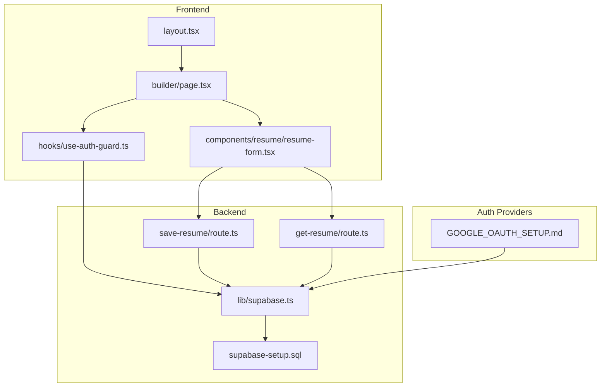
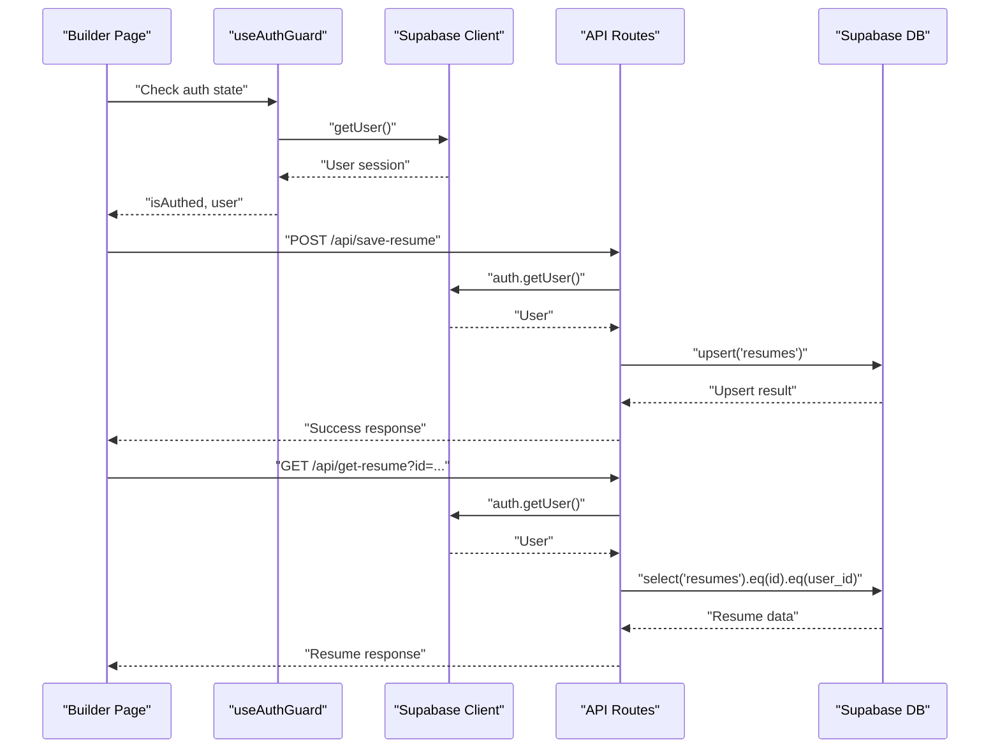
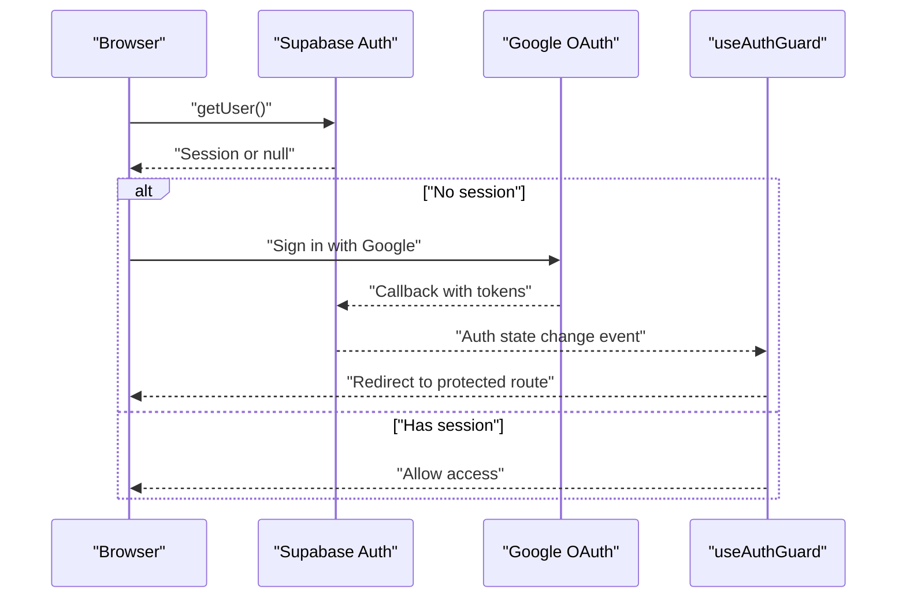
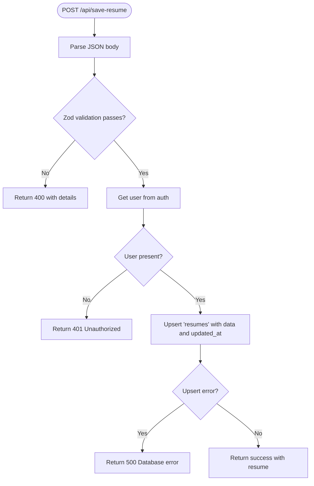
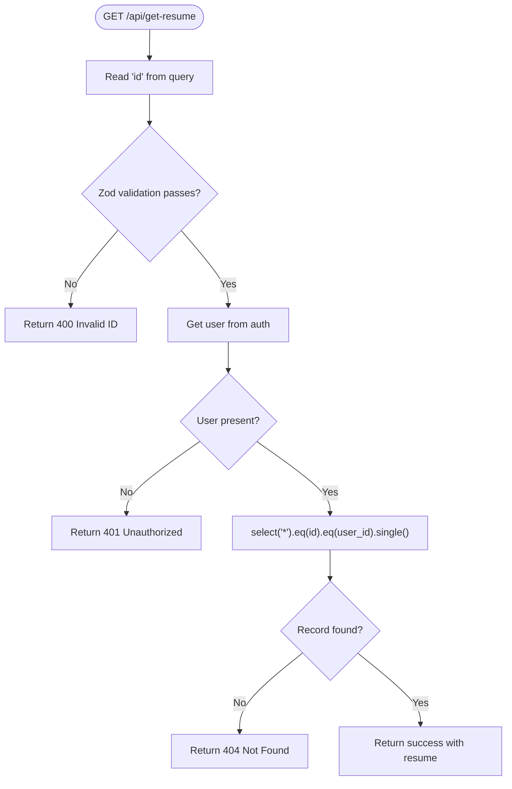
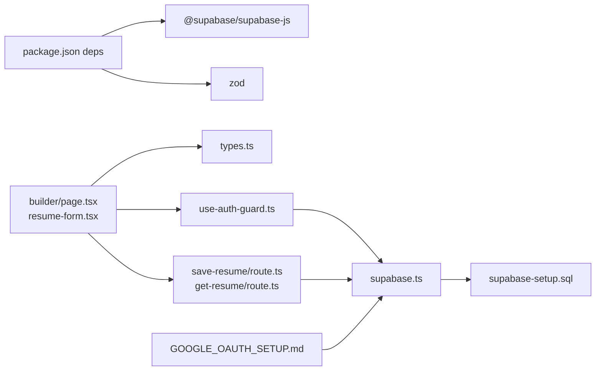

# Backend Integration

<cite>
**Referenced Files in This Document**
- [supabase.ts](file://src/lib/supabase.ts)
- [types.ts](file://src/lib/types.ts)
- [use-auth-guard.ts](file://src/hooks/use-auth-guard.ts)
- [save-resume route.ts](file://src/app/api/save-resume/route.ts)
- [get-resume route.ts](file://src/app/api/get-resume/route.ts)
- [supabase-setup.sql](file://supabase-setup.sql)
- [GOOGLE_OAUTH_SETUP.md](file://GOOGLE_OAUTH_SETUP.md)
- [package.json](file://package.json)
- [layout.tsx](file://src/app/layout.tsx)
- [page.tsx](file://src/app/builder/page.tsx)
- [resume-form.tsx](file://src/components/resume/resume-form.tsx)
- [next.config.ts](file://next.config.ts)
</cite>

## Table of Contents
1. [Introduction](#introduction)
2. [Project Structure](#project-structure)
3. [Core Components](#core-components)
4. [Architecture Overview](#architecture-overview)
5. [Detailed Component Analysis](#detailed-component-analysis)
6. [Dependency Analysis](#dependency-analysis)
7. [Performance Considerations](#performance-considerations)
8. [Troubleshooting Guide](#troubleshooting-guide)
9. [Conclusion](#conclusion)
10. [Appendices](#appendices)

## Introduction
This document explains the backend integration for the nh.intern application’s Supabase services. It covers Supabase client configuration, authentication flow using OAuth providers, database schema design for resume data persistence, API route implementations for saving and retrieving resume data, session management, security considerations, and deployment guidance for Supabase and Next.js/Vercel.

## Project Structure
The backend integration centers around:
- Supabase client initialization and configuration
- Authentication guard for client-side routing
- API routes for saving and retrieving resumes
- Database schema and Row Level Security (RLS) policies
- OAuth provider setup for Google sign-in
- Frontend pages and components that orchestrate resume data



**Diagram sources**
- [layout.tsx:1-50](file://src/app/layout.tsx#L1-L50)
- [page.tsx:1-79](file://src/app/builder/page.tsx#L1-L79)
- [resume-form.tsx:1-84](file://src/components/resume/resume-form.tsx#L1-L84)
- [use-auth-guard.ts:1-57](file://src/hooks/use-auth-guard.ts#L1-L57)
- [save-resume route.ts:1-83](file://src/app/api/save-resume/route.ts#L1-L83)
- [get-resume route.ts:1-58](file://src/app/api/get-resume/route.ts#L1-L58)
- [supabase.ts:1-35](file://src/lib/supabase.ts#L1-L35)
- [supabase-setup.sql:1-58](file://supabase-setup.sql#L1-L58)
- [GOOGLE_OAUTH_SETUP.md:1-49](file://GOOGLE_OAUTH_SETUP.md#L1-L49)

**Section sources**
- [layout.tsx:1-50](file://src/app/layout.tsx#L1-L50)
- [page.tsx:1-79](file://src/app/builder/page.tsx#L1-L79)
- [resume-form.tsx:1-84](file://src/components/resume/resume-form.tsx#L1-L84)
- [use-auth-guard.ts:1-57](file://src/hooks/use-auth-guard.ts#L1-L57)
- [supabase.ts:1-35](file://src/lib/supabase.ts#L1-L35)
- [save-resume route.ts:1-83](file://src/app/api/save-resume/route.ts#L1-L83)
- [get-resume route.ts:1-58](file://src/app/api/get-resume/route.ts#L1-L58)
- [supabase-setup.sql:1-58](file://supabase-setup.sql#L1-L58)
- [GOOGLE_OAUTH_SETUP.md:1-49](file://GOOGLE_OAUTH_SETUP.md#L1-L49)

## Core Components
- Supabase client configuration and initialization
- Authentication guard for client-side routing and session synchronization
- API routes for saving and retrieving resumes with validation and error handling
- Database schema and RLS policies for resumes and profiles
- OAuth provider setup for Google sign-in

**Section sources**
- [supabase.ts:1-35](file://src/lib/supabase.ts#L1-L35)
- [use-auth-guard.ts:1-57](file://src/hooks/use-auth-guard.ts#L1-L57)
- [save-resume route.ts:1-83](file://src/app/api/save-resume/route.ts#L1-L83)
- [get-resume route.ts:1-58](file://src/app/api/get-resume/route.ts#L1-L58)
- [supabase-setup.sql:1-58](file://supabase-setup.sql#L1-L58)
- [GOOGLE_OAUTH_SETUP.md:1-49](file://GOOGLE_OAUTH_SETUP.md#L1-L49)

## Architecture Overview
The frontend uses Supabase for authentication and database operations. Client-side components manage resume data locally and persist it via API routes. The API routes validate payloads, enforce authentication, and interact with Supabase tables secured by RLS policies.



**Diagram sources**
- [use-auth-guard.ts:1-57](file://src/hooks/use-auth-guard.ts#L1-L57)
- [supabase.ts:1-35](file://src/lib/supabase.ts#L1-L35)
- [save-resume route.ts:1-83](file://src/app/api/save-resume/route.ts#L1-L83)
- [get-resume route.ts:1-58](file://src/app/api/get-resume/route.ts#L1-L58)
- [supabase-setup.sql:1-58](file://supabase-setup.sql#L1-L58)

## Detailed Component Analysis

### Supabase Client Configuration
- Initializes the Supabase client with environment variables for URL and anonymous key
- Enables automatic token refresh, session persistence, and URL session detection
- Adds a custom header for application identification
- Includes a development-time connection test
- Uses the public schema for database operations

**Section sources**
- [supabase.ts:1-35](file://src/lib/supabase.ts#L1-L35)

### Authentication Flow Using OAuth Providers
- Client-side authentication guard checks user sessions and redirects unauthenticated users to the login page
- Subscribes to Supabase auth state changes to keep UI synchronized
- Stores minimal user info in sessionStorage for backward compatibility
- Google OAuth setup defines authorized origins and redirect URIs, and configures provider credentials in Supabase



**Diagram sources**
- [use-auth-guard.ts:1-57](file://src/hooks/use-auth-guard.ts#L1-L57)
- [GOOGLE_OAUTH_SETUP.md:1-49](file://GOOGLE_OAUTH_SETUP.md#L1-L49)

**Section sources**
- [use-auth-guard.ts:1-57](file://src/hooks/use-auth-guard.ts#L1-L57)
- [GOOGLE_OAUTH_SETUP.md:1-49](file://GOOGLE_OAUTH_SETUP.md#L1-L49)

### Database Schema Design for Resume Data Persistence
- Resumes table stores a unique string ID, foreign key to users, JSONB payload, and updated timestamp
- Profiles table mirrors user metadata and provider information
- Row Level Security policies restrict access to user-owned records
- A trigger synchronizes new users into the profiles table

```mermaid
erDiagram
USERS {
uuid id PK
}
RESUMES {
text id PK
uuid user_id FK
jsonb data
timestamptz updated_at
}
PROFILES {
uuid id PK FK
text email
text full_name
text avatar_url
text provider
timestamptz updated_at
}
USERS ||--o{ RESUMES : "owns"
USERS ||--o| PROFILES : "mirrors"
```

**Diagram sources**
- [supabase-setup.sql:1-58](file://supabase-setup.sql#L1-L58)

**Section sources**
- [supabase-setup.sql:1-58](file://supabase-setup.sql#L1-L58)

### API Route: Save Resume
- Validates incoming payload using Zod schema
- Enforces authentication via Supabase getUser
- Upserts resume data into the resumes table with updated timestamp
- Returns success with the persisted resume record



**Diagram sources**
- [save-resume route.ts:1-83](file://src/app/api/save-resume/route.ts#L1-L83)

**Section sources**
- [save-resume route.ts:1-83](file://src/app/api/save-resume/route.ts#L1-L83)

### API Route: Get Resume
- Extracts resume ID from query parameters and validates it
- Enforces authentication via Supabase getUser
- Performs a select with filters for id and user_id
- Returns either the resume or a 404 Not Found



**Diagram sources**
- [get-resume route.ts:1-58](file://src/app/api/get-resume/route.ts#L1-L58)

**Section sources**
- [get-resume route.ts:1-58](file://src/app/api/get-resume/route.ts#L1-L58)

### Data Types and Resume Model
- Defines typed interfaces for personal info, experiences, education, skills, projects, certifications, achievements, languages, and links
- Provides initial resume data structure for client-side defaults

**Section sources**
- [types.ts:1-103](file://src/lib/types.ts#L1-L103)

### Client-Side Resume Editor and Session Management
- Builder page manages resume data in sessionStorage and updates URL search params for templates
- Resume form composes individual sections and updates the overall data structure
- Layout wraps the app with theme and error boundaries

**Section sources**
- [page.tsx:1-79](file://src/app/builder/page.tsx#L1-L79)
- [resume-form.tsx:1-84](file://src/components/resume/resume-form.tsx#L1-L84)
- [layout.tsx:1-50](file://src/app/layout.tsx#L1-L50)

## Dependency Analysis
- Frontend depends on Supabase client for auth and DB operations
- API routes depend on Supabase client and Zod for validation
- Database depends on RLS policies and triggers for data integrity and synchronization
- OAuth provider setup depends on Google Cloud Console and Supabase dashboards



**Diagram sources**
- [package.json:1-43](file://package.json#L1-L43)
- [page.tsx:1-79](file://src/app/builder/page.tsx#L1-L79)
- [resume-form.tsx:1-84](file://src/components/resume/resume-form.tsx#L1-L84)
- [types.ts:1-103](file://src/lib/types.ts#L1-L103)
- [use-auth-guard.ts:1-57](file://src/hooks/use-auth-guard.ts#L1-L57)
- [supabase.ts:1-35](file://src/lib/supabase.ts#L1-L35)
- [save-resume route.ts:1-83](file://src/app/api/save-resume/route.ts#L1-L83)
- [get-resume route.ts:1-58](file://src/app/api/get-resume/route.ts#L1-L58)
- [supabase-setup.sql:1-58](file://supabase-setup.sql#L1-L58)
- [GOOGLE_OAUTH_SETUP.md:1-49](file://GOOGLE_OAUTH_SETUP.md#L1-L49)

**Section sources**
- [package.json:1-43](file://package.json#L1-L43)
- [supabase.ts:1-35](file://src/lib/supabase.ts#L1-L35)
- [save-resume route.ts:1-83](file://src/app/api/save-resume/route.ts#L1-L83)
- [get-resume route.ts:1-58](file://src/app/api/get-resume/route.ts#L1-L58)
- [supabase-setup.sql:1-58](file://supabase-setup.sql#L1-L58)
- [GOOGLE_OAUTH_SETUP.md:1-49](file://GOOGLE_OAUTH_SETUP.md#L1-L49)

## Performance Considerations
- Client-side caching: Resume data is stored in sessionStorage to reduce server calls during editing
- Efficient queries: API routes filter by both id and user_id to limit result sets
- RLS enforcement: Policies ensure minimal data exposure and efficient authorization checks
- CDN distribution: Deployed via Vercel’s Edge Network for low-latency global delivery
- Build optimization: Next.js configuration supports image optimization and CSS optimization

[No sources needed since this section provides general guidance]

## Troubleshooting Guide
- Supabase connection warnings in development indicate missing or invalid environment variables for URL and anonymous key
- Authentication guard handles network errors gracefully and avoids redirect loops
- API routes return structured error responses with appropriate HTTP status codes
- Database errors surface with detailed messages for debugging

**Section sources**
- [supabase.ts:27-33](file://src/lib/supabase.ts#L27-L33)
- [use-auth-guard.ts:32-36](file://src/hooks/use-auth-guard.ts#L32-L36)
- [save-resume route.ts:66-72](file://src/app/api/save-resume/route.ts#L66-L72)
- [get-resume route.ts:41-47](file://src/app/api/get-resume/route.ts#L41-L47)

## Conclusion
The nh.intern application integrates Supabase for secure, scalable authentication and data persistence. Client-side guards ensure protected access, while API routes validate inputs, enforce authentication, and persist resume data efficiently. Database RLS policies and triggers maintain data integrity and user ownership. The frontend leverages Next.js and Vercel’s Edge Network for fast, reliable delivery.

[No sources needed since this section summarizes without analyzing specific files]

## Appendices

### Environment Variables and Configuration
- Supabase client reads NEXT_PUBLIC_SUPABASE_URL and NEXT_PUBLIC_SUPABASE_ANON_KEY
- Development mode includes a non-blocking session test
- Next.js configuration file is present for future build customization

**Section sources**
- [supabase.ts:3-7](file://src/lib/supabase.ts#L3-L7)
- [supabase.ts:27-33](file://src/lib/supabase.ts#L27-L33)
- [next.config.ts:1-8](file://next.config.ts#L1-L8)

### Deployment and Monitoring
- Vercel deployment is configured for automated builds and global edge distribution
- CI/CD pipeline aborts on TypeScript compilation errors to prevent broken deployments
- Monitoring and logging should leverage Vercel platform logs and Supabase dashboard analytics

**Section sources**
- [next.config.ts:1-8](file://next.config.ts#L1-L8)