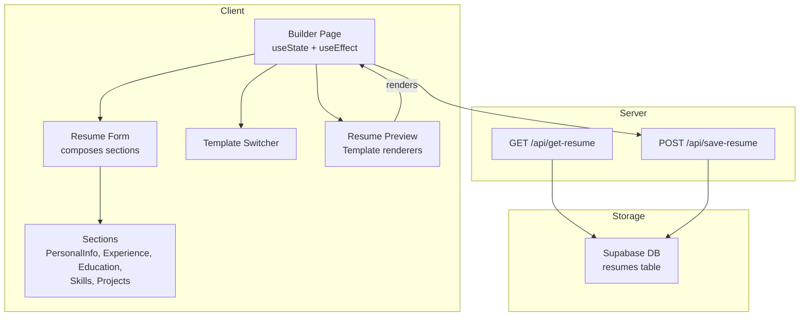
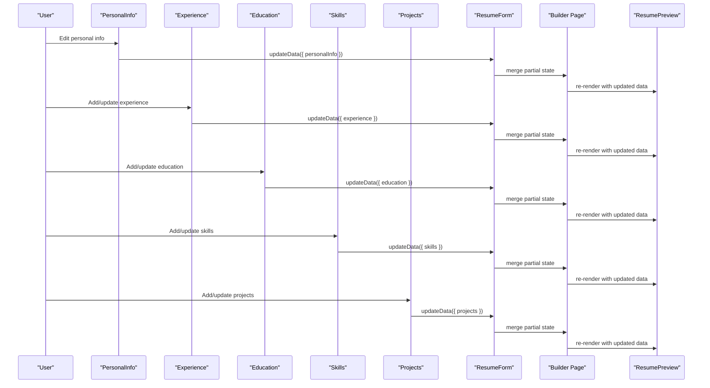
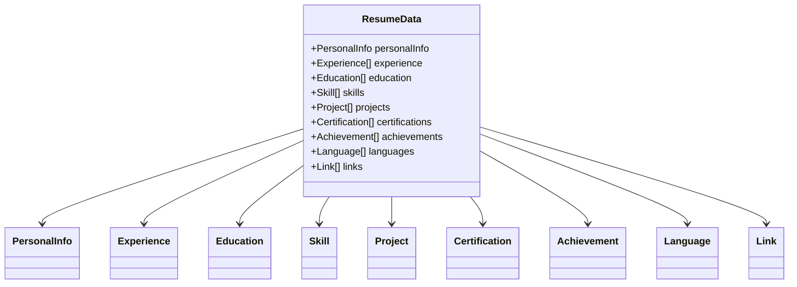
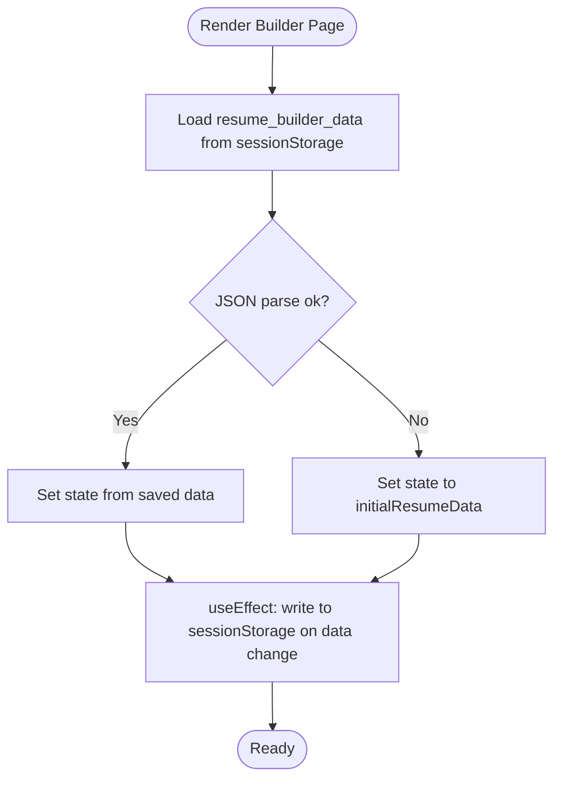
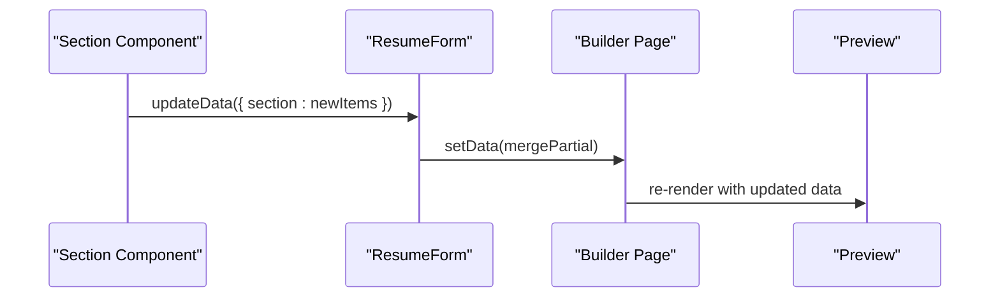
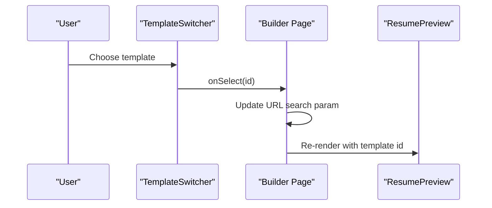
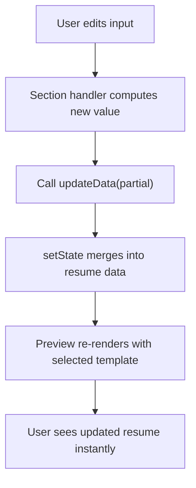
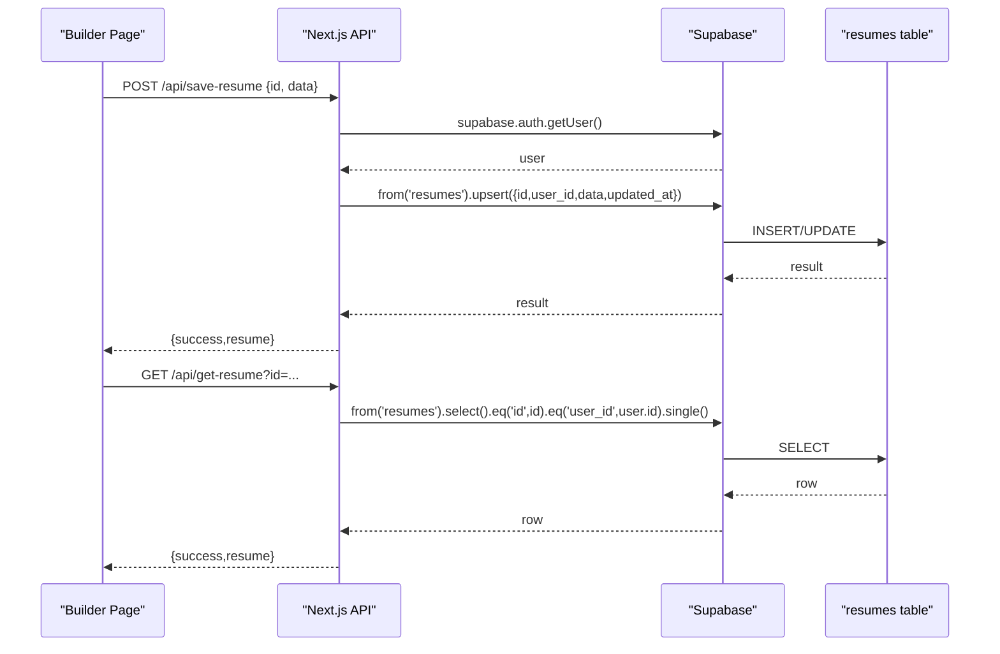
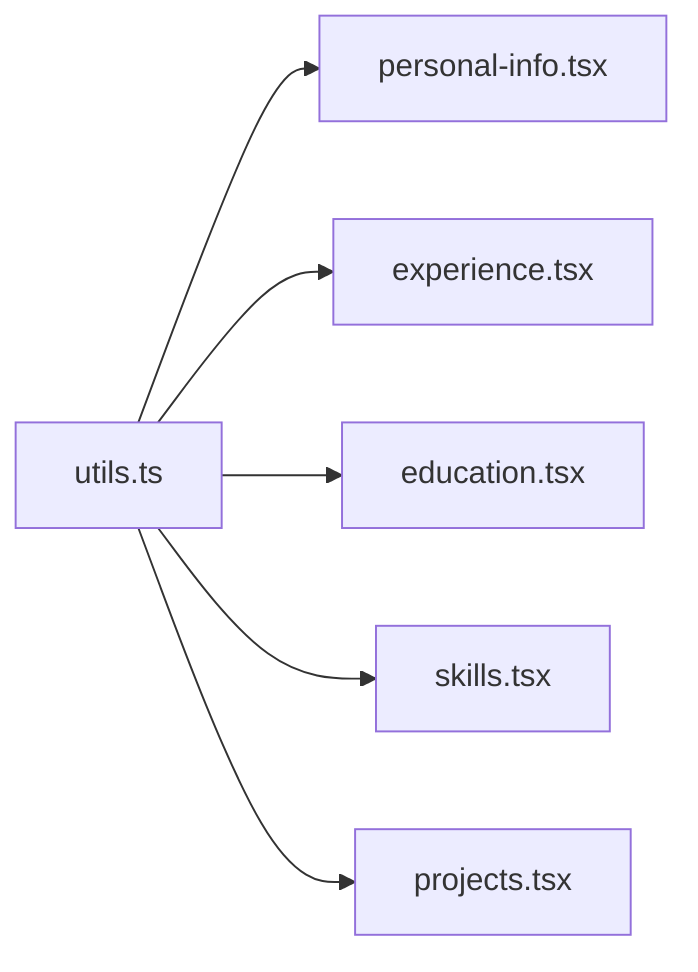

# Data Flow and State Management

<cite>
**Referenced Files in This Document**
- [types.ts](file://src/lib/types.ts)
- [page.tsx](file://src/app/builder/page.tsx)
- [resume-form.tsx](file://src/components/resume/resume-form.tsx)
- [personal-info.tsx](file://src/components/resume/personal-info.tsx)
- [experience.tsx](file://src/components/resume/experience.tsx)
- [education.tsx](file://src/components/resume/education.tsx)
- [skills.tsx](file://src/components/resume/skills.tsx)
- [projects.tsx](file://src/components/resume/projects.tsx)
- [resume-preview.tsx](file://src/components/resume/resume-preview.tsx)
- [template-switcher.tsx](file://src/components/resume/template-switcher.tsx)
- [supabase.ts](file://src/lib/supabase.ts)
- [get-resume/route.ts](file://src/app/api/get-resume/route.ts)
- [save-resume/route.ts](file://src/app/api/save-resume/route.ts)
- [use-auth-guard.ts](file://src/hooks/use-auth-guard.ts)
- [utils.ts](file://src/lib/utils.ts)
</cite>

## Table of Contents
1. [Introduction](#introduction)
2. [Project Structure](#project-structure)
3. [Core Components](#core-components)
4. [Architecture Overview](#architecture-overview)
5. [Detailed Component Analysis](#detailed-component-analysis)
6. [Dependency Analysis](#dependency-analysis)
7. [Performance Considerations](#performance-considerations)
8. [Troubleshooting Guide](#troubleshooting-guide)
9. [Conclusion](#conclusion)

## Introduction
This document explains the data flow and state management of the nh.intern resume builder. It covers the TypeScript data model, React state patterns, real-time updates, optimistic UI, template rendering, and persistence via Supabase. It also documents validation, error handling, and performance strategies to ensure a smooth user experience.

## Project Structure
The resume builder is a Next.js application with:
- A central TypeScript model defining the resume data shape
- A builder page orchestrating local state and preview
- Modular resume section components handling user input
- Supabase-backed APIs for saving and retrieving resume data
- A template switcher and preview renderer

**Diagram sources**
- [page.tsx:11-78](file://src/app/builder/page.tsx#L11-L78)
- [resume-form.tsx:19-83](file://src/components/resume/resume-form.tsx#L19-L83)
- [personal-info.tsx:13-117](file://src/components/resume/personal-info.tsx#L13-L117)
- [experience.tsx:15-112](file://src/components/resume/experience.tsx#L15-L112)
- [education.tsx:15-111](file://src/components/resume/education.tsx#L15-L111)
- [skills.tsx:13-71](file://src/components/resume/skills.tsx#L13-L71)
- [projects.tsx:15-117](file://src/components/resume/projects.tsx#L15-L117)
- [resume-preview.tsx:789-800](file://src/components/resume/resume-preview.tsx#L789-L800)
- [template-switcher.tsx:76-158](file://src/components/resume/template-switcher.tsx#L76-L158)
- [get-resume/route.ts:10-57](file://src/app/api/get-resume/route.ts#L10-L57)
- [save-resume/route.ts:31-82](file://src/app/api/save-resume/route.ts#L31-L82)

**Section sources**
- [page.tsx:11-78](file://src/app/builder/page.tsx#L11-L78)
- [resume-form.tsx:19-83](file://src/components/resume/resume-form.tsx#L19-L83)

## Core Components
- Resume data model: A single typed object containing personal info, arrays for experience, education, skills, projects, certifications, achievements, languages, and links. See [types.ts:69-101](file://src/lib/types.ts#L69-L101).
- Local state: The builder initializes and persists data in sessionStorage, updating React state on change. See [page.tsx:17-36](file://src/app/builder/page.tsx#L17-L36).
- Section components: Each section accepts data and an updater callback, enabling incremental updates. See [resume-form.tsx:28-79](file://src/components/resume/resume-form.tsx#L28-L79) and individual section files.
- Preview and templates: The preview renders the selected template with all resume sections. See [resume-preview.tsx:789-800](file://src/components/resume/resume-preview.tsx#L789-L800).

**Section sources**
- [types.ts:69-101](file://src/lib/types.ts#L69-L101)
- [page.tsx:17-36](file://src/app/builder/page.tsx#L17-L36)
- [resume-form.tsx:28-79](file://src/components/resume/resume-form.tsx#L28-L79)
- [resume-preview.tsx:789-800](file://src/components/resume/resume-preview.tsx#L789-L800)

## Architecture Overview
The system follows a unidirectional data flow:
- User edits fields in section components
- Each section invokes a partial updater that merges into the top-level state
- The builder’s state triggers re-renders of the preview with the selected template
- Optional persistence: The builder page saves to sessionStorage locally; server APIs support Supabase persistence

**Diagram sources**
- [resume-form.tsx:28-79](file://src/components/resume/resume-form.tsx#L28-L79)
- [personal-info.tsx:14-16](file://src/components/resume/personal-info.tsx#L14-L16)
- [experience.tsx:31-35](file://src/components/resume/experience.tsx#L31-L35)
- [education.tsx:30-34](file://src/components/resume/education.tsx#L30-L34)
- [skills.tsx:24-28](file://src/components/resume/skills.tsx#L24-L28)
- [projects.tsx:28-32](file://src/components/resume/projects.tsx#L28-L32)
- [page.tsx:34-36](file://src/app/builder/page.tsx#L34-L36)
- [resume-preview.tsx:789-800](file://src/components/resume/resume-preview.tsx#L789-L800)

## Detailed Component Analysis

### Data Model and Initial State
- The resume data structure groups related fields under typed interfaces. Arrays are used for repeatable sections (experience, education, skills, projects, etc.). See [types.ts:69-101](file://src/lib/types.ts#L69-L101).
- The builder initializes state from sessionStorage if present, otherwise falls back to the initial empty structure. See [page.tsx:17-27](file://src/app/builder/page.tsx#L17-L27).

**Diagram sources**
- [types.ts:69-101](file://src/lib/types.ts#L69-L101)

**Section sources**
- [types.ts:69-101](file://src/lib/types.ts#L69-L101)
- [page.tsx:17-27](file://src/app/builder/page.tsx#L17-L27)

### Builder Page: State Initialization and Persistence
- Initializes state from sessionStorage during render to avoid extra setState lifecycle steps. See [page.tsx:17-27](file://src/app/builder/page.tsx#L17-L27).
- Persists state to sessionStorage on every state change via a useEffect. See [page.tsx:29-36](file://src/app/builder/page.tsx#L29-L36).
- Exposes a partial updater to merge changes into state. See [page.tsx:34-36](file://src/app/builder/page.tsx#L34-L36).
- Manages template selection via URL search params and navigation. See [page.tsx:38-42](file://src/app/builder/page.tsx#L38-L42).

**Diagram sources**
- [page.tsx:17-36](file://src/app/builder/page.tsx#L17-L36)

**Section sources**
- [page.tsx:17-42](file://src/app/builder/page.tsx#L17-L42)

### Resume Form and Section Components
- The form composes all sections and passes down the current data slice and a partial updater. See [resume-form.tsx:28-79](file://src/components/resume/resume-form.tsx#L28-L79).
- Each section component:
  - Accepts typed props for its data slice
  - Provides handlers to add, update, or remove items
  - Uses unique identifiers for list items and immutable array updates
- Example patterns:
  - Personal info updates a single record. See [personal-info.tsx:14-16](file://src/components/resume/personal-info.tsx#L14-L16).
  - Experience and Education manage lists with add/update/remove. See [experience.tsx:31-39](file://src/components/resume/experience.tsx#L31-L39) and [education.tsx:30-38](file://src/components/resume/education.tsx#L30-L38).
  - Skills manages a list of simple items. See [skills.tsx:24-32](file://src/components/resume/skills.tsx#L24-L32).
  - Projects applies input validation and normalization. See [projects.tsx:67-84](file://src/components/resume/projects.tsx#L67-L84).

**Diagram sources**
- [resume-form.tsx:28-79](file://src/components/resume/resume-form.tsx#L28-L79)
- [page.tsx:34-36](file://src/app/builder/page.tsx#L34-L36)
- [resume-preview.tsx:789-800](file://src/components/resume/resume-preview.tsx#L789-L800)

**Section sources**
- [resume-form.tsx:28-79](file://src/components/resume/resume-form.tsx#L28-L79)
- [personal-info.tsx:14-16](file://src/components/resume/personal-info.tsx#L14-L16)
- [experience.tsx:31-39](file://src/components/resume/experience.tsx#L31-L39)
- [education.tsx:30-38](file://src/components/resume/education.tsx#L30-L38)
- [skills.tsx:24-32](file://src/components/resume/skills.tsx#L24-L32)
- [projects.tsx:67-84](file://src/components/resume/projects.tsx#L67-L84)

### Template Rendering and Switching
- The preview component renders the selected template by name and passes the full resume data. See [resume-preview.tsx:789-800](file://src/components/resume/resume-preview.tsx#L789-L800).
- The template switcher allows selecting among multiple predefined templates and updates the URL. See [template-switcher.tsx:76-158](file://src/components/resume/template-switcher.tsx#L76-L158).

**Diagram sources**
- [template-switcher.tsx:119-122](file://src/components/resume/template-switcher.tsx#L119-L122)
- [page.tsx:38-42](file://src/app/builder/page.tsx#L38-L42)
- [resume-preview.tsx:789-800](file://src/components/resume/resume-preview.tsx#L789-L800)

**Section sources**
- [resume-preview.tsx:789-800](file://src/components/resume/resume-preview.tsx#L789-L800)
- [template-switcher.tsx:76-158](file://src/components/resume/template-switcher.tsx#L76-L158)
- [page.tsx:38-42](file://src/app/builder/page.tsx#L38-L42)

### Data Transformation Pipeline: From Input to Template Rendering
- Input capture: Each section component binds inputs to handlers that compute a new value for the field or item.
- Validation and normalization: Projects apply length limits and character filtering; others rely on controlled inputs.
- State update: Handlers call the partial updater to merge changes into the top-level state.
- Real-time preview: The builder’s state change triggers a re-render of the preview with the selected template.
- Optimistic UI: The UI reflects changes immediately without waiting for server responses.

**Diagram sources**
- [personal-info.tsx:14-16](file://src/components/resume/personal-info.tsx#L14-L16)
- [experience.tsx:31-35](file://src/components/resume/experience.tsx#L31-L35)
- [education.tsx:30-34](file://src/components/resume/education.tsx#L30-L34)
- [skills.tsx:24-28](file://src/components/resume/skills.tsx#L24-L28)
- [projects.tsx:67-84](file://src/components/resume/projects.tsx#L67-L84)
- [resume-form.tsx:28-79](file://src/components/resume/resume-form.tsx#L28-L79)
- [page.tsx:34-36](file://src/app/builder/page.tsx#L34-L36)
- [resume-preview.tsx:789-800](file://src/components/resume/resume-preview.tsx#L789-L800)

**Section sources**
- [projects.tsx:67-84](file://src/components/resume/projects.tsx#L67-L84)
- [resume-form.tsx:28-79](file://src/components/resume/resume-form.tsx#L28-L79)
- [page.tsx:34-36](file://src/app/builder/page.tsx#L34-L36)
- [resume-preview.tsx:789-800](file://src/components/resume/resume-preview.tsx#L789-L800)

### Data Synchronization with Supabase
- Authentication: The app uses Supabase authentication with an auth guard hook that checks user sessions and subscribes to auth state changes. See [use-auth-guard.ts:11-56](file://src/hooks/use-auth-guard.ts#L11-L56).
- Client initialization: The Supabase client is created with environment variables and error-handling flags. See [supabase.ts:13-27](file://src/lib/supabase.ts#L13-L27).
- Retrieval endpoint: The GET route validates the resume id, verifies authentication, and queries the database for the matching user’s resume. See [get-resume/route.ts:10-57](file://src/app/api/get-resume/route.ts#L10-L57).
- Save endpoint: The POST route validates the payload, ensures authentication, performs an upsert with updated timestamps, and returns the persisted record. See [save-resume/route.ts:31-82](file://src/app/api/save-resume/route.ts#L31-L82).

**Diagram sources**
- [save-resume/route.ts:31-82](file://src/app/api/save-resume/route.ts#L31-L82)
- [get-resume/route.ts:10-57](file://src/app/api/get-resume/route.ts#L10-L57)
- [supabase.ts:13-27](file://src/lib/supabase.ts#L13-L27)
- [use-auth-guard.ts:16-50](file://src/hooks/use-auth-guard.ts#L16-L50)

**Section sources**
- [supabase.ts:13-27](file://src/lib/supabase.ts#L13-L27)
- [use-auth-guard.ts:11-56](file://src/hooks/use-auth-guard.ts#L11-L56)
- [get-resume/route.ts:10-57](file://src/app/api/get-resume/route.ts#L10-L57)
- [save-resume/route.ts:31-82](file://src/app/api/save-resume/route.ts#L31-L82)

### Offline-First and Conflict Resolution Strategies
- Local-first: The builder initializes from sessionStorage and writes to it on every change, ensuring immediate availability and continuity when offline. See [page.tsx:17-36](file://src/app/builder/page.tsx#L17-L36).
- Server sync: When online, the builder can call the save and get endpoints to reconcile with remote data. The save endpoint uses upsert to merge changes; retrieval ensures access control per user. See [save-resume/route.ts:56-64](file://src/app/api/save-resume/route.ts#L56-L64) and [get-resume/route.ts:34-39](file://src/app/api/get-resume/route.ts#L34-L39).
- Conflict resolution: Since the builder writes to sessionStorage immediately, conflicts are minimized. If a user switches devices, they can fetch the latest version via the GET endpoint and overwrite local state accordingly.

**Section sources**
- [page.tsx:17-36](file://src/app/builder/page.tsx#L17-L36)
- [save-resume/route.ts:56-64](file://src/app/api/save-resume/route.ts#L56-L64)
- [get-resume/route.ts:34-39](file://src/app/api/get-resume/route.ts#L34-L39)

### Validation Rules and Error Handling
- Frontend validation:
  - Projects enforce a maximum length and sanitize characters, preventing invalid entries. See [projects.tsx:67-84](file://src/components/resume/projects.tsx#L67-L84).
  - Inputs are controlled; updates occur on change events. See [personal-info.tsx:14-16](file://src/components/resume/personal-info.tsx#L14-L16).
- Backend validation:
  - Zod schemas validate request bodies and query parameters for save and get endpoints. See [save-resume/route.ts:6-29](file://src/app/api/save-resume/route.ts#L6-L29) and [get-resume/route.ts:6-8](file://src/app/api/get-resume/route.ts#L6-L8).
  - Authentication checks ensure only logged-in users can access endpoints. See [get-resume/route.ts:24-32](file://src/app/api/get-resume/route.ts#L24-L32) and [save-resume/route.ts:46-54](file://src/app/api/save-resume/route.ts#L46-L54).
- Error handling:
  - API routes return structured errors with appropriate HTTP status codes. See [get-resume/route.ts:17-22](file://src/app/api/get-resume/route.ts#L17-L22) and [save-resume/route.ts:37-42](file://src/app/api/save-resume/route.ts#L37-L42).
  - Auth guard handles network errors gracefully by allowing the page to render while logging warnings. See [use-auth-guard.ts:32-36](file://src/hooks/use-auth-guard.ts#L32-L36).

**Section sources**
- [projects.tsx:67-84](file://src/components/resume/projects.tsx#L67-L84)
- [save-resume/route.ts:6-29](file://src/app/api/save-resume/route.ts#L6-L29)
- [get-resume/route.ts:6-8](file://src/app/api/get-resume/route.ts#L6-L8)
- [use-auth-guard.ts:32-36](file://src/hooks/use-auth-guard.ts#L32-L36)

## Dependency Analysis
- Utilities: Tailwind merging utility is used for conditional classes. See [utils.ts:4-6](file://src/lib/utils.ts#L4-L6).
- Styling and UI primitives: Components import shared UI elements (Input, Label, Textarea, Button) to maintain consistency. See [personal-info.tsx:3-5](file://src/components/resume/personal-info.tsx#L3-L5).

**Diagram sources**
- [utils.ts:4-6](file://src/lib/utils.ts#L4-L6)
- [personal-info.tsx:3-5](file://src/components/resume/personal-info.tsx#L3-L5)
- [experience.tsx:3-7](file://src/components/resume/experience.tsx#L3-L7)
- [education.tsx:3-7](file://src/components/resume/education.tsx#L3-L7)
- [skills.tsx:3-6](file://src/components/resume/skills.tsx#L3-L6)
- [projects.tsx:3-7](file://src/components/resume/projects.tsx#L3-L7)

**Section sources**
- [utils.ts:4-6](file://src/lib/utils.ts#L4-L6)
- [personal-info.tsx:3-5](file://src/components/resume/personal-info.tsx#L3-L5)
- [experience.tsx:3-7](file://src/components/resume/experience.tsx#L3-L7)
- [education.tsx:3-7](file://src/components/resume/education.tsx#L3-L7)
- [skills.tsx:3-6](file://src/components/resume/skills.tsx#L3-L6)
- [projects.tsx:3-7](file://src/components/resume/projects.tsx#L3-L7)

## Performance Considerations
- Efficient re-rendering:
  - Use partial updates to minimize unnecessary re-renders. The builder merges only changed slices into state. See [page.tsx:34-36](file://src/app/builder/page.tsx#L34-L36).
  - Section components update arrays immutably and rely on stable keys (id) for list items. See [experience.tsx:31-35](file://src/components/resume/experience.tsx#L31-L35) and [education.tsx:30-34](file://src/components/resume/education.tsx#L30-L34).
- Memoization:
  - Consider wrapping heavy template renderers with memoization at the preview level if performance becomes a concern. The preview currently renders the selected template based on props.
- Lazy loading:
  - Templates are defined inline; consider dynamic imports for rarely-used templates to reduce initial bundle size.
- Controlled inputs:
  - Keep all inputs controlled to prevent extraneous renders caused by uncontrolled components. The existing pattern is consistent across sections.

[No sources needed since this section provides general guidance]

## Troubleshooting Guide
- Authentication failures:
  - The auth guard logs warnings on network errors and continues rendering. Redirects to login when no user is detected. See [use-auth-guard.ts:32-36](file://src/hooks/use-auth-guard.ts#L32-L36).
- Session persistence:
  - If sessionStorage parsing fails, the builder falls back to initial data. Verify that saved data is valid JSON. See [page.tsx:17-27](file://src/app/builder/page.tsx#L17-L27).
- Supabase configuration:
  - The client checks for placeholder values and logs configuration status. Ensure environment variables are set. See [supabase.ts:3-10](file://src/lib/supabase.ts#L3-L10).
- API errors:
  - On validation errors, endpoints return structured messages with details. Inspect returned error payloads for guidance. See [get-resume/route.ts:17-22](file://src/app/api/get-resume/route.ts#L17-L22) and [save-resume/route.ts:37-42](file://src/app/api/save-resume/route.ts#L37-L42).

**Section sources**
- [use-auth-guard.ts:32-36](file://src/hooks/use-auth-guard.ts#L32-L36)
- [page.tsx:17-27](file://src/app/builder/page.tsx#L17-L27)
- [supabase.ts:3-10](file://src/lib/supabase.ts#L3-L10)
- [get-resume/route.ts:17-22](file://src/app/api/get-resume/route.ts#L17-L22)
- [save-resume/route.ts:37-42](file://src/app/api/save-resume/route.ts#L37-L42)

## Conclusion
The nh.intern resume builder implements a clean, local-first data flow with React hooks and controlled components. Typed data structures ensure consistency, while partial updates and immutable array operations keep the UI responsive. Supabase integration provides optional persistence with strict validation and authentication. The preview system supports multiple templates and real-time updates, delivering an optimistic, immediate editing experience.