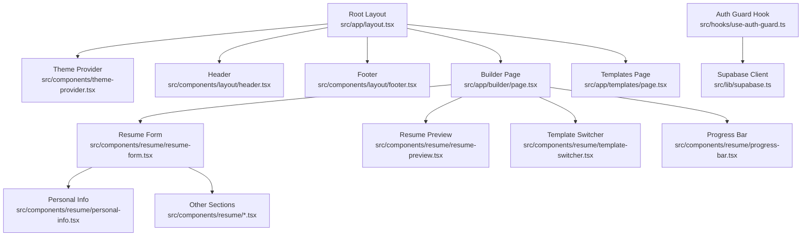
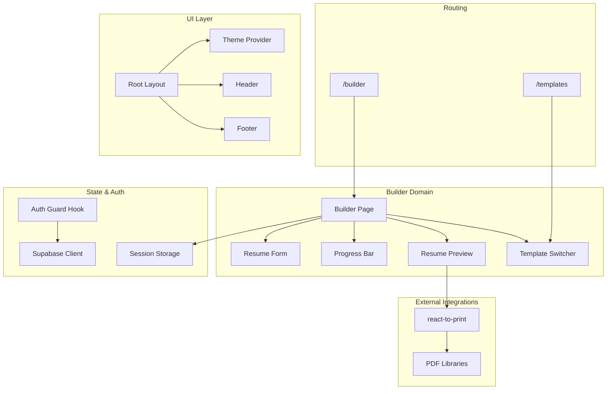
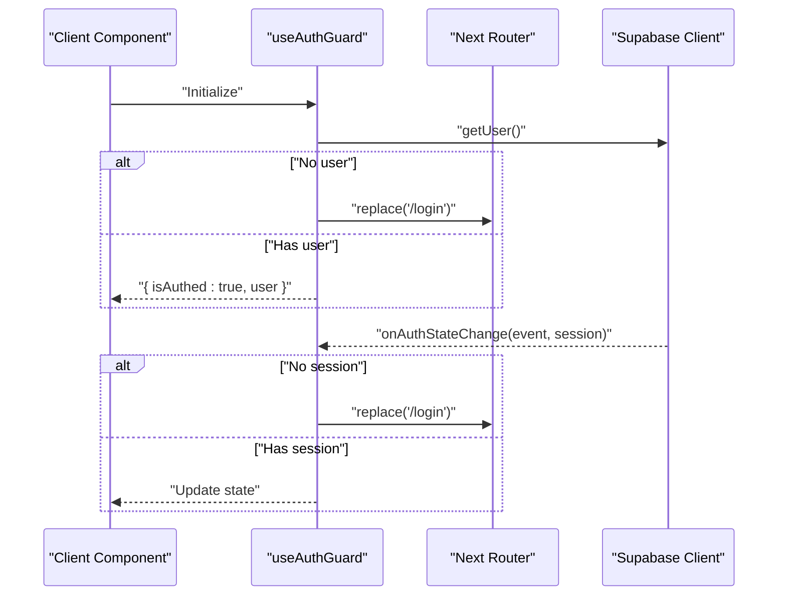
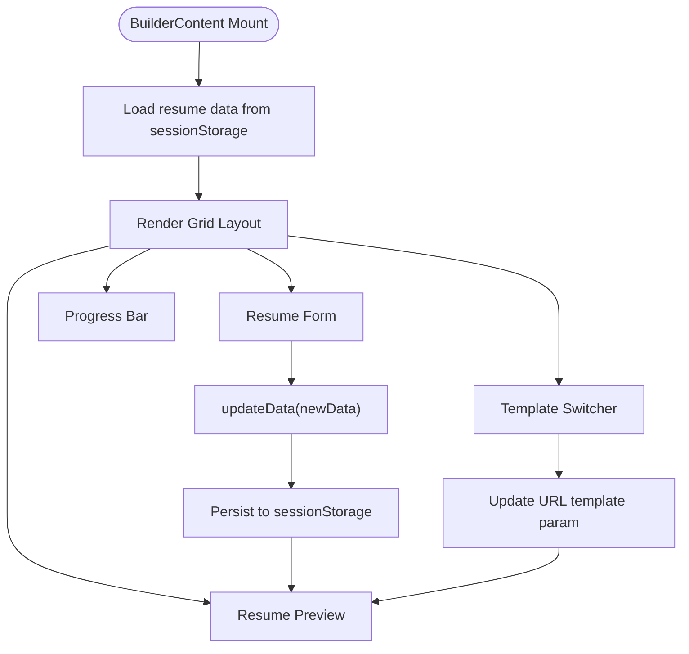
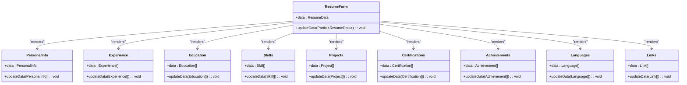
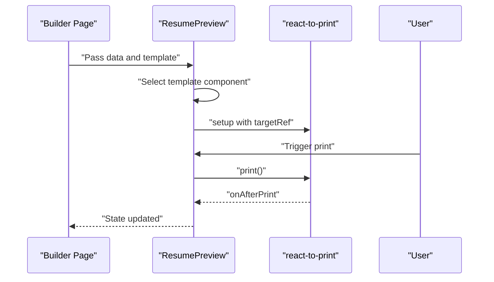
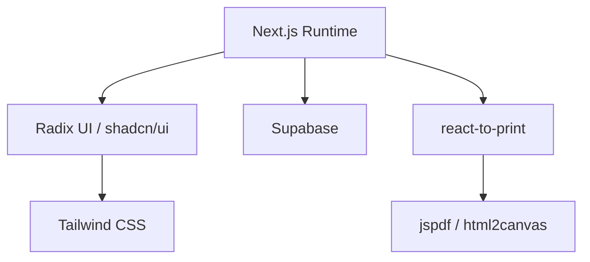

# Frontend Architecture

<cite>
**Referenced Files in This Document**
- [layout.tsx](file://src/app/layout.tsx)
- [theme-provider.tsx](file://src/components/theme-provider.tsx)
- [use-auth-guard.ts](file://src/hooks/use-auth-guard.ts)
- [supabase.ts](file://src/lib/supabase.ts)
- [page.tsx](file://src/app/builder/page.tsx)
- [resume-form.tsx](file://src/components/resume/resume-form.tsx)
- [resume-preview.tsx](file://src/components/resume/resume-preview.tsx)
- [types.ts](file://src/lib/types.ts)
- [personal-info.tsx](file://src/components/resume/personal-info.tsx)
- [progress-bar.tsx](file://src/components/resume/progress-bar.tsx)
- [template-switcher.tsx](file://src/components/resume/template-switcher.tsx)
- [page.tsx](file://src/app/templates/page.tsx)
- [header.tsx](file://src/components/layout/header.tsx)
- [footer.tsx](file://src/components/layout/footer.tsx)
- [package.json](file://package.json)
</cite>

## Table of Contents
1. [Introduction](#introduction)
2. [Project Structure](#project-structure)
3. [Core Components](#core-components)
4. [Architecture Overview](#architecture-overview)
5. [Detailed Component Analysis](#detailed-component-analysis)
6. [Dependency Analysis](#dependency-analysis)
7. [Performance Considerations](#performance-considerations)
8. [Troubleshooting Guide](#troubleshooting-guide)
9. [Conclusion](#conclusion)

## Introduction
This document describes the frontend architecture of the nh.intern application built with Next.js App Router. It focuses on the app router pattern, component hierarchy from the root layout down to individual resume components, and React hooks-based state management. It also documents how the builder orchestrates form and preview components, integrates a theme provider for dark/light mode, enforces authentication via a client-side guard hook, and manages data flow from user input to real-time preview rendering. Architectural decisions around responsive design, accessibility, and performance are explained, along with lifecycle and cleanup strategies and integrations with Supabase and printing/PDF generation libraries.

## Project Structure
The application follows Next.js App Router conventions with a strict file-system-based routing model. The root layout composes global providers and shared UI, while feature pages (builder, templates) encapsulate domain-specific logic. Components are organized by domain (resume, ui, layout) and grouped under a components directory. Shared types and Supabase client live under lib.

**Diagram sources**
- [layout.tsx:25-49](file://src/app/layout.tsx#L25-L49)
- [theme-provider.tsx:7-9](file://src/components/theme-provider.tsx#L7-L9)
- [header.tsx:12-95](file://src/components/layout/header.tsx#L12-L95)
- [footer.tsx:1-12](file://src/components/layout/footer.tsx#L1-L12)
- [page.tsx:11-78](file://src/app/builder/page.tsx#L11-L78)
- [resume-form.tsx:19-83](file://src/components/resume/resume-form.tsx#L19-L83)
- [resume-preview.tsx:789-800](file://src/components/resume/resume-preview.tsx#L789-L800)
- [template-switcher.tsx:76-158](file://src/components/resume/template-switcher.tsx#L76-L158)
- [progress-bar.tsx:11-72](file://src/components/resume/progress-bar.tsx#L11-L72)
- [personal-info.tsx:13-117](file://src/components/resume/personal-info.tsx#L13-L117)
- [use-auth-guard.ts:11-50](file://src/hooks/use-auth-guard.ts#L11-L50)
- [supabase.ts:1-11](file://src/lib/supabase.ts#L1-L11)

**Section sources**
- [layout.tsx:25-49](file://src/app/layout.tsx#L25-L49)
- [page.tsx:11-78](file://src/app/builder/page.tsx#L11-L78)
- [page.tsx:76-177](file://src/app/templates/page.tsx#L76-L177)

## Core Components
- Root layout composes the theme provider, error boundary, header, and page content area. It sets up fonts, global styles, and theme defaults.
- Theme provider wraps the app with next-themes to enable system-aware light/dark mode switching.
- Authentication guard hook performs client-side checks against Supabase, redirects unauthenticated users, and synchronizes session state.
- Builder page orchestrates the resume editor: form section, progress bar, preview section, and template switcher. It persists data to sessionStorage and updates URL query parameters for template selection.
- Resume form composes domain-specific sections (personal info, experience, education, skills, projects, certifications, achievements, languages, links) and forwards updates to parent state.
- Resume preview renders the selected template with real-time data binding and integrates printing via react-to-print.
- Types define the shape of resume data and initial state for hydration.
- Header displays navigation, user state, and logout controls, subscribing to Supabase auth events.
- Footer provides branding and legal text.

**Section sources**
- [layout.tsx:25-49](file://src/app/layout.tsx#L25-L49)
- [theme-provider.tsx:7-9](file://src/components/theme-provider.tsx#L7-L9)
- [use-auth-guard.ts:11-50](file://src/hooks/use-auth-guard.ts#L11-L50)
- [page.tsx:11-78](file://src/app/builder/page.tsx#L11-L78)
- [resume-form.tsx:19-83](file://src/components/resume/resume-form.tsx#L19-L83)
- [resume-preview.tsx:789-800](file://src/components/resume/resume-preview.tsx#L789-L800)
- [types.ts:69-103](file://src/lib/types.ts#L69-L103)
- [header.tsx:12-95](file://src/components/layout/header.tsx#L12-L95)
- [footer.tsx:1-12](file://src/components/layout/footer.tsx#L1-L12)

## Architecture Overview
The architecture centers on a single-page builder experience with split-pane editing and live preview. The state is local to the builder page and persisted to sessionStorage for continuity across reloads. Navigation guards ensure only authenticated users can access protected routes. The theme provider enables seamless dark/light mode switching. Supabase handles authentication state and user session synchronization. Printing and PDF generation are integrated via react-to-print and PDF libraries.

**Diagram sources**
- [layout.tsx:25-49](file://src/app/layout.tsx#L25-L49)
- [page.tsx:11-78](file://src/app/builder/page.tsx#L11-L78)
- [resume-form.tsx:19-83](file://src/components/resume/resume-form.tsx#L19-L83)
- [resume-preview.tsx:789-800](file://src/components/resume/resume-preview.tsx#L789-L800)
- [template-switcher.tsx:76-158](file://src/components/resume/template-switcher.tsx#L76-L158)
- [progress-bar.tsx:11-72](file://src/components/resume/progress-bar.tsx#L11-L72)
- [use-auth-guard.ts:11-50](file://src/hooks/use-auth-guard.ts#L11-L50)
- [supabase.ts:1-11](file://src/lib/supabase.ts#L1-L11)
- [package.json:11-31](file://package.json#L11-L31)

## Detailed Component Analysis

### Next.js App Router Pattern and Root Layout
- The root layout defines the HTML shell, applies global fonts, and composes providers and shared UI. It disables hydration warnings for theme transitions and wraps children with an error boundary.
- The theme provider is configured with a default theme and disables transition animations during theme changes to avoid FOUC.

**Section sources**
- [layout.tsx:25-49](file://src/app/layout.tsx#L25-L49)
- [theme-provider.tsx:7-9](file://src/components/theme-provider.tsx#L7-L9)

### Authentication Guard Hook
- The hook initializes by checking the current Supabase user and redirects to login if missing. It subscribes to auth state changes and updates internal state accordingly.
- Session data is synchronized to sessionStorage for backward compatibility and to support client-side logic outside of Supabase.

**Diagram sources**
- [use-auth-guard.ts:11-50](file://src/hooks/use-auth-guard.ts#L11-L50)
- [supabase.ts:1-11](file://src/lib/supabase.ts#L1-L11)

**Section sources**
- [use-auth-guard.ts:11-50](file://src/hooks/use-auth-guard.ts#L11-L50)
- [supabase.ts:1-11](file://src/lib/supabase.ts#L1-L11)

### Builder Page Orchestration
- The builder page initializes state from sessionStorage to avoid unnecessary re-computation and persists changes back to sessionStorage on updates.
- It exposes a function to update the resume data and another to select a template, updating the URL query parameter without triggering a full page scroll.
- The layout is a responsive grid with a form column and a preview column, enabling real-time editing and viewing.

**Diagram sources**
- [page.tsx:11-78](file://src/app/builder/page.tsx#L11-L78)

**Section sources**
- [page.tsx:11-78](file://src/app/builder/page.tsx#L11-L78)

### Resume Form Composition and Prop Drilling
- The resume form composes multiple domain-specific sections and drills down update handlers to each subsection. Updates are consolidated via a single callback that merges partial data into the parent state.
- Each subsection receives typed props and a small update function that forwards a slice of the data to the parent.

**Diagram sources**
- [resume-form.tsx:19-83](file://src/components/resume/resume-form.tsx#L19-L83)
- [personal-info.tsx:13-117](file://src/components/resume/personal-info.tsx#L13-L117)
- [types.ts:69-103](file://src/lib/types.ts#L69-L103)

**Section sources**
- [resume-form.tsx:19-83](file://src/components/resume/resume-form.tsx#L19-L83)
- [personal-info.tsx:13-117](file://src/components/resume/personal-info.tsx#L13-L117)
- [types.ts:69-103](file://src/lib/types.ts#L69-L103)

### Real-Time Preview Rendering and Template System
- The preview component selects a template based on the current template ID and renders the resume data. It uses a ref to capture the printable DOM and integrates printing via react-to-print.
- Multiple template variants are implemented as separate components, allowing dynamic selection and immediate rendering.

**Diagram sources**
- [resume-preview.tsx:789-800](file://src/components/resume/resume-preview.tsx#L789-L800)

**Section sources**
- [resume-preview.tsx:789-800](file://src/components/resume/resume-preview.tsx#L789-L800)

### Template Switcher and Navigation
- The template switcher presents a gallery of available templates, highlights the current selection, and updates the URL query parameter when a new template is chosen.
- The templates page provides a landing for selecting a starting template and links to the builder with the chosen template ID.

**Section sources**
- [template-switcher.tsx:76-158](file://src/components/resume/template-switcher.tsx#L76-L158)
- [page.tsx:76-177](file://src/app/templates/page.tsx#L76-L177)

### Progress Tracking
- The progress bar computes a profile strength score based on filled sections and quality heuristics, updating reactively as data changes.

**Section sources**
- [progress-bar.tsx:11-72](file://src/components/resume/progress-bar.tsx#L11-L72)

### Theme Provider Integration
- The theme provider is initialized in the root layout with a default theme and disables transitions during theme changes. The header’s theme toggle integrates with this provider.

**Section sources**
- [layout.tsx:35-45](file://src/app/layout.tsx#L35-L45)
- [theme-provider.tsx:7-9](file://src/components/theme-provider.tsx#L7-L9)
- [header.tsx:89-90](file://src/components/layout/header.tsx#L89-L90)

### Data Model and Hydration
- The resume data model defines typed sections for personal info, experience, education, skills, projects, certifications, achievements, languages, and links. An initial state is provided for hydration.

**Section sources**
- [types.ts:69-103](file://src/lib/types.ts#L69-L103)

## Dependency Analysis
The frontend relies on Next.js App Router for routing, Radix UI primitives, Tailwind CSS for styling, and external libraries for printing and PDF generation. Authentication is handled by Supabase.

**Diagram sources**
- [package.json:11-31](file://package.json#L11-L31)

**Section sources**
- [package.json:11-31](file://package.json#L11-L31)

## Performance Considerations
- Local-first state with sessionStorage avoids server round-trips for resume content and reduces initial payload size.
- Template rendering is lightweight and driven by props; heavy DOM capture for printing is scoped to the preview container.
- The progress bar recomputes on data changes; memoization could be considered if performance becomes a concern.
- Fonts are self-hosted via Next/font to reduce CLS and improve LCP.
- Animations and transitions are kept minimal to avoid layout thrashing.

## Troubleshooting Guide
- Authentication redirection loops: Verify Supabase environment variables and that the auth hook is mounted inside the root layout provider chain.
- Preview not updating: Ensure the builder page passes the latest data to the preview component and that template selection updates the URL parameter correctly.
- Printing issues: Confirm the target ref is attached to the printable element and that the document title is set appropriately.
- Session persistence: If data resets after refresh, confirm sessionStorage keys and that the builder initializes state from sessionStorage.

**Section sources**
- [use-auth-guard.ts:11-50](file://src/hooks/use-auth-guard.ts#L11-L50)
- [page.tsx:11-78](file://src/app/builder/page.tsx#L11-L78)
- [resume-preview.tsx:789-800](file://src/components/resume/resume-preview.tsx#L789-L800)

## Conclusion
The nh.intern frontend leverages Next.js App Router to deliver a responsive, authenticated, and interactive resume builder. The architecture emphasizes local state management with sessionStorage, real-time preview rendering, and a flexible template system. Authentication and theming are integrated at the root level, while the builder orchestrates form and preview components with minimal prop drilling. The design balances performance, accessibility, and maintainability, with clear separation of concerns across components and domains.