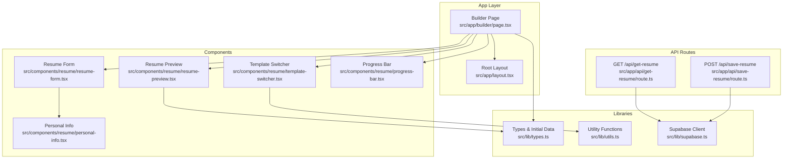
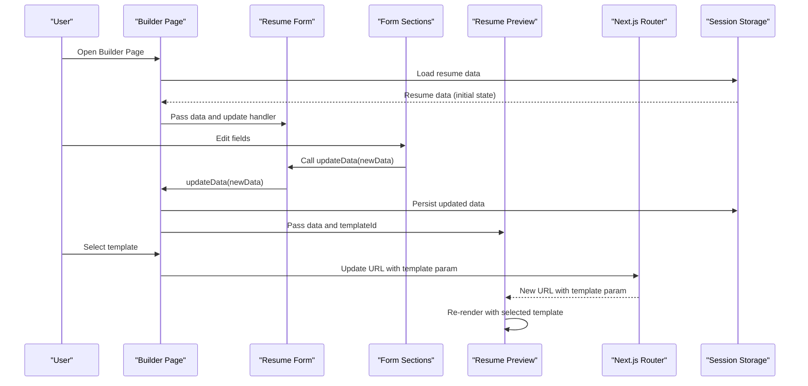
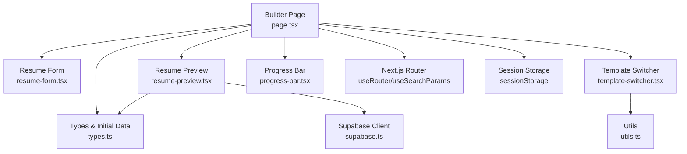

# Builder Page Component

<cite>
**Referenced Files in This Document**
- [page.tsx](file://src/app/builder/page.tsx)
- [resume-form.tsx](file://src/components/resume/resume-form.tsx)
- [resume-preview.tsx](file://src/components/resume/resume-preview.tsx)
- [template-switcher.tsx](file://src/components/resume/template-switcher.tsx)
- [types.ts](file://src/lib/types.ts)
- [utils.ts](file://src/lib/utils.ts)
- [personal-info.tsx](file://src/components/resume/personal-info.tsx)
- [progress-bar.tsx](file://src/components/resume/progress-bar.tsx)
- [layout.tsx](file://src/app/layout.tsx)
- [route.ts](file://src/app/api/get-resume/route.ts)
- [route.ts](file://src/app/api/save-resume/route.ts)
- [supabase.ts](file://src/lib/supabase.ts)
</cite>

## Table of Contents
1. [Introduction](#introduction)
2. [Project Structure](#project-structure)
3. [Core Components](#core-components)
4. [Architecture Overview](#architecture-overview)
5. [Detailed Component Analysis](#detailed-component-analysis)
6. [Dependency Analysis](#dependency-analysis)
7. [Performance Considerations](#performance-considerations)
8. [Troubleshooting Guide](#troubleshooting-guide)
9. [Conclusion](#conclusion)

## Introduction
This document provides comprehensive technical documentation for the Builder Page component, which serves as the central orchestrator of the resume builder interface. The component manages state across two primary sections: the form editor and the live preview, coordinates template switching, integrates session storage for data persistence, uses Next.js router for URL parameter management, and implements a responsive grid layout system. It also demonstrates robust state management patterns, progress tracking integration, and practical examples of template parameter handling within a Next.js App Router application.

## Project Structure
The Builder Page component resides in the Next.js app directory under `/src/app/builder/page.tsx`. It coordinates with several subcomponents located in `/src/components/resume/`, including the form sections, preview renderer, and template switcher. Shared data types and utilities are centralized in `/src/lib/`.

**Diagram sources**
- [page.tsx:11-78](file://src/app/builder/page.tsx#L11-L78)
- [resume-form.tsx:19-82](file://src/components/resume/resume-form.tsx#L19-L82)
- [resume-preview.tsx:789-879](file://src/components/resume/resume-preview.tsx#L789-L879)
- [template-switcher.tsx:76-158](file://src/components/resume/template-switcher.tsx#L76-L158)
- [types.ts:69-101](file://src/lib/types.ts#L69-L101)
- [utils.ts:4-6](file://src/lib/utils.ts#L4-L6)
- [layout.tsx:25-49](file://src/app/layout.tsx#L25-L49)
- [route.ts:10-57](file://src/app/api/get-resume/route.ts#L10-L57)
- [route.ts:31-82](file://src/app/api/save-resume/route.ts#L31-L82)
- [supabase.ts:1-11](file://src/lib/supabase.ts#L1-L11)

**Section sources**
- [page.tsx:1-79](file://src/app/builder/page.tsx#L1-L79)
- [layout.tsx:25-49](file://src/app/layout.tsx#L25-L49)

## Core Components
The Builder Page component orchestrates the following core responsibilities:
- Initializes state from session storage to avoid unnecessary re-renders and preserve user data across browser refreshes.
- Manages real-time updates to resume data and persists changes to session storage automatically.
- Coordinates template switching via URL parameters while updating the preview in real time.
- Renders a responsive two-column layout with the form on the left and the preview on the right.
- Integrates progress tracking to reflect profile completeness.
- Provides a unified interface for template selection and rendering.

Key implementation highlights:
- Session storage integration for data persistence during editing sessions.
- Next.js router usage for URL parameter management to support template switching.
- Responsive grid layout using Tailwind CSS for optimal desktop and mobile experiences.
- Centralized state management with a single source of truth for resume data.

**Section sources**
- [page.tsx:11-78](file://src/app/builder/page.tsx#L11-L78)
- [types.ts:69-101](file://src/lib/types.ts#L69-L101)

## Architecture Overview
The Builder Page component follows a unidirectional data flow pattern:
- State is initialized from session storage and updated locally in memory.
- Changes propagate down to child components (form sections and preview).
- Template selection triggers URL parameter updates, which the preview consumes to render the selected template.
- Progress tracking recalculates based on the current state.

**Diagram sources**
- [page.tsx:11-78](file://src/app/builder/page.tsx#L11-L78)
- [resume-form.tsx:19-82](file://src/components/resume/resume-form.tsx#L19-L82)
- [resume-preview.tsx:789-879](file://src/components/resume/resume-preview.tsx#L789-L879)
- [template-switcher.tsx:76-158](file://src/components/resume/template-switcher.tsx#L76-L158)

## Detailed Component Analysis

### Builder Page Component
The Builder Page component is the central orchestrator responsible for:
- Initializing state from session storage to ensure continuity across reloads.
- Managing updates to resume data and persisting them to session storage.
- Handling template selection by updating URL parameters and passing the template identifier to the preview component.
- Rendering a responsive two-column layout with the form on the left and the preview on the right.

State management patterns:
- Initialization from session storage avoids redundant state updates and ensures immediate availability of saved data.
- Updates are performed using a functional updater to merge partial changes into the existing state.
- Automatic persistence via a `useEffect` hook ensures that every state change is immediately persisted.

Template switching:
- The component reads the template parameter from URL search parameters and passes it to the preview component.
- When a user selects a new template, the component updates the URL parameters without triggering a full page reload, maintaining a smooth user experience.

Responsive layout:
- The component uses a responsive grid layout with Tailwind CSS classes to adapt to different screen sizes.
- On smaller screens, the layout stacks the form and preview vertically, while on larger screens they appear side-by-side.

Progress tracking integration:
- The component renders a progress bar that reflects the completeness of the resume based on the current state.
- The progress calculation considers basic information, professional summary, experience quality, education, skills count, and presence of projects.

**Section sources**
- [page.tsx:11-78](file://src/app/builder/page.tsx#L11-L78)
- [progress-bar.tsx:11-72](file://src/components/resume/progress-bar.tsx#L11-L72)

### Resume Form Component
The Resume Form component organizes the editing interface into logical sections:
- Personal Information
- Work Experience
- Education
- Skills
- Projects
- Certifications
- Achievements
- Languages
- Links

Each section receives the relevant portion of the resume data and an update handler that merges partial changes back into the parent state. This design promotes modularity and maintainability.

Data flow:
- The form receives the complete resume data and an update function.
- Each subsection updates only its portion of the data, ensuring minimal re-renders.

**Section sources**
- [resume-form.tsx:19-82](file://src/components/resume/resume-form.tsx#L19-L82)
- [personal-info.tsx:13-117](file://src/components/resume/personal-info.tsx#L13-L117)

### Resume Preview Component
The Resume Preview component renders the resume using the selected template:
- It accepts the resume data and the current template identifier.
- A switch statement maps the template identifier to a specific template component.
- The preview includes a print/download mechanism using a third-party library.

Template rendering:
- The component dynamically selects and renders the appropriate template based on the URL parameter.
- The preview wrapper maintains a fixed aspect ratio suitable for printing and PDF generation.

**Section sources**
- [resume-preview.tsx:789-879](file://src/components/resume/resume-preview.tsx#L789-L879)
- [resume-preview.tsx:810-839](file://src/components/resume/resume-preview.tsx#L810-L839)

### Template Switcher Component
The Template Switcher component provides a modal-based interface for selecting a new template:
- Displays a grid of template thumbnails with visual indicators for the currently selected template.
- Updates the parent component when a new template is chosen, which then updates the URL parameter.

User interaction:
- Clicking the switch button opens a sidebar overlay with template options.
- Selecting a template closes the overlay and triggers navigation updates.

**Section sources**
- [template-switcher.tsx:76-158](file://src/components/resume/template-switcher.tsx#L76-L158)

### Data Types and Initial State
The resume data structure is defined using TypeScript interfaces, ensuring type safety across the application:
- Personal information, experience, education, skills, projects, certifications, achievements, languages, and links are modeled as structured data.
- An initial state object provides default values for all fields, enabling immediate editing without pre-populated data.

**Section sources**
- [types.ts:69-101](file://src/lib/types.ts#L69-L101)

### Utility Functions
Utility functions support the component ecosystem:
- A utility function combines Tailwind CSS classes safely, preventing conflicts and ensuring consistent styling.

**Section sources**
- [utils.ts:4-6](file://src/lib/utils.ts#L4-L6)

## Dependency Analysis
The Builder Page component depends on several key modules and follows a layered architecture:
- Presentation layer: Builder Page, Form, Preview, Template Switcher, Progress Bar.
- Data layer: Types and initial state definitions.
- Infrastructure layer: Session storage for persistence, Next.js router for URL management, Supabase for backend integration.

**Diagram sources**
- [page.tsx:11-78](file://src/app/builder/page.tsx#L11-L78)
- [resume-form.tsx:19-82](file://src/components/resume/resume-form.tsx#L19-L82)
- [resume-preview.tsx:789-879](file://src/components/resume/resume-preview.tsx#L789-L879)
- [template-switcher.tsx:76-158](file://src/components/resume/template-switcher.tsx#L76-L158)
- [progress-bar.tsx:11-72](file://src/components/resume/progress-bar.tsx#L11-L72)
- [types.ts:69-101](file://src/lib/types.ts#L69-L101)
- [utils.ts:4-6](file://src/lib/utils.ts#L4-L6)
- [supabase.ts:1-11](file://src/lib/supabase.ts#L1-L11)

**Section sources**
- [page.tsx:11-78](file://src/app/builder/page.tsx#L11-L78)
- [resume-form.tsx:19-82](file://src/components/resume/resume-form.tsx#L19-L82)
- [resume-preview.tsx:789-879](file://src/components/resume/resume-preview.tsx#L789-L879)
- [template-switcher.tsx:76-158](file://src/components/resume/template-switcher.tsx#L76-L158)
- [progress-bar.tsx:11-72](file://src/components/resume/progress-bar.tsx#L11-L72)
- [types.ts:69-101](file://src/lib/types.ts#L69-L101)
- [utils.ts:4-6](file://src/lib/utils.ts#L4-L6)
- [supabase.ts:1-11](file://src/lib/supabase.ts#L1-L11)

## Performance Considerations
- State initialization from session storage prevents unnecessary computations and ensures immediate availability of saved data, reducing initial render overhead.
- Using a single state object and functional updates minimizes re-renders across the component tree.
- The preview component renders only the selected template, avoiding the overhead of rendering all templates simultaneously.
- The progress bar recalculates its score based on the current state, providing immediate feedback without external API calls.
- For large datasets, consider lazy-loading template components or virtualizing long lists within form sections to improve responsiveness.

[No sources needed since this section provides general guidance]

## Troubleshooting Guide
Common issues and resolutions:
- Data loading failures: The component logs errors when parsing session storage data and falls back to initial state. Verify that stored data is valid JSON and matches the expected structure.
- Template switching not reflected: Ensure the URL parameter is updated correctly and that the preview component reads the parameter from the URL. Confirm that the switch statement covers all supported template identifiers.
- Progress tracking anomalies: The progress calculation considers specific criteria for each section. Verify that required fields meet the thresholds for scoring.
- Backend integration: When integrating with Supabase, ensure authentication is established and that the resume ID and user context are correctly validated. Check for network errors and server-side validation messages.

**Section sources**
- [page.tsx:17-27](file://src/app/builder/page.tsx#L17-L27)
- [resume-preview.tsx:810-839](file://src/components/resume/resume-preview.tsx#L810-L839)
- [progress-bar.tsx:14-45](file://src/components/resume/progress-bar.tsx#L14-L45)
- [route.ts:10-57](file://src/app/api/get-resume/route.ts#L10-L57)
- [route.ts:31-82](file://src/app/api/save-resume/route.ts#L31-L82)

## Conclusion
The Builder Page component effectively orchestrates the resume builder interface by centralizing state management, coordinating between form and preview sections, and handling template switching through URL parameters. Its integration with session storage ensures data persistence across browser sessions, while the responsive grid layout provides an optimal user experience across devices. The component’s modular design, clear data flow, and progress tracking integration contribute to a robust and maintainable architecture suitable for extension and enhancement.