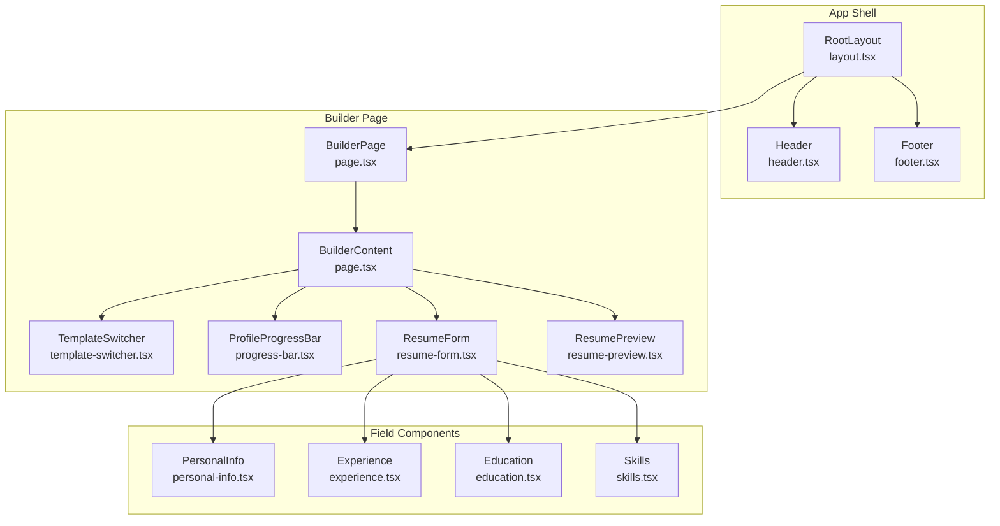
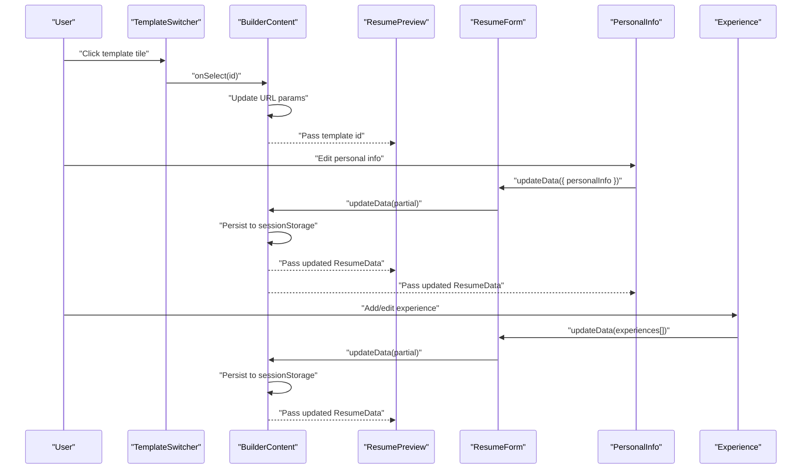
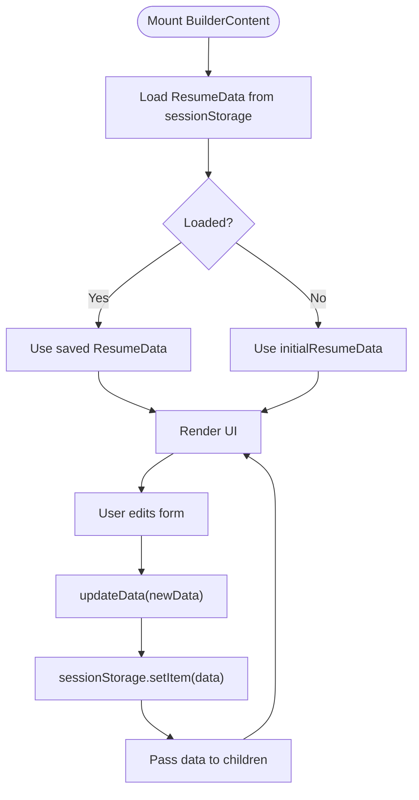
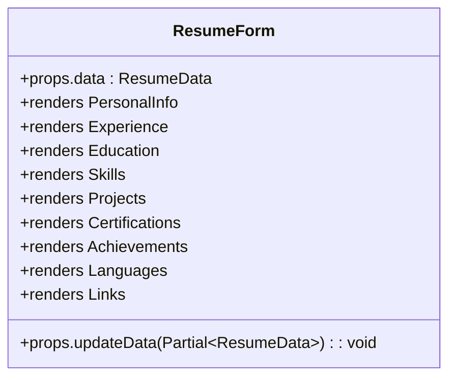
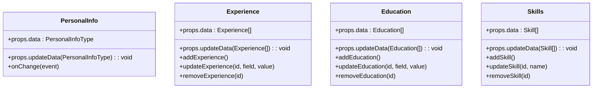
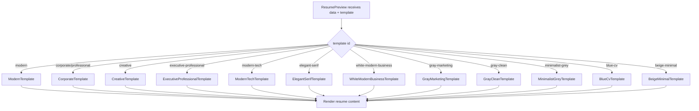
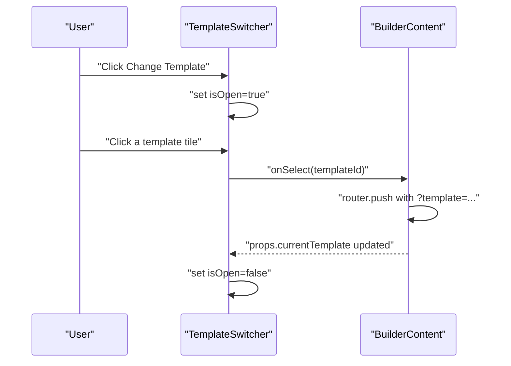
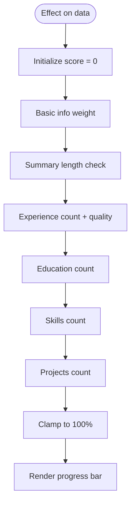
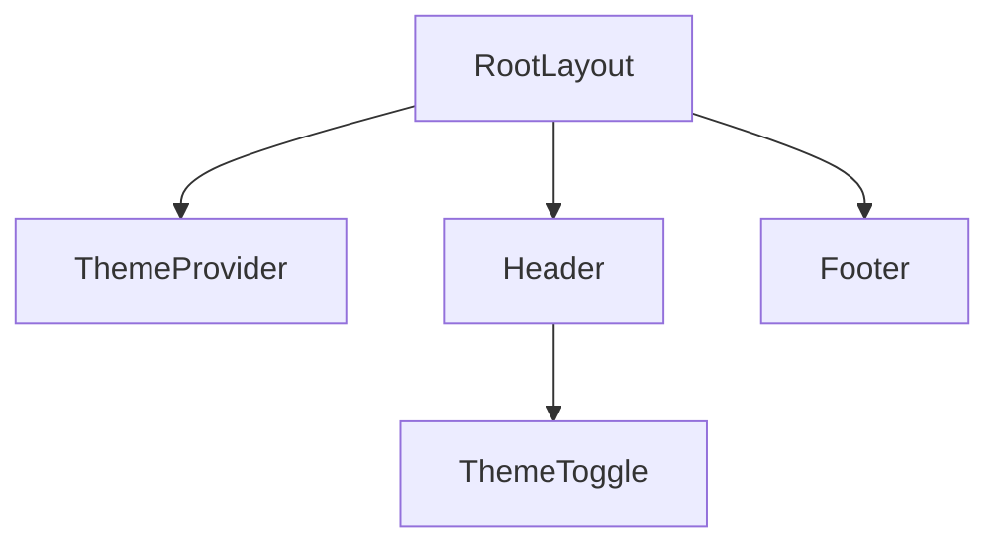
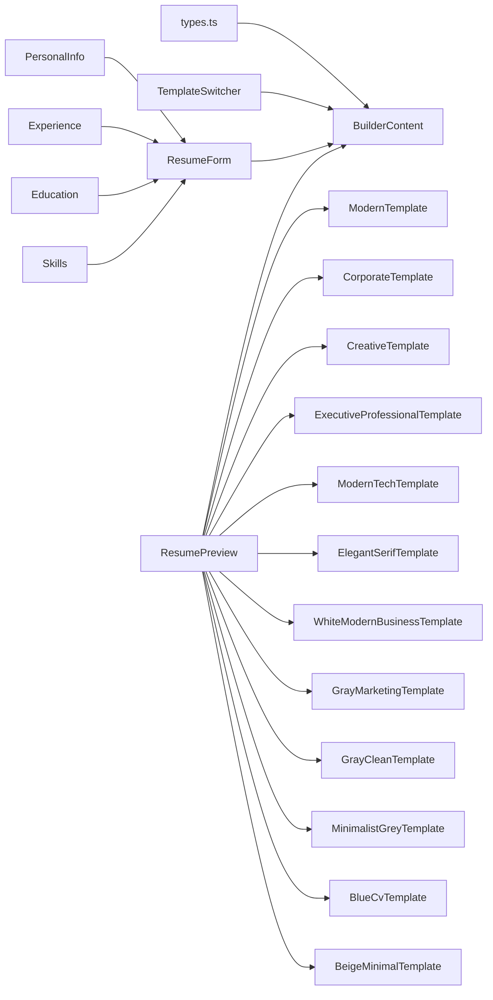

# Core Components

<cite>
**Referenced Files in This Document**
- [page.tsx](file://src/app/builder/page.tsx)
- [layout.tsx](file://src/app/layout.tsx)
- [resume-form.tsx](file://src/components/resume/resume-form.tsx)
- [resume-preview.tsx](file://src/components/resume/resume-preview.tsx)
- [template-switcher.tsx](file://src/components/resume/template-switcher.tsx)
- [progress-bar.tsx](file://src/components/resume/progress-bar.tsx)
- [personal-info.tsx](file://src/components/resume/personal-info.tsx)
- [experience.tsx](file://src/components/resume/experience.tsx)
- [education.tsx](file://src/components/resume/education.tsx)
- [skills.tsx](file://src/components/resume/skills.tsx)
- [header.tsx](file://src/components/layout/header.tsx)
- [footer.tsx](file://src/components/layout/footer.tsx)
- [theme-toggle.tsx](file://src/components/layout/theme-toggle.tsx)
- [types.ts](file://src/lib/types.ts)
</cite>

## Table of Contents
1. [Introduction](#introduction)
2. [Project Structure](#project-structure)
3. [Core Components](#core-components)
4. [Architecture Overview](#architecture-overview)
5. [Detailed Component Analysis](#detailed-component-analysis)
6. [Dependency Analysis](#dependency-analysis)
7. [Performance Considerations](#performance-considerations)
8. [Troubleshooting Guide](#troubleshooting-guide)
9. [Conclusion](#conclusion)

## Introduction
This document explains the core components of the resume builder application, focusing on the main builder page, the resume form orchestration, and the live preview system. It covers component hierarchy, prop relationships, state management patterns, real-time editing, template switching, progress tracking, and practical examples of composition, events, and data flow. Accessibility and performance considerations are also addressed.

## Project Structure
The builder page is the central hub that composes the form editor and the live preview. It integrates layout components (header, footer, theme toggle) and orchestrates state via session storage. The resume form composes reusable field components (personal info, experience, education, skills, etc.) and forwards updates to the parent. The preview renders the selected template and supports PDF downloads.

**Diagram sources**
- [layout.tsx:24-46](file://src/app/layout.tsx#L24-L46)
- [page.tsx:70-79](file://src/app/builder/page.tsx#L70-L79)
- [page.tsx:11-68](file://src/app/builder/page.tsx#L11-L68)
- [template-switcher.tsx:76-159](file://src/components/resume/template-switcher.tsx#L76-L159)
- [progress-bar.tsx:11-73](file://src/components/resume/progress-bar.tsx#L11-L73)
- [resume-form.tsx:19-84](file://src/components/resume/resume-form.tsx#L19-L84)
- [resume-preview.tsx:789-879](file://src/components/resume/resume-preview.tsx#L789-L879)
- [personal-info.tsx:13-118](file://src/components/resume/personal-info.tsx#L13-L118)
- [experience.tsx:15-113](file://src/components/resume/experience.tsx#L15-L113)
- [education.tsx:15-112](file://src/components/resume/education.tsx#L15-L112)
- [skills.tsx:13-72](file://src/components/resume/skills.tsx#L13-L72)

**Section sources**
- [layout.tsx:24-46](file://src/app/layout.tsx#L24-L46)
- [page.tsx:70-79](file://src/app/builder/page.tsx#L70-L79)
- [page.tsx:11-68](file://src/app/builder/page.tsx#L11-L68)

## Core Components
- BuilderPage and BuilderContent: Host the two-column layout, manage template selection via URL search params, persist data to session storage, and pass data down to child components.
- ResumeForm: Orchestrates field components and consolidates partial updates into the top-level ResumeData.
- Field Components: PersonalInfo, Experience, Education, Skills, and others accept typed data and update callbacks to keep state normalized.
- ResumePreview: Renders the selected template component and exposes a print/download flow.
- TemplateSwitcher: Presents a gallery of templates and updates the URL to trigger template rendering.
- ProfileProgressBar: Computes and displays a profile strength score derived from ResumeData.
- Layout and Theme: Header, Footer, ThemeToggle integrate at the app shell level.

**Section sources**
- [page.tsx:11-68](file://src/app/builder/page.tsx#L11-L68)
- [resume-form.tsx:19-84](file://src/components/resume/resume-form.tsx#L19-L84)
- [resume-preview.tsx:789-879](file://src/components/resume/resume-preview.tsx#L789-L879)
- [template-switcher.tsx:76-159](file://src/components/resume/template-switcher.tsx#L76-L159)
- [progress-bar.tsx:11-73](file://src/components/resume/progress-bar.tsx#L11-L73)
- [header.tsx:8-44](file://src/components/layout/header.tsx#L8-L44)
- [footer.tsx:1-12](file://src/components/layout/footer.tsx#L1-L12)
- [theme-toggle.tsx:9-25](file://src/components/layout/theme-toggle.tsx#L9-L25)

## Architecture Overview
The builder follows a unidirectional data flow:
- Parent state (ResumeData) lives in BuilderContent.
- Child components receive immutable props and callbacks to update nested parts of ResumeData.
- Session storage persists edits locally across browser sessions.
- TemplateSwitcher updates URL params; BuilderContent reads the template ID and passes it to ResumePreview.
- ResumePreview selects a template renderer based on the template ID and prints/downloads the rendered content.

**Diagram sources**
- [template-switcher.tsx:119-122](file://src/components/resume/template-switcher.tsx#L119-L122)
- [page.tsx:38-42](file://src/app/builder/page.tsx#L38-L42)
- [page.tsx:34-36](file://src/app/builder/page.tsx#L34-L36)
- [resume-form.tsx:30-36](file://src/components/resume/resume-form.tsx#L30-L36)
- [personal-info.tsx:14-16](file://src/components/resume/personal-info.tsx#L14-L16)
- [experience.tsx:31-35](file://src/components/resume/experience.tsx#L31-L35)
- [resume-preview.tsx:810-839](file://src/components/resume/resume-preview.tsx#L810-L839)

## Detailed Component Analysis

### Builder Page and State Management
- Initializes ResumeData from sessionStorage or defaults.
- Persists changes to sessionStorage on every update.
- Manages template selection by updating URL search params and reading the template ID.
- Passes data and callbacks to ResumeForm and ResumePreview.

**Diagram sources**
- [page.tsx:17-36](file://src/app/builder/page.tsx#L17-L36)
- [page.tsx:34-36](file://src/app/builder/page.tsx#L34-L36)

**Section sources**
- [page.tsx:11-68](file://src/app/builder/page.tsx#L11-L68)
- [types.ts:69-103](file://src/lib/types.ts#L69-L103)

### Resume Form Orchestration
- Receives ResumeData and a callback to update partial ResumeData.
- Composes field components in a logical order and wraps each with a horizontal separator.
- Normalizes updates by passing only the changed segment (e.g., personalInfo, experience) up to the parent.

**Diagram sources**
- [resume-form.tsx:19-84](file://src/components/resume/resume-form.tsx#L19-L84)

**Section sources**
- [resume-form.tsx:19-84](file://src/components/resume/resume-form.tsx#L19-L84)

### Individual Field Components
- PersonalInfo: Two-way binding for basic contact and summary fields.
- Experience: Array of entries with add/remove and per-field updates.
- Education: Array of entries with add/remove and per-field updates.
- Skills: Array of skill entries with add/remove and inline updates.

**Diagram sources**
- [personal-info.tsx:13-118](file://src/components/resume/personal-info.tsx#L13-L118)
- [experience.tsx:15-113](file://src/components/resume/experience.tsx#L15-L113)
- [education.tsx:15-112](file://src/components/resume/education.tsx#L15-L112)
- [skills.tsx:13-72](file://src/components/resume/skills.tsx#L13-L72)

**Section sources**
- [personal-info.tsx:13-118](file://src/components/resume/personal-info.tsx#L13-L118)
- [experience.tsx:15-113](file://src/components/resume/experience.tsx#L15-L113)
- [education.tsx:15-112](file://src/components/resume/education.tsx#L15-L112)
- [skills.tsx:13-72](file://src/components/resume/skills.tsx#L13-L72)

### Resume Preview and Templates
- Accepts ResumeData and template id.
- Uses a renderTemplate switch to select a template component.
- Exposes a print/download mechanism via a library hook and a wrapper element for A4 sizing.

**Diagram sources**
- [resume-preview.tsx:810-839](file://src/components/resume/resume-preview.tsx#L810-L839)

**Section sources**
- [resume-preview.tsx:789-879](file://src/components/resume/resume-preview.tsx#L789-L879)

### Template Switcher
- Presents a sidebar gallery of available templates with images.
- Tracks current selection and invokes a callback to update the URL and template id.

**Diagram sources**
- [template-switcher.tsx:76-159](file://src/components/resume/template-switcher.tsx#L76-L159)
- [page.tsx:38-42](file://src/app/builder/page.tsx#L38-L42)

**Section sources**
- [template-switcher.tsx:76-159](file://src/components/resume/template-switcher.tsx#L76-L159)
- [page.tsx:38-42](file://src/app/builder/page.tsx#L38-L42)

### Progress Tracking
- Computes a profile strength percentage based on presence and quality of data.
- Updates reactively when ResumeData changes.

**Diagram sources**
- [progress-bar.tsx:14-45](file://src/components/resume/progress-bar.tsx#L14-L45)

**Section sources**
- [progress-bar.tsx:11-73](file://src/components/resume/progress-bar.tsx#L11-L73)

### Layout and Theme Integration
- Root layout sets up fonts, theme provider, header, and footer.
- Header includes navigation and theme toggle.
- Theme toggle switches between light/dark modes.

**Diagram sources**
- [layout.tsx:24-46](file://src/app/layout.tsx#L24-L46)
- [header.tsx:8-44](file://src/components/layout/header.tsx#L8-L44)
- [theme-toggle.tsx:9-25](file://src/components/layout/theme-toggle.tsx#L9-L25)

**Section sources**
- [layout.tsx:24-46](file://src/app/layout.tsx#L24-L46)
- [header.tsx:8-44](file://src/components/layout/header.tsx#L8-L44)
- [theme-toggle.tsx:9-25](file://src/components/layout/theme-toggle.tsx#L9-L25)

## Dependency Analysis
- BuilderContent depends on:
  - ResumeData type for typing.
  - TemplateSwitcher for navigation.
  - ResumeForm for editing.
  - ResumePreview for rendering.
- ResumeForm depends on:
  - Individual field components.
  - ResumeData shape for partial updates.
- ResumePreview depends on:
  - TemplateSwitcher’s template id.
  - Template components for rendering.
  - Print/download utilities.
- Field components depend on:
  - Shadcn UI primitives (Input, Textarea, Button, Label).
  - Types for their respective sections.

**Diagram sources**
- [types.ts:69-103](file://src/lib/types.ts#L69-L103)
- [page.tsx:11-68](file://src/app/builder/page.tsx#L11-L68)
- [resume-form.tsx:19-84](file://src/components/resume/resume-form.tsx#L19-L84)
- [resume-preview.tsx:810-839](file://src/components/resume/resume-preview.tsx#L810-L839)

**Section sources**
- [types.ts:69-103](file://src/lib/types.ts#L69-L103)
- [page.tsx:11-68](file://src/app/builder/page.tsx#L11-L68)
- [resume-form.tsx:19-84](file://src/components/resume/resume-form.tsx#L19-L84)
- [resume-preview.tsx:810-839](file://src/components/resume/resume-preview.tsx#L810-L839)

## Performance Considerations
- Local persistence: Using sessionStorage avoids unnecessary server round-trips during editing.
- Minimal re-renders: ResumeForm composes small, focused components; each field component manages its own local state for inputs.
- Template rendering: TemplateSwitcher defers to URL-driven routing; ResumePreview computes the template once per change.
- Printing: The print hook targets a dedicated DOM node sized for A4, reducing layout thrash.
- Scroll areas: Both form and preview use overflow containers to keep large lists performant.

[No sources needed since this section provides general guidance]

## Troubleshooting Guide
- Data not persisting:
  - Verify sessionStorage access and JSON parsing in BuilderContent initialization.
  - Confirm updateData is invoked after every edit.
- Template not changing:
  - Ensure TemplateSwitcher onSelect triggers router.push with the correct template param.
  - Confirm ResumePreview reads the template id from props and switches accordingly.
- Print/download fails:
  - Check that the target ref is attached to the printable container.
  - Ensure the print hook is initialized with the correct ref and document title.
- Progress bar not updating:
  - Confirm ResumeData changes are passed to ProfileProgressBar and that the effect recomputes the score.

**Section sources**
- [page.tsx:17-36](file://src/app/builder/page.tsx#L17-L36)
- [page.tsx:38-42](file://src/app/builder/page.tsx#L38-L42)
- [resume-preview.tsx:796-808](file://src/components/resume/resume-preview.tsx#L796-L808)
- [progress-bar.tsx:14-45](file://src/components/resume/progress-bar.tsx#L14-L45)

## Conclusion
The resume builder’s core components form a cohesive, predictable system:
- BuilderContent centralizes state and routing.
- ResumeForm composes typed field components with minimal coupling.
- ResumePreview renders templates efficiently and supports printing.
- TemplateSwitcher and ProfileProgressBar enhance UX.
- Layout and theme integrate seamlessly at the app shell level.

This architecture enables real-time editing, smooth template switching, and reliable persistence while keeping components modular and testable.