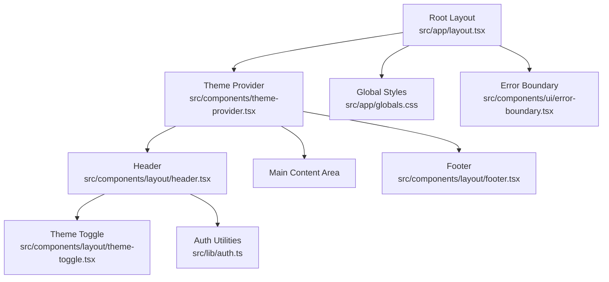
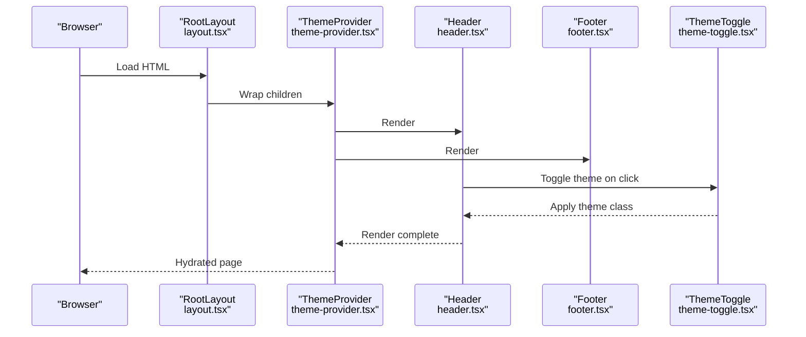
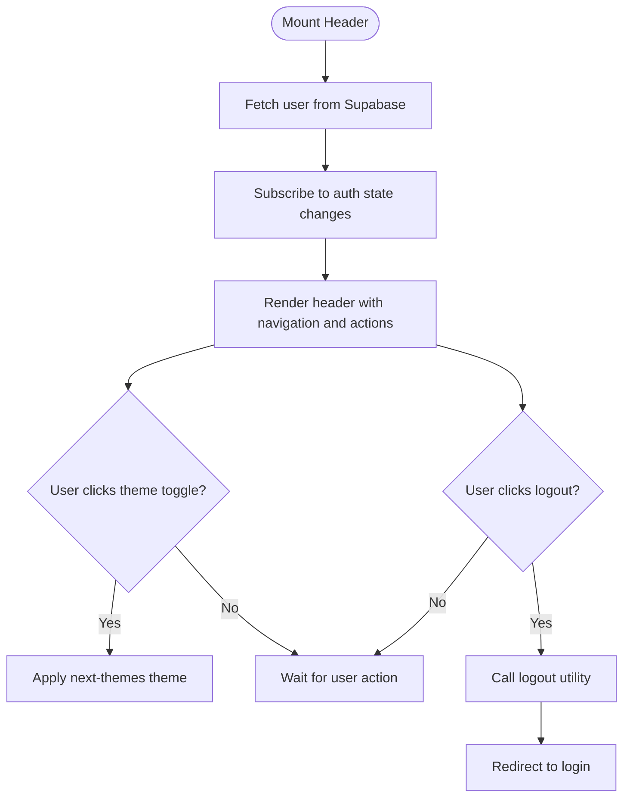
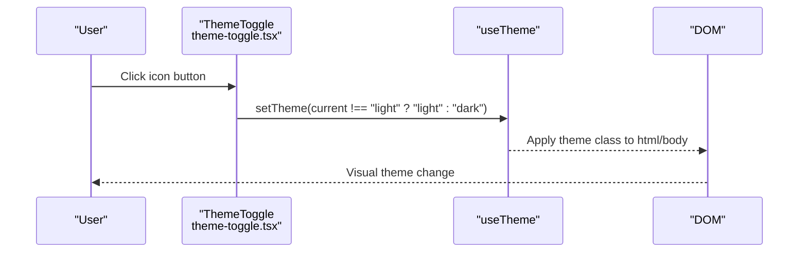
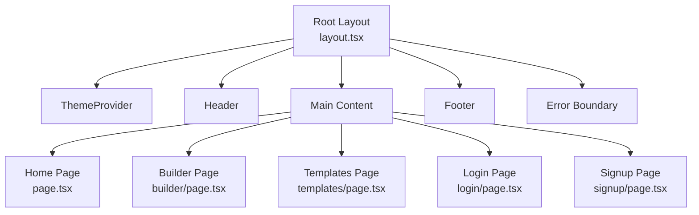
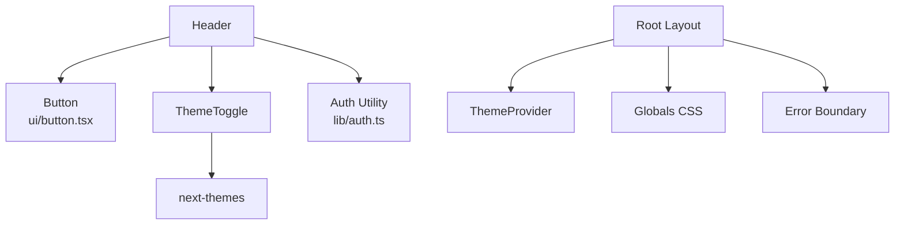

# Layout Components

<cite>
**Referenced Files in This Document**
- [header.tsx](file://src/components/layout/header.tsx)
- [footer.tsx](file://src/components/layout/footer.tsx)
- [theme-toggle.tsx](file://src/components/layout/theme-toggle.tsx)
- [theme-provider.tsx](file://src/components/theme-provider.tsx)
- [layout.tsx](file://src/app/layout.tsx)
- [button.tsx](file://src/components/ui/button.tsx)
- [globals.css](file://src/app/globals.css)
- [auth.ts](file://src/lib/auth.ts)
- [page.tsx](file://src/app/page.tsx)
- [error-boundary.tsx](file://src/components/ui/error-boundary.tsx)
- [builder/page.tsx](file://src/app/builder/page.tsx)
- [templates/page.tsx](file://src/app/templates/page.tsx)
- [login/page.tsx](file://src/app/login/page.tsx)
- [signup/page.tsx](file://src/app/signup/page.tsx)
</cite>

## Table of Contents
1. [Introduction](#introduction)
2. [Project Structure](#project-structure)
3. [Core Components](#core-components)
4. [Architecture Overview](#architecture-overview)
5. [Detailed Component Analysis](#detailed-component-analysis)
6. [Dependency Analysis](#dependency-analysis)
7. [Performance Considerations](#performance-considerations)
8. [Troubleshooting Guide](#troubleshooting-guide)
9. [Conclusion](#conclusion)

## Introduction
This document explains the layout components that form the application’s structural framework. It covers the header navigation and branding, the footer information display, and the theme toggle mechanism for switching between light and dark modes. It also documents how the theme provider manages global styling context and how the layout coordinates with the main application routing. Accessibility and responsive design patterns are addressed alongside the overall user experience flow.

## Project Structure
The layout system centers around three primary layout components and a theme provider:
- Header: Provides branding, navigation, user state-aware actions, and theme toggle.
- Footer: Displays site information.
- Theme Toggle: Switches between light and dark themes.
- Theme Provider: Wraps the application to enable theme persistence and transitions.

These components integrate with the root layout and Next.js app directory routing to deliver a cohesive user experience across pages.

**Diagram sources**
- [layout.tsx:25-49](file://src/app/layout.tsx#L25-L49)
- [theme-provider.tsx:7-9](file://src/components/theme-provider.tsx#L7-L9)
- [header.tsx:12-100](file://src/components/layout/header.tsx#L12-L100)
- [footer.tsx:1-12](file://src/components/layout/footer.tsx#L1-L12)
- [theme-toggle.tsx:9-25](file://src/components/layout/theme-toggle.tsx#L9-L25)
- [auth.ts:3-11](file://src/lib/auth.ts#L3-L11)
- [globals.css:1-169](file://src/app/globals.css#L1-L169)
- [error-boundary.tsx:18-78](file://src/components/ui/error-boundary.tsx#L18-L78)

**Section sources**
- [layout.tsx:25-49](file://src/app/layout.tsx#L25-L49)
- [theme-provider.tsx:7-9](file://src/components/theme-provider.tsx#L7-L9)
- [header.tsx:12-100](file://src/components/layout/header.tsx#L12-L100)
- [footer.tsx:1-12](file://src/components/layout/footer.tsx#L1-L12)
- [theme-toggle.tsx:9-25](file://src/components/layout/theme-toggle.tsx#L9-L25)
- [auth.ts:3-11](file://src/lib/auth.ts#L3-L11)
- [globals.css:1-169](file://src/app/globals.css#L1-L169)
- [error-boundary.tsx:18-78](file://src/components/ui/error-boundary.tsx#L18-L78)

## Core Components
- Header
  - Displays branding and navigational links.
  - Shows user-specific actions when authenticated; otherwise shows sign-in and sign-up options.
  - Integrates the theme toggle and logout action.
- Footer
  - Renders a concise informational message.
- Theme Toggle
  - Uses next-themes to switch between light and dark themes.
  - Provides accessible semantics with screen-reader support.
- Theme Provider
  - Wraps the application to enable theme-aware rendering and persistence.

**Section sources**
- [header.tsx:12-100](file://src/components/layout/header.tsx#L12-L100)
- [footer.tsx:1-12](file://src/components/layout/footer.tsx#L1-L12)
- [theme-toggle.tsx:9-25](file://src/components/layout/theme-toggle.tsx#L9-L25)
- [theme-provider.tsx:7-9](file://src/components/theme-provider.tsx#L7-L9)

## Architecture Overview
The layout components are wired into the root layout, which sets up fonts, global styles, and the theme provider. The header and footer are rendered consistently across pages, while the main content area changes based on routing.

**Diagram sources**
- [layout.tsx:25-49](file://src/app/layout.tsx#L25-L49)
- [theme-provider.tsx:7-9](file://src/components/theme-provider.tsx#L7-L9)
- [header.tsx:12-100](file://src/components/layout/header.tsx#L12-L100)
- [footer.tsx:1-12](file://src/components/layout/footer.tsx#L1-L12)
- [theme-toggle.tsx:9-25](file://src/components/layout/theme-toggle.tsx#L9-L25)

## Detailed Component Analysis

### Header Component
Responsibilities:
- Branding: Displays logo and application name.
- Navigation: Provides links to key areas (features anchor, templates, builder).
- Authentication-aware UI: Shows build resume, user email, and logout when signed in; otherwise shows sign-in and sign-up.
- Theme Toggle: Integrates the theme toggle component.
- Responsive behavior: Adapts spacing and visibility of elements across breakpoints.

Key behaviors:
- Initializes user state from Supabase and subscribes to auth state changes.
- Uses a button component abstraction for consistent styling and accessibility.
- Triggers logout via a utility that signs out from Supabase and redirects to login.

**Diagram sources**
- [header.tsx:15-32](file://src/components/layout/header.tsx#L15-L32)
- [theme-toggle.tsx:9-25](file://src/components/layout/theme-toggle.tsx#L9-L25)
- [auth.ts:3-11](file://src/lib/auth.ts#L3-L11)

**Section sources**
- [header.tsx:12-100](file://src/components/layout/header.tsx#L12-L100)
- [button.tsx:42-54](file://src/components/ui/button.tsx#L42-L54)
- [auth.ts:3-11](file://src/lib/auth.ts#L3-L11)

### Footer Component
Responsibilities:
- Displays a concise brand message centered on small screens and aligned left on larger screens.
- Maintains consistent padding and responsive spacing.

Implementation highlights:
- Uses Tailwind utility classes for responsive alignment and spacing.
- Minimal JSX with a single paragraph element.

**Section sources**
- [footer.tsx:1-12](file://src/components/layout/footer.tsx#L1-L12)

### Theme Toggle Component
Responsibilities:
- Switches between light and dark themes using next-themes.
- Provides accessible semantics with a screen-reader-only label.
- Uses an icon button styled consistently with the shared Button component.

Implementation highlights:
- Reads and writes the current theme via useTheme.
- Toggles theme by setting the theme state to the opposite of the current value.
- Renders sun and moon icons with transitions for smooth theme switching.

**Diagram sources**
- [theme-toggle.tsx:9-25](file://src/components/layout/theme-toggle.tsx#L9-L25)

**Section sources**
- [theme-toggle.tsx:9-25](file://src/components/layout/theme-toggle.tsx#L9-L25)

### Theme Provider
Responsibilities:
- Wraps the application to enable theme-aware rendering.
- Manages theme persistence and disables transition on theme change to avoid flashing.

Implementation highlights:
- Uses next-themes provider with attribute-based theming and a default theme.
- Disables transition on theme change to prevent visual flicker during hydration.

**Section sources**
- [theme-provider.tsx:7-9](file://src/components/theme-provider.tsx#L7-L9)
- [layout.tsx:35-45](file://src/app/layout.tsx#L35-L45)

### Global Styling and Typography
Responsibilities:
- Defines CSS custom properties for theme tokens (light and dark).
- Exposes Tailwind theme tokens and animations.
- Applies base styles and ensures consistent typography and color usage.

Implementation highlights:
- Uses CSS variables for background, foreground, primary, secondary, and UI tokens.
- Defines a custom dark variant for Tailwind utilities.
- Includes animations and base layer styles for borders and outlines.

**Section sources**
- [globals.css:7-169](file://src/app/globals.css#L7-L169)

### Routing and Layout Coordination
Responsibilities:
- Root layout composes the theme provider, header, main content area, and footer.
- Main content changes per route (home, builder, templates, login, signup).
- Error boundaries wrap the layout to gracefully handle runtime errors.

Implementation highlights:
- Root layout defines fonts, metadata, and the overall flex layout.
- Error boundary renders a friendly UI and provides refresh and retry actions.
- Pages under app directory render inside the main content area.

**Diagram sources**
- [layout.tsx:25-49](file://src/app/layout.tsx#L25-L49)
- [page.tsx:11-178](file://src/app/page.tsx#L11-L178)
- [builder/page.tsx:70-79](file://src/app/builder/page.tsx#L70-L79)
- [templates/page.tsx:76-178](file://src/app/templates/page.tsx#L76-L178)
- [login/page.tsx:12-113](file://src/app/login/page.tsx#L12-L113)
- [signup/page.tsx:12-150](file://src/app/signup/page.tsx#L12-L150)
- [error-boundary.tsx:18-78](file://src/components/ui/error-boundary.tsx#L18-L78)

**Section sources**
- [layout.tsx:25-49](file://src/app/layout.tsx#L25-L49)
- [page.tsx:11-178](file://src/app/page.tsx#L11-L178)
- [builder/page.tsx:70-79](file://src/app/builder/page.tsx#L70-L79)
- [templates/page.tsx:76-178](file://src/app/templates/page.tsx#L76-L178)
- [login/page.tsx:12-113](file://src/app/login/page.tsx#L12-L113)
- [signup/page.tsx:12-150](file://src/app/signup/page.tsx#L12-L150)
- [error-boundary.tsx:18-78](file://src/components/ui/error-boundary.tsx#L18-L78)

## Dependency Analysis
The layout components depend on:
- Shared UI primitives (Button) for consistent styling and accessibility.
- Theme system (next-themes) via the ThemeProvider and ThemeToggle.
- Authentication utilities for user state and logout.
- Global styles for theme tokens and typography.

**Diagram sources**
- [header.tsx:6-10](file://src/components/layout/header.tsx#L6-L10)
- [button.tsx:42-54](file://src/components/ui/button.tsx#L42-L54)
- [theme-toggle.tsx](file://src/components/layout/theme-toggle.tsx#L5)
- [theme-provider.tsx:7-9](file://src/components/theme-provider.tsx#L7-L9)
- [layout.tsx:5-8](file://src/app/layout.tsx#L5-L8)
- [globals.css:1-169](file://src/app/globals.css#L1-L169)
- [error-boundary.tsx:18-78](file://src/components/ui/error-boundary.tsx#L18-L78)

**Section sources**
- [header.tsx:6-10](file://src/components/layout/header.tsx#L6-L10)
- [button.tsx:42-54](file://src/components/ui/button.tsx#L42-L54)
- [theme-toggle.tsx](file://src/components/layout/theme-toggle.tsx#L5)
- [theme-provider.tsx:7-9](file://src/components/theme-provider.tsx#L7-L9)
- [layout.tsx:5-8](file://src/app/layout.tsx#L5-L8)
- [globals.css:1-169](file://src/app/globals.css#L1-L169)
- [error-boundary.tsx:18-78](file://src/components/ui/error-boundary.tsx#L18-L78)

## Performance Considerations
- Theme transitions: The theme provider disables transition on theme change to avoid visual flicker during hydration.
- Hydration warnings: The root layout suppresses hydration warnings to maintain a smooth initial render.
- Error boundaries: The error boundary prevents cascading failures and provides a graceful fallback UI.

[No sources needed since this section provides general guidance]

## Troubleshooting Guide
Common issues and resolutions:
- Theme not persisting across sessions
  - Ensure the theme provider is wrapping the application and configured with an appropriate attribute and default theme.
  - Verify that the theme toggle updates the theme state correctly.
- Logout not redirecting to login
  - Confirm the logout utility calls the Supabase sign-out method and clears session storage, then redirects to the login route.
- Auth state not updating in header
  - Verify the header subscribes to Supabase auth state changes and updates user state accordingly.
- Error rendering unexpectedly
  - Check the error boundary configuration and confirm it handles derived state and user actions like refresh and retry.

**Section sources**
- [theme-provider.tsx:7-9](file://src/components/theme-provider.tsx#L7-L9)
- [theme-toggle.tsx:9-25](file://src/components/layout/theme-toggle.tsx#L9-L25)
- [auth.ts:3-11](file://src/lib/auth.ts#L3-L11)
- [header.tsx:15-32](file://src/components/layout/header.tsx#L15-L32)
- [error-boundary.tsx:24-78](file://src/components/ui/error-boundary.tsx#L24-L78)

## Conclusion
The layout components provide a consistent, accessible, and responsive foundation for the application. The header delivers clear navigation and user actions, the footer communicates essential information, and the theme toggle enables seamless light/dark mode switching integrated with the theme provider. Together with the root layout and routing, they ensure a coherent user experience across all pages.