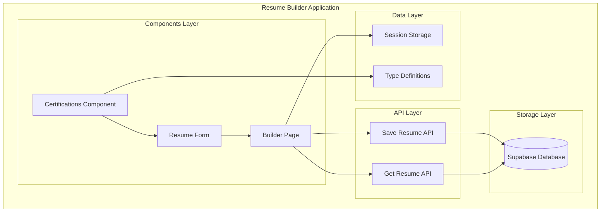
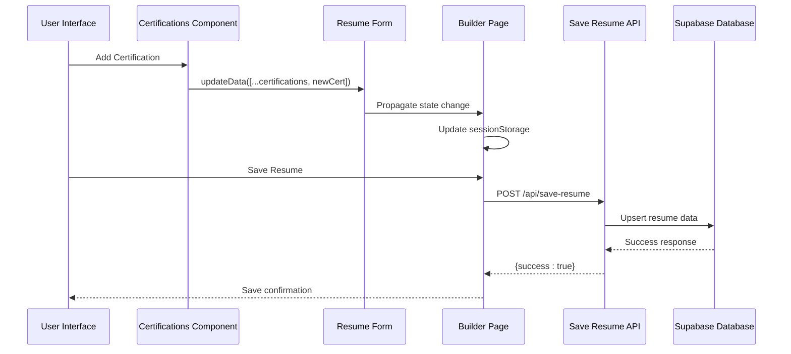
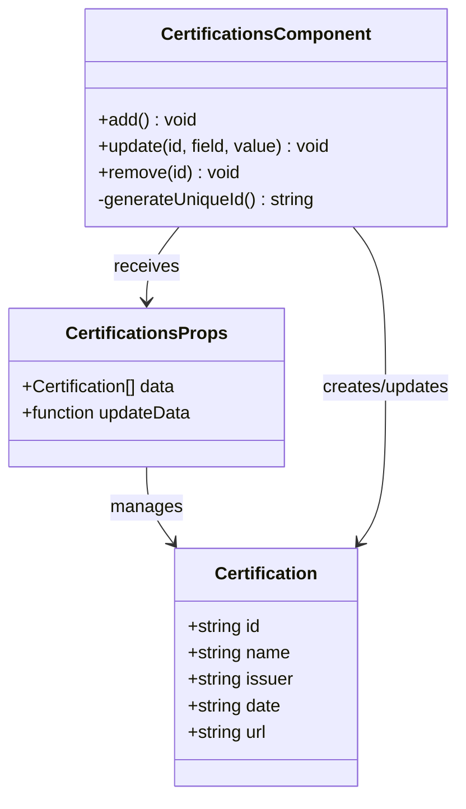
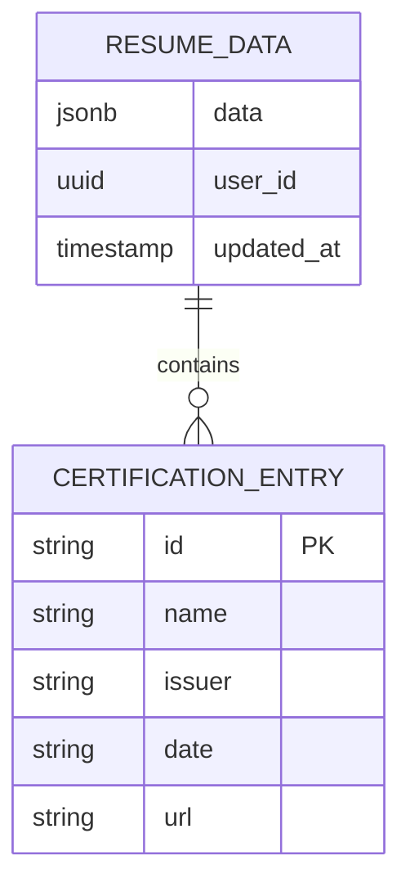
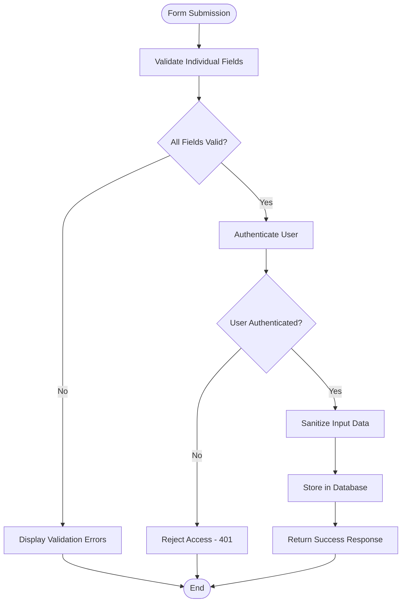

# Certifications Component

<cite>
**Referenced Files in This Document**
- [certifications.tsx](file://src/components/resume/certifications.tsx)
- [types.ts](file://src/lib/types.ts)
- [resume-form.tsx](file://src/components/resume/resume-form.tsx)
- [builder/page.tsx](file://src/app/builder/page.tsx)
- [save-resume/route.ts](file://src/app/api/save-resume/route.ts)
- [get-resume/route.ts](file://src/app/api/get-resume/route.ts)
- [supabase.ts](file://src/lib/supabase.ts)
- [supabase-setup.sql](file://supabase-setup.sql)
</cite>

## Table of Contents
1. [Introduction](#introduction)
2. [Project Structure](#project-structure)
3. [Core Components](#core-components)
4. [Architecture Overview](#architecture-overview)
5. [Detailed Component Analysis](#detailed-component-analysis)
6. [Certification Data Model](#certification-data-model)
7. [Validation and Security](#validation-and-security)
8. [Implementation Examples](#implementation-examples)
9. [Industry-Specific Certifications](#industry-specific-certifications)
10. [Performance Considerations](#performance-considerations)
11. [Troubleshooting Guide](#troubleshooting-guide)
12. [Conclusion](#conclusion)

## Introduction

The Certifications component is a specialized form element within the resume builder application that enables users to capture and manage professional certification information. This component provides an intuitive interface for entering certification details including issuing organizations, credential names, issue dates, and verification links, while maintaining data integrity through robust validation and secure storage mechanisms.

The component integrates seamlessly with the broader resume building system, supporting dynamic addition and removal of certification entries, real-time data persistence, and comprehensive user experience features including responsive layouts and accessibility considerations.

## Project Structure

The Certifications component is organized within the resume builder's component hierarchy, positioned alongside other professional experience sections. The component follows a modular architecture pattern that promotes reusability and maintainability across the application.

**Diagram sources**
- [certifications.tsx:1-67](file://src/components/resume/certifications.tsx#L1-L67)
- [resume-form.tsx:1-84](file://src/components/resume/resume-form.tsx#L1-L84)
- [builder/page.tsx:1-92](file://src/app/builder/page.tsx#L1-L92)

**Section sources**
- [certifications.tsx:1-67](file://src/components/resume/certifications.tsx#L1-L67)
- [resume-form.tsx:1-84](file://src/components/resume/resume-form.tsx#L1-L84)
- [builder/page.tsx:1-92](file://src/app/builder/page.tsx#L1-L92)

## Core Components

The Certifications component consists of several interconnected elements that work together to provide a comprehensive certification management experience:

### Component Architecture
- **Dynamic Form Fields**: Supports unlimited certification entries with individual field validation
- **Interactive Controls**: Add/remove buttons with visual feedback and keyboard navigation
- **Responsive Layout**: Grid-based form layout that adapts to different screen sizes
- **State Management**: Local state handling with parent component communication

### Data Flow
The component implements a unidirectional data flow pattern where parent components manage state and pass data down as props, ensuring predictable updates and easy debugging.

**Section sources**
- [certifications.tsx:9-12](file://src/components/resume/certifications.tsx#L9-L12)
- [types.ts:43-49](file://src/lib/types.ts#L43-L49)

## Architecture Overview

The Certifications component operates within a three-tier architecture that separates concerns between presentation, data management, and persistence layers.

**Diagram sources**
- [certifications.tsx:14-21](file://src/components/resume/certifications.tsx#L14-L21)
- [resume-form.tsx:58-61](file://src/components/resume/resume-form.tsx#L58-L61)
- [builder/page.tsx:41-43](file://src/app/builder/page.tsx#L41-L43)
- [save-resume/route.ts:31-74](file://src/app/api/save-resume/route.ts#L31-L74)

## Detailed Component Analysis

### Component Implementation

The Certifications component utilizes React's functional component pattern with TypeScript for type safety and enhanced developer experience.

#### State Management Strategy
The component maintains local state for certification entries and delegates persistence to parent components, following React's recommended patterns for controlled components.

#### Form Field Structure
Each certification entry includes four essential fields:
- **Certification Name**: Primary credential identifier
- **Issuing Organization**: Credential-granting institution or body
- **Date Issued**: Certification completion or issuance date
- **Credential URL**: Optional verification link for third-party validation

**Diagram sources**
- [types.ts:43-49](file://src/lib/types.ts#L43-L49)
- [certifications.tsx:9-12](file://src/components/resume/certifications.tsx#L9-L12)
- [certifications.tsx:14-21](file://src/components/resume/certifications.tsx#L14-L21)

**Section sources**
- [certifications.tsx:14-21](file://src/components/resume/certifications.tsx#L14-L21)
- [types.ts:43-49](file://src/lib/types.ts#L43-L49)

### User Interaction Patterns

The component supports multiple interaction patterns for optimal user experience:

#### Dynamic Content Management
- **Add Certifications**: Users can add unlimited certification entries
- **Edit Existing Entries**: Inline editing with immediate validation
- **Remove Entries**: One-click removal with confirmation support

#### Accessibility Features
- Keyboard navigation support
- Screen reader compatibility
- Focus management
- High contrast mode support

**Section sources**
- [certifications.tsx:23-66](file://src/components/resume/certifications.tsx#L23-L66)

## Certification Data Model

The certification data model defines the structure and constraints for storing professional credential information within the application's database schema.

### Data Structure Definition

| Field | Type | Required | Description |
|-------|------|----------|-------------|
| id | string | Yes | Unique identifier for certification entry |
| name | string | Yes | Full name of the certification credential |
| issuer | string | Yes | Organization that issued the certification |
| date | string | Yes | Issue date in MM/YYYY format |
| url | string | No | Verification URL for third-party validation |

### Data Validation Rules

The certification data model enforces several validation rules to ensure data integrity:

#### Field Constraints
- **Name**: Non-empty string with maximum length limits
- **Issuer**: Non-empty string for organizational identification
- **Date**: Date format validation (MM/YYYY)
- **URL**: Valid URL format when provided

#### Business Logic Constraints
- **Uniqueness**: Each certification requires a unique identifier
- **Relationship Integrity**: Maintains referential integrity with parent resume data
- **Temporal Consistency**: Validates date relationships within resume timeline

**Diagram sources**
- [types.ts:69-79](file://src/lib/types.ts#L69-L79)
- [types.ts:43-49](file://src/lib/types.ts#L43-L49)

**Section sources**
- [types.ts:43-49](file://src/lib/types.ts#L43-L49)
- [types.ts:69-79](file://src/lib/types.ts#L69-L79)

## Validation and Security

The certification system implements comprehensive validation and security measures to protect user data and ensure system integrity.

### Frontend Validation

The component provides immediate feedback through:
- Real-time field validation
- User-friendly error messaging
- Input sanitization
- Format enforcement

### Backend Validation

Server-side validation ensures data integrity:
- Zod schema validation for incoming requests
- Authentication verification for all operations
- Authorization checks for data access
- Database constraint enforcement

**Diagram sources**
- [save-resume/route.ts:31-42](file://src/app/api/save-resume/route.ts#L31-L42)
- [get-resume/route.ts:10-22](file://src/app/api/get-resume/route.ts#L10-L22)

**Section sources**
- [save-resume/route.ts:31-42](file://src/app/api/save-resume/route.ts#L31-L42)
- [get-resume/route.ts:10-22](file://src/app/api/get-resume/route.ts#L10-L22)

## Implementation Examples

### Basic Certification Entry

Creating a new certification entry involves minimal user interaction:

1. **Add Entry**: Click the "Add" button to create a new certification form
2. **Enter Details**: Fill in the certification name, issuing organization, and date
3. **Optional Link**: Add verification URL if available
4. **Auto-Save**: Changes are automatically persisted to session storage

### Advanced Configuration

For complex certification scenarios:

#### Multi-Domain Certifications
Organizations offering multiple certification tracks can maintain separate entries for each credential while sharing common issuer information.

#### Professional Licensing
State-specific licenses can be tracked with appropriate date formatting and renewal indicators.

#### Industry-Specific Credentials
Specialized certifications require careful field management to accommodate varying naming conventions and verification processes.

### Integration Patterns

The certification component integrates with several system features:

#### Timeline Management
Certification entries contribute to the overall professional timeline, supporting chronological sorting and filtering capabilities.

#### Renewal Tracking
While direct expiration tracking is not implemented, the date field structure supports future enhancement for renewal reminder systems.

#### Credential Verification
The URL field enables integration with external verification systems, though the current implementation focuses on data capture rather than automated validation.

## Industry-Specific Certifications

The certification system accommodates various professional domains through flexible field design and extensible data structures.

### Technology Certifications

Common technology certifications include:
- **Cloud Platforms**: AWS, Azure, Google Cloud Professional credentials
- **Security**: CompTIA Security+, CISSP, CEH certifications
- **Development**: Microsoft Developer, Oracle Certified Professional
- **Project Management**: PMP, PMI-SP, Agile/Scrum Master certifications

### Professional Services

Industry-standard certifications encompass:
- **Financial Services**: Series 7, CFA, FRM credentials
- **Healthcare**: Various licensing and certification programs
- **Education**: Teaching credentials and professional development certs
- **Legal**: Bar admissions and specialized legal certifications

### Manufacturing and Trades

Technical certifications for skilled trades:
- **Industrial**: Various safety and equipment certifications
- **Construction**: Licensing and certification programs
- **Manufacturing**: Quality and safety certifications

## Performance Considerations

The certification component is designed for optimal performance through several architectural decisions:

### Memory Management
- Efficient state updates using immutable patterns
- Minimal re-renders through selective prop passing
- Cleanup of temporary data during component unmount

### Network Optimization
- Debounced save operations to reduce API calls
- Batch updates for multiple certification entries
- Efficient serialization of complex data structures

### Scalability Features
- Support for unlimited certification entries
- Optimized rendering for large datasets
- Lazy loading for dependent components

## Troubleshooting Guide

### Common Issues and Solutions

#### Data Persistence Problems
**Symptoms**: Certifications not saving between sessions
**Causes**: Session storage limitations or browser privacy settings
**Solutions**: 
- Verify browser supports localStorage/sessionStorage
- Check for storage quota limitations
- Implement backup data persistence strategies

#### Validation Errors
**Symptoms**: Form validation failures or submission rejections
**Causes**: Invalid date formats, missing required fields, or malformed URLs
**Solutions**:
- Ensure proper date formatting (MM/YYYY)
- Verify URL protocol (https://)
- Check field length restrictions

#### Authentication Issues
**Symptoms**: Unable to save or load certification data
**Causes**: Session expiration or authentication failures
**Solutions**:
- Re-authenticate user session
- Check network connectivity
- Verify Supabase service availability

### Debugging Strategies

#### Component-Level Debugging
- Monitor state updates through React DevTools
- Track prop drilling and state propagation
- Verify event handler execution flow

#### Database-Level Debugging
- Inspect stored JSONB data structure
- Validate RLS policies compliance
- Check for data migration issues

**Section sources**
- [save-resume/route.ts:31-82](file://src/app/api/save-resume/route.ts#L31-L82)
- [get-resume/route.ts:10-57](file://src/app/api/get-resume/route.ts#L10-L57)

## Conclusion

The Certifications component represents a robust, scalable solution for managing professional credential information within the resume builder application. Through its modular architecture, comprehensive validation system, and seamless integration with the broader application ecosystem, it provides users with an intuitive and reliable means of capturing and organizing their professional certifications.

The component's design emphasizes extensibility and maintainability, supporting future enhancements such as automated credential verification, expiration tracking, and advanced filtering capabilities. Its integration with Supabase ensures secure data persistence while maintaining excellent performance characteristics across diverse user scenarios.

Key strengths of the implementation include:
- **Type Safety**: Comprehensive TypeScript integration for enhanced development experience
- **User Experience**: Responsive design with accessibility considerations
- **Data Integrity**: Multi-layered validation and security measures
- **Extensibility**: Modular architecture supporting future feature additions
- **Performance**: Optimized rendering and efficient state management

The component successfully balances simplicity for end users with powerful functionality for developers, establishing a solid foundation for professional certification management within modern web applications.