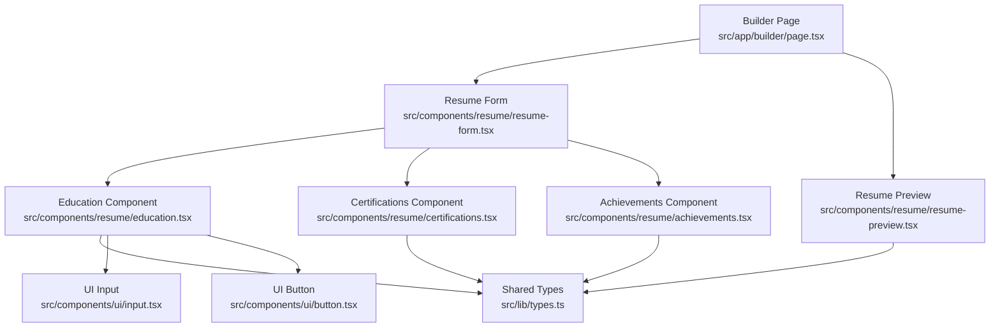
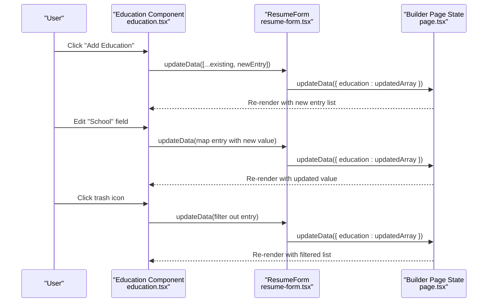
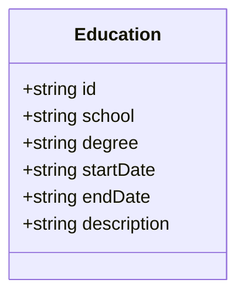
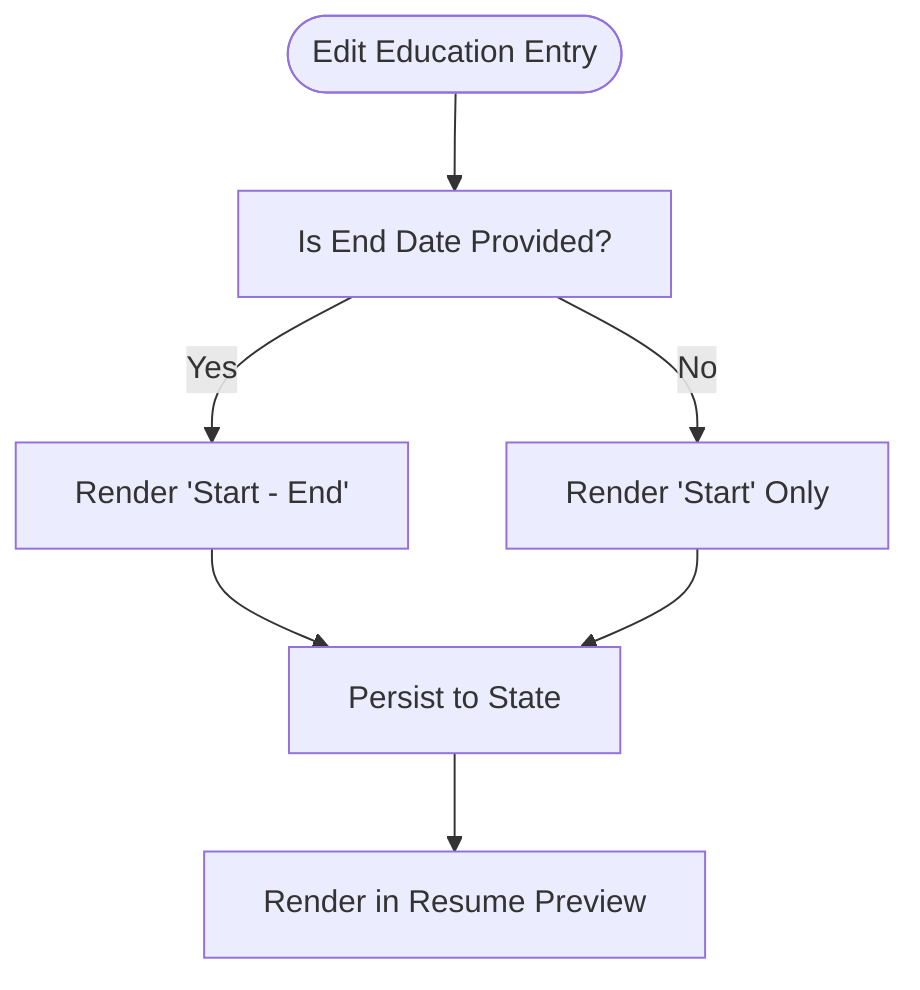
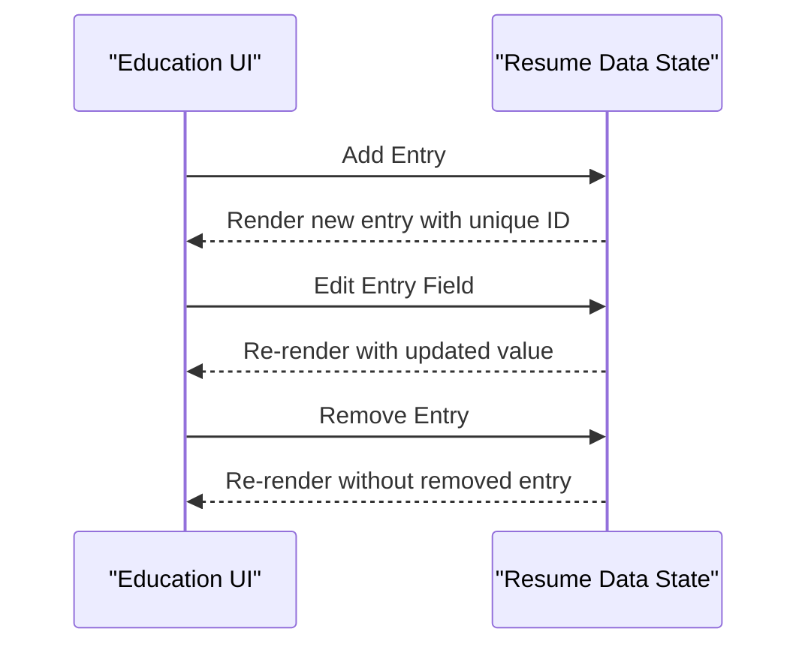
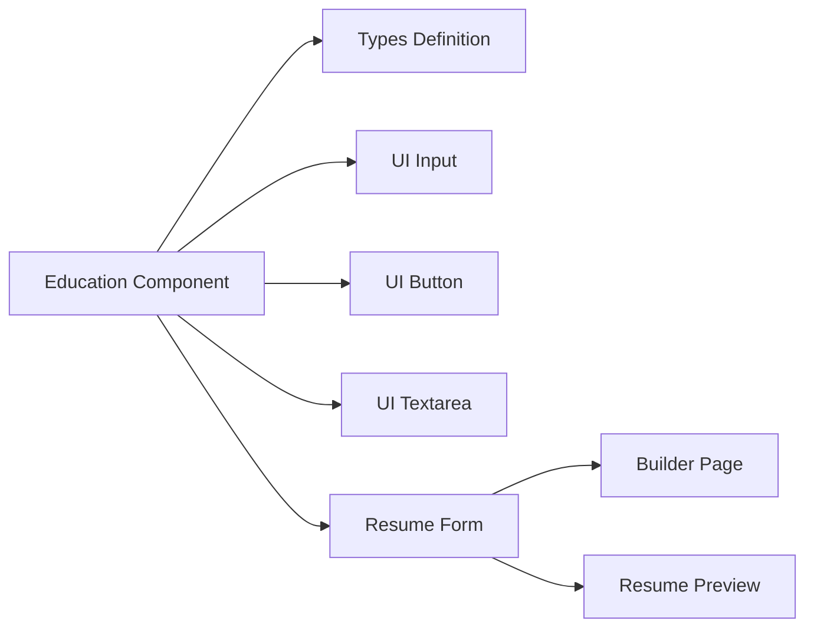

# Education Component

<cite>
**Referenced Files in This Document**
- [education.tsx](file://src/components/resume/education.tsx)
- [types.ts](file://src/lib/types.ts)
- [resume-form.tsx](file://src/components/resume/resume-form.tsx)
- [resume-preview.tsx](file://src/components/resume/resume-preview.tsx)
- [page.tsx](file://src/app/builder/page.tsx)
- [certifications.tsx](file://src/components/resume/certifications.tsx)
- [achievements.tsx](file://src/components/resume/achievements.tsx)
- [input.tsx](file://src/components/ui/input.tsx)
- [button.tsx](file://src/components/ui/button.tsx)
</cite>

## Table of Contents
1. [Introduction](#introduction)
2. [Project Structure](#project-structure)
3. [Core Components](#core-components)
4. [Architecture Overview](#architecture-overview)
5. [Detailed Component Analysis](#detailed-component-analysis)
6. [Dependency Analysis](#dependency-analysis)
7. [Performance Considerations](#performance-considerations)
8. [Troubleshooting Guide](#troubleshooting-guide)
9. [Conclusion](#conclusion)

## Introduction
This document provides comprehensive technical documentation for the Education component, which captures academic background information within the resume builder application. It explains the educational qualification structure, academic timeline management, and how degree information is handled. The documentation also covers implementation patterns for multiple education entries, degree progression tracking, and academic achievement highlighting. Special cases such as ongoing studies, certifications, and international qualifications are addressed with practical guidance and examples.

## Project Structure
The Education component is part of the resume builder's modular UI architecture. It integrates with the form editor and preview rendering systems, leveraging shared types and UI primitives.

**Diagram sources**
- [page.tsx:15-89](file://src/app/builder/page.tsx#L15-L89)
- [resume-form.tsx:19-83](file://src/components/resume/resume-form.tsx#L19-L83)
- [education.tsx:15-111](file://src/components/resume/education.tsx#L15-L111)
- [certifications.tsx:14-66](file://src/components/resume/certifications.tsx#L14-L66)
- [achievements.tsx:15-62](file://src/components/resume/achievements.tsx#L15-L62)
- [types.ts:22-29](file://src/lib/types.ts#L22-L29)
- [input.tsx:1-25](file://src/components/ui/input.tsx#L1-L25)
- [button.tsx:1-57](file://src/components/ui/button.tsx#L1-L57)
- [resume-preview.tsx:265-291](file://src/components/resume/resume-preview.tsx#L265-L291)

**Section sources**
- [page.tsx:15-89](file://src/app/builder/page.tsx#L15-L89)
- [resume-form.tsx:19-83](file://src/components/resume/resume-form.tsx#L19-L83)

## Core Components
The Education component manages academic history entries with the following structure:
- Institution: School or university name
- Degree: Degree title and major
- Timeline: Start and end dates
- Additional Information: Optional field for GPA, honors, or relevant coursework
- Actions: Add, edit, and remove entries

Key implementation patterns:
- Immutable updates via array mapping
- Unique identifiers per entry using cryptographic random IDs
- Controlled input components for editing
- Optional description field for academic achievements and details

**Section sources**
- [education.tsx:15-111](file://src/components/resume/education.tsx#L15-L111)
- [types.ts:22-29](file://src/lib/types.ts#L22-L29)

## Architecture Overview
The Education component participates in a unidirectional data flow:
- Parent container (ResumeForm) holds the complete resume data
- Education component receives the education array and an updater function
- Changes propagate upward to the parent, which persists state

**Diagram sources**
- [education.tsx:16-38](file://src/components/resume/education.tsx#L16-L38)
- [resume-form.tsx:40-43](file://src/components/resume/resume-form.tsx#L40-L43)
- [page.tsx:38-40](file://src/app/builder/page.tsx#L38-L40)

## Detailed Component Analysis

### Educational Qualification Structure
The Education model defines the shape of each academic entry:
- id: Unique identifier
- school: Institution name
- degree: Degree title and field of study
- startDate: Start date
- endDate: End date
- description: Optional details (e.g., GPA, honors)

**Diagram sources**
- [types.ts:22-29](file://src/lib/types.ts#L22-L29)

**Section sources**
- [types.ts:22-29](file://src/lib/types.ts#L22-L29)

### Academic Timeline Management
The component supports flexible date formatting and handles missing end dates gracefully:
- Start and end dates are stored as free-text strings
- The preview renders a range using a hyphen separator when both dates are present
- Ongoing studies can be represented by leaving the end date empty

**Diagram sources**
- [education.tsx:76-89](file://src/components/resume/education.tsx#L76-L89)
- [resume-preview.tsx:275-277](file://src/components/resume/resume-preview.tsx#L275-L277)

**Section sources**
- [education.tsx:76-89](file://src/components/resume/education.tsx#L76-L89)
- [resume-preview.tsx:275-277](file://src/components/resume/resume-preview.tsx#L275-L277)

### Degree Type Handling
Degree information is captured as a single field combining degree title and major. This approach:
- Simplifies the form by reducing fields
- Allows flexibility for various degree naming conventions
- Supports international degrees with custom titles

Implementation pattern:
- Single input field for "Degree & Major"
- Free-text editing with no enforced schema

**Section sources**
- [education.tsx:67-74](file://src/components/resume/education.tsx#L67-L74)
- [types.ts:22-29](file://src/lib/types.ts#L22-L29)

### Multiple Education Entries
The component supports multiple academic entries with:
- Dynamic addition of new entries
- Unique identification per entry
- Sequential numbering in the UI
- Independent editing of each entry

**Diagram sources**
- [education.tsx:16-38](file://src/components/resume/education.tsx#L16-L38)

**Section sources**
- [education.tsx:16-38](file://src/components/resume/education.tsx#L16-L38)

### Academic Achievement Highlighting
While the Education component focuses on institutional details, achievements can be highlighted alongside education:
- Use the description field for honors, awards, or notable coursework
- Complement with the dedicated Achievements component for structured recognition entries

Examples of achievement highlighting:
- "Cumulative GPA: 3.8/4.0"
- "Dean's List (Fall 2019, Spring 2020)"
- "Relevant Coursework: Machine Learning, Data Structures"

**Section sources**
- [education.tsx:91-99](file://src/components/resume/education.tsx#L91-L99)
- [achievements.tsx:15-62](file://src/components/resume/achievements.tsx#L15-L62)

### Special Cases

#### Ongoing Studies
Represent current enrollment by:
- Leaving the end date field empty
- Using a placeholder like "Present" in the description if desired
- Ensuring the preview renders only the start date

Validation note: The current implementation does not enforce date validation. Consider adding optional validation for date formats and logical ordering.

#### Certifications
The component supports separate certification entries distinct from formal degrees:
- Dedicated certifications component for professional credentials
- Different data model optimized for credential metadata
- Useful for capturing industry certifications alongside academic degrees

**Section sources**
- [certifications.tsx:14-66](file://src/components/resume/certifications.tsx#L14-L66)
- [types.ts:43-49](file://src/lib/types.ts#L43-L49)

#### International Qualifications
Handle international degrees by:
- Using the degree field to capture local terminology (e.g., "Diploma", "Laurea")
- Adding country-specific details in the description field
- Maintaining consistent date formatting across institutions

**Section sources**
- [education.tsx:67-99](file://src/components/resume/education.tsx#L67-L99)
- [types.ts:22-29](file://src/lib/types.ts#L22-L29)

## Dependency Analysis
The Education component has minimal external dependencies and relies on shared infrastructure:

**Diagram sources**
- [education.tsx:3-8](file://src/components/resume/education.tsx#L3-L8)
- [resume-form.tsx:3-12](file://src/components/resume/resume-form.tsx#L3-L12)
- [page.tsx:15-40](file://src/app/builder/page.tsx#L15-L40)

**Section sources**
- [education.tsx:3-8](file://src/components/resume/education.tsx#L3-L8)
- [resume-form.tsx:3-12](file://src/components/resume/resume-form.tsx#L3-L12)

## Performance Considerations
- Rendering efficiency: The component maps over the education array for each render. For large datasets, consider virtualization or pagination.
- State updates: Immutable updates are efficient but can cause re-renders of sibling components. Group related updates to minimize unnecessary re-renders.
- Memory usage: Each entry maintains a unique ID and string fields. For very long academic histories, consider lazy loading or server-side filtering.

## Troubleshooting Guide
Common issues and resolutions:
- Empty education list: The component displays a placeholder message when no entries exist. Verify that the parent passes an empty array initially.
- Date formatting inconsistencies: Since dates are stored as strings, ensure consistent formatting across entries. Consider implementing optional date validation.
- Missing end dates: Leaving the end date empty is supported. Confirm that the preview logic correctly handles empty values.
- Duplicate entries: Ensure unique IDs are generated for each new entry. The component uses cryptographic random IDs to prevent collisions.
- Styling issues: The component uses UI primitives from the shared design system. Verify that global styles and themes are properly applied.

**Section sources**
- [education.tsx:103-107](file://src/components/resume/education.tsx#L103-L107)
- [resume-preview.tsx:275-277](file://src/components/resume/resume-preview.tsx#L275-L277)

## Conclusion
The Education component provides a flexible and extensible foundation for capturing academic background information. Its design emphasizes simplicity, modularity, and integration with the broader resume builder ecosystem. By supporting multiple entries, flexible date handling, and complementary achievement highlighting, it accommodates diverse educational experiences while maintaining clean separation of concerns for certifications and other credentials.