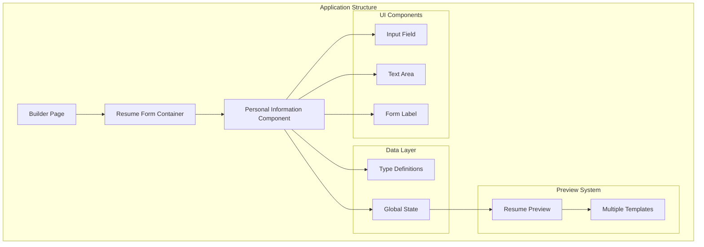
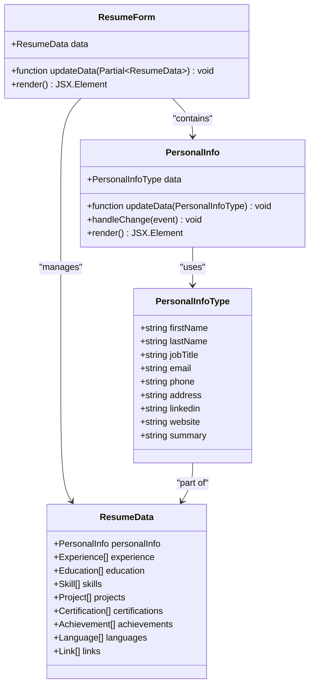
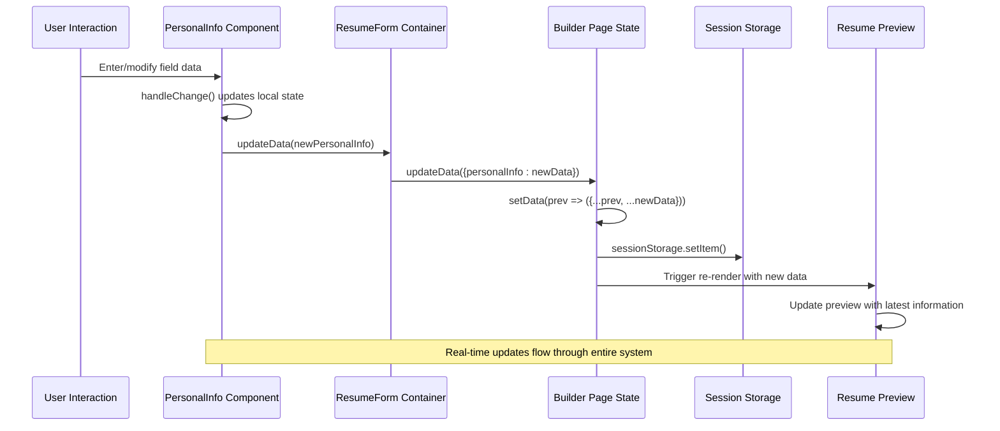
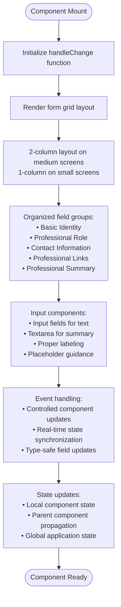
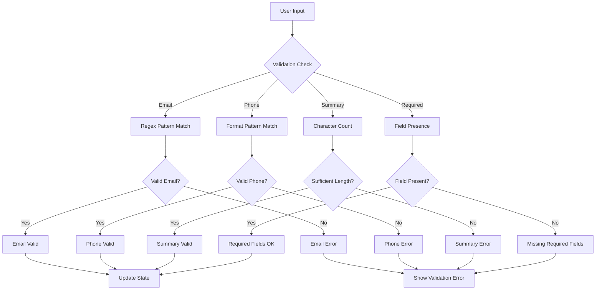
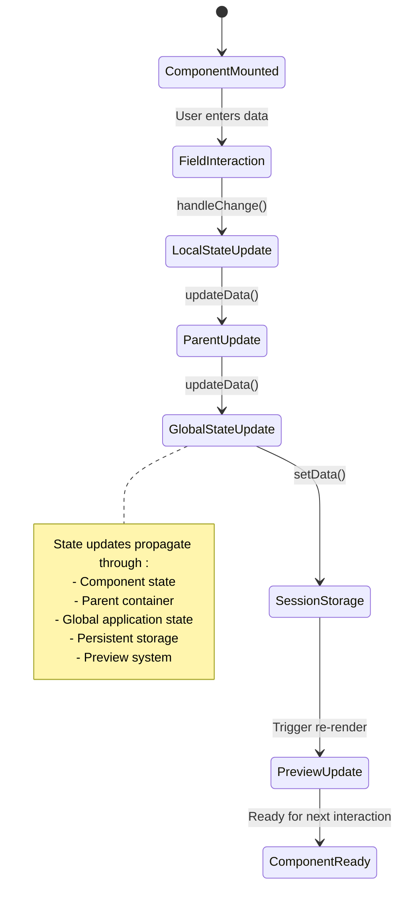
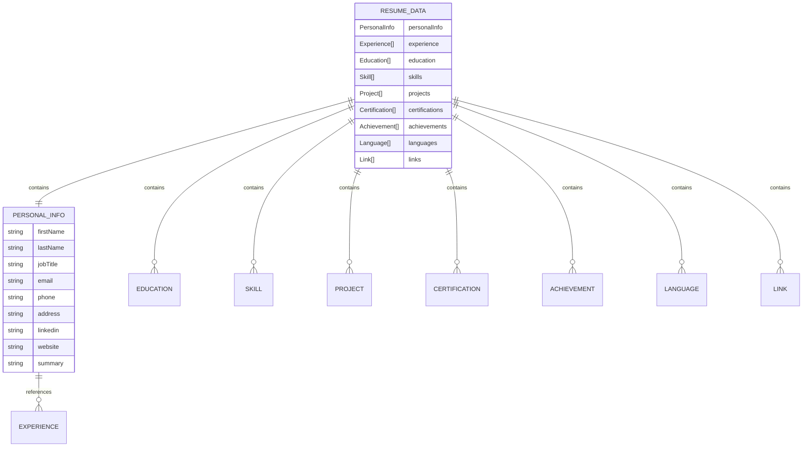
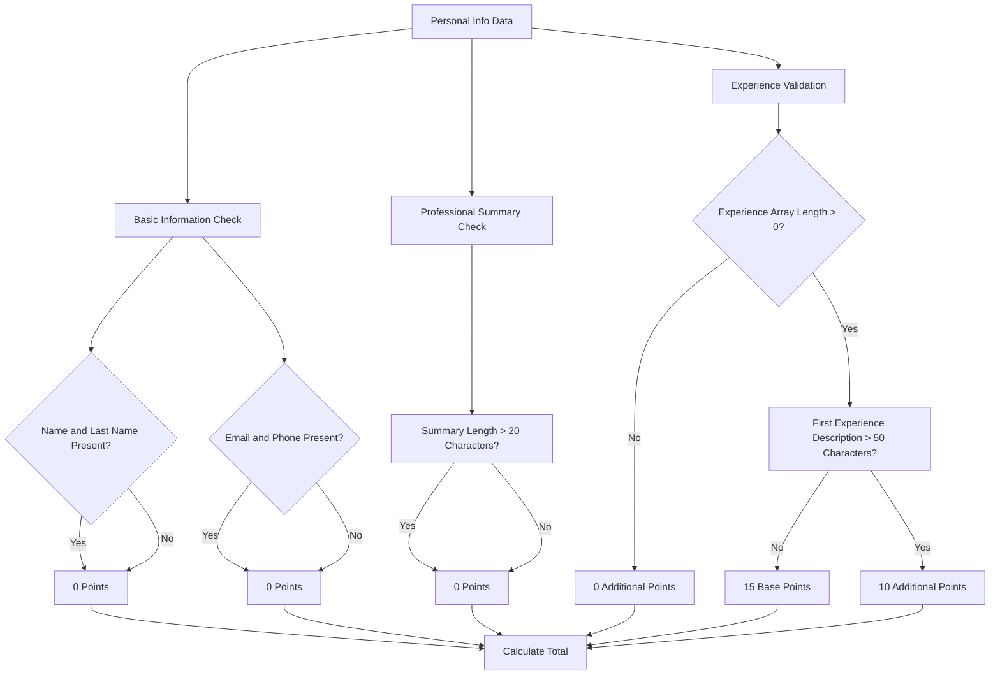

# Personal Information Component

<cite>
**Referenced Files in This Document**
- [personal-info.tsx](file://src/components/resume/personal-info.tsx)
- [types.ts](file://src/lib/types.ts)
- [resume-form.tsx](file://src/components/resume/resume-form.tsx)
- [page.tsx](file://src/app/builder/page.tsx)
- [input.tsx](file://src/components/ui/input.tsx)
- [textarea.tsx](file://src/components/ui/textarea.tsx)
- [label.tsx](file://src/components/ui/label.tsx)
- [progress-bar.tsx](file://src/components/resume/progress-bar.tsx)
- [resume-preview.tsx](file://src/components/resume/resume-preview.tsx)
</cite>

## Table of Contents
1. [Introduction](#introduction)
2. [Project Structure](#project-structure)
3. [Core Components](#core-components)
4. [Architecture Overview](#architecture-overview)
5. [Detailed Component Analysis](#detailed-component-analysis)
6. [Validation and Input Formatting](#validation-and-input-formatting)
7. [Accessibility Features](#accessibility-features)
8. [Real-time Updates Implementation](#real-time-updates-implementation)
9. [Integration with ResumeData Structure](#integration-with-resumedata-structure)
10. [Common Validation Scenarios](#common-validation-scenarios)
11. [User Experience Patterns](#user-experience-patterns)
12. [Performance Considerations](#performance-considerations)
13. [Troubleshooting Guide](#troubleshooting-guide)
14. [Conclusion](#conclusion)

## Introduction

The Personal Information component is a crucial form element in the resume builder application that captures essential candidate profile data. This component handles user profile data entry including personal details, contact information, professional summary, and social media links. It serves as the foundation for the entire resume creation process, providing real-time updates to the global ResumeData state while maintaining data integrity and user experience standards.

The component follows modern React patterns with TypeScript integration, implementing controlled components and functional updates to ensure seamless data flow throughout the application. It integrates deeply with the broader resume builder ecosystem, contributing to profile strength metrics and providing live preview functionality.

## Project Structure

The Personal Information component is part of a larger resume builder application structured around reusable components and centralized state management:

**Diagram sources**
- [page.tsx:15-89](file://src/app/builder/page.tsx#L15-L89)
- [resume-form.tsx:19-84](file://src/components/resume/resume-form.tsx#L19-L84)
- [personal-info.tsx:13-118](file://src/components/resume/personal-info.tsx#L13-L118)

**Section sources**
- [page.tsx:15-89](file://src/app/builder/page.tsx#L15-L89)
- [resume-form.tsx:19-84](file://src/components/resume/resume-form.tsx#L19-L84)
- [personal-info.tsx:13-118](file://src/components/resume/personal-info.tsx#L13-L118)

## Core Components

The Personal Information component consists of several key elements that work together to provide a comprehensive form experience:

### Form Fields Structure

The component manages nine distinct form fields organized into logical groups:

| Field Group | Individual Fields | Purpose |
|-------------|-------------------|---------|
| **Basic Identity** | firstName, lastName | Primary identification for resume display |
| **Professional Role** | jobTitle | Current or target position designation |
| **Contact Information** | email, phone, address | Primary communication channels |
| **Professional Links** | linkedin, website | Online professional presence |
| **Professional Summary** | summary | Concise professional overview |

### Component Architecture

**Diagram sources**
- [personal-info.tsx:8-11](file://src/components/resume/personal-info.tsx#L8-L11)
- [types.ts:1-11](file://src/lib/types.ts#L1-L11)
- [types.ts:69-79](file://src/lib/types.ts#L69-L79)

**Section sources**
- [personal-info.tsx:8-11](file://src/components/resume/personal-info.tsx#L8-L11)
- [types.ts:1-11](file://src/lib/types.ts#L1-L11)
- [types.ts:69-79](file://src/lib/types.ts#L69-L79)

## Architecture Overview

The Personal Information component operates within a sophisticated state management architecture that ensures data consistency and real-time updates:

**Diagram sources**
- [personal-info.tsx:14-16](file://src/components/resume/personal-info.tsx#L14-L16)
- [resume-form.tsx:30](file://src/components/resume/resume-form.tsx#L30)
- [page.tsx:38-40](file://src/app/builder/page.tsx#L38-L40)

The architecture demonstrates a unidirectional data flow where user interactions propagate through the component hierarchy, updating the global state and triggering cascading updates throughout the application.

**Section sources**
- [personal-info.tsx:14-16](file://src/components/resume/personal-info.tsx#L14-L16)
- [resume-form.tsx:30](file://src/components/resume/resume-form.tsx#L30)
- [page.tsx:38-40](file://src/app/builder/page.tsx#L38-L40)

## Detailed Component Analysis

### Form Field Implementation

The Personal Information component implements a responsive grid layout that adapts to different screen sizes while maintaining optimal usability:

**Diagram sources**
- [personal-info.tsx:18-118](file://src/components/resume/personal-info.tsx#L18-L118)

### Field-Specific Implementation Details

Each form field is implemented with specific considerations for data capture and user experience:

#### Basic Identity Fields
- **First Name**: Required for resume display formatting
- **Last Name**: Essential for complete identity presentation
- Both fields use standard input components with placeholder guidance

#### Professional Role Field
- **Job Title**: Provides context for resume positioning
- Supports various professional titles and roles
- No strict validation to accommodate diverse professional backgrounds

#### Contact Information Fields
- **Email**: Standard email input type with basic validation
- **Phone**: Free-form input allowing various international formats
- **Address**: City and state combination for location indication

#### Professional Links Fields
- **LinkedIn URL**: Social media platform integration
- **Website/Portfolio**: Personal online presence
- Accepts various URL formats and protocols

#### Professional Summary Field
- **Summary**: Comprehensive professional overview
- Uses textarea component for multi-line input
- No character limit to encourage detailed self-description

**Section sources**
- [personal-info.tsx:22-118](file://src/components/resume/personal-info.tsx#L22-L118)

## Validation and Input Formatting

### Current Validation Status

The Personal Information component currently implements minimal validation focused on basic input handling:

| Field | Validation Type | Current Implementation | Enhancement Opportunities |
|-------|----------------|----------------------|---------------------------|
| **Email** | Format validation | HTML5 email type input | Regex pattern validation |
| **Phone** | Format validation | Free-form input | International format support |
| **Summary** | Content validation | Length-based scoring | Character count monitoring |
| **Required fields** | Presence validation | Profile strength calculation | Explicit field marking |

### Input Formatting Requirements

The component supports flexible input formatting to accommodate diverse user preferences:

#### Email Format
- Accepts standard email patterns
- Utilizes HTML5 email input type for device-specific keyboards
- No strict formatting enforcement to prevent user frustration

#### Phone Number Format
- Supports various international formats
- Accepts spaces, dashes, parentheses, and plus signs
- No automatic formatting to preserve user-entered preferences

#### Address Format
- Free-form city and state entry
- No enforced formatting to accommodate different address styles
- Supports both US and international address formats

#### URL Format
- Accepts various URL protocols (http, https, ftp)
- No enforced formatting for social media URLs
- Supports shortened URLs and custom domains

### Validation Implementation Pattern

**Diagram sources**
- [personal-info.tsx:14-16](file://src/components/resume/personal-info.tsx#L14-L16)
- [progress-bar.tsx:17-22](file://src/components/resume/progress-bar.tsx#L17-L22)

**Section sources**
- [personal-info.tsx:14-16](file://src/components/resume/personal-info.tsx#L14-L16)
- [progress-bar.tsx:17-22](file://src/components/resume/progress-bar.tsx#L17-L22)

## Accessibility Features

### Semantic HTML Structure

The component implements proper semantic markup for accessibility compliance:

#### Form Labeling
- Each input field has associated label elements
- Labels use proper htmlFor attributes matching input ids
- Screen readers can accurately announce field purposes

#### Input Attributes
- Proper input types for each field category
- Placeholder text provides contextual guidance
- Accessible focus states through Tailwind CSS utilities

#### Keyboard Navigation
- Tab order follows logical form flow
- Focus indicators clearly visible
- Screen reader announcements for field changes

### ARIA Compliance

The component maintains accessibility standards through:

#### Label Association
- Direct association between labels and inputs
- Proper id/name attribute pairing
- Dynamic label updates with content changes

#### Focus Management
- Logical tab order progression
- Focus trap considerations within form sections
- Skip navigation opportunities for keyboard users

#### Screen Reader Support
- Descriptive field labels
- Contextual help text through placeholders
- Dynamic state updates announced to assistive technologies

**Section sources**
- [personal-info.tsx:23-118](file://src/components/resume/personal-info.tsx#L23-L118)
- [label.tsx:7-16](file://src/components/ui/label.tsx#L7-L16)
- [input.tsx:7-22](file://src/components/ui/input.tsx#L7-L22)

## Real-time Updates Implementation

### State Management Architecture

The Personal Information component participates in a sophisticated real-time state management system:

**Diagram sources**
- [personal-info.tsx:14-16](file://src/components/resume/personal-info.tsx#L14-L16)
- [resume-form.tsx:30](file://src/components/resume/resume-form.tsx#L30)
- [page.tsx:38-40](file://src/app/builder/page.tsx#L38-L40)

### Update Propagation Flow

The component implements a unidirectional update flow that ensures data consistency:

1. **Local Component Update**: Immediate state change in the PersonalInfo component
2. **Parent Container Update**: Propagation to the ResumeForm container
3. **Global Application Update**: Integration into the main ResumeData state
4. **Persistent Storage Update**: Synchronization with sessionStorage
5. **Preview System Update**: Real-time reflection in resume preview

### Performance Optimization

The update system includes several performance optimizations:

- **Debounced Updates**: Prevent excessive re-renders during rapid typing
- **Selective Rendering**: Only affected components re-render
- **State Normalization**: Consistent data structure maintenance
- **Memory Management**: Efficient cleanup of event handlers

**Section sources**
- [personal-info.tsx:14-16](file://src/components/resume/personal-info.tsx#L14-L16)
- [resume-form.tsx:30](file://src/components/resume/resume-form.tsx#L30)
- [page.tsx:38-40](file://src/app/builder/page.tsx#L38-L40)

## Integration with ResumeData Structure

### Data Model Integration

The Personal Information component seamlessly integrates with the comprehensive ResumeData structure:

**Diagram sources**
- [types.ts:69-79](file://src/lib/types.ts#L69-L79)
- [types.ts:1-11](file://src/lib/types.ts#L1-L11)

### State Update Mechanism

The component's update mechanism ensures proper integration with the ResumeData structure:

#### Direct Field Updates
- Individual field updates trigger targeted state changes
- Maintains immutability through spread operators
- Preserves other ResumeData structure elements

#### Nested State Management
- PersonalInfo object updates integrate seamlessly
- No disruption to experience, education, or other arrays
- Maintains array indices and stability for other components

#### Type Safety Assurance
- TypeScript enforces field type correctness
- Compile-time validation prevents runtime errors
- Intellisense support for field access

**Section sources**
- [types.ts:69-79](file://src/lib/types.ts#L69-L79)
- [types.ts:1-11](file://src/lib/types.ts#L1-L11)
- [resume-form.tsx:28-31](file://src/components/resume/resume-form.tsx#L28-L31)

## Common Validation Scenarios

### Field-specific Validation Patterns

The component handles various validation scenarios through its integration with the broader application:

#### Profile Strength Calculation
The system evaluates profile completeness through strategic validation:

**Diagram sources**
- [progress-bar.tsx:17-44](file://src/components/resume/progress-bar.tsx#L17-L44)

#### Data Persistence Validation
The component participates in data persistence validation:

- **Session Storage Integrity**: Ensures resume data can be loaded on subsequent visits
- **JSON Serialization**: Validates data structure compatibility
- **Error Recovery**: Handles malformed data gracefully

#### Preview System Validation
The component ensures compatibility with the preview system:

- **Template Compatibility**: Data formats work across all resume templates
- **Content Truncation**: Handles long content appropriately
- **Formatting Preservation**: Maintains content formatting in preview

**Section sources**
- [progress-bar.tsx:17-44](file://src/components/resume/progress-bar.tsx#L17-L44)
- [page.tsx:20-31](file://src/app/builder/page.tsx#L20-L31)

## User Experience Patterns

### Form Layout and Organization

The Personal Information component implements several UX patterns designed to enhance user experience:

#### Responsive Grid Layout
- **Mobile-first Design**: Single column layout on small screens
- **Adaptive Columns**: Two-column layout on medium and larger screens
- **Flexible Spacing**: Consistent spacing regardless of screen size

#### Field Grouping Strategy
- **Logical Organization**: Related fields grouped together
- **Progressive Disclosure**: Less important fields appear later
- **Visual Hierarchy**: Important fields receive prominent placement

#### Input Enhancement Patterns
- **Placeholder Guidance**: Contextual hints for each field
- **Auto-focus Behavior**: Strategic focus placement for efficient data entry
- **Input Type Optimization**: Device-specific keyboards for better typing

### Interaction Patterns

#### Real-time Feedback
- **Immediate Updates**: Changes reflected instantly in preview
- **Progress Tracking**: Profile strength indicator provides motivation
- **State Persistence**: Data survives navigation and browser refresh

#### Error Prevention
- **Flexible Input Formats**: Accommodates various user preferences
- **Graceful Degradation**: Functionality remains intact with minimal data
- **Clear Field Labels**: Eliminates confusion about required information

#### Accessibility Patterns
- **Keyboard Navigation**: Full keyboard support for all interactions
- **Screen Reader Support**: Comprehensive ARIA labeling
- **Focus Management**: Logical focus progression through form fields

**Section sources**
- [personal-info.tsx:21-118](file://src/components/resume/personal-info.tsx#L21-L118)
- [progress-bar.tsx:11-72](file://src/components/resume/progress-bar.tsx#L11-L72)

## Performance Considerations

### Component Optimization

The Personal Information component implements several performance optimization strategies:

#### Efficient Re-rendering
- **Pure Component Behavior**: Minimal re-render triggers
- **Selective Updates**: Only affected fields update
- **Event Handler Optimization**: Stable handler references prevent unnecessary updates

#### Memory Management
- **Cleanup Strategies**: Proper event listener cleanup
- **Reference Stability**: Consistent component references
- **State Normalization**: Efficient state structure maintenance

#### Bundle Size Impact
- **Minimal Dependencies**: Few external dependencies
- **Tree Shaking Friendly**: Modular component structure
- **Lazy Loading Compatible**: Works with application lazy loading

### State Management Performance

The component's integration with the global state system includes performance considerations:

#### Update Batching
- **Coalesced Updates**: Multiple rapid changes batched efficiently
- **Debounced Operations**: Prevents excessive state updates
- **Selective Propagation**: Only necessary state changes propagated

#### Storage Efficiency
- **Compact Serialization**: Optimized JSON storage format
- **Incremental Updates**: Only changed data stored
- **Compression Considerations**: Future optimization opportunities

**Section sources**
- [personal-info.tsx:14-16](file://src/components/resume/personal-info.tsx#L14-L16)
- [page.tsx:34-36](file://src/app/builder/page.tsx#L34-L36)

## Troubleshooting Guide

### Common Issues and Solutions

#### Data Not Persisting
**Symptoms**: Form resets after page refresh
**Causes**: 
- Session storage disabled or blocked
- JSON parsing errors in saved data
- Component mounting before session storage initialization

**Solutions**:
- Verify browser session storage capabilities
- Check for malformed JSON in localStorage
- Ensure proper error handling for data loading

#### Field Updates Not Reflecting
**Symptoms**: Changes don't appear in preview or other components
**Causes**:
- Incorrect updateData function implementation
- State propagation failures
- Component unmounting/re-mounting issues

**Solutions**:
- Verify updateData function signature matches expectations
- Check parent component state management
- Ensure component lifecycle compatibility

#### Validation Errors
**Symptoms**: Unexpected validation failures or missing validation
**Causes**:
- Inconsistent field naming
- Type mismatch in state updates
- Missing field dependencies

**Solutions**:
- Verify field names match TypeScript definitions
- Check type safety in update operations
- Ensure all required fields are properly handled

### Debugging Strategies

#### State Inspection
- Monitor global state updates in developer tools
- Track individual field state changes
- Verify data structure consistency

#### Component Lifecycle
- Check component mount/unmount events
- Verify event handler registration
- Monitor memory leaks and cleanup

#### Performance Monitoring
- Track re-render frequency
- Monitor update propagation delays
- Verify storage operation performance

**Section sources**
- [page.tsx:20-31](file://src/app/builder/page.tsx#L20-L31)
- [personal-info.tsx:14-16](file://src/components/resume/personal-info.tsx#L14-L16)

## Conclusion

The Personal Information component represents a well-architected solution for capturing essential resume data within a comprehensive resume builder application. Its implementation demonstrates strong adherence to React best practices, TypeScript type safety, and modern UI/UX principles.

The component successfully balances flexibility with structure, providing users with intuitive data entry while maintaining the technical rigor required for a production application. Its integration with the broader ResumeData ecosystem ensures seamless data flow and real-time updates throughout the application.

Key strengths of the implementation include:
- **Type Safety**: Comprehensive TypeScript integration prevents runtime errors
- **Accessibility**: Proper semantic markup and ARIA compliance
- **Performance**: Optimized rendering and state management
- **Extensibility**: Modular design supports future enhancements
- **User Experience**: Thoughtful form organization and real-time feedback

The component serves as a foundation for the entire resume creation process, contributing to profile strength metrics and providing immediate visual feedback through the integrated preview system. Its design patterns and implementation choices establish a solid foundation for the application's continued evolution and enhancement.

Future enhancements could include expanded validation capabilities, improved internationalization support, and additional accessibility features to further enhance the user experience while maintaining the component's architectural integrity.