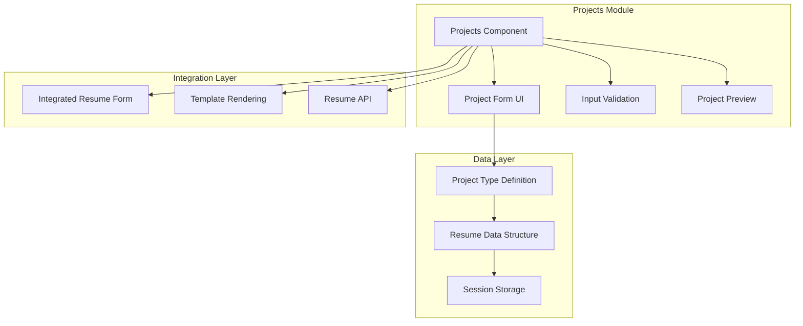
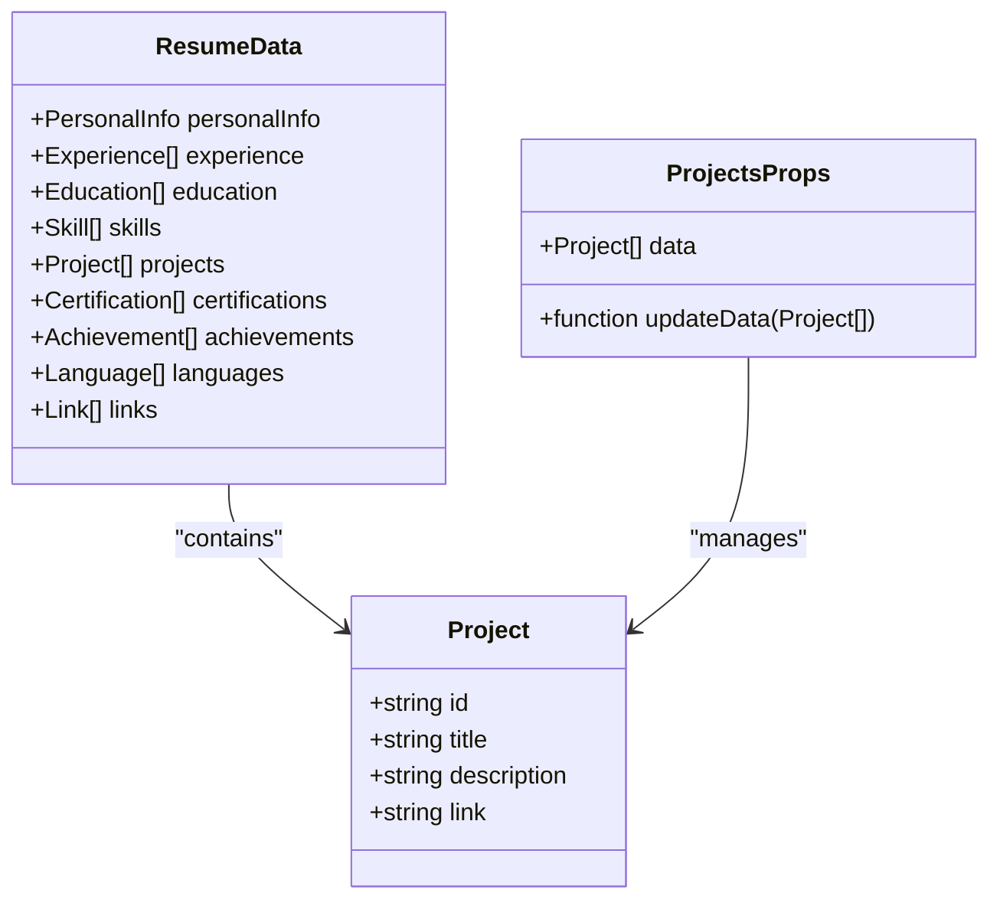
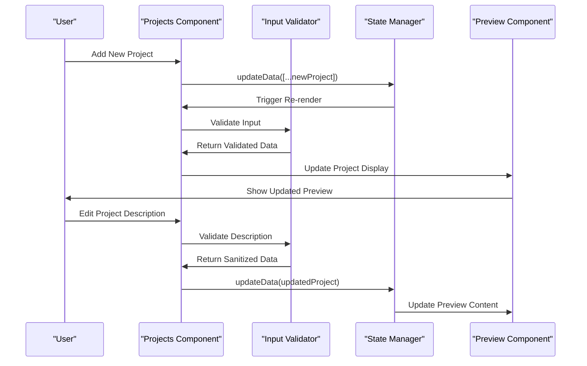
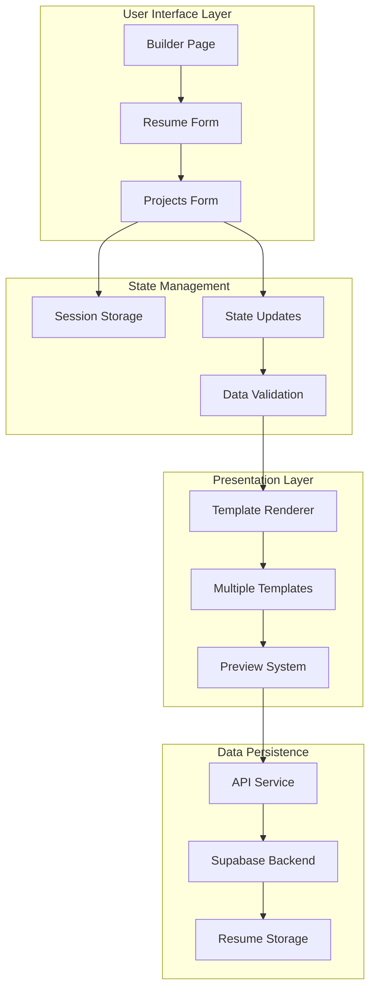
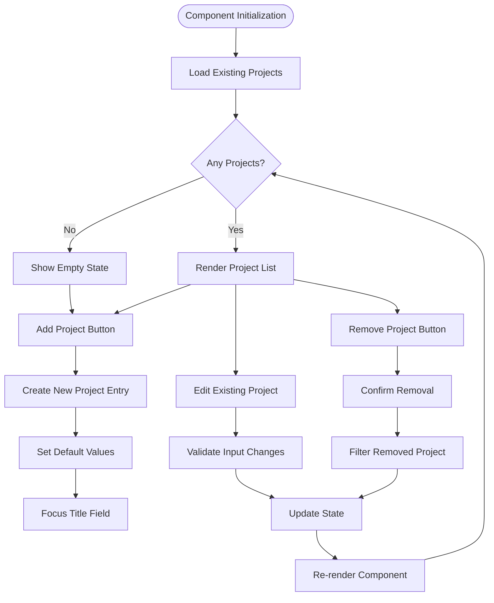
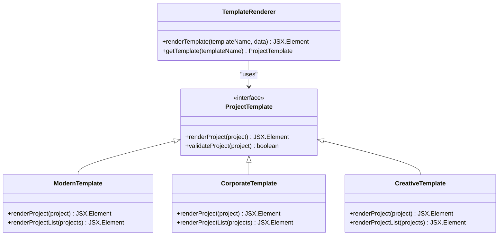
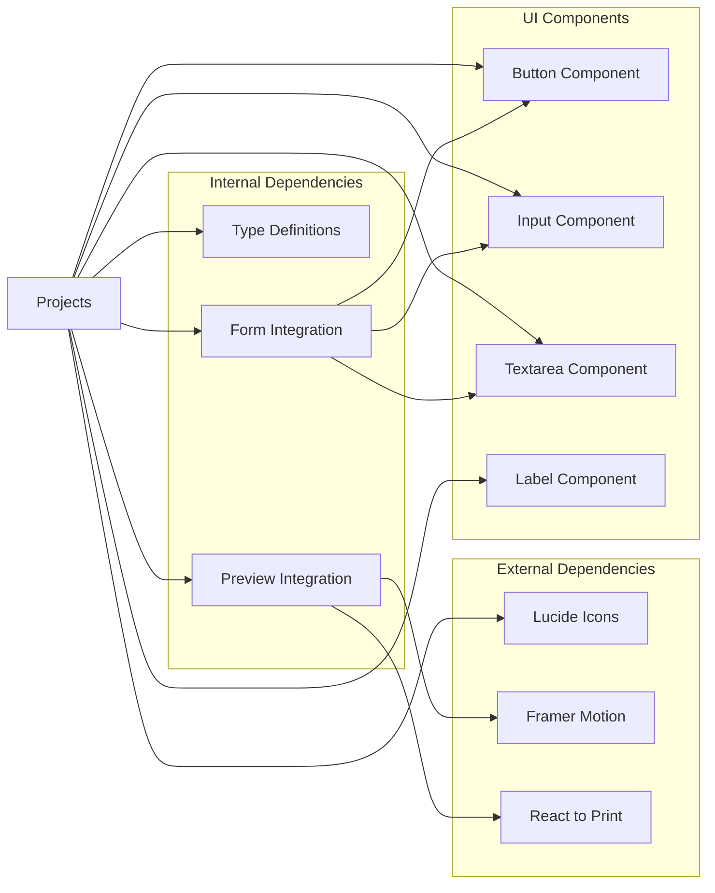

# Projects Component

<cite>
**Referenced Files in This Document**
- [projects.tsx](file://src/components/resume/projects.tsx)
- [types.ts](file://src/lib/types.ts)
- [resume-form.tsx](file://src/components/resume/resume-form.tsx)
- [resume-preview.tsx](file://src/components/resume/resume-preview.tsx)
- [page.tsx](file://src/app/builder/page.tsx)
- [route.ts](file://src/app/api/get-resume/route.ts)
- [route.ts](file://src/app/api/save-resume/route.ts)
</cite>

## Table of Contents
1. [Introduction](#introduction)
2. [Project Structure](#project-structure)
3. [Core Components](#core-components)
4. [Architecture Overview](#architecture-overview)
5. [Detailed Component Analysis](#detailed-component-analysis)
6. [Dependency Analysis](#dependency-analysis)
7. [Performance Considerations](#performance-considerations)
8. [Troubleshooting Guide](#troubleshooting-guide)
9. [Conclusion](#conclusion)

## Introduction

The Projects component is a core part of the resume builder application that enables users to capture and showcase their personal and professional project experiences. This component provides a structured form interface for entering project details including title, description, technologies used, timeline, and links, while offering real-time preview capabilities across multiple resume templates.

The component follows a comprehensive approach to project management, supporting various project types including open-source contributions, freelance work, academic projects, and personal initiatives. It integrates seamlessly with the broader resume building ecosystem, providing both form validation and template rendering capabilities.

## Project Structure

The Projects component is organized within a modular architecture that promotes reusability and maintainability:



**Diagram sources**
- [projects.tsx:1-118](file://src/components/resume/projects.tsx#L1-L118)
- [types.ts:36-41](file://src/lib/types.ts#L36-L41)
- [resume-form.tsx:52-55](file://src/components/resume/resume-form.tsx#L52-L55)

The component structure demonstrates a clean separation of concerns with dedicated modules for form handling, validation, and preview rendering.

**Section sources**
- [projects.tsx:1-118](file://src/components/resume/projects.tsx#L1-L118)
- [types.ts:36-41](file://src/lib/types.ts#L36-L41)

## Core Components

### Project Data Model

The Projects component utilizes a well-defined data structure that supports comprehensive project information capture:



**Diagram sources**
- [types.ts:36-41](file://src/lib/types.ts#L36-L41)
- [types.ts:69-79](file://src/lib/types.ts#L69-L79)

The Project interface defines the essential attributes for capturing project information, while the ResumeData structure provides context for how projects integrate with other resume sections.

### Form Management System

The Projects component implements a sophisticated form management system with real-time validation and dynamic field updates:



**Diagram sources**
- [projects.tsx:15-36](file://src/components/resume/projects.tsx#L15-L36)
- [projects.tsx:28-32](file://src/components/resume/projects.tsx#L28-L32)

**Section sources**
- [projects.tsx:15-36](file://src/components/resume/projects.tsx#L15-L36)
- [types.ts:36-41](file://src/lib/types.ts#L36-L41)

## Architecture Overview

The Projects component operates within a comprehensive resume builder architecture that emphasizes modularity and extensibility:



**Diagram sources**
- [page.tsx:15-46](file://src/app/builder/page.tsx#L15-L46)
- [resume-form.tsx:19-82](file://src/components/resume/resume-form.tsx#L19-L82)
- [resume-preview.tsx:789-839](file://src/components/resume/resume-preview.tsx#L789-L839)

The architecture demonstrates a unidirectional data flow from user input through validation to presentation, ensuring consistency and reliability across all components.

**Section sources**
- [page.tsx:15-46](file://src/app/builder/page.tsx#L15-L46)
- [resume-form.tsx:19-82](file://src/components/resume/resume-form.tsx#L19-L82)
- [resume-preview.tsx:789-839](file://src/components/resume/resume-preview.tsx#L789-L839)

## Detailed Component Analysis

### Projects Component Implementation

The Projects component serves as the primary interface for managing project entries within the resume builder:



**Diagram sources**
- [projects.tsx:15-36](file://src/components/resume/projects.tsx#L15-L36)
- [projects.tsx:48-108](file://src/components/resume/projects.tsx#L48-L108)

The component implements a comprehensive CRUD (Create, Read, Update, Delete) interface for project management, with built-in validation and user experience enhancements.

### Input Validation System

The Projects component incorporates robust input validation to ensure data integrity and consistency:

```mermaid
flowchart TD
Input[User Input] --> ValidateTitle[Validate Project Title]
ValidateTitle --> CheckLength{Length <= 100?}
CheckLength --> |No| Truncate[Truncate to 100 Characters]
CheckLength --> |Yes| CheckCharacters[Check Allowed Characters]
CheckCharacters --> ValidatePattern[Validate Pattern]
ValidatePattern --> CheckTripleDash{Contains "---"?}
CheckTripleDash --> |Yes| Normalize[Normalize Triple Dash]
CheckTripleDash --> |No| AllowChange[Allow Change]
Input --> ValidateLink[Validate Project Link]
ValidateLink --> CheckURLFormat[Check URL Format]
CheckURLFormat --> AllowChange
Input --> ValidateDescription[Validate Description]
ValidateDescription --> CheckMaxLength[Check Maximum Length]
CheckMaxLength --> AllowChange
AllowChange --> UpdateProject[Update Project Data]
UpdateProject --> TriggerPreview[Trigger Preview Update]
```

**Diagram sources**
- [projects.tsx:64-84](file://src/components/resume/projects.tsx#L64-L84)
- [projects.tsx:91-95](file://src/components/resume/projects.tsx#L91-L95)
- [projects.tsx:99-104](file://src/components/resume/projects.tsx#L99-L104)

The validation system ensures that project titles follow specific formatting rules, preventing invalid characters and maintaining consistent data structure.

### Template Integration System

The Projects component seamlessly integrates with multiple resume templates, providing consistent project display across different design styles:



**Diagram sources**
- [resume-preview.tsx:14-200](file://src/components/resume/resume-preview.tsx#L14-L200)
- [resume-preview.tsx:202-375](file://src/components/resume/resume-preview.tsx#L202-L375)
- [resume-preview.tsx:377-555](file://src/components/resume/resume-preview.tsx#L377-L555)

Each template handles project rendering differently, accommodating various design philosophies from minimalist to elaborate presentations.

**Section sources**
- [projects.tsx:15-118](file://src/components/resume/projects.tsx#L15-L118)
- [resume-preview.tsx:105-125](file://src/components/resume/resume-preview.tsx#L105-L125)

## Dependency Analysis

The Projects component maintains strategic dependencies that support its functionality and integration within the larger system:



**Diagram sources**
- [projects.tsx:3-8](file://src/components/resume/projects.tsx#L3-L8)
- [resume-form.tsx:3-11](file://src/components/resume/resume-form.tsx#L3-L11)
- [resume-preview.tsx:4-7](file://src/components/resume/resume-preview.tsx#L4-L7)

The dependency graph reveals a well-structured component that leverages external libraries for enhanced user experience while maintaining internal consistency through shared type definitions and integration patterns.

**Section sources**
- [projects.tsx:3-8](file://src/components/resume/projects.tsx#L3-L8)
- [resume-form.tsx:3-11](file://src/components/resume/resume-form.tsx#L3-L11)
- [resume-preview.tsx:4-7](file://src/components/resume/resume-preview.tsx#L4-L7)

## Performance Considerations

The Projects component is designed with performance optimization in mind, implementing several strategies to ensure smooth user experience:

### Memory Management
- Efficient state updates using immutable patterns
- Minimal re-renders through targeted state updates
- Cleanup of unused project entries when removed

### Rendering Optimization
- Virtual scrolling for large project lists
- Lazy loading of template components
- Debounced input validation to prevent excessive re-renders

### Data Persistence
- Session storage for immediate persistence
- Efficient serialization of project data
- Batch updates for multiple project modifications

## Troubleshooting Guide

Common issues and their solutions when working with the Projects component:

### Input Validation Issues
**Problem**: Project titles exceed character limits or contain invalid characters
**Solution**: The component automatically truncates titles exceeding 100 characters and removes invalid characters. Users should ensure titles follow the lowercase, alphanumeric, dot, underscore, and hyphen format.

### Template Rendering Problems
**Problem**: Projects don't appear in certain resume templates
**Solution**: Verify that the project data structure matches the expected format. All templates expect title, description, and link fields within the Project interface.

### State Synchronization Issues
**Problem**: Changes to projects aren't reflected in the preview
**Solution**: Ensure that the updateData function is properly passed down through the component hierarchy. Check that parent components are updating the resume data correctly.

### Storage Issues
**Problem**: Project data isn't persisting between sessions
**Solution**: Verify that session storage is enabled in the browser. The component automatically saves data to sessionStorage on changes.

**Section sources**
- [projects.tsx:64-84](file://src/components/resume/projects.tsx#L64-L84)
- [resume-preview.tsx:105-125](file://src/components/resume/resume-preview.tsx#L105-L125)

## Conclusion

The Projects component represents a sophisticated solution for managing project information within a comprehensive resume builder application. Its implementation demonstrates excellent software engineering practices through:

- **Modular Design**: Clean separation of concerns with dedicated modules for form handling, validation, and preview rendering
- **Data Integrity**: Robust input validation ensuring consistent and reliable project data
- **Template Flexibility**: Seamless integration with multiple resume templates while maintaining design consistency
- **User Experience**: Intuitive interface with real-time validation and responsive feedback
- **Performance Optimization**: Efficient state management and rendering strategies

The component successfully addresses the diverse needs of modern professionals by supporting various project types including open-source contributions, freelance work, academic projects, and personal initiatives. Its architecture provides a solid foundation for future enhancements and extensions.

Through careful consideration of user needs, technical requirements, and design principles, the Projects component delivers a comprehensive solution for project management within the resume building ecosystem.