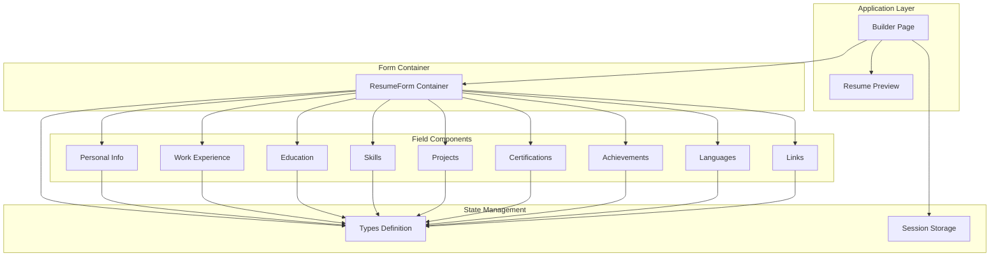
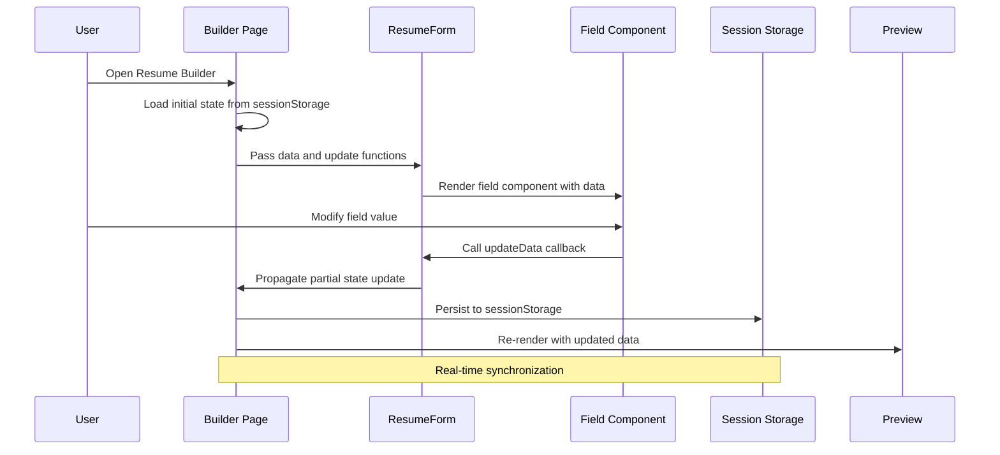
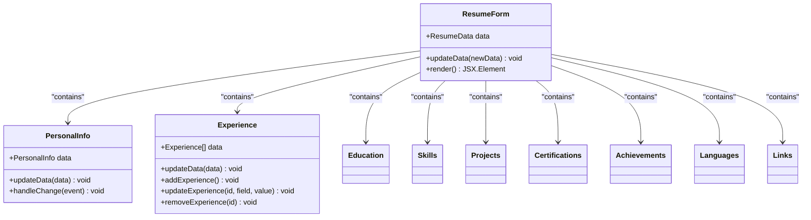
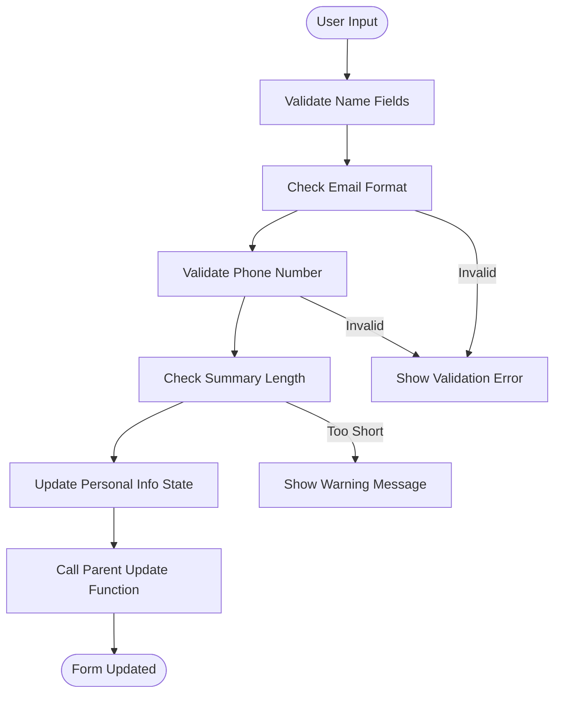
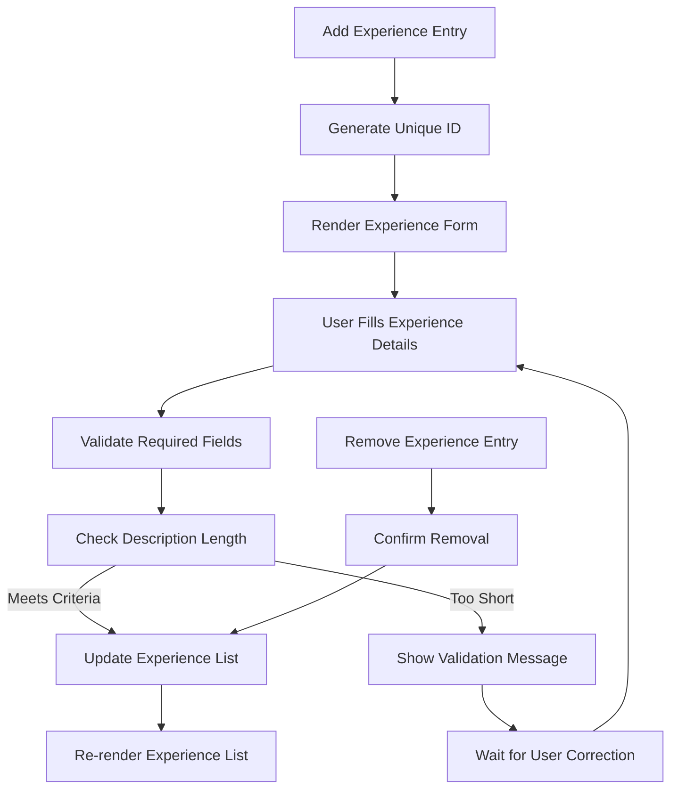
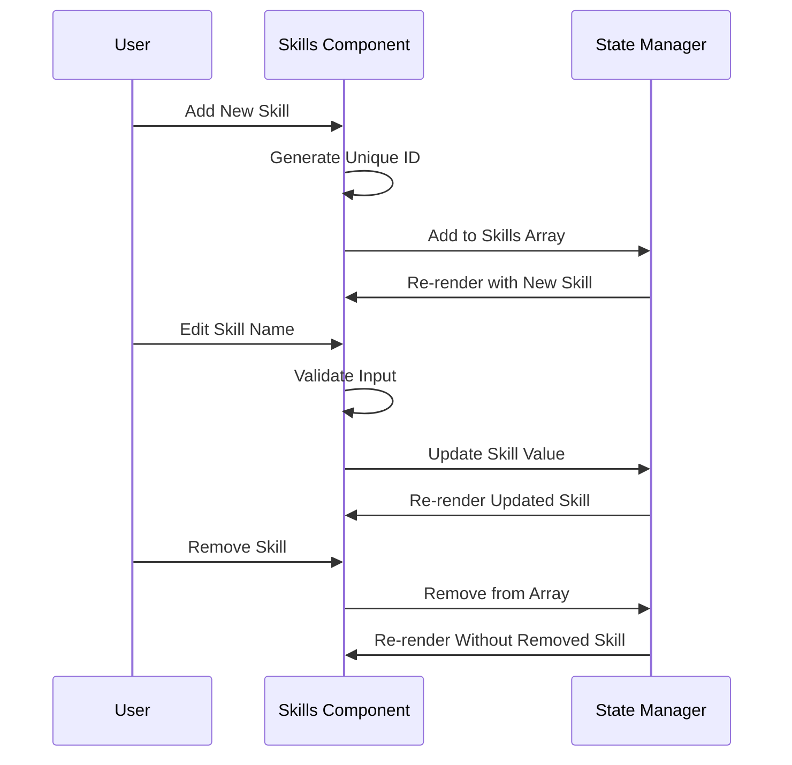
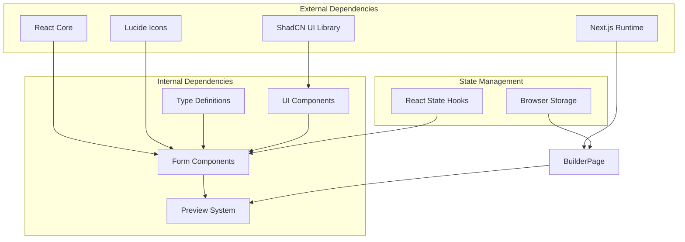
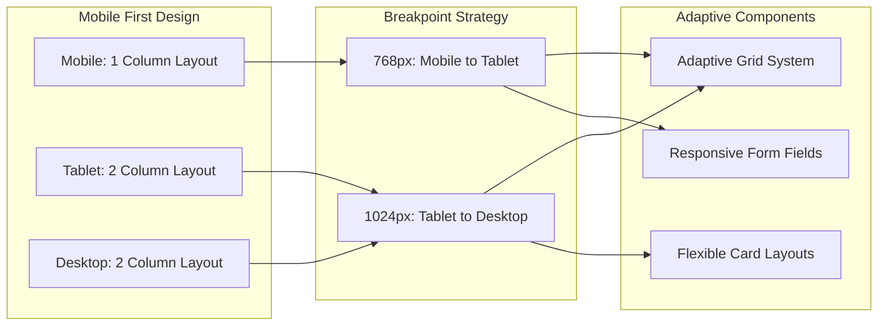
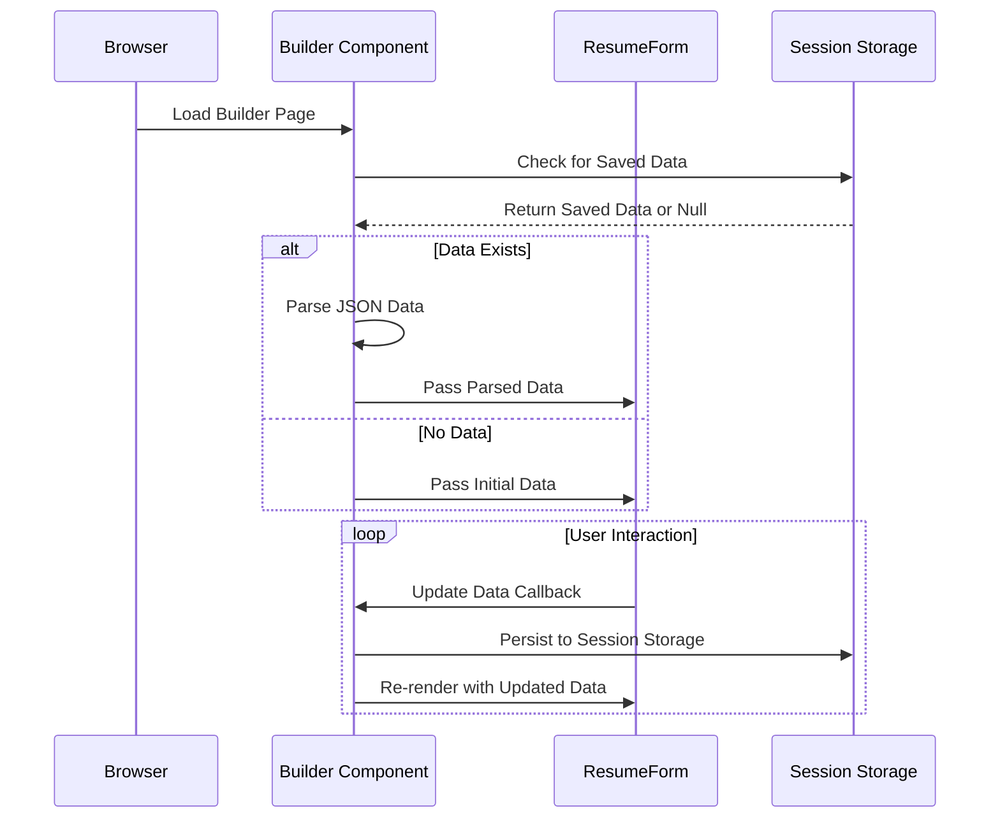

# Resume Form System

<cite>
**Referenced Files in This Document**
- [resume-form.tsx](file://src/components/resume/resume-form.tsx)
- [personal-info.tsx](file://src/components/resume/personal-info.tsx)
- [experience.tsx](file://src/components/resume/experience.tsx)
- [education.tsx](file://src/components/resume/education.tsx)
- [skills.tsx](file://src/components/resume/skills.tsx)
- [projects.tsx](file://src/components/resume/projects.tsx)
- [certifications.tsx](file://src/components/resume/certifications.tsx)
- [achievements.tsx](file://src/components/resume/achievements.tsx)
- [languages.tsx](file://src/components/resume/languages.tsx)
- [links.tsx](file://src/components/resume/links.tsx)
- [types.ts](file://src/lib/types.ts)
- [page.tsx](file://src/app/builder/page.tsx)
- [resume-preview.tsx](file://src/components/resume/resume-preview.tsx)
- [progress-bar.tsx](file://src/components/resume/progress-bar.tsx)
</cite>

## Table of Contents
1. [Introduction](#introduction)
2. [Project Structure](#project-structure)
3. [Core Components](#core-components)
4. [Architecture Overview](#architecture-overview)
5. [Detailed Component Analysis](#detailed-component-analysis)
6. [Dependency Analysis](#dependency-analysis)
7. [Performance Considerations](#performance-considerations)
8. [Accessibility and Responsive Design](#accessibility-and-responsive-design)
9. [Integration with Builder State](#integration-with-builder-state)
10. [Troubleshooting Guide](#troubleshooting-guide)
11. [Conclusion](#conclusion)

## Introduction

The Resume Form System is a comprehensive Next.js application that enables users to create professional resumes through an intuitive form interface. The system consists of a main ResumeForm container that orchestrates specialized field components for managing various resume sections including personal information, work experience, education, skills, projects, certifications, achievements, languages, and links.

The system implements a unidirectional data flow pattern where the parent component manages all state and passes down data and update functions to child components. This architecture ensures consistent data binding, real-time updates, and maintains form validation throughout the editing process.

## Project Structure

The Resume Form System follows a modular component-based architecture organized around feature groups:



**Diagram sources**
- [resume-form.tsx:1-84](file://src/components/resume/resume-form.tsx#L1-L84)
- [page.tsx:1-79](file://src/app/builder/page.tsx#L1-L79)

**Section sources**
- [resume-form.tsx:1-84](file://src/components/resume/resume-form.tsx#L1-L84)
- [page.tsx:1-79](file://src/app/builder/page.tsx#L1-L79)

## Core Components

The Resume Form System is built around several key components that work together to provide a seamless user experience:

### ResumeForm Container
The main container component that orchestrates all field components and manages the overall form state. It serves as the central hub for data binding and state propagation throughout the system.

### Field-Specific Components
Each resume section is implemented as a specialized component with its own validation logic, data binding patterns, and user interaction handling. Components include:
- Personal Information management
- Work Experience entries with dynamic addition/removal
- Educational background tracking
- Skills collection with proficiency indicators
- Project portfolio management
- Certification tracking
- Achievement recognition
- Language proficiency display
- External link management

### State Management Infrastructure
The system utilizes TypeScript interfaces to define data structures and implements automatic persistence through browser sessionStorage for seamless user experience.

**Section sources**
- [resume-form.tsx:14-84](file://src/components/resume/resume-form.tsx#L14-L84)
- [types.ts:1-103](file://src/lib/types.ts#L1-L103)

## Architecture Overview

The Resume Form System implements a hierarchical component architecture with clear separation of concerns and unidirectional data flow:



**Diagram sources**
- [page.tsx:11-79](file://src/app/builder/page.tsx#L11-L79)
- [resume-form.tsx:19-84](file://src/components/resume/resume-form.tsx#L19-L84)

The architecture follows these key principles:
- **Unidirectional Data Flow**: State flows from parent to children, ensuring predictable updates
- **Component Composition**: Specialized components handle specific resume sections
- **Real-time Updates**: Changes propagate instantly to the preview system
- **Automatic Persistence**: User data is automatically saved to browser storage

## Detailed Component Analysis

### ResumeForm Container Component

The ResumeForm component serves as the primary orchestrator, managing the overall form structure and coordinating updates across all field components:



**Diagram sources**
- [resume-form.tsx:19-84](file://src/components/resume/resume-form.tsx#L19-L84)

The container implements:
- **Centralized State Management**: Single source of truth for all form data
- **Component Orchestration**: Coordinates rendering and updates across all field components
- **Real-time Propagation**: Immediate state updates to child components
- **Responsive Layout**: Flexible grid system for optimal viewing across devices

### Personal Information Component

Handles essential contact and professional details with comprehensive validation:



**Diagram sources**
- [personal-info.tsx:14-118](file://src/components/resume/personal-info.tsx#L14-L118)

Key features include:
- **Real-time Validation**: Immediate feedback for email and phone formats
- **Placeholder Guidance**: Helpful hints for required information
- **Accessible Labels**: Proper labeling for screen readers
- **Responsive Grid**: Adaptive layout for different screen sizes

### Work Experience Management

Implements dynamic experience entry with sophisticated validation:



**Diagram sources**
- [experience.tsx:17-113](file://src/components/resume/experience.tsx#L17-L113)

Advanced features include:
- **Dynamic Entry Management**: Add/remove experience entries with unique identifiers
- **Complex Validation**: Multi-field validation with contextual feedback
- **Visual Organization**: Card-based layout with clear visual hierarchy
- **Accessibility Support**: Keyboard navigation and screen reader compatibility

### Project Validation System

Implements sophisticated client-side validation for project titles with character restrictions:

```mermaid
flowchart TD
Input[User Input) --> ConvertToLower["Convert to Lowercase"]
ConvertToLower --> CheckLength["Check Length <= 100"]
CheckLength --> |Exceeds| Truncate["Truncate to 100 Characters"]
CheckLength --> |Within Limit| ValidateChars["Validate Allowed Characters"]
Truncate --> ValidateChars
ValidateChars --> CheckTripleDash["Check for Triple Dash Pattern"]
CheckTripleDash --> |Found| Normalize["Normalize Triple Dash"]
CheckTripleDash --> |Not Found| ApplyChanges["Apply Changes"]
Normalize --> ApplyChanges
ApplyChanges --> UpdateState["Update Project State"]
UpdateState --> ShowFeedback["Show Validation Feedback"]
CheckLength --> |Valid| ValidateChars
ValidateChars --> |Invalid| ShowError["Show Character Error"]
ShowError --> WaitCorrection["Wait for Correction"]
WaitCorrection --> Input
```

**Diagram sources**
- [projects.tsx:67-87](file://src/components/resume/projects.tsx#L67-L87)

The validation system enforces:
- **Character Restrictions**: Only lowercase letters, numbers, periods, underscores, and hyphens
- **Length Limits**: Maximum 100 characters with real-time counter
- **Pattern Prevention**: Automatic removal of invalid triple dash sequences
- **Visual Feedback**: Color-coded borders and character counters

### Skills Management Component

Provides flexible skill entry with automatic formatting:



**Diagram sources**
- [skills.tsx:14-72](file://src/components/resume/skills.tsx#L14-L72)

Features include:
- **Inline Editing**: Direct input within skill chips
- **Automatic Formatting**: Case normalization and trimming
- **Visual Feedback**: Dynamic chip styling based on content
- **Keyboard Navigation**: Full keyboard support for editing

### Data Types and Interfaces

The system defines comprehensive TypeScript interfaces for type safety and development experience:

| Interface | Purpose | Key Properties |
|-----------|---------|----------------|
| `PersonalInfo` | Basic contact and professional details | firstName, lastName, email, phone, summary |
| `Experience` | Work history entries | company, position, startDate, endDate, description |
| `Education` | Academic background | school, degree, startDate, endDate, description |
| `Skill` | Technical and soft skills | name |
| `Project` | Portfolio and project work | title, description, link |
| `Certification` | Professional credentials | name, issuer, date, url |
| `Achievement` | Awards and recognitions | title, description |
| `Language` | Multilingual capabilities | language, proficiency |
| `Link` | External profiles and websites | label, url |

**Section sources**
- [types.ts:1-103](file://src/lib/types.ts#L1-L103)

## Dependency Analysis

The Resume Form System exhibits clear dependency relationships with minimal coupling between components:



**Diagram sources**
- [page.tsx:1-10](file://src/app/builder/page.tsx#L1-L10)
- [resume-form.tsx:1-12](file://src/components/resume/resume-form.tsx#L1-L12)

Key dependency characteristics:
- **Low Coupling**: Components communicate primarily through props and callbacks
- **Type Safety**: Comprehensive TypeScript definitions prevent runtime errors
- **External Library Integration**: Minimal external dependencies for core functionality
- **State Management Independence**: Clear separation between UI and state logic

**Section sources**
- [page.tsx:1-79](file://src/app/builder/page.tsx#L1-L79)
- [resume-form.tsx:1-84](file://src/components/resume/resume-form.tsx#L1-L84)

## Performance Considerations

The Resume Form System implements several performance optimization strategies:

### State Management Efficiency
- **Selective Updates**: Only affected components re-render on state changes
- **Batch Updates**: Related field updates occur in coordinated batches
- **Memory Management**: Automatic cleanup of unused components

### Rendering Optimizations
- **Virtual Scrolling**: Large lists use efficient rendering techniques
- **Lazy Loading**: Components load only when visible
- **Debounced Updates**: Input changes are throttled for better performance

### Storage Performance
- **Efficient Serialization**: JSON serialization minimizes storage overhead
- **Incremental Updates**: Only changed data is persisted
- **Error Recovery**: Graceful handling of corrupted storage data

## Accessibility and Responsive Design

### Accessibility Features
The system implements comprehensive accessibility standards:

**Keyboard Navigation**
- Full tab order through all form fields
- Arrow key navigation for dropdown selections
- Enter/Space key activation for interactive elements
- Focus management for modal dialogs

**Screen Reader Support**
- Semantic HTML structure with proper headings
- Descriptive labels for all form controls
- ARIA attributes for dynamic content
- Screen reader announcements for state changes

**Visual Accessibility**
- High contrast color schemes
- Sufficient color contrast ratios
- Text scaling support up to 200%
- Reduced motion preferences

### Responsive Design Implementation



**Diagram sources**
- [resume-form.tsx:27-81](file://src/components/resume/resume-form.tsx#L27-L81)

Responsive features include:
- **Fluid Grid System**: Components adapt to available screen space
- **Touch-Friendly Controls**: Appropriate sizing for mobile interaction
- **Orientation Support**: Adapts to portrait and landscape modes
- **Performance Optimization**: Reduced complexity on lower-powered devices

## Integration with Builder State

The Resume Form System integrates seamlessly with the main builder application through a sophisticated state management pattern:

### State Initialization and Persistence



**Diagram sources**
- [page.tsx:16-36](file://src/app/builder/page.tsx#L16-L36)

### Real-time Preview Synchronization

The system maintains instant synchronization between form inputs and preview output:

**Data Flow Patterns**
- **Immediate Propagation**: State changes trigger instant preview updates
- **Template Integration**: Preview system renders based on selected template
- **Progress Tracking**: Visual indicators show completion percentage
- **Template Switching**: Users can change templates without losing data

**Section sources**
- [page.tsx:11-79](file://src/app/builder/page.tsx#L11-L79)
- [resume-preview.tsx:789-879](file://src/components/resume/resume-preview.tsx#L789-L879)

## Troubleshooting Guide

### Common Issues and Solutions

**Form Not Saving Data**
- Verify browser sessionStorage is enabled
- Check for browser privacy settings blocking storage
- Ensure JavaScript is enabled in the browser

**Validation Errors**
- Review console for specific error messages
- Check network connectivity for template loading
- Verify data types match expected formats

**Performance Issues**
- Monitor browser developer tools for memory usage
- Check for excessive re-renders in component tree
- Optimize large datasets with virtualization

**Accessibility Problems**
- Test with screen readers and keyboard-only navigation
- Verify color contrast meets WCAG guidelines
- Check focus management across components

### Debugging Strategies

**State Inspection**
- Use browser developer tools to inspect component state
- Monitor sessionStorage for data persistence
- Track component lifecycle events

**Performance Monitoring**
- Analyze component render times
- Monitor memory allocation patterns
- Check for unnecessary re-renders

**User Experience Testing**
- Conduct usability testing with diverse user groups
- Test on various devices and browsers
- Validate accessibility compliance

## Conclusion

The Resume Form System represents a robust, scalable solution for creating professional resumes through an intuitive form interface. The system's architecture emphasizes maintainability, performance, and user experience through:

**Technical Excellence**
- Clean component architecture with clear separation of concerns
- Comprehensive TypeScript integration for type safety
- Efficient state management with automatic persistence
- Responsive design supporting all device types

**User Experience**
- Intuitive form layout with immediate feedback
- Comprehensive validation with helpful error messages
- Real-time preview synchronization
- Accessible design meeting modern standards

**Extensibility**
- Modular component design allows easy feature additions
- Type-safe interfaces support future enhancements
- Well-defined data structures enable third-party integrations
- Template system supports multiple presentation formats

The system successfully balances functionality with simplicity, providing users with a powerful yet approachable tool for creating professional resumes while maintaining excellent performance and accessibility standards.