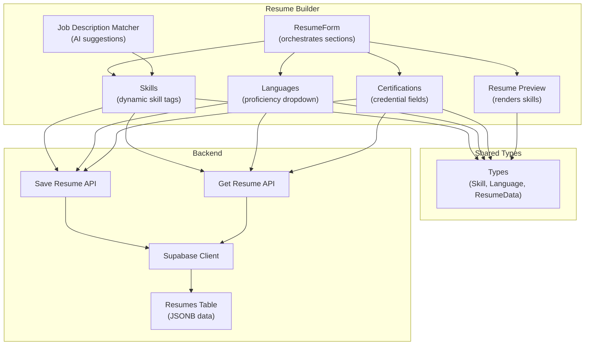
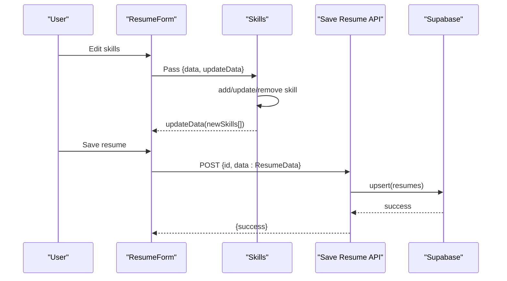
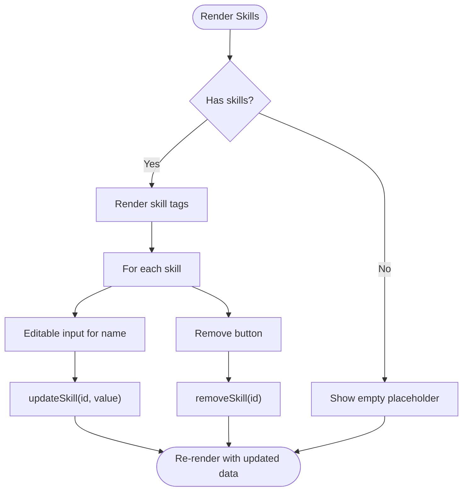
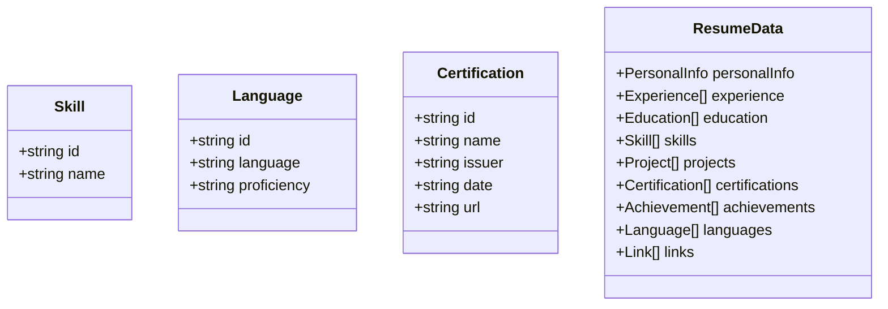
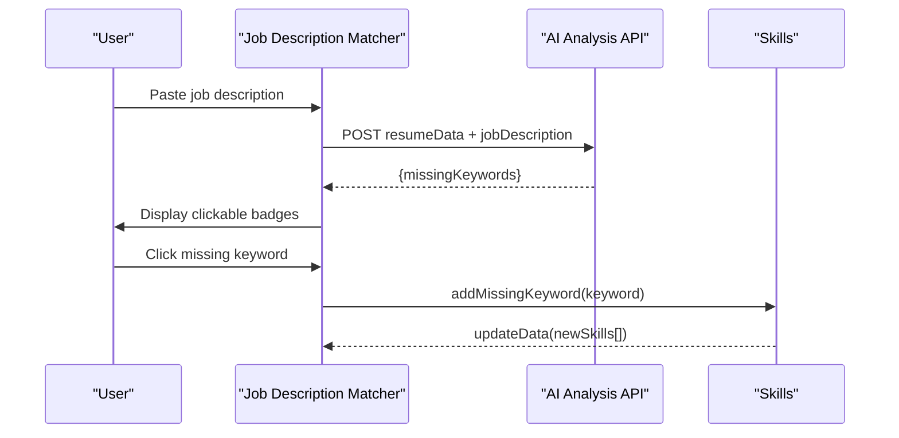
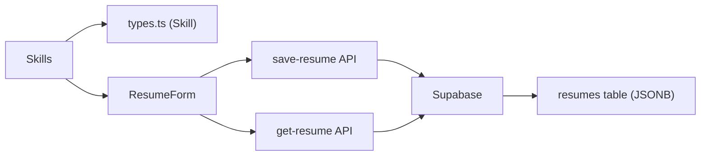

# Skills Component

<cite>
**Referenced Files in This Document**
- [skills.tsx](file://src/components/resume/skills.tsx)
- [types.ts](file://src/lib/types.ts)
- [resume-form.tsx](file://src/components/resume/resume-form.tsx)
- [languages.tsx](file://src/components/resume/languages.tsx)
- [certifications.tsx](file://src/components/resume/certifications.tsx)
- [job-description-matcher.tsx](file://src/components/resume/job-description-matcher.tsx)
- [resume-preview.tsx](file://src/components/resume/resume-preview.tsx)
- [route.ts](file://src/app/api/save-resume/route.ts)
- [route.ts](file://src/app/api/get-resume/route.ts)
- [supabase.ts](file://src/lib/supabase.ts)
- [supabase-setup.sql](file://supabase-setup.sql)
</cite>

## Table of Contents
1. [Introduction](#introduction)
2. [Project Structure](#project-structure)
3. [Core Components](#core-components)
4. [Architecture Overview](#architecture-overview)
5. [Detailed Component Analysis](#detailed-component-analysis)
6. [Dependency Analysis](#dependency-analysis)
7. [Performance Considerations](#performance-considerations)
8. [Troubleshooting Guide](#troubleshooting-guide)
9. [Conclusion](#conclusion)

## Introduction
This document provides comprehensive technical and practical guidance for the Skills component that manages technical and soft skill categorization within the resume builder application. It explains the skill grouping system, proficiency levels, and category organization, along with the dynamic skill input system, autocomplete functionality, and skill validation. Implementation examples demonstrate skill tagging, proficiency indicators, and skill matrix display, including common patterns such as technical skills, language proficiencies, and professional certifications.

## Project Structure
The Skills component is part of a modular resume builder built with Next.js and TypeScript. It integrates with shared types, form orchestration, preview rendering, and backend persistence.

**Diagram sources**
- [resume-form.tsx:19-83](file://src/components/resume/resume-form.tsx#L19-L83)
- [skills.tsx:13-71](file://src/components/resume/skills.tsx#L13-L71)
- [languages.tsx:16-73](file://src/components/resume/languages.tsx#L16-L73)
- [certifications.tsx:14-66](file://src/components/resume/certifications.tsx#L14-L66)
- [job-description-matcher.tsx:25-98](file://src/components/resume/job-description-matcher.tsx#L25-L98)
- [resume-preview.tsx:623-783](file://src/components/resume/resume-preview.tsx#L623-L783)
- [types.ts:31-79](file://src/lib/types.ts#L31-L79)
- [route.ts:31-82](file://src/app/api/save-resume/route.ts#L31-L82)
- [route.ts:10-57](file://src/app/api/get-resume/route.ts#L10-L57)
- [supabase.ts:10-25](file://src/lib/supabase.ts#L10-L25)
- [supabase-setup.sql:4-9](file://supabase-setup.sql#L4-L9)

**Section sources**
- [resume-form.tsx:19-83](file://src/components/resume/resume-form.tsx#L19-L83)
- [types.ts:31-79](file://src/lib/types.ts#L31-L79)

## Core Components
- Skills component: Manages dynamic skill entries as interactive tags with add/remove capabilities.
- Shared types: Define the Skill model and ResumeData structure, enabling consistent data handling across components.
- Languages component: Provides proficiency levels for languages alongside language names.
- Certifications component: Captures credential details for professional certifications.
- Job Description Matcher: Suggests missing keywords and allows adding them as skills.
- Resume Preview: Renders skills as a compact tag list in the final resume view.

**Section sources**
- [skills.tsx:13-71](file://src/components/resume/skills.tsx#L13-L71)
- [types.ts:31-79](file://src/lib/types.ts#L31-L79)
- [languages.tsx:16-73](file://src/components/resume/languages.tsx#L16-L73)
- [certifications.tsx:14-66](file://src/components/resume/certifications.tsx#L14-L66)
- [job-description-matcher.tsx:25-98](file://src/components/resume/job-description-matcher.tsx#L25-L98)
- [resume-preview.tsx:623-783](file://src/components/resume/resume-preview.tsx#L623-L783)

## Architecture Overview
The Skills component participates in a unidirectional data flow:
- Parent component (ResumeForm) passes current ResumeData and an update callback.
- Skills updates only the skills array, returning a new array to the parent.
- Backend APIs persist and retrieve the complete ResumeData payload.

**Diagram sources**
- [resume-form.tsx:46-49](file://src/components/resume/resume-form.tsx#L46-L49)
- [skills.tsx:14-32](file://src/components/resume/skills.tsx#L14-L32)
- [route.ts:31-82](file://src/app/api/save-resume/route.ts#L31-L82)
- [supabase.ts:10-25](file://src/lib/supabase.ts#L10-L25)

## Detailed Component Analysis

### Skills Component
The Skills component renders a list of skill tags with inline editing and removal controls. It supports dynamic addition of skills and maintains a stable identity per skill via a generated UUID.

Key behaviors:
- Add skill: Creates a new skill entry with an empty name and a unique identifier.
- Update skill: Replaces the name of a specific skill by matching its id.
- Remove skill: Filters out the selected skill by id.
- Empty state: Displays a placeholder message when no skills are present.

**Diagram sources**
- [skills.tsx:13-71](file://src/components/resume/skills.tsx#L13-L71)

Implementation examples:
- Skill tagging: See [skills.tsx:44-62](file://src/components/resume/skills.tsx#L44-L62).
- Dynamic input: See [skills.tsx:49-54](file://src/components/resume/skills.tsx#L49-L54).
- Validation pattern: See [types.ts:31-34](file://src/lib/types.ts#L31-L34).

**Section sources**
- [skills.tsx:13-71](file://src/components/resume/skills.tsx#L13-L71)
- [types.ts:31-34](file://src/lib/types.ts#L31-L34)

### Proficiency Levels and Category Organization
While the Skills component focuses on free-form skill names, proficiency levels are modeled separately for languages. The Languages component defines a fixed set of proficiency levels and exposes a dropdown selection per language entry.

Common patterns:
- Technical skills: Free-text entries suitable for frameworks, tools, and technologies.
- Language proficiencies: Enumerated levels (e.g., Native, Fluent, Professional, Intermediate, Basic).
- Professional certifications: Structured fields for name, issuer, date, and optional URL.

**Diagram sources**
- [types.ts:31-79](file://src/lib/types.ts#L31-L79)

**Section sources**
- [languages.tsx:9](file://src/components/resume/languages.tsx#L9)
- [languages.tsx:16-73](file://src/components/resume/languages.tsx#L16-L73)
- [certifications.tsx:14-66](file://src/components/resume/certifications.tsx#L14-L66)
- [types.ts:31-79](file://src/lib/types.ts#L31-L79)

### Autocomplete Functionality and Skill Validation
The Skills component does not implement autocomplete internally. Instead, the Job Description Matcher component suggests missing keywords extracted from a job description and allows adding them as skills with a single click.

Validation mechanisms:
- Frontend: Skills are validated against the Skill type definition.
- Backend: Save and get APIs validate the ResumeData payload shape and enforce authentication and ownership.

**Diagram sources**
- [job-description-matcher.tsx:25-98](file://src/components/resume/job-description-matcher.tsx#L25-L98)
- [skills.tsx:14-32](file://src/components/resume/skills.tsx#L14-L32)

**Section sources**
- [job-description-matcher.tsx:25-98](file://src/components/resume/job-description-matcher.tsx#L25-L98)
- [route.ts:31-82](file://src/app/api/save-resume/route.ts#L31-L82)
- [route.ts:10-57](file://src/app/api/get-resume/route.ts#L10-L57)

### Skill Matrix Display
The Resume Preview component aggregates skills into a concise tag list for presentation. This provides a skill matrix-like view combining technical skills, languages, and certifications.

Rendering patterns:
- Skills: Compact tags rendered as a horizontal list.
- Languages: Comma-separated entries showing language and proficiency.
- Certifications: Title and issuer/date pairs.

**Section sources**
- [resume-preview.tsx:623-783](file://src/components/resume/resume-preview.tsx#L623-L783)

## Dependency Analysis
The Skills component depends on shared types and integrates with the form orchestration and backend persistence.

**Diagram sources**
- [skills.tsx:6](file://src/components/resume/skills.tsx#L6)
- [types.ts:31-34](file://src/lib/types.ts#L31-L34)
- [resume-form.tsx:46-49](file://src/components/resume/resume-form.tsx#L46-L49)
- [route.ts:31-82](file://src/app/api/save-resume/route.ts#L31-L82)
- [route.ts:10-57](file://src/app/api/get-resume/route.ts#L10-L57)
- [supabase-setup.sql:4-9](file://supabase-setup.sql#L4-L9)

**Section sources**
- [skills.tsx:6](file://src/components/resume/skills.tsx#L6)
- [types.ts:31-34](file://src/lib/types.ts#L31-L34)
- [resume-form.tsx:46-49](file://src/components/resume/resume-form.tsx#L46-L49)
- [route.ts:31-82](file://src/app/api/save-resume/route.ts#L31-L82)
- [route.ts:10-57](file://src/app/api/get-resume/route.ts#L10-L57)
- [supabase-setup.sql:4-9](file://supabase-setup.sql#L4-L9)

## Performance Considerations
- Rendering efficiency: The Skills component uses a simple map over the skills array. Keep the array reasonably sized to avoid excessive DOM nodes.
- Memory stability: Each skill update creates a new array reference; ensure downstream consumers (e.g., preview) efficiently handle re-renders.
- Backend throughput: The save-resume endpoint serializes the entire ResumeData payload; avoid unnecessary large arrays or nested structures.

## Troubleshooting Guide
Common issues and resolutions:
- Skills not persisting: Verify ResumeForm passes the skills array to updateData and that the save-resume API receives ResumeData with a valid id.
- Authentication errors: Ensure the user is authenticated before calling save or get endpoints.
- Data shape mismatches: Confirm the ResumeData payload conforms to the validation schema used by the backend.

**Section sources**
- [route.ts:31-82](file://src/app/api/save-resume/route.ts#L31-L82)
- [route.ts:10-57](file://src/app/api/get-resume/route.ts#L10-L57)
- [supabase.ts:10-25](file://src/lib/supabase.ts#L10-L25)

## Conclusion
The Skills component provides a flexible, dynamic foundation for managing technical and soft skills. Combined with the Languages and Certifications components, it supports a comprehensive skill ecosystem. The Job Description Matcher enhances usability by suggesting relevant keywords and integrating seamlessly with the Skills component. Together, these pieces deliver a robust skill management experience with clear validation, persistence, and presentation pathways.