# Work Experience Component

<cite>
**Referenced Files in This Document**
- [experience.tsx](file://src/components/resume/experience.tsx)
- [resume-form.tsx](file://src/components/resume/resume-form.tsx)
- [types.ts](file://src/lib/types.ts)
- [page.tsx](file://src/app/builder/page.tsx)
- [linkedin-import.tsx](file://src/components/resume/linkedin-import.tsx)
- [resume-preview.tsx](file://src/components/resume/resume-preview.tsx)
</cite>

## Table of Contents
1. [Introduction](#introduction)
2. [Project Structure](#project-structure)
3. [Core Components](#core-components)
4. [Architecture Overview](#architecture-overview)
5. [Detailed Component Analysis](#detailed-component-analysis)
6. [Dependency Analysis](#dependency-analysis)
7. [Performance Considerations](#performance-considerations)
8. [Troubleshooting Guide](#troubleshooting-guide)
9. [Conclusion](#conclusion)

## Introduction
The Work Experience Component is a dynamic form system designed to manage job history data entry for resume creation. This component enables users to add, edit, and remove multiple work experiences with comprehensive details including company information, position titles, employment dates, and detailed descriptions. The system supports various employment scenarios including full-time positions, part-time roles, internships, and multiple concurrent positions at the same company.

## Project Structure
The Work Experience Component is integrated into the broader resume builder application as part of the modular component architecture. The component follows a unidirectional data flow pattern where parent components manage state and pass it down to child components through props.

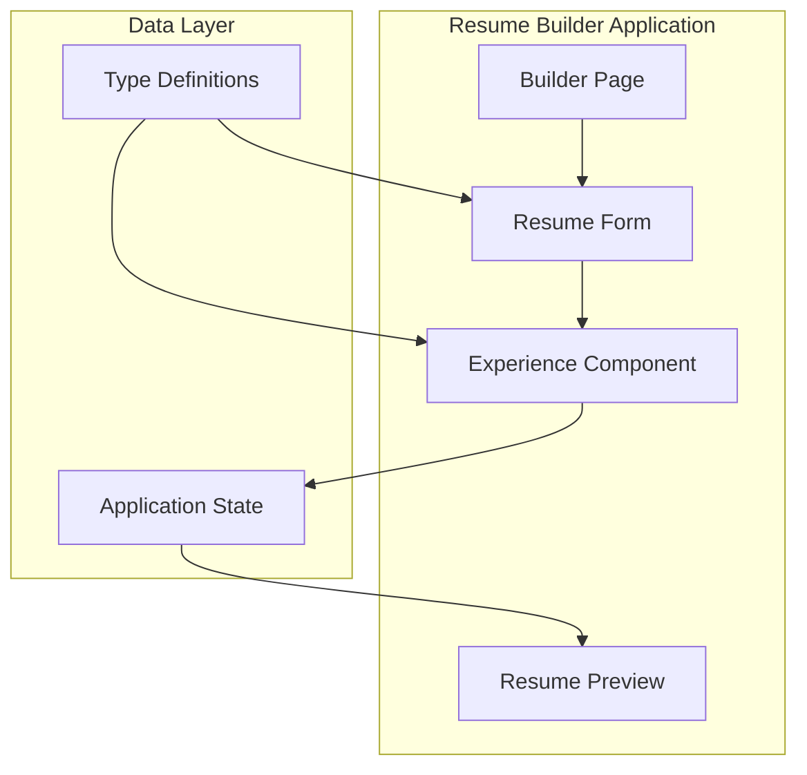

**Diagram sources**
- [page.tsx:15-89](file://src/app/builder/page.tsx#L15-L89)
- [resume-form.tsx:19-84](file://src/components/resume/resume-form.tsx#L19-L84)
- [experience.tsx:15-113](file://src/components/resume/experience.tsx#L15-L113)

**Section sources**
- [page.tsx:15-89](file://src/app/builder/page.tsx#L15-L89)
- [resume-form.tsx:19-84](file://src/components/resume/resume-form.tsx#L19-L84)

## Core Components

### Experience Data Model
The Experience component operates on a structured data model that defines the complete work history record structure:

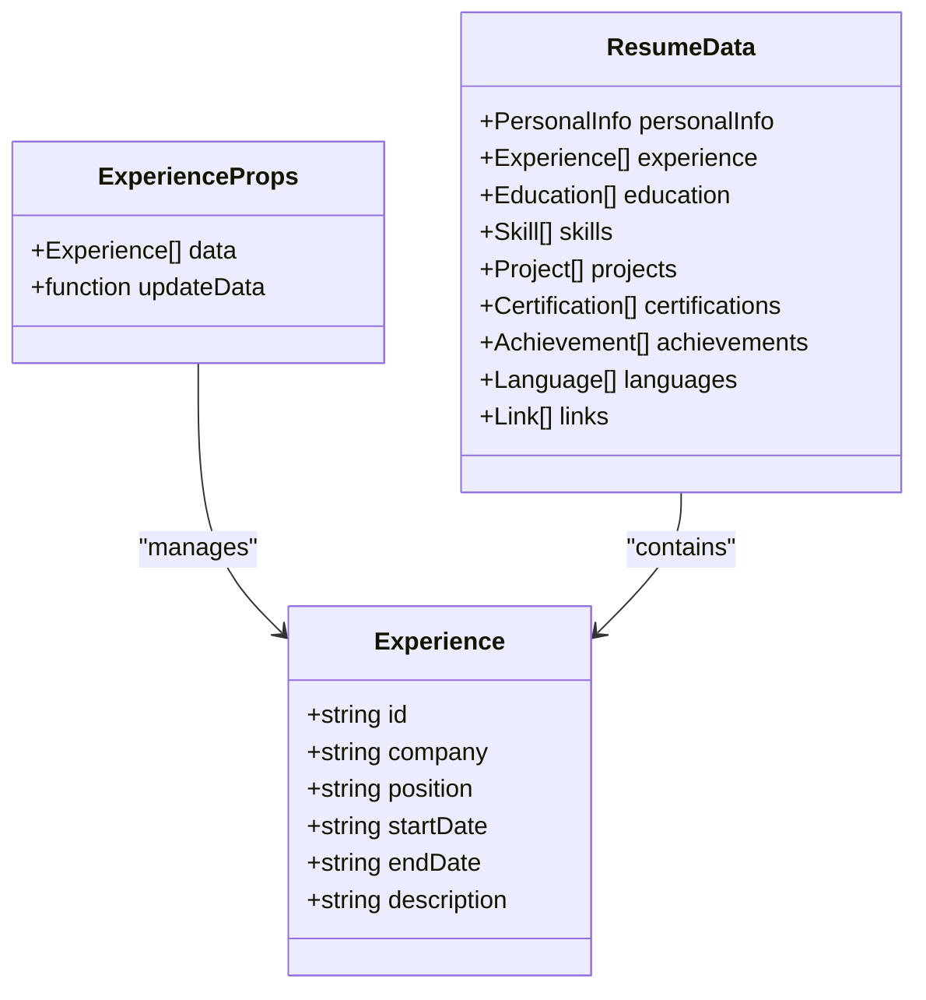

**Diagram sources**
- [types.ts:13-20](file://src/lib/types.ts#L13-L20)
- [types.ts:69-79](file://src/lib/types.ts#L69-L79)

The Experience data structure includes five primary fields:
- **id**: Unique identifier for each experience entry (UUID)
- **company**: Name of the employer or organization
- **position**: Job title or role held
- **startDate**: Employment start date (formatted as "YYYY-MM" or "YYYY")
- **endDate**: Employment end date or "Present" indicator
- **description**: Comprehensive job responsibilities and achievements

**Section sources**
- [types.ts:13-20](file://src/lib/types.ts#L13-L20)
- [types.ts:69-79](file://src/lib/types.ts#L69-L79)

## Architecture Overview

### Component Hierarchy and Data Flow
The Experience component follows a hierarchical architecture pattern where state management flows from parent components to child components:

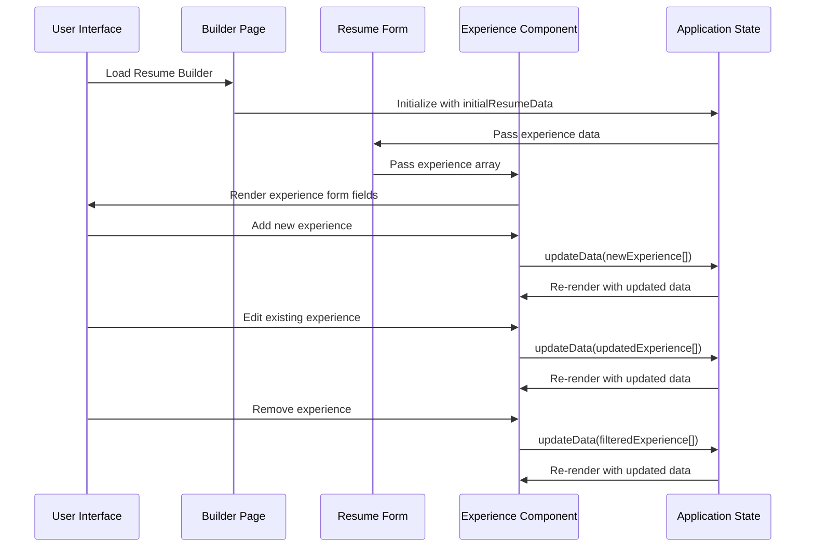

**Diagram sources**
- [page.tsx:15-89](file://src/app/builder/page.tsx#L15-L89)
- [resume-form.tsx:19-84](file://src/components/resume/resume-form.tsx#L19-L84)
- [experience.tsx:15-113](file://src/components/resume/experience.tsx#L15-L113)

### Dynamic List Management System
The Experience component implements a sophisticated dynamic list management system that supports real-time manipulation of work history entries:

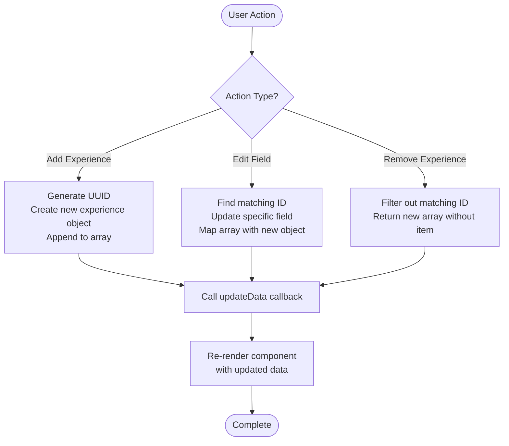

**Diagram sources**
- [experience.tsx:17-39](file://src/components/resume/experience.tsx#L17-L39)

**Section sources**
- [experience.tsx:15-113](file://src/components/resume/experience.tsx#L15-L113)

## Detailed Component Analysis

### Experience Component Implementation
The Experience component serves as a comprehensive form container for managing work history data with robust state management capabilities.

#### Component Structure and Props
The component accepts two primary props:
- **data**: Array of Experience objects representing current work history
- **updateData**: Callback function for updating the experience array in parent components

#### Dynamic Field Management
Each experience entry includes six interactive fields:
1. **Company Name**: Text input for employer identification
2. **Position**: Job title or role description
3. **Start Date**: Employment beginning date
4. **End Date**: Employment ending date or "Present" indicator
5. **Description**: Detailed responsibilities and achievements
6. **Action Buttons**: Add/remove functionality for each experience entry

#### Add Experience Functionality
The component generates unique identifiers using cryptographic randomization to ensure stable React keys and prevent rendering issues:

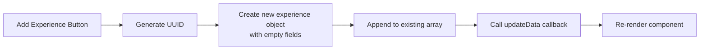

**Diagram sources**
- [experience.tsx:17-29](file://src/components/resume/experience.tsx#L17-L29)

#### Edit Experience Functionality
Field-level editing utilizes a flexible update mechanism that targets specific experience entries by ID:

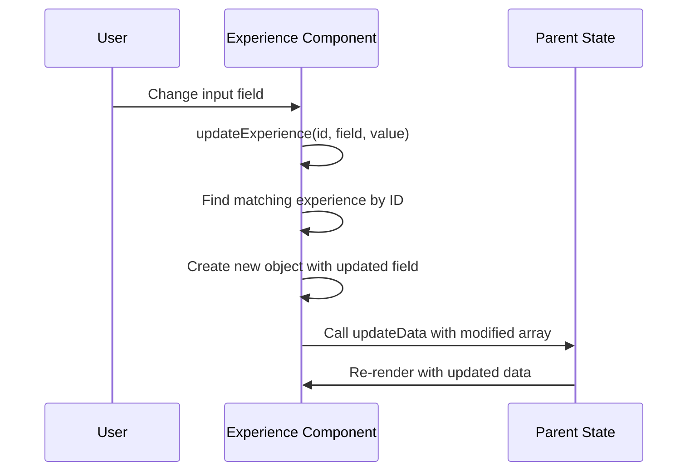

**Diagram sources**
- [experience.tsx:31-35](file://src/components/resume/experience.tsx#L31-L35)

#### Remove Experience Functionality
Experience removal maintains data integrity by filtering out specific entries while preserving others:

**Section sources**
- [experience.tsx:15-113](file://src/components/resume/experience.tsx#L15-L113)

### Nested Form Handling
The Experience component demonstrates advanced nested form handling patterns within the broader resume builder architecture:

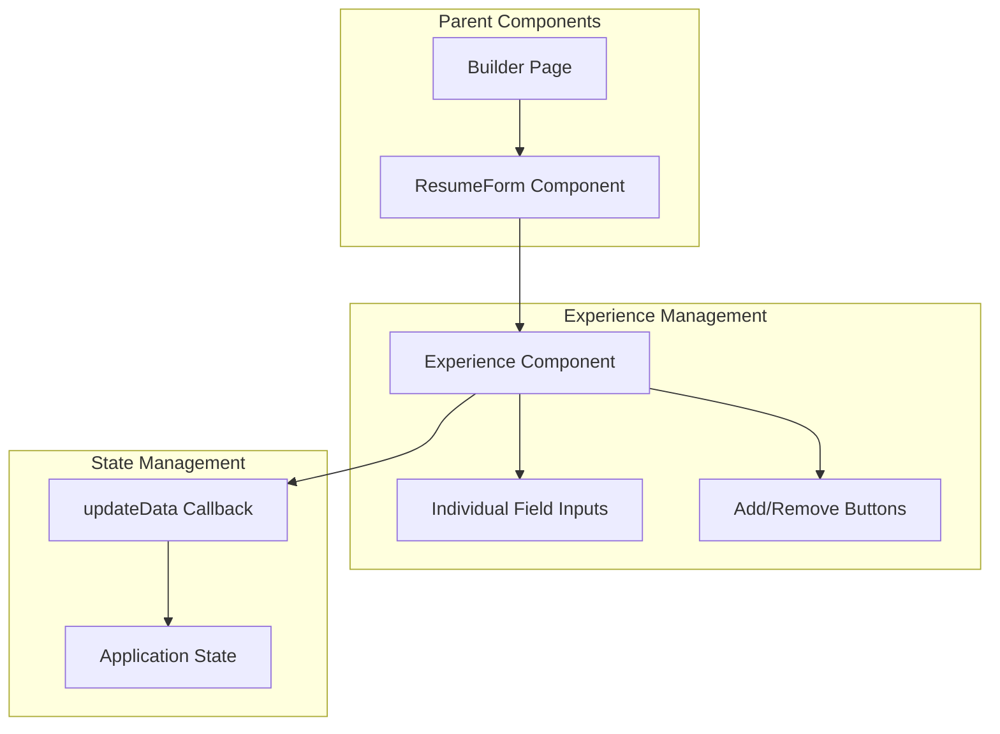

**Diagram sources**
- [resume-form.tsx:34-37](file://src/components/resume/resume-form.tsx#L34-L37)
- [experience.tsx:31-35](file://src/components/resume/experience.tsx#L31-L35)

### Timeline Validation and Date Handling
The Experience component supports flexible date formats and validation patterns:

#### Date Format Support
- **Standard Format**: "YYYY-MM" (e.g., "2023-01" for January 2023)
- **Year-Only Format**: "YYYY" (e.g., "2023" for the year 2023)
- **Present Indicator**: "Present" for current employment

#### LinkedIn Import Integration
The component integrates with LinkedIn data import functionality that automatically parses and formats experience data:

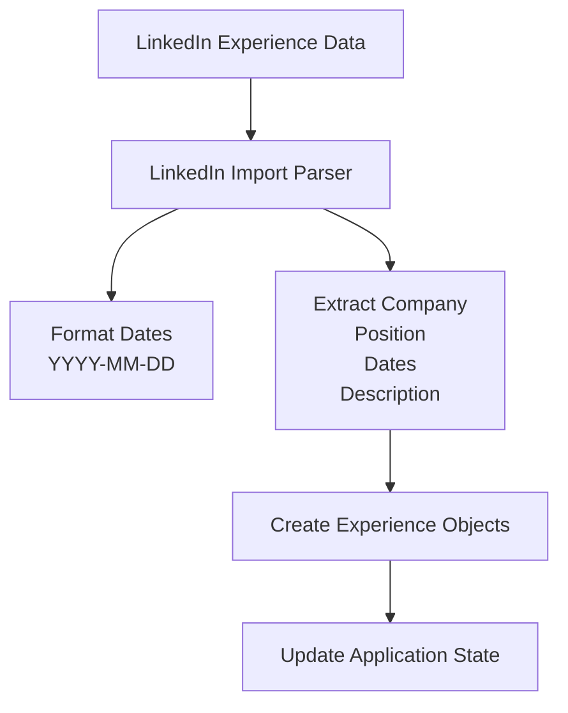

**Diagram sources**
- [linkedin-import.tsx:82-92](file://src/components/resume/linkedin-import.tsx#L82-L92)

**Section sources**
- [experience.tsx:77-90](file://src/components/resume/experience.tsx#L77-L90)
- [linkedin-import.tsx:82-92](file://src/components/resume/linkedin-import.tsx#L82-L92)

### Experience Sorting and Timeline Management
While the Experience component doesn't implement automatic sorting, the preview system displays experiences in chronological order:

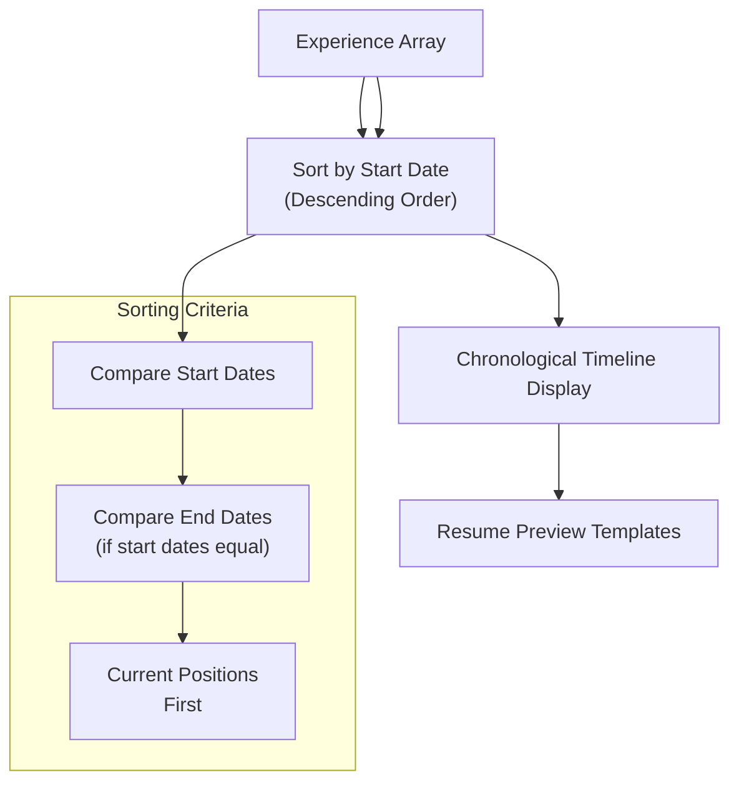

**Diagram sources**
- [resume-preview.tsx:57-72](file://src/components/resume/resume-preview.tsx#L57-L72)

**Section sources**
- [resume-preview.tsx:57-72](file://src/components/resume/resume-preview.tsx#L57-L72)

## Dependency Analysis

### Component Dependencies
The Experience component has minimal external dependencies and maintains loose coupling with other system components:

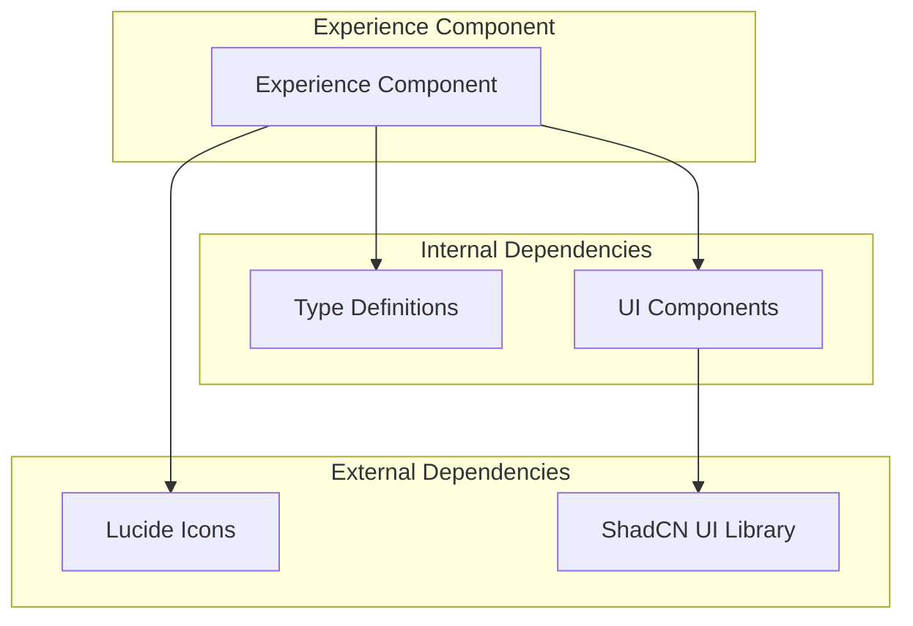

**Diagram sources**
- [experience.tsx:3-8](file://src/components/resume/experience.tsx#L3-L8)
- [types.ts:13-20](file://src/lib/types.ts#L13-L20)

### State Management Dependencies
The component relies on a centralized state management pattern where parent components handle state updates:

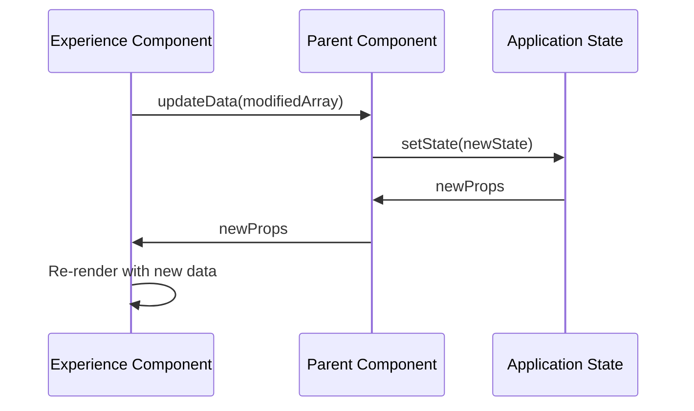

**Diagram sources**
- [experience.tsx:11-13](file://src/components/resume/experience.tsx#L11-L13)

**Section sources**
- [experience.tsx:3-8](file://src/components/resume/experience.tsx#L3-L8)
- [types.ts:13-20](file://src/lib/types.ts#L13-L20)

## Performance Considerations

### Rendering Optimization
The Experience component implements several performance optimization strategies:

1. **Unique ID Generation**: Uses cryptographic randomization for stable React keys
2. **Efficient Updates**: Implements targeted array updates rather than full re-renders
3. **Conditional Rendering**: Displays placeholder content when no experiences exist

### Memory Management
The component follows React best practices for memory management:
- Proper cleanup of event listeners
- Efficient state updates using immutable patterns
- Minimal re-rendering through selective updates

## Troubleshooting Guide

### Common Issues and Solutions

#### Issue: Experience Entries Not Saving
**Symptoms**: New experience entries disappear after navigation
**Solution**: Verify that the parent component's updateData callback properly persists state changes

#### Issue: Date Format Validation Errors
**Symptoms**: Date inputs show validation errors or unexpected behavior
**Solution**: Ensure dates follow the "YYYY-MM" or "YYYY" format standards

#### Issue: Experience Order Problems
**Symptoms**: Experiences appear in incorrect chronological order
**Solution**: Implement proper sorting logic based on start dates before rendering

#### Issue: LinkedIn Import Failures
**Symptoms**: LinkedIn data import fails or shows parsing errors
**Solution**: Verify LinkedIn export file format and ensure JSON validity

**Section sources**
- [linkedin-import.tsx:21-132](file://src/components/resume/linkedin-import.tsx#L21-L132)

## Conclusion
The Work Experience Component provides a robust, scalable solution for managing job history data in resume creation applications. Its implementation demonstrates excellent React patterns including proper state management, dynamic list handling, and seamless integration with external data sources like LinkedIn. The component's architecture supports various employment scenarios while maintaining performance and user experience standards.

The component's strength lies in its simplicity and effectiveness - it focuses on core functionality without unnecessary complexity, making it maintainable and extensible for future enhancements. The integration with the broader resume builder ecosystem ensures consistent user experience across all form components.