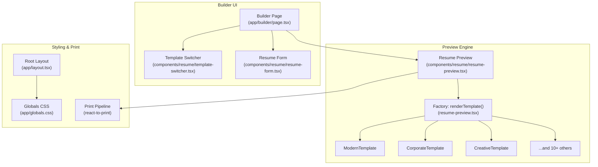
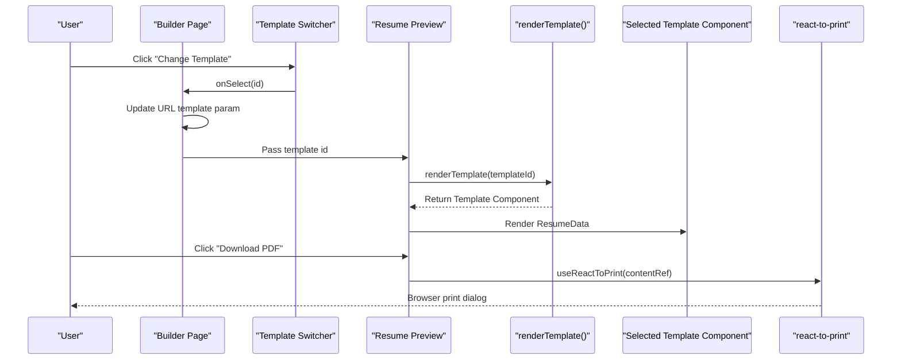
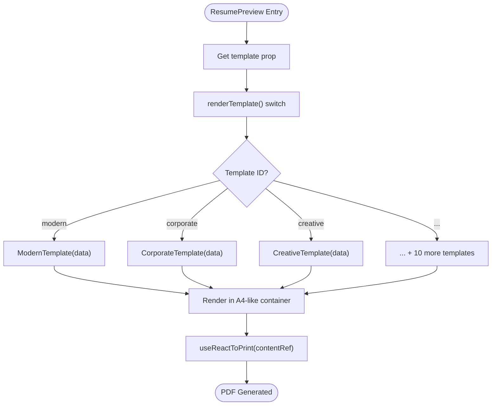
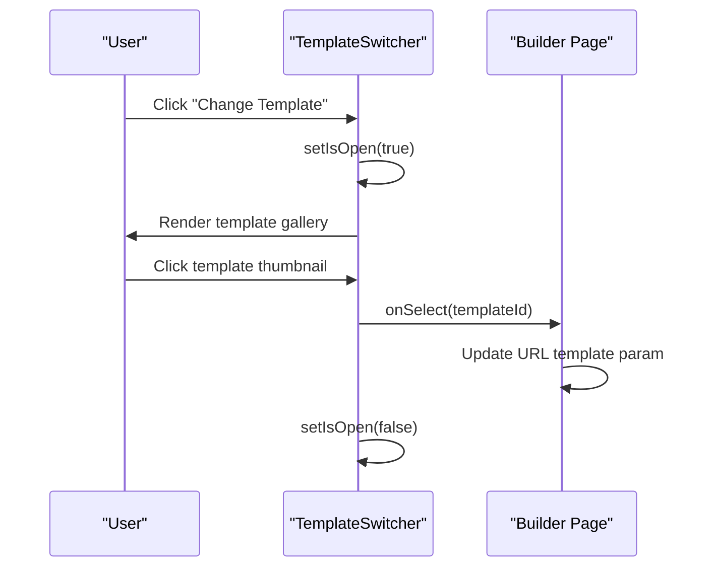
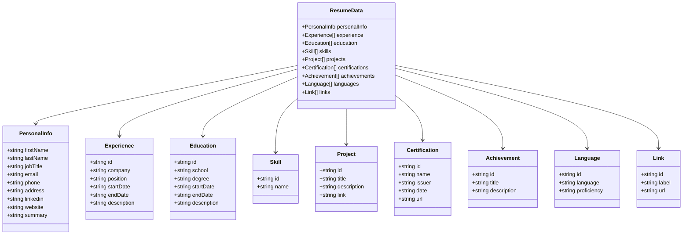
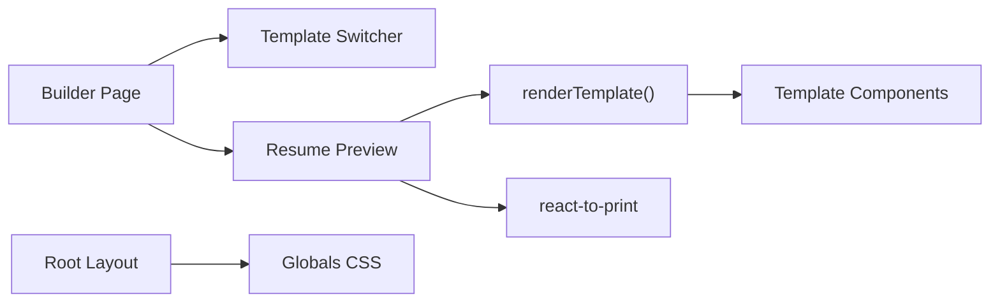

# Resume Preview System

<cite>
**Referenced Files in This Document**
- [resume-preview.tsx](file://src/components/resume/resume-preview.tsx)
- [template-switcher.tsx](file://src/components/resume/template-switcher.tsx)
- [types.ts](file://src/lib/types.ts)
- [page.tsx](file://src/app/builder/page.tsx)
- [page.tsx](file://src/app/templates/page.tsx)
- [layout.tsx](file://src/app/layout.tsx)
- [globals.css](file://src/app/globals.css)
- [generate_massive_docx_v3.py](file://src/generate_massive_docx_v3.py)
- [generate_massive_docx_v4.py](file://src/generate_massive_docx_v4.py)
- [generate_massive_docx_v5.py](file://src/generate_massive_docx_v5.py)
- [generate_massive_docx_v6.py](file://src/generate_massive_docx_v6.py)
</cite>

## Table of Contents
1. [Introduction](#introduction)
2. [Project Structure](#project-structure)
3. [Core Components](#core-components)
4. [Architecture Overview](#architecture-overview)
5. [Detailed Component Analysis](#detailed-component-analysis)
6. [Dependency Analysis](#dependency-analysis)
7. [Performance Considerations](#performance-considerations)
8. [Troubleshooting Guide](#troubleshooting-guide)
9. [Conclusion](#conclusion)

## Introduction
The Resume Preview System renders the final resume output based on user-entered data and a selected template. It provides a live preview pane, supports multiple distinct resume templates, enables template switching, and produces print-ready PDFs via the browser’s native print pipeline. The system emphasizes separation of concerns: a shared data model drives multiple presentation templates, enabling easy extensibility and consistent styling across templates.

## Project Structure
The preview system spans three primary areas:
- Data model and builder integration: types, builder page, and preview component
- Template catalog and selection: static template list and switcher UI
- Styling and print pipeline: global theme, Tailwind-based styles, and print media rules

**Diagram sources**
- [page.tsx:11-68](file://src/app/builder/page.tsx#L11-L68)
- [template-switcher.tsx:76-158](file://src/components/resume/template-switcher.tsx#L76-L158)
- [resume-preview.tsx:809-839](file://src/components/resume/resume-preview.tsx#L809-L839)
- [layout.tsx:25-49](file://src/app/layout.tsx#L25-L49)
- [globals.css:1-169](file://src/app/globals.css#L1-L169)

**Section sources**
- [page.tsx:11-68](file://src/app/builder/page.tsx#L11-L68)
- [template-switcher.tsx:8-69](file://src/components/resume/template-switcher.tsx#L8-L69)
- [resume-preview.tsx:809-839](file://src/components/resume/resume-preview.tsx#L809-L839)
- [layout.tsx:25-49](file://src/app/layout.tsx#L25-L49)
- [globals.css:1-169](file://src/app/globals.css#L1-L169)

## Core Components
- ResumePreview: Renders the selected template inside a print-friendly container and triggers PDF generation through the browser print dialog.
- TemplateSwitcher: Presents a gallery of available templates and updates the URL parameter to switch templates.
- Types: Defines the ResumeData contract consumed by all templates.
- Builder Page: Orchestrates form editing and preview synchronization, persisting data in session storage.
- Templates Catalog: Static list of supported templates with identifiers and preview images.

Key responsibilities:
- Preview data binding: ResumePreview receives ResumeData and passes it to the chosen template component.
- Dynamic template loading: renderTemplate() selects the appropriate template component based on the template identifier.
- Preview refresh: Changing the template URL parameter updates the preview instantly.
- Print pipeline: useReactToPrint clones the preview DOM into an iframe and triggers the browser print dialog.

**Section sources**
- [resume-preview.tsx:809-839](file://src/components/resume/resume-preview.tsx#L809-L839)
- [template-switcher.tsx:8-69](file://src/components/resume/template-switcher.tsx#L8-L69)
- [types.ts:69-79](file://src/lib/types.ts#L69-L79)
- [page.tsx:11-68](file://src/app/builder/page.tsx#L11-L68)

## Architecture Overview
The preview system follows a factory pattern for template rendering:
- A single entry point (ResumePreview) delegates rendering to a template-specific component based on a template identifier.
- The builder page manages user data and template selection, updating the URL to reflect the current template.
- The print pipeline leverages react-to-print to clone the preview DOM and apply print-specific CSS.

**Diagram sources**
- [page.tsx:38-42](file://src/app/builder/page.tsx#L38-L42)
- [template-switcher.tsx:119-122](file://src/components/resume/template-switcher.tsx#L119-L122)
- [resume-preview.tsx:809-839](file://src/components/resume/resume-preview.tsx#L809-L839)
- [resume-preview.tsx:796-800](file://src/components/resume/resume-preview.tsx#L796-L800)

## Detailed Component Analysis

### ResumePreview Component
- Purpose: Hosts the preview container, applies print-friendly styles, and orchestrates PDF generation.
- Rendering strategy:
  - Uses a factory method to select a template component based on the template prop.
  - Wraps the rendered template in a fixed-size A4-like container with print-specific padding and styles.
- Print pipeline:
  - Integrates react-to-print to clone the preview DOM into an invisible iframe and trigger the browser print dialog.
  - Disables the download button during generation to prevent concurrent prints.
- Responsive behavior:
  - Provides a mobile-friendly bottom toolbar and a desktop top toolbar for downloads.
  - Adjusts inner container padding depending on the selected template.

**Diagram sources**
- [resume-preview.tsx:809-839](file://src/components/resume/resume-preview.tsx#L809-L839)
- [resume-preview.tsx:841-878](file://src/components/resume/resume-preview.tsx#L841-L878)

**Section sources**
- [resume-preview.tsx:809-839](file://src/components/resume/resume-preview.tsx#L809-L839)
- [resume-preview.tsx:841-878](file://src/components/resume/resume-preview.tsx#L841-L878)

### TemplateSwitcher Component
- Purpose: Allows users to browse and select a template visually.
- Behavior:
  - Maintains an internal open state and displays a modal sidebar with template thumbnails.
  - Highlights the currently selected template and updates the URL parameter upon selection.
- Integration:
  - Receives the current template id and an onSelect callback from the builder page.
  - Uses a static template list with ids, names, and preview image paths.

**Diagram sources**
- [template-switcher.tsx:76-158](file://src/components/resume/template-switcher.tsx#L76-L158)
- [page.tsx:38-42](file://src/app/builder/page.tsx#L38-L42)

**Section sources**
- [template-switcher.tsx:8-69](file://src/components/resume/template-switcher.tsx#L8-L69)
- [template-switcher.tsx:76-158](file://src/components/resume/template-switcher.tsx#L76-L158)
- [page.tsx:38-42](file://src/app/builder/page.tsx#L38-L42)

### Data Model and Builder Integration
- Data contract: ResumeData defines typed sections for personal info, experience, education, skills, projects, certifications, achievements, languages, and links.
- Persistence: The builder page reads and writes ResumeData to/from sessionStorage to preserve edits across reloads.
- Synchronization: The builder page passes the current ResumeData and template id to the preview component.

**Diagram sources**
- [types.ts:1-103](file://src/lib/types.ts#L1-L103)

**Section sources**
- [types.ts:69-79](file://src/lib/types.ts#L69-L79)
- [page.tsx:16-36](file://src/app/builder/page.tsx#L16-L36)

### Template Catalog and Selection
- The templates page lists available templates with descriptions and images, linking to the builder with a template parameter.
- The builder page reads the template parameter from the URL and passes it to the preview component.
- The template switcher maintains a curated list of template ids and images for quick selection.

**Section sources**
- [page.tsx:10-74](file://src/app/templates/page.tsx#L10-L74)
- [page.tsx](file://src/app/builder/page.tsx#L14)
- [template-switcher.tsx:8-69](file://src/components/resume/template-switcher.tsx#L8-L69)

## Dependency Analysis
- Builder page depends on:
  - TemplateSwitcher for UI-driven template selection
  - ResumePreview for live preview rendering
  - Session storage for persistence
- ResumePreview depends on:
  - renderTemplate() to select a template component
  - useReactToPrint for PDF generation
  - Global theme and Tailwind utilities for styling
- TemplateSwitcher depends on:
  - Static template list for UI and routing
- Global styles depend on:
  - Tailwind and theme variables for consistent design tokens

**Diagram sources**
- [page.tsx:11-68](file://src/app/builder/page.tsx#L11-L68)
- [resume-preview.tsx:809-839](file://src/components/resume/resume-preview.tsx#L809-L839)
- [layout.tsx:25-49](file://src/app/layout.tsx#L25-L49)
- [globals.css:1-169](file://src/app/globals.css#L1-L169)

**Section sources**
- [page.tsx:11-68](file://src/app/builder/page.tsx#L11-L68)
- [resume-preview.tsx:809-839](file://src/components/resume/resume-preview.tsx#L809-L839)
- [layout.tsx:25-49](file://src/app/layout.tsx#L25-L49)
- [globals.css:1-169](file://src/app/globals.css#L1-L169)

## Performance Considerations
- Client-side PDF generation:
  - Uses react-to-print to clone the DOM and trigger the browser print dialog, avoiding server-side overhead and timeouts.
- Print pipeline specifics:
  - Extensive @media print rules define page size, margins, and background printing behavior.
  - Uses break-inside: avoid on critical blocks to prevent page splits mid-entry.
- Styling efficiency:
  - Tailwind utilities minimize CSS bloat while enabling rapid prototyping.
  - Theme variables centralize color and typography tokens for consistent rendering.

[No sources needed since this section provides general guidance]

## Troubleshooting Guide
Common issues and resolutions:
- PDF output missing backgrounds or incorrect colors:
  - Ensure print styles include background printing rules and use exact color adjustments for print contexts.
- Page breaks splitting content:
  - Apply break-inside: avoid to block-level containers for experience, education, and project entries.
- Cross-browser inconsistencies:
  - Validate @media print behavior in Chrome, Edge, and Firefox; adjust print rules as needed.
- Template not switching:
  - Confirm the URL template parameter is updated and the builder page re-renders the preview with the new template id.

**Section sources**
- [generate_massive_docx_v3.py:275-288](file://src/generate_massive_docx_v3.py#L275-L288)
- [generate_massive_docx_v4.py:277-289](file://src/generate_massive_docx_v4.py#L277-L289)
- [generate_massive_docx_v5.py:316-317](file://src/generate_massive_docx_v5.py#L316-L317)
- [generate_massive_docx_v6.py:266-271](file://src/generate_massive_docx_v6.py#L266-L271)

## Conclusion
The Resume Preview System cleanly separates data from presentation through a factory-rendered template architecture. Users can seamlessly switch templates, edit content in real time, and produce print-ready PDFs using the browser’s native print pipeline. The modular design allows new templates to be added by implementing a new component and extending the renderTemplate() selector, preserving system stability and scalability.