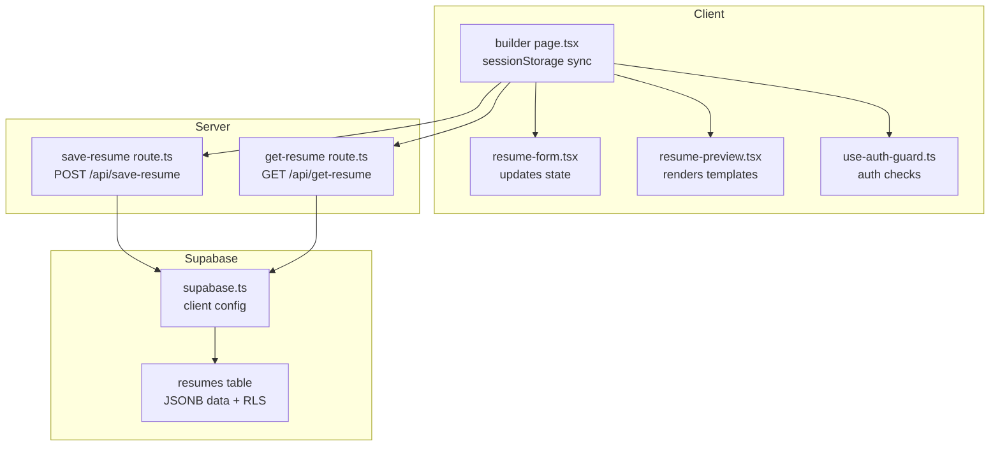
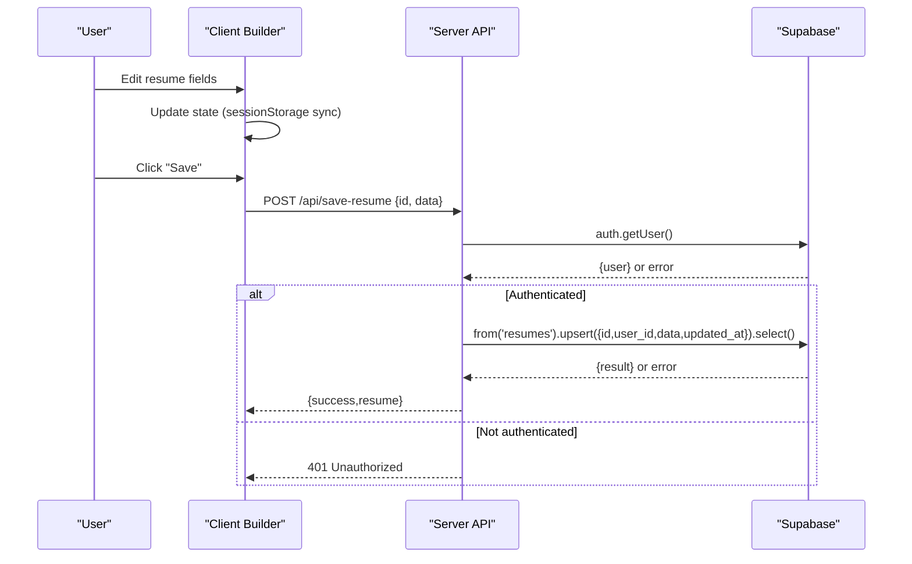
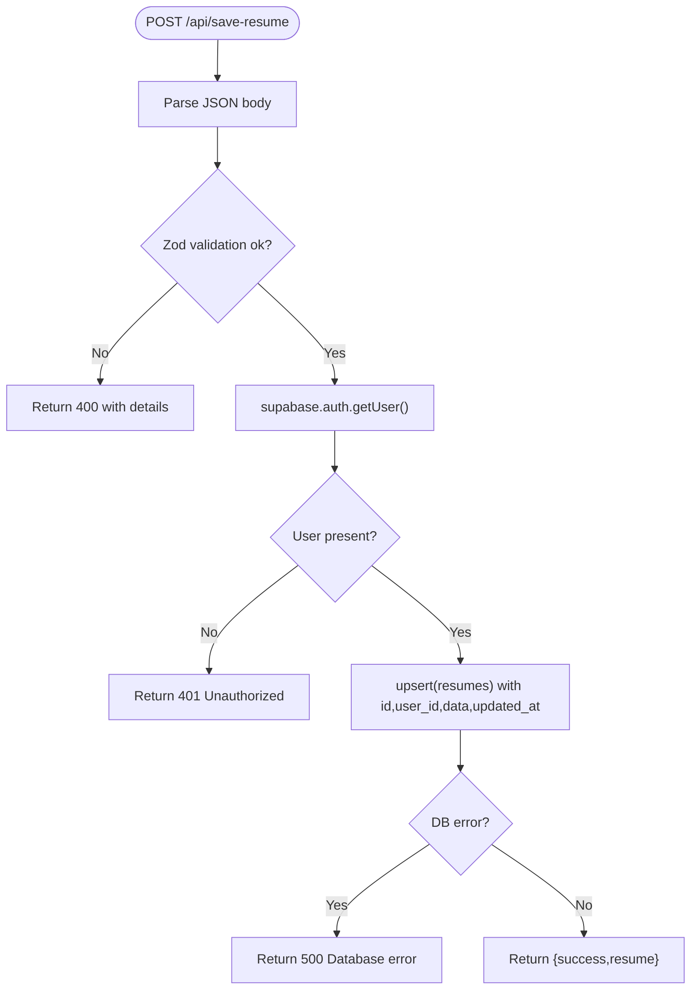
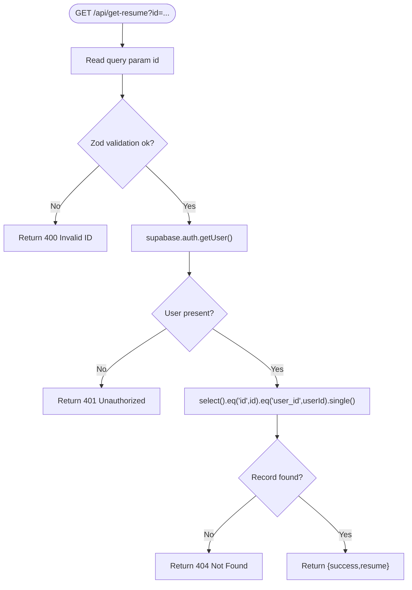
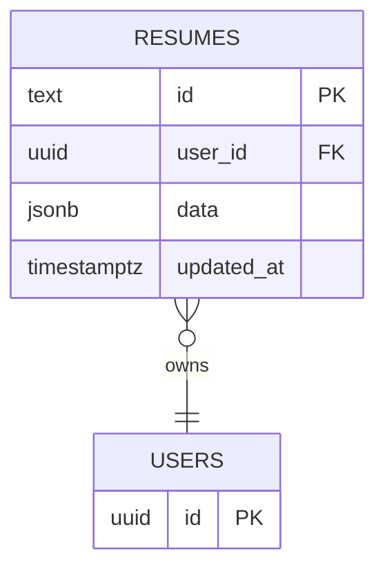
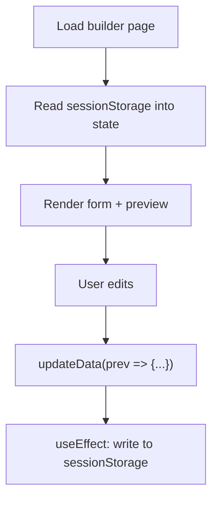
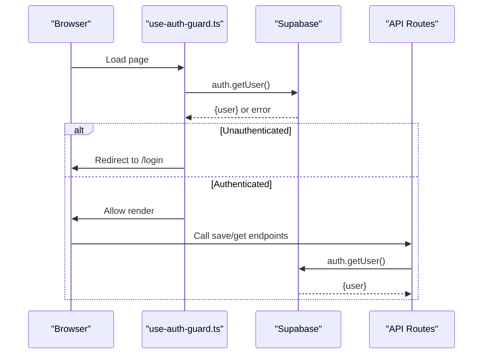
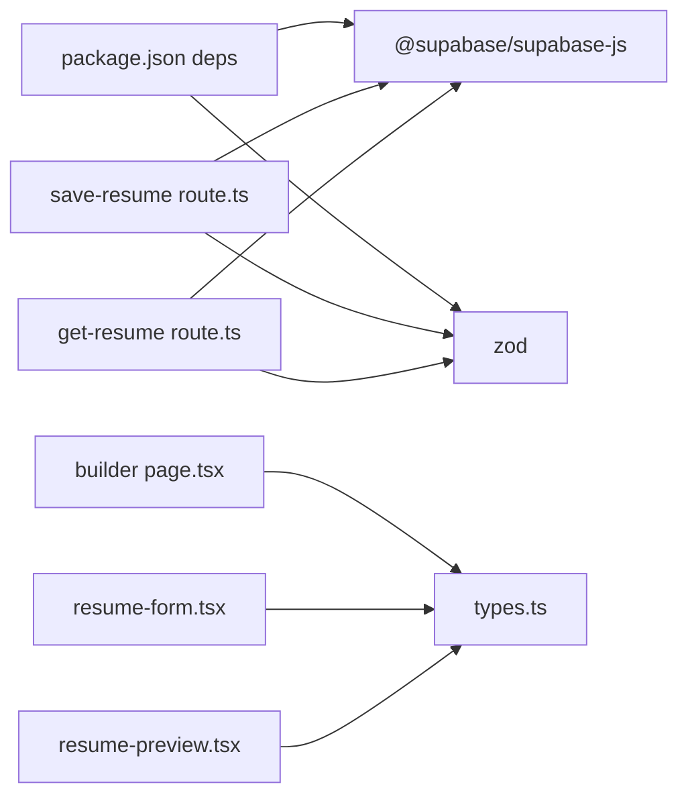

# API Integration and Data Persistence

<cite>
**Referenced Files in This Document**
- [save-resume route.ts](file://src/app/api/save-resume/route.ts)
- [get-resume route.ts](file://src/app/api/get-resume/route.ts)
- [supabase.ts](file://src/lib/supabase.ts)
- [supabase-setup.sql](file://supabase-setup.sql)
- [types.ts](file://src/lib/types.ts)
- [use-auth-guard.ts](file://src/hooks/use-auth-guard.ts)
- [builder page.tsx](file://src/app/builder/page.tsx)
- [resume-form.tsx](file://src/components/resume/resume-form.tsx)
- [resume-preview.tsx](file://src/components/resume/resume-preview.tsx)
- [auth.ts](file://src/lib/auth.ts)
- [package.json](file://package.json)
</cite>

## Table of Contents
1. [Introduction](#introduction)
2. [Project Structure](#project-structure)
3. [Core Components](#core-components)
4. [Architecture Overview](#architecture-overview)
5. [Detailed Component Analysis](#detailed-component-analysis)
6. [Dependency Analysis](#dependency-analysis)
7. [Performance Considerations](#performance-considerations)
8. [Troubleshooting Guide](#troubleshooting-guide)
9. [Conclusion](#conclusion)
10. [Appendices](#appendices)

## Introduction
This document explains the API integration and data persistence architecture for saving and retrieving resumes. It covers:
- Save-resume and get-resume API endpoints: request/response schemas, authentication, and error handling
- Supabase integration: table structure, RLS policies, and query patterns
- Client-server synchronization: session storage and cloud storage
- Practical usage examples, validation, caching, offline strategies, and extension guidance

## Project Structure
The data persistence stack spans client and server:
- Client-side state management and offline-first UX
- Next.js App Router API routes for server-side operations
- Supabase for authentication, RLS-secured storage, and JSONB data modeling

**Diagram sources**
- [builder page.tsx:11-78](file://src/app/builder/page.tsx#L11-L78)
- [resume-form.tsx:19-83](file://src/components/resume/resume-form.tsx#L19-L83)
- [resume-preview.tsx:789-800](file://src/components/resume/resume-preview.tsx#L789-L800)
- [use-auth-guard.ts:11-56](file://src/hooks/use-auth-guard.ts#L11-L56)
- [save-resume route.ts:31-82](file://src/app/api/save-resume/route.ts#L31-L82)
- [get-resume route.ts:10-57](file://src/app/api/get-resume/route.ts#L10-L57)
- [supabase.ts:1-35](file://src/lib/supabase.ts#L1-L35)
- [supabase-setup.sql:3-19](file://supabase-setup.sql#L3-L19)

**Section sources**
- [save-resume route.ts:1-83](file://src/app/api/save-resume/route.ts#L1-L83)
- [get-resume route.ts:1-58](file://src/app/api/get-resume/route.ts#L1-L58)
- [supabase.ts:1-35](file://src/lib/supabase.ts#L1-L35)
- [supabase-setup.sql:1-58](file://supabase-setup.sql#L1-L58)
- [types.ts:1-103](file://src/lib/types.ts#L1-L103)
- [builder page.tsx:1-79](file://src/app/builder/page.tsx#L1-L79)
- [resume-form.tsx:1-84](file://src/components/resume/resume-form.tsx#L1-L84)
- [resume-preview.tsx:789-800](file://src/components/resume/resume-preview.tsx#L789-L800)
- [use-auth-guard.ts:1-57](file://src/hooks/use-auth-guard.ts#L1-L57)

## Core Components
- Save-resume endpoint: validates payload, authenticates user, upserts JSONB data into the resumes table, and returns the stored record.
- Get-resume endpoint: validates query param, authenticates user, enforces per-user visibility via RLS, and returns the requested resume.
- Supabase client: configured with auto-refresh, persisted sessions, and application headers.
- Types: strongly typed ResumeData model and initial state for offline-first UX.
- Client auth guard: redirects unauthenticated users and persists minimal session metadata.

**Section sources**
- [save-resume route.ts:31-82](file://src/app/api/save-resume/route.ts#L31-L82)
- [get-resume route.ts:10-57](file://src/app/api/get-resume/route.ts#L10-L57)
- [supabase.ts:10-25](file://src/lib/supabase.ts#L10-L25)
- [types.ts:69-103](file://src/lib/types.ts#L69-L103)
- [use-auth-guard.ts:11-56](file://src/hooks/use-auth-guard.ts#L11-L56)

## Architecture Overview
The system follows a client-offline-first, server-cloud-sync pattern:
- Client initializes state from sessionStorage and updates it reactively
- On explicit save, the client calls the server endpoint with a resume id and JSONB payload
- The server validates the request, verifies the user’s session, and upserts into the resumes table
- Retrieval uses the resume id and user context to fetch the stored JSONB

**Diagram sources**
- [save-resume route.ts:31-82](file://src/app/api/save-resume/route.ts#L31-L82)
- [builder page.tsx:16-36](file://src/app/builder/page.tsx#L16-L36)

**Section sources**
- [save-resume route.ts:31-82](file://src/app/api/save-resume/route.ts#L31-L82)
- [builder page.tsx:16-36](file://src/app/builder/page.tsx#L16-L36)

## Detailed Component Analysis

### Save-Resume Endpoint
- Purpose: Persist a resume to the database under a unique id owned by the authenticated user.
- Authentication: Requires a valid session; otherwise returns 401.
- Validation: Uses Zod to validate the incoming payload shape.
- Upsert: Inserts or updates a JSONB document keyed by id with user ownership and updated timestamp.
- Response: Returns success and the stored record.

**Diagram sources**
- [save-resume route.ts:31-82](file://src/app/api/save-resume/route.ts#L31-L82)

**Section sources**
- [save-resume route.ts:31-82](file://src/app/api/save-resume/route.ts#L31-L82)

### Get-Resume Endpoint
- Purpose: Retrieve a specific resume by id for the authenticated user.
- Authentication: Requires a valid session; otherwise returns 401.
- Validation: Validates the id query parameter.
- Query: Selects a single record filtered by id and user_id.
- Response: Returns success and the stored record or 404 if not found.

**Diagram sources**
- [get-resume route.ts:10-57](file://src/app/api/get-resume/route.ts#L10-L57)

**Section sources**
- [get-resume route.ts:10-57](file://src/app/api/get-resume/route.ts#L10-L57)

### Supabase Integration
- Client configuration: Creates a Supabase client with auto-refresh, persisted sessions, and custom headers.
- Database: Resumes table with JSONB data and RLS policies restricting access to the owning user.
- Policies: Users can select, insert, update, and delete only their own records.

**Diagram sources**
- [supabase-setup.sql:4-19](file://supabase-setup.sql#L4-L19)
- [supabase.ts:10-25](file://src/lib/supabase.ts#L10-L25)

**Section sources**
- [supabase.ts:1-35](file://src/lib/supabase.ts#L1-L35)
- [supabase-setup.sql:1-58](file://supabase-setup.sql#L1-L58)

### Client-Side State and Offline Persistence
- Offline-first UX: The builder initializes state from sessionStorage and writes changes back on every update.
- Strong typing: ResumeData and initial state ensure consistent shapes across the UI.
- Preview rendering: Templates consume the typed ResumeData for fast rendering.

**Diagram sources**
- [builder page.tsx:16-36](file://src/app/builder/page.tsx#L16-L36)
- [resume-form.tsx:34-36](file://src/components/resume/resume-form.tsx#L34-L36)
- [types.ts:81-101](file://src/lib/types.ts#L81-L101)

**Section sources**
- [builder page.tsx:16-36](file://src/app/builder/page.tsx#L16-L36)
- [resume-form.tsx:34-36](file://src/components/resume/resume-form.tsx#L34-L36)
- [types.ts:81-101](file://src/lib/types.ts#L81-L101)

### Authentication and Authorization
- Client guard: Ensures navigation only occurs when authenticated; persists minimal session metadata.
- Server endpoints: Enforce authentication via Supabase getUser and apply RLS policies.

**Diagram sources**
- [use-auth-guard.ts:16-50](file://src/hooks/use-auth-guard.ts#L16-L50)
- [save-resume route.ts:46-54](file://src/app/api/save-resume/route.ts#L46-L54)
- [get-resume route.ts:24-32](file://src/app/api/get-resume/route.ts#L24-L32)

**Section sources**
- [use-auth-guard.ts:11-56](file://src/hooks/use-auth-guard.ts#L11-L56)
- [auth.ts:1-16](file://src/lib/auth.ts#L1-L16)
- [save-resume route.ts:46-54](file://src/app/api/save-resume/route.ts#L46-L54)
- [get-resume route.ts:24-32](file://src/app/api/get-resume/route.ts#L24-L32)

## Dependency Analysis
- Runtime dependencies include Supabase client and Zod for validation.
- The API routes depend on the Supabase client and Zod schemas.
- Client components depend on typed ResumeData and the builder orchestrator.

**Diagram sources**
- [package.json:11-30](file://package.json#L11-L30)
- [save-resume route.ts:1-3](file://src/app/api/save-resume/route.ts#L1-L3)
- [get-resume route.ts:1-3](file://src/app/api/get-resume/route.ts#L1-L3)
- [types.ts:1-103](file://src/lib/types.ts#L1-L103)
- [builder page.tsx:1-9](file://src/app/builder/page.tsx#L1-L9)
- [resume-form.tsx:1-12](file://src/components/resume/resume-form.tsx#L1-L12)
- [resume-preview.tsx:1-7](file://src/components/resume/resume-preview.tsx#L1-L7)

**Section sources**
- [package.json:11-30](file://package.json#L11-L30)
- [save-resume route.ts:1-3](file://src/app/api/save-resume/route.ts#L1-L3)
- [get-resume route.ts:1-3](file://src/app/api/get-resume/route.ts#L1-L3)
- [types.ts:1-103](file://src/lib/types.ts#L1-L103)
- [builder page.tsx:1-9](file://src/app/builder/page.tsx#L1-L9)
- [resume-form.tsx:1-12](file://src/components/resume/resume-form.tsx#L1-L12)
- [resume-preview.tsx:1-7](file://src/components/resume/resume-preview.tsx#L1-L7)

## Performance Considerations
- Client-side immutability: Functional updates minimize re-renders and keep the preview responsive during edits.
- SessionStorage sync: Ensures instant recovery of edits without network overhead.
- JSONB denormalization: Reduces joins and simplifies rendering; data is co-located for fast access.
- RLS enforcement: Keeps queries simple and secure without extra filtering logic.
- Timeout and headers: Supabase client configuration includes timeouts and custom headers to stabilize requests.

[No sources needed since this section provides general guidance]

## Troubleshooting Guide
Common issues and resolutions:
- Authentication failures
  - Symptom: 401 Unauthorized on save/get
  - Cause: Missing/expired session or misconfigured Supabase client
  - Resolution: Ensure the client is initialized with correct environment variables and that the user is signed in
- Validation errors
  - Symptom: 400 Bad Request with validation details
  - Cause: Malformed payload or missing required fields
  - Resolution: Match the ResumeData schema and ensure id is present
- Database errors
  - Symptom: 500 Internal Server Error
  - Cause: Supabase errors during upsert/select
  - Resolution: Check RLS policies and table permissions
- Session storage corruption
  - Symptom: Garbage data loaded on startup
  - Cause: Corrupted JSON in sessionStorage
  - Resolution: Clear sessionStorage or rely on initialResumeData fallback

**Section sources**
- [save-resume route.ts:37-42](file://src/app/api/save-resume/route.ts#L37-L42)
- [get-resume route.ts:17-22](file://src/app/api/get-resume/route.ts#L17-L22)
- [supabase.ts:27-33](file://src/lib/supabase.ts#L27-L33)
- [builder page.tsx:17-26](file://src/app/builder/page.tsx#L17-L26)

## Conclusion
The system combines a robust client-offline-first UX with secure, RLS-protected server-side persistence. The save-resume and get-resume endpoints enforce authentication, validate payloads, and leverage JSONB for flexible, high-performance data access. Extending the API involves adding new routes with similar validation and auth patterns, while preserving the existing client synchronization and Supabase integration.

[No sources needed since this section summarizes without analyzing specific files]

## Appendices

### API Reference

- Save-Resume
  - Method: POST
  - Path: /api/save-resume
  - Headers: Authorization (JWT)
  - Request body:
    - id: string (required)
    - data: object (required; matches ResumeData)
  - Responses:
    - 200 OK: { success: true, resume }
    - 400 Bad Request: { error, details }
    - 401 Unauthorized: { error }
    - 500 Internal Server Error: { error }

- Get-Resume
  - Method: GET
  - Path: /api/get-resume
  - Query: id (required)
  - Headers: Authorization (JWT)
  - Responses:
    - 200 OK: { success: true, resume }
    - 400 Bad Request: { error, details }
    - 401 Unauthorized: { error }
    - 404 Not Found: { error }
    - 500 Internal Server Error: { error }

**Section sources**
- [save-resume route.ts:31-82](file://src/app/api/save-resume/route.ts#L31-L82)
- [get-resume route.ts:10-57](file://src/app/api/get-resume/route.ts#L10-L57)

### Data Model and Validation

- ResumeData schema
  - Fields: personalInfo, experience[], education[], skills[], projects[], certifications[], achievements[], languages[], links[]
  - Initial state: populated defaults for all arrays and objects

- Validation
  - Save endpoint: Zod schema enforces id and nested structure
  - Get endpoint: Zod schema enforces id presence

**Section sources**
- [types.ts:69-103](file://src/lib/types.ts#L69-L103)
- [save-resume route.ts:6-29](file://src/app/api/save-resume/route.ts#L6-L29)
- [get-resume route.ts:6-8](file://src/app/api/get-resume/route.ts#L6-L8)

### Offline and Caching Strategies
- SessionStorage: Immediate persistence and recovery of edits
- JSONB: Co-located data avoids additional fetches for rendering
- Template rendering: Consumes typed ResumeData for fast previews

**Section sources**
- [builder page.tsx:16-36](file://src/app/builder/page.tsx#L16-L36)
- [resume-preview.tsx:789-800](file://src/components/resume/resume-preview.tsx#L789-L800)

### Extending the API and Backup/Restore
- Adding new endpoints
  - Follow the same pattern: validate with Zod, authenticate with Supabase getUser, operate on Supabase tables, and return structured responses
- Backup/restore
  - Export JSONB data from the resumes table
  - Restore by inserting/upserting records with consistent ids and user ownership

**Section sources**
- [save-resume route.ts:31-82](file://src/app/api/save-resume/route.ts#L31-L82)
- [supabase-setup.sql:4-19](file://supabase-setup.sql#L4-L19)