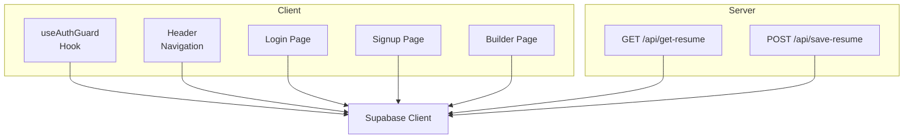
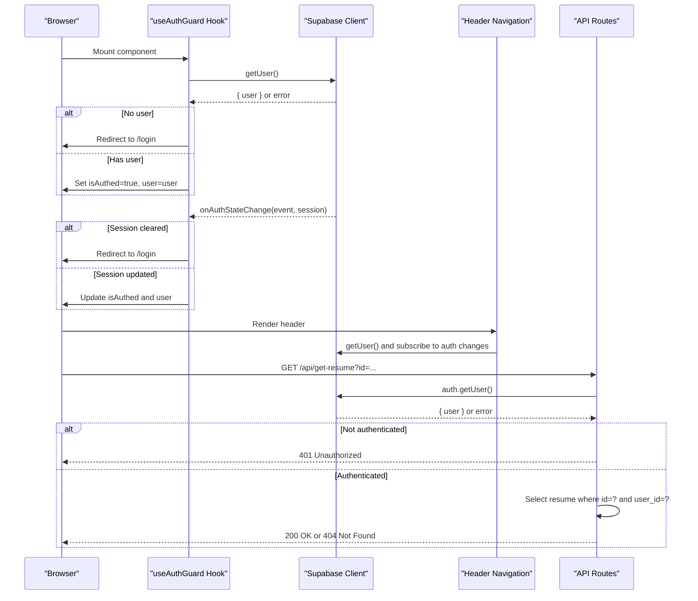
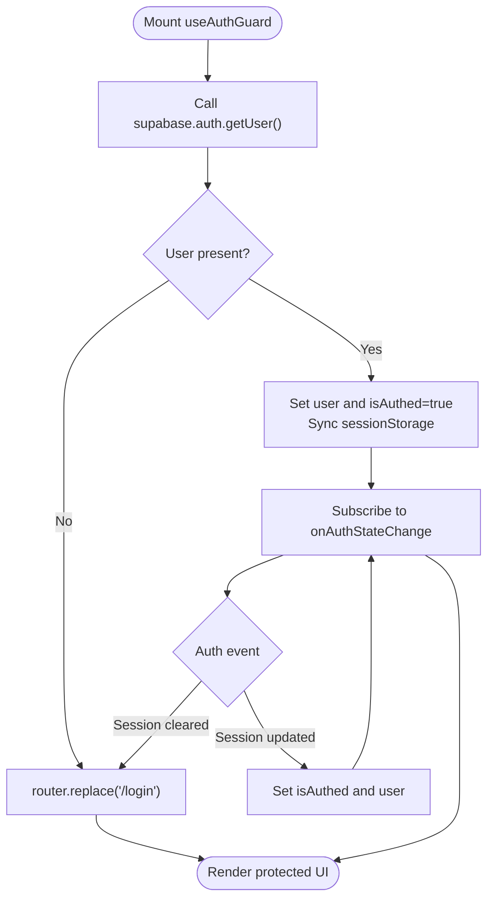
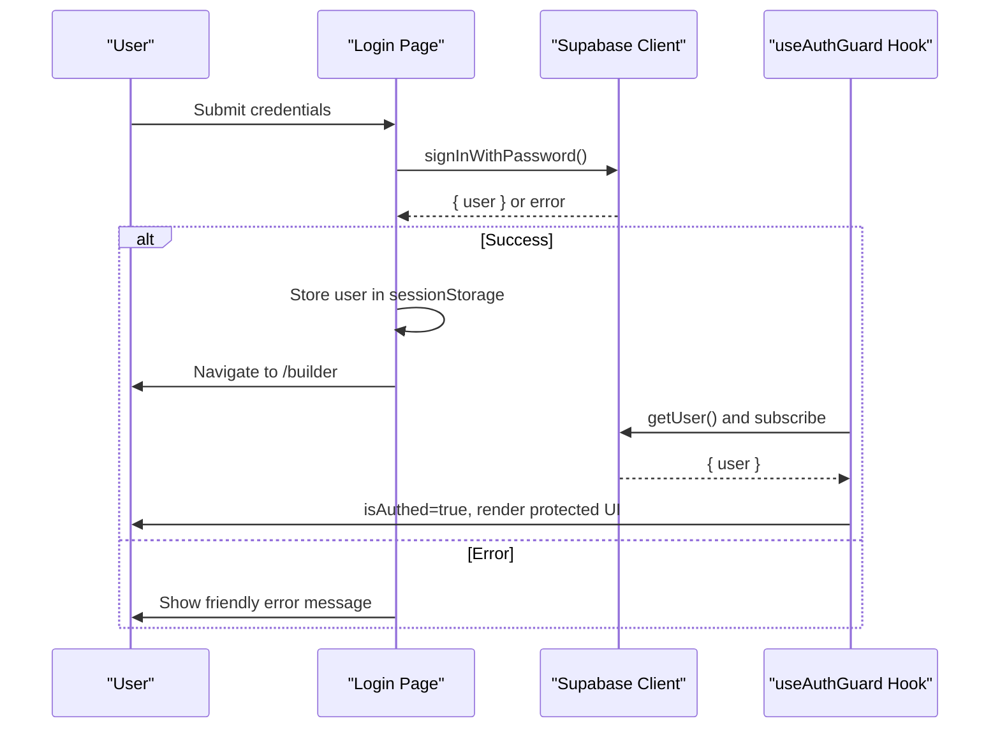
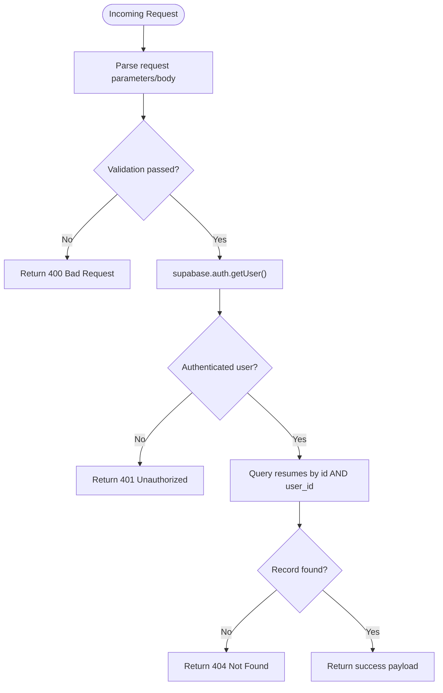
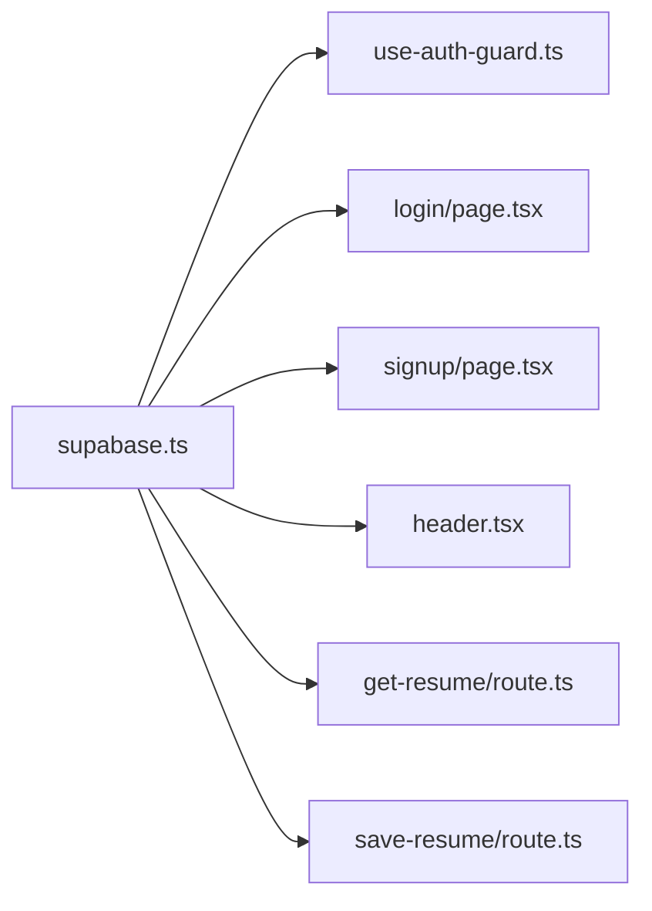

# Authentication and Authorization

<cite>
**Referenced Files in This Document**
- [use-auth-guard.ts](file://src/hooks/use-auth-guard.ts)
- [supabase.ts](file://src/lib/supabase.ts)
- [types.ts](file://src/lib/types.ts)
- [header.tsx](file://src/components/layout/header.tsx)
- [login/page.tsx](file://src/app/login/page.tsx)
- [signup/page.tsx](file://src/app/signup/page.tsx)
- [builder/page.tsx](file://src/app/builder/page.tsx)
- [get-resume/route.ts](file://src/app/api/get-resume/route.ts)
- [save-resume/route.ts](file://src/app/api/save-resume/route.ts)
</cite>

## Table of Contents
1. [Introduction](#introduction)
2. [Project Structure](#project-structure)
3. [Core Components](#core-components)
4. [Architecture Overview](#architecture-overview)
5. [Detailed Component Analysis](#detailed-component-analysis)
6. [Dependency Analysis](#dependency-analysis)
7. [Performance Considerations](#performance-considerations)
8. [Troubleshooting Guide](#troubleshooting-guide)
9. [Conclusion](#conclusion)
10. [Appendices](#appendices)

## Introduction
This document explains the authentication and authorization system used to protect user data and ensure secure access to resume resources. It covers:
- The client-side authentication guard and route protection mechanism
- Supabase authentication integration for login, signup, and session management
- Token persistence and session synchronization
- Authorization patterns for protecting resume data so users can only access their own records
- Practical examples of authentication state management, redirects, and error handling
- Security considerations, session timeout handling, and integration with external providers
- Guidance for role-based access control and extending authentication features

## Project Structure
The authentication and authorization system spans client hooks, UI pages, and server-side API routes:
- Client-side guard and session sync
- Supabase client configuration and session persistence
- Login and signup pages using Supabase auth
- Protected builder page and shared header that reacts to auth state
- API routes validating authenticated users and enforcing ownership of resume data

**Diagram sources**
- [use-auth-guard.ts:11-56](file://src/hooks/use-auth-guard.ts#L11-L56)
- [header.tsx:12-32](file://src/components/layout/header.tsx#L12-L32)
- [login/page.tsx:12-55](file://src/app/login/page.tsx#L12-L55)
- [signup/page.tsx:12-72](file://src/app/signup/page.tsx#L12-L72)
- [builder/page.tsx:70-78](file://src/app/builder/page.tsx#L70-L78)
- [get-resume/route.ts:10-57](file://src/app/api/get-resume/route.ts#L10-L57)
- [save-resume/route.ts:31-82](file://src/app/api/save-resume/route.ts#L31-L82)
- [supabase.ts:10-25](file://src/lib/supabase.ts#L10-L25)

**Section sources**
- [use-auth-guard.ts:11-56](file://src/hooks/use-auth-guard.ts#L11-L56)
- [supabase.ts:10-25](file://src/lib/supabase.ts#L10-L25)
- [header.tsx:12-32](file://src/components/layout/header.tsx#L12-L32)
- [login/page.tsx:12-55](file://src/app/login/page.tsx#L12-L55)
- [signup/page.tsx:12-72](file://src/app/signup/page.tsx#L12-L72)
- [builder/page.tsx:70-78](file://src/app/builder/page.tsx#L70-L78)
- [get-resume/route.ts:10-57](file://src/app/api/get-resume/route.ts#L10-L57)
- [save-resume/route.ts:31-82](file://src/app/api/save-resume/route.ts#L31-L82)

## Core Components
- Authentication guard hook: Provides client-side route protection and maintains authentication state.
- Supabase client: Configured with automatic token refresh, persisted sessions, and URL session detection.
- Login and signup pages: Implement password-based authentication and manage user redirection and error messaging.
- Header navigation: Displays user-specific actions and reacts to auth state changes.
- API routes: Enforce authentication and ownership checks for resume data.

**Section sources**
- [use-auth-guard.ts:11-56](file://src/hooks/use-auth-guard.ts#L11-L56)
- [supabase.ts:10-25](file://src/lib/supabase.ts#L10-L25)
- [login/page.tsx:12-55](file://src/app/login/page.tsx#L12-L55)
- [signup/page.tsx:12-72](file://src/app/signup/page.tsx#L12-L72)
- [header.tsx:12-32](file://src/components/layout/header.tsx#L12-L32)
- [get-resume/route.ts:24-47](file://src/app/api/get-resume/route.ts#L24-L47)
- [save-resume/route.ts:46-64](file://src/app/api/save-resume/route.ts#L46-L64)

## Architecture Overview
The system integrates client-side route protection with server-side authorization:
- Client initializes Supabase with session persistence and auto-refresh.
- The guard hook checks the current user session and subscribes to auth state changes.
- UI pages trigger Supabase auth operations and synchronize session data.
- API routes validate the presence of an authenticated user and enforce ownership of requested data.

**Diagram sources**
- [use-auth-guard.ts:16-52](file://src/hooks/use-auth-guard.ts#L16-L52)
- [supabase.ts:10-25](file://src/lib/supabase.ts#L10-L25)
- [header.tsx:15-31](file://src/components/layout/header.tsx#L15-L31)
- [get-resume/route.ts:24-47](file://src/app/api/get-resume/route.ts#L24-L47)

## Detailed Component Analysis

### Client-Side Authentication Guard (useAuthGuard)
Responsibilities:
- On mount, fetch the current user and decide whether to redirect to the login page.
- Maintain local authentication state and user identity.
- Subscribe to Supabase auth state changes to keep the UI synchronized.
- Persist a minimal user profile to sessionStorage for backward compatibility.

Behavior highlights:
- Redirects unauthenticated users to the login page.
- Sets internal state when a user is present.
- Subscribes to auth events and updates state accordingly.
- On errors during the initial check, logs a warning and proceeds to render.

**Diagram sources**
- [use-auth-guard.ts:16-52](file://src/hooks/use-auth-guard.ts#L16-L52)

**Section sources**
- [use-auth-guard.ts:11-56](file://src/hooks/use-auth-guard.ts#L11-L56)

### Supabase Client Configuration and Session Management
Key configuration:
- Automatic token refresh and persisted sessions.
- Detection of session in URL fragments.
- Global headers and database schema configuration.
- Development-time session health check.

Implications:
- Sessions persist across browser reloads.
- Tokens refresh automatically to reduce manual re-auth prompts.
- URL-based session handling supports deep links and OAuth callbacks.

**Section sources**
- [supabase.ts:10-25](file://src/lib/supabase.ts#L10-L25)

### Login and Signup Pages
Login:
- Captures email/password, invokes Supabase sign-in, stores a lightweight user profile in sessionStorage, and navigates to the builder.
- Provides user-friendly error messages for network and credential failures.

Signup:
- Registers a new user with optional profile data, auto-signs in the user, persists user info to sessionStorage, and navigates to the builder.
- Provides user-friendly error messages for network, duplicate accounts, and weak passwords.

**Diagram sources**
- [login/page.tsx:19-55](file://src/app/login/page.tsx#L19-L55)
- [use-auth-guard.ts:16-36](file://src/hooks/use-auth-guard.ts#L16-L36)

**Section sources**
- [login/page.tsx:12-55](file://src/app/login/page.tsx#L12-L55)
- [signup/page.tsx:12-72](file://src/app/signup/page.tsx#L12-L72)

### Header Navigation and Auth State Awareness
- Retrieves and displays the current user.
- Subscribes to auth state changes to update the UI immediately upon login/logout.
- Shows either authenticated actions (build resume, logout) or login/sign-up options.

**Section sources**
- [header.tsx:12-32](file://src/components/layout/header.tsx#L12-L32)

### Protected Resume Access: Ownership Enforcement
Authorization pattern:
- Both GET and POST resume APIs require an authenticated user.
- They fetch the current user and compare the user identifier against the record’s owner field.
- Only the owner can access or modify the resume.

**Diagram sources**
- [get-resume/route.ts:10-57](file://src/app/api/get-resume/route.ts#L10-L57)
- [save-resume/route.ts:31-82](file://src/app/api/save-resume/route.ts#L31-L82)

**Section sources**
- [get-resume/route.ts:24-47](file://src/app/api/get-resume/route.ts#L24-L47)
- [save-resume/route.ts:46-64](file://src/app/api/save-resume/route.ts#L46-L64)

### Builder Page and Session Data
- The builder page does not directly depend on the auth guard hook but benefits from the overall session state managed by Supabase and the guard.
- It persists form data to sessionStorage to provide a responsive editing experience.

**Section sources**
- [builder/page.tsx:70-78](file://src/app/builder/page.tsx#L70-L78)

## Dependency Analysis
High-level dependencies:
- The guard hook depends on the Supabase client for user retrieval and auth state subscriptions.
- Login and signup pages depend on Supabase auth methods and redirect logic.
- API routes depend on Supabase auth to validate and retrieve the current user.
- The header depends on Supabase to reflect the current user state.

**Diagram sources**
- [supabase.ts:10-25](file://src/lib/supabase.ts#L10-L25)
- [use-auth-guard.ts:19](file://src/hooks/use-auth-guard.ts#L19)
- [login/page.tsx:25](file://src/app/login/page.tsx#L25)
- [signup/page.tsx:27](file://src/app/signup/page.tsx#L27)
- [header.tsx:18](file://src/components/layout/header.tsx#L18)
- [get-resume/route.ts:25](file://src/app/api/get-resume/route.ts#L25)
- [save-resume/route.ts:47](file://src/app/api/save-resume/route.ts#L47)

**Section sources**
- [supabase.ts:10-25](file://src/lib/supabase.ts#L10-L25)
- [use-auth-guard.ts:19](file://src/hooks/use-auth-guard.ts#L19)
- [login/page.tsx:25](file://src/app/login/page.tsx#L25)
- [signup/page.tsx:27](file://src/app/signup/page.tsx#L27)
- [header.tsx:18](file://src/components/layout/header.tsx#L18)
- [get-resume/route.ts:25](file://src/app/api/get-resume/route.ts#L25)
- [save-resume/route.ts:47](file://src/app/api/save-resume/route.ts#L47)

## Performance Considerations
- Supabase auto-refresh and persisted sessions minimize repeated logins and improve UX.
- Initial auth check is performed once on mount; subsequent updates rely on auth state subscriptions.
- API routes validate inputs early and short-circuit on invalid requests to avoid unnecessary database calls.
- Using sessionStorage for lightweight user profile sync avoids frequent server round-trips.

[No sources needed since this section provides general guidance]

## Troubleshooting Guide
Common scenarios and resolutions:
- Network errors during auth check: The guard logs a warning and continues rendering to avoid blocking the UI.
- Login failures: Friendly messages differentiate network issues, invalid credentials, and other errors.
- Session loss: Auth state changes trigger a redirect to the login page.
- Access denied to resume: API routes return 401 for unauthenticated users and 404 when the record is not owned by the user.

**Section sources**
- [use-auth-guard.ts:32-36](file://src/hooks/use-auth-guard.ts#L32-L36)
- [login/page.tsx:42-54](file://src/app/login/page.tsx#L42-L54)
- [get-resume/route.ts:27-32](file://src/app/api/get-resume/route.ts#L27-L32)
- [save-resume/route.ts:49-54](file://src/app/api/save-resume/route.ts#L49-L54)

## Conclusion
The authentication and authorization system combines a robust client-side guard with Supabase’s session management and server-side ownership checks. Together, they ensure that:
- Users are redirected appropriately when unauthenticated
- Session state remains consistent across the app
- Resume data access is restricted to owners
- Error handling is user-friendly and informative

[No sources needed since this section summarizes without analyzing specific files]

## Appendices

### Practical Examples

- Authentication state management
  - Use the guard hook to gate protected routes and render placeholders until authentication resolves.
  - Reference: [use-auth-guard.ts:11-56](file://src/hooks/use-auth-guard.ts#L11-L56)

- Redirect handling
  - Unauthenticated users are redirected to the login page; successful login redirects to the builder.
  - References:
    - [use-auth-guard.ts:21-23](file://src/hooks/use-auth-guard.ts#L21-L23)
    - [login/page.tsx:40-41](file://src/app/login/page.tsx#L40-L41)

- Error scenarios
  - Network errors during auth checks do not block rendering; login/signup surfaces user-friendly messages.
  - References:
    - [use-auth-guard.ts:32-36](file://src/hooks/use-auth-guard.ts#L32-L36)
    - [login/page.tsx:45-51](file://src/app/login/page.tsx#L45-L51)

- Session timeout handling
  - Auth state subscriptions react to session changes and redirect to the login page when the session is cleared.
  - Reference: [use-auth-guard.ts:42-50](file://src/hooks/use-auth-guard.ts#L42-L50)

- Role-based access control (RBAC) guidance
  - Extend by adding a roles column to the user profile or a dedicated roles table.
  - Enforce roles in API routes alongside ownership checks.
  - Example extension points:
    - Add a roles claim or row in Supabase and validate in API routes similar to ownership checks.
    - Reference patterns:
      - [get-resume/route.ts:34-39](file://src/app/api/get-resume/route.ts#L34-L39)
      - [save-resume/route.ts:56-64](file://src/app/api/save-resume/route.ts#L56-L64)

- Extending authentication features
  - Integrate external providers by enabling them in the Supabase dashboard and relying on Supabase auth methods in pages.
  - Maintain consistent session state by keeping the guard and header subscribed to auth changes.
  - References:
    - [supabase.ts:10-25](file://src/lib/supabase.ts#L10-L25)
    - [header.tsx:27-29](file://src/components/layout/header.tsx#L27-L29)