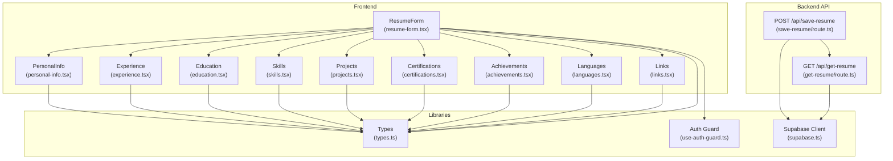
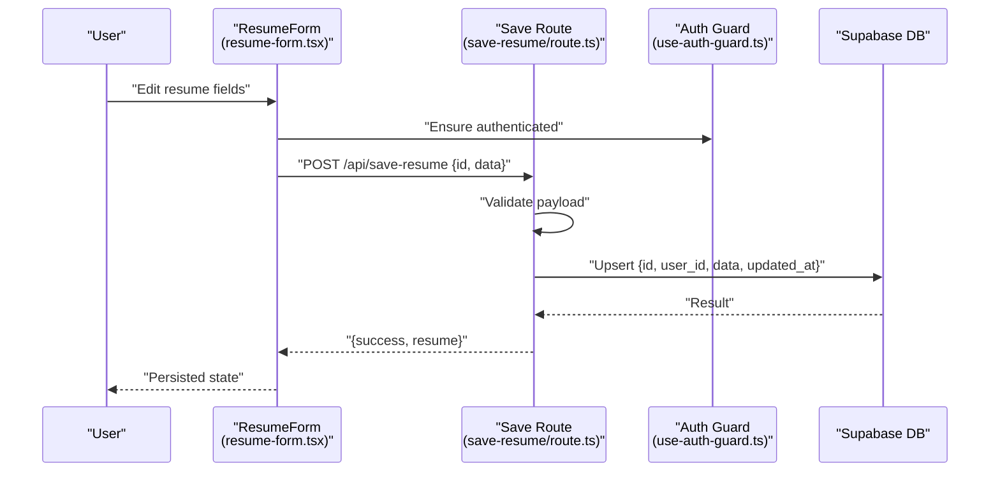
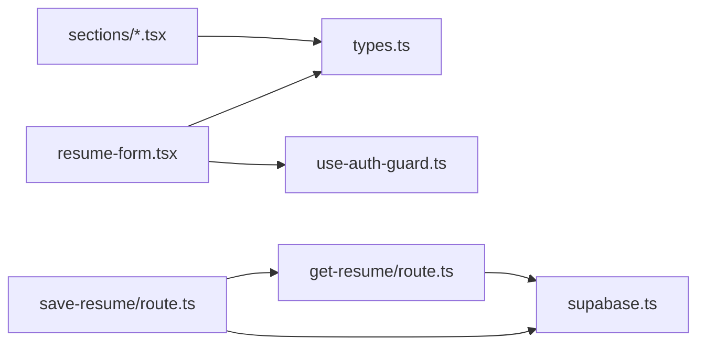

# Data Management System

<cite>
**Referenced Files in This Document**
- [types.ts](file://src/lib/types.ts)
- [supabase.ts](file://src/lib/supabase.ts)
- [route.ts](file://src/app/api/get-resume/route.ts)
- [route.ts](file://src/app/api/save-resume/route.ts)
- [use-auth-guard.ts](file://src/hooks/use-auth-guard.ts)
- [resume-form.tsx](file://src/components/resume/resume-form.tsx)
- [personal-info.tsx](file://src/components/resume/personal-info.tsx)
- [experience.tsx](file://src/components/resume/experience.tsx)
- [education.tsx](file://src/components/resume/education.tsx)
- [skills.tsx](file://src/components/resume/skills.tsx)
- [projects.tsx](file://src/components/resume/projects.tsx)
- [certifications.tsx](file://src/components/resume/certifications.tsx)
- [achievements.tsx](file://src/components/resume/achievements.tsx)
- [languages.tsx](file://src/components/resume/languages.tsx)
- [links.tsx](file://src/components/resume/links.tsx)
</cite>

## Table of Contents
1. [Introduction](#introduction)
2. [Project Structure](#project-structure)
3. [Core Components](#core-components)
4. [Architecture Overview](#architecture-overview)
5. [Detailed Component Analysis](#detailed-component-analysis)
6. [Dependency Analysis](#dependency-analysis)
7. [Performance Considerations](#performance-considerations)
8. [Troubleshooting Guide](#troubleshooting-guide)
9. [Conclusion](#conclusion)
10. [Appendices](#appendices)

## Introduction
This document explains the data management system of the resume builder application. It covers the TypeScript interfaces that define the resume data model, React hooks for state management, Supabase integration for authentication and persistence, and the serverless API endpoints for saving and retrieving resume data. It also documents validation patterns, synchronization strategies, and guidance for extending the data model with new sections.

## Project Structure
The data management system spans three layers:
- Data model and utilities: TypeScript interfaces and initial data shape
- Frontend state and forms: React components that manage local state and persist via API
- Backend API and persistence: Next.js routes that validate requests, enforce auth, and interact with Supabase

**Diagram sources**
- [resume-form.tsx:1-84](file://src/components/resume/resume-form.tsx#L1-L84)
- [personal-info.tsx:1-118](file://src/components/resume/personal-info.tsx#L1-L118)
- [experience.tsx:1-113](file://src/components/resume/experience.tsx#L1-L113)
- [education.tsx:1-112](file://src/components/resume/education.tsx#L1-L112)
- [skills.tsx:1-72](file://src/components/resume/skills.tsx#L1-L72)
- [projects.tsx:1-118](file://src/components/resume/projects.tsx#L1-L118)
- [certifications.tsx:1-67](file://src/components/resume/certifications.tsx#L1-L67)
- [achievements.tsx:1-63](file://src/components/resume/achievements.tsx#L1-L63)
- [languages.tsx:1-74](file://src/components/resume/languages.tsx#L1-L74)
- [links.tsx:1-74](file://src/components/resume/links.tsx#L1-L74)
- [types.ts:1-103](file://src/lib/types.ts#L1-L103)
- [supabase.ts:1-11](file://src/lib/supabase.ts#L1-L11)
- [use-auth-guard.ts:1-50](file://src/hooks/use-auth-guard.ts#L1-L50)
- [route.ts:1-52](file://src/app/api/save-resume/route.ts#L1-L52)
- [route.ts:1-50](file://src/app/api/get-resume/route.ts#L1-L50)

**Section sources**
- [types.ts:1-103](file://src/lib/types.ts#L1-L103)
- [supabase.ts:1-11](file://src/lib/supabase.ts#L1-L11)
- [route.ts:1-52](file://src/app/api/save-resume/route.ts#L1-L52)
- [route.ts:1-50](file://src/app/api/get-resume/route.ts#L1-L50)
- [use-auth-guard.ts:1-50](file://src/hooks/use-auth-guard.ts#L1-L50)
- [resume-form.tsx:1-84](file://src/components/resume/resume-form.tsx#L1-L84)

## Core Components
- TypeScript interfaces define the resume data model with typed fields for personal information, work experience, education, skills, projects, certifications, achievements, languages, and links. An initial data shape is provided for default state.
- Supabase client encapsulates environment-based configuration for the public URL and anonymous key.
- Next.js API routes implement save and get operations with authentication checks and database upsert/select against a resumes table.
- React hooks provide an authentication guard that redirects unauthenticated users and synchronizes session state.
- Form components manage local state updates and delegate persistence to the backend via API calls.

Key responsibilities:
- Types: Define schema and defaults
- Supabase: Provide client connection
- API Routes: Enforce auth, validate payload, persist/retrieve data
- Hooks: Manage auth state and redirect
- Components: Editable forms with inline validation and state updates

**Section sources**
- [types.ts:1-103](file://src/lib/types.ts#L1-L103)
- [supabase.ts:1-11](file://src/lib/supabase.ts#L1-L11)
- [route.ts:1-52](file://src/app/api/save-resume/route.ts#L1-L52)
- [route.ts:1-50](file://src/app/api/get-resume/route.ts#L1-L50)
- [use-auth-guard.ts:1-50](file://src/hooks/use-auth-guard.ts#L1-L50)
- [resume-form.tsx:1-84](file://src/components/resume/resume-form.tsx#L1-L84)

## Architecture Overview
The system follows a client-state + server-persistence pattern:
- Client-side React components maintain local state and call Next.js API endpoints.
- API routes validate inputs, enforce authentication, and interact with Supabase.
- Supabase stores resume data per user with a single record identified by a resume id.

**Diagram sources**
- [resume-form.tsx:1-84](file://src/components/resume/resume-form.tsx#L1-L84)
- [route.ts:1-52](file://src/app/api/save-resume/route.ts#L1-L52)
- [use-auth-guard.ts:1-50](file://src/hooks/use-auth-guard.ts#L1-L50)

**Section sources**
- [route.ts:1-52](file://src/app/api/save-resume/route.ts#L1-L52)
- [route.ts:1-50](file://src/app/api/get-resume/route.ts#L1-L50)
- [use-auth-guard.ts:1-50](file://src/hooks/use-auth-guard.ts#L1-L50)

## Detailed Component Analysis

### TypeScript Interfaces and Initial Data
The resume data model is defined by strongly typed interfaces:
- PersonalInfo: name, contact details, profiles, summary
- Experience: company, role, dates, description
- Education: institution, degree, dates, description
- Skill: name
- Project: title, link, description
- Certification: name, issuer, date, url
- Achievement: title, description
- Language: language, proficiency level
- Link: label, url
- ResumeData: aggregates all sections and initial empty arrays/default values

Validation patterns:
- Projects component enforces title length and character filtering.
- Proficiency and link label fields are constrained via controlled selects.

Extensibility:
- New sections follow the same pattern: define an interface, add to ResumeData, create a component, and wire into ResumeForm.

**Section sources**
- [types.ts:1-103](file://src/lib/types.ts#L1-L103)
- [projects.tsx:60-87](file://src/components/resume/projects.tsx#L60-L87)
- [languages.tsx:9](file://src/components/resume/languages.tsx#L9)
- [links.tsx:9](file://src/components/resume/links.tsx#L9)

### State Management with React Hooks and Components
ResumeForm composes individual sections and passes down typed data and update callbacks. Each section component:
- Manages its own list state locally
- Generates unique ids using random identifiers
- Updates parent state via a callback prop
- Provides add/remove controls and inline validation

Patterns:
- Local state mutation via map/filter
- Controlled inputs with immediate updates
- Inline UX feedback (e.g., title length indicator)

**Section sources**
- [resume-form.tsx:14-83](file://src/components/resume/resume-form.tsx#L14-L83)
- [experience.tsx:15-39](file://src/components/resume/experience.tsx#L15-L39)
- [education.tsx:15-38](file://src/components/resume/education.tsx#L15-L38)
- [skills.tsx:13-32](file://src/components/resume/skills.tsx#L13-L32)
- [projects.tsx:15-36](file://src/components/resume/projects.tsx#L15-L36)
- [certifications.tsx:14-21](file://src/components/resume/certifications.tsx#L14-L21)
- [achievements.tsx:15-22](file://src/components/resume/achievements.tsx#L15-L22)
- [languages.tsx:16-23](file://src/components/resume/languages.tsx#L16-L23)
- [links.tsx:16-23](file://src/components/resume/links.tsx#L16-L23)

### Authentication Guard
The hook:
- Checks current user session
- Redirects to login if not authenticated
- Subscribes to auth state changes and updates internal state
- Synchronizes a legacy session key for backward compatibility

Integration:
- Components can require authentication by invoking the hook and rendering conditionally.

**Section sources**
- [use-auth-guard.ts:10-49](file://src/hooks/use-auth-guard.ts#L10-L49)

### API Endpoints: Save and Retrieve Resume Data
Save endpoint:
- Validates presence of id and data
- Requires authenticated user
- Upserts a record with id, user_id, data, and updated timestamp
- Returns the persisted record

Get endpoint:
- Validates presence of id
- Requires authenticated user
- Selects a single record filtered by id and user_id
- Returns success with data or appropriate error

Error handling:
- Explicit 400/401/404/500 responses
- Logging of errors for diagnostics

**Section sources**
- [route.ts:1-52](file://src/app/api/save-resume/route.ts#L1-L52)
- [route.ts:1-50](file://src/app/api/get-resume/route.ts#L1-L50)

### Data Validation Patterns
Inline validations observed:
- Projects title length limit and sanitization
- Projects title disallows triple-dash sequences
- Languages and Links use predefined option sets

Recommendations:
- Centralize validation rules in shared utilities
- Add schema validation (e.g., Zod) for server-side enforcement
- Normalize inputs (lowercase, trimming) consistently

**Section sources**
- [projects.tsx:67-84](file://src/components/resume/projects.tsx#L67-L84)
- [languages.tsx:9](file://src/components/resume/languages.tsx#L9)
- [links.tsx:9](file://src/components/resume/links.tsx#L9)

### Data Persistence Strategies with Supabase
Persistence model:
- Single record per resume identified by id
- Upsert ensures creation/update under the authenticated user
- Timestamp updated on each save

Data shape:
- id: resume identifier
- user_id: authenticated user association
- data: serialized ResumeData object
- updated_at: last modified timestamp

Security:
- Access restricted by user_id in both save and get routes

**Section sources**
- [route.ts:25-33](file://src/app/api/save-resume/route.ts#L25-L33)
- [route.ts:26-31](file://src/app/api/get-resume/route.ts#L26-L31)

### Data Lifecycle Management
Lifecycle stages:
- Creation: Initialize ResumeData with empty arrays and defaults
- Editing: Local state updates in components
- Saving: Send id and data to save endpoint
- Loading: Fetch by id with auth guard
- Updating: Subsequent saves overwrite existing record

Offline capabilities:
- Current implementation requires network connectivity
- To add offline support, integrate a client cache (e.g., IndexedDB) and sync queue

Export/Import:
- Export: Serialize ResumeData to JSON
- Import: Deserialize JSON into ResumeData and save via API

**Section sources**
- [types.ts:81-101](file://src/lib/types.ts#L81-L101)
- [route.ts:6](file://src/app/api/save-resume/route.ts#L6)
- [route.ts:7](file://src/app/api/get-resume/route.ts#L7)

### Practical Examples

- Saving resume data
  - Trigger save from ResumeForm after edits
  - Payload includes id and data
  - Handle response and show user feedback

- Retrieving resume data
  - Call get endpoint with id
  - Ensure user is authenticated before loading

- Adding a new section
  - Define interface and add to ResumeData
  - Create component with add/remove/update handlers
  - Wire into ResumeForm

- Form validation
  - Use controlled inputs and inline checks
  - Enforce constraints in components and normalize data

- Error handling
  - Catch and display user-friendly messages
  - Log server errors for debugging

**Section sources**
- [resume-form.tsx:19-82](file://src/components/resume/resume-form.tsx#L19-L82)
- [route.ts:4-13](file://src/app/api/save-resume/route.ts#L4-L13)
- [route.ts:6](file://src/app/api/get-resume/route.ts#L6)
- [projects.tsx:67-84](file://src/components/resume/projects.tsx#L67-L84)

## Dependency Analysis
The system exhibits clear separation of concerns:
- Components depend on types and update callbacks
- API routes depend on Supabase client and auth
- Auth guard depends on Supabase auth state
- Supabase client depends on environment variables

**Diagram sources**
- [types.ts:1-103](file://src/lib/types.ts#L1-L103)
- [supabase.ts:1-11](file://src/lib/supabase.ts#L1-L11)
- [use-auth-guard.ts:1-50](file://src/hooks/use-auth-guard.ts#L1-L50)
- [route.ts:1-52](file://src/app/api/save-resume/route.ts#L1-L52)
- [route.ts:1-50](file://src/app/api/get-resume/route.ts#L1-L50)
- [resume-form.tsx:1-84](file://src/components/resume/resume-form.tsx#L1-L84)

**Section sources**
- [types.ts:1-103](file://src/lib/types.ts#L1-L103)
- [supabase.ts:1-11](file://src/lib/supabase.ts#L1-L11)
- [route.ts:1-52](file://src/app/api/save-resume/route.ts#L1-L52)
- [route.ts:1-50](file://src/app/api/get-resume/route.ts#L1-L50)
- [use-auth-guard.ts:1-50](file://src/hooks/use-auth-guard.ts#L1-L50)
- [resume-form.tsx:1-84](file://src/components/resume/resume-form.tsx#L1-L84)

## Performance Considerations
- Minimize re-renders by updating only changed subsections
- Debounce frequent updates if needed
- Batch updates when adding multiple items
- Optimize API calls by avoiding redundant saves
- Consider caching recent data to reduce network requests

## Troubleshooting Guide
Common issues and resolutions:
- Authentication failures
  - Ensure user is signed in before saving/loading
  - Verify auth state subscription updates UI state

- Save errors
  - Confirm id and data are present
  - Check Supabase upsert response and logs

- Load errors
  - Validate resume id parameter
  - Confirm user ownership via user_id filter

- Environment configuration
  - Verify NEXT_PUBLIC_SUPABASE_URL and NEXT_PUBLIC_SUPABASE_ANON_KEY are set

**Section sources**
- [use-auth-guard.ts:15-45](file://src/hooks/use-auth-guard.ts#L15-L45)
- [route.ts:8-13](file://src/app/api/save-resume/route.ts#L8-L13)
- [route.ts:9-14](file://src/app/api/get-resume/route.ts#L9-L14)
- [supabase.ts:3-7](file://src/lib/supabase.ts#L3-L7)

## Conclusion
The resume builder’s data management system combines strong typing, component-driven state, and secure Supabase persistence behind simple API endpoints. The modular design allows straightforward extension with new sections, while inline validation and auth guards improve reliability and user experience. Future enhancements can include offline support, robust schema validation, and standardized export/import workflows.

## Appendices

### API Definitions
- POST /api/save-resume
  - Request body: { id: string, data: ResumeData }
  - Response: { success: boolean, resume: any }
  - Status codes: 400 (invalid payload), 401 (unauthorized), 500 (server error)

- GET /api/get-resume?id=...
  - Query param: id (required)
  - Response: { success: boolean, resume: any }
  - Status codes: 400 (missing id), 401 (unauthorized), 404 (not found), 500 (server error)

**Section sources**
- [route.ts:4-13](file://src/app/api/save-resume/route.ts#L4-L13)
- [route.ts:6](file://src/app/api/get-resume/route.ts#L6)
- [route.ts:9-14](file://src/app/api/get-resume/route.ts#L9-L14)

### Extending the Data Model
Steps to add a new section:
1. Define a new interface in types.ts
2. Add the property to ResumeData
3. Provide an initial value in initialResumeData
4. Create a new component with add/remove/update handlers
5. Render the component in ResumeForm
6. Ensure the save endpoint persists the new property automatically

**Section sources**
- [types.ts:69-101](file://src/lib/types.ts#L69-L101)
- [resume-form.tsx:19-82](file://src/components/resume/resume-form.tsx#L19-L82)