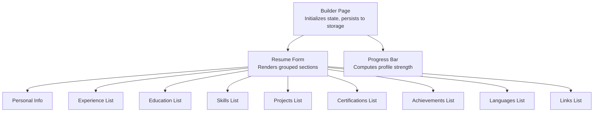
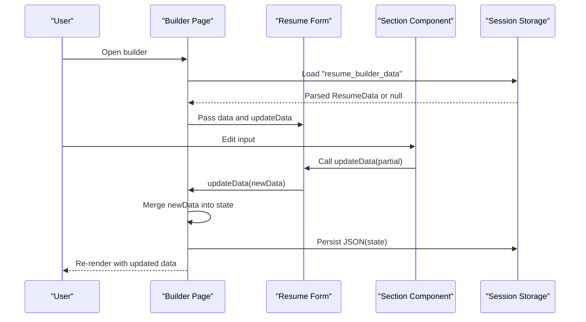
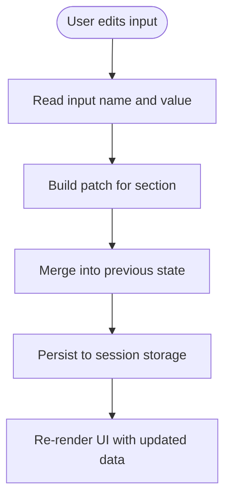
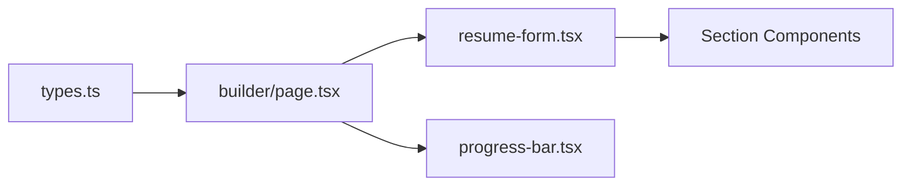

# State Management and Data Validation

<cite>
**Referenced Files in This Document**
- [page.tsx](file://src/app/builder/page.tsx)
- [resume-form.tsx](file://src/components/resume/resume-form.tsx)
- [types.ts](file://src/lib/types.ts)
- [personal-info.tsx](file://src/components/resume/personal-info.tsx)
- [experience.tsx](file://src/components/resume/experience.tsx)
- [education.tsx](file://src/components/resume/education.tsx)
- [skills.tsx](file://src/components/resume/skills.tsx)
- [projects.tsx](file://src/components/resume/projects.tsx)
- [certifications.tsx](file://src/components/resume/certifications.tsx)
- [achievements.tsx](file://src/components/resume/achievements.tsx)
- [languages.tsx](file://src/components/resume/languages.tsx)
- [links.tsx](file://src/components/resume/links.tsx)
- [progress-bar.tsx](file://src/components/resume/progress-bar.tsx)
</cite>

## Table of Contents
1. [Introduction](#introduction)
2. [Project Structure](#project-structure)
3. [Core Components](#core-components)
4. [Architecture Overview](#architecture-overview)
5. [Detailed Component Analysis](#detailed-component-analysis)
6. [Dependency Analysis](#dependency-analysis)
7. [Performance Considerations](#performance-considerations)
8. [Troubleshooting Guide](#troubleshooting-guide)
9. [Conclusion](#conclusion)

## Introduction
This document explains the state management and data validation systems used in the resume builder. It focuses on how React hooks manage resume data state, how form components update nested structures, and how client-side validation and user feedback are implemented. It also covers performance strategies for large datasets, debouncing, and memory management, along with guidance for extending validation patterns and integrating external validation libraries.

## Project Structure
The resume builder is organized around a central builder page that initializes and persists resume data, and a set of modular form components that render and mutate specific parts of the ResumeData structure. A progress indicator computes a profile strength score based on the completeness and quality of the data.

**Diagram sources**
- [page.tsx:11-78](file://src/app/builder/page.tsx#L11-L78)
- [resume-form.tsx:19-82](file://src/components/resume/resume-form.tsx#L19-L82)
- [progress-bar.tsx:11-72](file://src/components/resume/progress-bar.tsx#L11-L72)

**Section sources**
- [page.tsx:11-78](file://src/app/builder/page.tsx#L11-L78)
- [resume-form.tsx:19-82](file://src/components/resume/resume-form.tsx#L19-L82)

## Core Components
- Central state container: The builder page initializes ResumeData from session storage and persists changes back to it. Updates are applied via a partial updater that merges new data into the previous state.
- Form composition: The ResumeForm component composes multiple specialized sections, each responsible for a domain area (personal info, experience, education, skills, projects, certifications, achievements, languages, links).
- Data model: ResumeData and its subsections are defined in a single TypeScript module, ensuring strong typing across the application.

Key patterns:
- useState with lazy initialization to avoid unnecessary setState in useEffect.
- useEffect to persist data to session storage whenever the state changes.
- updateData function that accepts Partial<ResumeData> and merges it into the current state.
- Each section receives typed data and a typed updater to modify only its portion of the ResumeData.

**Section sources**
- [page.tsx:17-36](file://src/app/builder/page.tsx#L17-L36)
- [types.ts:69-101](file://src/lib/types.ts#L69-L101)
- [resume-form.tsx:14-17](file://src/components/resume/resume-form.tsx#L14-L17)

## Architecture Overview
The state lifecycle follows a predictable flow: initialize from persisted storage, propagate data down to form sections, apply updates locally, and persist back to storage. Progress feedback is computed reactively from the current state.

**Diagram sources**
- [page.tsx:17-36](file://src/app/builder/page.tsx#L17-L36)
- [resume-form.tsx:30-36](file://src/components/resume/resume-form.tsx#L30-L36)

## Detailed Component Analysis

### State Initialization and Persistence
- Lazy initialization: The state is initialized by parsing session storage on mount. If parsing fails, defaults are used.
- Persistence: A useEffect hook serializes the current state to session storage whenever the state changes.
- Updater: A memoized updateData merges incoming partial data into the previous state to maintain immutability.

Practical example paths:
- [Initialize state from session storage:17-27](file://src/app/builder/page.tsx#L17-L27)
- [Persist to session storage on change:29-32](file://src/app/builder/page.tsx#L29-L32)
- [Partial merge updater:34-36](file://src/app/builder/page.tsx#L34-L36)

**Section sources**
- [page.tsx:17-36](file://src/app/builder/page.tsx#L17-L36)

### Form Sections and Data Transformation
Each section manages its own slice of ResumeData and exposes a typed update function. The ResumeForm composes these sections and wires their updates back to the central state.

Patterns:
- Personal info: Single record updates via a generic handler that reads the input name and value.
- Lists: Arrays of records with add, update, and remove operations keyed by id.
- Controlled inputs: All inputs are controlled; values reflect the current state.

Example paths:
- [Compose sections and pass typed props:28-79](file://src/components/resume/resume-form.tsx#L28-L79)
- [Personal info controlled inputs:14-16](file://src/components/resume/personal-info.tsx#L14-L16)
- [Experience list CRUD:17-39](file://src/components/resume/experience.tsx#L17-L39)
- [Education list CRUD:16-38](file://src/components/resume/education.tsx#L16-L38)
- [Skills list CRUD:14-32](file://src/components/resume/skills.tsx#L14-L32)
- [Projects list with inline validation:67-84](file://src/components/resume/projects.tsx#L67-L84)
- [Certifications list CRUD:15-21](file://src/components/resume/certifications.tsx#L15-L21)
- [Achievements list CRUD:16-22](file://src/components/resume/achievements.tsx#L16-L22)
- [Languages list with select options:17-23](file://src/components/resume/languages.tsx#L17-L23)
- [Links list with predefined labels:17-23](file://src/components/resume/links.tsx#L17-L23)

**Section sources**
- [resume-form.tsx:19-82](file://src/components/resume/resume-form.tsx#L19-L82)
- [personal-info.tsx:14-16](file://src/components/resume/personal-info.tsx#L14-L16)
- [experience.tsx:17-39](file://src/components/resume/experience.tsx#L17-L39)
- [education.tsx:16-38](file://src/components/resume/education.tsx#L16-L38)
- [skills.tsx:14-32](file://src/components/resume/skills.tsx#L14-L32)
- [projects.tsx:67-84](file://src/components/resume/projects.tsx#L67-L84)
- [certifications.tsx:15-21](file://src/components/resume/certifications.tsx#L15-L21)
- [achievements.tsx:16-22](file://src/components/resume/achievements.tsx#L16-L22)
- [languages.tsx:17-23](file://src/components/resume/languages.tsx#L17-L23)
- [links.tsx:17-23](file://src/components/resume/links.tsx#L17-L23)

### Data Model and Type Safety
ResumeData and its subsections define the canonical shape of the resume data. This ensures that:
- All updates conform to the expected structure.
- Consumers receive strongly typed props.
- The initial state is consistent and complete.

Example paths:
- [ResumeData interface:69-79](file://src/lib/types.ts#L69-L79)
- [Initial ResumeData:81-101](file://src/lib/types.ts#L81-L101)

**Section sources**
- [types.ts:69-101](file://src/lib/types.ts#L69-L101)

### Validation Strategies and User Feedback
Client-side validation is implemented directly in the components:

- Projects: Inline validation transforms input to enforce lowercase, length limits, allowed characters, and disallowed triple-dash sequences. Real-time feedback is shown via character counters and visual emphasis when limits are reached.
- Personal info: Controlled inputs with native HTML types (e.g., email) and placeholders guide accurate input.
- Lists: Add/remove operations enable incremental growth; empty states provide clear guidance.

Example paths:
- [Projects inline validation and feedback:67-87](file://src/components/resume/projects.tsx#L67-L87)
- [Personal info controlled inputs:24-112](file://src/components/resume/personal-info.tsx#L24-L112)

Error handling and user feedback:
- Session storage parsing errors are caught and logged; defaults are used to keep the app functional.
- Empty list states show friendly messages to encourage adding entries.

Example paths:
- [Catch parsing errors and fallback:20-25](file://src/app/builder/page.tsx#L20-L25)
- [Empty states in lists:104-108](file://src/components/resume/experience.tsx#L104-L108)

**Section sources**
- [projects.tsx:67-87](file://src/components/resume/projects.tsx#L67-L87)
- [personal-info.tsx:24-112](file://src/components/resume/personal-info.tsx#L24-L112)
- [page.tsx:20-25](file://src/app/builder/page.tsx#L20-L25)
- [experience.tsx:104-108](file://src/components/resume/experience.tsx#L104-L108)

### Progress Tracking and Quality Signals
The progress bar computes a profile strength score based on:
- Completeness thresholds for basic info, summary, experience, education, skills, and projects.
- Quality signals such as minimum lengths for summary and experience descriptions.

Example paths:
- [Compute score and render progress bar:14-45](file://src/components/resume/progress-bar.tsx#L14-L45)

**Section sources**
- [progress-bar.tsx:11-72](file://src/components/resume/progress-bar.tsx#L11-L72)

### Data Flow Between Inputs and ResumeData
The flow is unidirectional: inputs update local state slices, which are merged into the central ResumeData and persisted.

**Diagram sources**
- [page.tsx:34-36](file://src/app/builder/page.tsx#L34-L36)
- [resume-form.tsx:30-36](file://src/components/resume/resume-form.tsx#L30-L36)

## Dependency Analysis
The builder page depends on:
- Types for ResumeData and initial state.
- ResumeForm to orchestrate sections.
- Progress bar to compute and display strength metrics.

ResumeForm depends on:
- Individual section components for rendering and updating their respective slices.

**Diagram sources**
- [types.ts:69-101](file://src/lib/types.ts#L69-L101)
- [page.tsx:1-10](file://src/app/builder/page.tsx#L1-L10)
- [resume-form.tsx:1-12](file://src/components/resume/resume-form.tsx#L1-L12)
- [progress-bar.tsx:1-9](file://src/components/resume/progress-bar.tsx#L1-L9)

**Section sources**
- [types.ts:69-101](file://src/lib/types.ts#L69-L101)
- [page.tsx:1-10](file://src/app/builder/page.tsx#L1-L10)
- [resume-form.tsx:1-12](file://src/components/resume/resume-form.tsx#L1-L12)
- [progress-bar.tsx:1-9](file://src/components/resume/progress-bar.tsx#L1-L9)

## Performance Considerations
- Minimize re-renders:
  - Keep state granular by passing only the relevant slice to each section.
  - Use React’s built-in memoization by avoiding unnecessary prop object churn.
- Persist efficiently:
  - Persist to session storage after user-driven changes, not on every keystroke.
- Large lists:
  - Virtualize long lists if they grow substantially (not currently implemented).
- Debouncing:
  - For expensive validations or remote checks, debounce input handlers to reduce computation frequency.
- Memory management:
  - Avoid storing large binary attachments in session storage; keep only structured text data.
  - Clear or prune old entries when lists become very large.
- Rendering:
  - Use CSS transitions for progress bars and avoid heavy computations in render paths.

[No sources needed since this section provides general guidance]

## Troubleshooting Guide
Common issues and resolutions:
- State not persisting:
  - Verify session storage is enabled and accessible in the browser.
  - Confirm the persistence effect runs after state updates.
  - Example path: [Persistence effect:29-32](file://src/app/builder/page.tsx#L29-L32)
- Corrupted saved data:
  - Catch parsing errors and fall back to initial state.
  - Example path: [Fallback on parse failure:20-25](file://src/app/builder/page.tsx#L20-L25)
- Unexpected state resets:
  - Ensure the initializer does not re-run unnecessarily; rely on lazy initialization.
  - Example path: [Lazy initializer:17-27](file://src/app/builder/page.tsx#L17-L27)
- Validation not applying:
  - Confirm inline validators are attached to the correct inputs and fields.
  - Example path: [Projects inline validator:67-84](file://src/components/resume/projects.tsx#L67-L84)
- Excessive re-renders:
  - Verify each section receives only its slice and that parent updates are minimal.
  - Example path: [Section update wiring:30-36](file://src/components/resume/resume-form.tsx#L30-L36)

**Section sources**
- [page.tsx:20-25](file://src/app/builder/page.tsx#L20-L25)
- [page.tsx:29-32](file://src/app/builder/page.tsx#L29-L32)
- [page.tsx:17-27](file://src/app/builder/page.tsx#L17-L27)
- [resume-form.tsx:30-36](file://src/components/resume/resume-form.tsx#L30-L36)
- [projects.tsx:67-84](file://src/components/resume/projects.tsx#L67-L84)

## Conclusion
The resume builder employs a clean, type-safe state management pattern centered on a single source of truth for ResumeData. Form sections encapsulate their own validation and updates, enabling modularity and maintainability. The progress indicator provides immediate feedback on completion and quality. With targeted performance improvements—such as debouncing, virtualization for large lists, and careful persistence—the system can scale effectively while maintaining a responsive user experience.