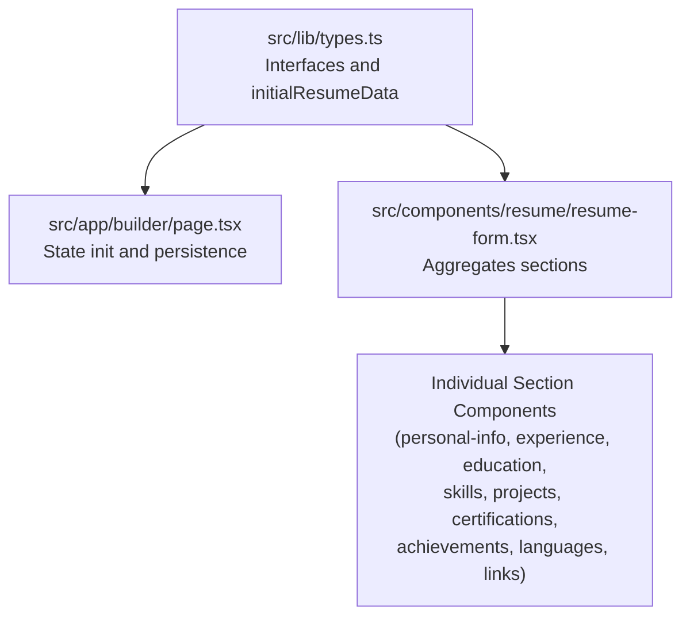
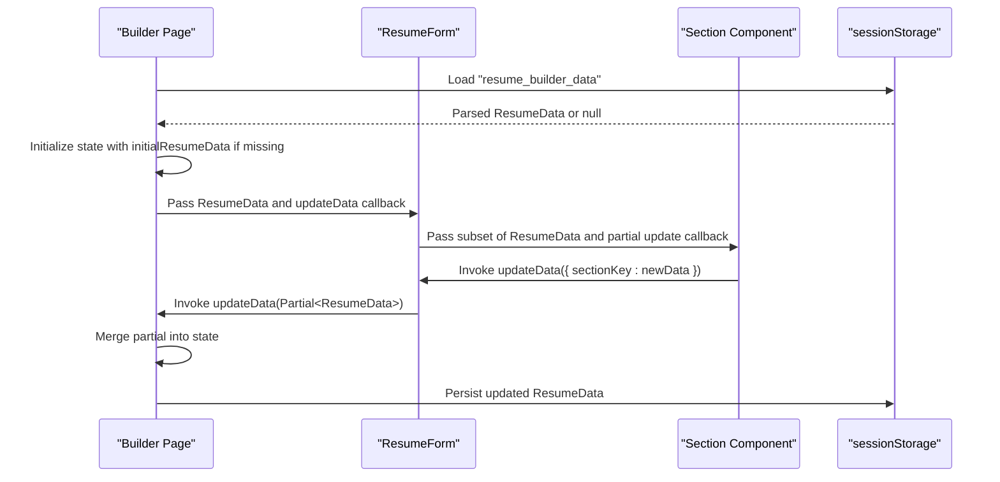
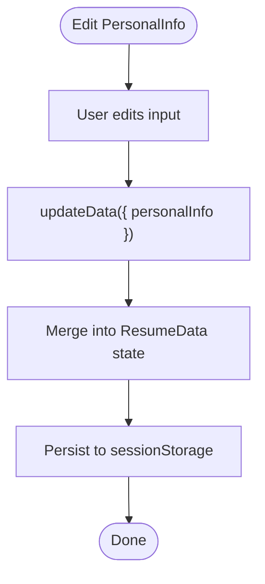
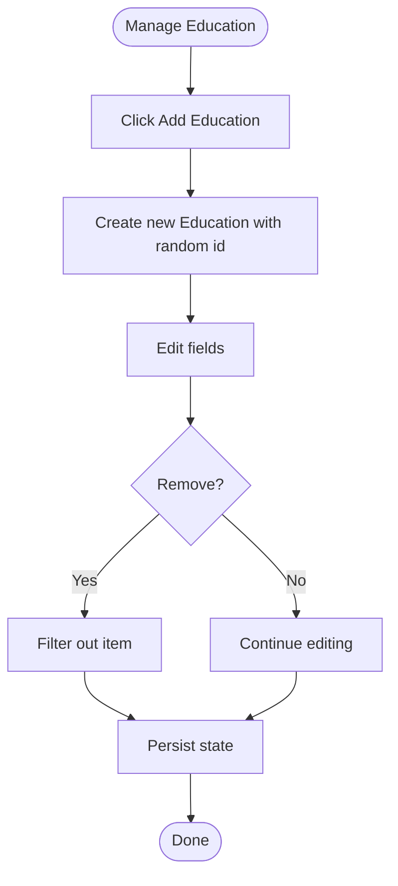
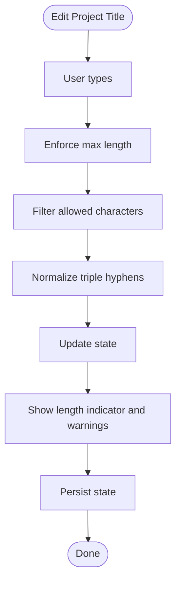
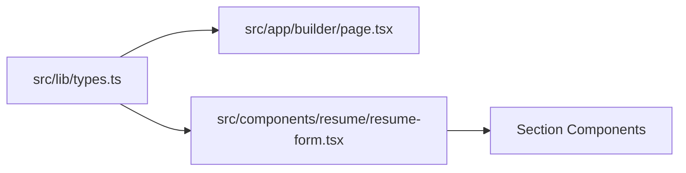

# TypeScript Data Models

<cite>
**Referenced Files in This Document**
- [types.ts](file://src/lib/types.ts)
- [page.tsx](file://src/app/builder/page.tsx)
- [resume-form.tsx](file://src/components/resume/resume-form.tsx)
- [personal-info.tsx](file://src/components/resume/personal-info.tsx)
- [experience.tsx](file://src/components/resume/experience.tsx)
- [education.tsx](file://src/components/resume/education.tsx)
- [skills.tsx](file://src/components/resume/skills.tsx)
- [projects.tsx](file://src/components/resume/projects.tsx)
- [certifications.tsx](file://src/components/resume/certifications.tsx)
- [achievements.tsx](file://src/components/resume/achievements.tsx)
- [languages.tsx](file://src/components/resume/languages.tsx)
- [links.tsx](file://src/components/resume/links.tsx)
- [route.ts](file://src/app/api/get-resume/route.ts)
</cite>

## Table of Contents
1. [Introduction](#introduction)
2. [Project Structure](#project-structure)
3. [Core Components](#core-components)
4. [Architecture Overview](#architecture-overview)
5. [Detailed Component Analysis](#detailed-component-analysis)
6. [Dependency Analysis](#dependency-analysis)
7. [Performance Considerations](#performance-considerations)
8. [Troubleshooting Guide](#troubleshooting-guide)
9. [Conclusion](#conclusion)
10. [Appendices](#appendices)

## Introduction
This document describes the TypeScript data models that define the resume composition structure in the application. It covers all interface definitions, the composite ResumeData interface, the initial default values, and how these models are used across form components, state management, and API responses. It also outlines validation requirements, relationships between models, and best practices for extending the data model safely.

## Project Structure
The data model definitions live in a single module and are consumed by the builder page, the resume form, and individual subsection components. The builder page initializes state from persisted storage using the shared types and the initial default values.

**Diagram sources**
- [types.ts:1-103](file://src/lib/types.ts#L1-L103)
- [page.tsx:1-79](file://src/app/builder/page.tsx#L1-L79)
- [resume-form.tsx:1-84](file://src/components/resume/resume-form.tsx#L1-L84)

**Section sources**
- [types.ts:1-103](file://src/lib/types.ts#L1-L103)
- [page.tsx:1-79](file://src/app/builder/page.tsx#L1-L79)
- [resume-form.tsx:1-84](file://src/components/resume/resume-form.tsx#L1-L84)

## Core Components
This section documents each interface and the ResumeData composite, including field types, validation requirements, and relationships.

- PersonalInfo
  - Fields: firstName, lastName, jobTitle, email, phone, address, linkedin, website, summary
  - Types: All are strings
  - Validation: None enforced in the model; UI components enforce basic formatting (e.g., email input type)
  - Relationship: Part of ResumeData.personalInfo

- Experience
  - Fields: id (string), company, position, startDate, endDate, description
  - Types: All strings except id
  - Validation: None enforced in the model; UI supports adding/removing entries
  - Relationship: Array under ResumeData.experience

- Education
  - Fields: id, school, degree, startDate, endDate, description
  - Types: All strings except id
  - Validation: None enforced in the model; UI supports adding/removing entries
  - Relationship: Array under ResumeData.education

- Skill
  - Fields: id, name
  - Types: Both strings
  - Validation: None enforced in the model; UI supports adding/removing entries
  - Relationship: Array under ResumeData.skills

- Project
  - Fields: id, title, description, link
  - Types: All strings except id
  - Validation: Title is validated in the UI component with length limits and character filtering
  - Relationship: Array under ResumeData.projects

- Certification
  - Fields: id, name, issuer, date, url
  - Types: All strings except id
  - Validation: None enforced in the model; UI supports adding/removing entries
  - Relationship: Array under ResumeData.certifications

- Achievement
  - Fields: id, title, description
  - Types: All strings except id
  - Validation: None enforced in the model; UI supports adding/removing entries
  - Relationship: Array under ResumeData.achievements

- Language
  - Fields: id, language, proficiency
  - Types: id and language are strings; proficiency is constrained to predefined levels in the UI
  - Validation: Proficiency selection is restricted to a controlled set in the UI
  - Relationship: Array under ResumeData.languages

- Link
  - Fields: id, label, url
  - Types: All strings except id
  - Validation: Label is restricted to a predefined set in the UI
  - Relationship: Array under ResumeData.links

- ResumeData (composite)
  - Fields:
    - personalInfo: PersonalInfo
    - experience: Experience[]
    - education: Education[]
    - skills: Skill[]
    - projects: Project[]
    - certifications: Certification[]
    - achievements: Achievement[]
    - languages: Language[]
    - links: Link[]
  - Purpose: The main data structure passed between the builder page, the resume form, and the preview components
  - Relationships: Each array field corresponds to a section component; each object field corresponds to a single-value section

- initialResumeData
  - Purpose: Provides default empty values for all ResumeData fields, ensuring consistent initial state
  - Usage: Used by the builder page to initialize state when no persisted data exists

Validation requirements observed in components:
- Project title: Enforced by UI with length limit and character filtering; UI indicates invalid states visually
- Language proficiency: Selected from a fixed dropdown list
- Link label: Selected from a fixed dropdown list
- Email input type is used for PersonalInfo email field in the UI

**Section sources**
- [types.ts:1-103](file://src/lib/types.ts#L1-L103)
- [personal-info.tsx:1-118](file://src/components/resume/personal-info.tsx#L1-L118)
- [experience.tsx:1-113](file://src/components/resume/experience.tsx#L1-L113)
- [education.tsx:1-112](file://src/components/resume/education.tsx#L1-L112)
- [skills.tsx:1-72](file://src/components/resume/skills.tsx#L1-L72)
- [projects.tsx:1-118](file://src/components/resume/projects.tsx#L1-L118)
- [certifications.tsx:1-67](file://src/components/resume/certifications.tsx#L1-L67)
- [achievements.tsx:1-63](file://src/components/resume/achievements.tsx#L1-L63)
- [languages.tsx:1-74](file://src/components/resume/languages.tsx#L1-L74)
- [links.tsx:1-74](file://src/components/resume/links.tsx#L1-L74)

## Architecture Overview
The data model flows from the builder page into the resume form and down to individual section components. Updates propagate via callbacks, and the builder page persists state to storage.

**Diagram sources**
- [page.tsx:16-36](file://src/app/builder/page.tsx#L16-L36)
- [resume-form.tsx:19-82](file://src/components/resume/resume-form.tsx#L19-L82)

## Detailed Component Analysis

### PersonalInfo Component
- Purpose: Editable personal details
- Data binding: Uses controlled inputs bound to PersonalInfo fields
- Validation: UI enforces email input type; no server-side validation in model
- Persistence: Updates flow back to ResumeData via the parent form’s updateData

**Diagram sources**
- [personal-info.tsx:14-16](file://src/components/resume/personal-info.tsx#L14-L16)
- [resume-form.tsx:30](file://src/components/resume/resume-form.tsx#L30)
- [page.tsx:34-36](file://src/app/builder/page.tsx#L34-L36)

**Section sources**
- [personal-info.tsx:1-118](file://src/components/resume/personal-info.tsx#L1-L118)
- [resume-form.tsx:28-31](file://src/components/resume/resume-form.tsx#L28-L31)
- [page.tsx:17-32](file://src/app/builder/page.tsx#L17-L32)

### Experience Component
- Purpose: Manage multiple work experiences
- Behavior: Add/remove entries; updates by field name
- Validation: None in model; UI manages list lifecycle

**Diagram sources**
- [experience.tsx:17-39](file://src/components/resume/experience.tsx#L17-L39)
- [resume-form.tsx:34-37](file://src/components/resume/resume-form.tsx#L34-L37)

**Section sources**
- [experience.tsx:1-113](file://src/components/resume/experience.tsx#L1-L113)
- [resume-form.tsx:34-37](file://src/components/resume/resume-form.tsx#L34-L37)

### Education Component
- Purpose: Manage educational history
- Behavior: Similar to Experience but tailored for schools and degrees

**Diagram sources**
- [education.tsx:16-38](file://src/components/resume/education.tsx#L16-L38)
- [resume-form.tsx:40-43](file://src/components/resume/resume-form.tsx#L40-L43)

**Section sources**
- [education.tsx:1-112](file://src/components/resume/education.tsx#L1-L112)
- [resume-form.tsx:40-43](file://src/components/resume/resume-form.tsx#L40-L43)

### Skills Component
- Purpose: Manage a list of skills
- Behavior: Add/remove skills; updates by replacing the entire list entry

**Section sources**
- [skills.tsx:1-72](file://src/components/resume/skills.tsx#L1-L72)
- [resume-form.tsx:46-49](file://src/components/resume/resume-form.tsx#L46-L49)

### Projects Component
- Purpose: Manage projects with title, link, and description
- Validation: Title is validated in the UI with:
  - Maximum length constraint
  - Character filtering (lowercase, alphanumeric, dot, underscore, hyphen)
  - Prevention of triple consecutive hyphens
  - Visual feedback when limit is reached

**Diagram sources**
- [projects.tsx:67-84](file://src/components/resume/projects.tsx#L67-L84)
- [resume-form.tsx:52-55](file://src/components/resume/resume-form.tsx#L52-L55)

**Section sources**
- [projects.tsx:1-118](file://src/components/resume/projects.tsx#L1-L118)
- [resume-form.tsx:52-55](file://src/components/resume/resume-form.tsx#L52-L55)

### Certifications Component
- Purpose: Manage certifications with name, issuer, date, and credential URL
- Behavior: Add/remove entries; updates by field name

**Section sources**
- [certifications.tsx:1-67](file://src/components/resume/certifications.tsx#L1-L67)
- [resume-form.tsx:58-61](file://src/components/resume/resume-form.tsx#L58-L61)

### Achievements Component
- Purpose: Manage achievements with title and description
- Behavior: Add/remove entries; updates by field name

**Section sources**
- [achievements.tsx:1-63](file://src/components/resume/achievements.tsx#L1-L63)
- [resume-form.tsx:64-67](file://src/components/resume/resume-form.tsx#L64-L67)

### Languages Component
- Purpose: Manage languages with proficiency level
- Validation: Proficiency is selected from a fixed list in the UI

**Section sources**
- [languages.tsx:1-74](file://src/components/resume/languages.tsx#L1-L74)
- [resume-form.tsx:70-73](file://src/components/resume/resume-form.tsx#L70-L73)

### Links Component
- Purpose: Manage external profile links
- Validation: Label is selected from a fixed list in the UI

**Section sources**
- [links.tsx:1-74](file://src/components/resume/links.tsx#L1-L74)
- [resume-form.tsx:76-79](file://src/components/resume/resume-form.tsx#L76-L79)

### ResumeForm Composition
- Purpose: Aggregates all section components and passes partial updates back to the builder page
- Pattern: Uses Partial<ResumeData> to accept granular updates per section

**Section sources**
- [resume-form.tsx:1-84](file://src/components/resume/resume-form.tsx#L1-L84)

### Builder Page State Management
- Purpose: Initializes state from sessionStorage or defaults, persists changes, and routes template selection
- Pattern: Uses a merge update with Partial<ResumeData> to avoid losing unrelated fields

**Section sources**
- [page.tsx:11-79](file://src/app/builder/page.tsx#L11-L79)

### API Integration
- Purpose: Demonstrates typed request validation and response shape for fetching a resume
- Notes: While the response payload includes a resume field, the internal data model remains ResumeData

**Section sources**
- [route.ts:1-58](file://src/app/api/get-resume/route.ts#L1-L58)

## Dependency Analysis
The following diagram shows how the builder page depends on the types module and how the resume form composes the sections.

**Diagram sources**
- [types.ts:1-103](file://src/lib/types.ts#L1-L103)
- [page.tsx:5](file://src/app/builder/page.tsx#L5)
- [resume-form.tsx:3-12](file://src/components/resume/resume-form.tsx#L3-L12)

**Section sources**
- [types.ts:1-103](file://src/lib/types.ts#L1-L103)
- [page.tsx:5](file://src/app/builder/page.tsx#L5)
- [resume-form.tsx:3-12](file://src/components/resume/resume-form.tsx#L3-L12)

## Performance Considerations
- Prefer immutable updates: The builder page merges partial updates, minimizing re-renders.
- Efficient list updates: Section components update arrays immutably, preserving identity for unchanged items.
- Local persistence: Using sessionStorage avoids unnecessary network requests during editing.

## Troubleshooting Guide
Common issues and resolutions:
- Empty initial state: Ensure the builder page falls back to initialResumeData when sessionStorage parsing fails.
- Type mismatches: When adding new fields, keep types aligned with the existing interfaces to preserve type safety.
- Validation drift: Keep UI validations synchronized with the model; if a field becomes optional server-side, reflect that in both UI and model.

**Section sources**
- [page.tsx:17-26](file://src/app/builder/page.tsx#L17-L26)
- [projects.tsx:67-84](file://src/components/resume/projects.tsx#L67-L84)

## Conclusion
The data model is a cohesive, strongly typed representation of a resume, enabling safe composition across components and predictable state updates. The builder page orchestrates persistence and updates, while individual components encapsulate their own validation and rendering logic. Extending the model should be done carefully to maintain type safety and consistent UI behavior.

## Appendices

### Appendix A: Field Reference
- PersonalInfo: firstName, lastName, jobTitle, email, phone, address, linkedin, website, summary
- Experience: id, company, position, startDate, endDate, description
- Education: id, school, degree, startDate, endDate, description
- Skill: id, name
- Project: id, title, description, link
- Certification: id, name, issuer, date, url
- Achievement: id, title, description
- Language: id, language, proficiency
- Link: id, label, url
- ResumeData: personalInfo, experience[], education[], skills[], projects[], certifications[], achievements[], languages[], links[]

### Appendix B: Best Practices for Extension
- Add new fields to the appropriate interface(s) with explicit types.
- If introducing a new section, create a dedicated component and integrate it into ResumeForm.
- Keep validation close to the UI for user feedback; centralize cross-cutting validations in shared utilities.
- When persisting, ensure the new fields are included in the ResumeData serialization.
- Update initialResumeData to provide sensible defaults for new fields.