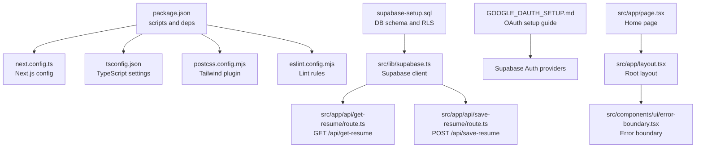
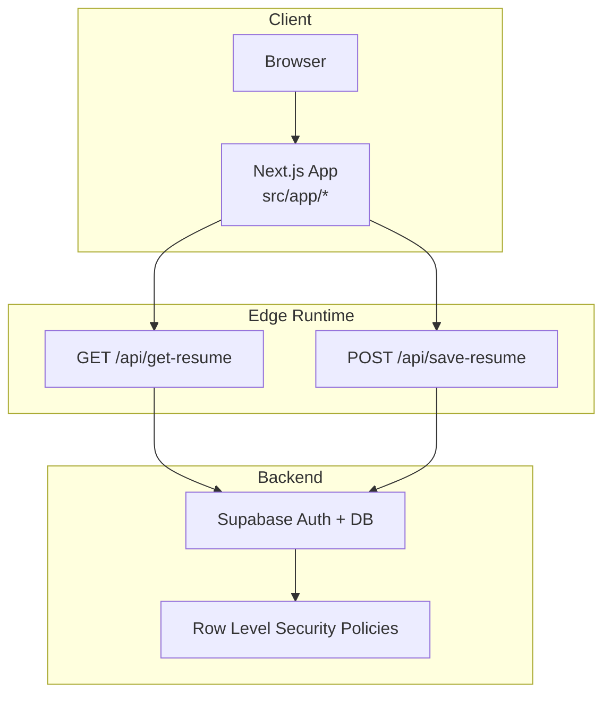
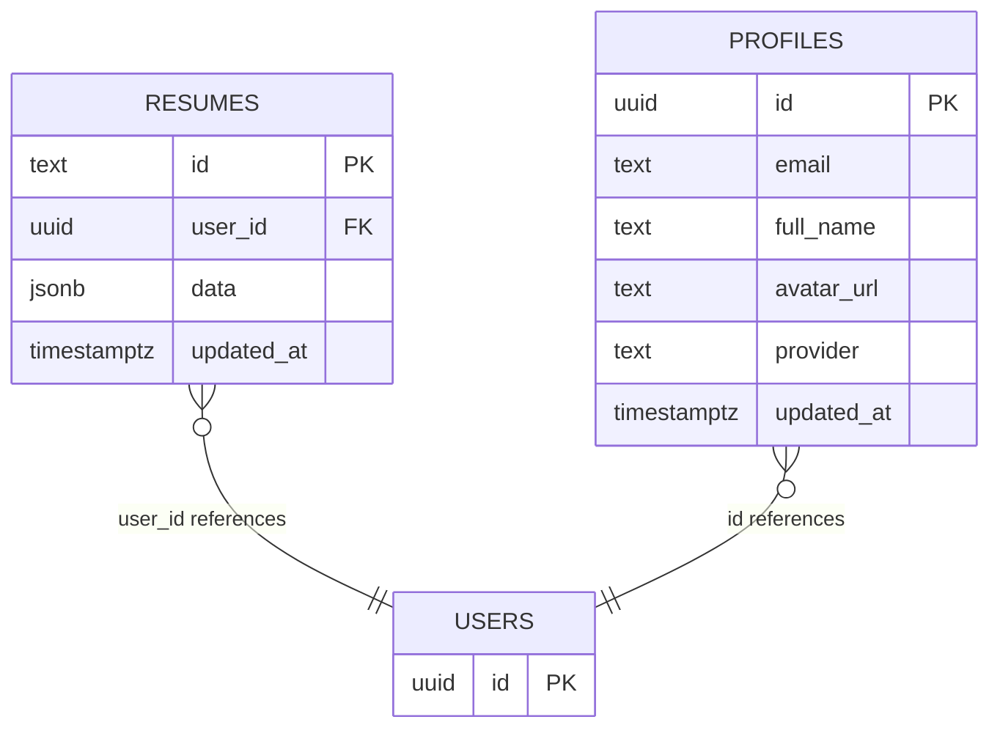
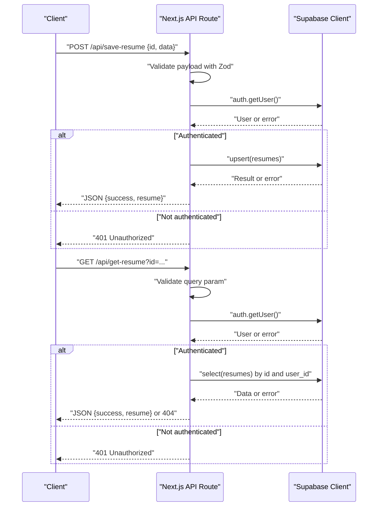
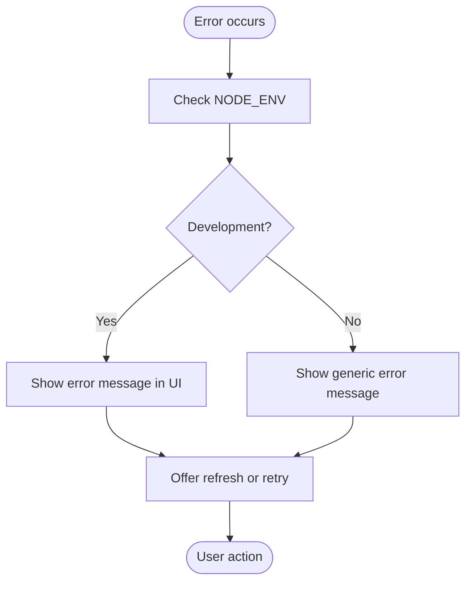
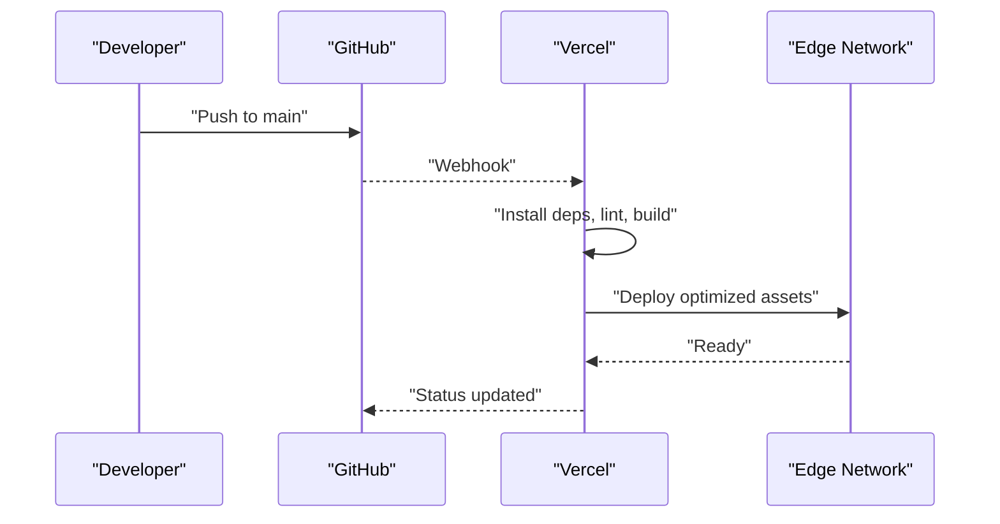
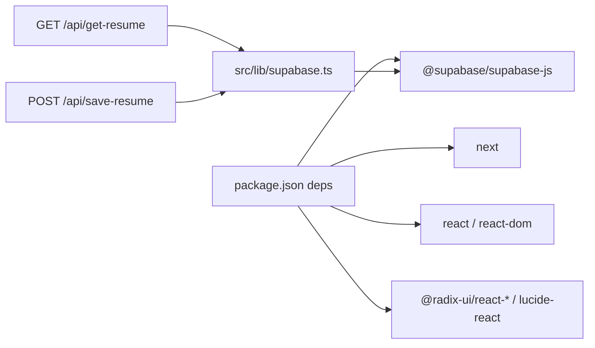

# Deployment and Production

<cite>
**Referenced Files in This Document**
- [package.json](file://package.json)
- [next.config.ts](file://next.config.ts)
- [tsconfig.json](file://tsconfig.json)
- [postcss.config.mjs](file://postcss.config.mjs)
- [eslint.config.mjs](file://eslint.config.mjs)
- [src/lib/supabase.ts](file://src/lib/supabase.ts)
- [supabase-setup.sql](file://supabase-setup.sql)
- [GOOGLE_OAUTH_SETUP.md](file://GOOGLE_OAUTH_SETUP.md)
- [src/app/api/get-resume/route.ts](file://src/app/api/get-resume/route.ts)
- [src/app/api/save-resume/route.ts](file://src/app/api/save-resume/route.ts)
- [src/components/ui/error-boundary.tsx](file://src/components/ui/error-boundary.tsx)
- [src/app/layout.tsx](file://src/app/layout.tsx)
- [src/app/page.tsx](file://src/app/page.tsx)
- [src/generate_massive_docx_v5.py](file://src/generate_massive_docx_v5.py)
- [src/generate_massive_docx_v4.py](file://src/generate_massive_docx_v4.py)
- [src/generate_massive_docx_v6.py](file://src/generate_massive_docx_v6.py)
</cite>

## Table of Contents
1. [Introduction](#introduction)
2. [Project Structure](#project-structure)
3. [Core Components](#core-components)
4. [Architecture Overview](#architecture-overview)
5. [Detailed Component Analysis](#detailed-component-analysis)
6. [Dependency Analysis](#dependency-analysis)
7. [Performance Considerations](#performance-considerations)
8. [Troubleshooting Guide](#troubleshooting-guide)
9. [Conclusion](#conclusion)
10. [Appendices](#appendices)

## Introduction
This section documents deployment and production considerations for the nh.intern project. It covers build configuration, environment variable management, deployment preparation, and the end-to-end deployment process to Vercel. It also details production configuration options, performance optimization techniques, monitoring setup, security configurations, SSL and CDN integration, rollback procedures, and best practices for maintaining and updating the deployed application.

## Project Structure
The project is a Next.js application with a Supabase backend. Key configuration files include package scripts, Next.js configuration, TypeScript configuration, PostCSS configuration, ESLint configuration, and Supabase client initialization. API routes integrate with Supabase for resume CRUD operations, and the UI includes an error boundary for graceful failure handling.

**Diagram sources**
- [package.json:1-43](file://package.json#L1-L43)
- [next.config.ts:1-8](file://next.config.ts#L1-L8)
- [tsconfig.json:1-35](file://tsconfig.json#L1-L35)
- [postcss.config.mjs:1-8](file://postcss.config.mjs#L1-L8)
- [eslint.config.mjs:1-19](file://eslint.config.mjs#L1-L19)
- [src/lib/supabase.ts:1-11](file://src/lib/supabase.ts#L1-L11)
- [src/app/api/get-resume/route.ts:1-58](file://src/app/api/get-resume/route.ts#L1-L58)
- [src/app/api/save-resume/route.ts:1-83](file://src/app/api/save-resume/route.ts#L1-L83)
- [supabase-setup.sql:1-58](file://supabase-setup.sql#L1-L58)
- [GOOGLE_OAUTH_SETUP.md:1-49](file://GOOGLE_OAUTH_SETUP.md#L1-L49)
- [src/app/layout.tsx:1-50](file://src/app/layout.tsx#L1-L50)
- [src/components/ui/error-boundary.tsx:1-78](file://src/components/ui/error-boundary.tsx#L1-L78)
- [src/app/page.tsx:1-178](file://src/app/page.tsx#L1-L178)

**Section sources**
- [package.json:1-43](file://package.json#L1-L43)
- [next.config.ts:1-8](file://next.config.ts#L1-L8)
- [tsconfig.json:1-35](file://tsconfig.json#L1-L35)
- [postcss.config.mjs:1-8](file://postcss.config.mjs#L1-L8)
- [eslint.config.mjs:1-19](file://eslint.config.mjs#L1-L19)

## Core Components
- Build and runtime scripts are defined in package.json, enabling local development, building, and starting the Next.js application.
- Next.js configuration is minimal in next.config.ts, ready for extension with production-specific options.
- TypeScript configuration supports strict mode and module resolution suitable for Next.js.
- PostCSS configuration enables Tailwind via the official plugin.
- ESLint configuration follows Next.js recommended rules with custom ignores.
- Supabase client initialization reads public environment variables for URL and anonymous key, with safe defaults for local development.
- API routes implement resume retrieval and persistence with Zod validation and Supabase RLS-backed access control.
- Error boundary provides a user-friendly fallback and logs errors in development.

**Section sources**
- [package.json:5-10](file://package.json#L5-L10)
- [next.config.ts:3-5](file://next.config.ts#L3-L5)
- [tsconfig.json:7-14](file://tsconfig.json#L7-L14)
- [postcss.config.mjs:1-8](file://postcss.config.mjs#L1-L8)
- [eslint.config.mjs:1-19](file://eslint.config.mjs#L1-L19)
- [src/lib/supabase.ts:1-11](file://src/lib/supabase.ts#L1-L11)
- [src/app/api/get-resume/route.ts:10-57](file://src/app/api/get-resume/route.ts#L10-L57)
- [src/app/api/save-resume/route.ts:31-82](file://src/app/api/save-resume/route.ts#L31-L82)
- [src/components/ui/error-boundary.tsx:18-78](file://src/components/ui/error-boundary.tsx#L18-L78)

## Architecture Overview
The application uses Next.js for the frontend and Supabase for authentication, database, and storage. API routes act as serverless functions to enforce validation and RLS. The project’s documentation references Vercel for deployment and global edge distribution.

**Diagram sources**
- [src/app/api/get-resume/route.ts:1-58](file://src/app/api/get-resume/route.ts#L1-L58)
- [src/app/api/save-resume/route.ts:1-83](file://src/app/api/save-resume/route.ts#L1-L83)
- [src/lib/supabase.ts:1-11](file://src/lib/supabase.ts#L1-L11)
- [supabase-setup.sql:14-19](file://supabase-setup.sql#L14-L19)
- [supabase-setup.sql:34-36](file://supabase-setup.sql#L34-L36)

**Section sources**
- [src/app/api/get-resume/route.ts:10-57](file://src/app/api/get-resume/route.ts#L10-L57)
- [src/app/api/save-resume/route.ts:31-82](file://src/app/api/save-resume/route.ts#L31-L82)
- [supabase-setup.sql:11-19](file://supabase-setup.sql#L11-L19)
- [supabase-setup.sql:31-36](file://supabase-setup.sql#L31-L36)

## Detailed Component Analysis

### Build Configuration and Environment Variables
- Build scripts: The project defines standard Next.js scripts for development, building, and starting the application.
- Next.js config: The configuration file is present and can be extended for production optimizations.
- TypeScript config: Strict mode and module resolution are enabled for type safety and bundling.
- PostCSS and Tailwind: Tailwind is configured via the official PostCSS plugin.
- ESLint: Next.js recommended rules are applied with custom ignores.

Environment variables used by the Supabase client:
- NEXT_PUBLIC_SUPABASE_URL: Public Supabase project URL with a safe default fallback for local development.
- NEXT_PUBLIC_SUPABASE_ANON_KEY: Public anonymous API key with a placeholder fallback.

**Section sources**
- [package.json:5-10](file://package.json#L5-L10)
- [next.config.ts:1-8](file://next.config.ts#L1-L8)
- [tsconfig.json:7-14](file://tsconfig.json#L7-L14)
- [postcss.config.mjs:1-8](file://postcss.config.mjs#L1-L8)
- [eslint.config.mjs:1-19](file://eslint.config.mjs#L1-L19)
- [src/lib/supabase.ts:3-7](file://src/lib/supabase.ts#L3-L7)

### Database Setup and Security
- Database schema: The SQL script creates resumes and profiles tables, enables RLS, and sets per-user policies.
- Trigger function: A function synchronizes new users to the profiles table upon creation.
- Row Level Security: Policies restrict access to authenticated users’ data, enforced at the database kernel level.

**Diagram sources**
- [supabase-setup.sql:4-9](file://supabase-setup.sql#L4-L9)
- [supabase-setup.sql:22-29](file://supabase-setup.sql#L22-L29)
- [supabase-setup.sql:39-57](file://supabase-setup.sql#L39-L57)

**Section sources**
- [supabase-setup.sql:11-19](file://supabase-setup.sql#L11-L19)
- [supabase-setup.sql:31-36](file://supabase-setup.sql#L31-L36)
- [supabase-setup.sql:39-57](file://supabase-setup.sql#L39-L57)

### API Workflows: Save and Retrieve Resumes
The API routes implement validation, authentication, and database operations with clear error handling.

**Diagram sources**
- [src/app/api/save-resume/route.ts:31-82](file://src/app/api/save-resume/route.ts#L31-L82)
- [src/app/api/get-resume/route.ts:10-57](file://src/app/api/get-resume/route.ts#L10-L57)
- [src/lib/supabase.ts:1-11](file://src/lib/supabase.ts#L1-L11)

**Section sources**
- [src/app/api/save-resume/route.ts:31-82](file://src/app/api/save-resume/route.ts#L31-L82)
- [src/app/api/get-resume/route.ts:10-57](file://src/app/api/get-resume/route.ts#L10-L57)

### Error Handling and Monitoring
- Error boundary: Provides a user-facing fallback and logs errors in development mode.
- API routes: Return structured JSON errors with appropriate HTTP status codes and log failures.

**Diagram sources**
- [src/components/ui/error-boundary.tsx:18-78](file://src/components/ui/error-boundary.tsx#L18-L78)

**Section sources**
- [src/components/ui/error-boundary.tsx:18-78](file://src/components/ui/error-boundary.tsx#L18-L78)
- [src/app/api/get-resume/route.ts:40-46](file://src/app/api/get-resume/route.ts#L40-L46)
- [src/app/api/save-resume/route.ts:66-71](file://src/app/api/save-resume/route.ts#L66-L71)

### Deployment to Vercel
- CI/CD pipeline: The project integrates with Vercel for automated deployments triggered by pushes to the main branch.
- Build process: Vercel performs static analysis, bundles JavaScript, and optimizes images and assets.
- Fail-fast validation: TypeScript strictness prevents broken code from reaching production.
- Edge Network: Application assets are distributed globally via Vercel’s Edge Network (CDN) for low-latency delivery.

**Diagram sources**
- [src/generate_massive_docx_v4.py:348-368](file://src/generate_massive_docx_v4.py#L348-L368)
- [src/generate_massive_docx_v5.py:416-462](file://src/generate_massive_docx_v5.py#L416-L462)
- [src/generate_massive_docx_v6.py:318-337](file://src/generate_massive_docx_v6.py#L318-L337)

**Section sources**
- [src/generate_massive_docx_v4.py:348-368](file://src/generate_massive_docx_v4.py#L348-L368)
- [src/generate_massive_docx_v5.py:416-462](file://src/generate_massive_docx_v5.py#L416-L462)
- [src/generate_massive_docx_v6.py:318-337](file://src/generate_massive_docx_v6.py#L318-L337)

### Environment Variable Management
- Public variables: NEXT_PUBLIC_SUPABASE_URL and NEXT_PUBLIC_SUPABASE_ANON_KEY are consumed on the client.
- Safe defaults: Local development uses placeholders to avoid runtime errors.
- OAuth configuration: Google OAuth credentials and redirect URIs are configured in Supabase and Google Cloud Console, with production URLs updated accordingly.

Practical examples:
- Define NEXT_PUBLIC_SUPABASE_URL and NEXT_PUBLIC_SUPABASE_ANON_KEY in Vercel project settings under Environment Variables.
- Ensure Supabase Site URL and Redirect URLs match your production domain.

**Section sources**
- [src/lib/supabase.ts:3-7](file://src/lib/supabase.ts#L3-L7)
- [GOOGLE_OAUTH_SETUP.md:40-49](file://GOOGLE_OAUTH_SETUP.md#L40-L49)

### Production Configuration Options
- Next.js configuration: Extend next.config.ts to enable image optimization, CSS optimization, and other production flags.
- Build optimization: Use Vercel’s default optimizations; consider adding image domains and formats if loading external images.
- Type checking: Keep TypeScript strict mode enabled to catch issues early.

**Section sources**
- [next.config.ts:3-5](file://next.config.ts#L3-L5)
- [tsconfig.json:7-14](file://tsconfig.json#L7-L14)
- [src/generate_massive_docx_v5.py:421-439](file://src/generate_massive_docx_v5.py#L421-L439)

### Security Configurations
- JWT-based authentication: Supabase Auth manages secure tokens; ensure HTTPS is enforced.
- Row Level Security (RLS): Policies restrict data access to authenticated users; keep policies up to date with schema changes.
- XSS protection: React’s default rendering behavior helps prevent XSS; sanitize user-generated content at ingestion points.
- CSRF protection: Supabase Auth mitigates CSRF via secure cookies and token verification.

**Section sources**
- [supabase-setup.sql:14-19](file://supabase-setup.sql#L14-L19)
- [supabase-setup.sql:34-36](file://supabase-setup.sql#L34-L36)
- [src/generate_massive_docx_v4.py:309-320](file://src/generate_massive_docx_v4.py#L309-L320)
- [src/generate_massive_docx_v6.py:289-301](file://src/generate_massive_docx_v6.py#L289-L301)

### SSL and CDN Integration
- SSL: Enforce HTTPS in Vercel and Supabase; configure custom domains with SSL certificates.
- CDN: Vercel’s Edge Network distributes assets globally; ensure cache headers and asset optimization are aligned with caching strategies.

**Section sources**
- [src/generate_massive_docx_v4.py:359-365](file://src/generate_massive_docx_v4.py#L359-L365)
- [src/generate_massive_docx_v5.py:442-448](file://src/generate_massive_docx_v5.py#L442-L448)
- [src/generate_massive_docx_v6.py:328-334](file://src/generate_massive_docx_v6.py#L328-L334)

### Scaling Considerations
- Horizontal scaling: Vercel scales the Edge Network automatically; ensure API routes remain stateless.
- Database scaling: Design queries to leverage indexes and keep RLS policies efficient; monitor query performance.
- Concurrency: Plan for concurrent users by optimizing API response times and database connections.

**Section sources**
- [src/generate_massive_docx_v4.py:129-133](file://src/generate_massive_docx_v4.py#L129-L133)
- [supabase-setup.sql:4-9](file://supabase-setup.sql#L4-L9)

### Rollback Procedures
- Vercel rollbacks: Use Vercel’s dashboard to revert to a previous deployment by selecting a prior build.
- Git-based rollback: If needed, revert commits on the main branch and redeploy; ensure environment variables remain consistent.

**Section sources**
- [src/generate_massive_docx_v4.py:348-356](file://src/generate_massive_docx_v4.py#L348-L356)

### Monitoring Deployment Health
- Logs: Use Vercel logs and browser console logs to diagnose issues; the error boundary logs errors in development.
- Health checks: Implement lightweight health endpoints if needed; monitor API response times and error rates.
- Alerts: Configure notifications for deployment failures or sustained error spikes.

**Section sources**
- [src/components/ui/error-boundary.tsx:28-30](file://src/components/ui/error-boundary.tsx#L28-L30)
- [src/generate_massive_docx_v4.py:348-356](file://src/generate_massive_docx_v4.py#L348-L356)

### Best Practices for Maintenance and Updates
- Keep dependencies updated; run linting and tests before deploying.
- Maintain backward-compatible database migrations; update RLS policies alongside schema changes.
- Version control all environment variables externally; never commit secrets.
- Automate deployments via main branch protection and CI checks.

**Section sources**
- [package.json:11-31](file://package.json#L11-L31)
- [eslint.config.mjs:1-19](file://eslint.config.mjs#L1-L19)
- [supabase-setup.sql:11-19](file://supabase-setup.sql#L11-L19)

## Dependency Analysis
The application’s production dependencies include Next.js, React, Supabase client, and UI libraries. The Supabase client depends on environment variables for configuration. API routes depend on Supabase for authentication and data operations.

**Diagram sources**
- [package.json:11-31](file://package.json#L11-L31)
- [src/lib/supabase.ts:1-11](file://src/lib/supabase.ts#L1-L11)
- [src/app/api/get-resume/route.ts:1-58](file://src/app/api/get-resume/route.ts#L1-L58)
- [src/app/api/save-resume/route.ts:1-83](file://src/app/api/save-resume/route.ts#L1-L83)

**Section sources**
- [package.json:11-31](file://package.json#L11-L31)
- [src/lib/supabase.ts:1-11](file://src/lib/supabase.ts#L1-L11)

## Performance Considerations
- Image optimization: Configure supported formats and domains in Next.js to reduce payload sizes.
- CSS optimization: Enable experimental CSS optimization to minimize bundle size.
- Edge distribution: Rely on Vercel’s global CDN for reduced latency.
- API efficiency: Keep API routes lean; avoid unnecessary database round trips.

**Section sources**
- [src/generate_massive_docx_v5.py:421-439](file://src/generate_massive_docx_v5.py#L421-L439)
- [src/generate_massive_docx_v4.py:359-365](file://src/generate_massive_docx_v4.py#L359-L365)

## Troubleshooting Guide
Common issues and resolutions:
- Authentication failures: Verify NEXT_PUBLIC_SUPABASE_URL and NEXT_PUBLIC_SUPABASE_ANON_KEY are set in Vercel; confirm Supabase Auth is enabled.
- Database access denied: Confirm RLS policies and user session are valid; check user_id matches the authenticated user.
- Build failures: Resolve TypeScript errors; ensure lint passes locally before pushing.
- CORS/OAuth redirects: Update Google Cloud Console and Supabase Redirect URLs to match the production domain.

**Section sources**
- [src/lib/supabase.ts:3-7](file://src/lib/supabase.ts#L3-L7)
- [supabase-setup.sql:14-19](file://supabase-setup.sql#L14-L19)
- [GOOGLE_OAUTH_SETUP.md:40-49](file://GOOGLE_OAUTH_SETUP.md#L40-L49)

## Conclusion
The nh.intern project is production-ready with a secure Supabase backend, robust API routes, and a streamlined deployment pipeline to Vercel. By following the outlined environment management, security, performance, and monitoring practices, you can maintain a reliable, scalable, and secure deployment.

## Appendices
- Example environment variables to configure in Vercel:
  - NEXT_PUBLIC_SUPABASE_URL
  - NEXT_PUBLIC_SUPABASE_ANON_KEY
- OAuth setup references:
  - [GOOGLE_OAUTH_SETUP.md:1-49](file://GOOGLE_OAUTH_SETUP.md#L1-L49)