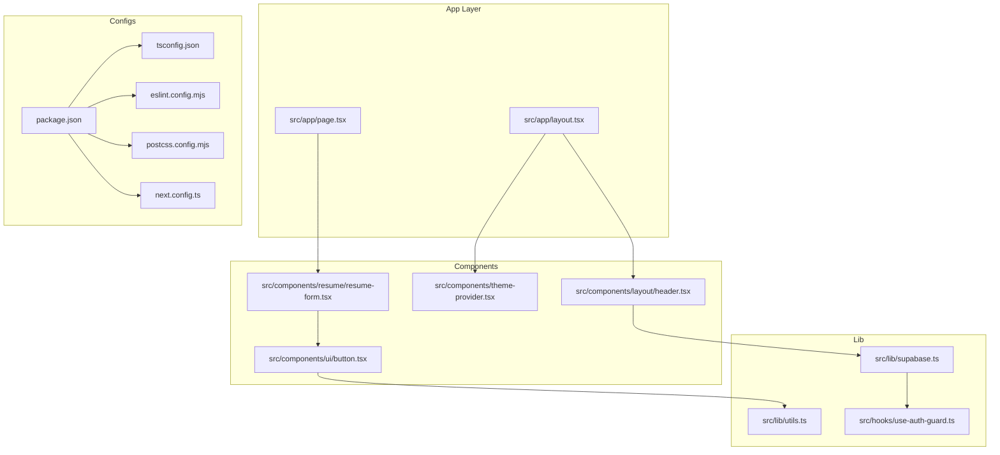
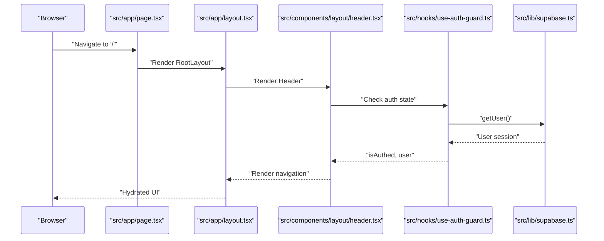
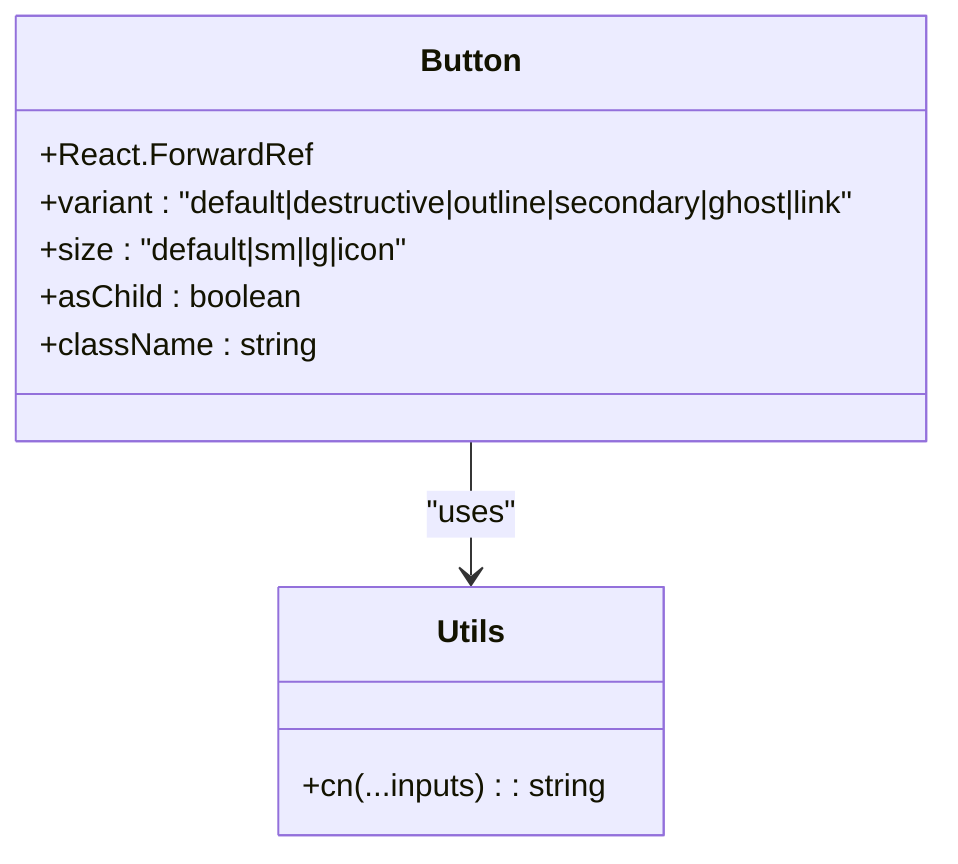
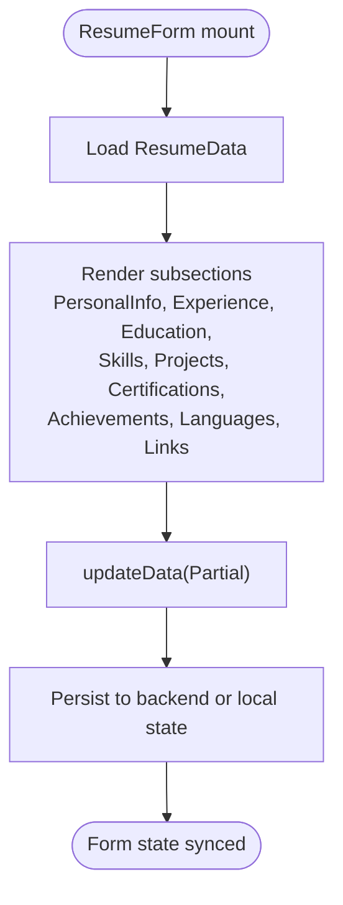
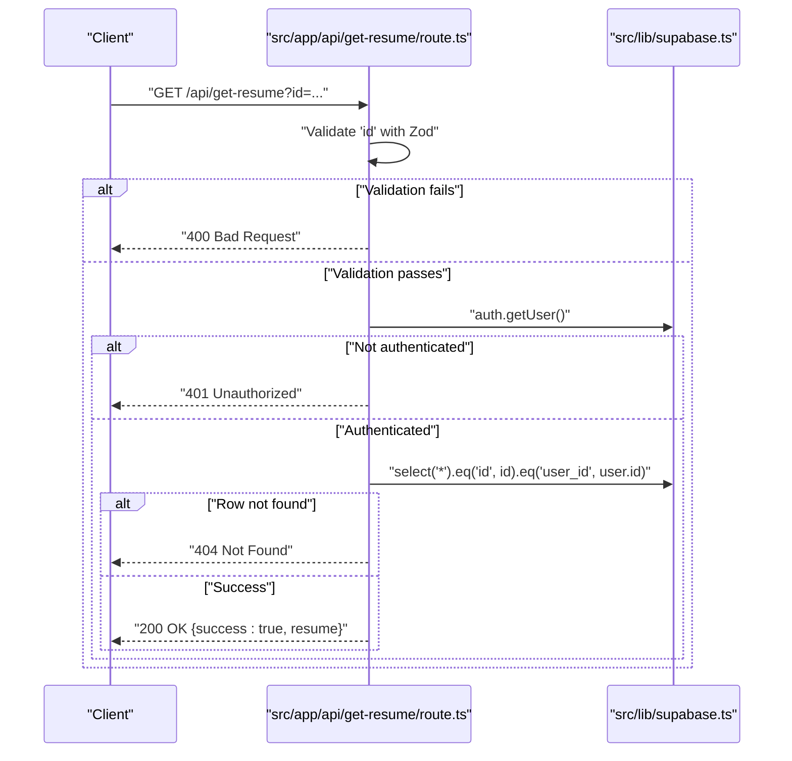
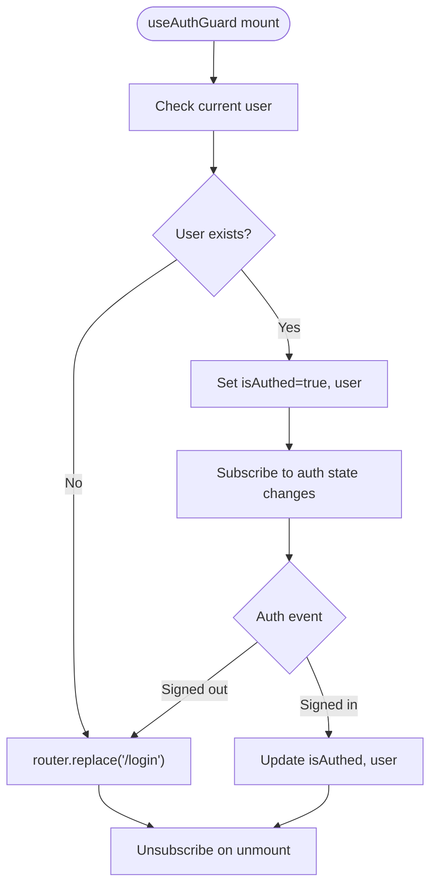
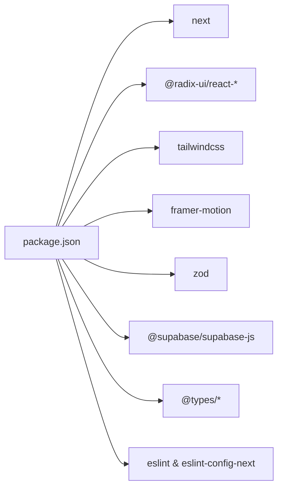

# Development Guidelines

<cite>
**Referenced Files in This Document**
- [package.json](file://package.json)
- [tsconfig.json](file://tsconfig.json)
- [eslint.config.mjs](file://eslint.config.mjs)
- [postcss.config.mjs](file://postcss.config.mjs)
- [next.config.ts](file://next.config.ts)
- [src/app/layout.tsx](file://src/app/layout.tsx)
- [src/app/page.tsx](file://src/app/page.tsx)
- [src/lib/utils.ts](file://src/lib/utils.ts)
- [src/components/ui/button.tsx](file://src/components/ui/button.tsx)
- [src/components/theme-provider.tsx](file://src/components/theme-provider.tsx)
- [src/components/resume/resume-form.tsx](file://src/components/resume/resume-form.tsx)
- [src/app/api/get-resume/route.ts](file://src/app/api/get-resume/route.ts)
- [src/hooks/use-auth-guard.ts](file://src/hooks/use-auth-guard.ts)
- [src/lib/supabase.ts](file://src/lib/supabase.ts)
- [src/components/layout/header.tsx](file://src/components/layout/header.tsx)
</cite>

## Table of Contents
1. [Introduction](#introduction)
2. [Project Structure](#project-structure)
3. [Core Components](#core-components)
4. [Architecture Overview](#architecture-overview)
5. [Detailed Component Analysis](#detailed-component-analysis)
6. [Dependency Analysis](#dependency-analysis)
7. [Performance Considerations](#performance-considerations)
8. [Security Considerations](#security-considerations)
9. [Accessibility Requirements](#accessibility-requirements)
10. [Testing Strategies](#testing-strategies)
11. [Code Review and Quality Assurance](#code-review-and-quality-assurance)
12. [Contributing and Workflow](#contributing-and-workflow)
13. [Troubleshooting Guide](#troubleshooting-guide)
14. [Conclusion](#conclusion)

## Introduction
This document provides development guidelines and best practices for the nh.intern project. It explains code organization principles, TypeScript configuration, ESLint rules, and PostCSS setup. It also documents component development standards, naming conventions, file structure patterns, testing strategies, code review processes, quality assurance practices, performance optimization techniques, security considerations, accessibility requirements, contribution workflows, and troubleshooting guidance.

## Project Structure
The project follows a Next.js app directory structure with a clear separation of concerns:
- Application pages and layouts under src/app
- Shared components under src/components
- Reusable UI primitives under src/components/ui
- Utilities and shared logic under src/lib
- Client-side hooks under src/hooks
- Supabase integration under src/lib/supabase.ts
- Global styles under src/app/globals.css
- API routes under src/app/api

**Diagram sources**
- [src/app/layout.tsx:1-50](file://src/app/layout.tsx#L1-L50)
- [src/app/page.tsx:1-178](file://src/app/page.tsx#L1-L178)
- [src/components/layout/header.tsx:1-96](file://src/components/layout/header.tsx#L1-L96)
- [src/components/theme-provider.tsx:1-10](file://src/components/theme-provider.tsx#L1-L10)
- [src/components/ui/button.tsx:1-57](file://src/components/ui/button.tsx#L1-L57)
- [src/components/resume/resume-form.tsx:1-84](file://src/components/resume/resume-form.tsx#L1-L84)
- [src/lib/supabase.ts:1-11](file://src/lib/supabase.ts#L1-L11)
- [src/lib/utils.ts:1-7](file://src/lib/utils.ts#L1-L7)
- [src/hooks/use-auth-guard.ts:1-51](file://src/hooks/use-auth-guard.ts#L1-L51)
- [package.json:1-43](file://package.json#L1-L43)
- [tsconfig.json:1-35](file://tsconfig.json#L1-L35)
- [eslint.config.mjs:1-19](file://eslint.config.mjs#L1-L19)
- [postcss.config.mjs:1-8](file://postcss.config.mjs#L1-L8)
- [next.config.ts:1-8](file://next.config.ts#L1-L8)

**Section sources**
- [src/app/layout.tsx:1-50](file://src/app/layout.tsx#L1-L50)
- [src/app/page.tsx:1-178](file://src/app/page.tsx#L1-L178)
- [package.json:1-43](file://package.json#L1-L43)

## Core Components
- Layout and theme provider: The root layout composes theme management and error boundaries, ensuring consistent theming and robust rendering.
- UI primitives: The Button primitive demonstrates variant-driven styling with class merging utilities.
- Resume form composition: The ResumeForm composes domain-specific sections and manages partial updates to a unified ResumeData model.
- Authentication guard: The useAuthGuard hook centralizes client-side auth checks and redirects.
- Supabase client: The Supabase client is configured with environment-aware fallbacks for safe local development.

**Section sources**
- [src/app/layout.tsx:1-50](file://src/app/layout.tsx#L1-L50)
- [src/components/theme-provider.tsx:1-10](file://src/components/theme-provider.tsx#L1-L10)
- [src/components/ui/button.tsx:1-57](file://src/components/ui/button.tsx#L1-L57)
- [src/components/resume/resume-form.tsx:1-84](file://src/components/resume/resume-form.tsx#L1-L84)
- [src/hooks/use-auth-guard.ts:1-51](file://src/hooks/use-auth-guard.ts#L1-L51)
- [src/lib/supabase.ts:1-11](file://src/lib/supabase.ts#L1-L11)

## Architecture Overview
The application architecture emphasizes:
- Centralized theme management via next-themes
- Strict client/server boundary enforcement with "use client" directives
- Type-safe API routes with Zod validation
- Composable UI components with variant-driven styling
- Reactive auth state synchronization with Supabase

**Diagram sources**
- [src/app/page.tsx:1-178](file://src/app/page.tsx#L1-L178)
- [src/app/layout.tsx:1-50](file://src/app/layout.tsx#L1-L50)
- [src/components/layout/header.tsx:1-96](file://src/components/layout/header.tsx#L1-L96)
- [src/hooks/use-auth-guard.ts:1-51](file://src/hooks/use-auth-guard.ts#L1-L51)
- [src/lib/supabase.ts:1-11](file://src/lib/supabase.ts#L1-L11)

## Detailed Component Analysis

### UI Primitive: Button
The Button component demonstrates:
- Variant-driven styling using class-variance-authority
- Composition via Radix Slot for flexible DOM rendering
- Utility class merging with cn for Tailwind compatibility

**Diagram sources**
- [src/components/ui/button.tsx:1-57](file://src/components/ui/button.tsx#L1-L57)
- [src/lib/utils.ts:1-7](file://src/lib/utils.ts#L1-L7)

**Section sources**
- [src/components/ui/button.tsx:1-57](file://src/components/ui/button.tsx#L1-L57)
- [src/lib/utils.ts:1-7](file://src/lib/utils.ts#L1-L7)

### Resume Form Composition
The ResumeForm composes domain sections and manages partial updates to a unified ResumeData model. It enforces a single source of truth for resume editing and ensures consistent reactivity across subsections.

**Diagram sources**
- [src/components/resume/resume-form.tsx:1-84](file://src/components/resume/resume-form.tsx#L1-L84)

**Section sources**
- [src/components/resume/resume-form.tsx:1-84](file://src/components/resume/resume-form.tsx#L1-L84)

### API Route: Get Resume
The GET handler for retrieving a resume demonstrates:
- URL parameter validation with Zod
- Authentication enforcement via Supabase
- Row-level security by matching user_id
- Structured error responses

**Diagram sources**
- [src/app/api/get-resume/route.ts:1-58](file://src/app/api/get-resume/route.ts#L1-L58)
- [src/lib/supabase.ts:1-11](file://src/lib/supabase.ts#L1-L11)

**Section sources**
- [src/app/api/get-resume/route.ts:1-58](file://src/app/api/get-resume/route.ts#L1-L58)
- [src/lib/supabase.ts:1-11](file://src/lib/supabase.ts#L1-L11)

### Authentication Guard
The useAuthGuard hook centralizes:
- Initial auth check on mount
- Real-time auth state subscription
- Redirects to /login when unauthenticated
- Session persistence for backward compatibility

**Diagram sources**
- [src/hooks/use-auth-guard.ts:1-51](file://src/hooks/use-auth-guard.ts#L1-L51)

**Section sources**
- [src/hooks/use-auth-guard.ts:1-51](file://src/hooks/use-auth-guard.ts#L1-L51)

## Dependency Analysis
The project relies on:
- Next.js for framework runtime and routing
- Radix UI for accessible headless components
- Tailwind CSS v4 with PostCSS integration
- Framer Motion for animations
- Zod for runtime validation
- Supabase for authentication and database access

**Diagram sources**
- [package.json:1-43](file://package.json#L1-L43)

**Section sources**
- [package.json:1-43](file://package.json#L1-L43)

## Performance Considerations
- Prefer variant-driven UI components to minimize conditional rendering overhead.
- Use client directives judiciously; keep server-rendered pages for initial loads.
- Lazy-load heavy assets and animations; leverage viewport-based triggers for scroll effects.
- Optimize image loading with appropriate sizes and formats; defer non-critical resources.
- Minimize unnecessary re-renders by structuring props and state updates efficiently.
- Use memoization for expensive computations within components.

## Security Considerations
- Always validate and sanitize request parameters using Zod in API routes.
- Enforce row-level security by filtering queries with user_id.
- Store sensitive keys in environment variables; avoid embedding secrets in client code.
- Use HTTPS and secure cookies; configure Supabase project settings appropriately.
- Implement rate limiting at the API gateway or middleware level.
- Sanitize user-generated content before rendering to prevent XSS.

**Section sources**
- [src/app/api/get-resume/route.ts:1-58](file://src/app/api/get-resume/route.ts#L1-L58)
- [src/lib/supabase.ts:1-11](file://src/lib/supabase.ts#L1-L11)

## Accessibility Requirements
- Use semantic HTML and ARIA attributes where necessary.
- Ensure keyboard navigation support for interactive elements.
- Provide sufficient color contrast and scalable text.
- Add meaningful labels to form controls and buttons.
- Test with screen readers and assistive technologies regularly.

## Testing Strategies
- Unit tests for pure functions and utilities (e.g., cn merging logic).
- Component tests for UI primitives focusing on variant rendering and behavior.
- Integration tests for API routes validating request/response shapes and permissions.
- E2E tests covering critical user journeys (authentication, resume creation, export).
- Snapshot tests for layout stability after design changes.

## Code Review and Quality Assurance
- Run linting locally before committing; fix all reported issues.
- Keep PRs small and focused; include a summary of changes and rationale.
- Verify type safety across the codebase; resolve TypeScript errors.
- Confirm PostCSS/Tailwind builds succeed; check for unused utilities.
- Validate environment variables are present and correctly formatted.
- Perform manual QA on supported browsers and devices.

**Section sources**
- [eslint.config.mjs:1-19](file://eslint.config.mjs#L1-L19)
- [tsconfig.json:1-35](file://tsconfig.json#L1-L35)
- [postcss.config.mjs:1-8](file://postcss.config.mjs#L1-L8)

## Contributing and Workflow
- Branching: Use feature branches prefixed with feature/, fix/, or chore/.
- Commit messages: Follow imperative style; reference issue numbers when applicable.
- Pre-commit: Run lint, typecheck, and build to catch issues early.
- Pull requests: Assign reviewers; ensure CI passes and all comments are addressed.
- Merging: Squash or rebase commits; keep history clean and linear.

## Troubleshooting Guide
Common development issues and resolutions:
- ESLint errors: Fix reported violations; ensure eslint.config.mjs is applied consistently.
- TypeScript errors: Resolve strict mode issues; confirm module resolution paths.
- Tailwind/Purge issues: Verify PostCSS plugin configuration; rebuild after changes.
- Next.js build failures: Clear .next cache; reinstall dependencies if necessary.
- Supabase connectivity: Confirm environment variables; check project URL and anon key.
- Hydration mismatches: Align SSR vs client-rendered content; ensure consistent markup.
- Authentication loops: Verify auth state subscription and redirect logic.

**Section sources**
- [eslint.config.mjs:1-19](file://eslint.config.mjs#L1-L19)
- [tsconfig.json:1-35](file://tsconfig.json#L1-L35)
- [postcss.config.mjs:1-8](file://postcss.config.mjs#L1-L8)
- [next.config.ts:1-8](file://next.config.ts#L1-L8)

## Conclusion
By adhering to these development guidelines—structured code organization, strict TypeScript configuration, enforced ESLint rules, Tailwind CSS with PostCSS, disciplined component development, robust testing, and security-conscious practices—you can maintain a high-quality, scalable, and accessible codebase for nh.intern.