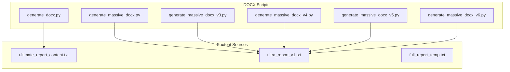
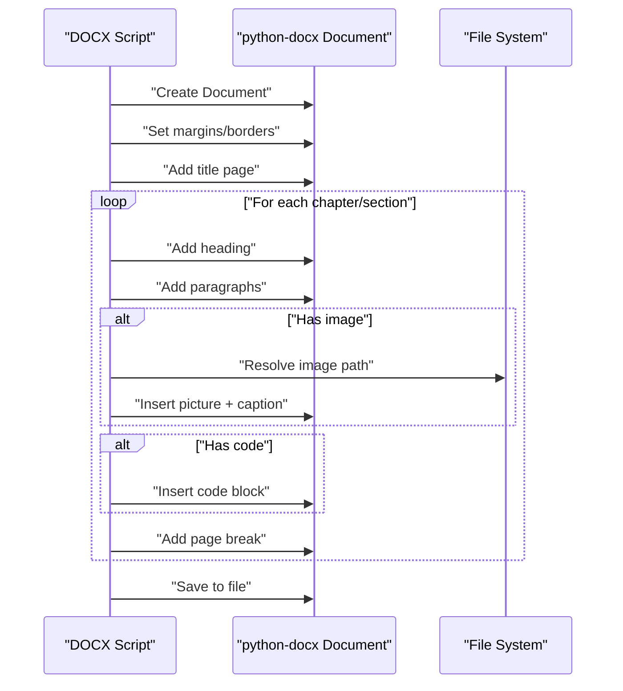
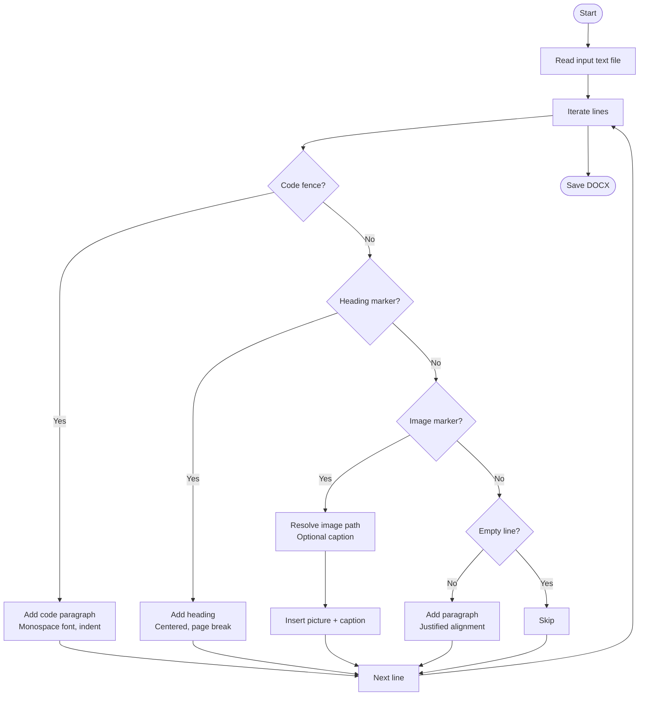
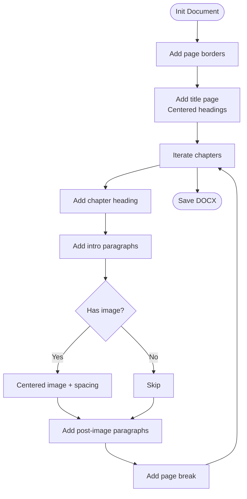
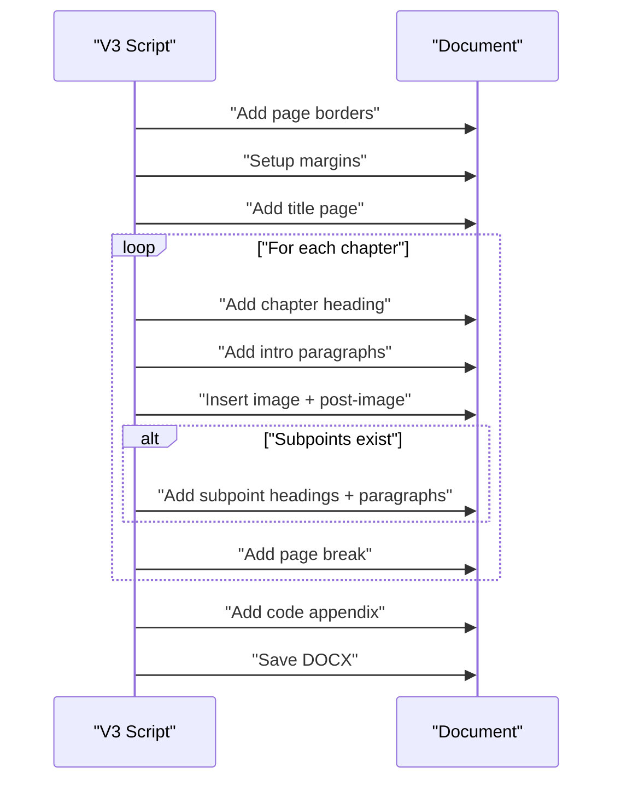
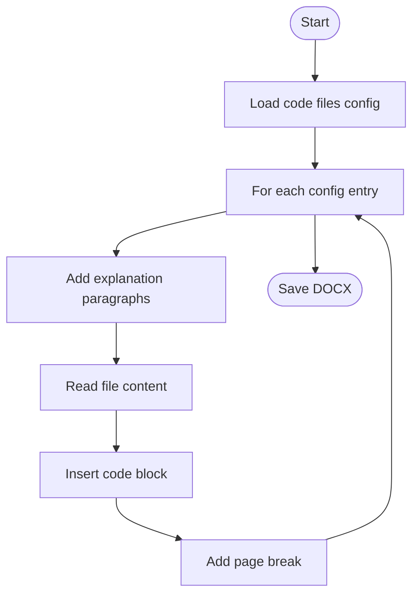
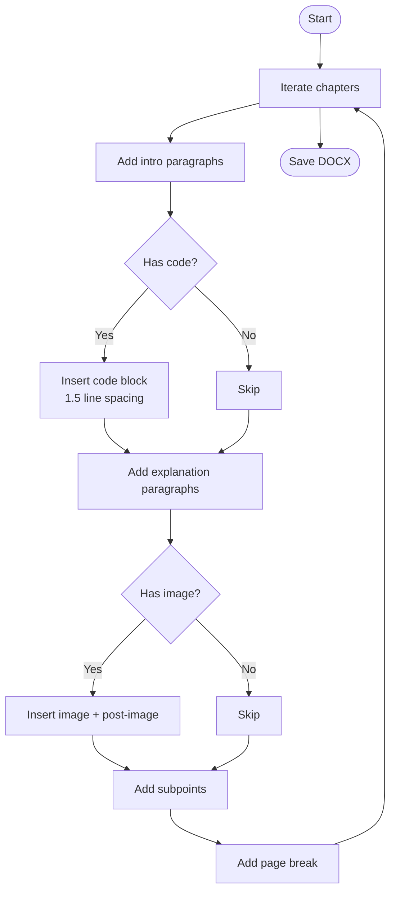
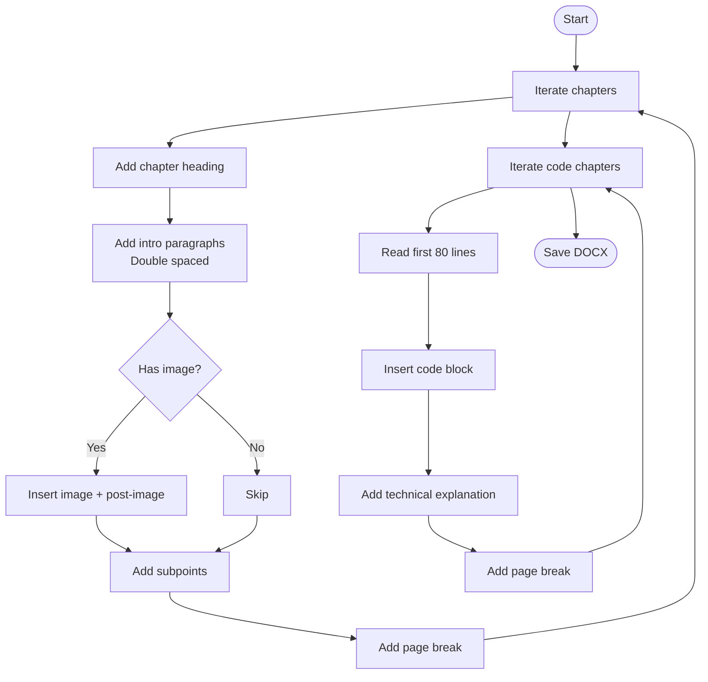
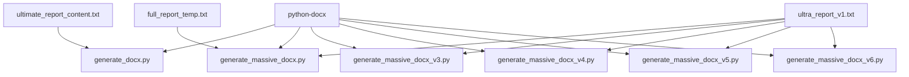

# DOCX Export

<cite>
**Referenced Files in This Document**
- [generate_docx.py](file://src/generate_docx.py)
- [generate_massive_docx.py](file://src/generate_massive_docx.py)
- [generate_massive_docx_v3.py](file://src/generate_massive_docx_v3.py)
- [generate_massive_docx_v4.py](file://src/generate_massive_docx_v4.py)
- [generate_massive_docx_v5.py](file://src/generate_massive_docx_v5.py)
- [generate_massive_docx_v6.py](file://src/generate_massive_docx_v6.py)
- [ultimate_report_content.txt](file://src/ultimate_report_content.txt)
- [ultra_report_v1.txt](file://src/ultra_report_v1.txt)
- [full_report_temp.txt](file://src/full_report_temp.txt)
</cite>

## Table of Contents
1. [Introduction](#introduction)
2. [Project Structure](#project-structure)
3. [Core Components](#core-components)
4. [Architecture Overview](#architecture-overview)
5. [Detailed Component Analysis](#detailed-component-analysis)
6. [Dependency Analysis](#dependency-analysis)
7. [Performance Considerations](#performance-considerations)
8. [Troubleshooting Guide](#troubleshooting-guide)
9. [Conclusion](#conclusion)
10. [Appendices](#appendices)

## Introduction
This document explains the DOCX export functionality across multiple generations of scripts, tracing the evolution from a simple text-to-DOCX converter to sophisticated, multi-chapter, code-rich reports. It covers document structure creation, paragraph and heading formatting, image insertion, code block handling, and styling preservation. It also provides practical guidance for customization, complex layouts, large exports, performance optimization, and troubleshooting.

## Project Structure
The DOCX export scripts reside in the project’s source directory and are paired with Markdown/Text sources that drive content generation. The scripts share a common Python-based architecture using python-docx to construct documents programmatically.

**Diagram sources**
- [generate_docx.py:1-83](file://src/generate_docx.py#L1-L83)
- [generate_massive_docx.py:1-183](file://src/generate_massive_docx.py#L1-L183)
- [generate_massive_docx_v3.py:1-575](file://src/generate_massive_docx_v3.py#L1-L575)
- [generate_massive_docx_v4.py:1-523](file://src/generate_massive_docx_v4.py#L1-L523)
- [generate_massive_docx_v5.py:1-562](file://src/generate_massive_docx_v5.py#L1-L562)
- [generate_massive_docx_v6.py:1-520](file://src/generate_massive_docx_v6.py#L1-L520)
- [ultimate_report_content.txt:1-203](file://src/ultimate_report_content.txt#L1-L203)
- [ultra_report_v1.txt:1-341](file://src/ultra_report_v1.txt#L1-L341)
- [full_report_temp.txt:1-357](file://src/full_report_temp.txt#L1-L357)

**Section sources**
- [generate_docx.py:1-83](file://src/generate_docx.py#L1-L83)
- [generate_massive_docx.py:1-183](file://src/generate_massive_docx.py#L1-L183)
- [generate_massive_docx_v3.py:1-575](file://src/generate_massive_docx_v3.py#L1-L575)
- [generate_massive_docx_v4.py:1-523](file://src/generate_massive_docx_v4.py#L1-L523)
- [generate_massive_docx_v5.py:1-562](file://src/generate_massive_docx_v5.py#L1-L562)
- [generate_massive_docx_v6.py:1-520](file://src/generate_massive_docx_v6.py#L1-L520)
- [ultimate_report_content.txt:1-203](file://src/ultimate_report_content.txt#L1-L203)
- [ultra_report_v1.txt:1-341](file://src/ultra_report_v1.txt#L1-L341)
- [full_report_temp.txt:1-357](file://src/full_report_temp.txt#L1-L357)

## Core Components
- Document builder functions: Each script defines helpers to add page borders, headings, paragraphs, and code blocks. These functions encapsulate font, alignment, spacing, and indentation settings.
- Content ingestion: Scripts either read Markdown/Text files or embed structured chapter data directly. They parse headings, paragraphs, images, and optional code blocks.
- Image handling: Images are inserted with center alignment and optional captions. Paths are resolved relative to a brain directory and validated before insertion.
- Code block formatting: Code is inserted using a monospaced font and adjusted indentation and spacing to improve readability.

**Section sources**
- [generate_docx.py:6-79](file://src/generate_docx.py#L6-L79)
- [generate_massive_docx.py:8-179](file://src/generate_massive_docx.py#L8-L179)
- [generate_massive_docx_v3.py:8-571](file://src/generate_massive_docx_v3.py#L8-L571)
- [generate_massive_docx_v4.py:8-519](file://src/generate_massive_docx_v4.py#L8-L519)
- [generate_massive_docx_v5.py:8-558](file://src/generate_massive_docx_v5.py#L8-L558)
- [generate_massive_docx_v6.py:8-516](file://src/generate_massive_docx_v6.py#L8-L516)

## Architecture Overview
The DOCX generation pipeline follows a consistent flow across versions:
- Initialize a Document object.
- Apply page-level formatting (margins, borders).
- Render a title page.
- Iterate over chapters/sections, adding headings, paragraphs, images, and code blocks.
- Insert page breaks between sections as needed.
- Save the document to disk.

**Diagram sources**
- [generate_docx.py:6-79](file://src/generate_docx.py#L6-L79)
- [generate_massive_docx.py:140-179](file://src/generate_massive_docx.py#L140-L179)
- [generate_massive_docx_v3.py:401-571](file://src/generate_massive_docx_v3.py#L401-L571)
- [generate_massive_docx_v4.py:433-519](file://src/generate_massive_docx_v4.py#L433-L519)
- [generate_massive_docx_v5.py:492-558](file://src/generate_massive_docx_v5.py#L492-L558)
- [generate_massive_docx_v6.py:428-516](file://src/generate_massive_docx_v6.py#L428-L516)

## Detailed Component Analysis

### Simple Text-to-Docx Converter (generate_docx.py)
- Purpose: Converts a Markdown-like text file into a DOCX with basic formatting and inline code handling.
- Key behaviors:
  - Sets default font and size for normal text.
  - Detects code fences and switches to a monospaced font with reduced size and indentation.
  - Supports headings with page breaks and centered alignment.
  - Inserts images with optional captions and error handling for missing files.
  - Applies justified alignment for regular paragraphs.

**Diagram sources**
- [generate_docx.py:6-79](file://src/generate_docx.py#L6-L79)

**Section sources**
- [generate_docx.py:6-79](file://src/generate_docx.py#L6-L79)

### Massive Report Generator (generate_massive_docx.py)
- Purpose: Generates a large, multi-section report with page borders, title page, and chapter content.
- Key behaviors:
  - Adds page borders via OxmlElement manipulation.
  - Defines helper functions for headings (bold, sizes) and paragraphs (line spacing, justification).
  - Uses a structured list of chapters with intro paragraphs, optional images, and post-image explanations.
  - Forces page breaks between sections for “one topic per page” layout.

**Diagram sources**
- [generate_massive_docx.py:140-179](file://src/generate_massive_docx.py#L140-L179)

**Section sources**
- [generate_massive_docx.py:8-179](file://src/generate_massive_docx.py#L8-L179)

### Version 3: Enhanced Chapter Structure and Code Appendix (generate_massive_docx_v3.py)
- Purpose: Expands on the massive report with a hierarchical chapter/subpoint structure and a dedicated code appendix.
- Key behaviors:
  - Defines chapters with intro, image, post-image, and subpoints.
  - Adds a code appendix section with raw source code snippets.
  - Uses consistent heading and paragraph formatting with increased line spacing.
  - Includes a dedicated code block formatter with tighter spacing.

**Diagram sources**
- [generate_massive_docx_v3.py:401-571](file://src/generate_massive_docx_v3.py#L401-L571)

**Section sources**
- [generate_massive_docx_v3.py:60-571](file://src/generate_massive_docx_v3.py#L60-L571)

### Version 4: Source Code Analysis Chapters (generate_massive_docx_v4.py)
- Purpose: Adds a dedicated code analysis section that reads actual application source files and inserts them into the DOCX.
- Key behaviors:
  - Iterates over a configuration list of code files and explanations.
  - Reads file contents and inserts them as code blocks.
  - Adds explanatory paragraphs before each code section.
  - Forces page breaks between code chapters.

**Diagram sources**
- [generate_massive_docx_v4.py:494-515](file://src/generate_massive_docx_v4.py#L494-L515)

**Section sources**
- [generate_massive_docx_v4.py:370-519](file://src/generate_massive_docx_v4.py#L370-L519)

### Version 5: Structured Source Code Analysis (generate_massive_docx_v5.py)
- Purpose: Refines the code analysis chapters with clearer chapter titles and explanations, and increases page count with double-spaced paragraphs and code block spacing.
- Key behaviors:
  - Uses a chapters list with code snippets and explanations.
  - Inserts code blocks with 1.5 line spacing and reduced space-after.
  - Adds double line spacing for paragraphs to inflate page count.

**Diagram sources**
- [generate_massive_docx_v5.py:518-554](file://src/generate_massive_docx_v5.py#L518-L554)

**Section sources**
- [generate_massive_docx_v5.py:63-558](file://src/generate_massive_docx_v5.py#L63-L558)

### Version 6: Double-Spaced Paragraphs and Truncated Code (generate_massive_docx_v6.py)
- Purpose: Maximizes page count with double-spaced paragraphs and a large code analysis section with truncated source files.
- Key behaviors:
  - Uses double line spacing for paragraphs.
  - Adds a large code analysis section with truncated source files (first 80 lines).
  - Forces page breaks after each chapter and code chapter.

**Diagram sources**
- [generate_massive_docx_v6.py:454-512](file://src/generate_massive_docx_v6.py#L454-L512)

**Section sources**
- [generate_massive_docx_v6.py:65-516](file://src/generate_massive_docx_v6.py#L65-L516)

### Relationship Between Versions and Migration Paths
- Evolution path:
  - v1: Simple text-to-DOCX with code fences and images.
  - v2: Massive report with page borders and chapter structure.
  - v3: Hierarchical chapters with code appendix.
  - v4: Source code analysis chapters reading actual files.
  - v5: Refined code analysis with double-spaced paragraphs and improved formatting.
  - v6: Maximized page count with double-spaced paragraphs and truncated code.
- Migration guidance:
  - v3 to v4: Replace hardcoded chapters with a code analysis loop that reads files from disk.
  - v4 to v5: Increase line spacing for paragraphs and refine code block spacing.
  - v5 to v6: Add double-spaced paragraphs and truncate code to limit file size.

**Section sources**
- [generate_docx.py:6-79](file://src/generate_docx.py#L6-L79)
- [generate_massive_docx.py:140-179](file://src/generate_massive_docx.py#L140-L179)
- [generate_massive_docx_v3.py:401-571](file://src/generate_massive_docx_v3.py#L401-L571)
- [generate_massive_docx_v4.py:494-515](file://src/generate_massive_docx_v4.py#L494-L515)
- [generate_massive_docx_v5.py:518-554](file://src/generate_massive_docx_v5.py#L518-L554)
- [generate_massive_docx_v6.py:454-512](file://src/generate_massive_docx_v6.py#L454-L512)

## Dependency Analysis
- External library: python-docx is used across all scripts for document creation and formatting.
- Internal dependencies:
  - Helper functions for borders, headings, paragraphs, and code blocks are reused across versions.
  - Content sources vary: some scripts read Markdown/Text files, others embed chapter data directly.
  - Image resolution and caption handling are consistent across versions.

**Diagram sources**
- [generate_docx.py:1-83](file://src/generate_docx.py#L1-L83)
- [generate_massive_docx.py:1-183](file://src/generate_massive_docx.py#L1-L183)
- [generate_massive_docx_v3.py:1-575](file://src/generate_massive_docx_v3.py#L1-L575)
- [generate_massive_docx_v4.py:1-523](file://src/generate_massive_docx_v4.py#L1-L523)
- [generate_massive_docx_v5.py:1-562](file://src/generate_massive_docx_v5.py#L1-L562)
- [generate_massive_docx_v6.py:1-520](file://src/generate_massive_docx_v6.py#L1-L520)
- [ultimate_report_content.txt:1-203](file://src/ultimate_report_content.txt#L1-L203)
- [ultra_report_v1.txt:1-341](file://src/ultra_report_v1.txt#L1-L341)
- [full_report_temp.txt:1-357](file://src/full_report_temp.txt#L1-L357)

**Section sources**
- [generate_docx.py:1-83](file://src/generate_docx.py#L1-L83)
- [generate_massive_docx.py:1-183](file://src/generate_massive_docx.py#L1-L183)
- [generate_massive_docx_v3.py:1-575](file://src/generate_massive_docx_v3.py#L1-L575)
- [generate_massive_docx_v4.py:1-523](file://src/generate_massive_docx_v4.py#L1-L523)
- [generate_massive_docx_v5.py:1-562](file://src/generate_massive_docx_v5.py#L1-L562)
- [generate_massive_docx_v6.py:1-520](file://src/generate_massive_docx_v6.py#L1-L520)

## Performance Considerations
- Memory usage:
  - Large code sections and double-spaced paragraphs increase memory usage. Consider truncating code blocks or streaming content when generating very large documents.
- Page breaks:
  - Excessive page breaks can fragment content and increase processing time. Use them judiciously to balance readability and performance.
- Image handling:
  - Validate image paths early and skip missing images to avoid repeated I/O operations.
- Paragraph spacing:
  - Double spacing inflates page count and file size. Adjust line spacing based on export goals.

[No sources needed since this section provides general guidance]

## Troubleshooting Guide
- Images not found:
  - The scripts resolve image paths relative to a brain directory. If an image is missing, the script logs an error message. Verify the image path and ensure the file exists.
- Code block formatting:
  - Monospaced fonts and indentation are applied for code blocks. If fonts are not applied, verify the run-level font settings.
- Paragraph alignment:
  - Paragraphs are justified by default. If alignment appears incorrect, check the paragraph format settings.
- Page breaks:
  - Page breaks are inserted between sections. If content overflows unexpectedly, review the break logic and adjust chapter boundaries.

**Section sources**
- [generate_docx.py:58-70](file://src/generate_docx.py#L58-L70)
- [generate_massive_docx.py:160-171](file://src/generate_massive_docx.py#L160-L171)
- [generate_massive_docx_v5.py:534-545](file://src/generate_massive_docx_v5.py#L534-L545)
- [generate_massive_docx_v6.py:461-472](file://src/generate_massive_docx_v6.py#L461-L472)

## Conclusion
The DOCX export scripts evolve from a simple text-to-DOCX converter to a sophisticated, multi-chapter reporting tool with code analysis and image integration. Each version introduces refinements in formatting, structure, and content handling, culminating in v6’s emphasis on page count and truncated code. The helper functions and consistent document construction approach enable straightforward customization and scaling for large exports.

[No sources needed since this section summarizes without analyzing specific files]

## Appendices

### Practical Customization Examples
- Modify default font and size for normal text to match brand guidelines.
- Adjust paragraph line spacing and indentation for code blocks to improve readability.
- Add custom page borders using OxmlElement for advanced styling.
- Integrate external source files by reading and inserting code snippets with explanations.

**Section sources**
- [generate_docx.py:9-13](file://src/generate_docx.py#L9-L13)
- [generate_massive_docx.py:8-28](file://src/generate_massive_docx.py#L8-L28)
- [generate_massive_docx_v3.py:52-61](file://src/generate_massive_docx_v3.py#L52-L61)
- [generate_massive_docx_v4.py:508-513](file://src/generate_massive_docx_v4.py#L508-L513)
- [generate_massive_docx_v5.py:53-63](file://src/generate_massive_docx_v5.py#L53-L63)
- [generate_massive_docx_v6.py:46-63](file://src/generate_massive_docx_v6.py#L46-L63)

### Handling Complex Layouts
- Use helper functions to standardize headings and paragraphs across chapters.
- Insert images with center alignment and optional captions to maintain visual consistency.
- Employ page breaks strategically to segment content and improve readability.

**Section sources**
- [generate_massive_docx.py:30-50](file://src/generate_massive_docx.py#L30-L50)
- [generate_massive_docx_v3.py:433-465](file://src/generate_massive_docx_v3.py#L433-L465)
- [generate_massive_docx_v4.py:468-492](file://src/generate_massive_docx_v4.py#L468-L492)
- [generate_massive_docx_v5.py:534-554](file://src/generate_massive_docx_v5.py#L534-L554)
- [generate_massive_docx_v6.py:461-481](file://src/generate_massive_docx_v6.py#L461-L481)

### Managing Large Document Exports
- Control memory usage by truncating large code blocks and limiting image sizes.
- Optimize paragraph spacing to balance readability and file size.
- Validate and cache image paths to reduce I/O overhead.

**Section sources**
- [generate_massive_docx_v4.py:494-502](file://src/generate_massive_docx_v4.py#L494-L502)
- [generate_massive_docx_v6.py:494-502](file://src/generate_massive_docx_v6.py#L494-L502)

### Extending Formatting Options
- Extend helper functions to support additional styles (e.g., bold, italic, underline).
- Add table generation using python-docx tables for structured data.
- Integrate custom stylesheets or templates for consistent branding.

**Section sources**
- [generate_docx.py:26-35](file://src/generate_docx.py#L26-L35)
- [generate_massive_docx.py:26-50](file://src/generate_massive_docx.py#L26-L50)
- [generate_massive_docx_v3.py:26-61](file://src/generate_massive_docx_v3.py#L26-L61)
- [generate_massive_docx_v4.py:52-61](file://src/generate_massive_docx_v4.py#L52-L61)
- [generate_massive_docx_v5.py:53-63](file://src/generate_massive_docx_v5.py#L53-L63)
- [generate_massive_docx_v6.py:53-63](file://src/generate_massive_docx_v6.py#L53-L63)

### Microsoft Word Compatibility
- Use standard fonts and paragraph styles to ensure compatibility across Word versions.
- Avoid complex formatting that may not translate well to older Word versions.
- Validate exported documents in multiple Word versions to confirm fidelity.

[No sources needed since this section provides general guidance]