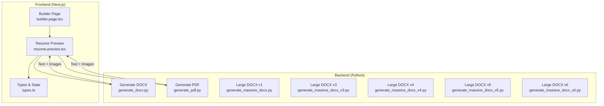
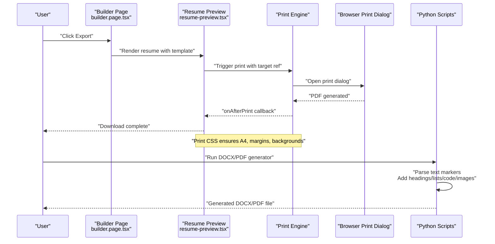
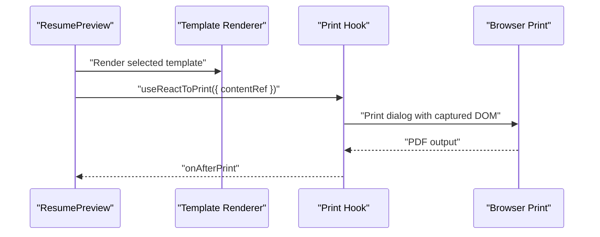
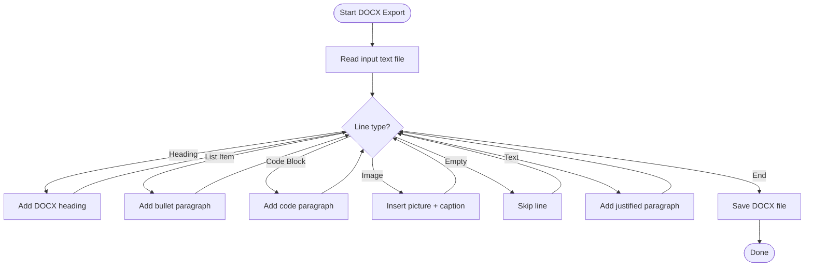
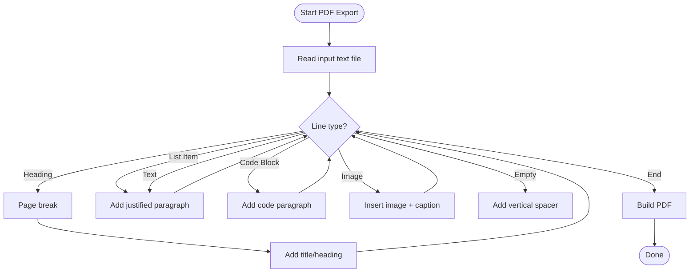
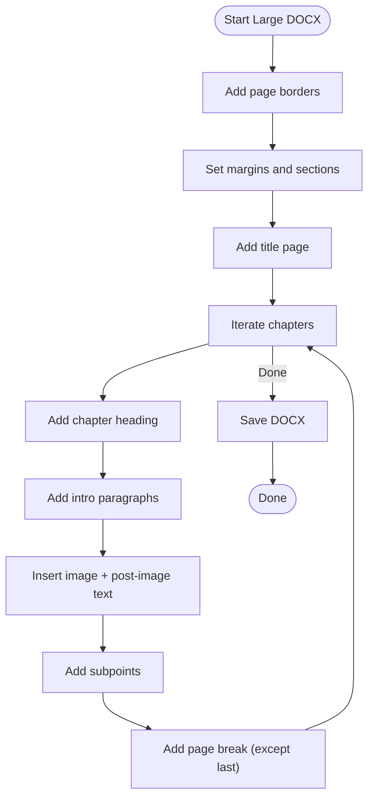
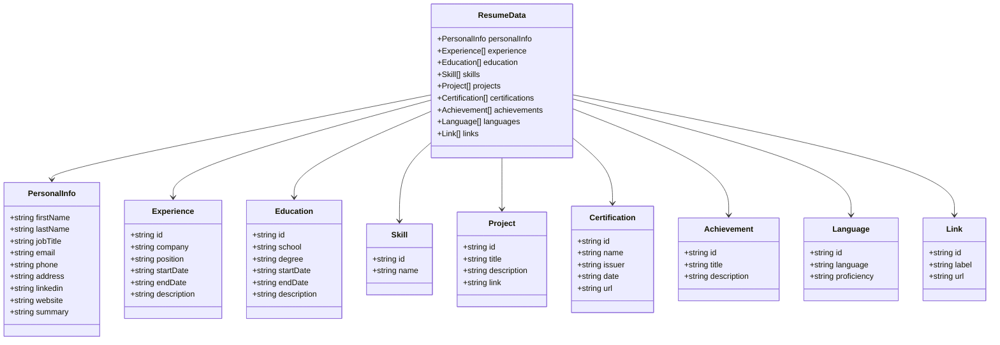
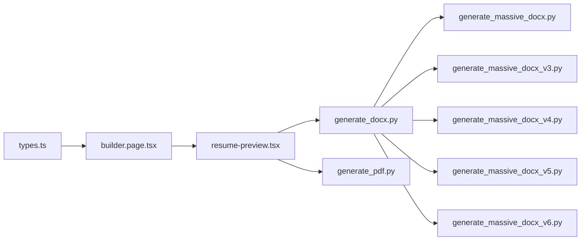

# Export and Printing

<cite>
**Referenced Files in This Document**
- [resume-preview.tsx](file://src/components/resume/resume-preview.tsx)
- [builder.page.tsx](file://src/app/builder/page.tsx)
- [types.ts](file://src/lib/types.ts)
- [generate_pdf.py](file://src/generate_pdf.py)
- [generate_docx.py](file://src/generate_docx.py)
- [generate_massive_docx.py](file://src/generate_massive_docx.py)
- [generate_massive_docx_v3.py](file://src/generate_massive_docx_v3.py)
- [generate_massive_docx_v4.py](file://src/generate_massive_docx_v4.py)
- [generate_massive_docx_v5.py](file://src/generate_massive_docx_v5.py)
- [generate_massive_docx_v6.py](file://src/generate_massive_docx_v6.py)
</cite>

## Table of Contents
1. [Introduction](#introduction)
2. [Project Structure](#project-structure)
3. [Core Components](#core-components)
4. [Architecture Overview](#architecture-overview)
5. [Detailed Component Analysis](#detailed-component-analysis)
6. [Dependency Analysis](#dependency-analysis)
7. [Performance Considerations](#performance-considerations)
8. [Troubleshooting Guide](#troubleshooting-guide)
9. [Conclusion](#conclusion)

## Introduction
This document explains the export and printing functionality of the resume builder application. It covers:
- How the frontend generates downloadable PDFs using a client-side print pipeline
- How Python scripts generate DOCX and PDF documents from structured text
- How images are embedded and formatted across formats
- How to customize exports, handle large documents, and optimize performance
- Guidance for extending export formats and troubleshooting common issues

## Project Structure
The export pipeline spans both the frontend React components and backend Python scripts:
- Frontend: A React preview component renders the resume and triggers a browser-based print workflow to produce a PDF.
- Backend: Python scripts transform structured text into DOCX and PDF documents with consistent formatting and image handling.

**Diagram sources**
- [builder.page.tsx:11-78](file://src/app/builder/page.tsx#L11-L78)
- [resume-preview.tsx:789-800](file://src/components/resume/resume-preview.tsx#L789-L800)
- [types.ts:69-103](file://src/lib/types.ts#L69-L103)
- [generate_docx.py:6-79](file://src/generate_docx.py#L6-L79)
- [generate_pdf.py:8-84](file://src/generate_pdf.py#L8-L84)
- [generate_massive_docx.py:140-179](file://src/generate_massive_docx.py#L140-L179)
- [generate_massive_docx_v3.py:401-571](file://src/generate_massive_docx_v3.py#L401-L571)
- [generate_massive_docx_v4.py:433-520](file://src/generate_massive_docx_v4.py#L433-L520)
- [generate_massive_docx_v5.py:428-517](file://src/generate_massive_docx_v5.py#L428-L517)
- [generate_massive_docx_v6.py:428-516](file://src/generate_massive_docx_v6.py#L428-L516)

**Section sources**
- [builder.page.tsx:11-78](file://src/app/builder/page.tsx#L11-L78)
- [resume-preview.tsx:789-800](file://src/components/resume/resume-preview.tsx#L789-L800)
- [types.ts:69-103](file://src/lib/types.ts#L69-L103)

## Core Components
- Resume Preview (client-side PDF export):
  - Uses a print engine to capture the resume DOM and produce a PDF via the browser’s print dialog.
  - Applies print-specific CSS to ensure consistent page sizes, margins, and background rendering.
- Python DOCX/PDF generators:
  - Parse structured text with special markers for headings, lists, code blocks, and images.
  - Render DOCX with consistent fonts, spacing, and borders; embed images with captions.
  - Generate PDFs with justified text, page breaks, and image placement.

Key export behaviors:
- Formatting preservation: Headings, lists, code blocks, and justified text are preserved across formats.
- Image handling: Special markers embed images and add captions; scripts resolve image paths and handle missing files.
- Layout optimization: Page breaks and print CSS ensure multi-page documents render cleanly.

**Section sources**
- [resume-preview.tsx:789-800](file://src/components/resume/resume-preview.tsx#L789-L800)
- [generate_docx.py:6-79](file://src/generate_docx.py#L6-L79)
- [generate_pdf.py:8-84](file://src/generate_pdf.py#L8-L84)

## Architecture Overview
The export architecture combines a React-based print pipeline with Python-based document generation.

**Diagram sources**
- [builder.page.tsx:11-78](file://src/app/builder/page.tsx#L11-L78)
- [resume-preview.tsx:789-800](file://src/components/resume/resume-preview.tsx#L789-L800)
- [generate_docx.py:6-79](file://src/generate_docx.py#L6-L79)
- [generate_pdf.py:8-84](file://src/generate_pdf.py#L8-L84)

## Detailed Component Analysis

### Frontend Export: Resume Preview and Print Pipeline
- Purpose: Render the resume template and trigger a client-side PDF export.
- Key mechanics:
  - A ref targets the resume content to be exported.
  - A print engine captures the DOM subtree and opens the browser’s print dialog.
  - Print CSS ensures A4 page size, zero margins, and background rendering.
  - Loading state prevents concurrent edits during export.

**Diagram sources**
- [resume-preview.tsx:789-800](file://src/components/resume/resume-preview.tsx#L789-L800)

**Section sources**
- [resume-preview.tsx:789-800](file://src/components/resume/resume-preview.tsx#L789-L800)

### Python DOCX Export: Structured Text to DOCX
- Input: Plain text with markers for headings, lists, code blocks, and images.
- Features:
  - Headings mapped to DOCX levels with centering or left alignment.
  - Lists rendered with bullet styles.
  - Code blocks formatted with monospaced fonts and tight spacing.
  - Images inserted with optional captions; missing images logged as placeholders.
  - Default font and paragraph spacing configured globally.

**Diagram sources**
- [generate_docx.py:6-79](file://src/generate_docx.py#L6-L79)

**Section sources**
- [generate_docx.py:6-79](file://src/generate_docx.py#L6-L79)

### Python PDF Export: Structured Text to PDF
- Input: Plain text with markers for headings, lists, code blocks, and images.
- Features:
  - Page size A4 with generous margins.
  - Custom paragraph styles for justification, centering, captions, and code.
  - Page breaks before top-level headings.
  - Image insertion with fixed dimensions and optional captions; missing images reported.

**Diagram sources**
- [generate_pdf.py:8-84](file://src/generate_pdf.py#L8-L84)

**Section sources**
- [generate_pdf.py:8-84](file://src/generate_pdf.py#L8-L84)

### Large DOCX Generators: Advanced Formatting and Borders
- Purpose: Produce multi-chapter, large-format reports with consistent styling and page borders.
- Notable features:
  - Page borders added via DOCX XML elements.
  - Consistent fonts, line spacing, and heading weights.
  - Code blocks formatted with Courier New and tight spacing.
  - Images inserted with captions and centered alignment.
  - Multi-section chapters with page breaks between topics.

**Diagram sources**
- [generate_massive_docx.py:140-179](file://src/generate_massive_docx.py#L140-L179)
- [generate_massive_docx_v3.py:401-571](file://src/generate_massive_docx_v3.py#L401-L571)
- [generate_massive_docx_v4.py:433-520](file://src/generate_massive_docx_v4.py#L433-L520)
- [generate_massive_docx_v5.py:428-517](file://src/generate_massive_docx_v5.py#L428-L517)
- [generate_massive_docx_v6.py:428-516](file://src/generate_massive_docx_v6.py#L428-L516)

**Section sources**
- [generate_massive_docx.py:140-179](file://src/generate_massive_docx.py#L140-L179)
- [generate_massive_docx_v3.py:401-571](file://src/generate_massive_docx_v3.py#L401-L571)
- [generate_massive_docx_v4.py:433-520](file://src/generate_massive_docx_v4.py#L433-L520)
- [generate_massive_docx_v5.py:428-517](file://src/generate_massive_docx_v5.py#L428-L517)
- [generate_massive_docx_v6.py:428-516](file://src/generate_massive_docx_v6.py#L428-L516)

### Data Model and State Flow
- The resume data model defines all sections (personal info, experience, education, skills, projects, certifications, achievements, languages, links).
- The builder page manages state, persists to session storage, and feeds the preview component.
- The preview component selects a template and triggers the print/export pipeline.

**Diagram sources**
- [types.ts:69-103](file://src/lib/types.ts#L69-L103)

**Section sources**
- [types.ts:69-103](file://src/lib/types.ts#L69-L103)
- [builder.page.tsx:11-78](file://src/app/builder/page.tsx#L11-L78)

## Dependency Analysis
- Frontend dependencies:
  - Resume preview depends on the template renderer and the print engine.
  - The builder page depends on the resume data model and template selection.
- Backend dependencies:
  - DOCX/PDF scripts depend on the input text format and image paths.
  - Large DOCX scripts depend on consistent chapter structures and image locations.

**Diagram sources**
- [types.ts:69-103](file://src/lib/types.ts#L69-L103)
- [builder.page.tsx:11-78](file://src/app/builder/page.tsx#L11-L78)
- [resume-preview.tsx:789-800](file://src/components/resume/resume-preview.tsx#L789-L800)
- [generate_docx.py:6-79](file://src/generate_docx.py#L6-L79)
- [generate_pdf.py:8-84](file://src/generate_pdf.py#L8-L84)
- [generate_massive_docx.py:140-179](file://src/generate_massive_docx.py#L140-L179)
- [generate_massive_docx_v3.py:401-571](file://src/generate_massive_docx_v3.py#L401-L571)
- [generate_massive_docx_v4.py:433-520](file://src/generate_massive_docx_v4.py#L433-L520)
- [generate_massive_docx_v5.py:428-517](file://src/generate_massive_docx_v5.py#L428-L517)
- [generate_massive_docx_v6.py:428-516](file://src/generate_massive_docx_v6.py#L428-L516)

**Section sources**
- [types.ts:69-103](file://src/lib/types.ts#L69-L103)
- [builder.page.tsx:11-78](file://src/app/builder/page.tsx#L11-L78)
- [resume-preview.tsx:789-800](file://src/components/resume/resume-preview.tsx#L789-L800)

## Performance Considerations
- Frontend export:
  - Keep the exported DOM lightweight; avoid heavy third-party widgets.
  - Use print CSS to minimize layout thrashing and ensure deterministic page breaks.
  - Debounce or disable user edits during export to prevent inconsistent snapshots.
- Python export:
  - For large DOCX generation, batch operations and avoid repeated style reconfiguration.
  - Pre-validate image paths to reduce runtime exceptions and retries.
  - Use consistent fonts and spacing to reduce rendering overhead.

[No sources needed since this section provides general guidance]

## Troubleshooting Guide
Common issues and resolutions:
- Missing images in DOCX/PDF:
  - Ensure image paths exist; scripts resolve a brain directory and insert placeholders when missing.
  - Validate that image filenames and captions are correctly formatted in the input text.
- Backgrounds not printing:
  - Confirm print CSS applies background rendering for the template’s color scheme.
  - Use print-specific CSS to force background colors and page borders.
- Page breaks cutting content:
  - Apply print CSS to avoid page splits mid-block; use page break rules for sections.
- Large document generation slowness:
  - Reduce image sizes and use vector formats when possible.
  - Split content into smaller batches if generating extremely large reports.

**Section sources**
- [generate_docx.py:48-70](file://src/generate_docx.py#L48-L70)
- [generate_pdf.py:56-77](file://src/generate_pdf.py#L56-L77)
- [generate_massive_docx.py:8-28](file://src/generate_massive_docx.py#L8-L28)

## Conclusion
The resume builder provides a robust export pipeline:
- Client-side PDF export via a print engine with print CSS ensures consistent, high-fidelity output.
- Python-based DOCX and PDF generators preserve formatting, handle images, and scale to large documents.
- Extending export formats is straightforward: adapt the input text format and add new Python generators or modify the print pipeline.

[No sources needed since this section summarizes without analyzing specific files]