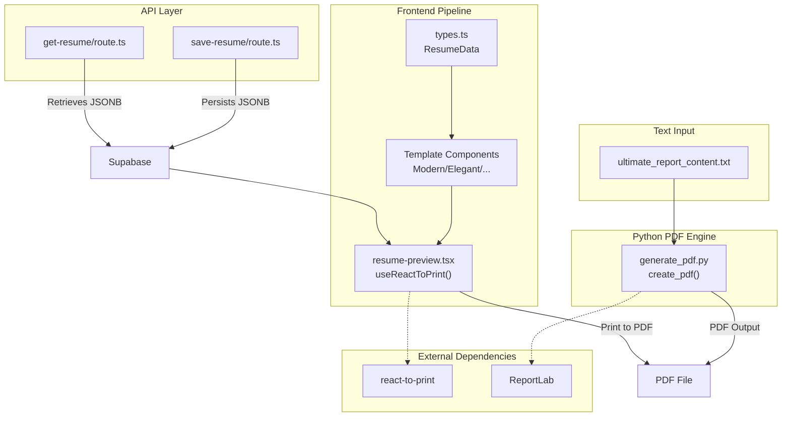
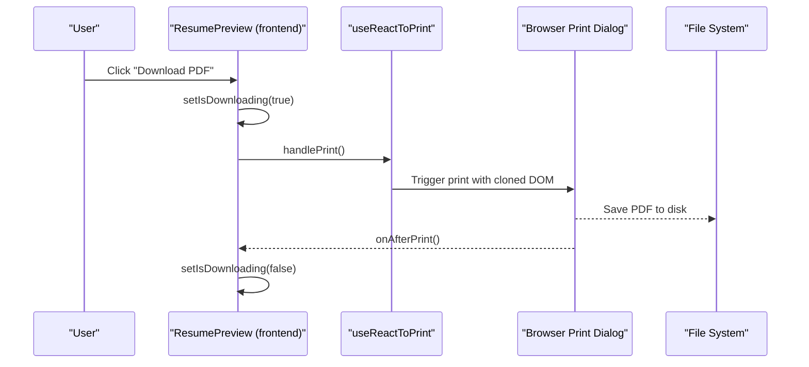
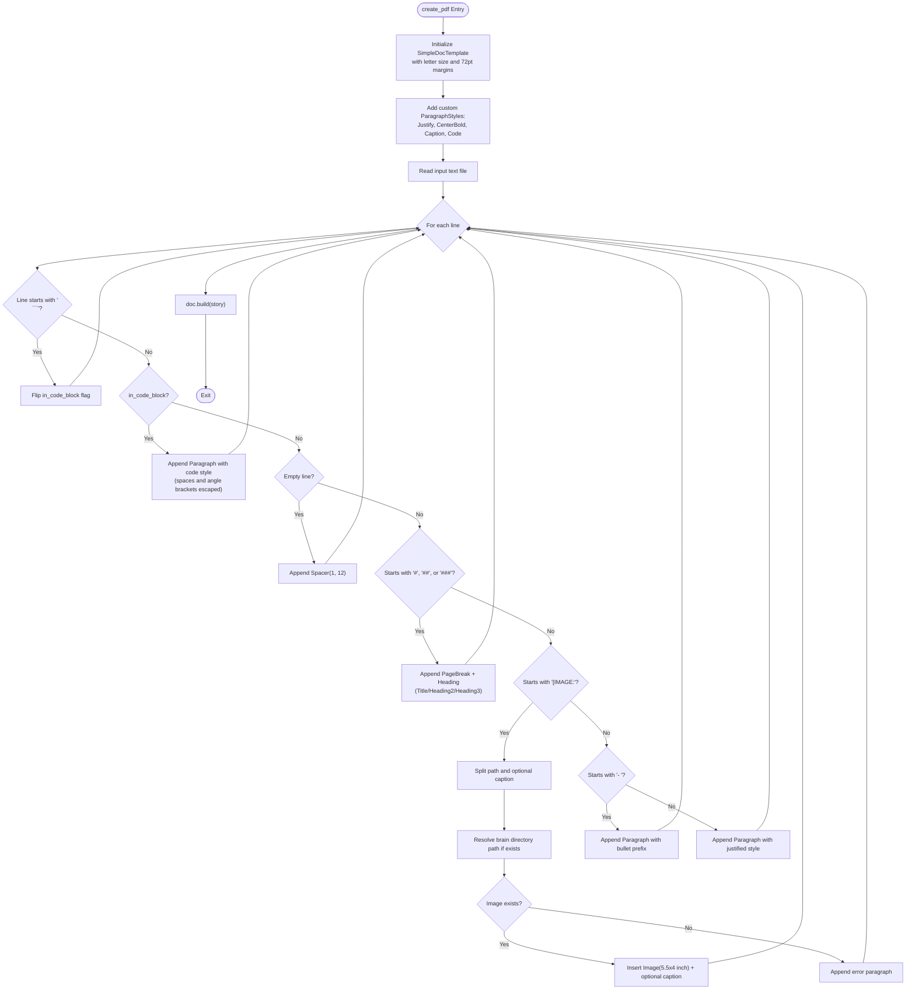
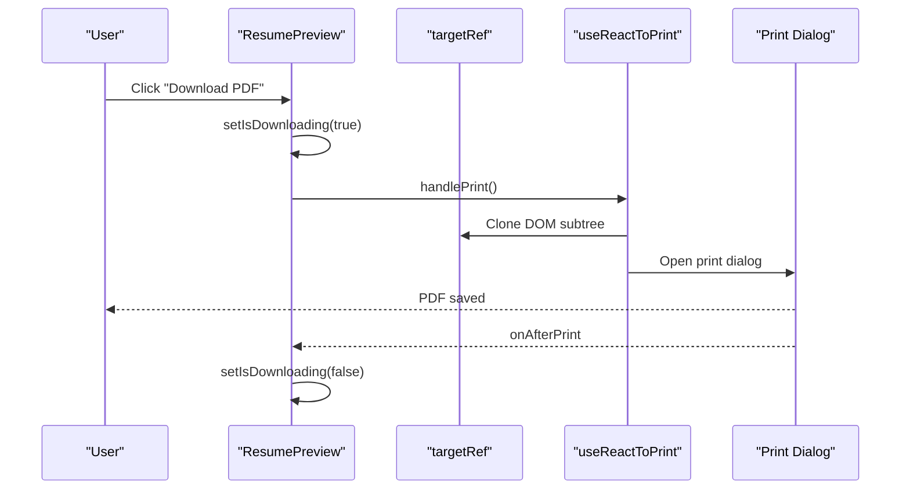
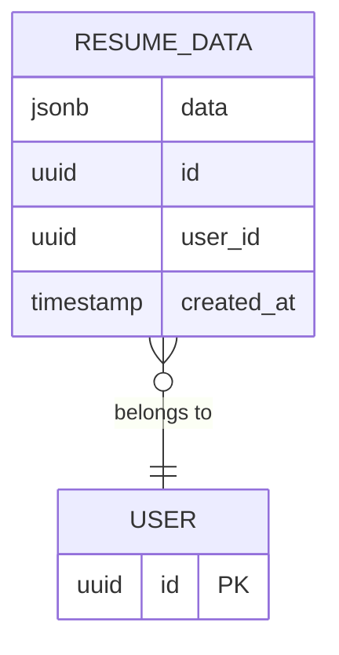
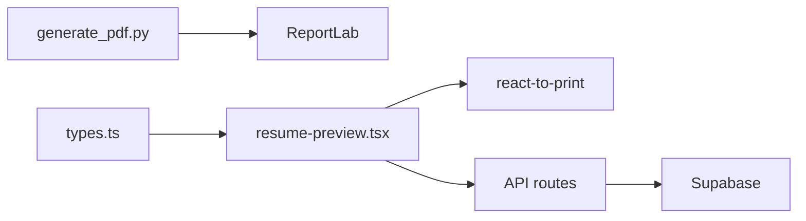

# PDF Generation

<cite>
**Referenced Files in This Document**
- [generate_pdf.py](file://src/generate_pdf.py)
- [ultimate_report_content.txt](file://src/ultimate_report_content.txt)
- [resume-preview.tsx](file://src/components/resume/resume-preview.tsx)
- [types.ts](file://src/lib/types.ts)
- [route.ts (get-resume)](file://src/app/api/get-resume/route.ts)
- [route.ts (save-resume)](file://src/app/api/save-resume/route.ts)
- [Templates Page](file://src/app/templates/page.tsx)
- [package.json](file://package.json)
</cite>

## Table of Contents
1. [Introduction](#introduction)
2. [Project Structure](#project-structure)
3. [Core Components](#core-components)
4. [Architecture Overview](#architecture-overview)
5. [Detailed Component Analysis](#detailed-component-analysis)
6. [Dependency Analysis](#dependency-analysis)
7. [Performance Considerations](#performance-considerations)
8. [Troubleshooting Guide](#troubleshooting-guide)
9. [Conclusion](#conclusion)
10. [Appendices](#appendices)

## Introduction
This document explains the PDF generation system used by the project. It covers the ReportLab-based implementation via the create_pdf function, the document processing workflow from text files to formatted PDF output, and the markdown-like syntax parsing used to transform plain text into structured PDF content. It also details custom paragraph styles, page formatting, margins, and layout optimization. Practical examples, error handling for missing images, integration with the resume content pipeline, performance considerations for large documents, and guidance on extending formatting options are included.

## Project Structure
The PDF generation capability is implemented in a Python script that reads a specially formatted text file and produces a PDF. The same content is also rendered live in the Next.js frontend using React components and printed to PDF client-side via a dedicated library. The resume data model is defined in TypeScript and consumed by the frontend templates.

**Diagram sources**
- [generate_pdf.py:8-87](file://src/generate_pdf.py#L8-L87)
- [resume-preview.tsx:789-879](file://src/components/resume/resume-preview.tsx#L789-L879)
- [types.ts:69-103](file://src/lib/types.ts#L69-L103)
- [route.ts (save-resume):31-82](file://src/app/api/save-resume/route.ts#L31-L82)
- [route.ts (get-resume):10-57](file://src/app/api/get-resume/route.ts#L10-L57)
- [package.json:26-27](file://package.json#L26-L27)

**Section sources**
- [generate_pdf.py:8-87](file://src/generate_pdf.py#L8-L87)
- [resume-preview.tsx:789-879](file://src/components/resume/resume-preview.tsx#L789-L879)
- [types.ts:69-103](file://src/lib/types.ts#L69-L103)
- [route.ts (save-resume):31-82](file://src/app/api/save-resume/route.ts#L31-L82)
- [route.ts (get-resume):10-57](file://src/app/api/get-resume/route.ts#L10-L57)
- [package.json:26-27](file://package.json#L26-L27)

## Core Components
- ReportLab-based PDF writer: Implements create_pdf to parse a text file and produce a PDF with custom styles, headers, bullet points, code blocks, and images.
- Frontend PDF pipeline: Uses a React component with a print hook to capture the rendered resume and trigger the browser’s print dialog for PDF output.
- Resume data model: Defines the shape of resume content used by the frontend templates and persisted in the database.
- API routes: Provide save and load operations for resume data stored as JSONB in Supabase.

**Section sources**
- [generate_pdf.py:8-87](file://src/generate_pdf.py#L8-L87)
- [resume-preview.tsx:789-879](file://src/components/resume/resume-preview.tsx#L789-L879)
- [types.ts:69-103](file://src/lib/types.ts#L69-L103)
- [route.ts (save-resume):31-82](file://src/app/api/save-resume/route.ts#L31-L82)
- [route.ts (get-resume):10-57](file://src/app/api/get-resume/route.ts#L10-L57)

## Architecture Overview
The system supports two complementary PDF generation paths:
- Batch generation via Python: Reads a text file with markdown-like directives and writes a PDF using ReportLab.
- Live generation via browser: Renders a resume template in React, captures it with a print hook, and lets the browser’s native print dialog produce a PDF.

**Diagram sources**
- [resume-preview.tsx:802-808](file://src/components/resume/resume-preview.tsx#L802-L808)
- [resume-preview.tsx:796-800](file://src/components/resume/resume-preview.tsx#L796-L800)

**Section sources**
- [resume-preview.tsx:789-879](file://src/components/resume/resume-preview.tsx#L789-L879)

## Detailed Component Analysis

### ReportLab-Based PDF Writer (Python)
The create_pdf function orchestrates:
- Document setup with US Letter size and uniform 72-point margins.
- Custom paragraph styles for justified text, centered bold headings, captions, and code blocks.
- Parsing of the input text file:
  - Headers: Lines starting with #, ##, and ### become page breaks and headings.
  - Bullet points: Lines starting with - are rendered as bulleted paragraphs.
  - Code blocks: Enclosed between triple backticks, rendered in a monospaced font with indentation and spacing.
  - Images: Lines starting with [IMAGE: ...] are parsed for path and optional caption; images are inserted with fixed dimensions and optional captions.
  - Empty lines: Rendered as vertical spacers.
- Error handling for missing images and missing input files.

**Diagram sources**
- [generate_pdf.py](file://src/generate_pdf.py#L8-L87)

**Section sources**
- [generate_pdf.py](file://src/generate_pdf.py#L8-L87)

### Markdown-like Syntax Parsing
- Headers: #, ##, ### map to page breaks and ReportLab heading styles.
- Bullet points: - prefix is preserved and rendered with justified alignment.
- Code blocks: Triple backtick delimiters toggle a code rendering mode; content is escaped and styled in a monospaced font.
- Images: [IMAGE: path | caption] parses the path and optional caption; supports a brain directory override for local resolution.

**Section sources**
- [generate_pdf.py](file://src/generate_pdf.py#L34-L81)
- [ultimate_report_content.txt](file://src/ultimate_report_content.txt#L1-L203)

### Custom Paragraph Styles and Layout
- Justified paragraphs with controlled leading and font size.
- Centered bold headings for top-level sections.
- Caption style for image subtitles.
- Monospaced code blocks with indentation and spacing adjustments.
- Uniform 72-point margins on all sides for US Letter paper.

**Section sources**
- [generate_pdf.py](file://src/generate_pdf.py#L9-L18)

### Frontend PDF Pipeline (Client-Side)
The frontend uses a React component with a print hook to capture the rendered resume template and produce a PDF via the browser’s print dialog. The component:
- Holds a ref to the printable area.
- Disables the download button during generation to avoid race conditions.
- Switches among multiple resume templates based on props.
- Exposes a “Download PDF” action that triggers the print workflow.

**Diagram sources**
- [resume-preview.tsx](file://src/components/resume/resume-preview.tsx#L802-L808)
- [resume-preview.tsx](file://src/components/resume/resume-preview.tsx#L796-L800)

**Section sources**
- [resume-preview.tsx](file://src/components/resume/resume-preview.tsx#L789-L879)

### Resume Data Model and API Integration
- The ResumeData interface defines the structure of resume content used by the frontend templates.
- API routes persist and retrieve resume data as JSONB in Supabase, enabling seamless integration with the frontend pipeline.

**Diagram sources**
- [types.ts](file://src/lib/types.ts#L69-L79)
- [route.ts (save-resume)](file://src/app/api/save-resume/route.ts#L56-L64)
- [route.ts (get-resume)](file://src/app/api/get-resume/route.ts#L34-L39)

**Section sources**
- [types.ts](file://src/lib/types.ts#L69-L103)
- [route.ts (save-resume)](file://src/app/api/save-resume/route.ts#L31-L82)
- [route.ts (get-resume)](file://src/app/api/get-resume/route.ts#L10-L57)

## Dependency Analysis
- Python PDF engine depends on ReportLab for document assembly and styling.
- Frontend depends on a print-to-PDF library to clone the DOM and trigger the browser’s print dialog.
- The resume data model is shared across frontend templates and API routes.

**Diagram sources**
- [generate_pdf.py:1-6](file://src/generate_pdf.py#L1-L6)
- [resume-preview.tsx:789-879](file://src/components/resume/resume-preview.tsx#L789-L879)
- [types.ts:69-103](file://src/lib/types.ts#L69-L103)
- [route.ts (save-resume):31-82](file://src/app/api/save-resume/route.ts#L31-L82)
- [route.ts (get-resume):10-57](file://src/app/api/get-resume/route.ts#L10-L57)
- [package.json:26-27](file://package.json#L26-L27)

**Section sources**
- [generate_pdf.py:1-6](file://src/generate_pdf.py#L1-L6)
- [resume-preview.tsx:789-879](file://src/components/resume/resume-preview.tsx#L789-L879)
- [types.ts:69-103](file://src/lib/types.ts#L69-L103)
- [route.ts (save-resume):31-82](file://src/app/api/save-resume/route.ts#L31-L82)
- [route.ts (get-resume):10-57](file://src/app/api/get-resume/route.ts#L10-L57)
- [package.json:26-27](file://package.json#L26-L27)

## Performance Considerations
- Large documents:
  - Prefer client-side PDF generation for speed and cost-effectiveness.
  - Minimize heavy images and ensure they are appropriately sized to reduce rendering overhead.
  - Keep code blocks concise; long code sections increase PDF size and rendering time.
- Memory management:
  - Avoid holding large DOM subtrees in memory unnecessarily; release references after printing.
  - Limit concurrent PDF generation attempts to prevent contention.
- Styling:
  - Use minimal CSS overrides; complex styles can bloat the PDF and slow rendering.
  - Favor simple, print-friendly layouts to reduce page breaks and reflows.

[No sources needed since this section provides general guidance]

## Troubleshooting Guide
- Missing images:
  - The parser checks for the image path and prints an error paragraph if the file is not found. Verify the path and brain directory resolution logic.
- File not found:
  - If the input text file does not exist, the function logs an error and exits early.
- Print dialog issues:
  - Ensure the print dialog is enabled and not blocked by pop-up blockers.
  - Confirm that the printable area is correctly referenced and visible.
- Browser-specific quirks:
  - Some browsers inject headers/footers or margins; use print-specific CSS to normalize output.

**Section sources**
- [generate_pdf.py:22-24](file://src/generate_pdf.py#L22-L24)
- [generate_pdf.py:66-76](file://src/generate_pdf.py#L66-L76)
- [resume-preview.tsx:802-808](file://src/components/resume/resume-preview.tsx#L802-L808)

## Conclusion
The project provides two complementary PDF generation paths: a fast, client-side pipeline for immediate, high-fidelity PDF exports, and a robust Python-based engine for batch processing of markdown-like content. Together, they enable flexible, scalable PDF output tailored to the resume builder’s needs.

[No sources needed since this section summarizes without analyzing specific files]

## Appendices

### Practical Examples
- Generating a PDF from a markdown-like text file:
  - Prepare a text file with headers, bullet points, code blocks, and image directives.
  - Invoke the Python script with the input and desired output file paths.
- Customizing output appearance:
  - Adjust paragraph styles and margins in the Python script to change font sizes, leading, and spacing.
  - Extend the frontend templates to support additional sections or styling, then trigger the print workflow.

**Section sources**
- [generate_pdf.py:8-87](file://src/generate_pdf.py#L8-L87)
- [ultimate_report_content.txt:1-203](file://src/ultimate_report_content.txt#L1-L203)
- [resume-preview.tsx:810-839](file://src/components/resume/resume-preview.tsx#L810-L839)

### Extending Formatting Options
- Add new paragraph styles in the Python script to support additional text treatments.
- Introduce new markdown-like directives in the parser to handle specialized content types.
- On the frontend, extend the template components to render additional resume sections and integrate with the print workflow.

**Section sources**
- [generate_pdf.py:14-18](file://src/generate_pdf.py#L14-L18)
- [resume-preview.tsx:810-839](file://src/components/resume/resume-preview.tsx#L810-L839)