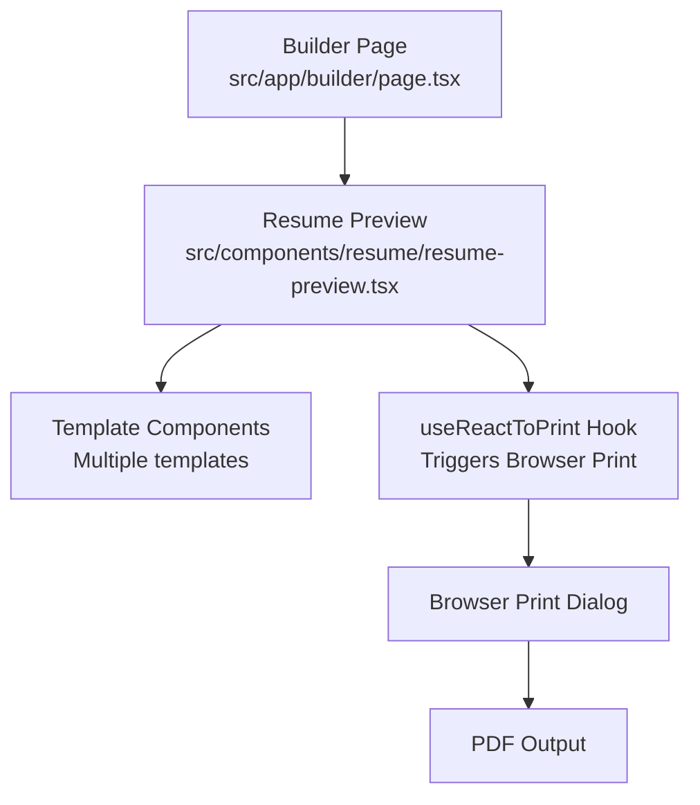
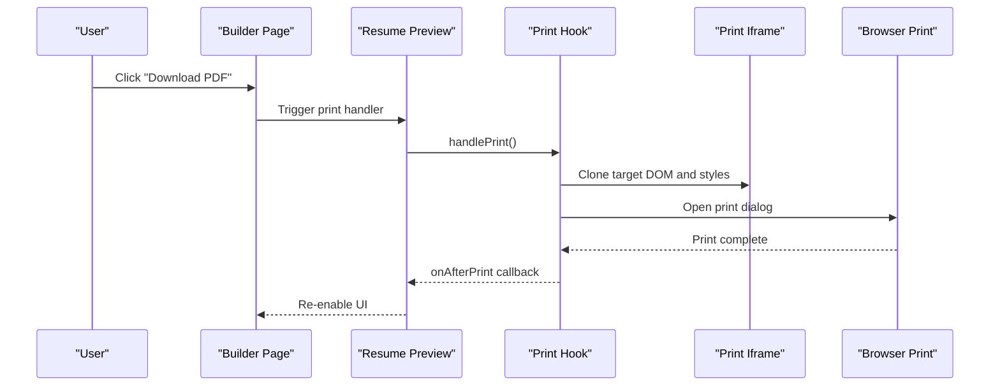
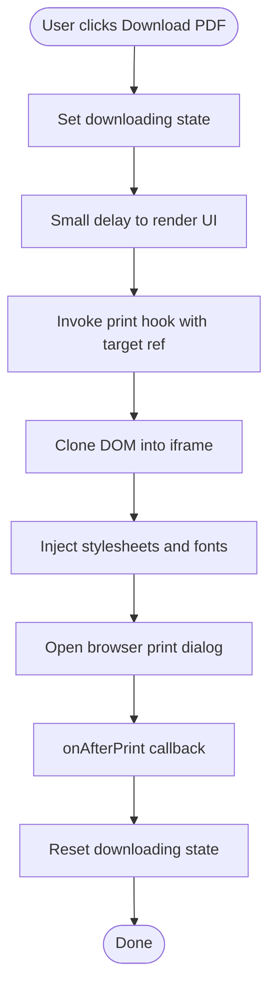
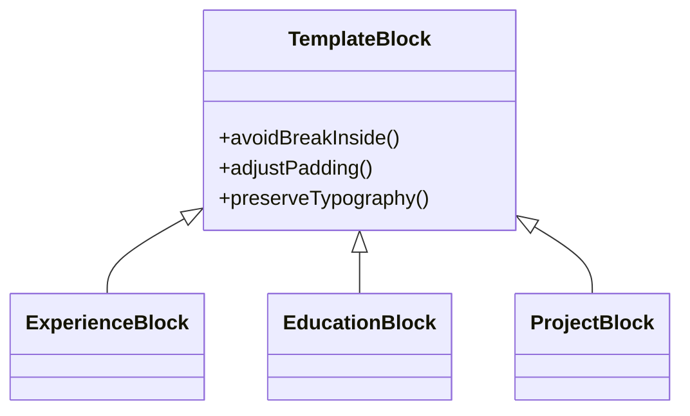
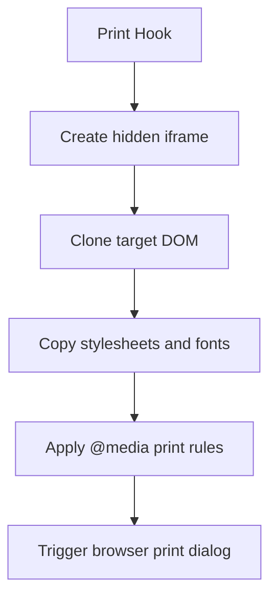
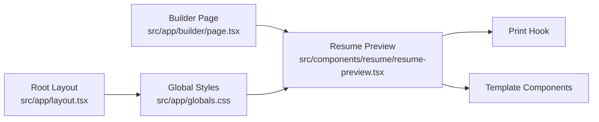

# Print Functionality

<cite>
**Referenced Files in This Document**
- [resume-preview.tsx](file://src/components/resume/resume-preview.tsx)
- [page.tsx](file://src/app/builder/page.tsx)
- [globals.css](file://src/app/globals.css)
- [layout.tsx](file://src/app/layout.tsx)
- [types.ts](file://src/lib/types.ts)
- [generate_massive_docx.py](file://src/generate_massive_docx.py)
</cite>

## Table of Contents
1. [Introduction](#introduction)
2. [Project Structure](#project-structure)
3. [Core Components](#core-components)
4. [Architecture Overview](#architecture-overview)
5. [Detailed Component Analysis](#detailed-component-analysis)
6. [Dependency Analysis](#dependency-analysis)
7. [Performance Considerations](#performance-considerations)
8. [Troubleshooting Guide](#troubleshooting-guide)
9. [Conclusion](#conclusion)

## Introduction
This document explains the browser-based print functionality for resume generation. It focuses on how the application renders printable resumes, the CSS media queries and print-specific styling used to optimize display for printing, page breaks, margins, and layout adjustments. It also covers the integration with the browser’s print dialog, print preview behavior, printer-specific optimizations, responsive design considerations for different paper sizes and orientations, and guidance for extending and customizing print layouts.

## Project Structure
The print pipeline centers on the resume preview component that renders the selected template and exposes a “Download PDF” action. Internally, this action triggers the browser’s native print dialog via a third-party library that clones the DOM into an invisible iframe and applies print-specific CSS rules.

**Diagram sources**
- [page.tsx:1-79](file://src/app/builder/page.tsx#L1-79)
- [resume-preview.tsx:789-808](file://src/components/resume/resume-preview.tsx#L789-L808)

**Section sources**
- [page.tsx:1-79](file://src/app/builder/page.tsx#L1-79)
- [resume-preview.tsx:841-879](file://src/components/resume/resume-preview.tsx#L841-L879)

## Core Components
- Resume Preview: Hosts the selected template, exposes a “Download PDF” action, and manages the print target reference.
- Template Components: Provide the visual structure for each resume style.
- Print Integration: Uses a print hook to clone the DOM into an iframe and trigger the browser’s print dialog.

Key responsibilities:
- Provide a print target DOM node for the print engine.
- Apply print-specific styles and page sizing.
- Ensure page breaks occur between logical resume sections.
- Preserve typography and background colors for print.

**Section sources**
- [resume-preview.tsx:789-808](file://src/components/resume/resume-preview.tsx#L789-L808)
- [resume-preview.tsx:841-879](file://src/components/resume/resume-preview.tsx#L841-L879)
- [types.ts:69-79](file://src/lib/types.ts#L69-L79)

## Architecture Overview
The print flow is initiated by the user clicking “Download PDF.” The action sets a short timeout to ensure UI state updates, then invokes the print hook. The hook:
- Clones the target DOM node into an invisible iframe.
- Injects all relevant stylesheets and fonts.
- Triggers the browser’s native print dialog.
- Returns focus to the application after printing completes.

**Diagram sources**
- [resume-preview.tsx:796-800](file://src/components/resume/resume-preview.tsx#L796-L800)
- [resume-preview.tsx:802-808](file://src/components/resume/resume-preview.tsx#L802-L808)

## Detailed Component Analysis

### Resume Preview and Print Target
- The preview component defines a ref pointing to the printable area and passes it to the print hook.
- The printable area is sized to approximate A4 proportions and padded appropriately depending on the template.
- The print action disables the button and shows a loading indicator while the browser processes the print job.

**Diagram sources**
- [resume-preview.tsx:802-808](file://src/components/resume/resume-preview.tsx#L802-L808)
- [resume-preview.tsx:796-800](file://src/components/resume/resume-preview.tsx#L796-L800)

**Section sources**
- [resume-preview.tsx:854-864](file://src/components/resume/resume-preview.tsx#L854-L864)
- [resume-preview.tsx:802-808](file://src/components/resume/resume-preview.tsx#L802-L808)

### Template-Level Print Considerations
- Many templates apply a page break avoidance class to individual blocks (e.g., experience, education, projects) to keep related content together across pages.
- Some templates adjust padding and layout to fit within print margins and A4 constraints.

**Diagram sources**
- [resume-preview.tsx:58-72](file://src/components/resume/resume-preview.tsx#L58-L72)
- [resume-preview.tsx:84-100](file://src/components/resume/resume-preview.tsx#L84-L100)
- [resume-preview.tsx:112-122](file://src/components/resume/resume-preview.tsx#L112-L122)

**Section sources**
- [resume-preview.tsx:58-72](file://src/components/resume/resume-preview.tsx#L58-L72)
- [resume-preview.tsx:84-100](file://src/components/resume/resume-preview.tsx#L84-L100)
- [resume-preview.tsx:112-122](file://src/components/resume/resume-preview.tsx#L112-L122)

### Print Styles and Media Queries
The application relies on print-specific CSS rules to:
- Define page size and margins.
- Preserve background colors and graphics.
- Control page breaks and avoid breaking within blocks.

These behaviors are documented in the project’s generation script and are applied via the print hook’s iframe injection.

**Diagram sources**
- [generate_massive_docx.py:115-120](file://src/generate_massive_docx.py#L115-L120)

**Section sources**
- [generate_massive_docx.py:115-120](file://src/generate_massive_docx.py#L115-L120)

## Dependency Analysis
- The builder page orchestrates the preview and template selection.
- The preview component depends on the print hook and template components.
- Global theme and typography are defined in the global stylesheet and influence print rendering.

**Diagram sources**
- [layout.tsx:25-49](file://src/app/layout.tsx#L25-L49)
- [globals.css:161-169](file://src/app/globals.css#L161-L169)
- [page.tsx:1-79](file://src/app/builder/page.tsx#L1-79)
- [resume-preview.tsx:841-879](file://src/components/resume/resume-preview.tsx#L841-L879)

**Section sources**
- [layout.tsx:25-49](file://src/app/layout.tsx#L25-L49)
- [globals.css:161-169](file://src/app/globals.css#L161-L169)
- [page.tsx:1-79](file://src/app/builder/page.tsx#L1-79)
- [resume-preview.tsx:841-879](file://src/components/resume/resume-preview.tsx#L841-L879)

## Performance Considerations
- The print action uses a minimal delay to ensure UI state reflects the click before invoking the print engine.
- The print hook clones only the target DOM subtree, minimizing overhead.
- Background colors and graphics are preserved by forcing exact color printing in print styles.

[No sources needed since this section provides general guidance]

## Troubleshooting Guide
Common issues and remedies:
- Background colors not printing: Ensure print styles force background colors to print.
- Content cut mid-block: Apply page break avoidance to block-level containers.
- Excess whitespace or margins: Use print media queries to reset margins and set explicit page size.
- Fonts not rendering: Confirm fonts are available inside the print iframe.
- Orientation mismatch: Set portrait or landscape in print media queries as needed.

Actionable references:
- Print engine behavior and DOM cloning: [resume-preview.tsx:796-800](file://src/components/resume/resume-preview.tsx#L796-L800)
- Print-specific CSS rules and page sizing: [generate_massive_docx.py:115-120](file://src/generate_massive_docx.py#L115-L120)
- Page break avoidance on blocks: [resume-preview.tsx:58-72](file://src/components/resume/resume-preview.tsx#L58-L72)

**Section sources**
- [resume-preview.tsx:796-800](file://src/components/resume/resume-preview.tsx#L796-L800)
- [generate_massive_docx.py:115-120](file://src/generate_massive_docx.py#L115-L120)
- [resume-preview.tsx:58-72](file://src/components/resume/resume-preview.tsx#L58-L72)

## Conclusion
The print functionality integrates a focused preview component, a print hook that clones the DOM into an iframe, and print-specific CSS rules to produce high-quality, A4-sized PDFs. By applying page break avoidance, resetting margins, preserving background colors, and controlling typography, the system ensures professional output across browsers. Extending print capabilities involves adding or refining print media queries and ensuring template blocks are wrapped to avoid mid-break content.