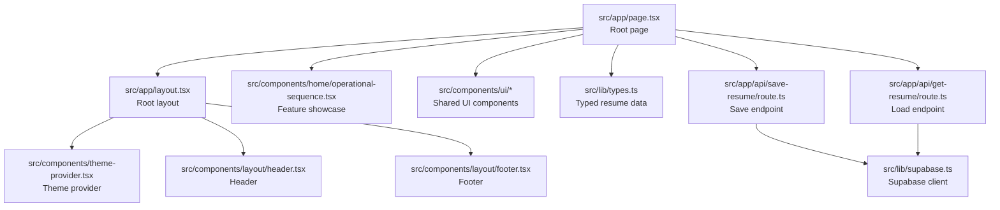

# Getting Started

<cite>
**Referenced Files in This Document**
- [README.md](file://README.md)
- [package.json](file://package.json)
- [next.config.ts](file://next.config.ts)
- [tsconfig.json](file://tsconfig.json)
- [postcss.config.mjs](file://postcss.config.mjs)
- [src/app/layout.tsx](file://src/app/layout.tsx)
- [src/app/page.tsx](file://src/app/page.tsx)
- [src/components/theme-provider.tsx](file://src/components/theme-provider.tsx)
- [src/lib/supabase.ts](file://src/lib/supabase.ts)
- [src/lib/types.ts](file://src/lib/types.ts)
- [src/app/api/get-resume/route.ts](file://src/app/api/get-resume/route.ts)
- [src/app/api/save-resume/route.ts](file://src/app/api/save-resume/route.ts)
- [GOOGLE_OAUTH_SETUP.md](file://GOOGLE_OAUTH_SETUP.md)
- [supabase-setup.sql](file://supabase-setup.sql)
</cite>

## Table of Contents
1. [Introduction](#introduction)
2. [Prerequisites](#prerequisites)
3. [Quick Setup](#quick-setup)
4. [Local Development Walkthrough](#local-development-walkthrough)
5. [Project Structure Overview](#project-structure-overview)
6. [Environment Variables and Authentication](#environment-variables-and-authentication)
7. [Verification and First Run](#verification-and-first-run)
8. [Troubleshooting Guide](#troubleshooting-guide)
9. [Next Steps](#next-steps)

## Introduction
This guide helps you set up and run the nh.intern project locally. It covers prerequisites, environment setup, dependency installation, optional authentication configuration, and how to verify your installation. The project is a Next.js application using TypeScript, Tailwind CSS, and Supabase for authentication and storage.

## Prerequisites
Before you begin, ensure you have:
- Node.js installed (version matching the project’s runtime requirements)
- One of the supported package managers: npm, yarn, pnpm, or bun
- A basic understanding of Next.js and React (pages router concepts apply here)
- Optional: A Supabase project ready for local development

These tools and concepts are sufficient to get the project running. If you are new to Next.js, the official documentation and interactive tutorial are excellent resources to learn the framework fundamentals.

## Quick Setup
Follow these steps to get the project running quickly:
1. Clone the repository to your machine.
2. Install dependencies using your preferred package manager.
3. Start the development server and open http://localhost:3000 in your browser.

The repository README provides the exact commands for starting the dev server and opening the site.

**Section sources**
- [README.md:5-17](file://README.md#L5-L17)

## Local Development Walkthrough
This walkthrough explains each step in detail so you can understand what happens behind the scenes.

Step 1: Clone the repository
- Use your Git client to clone the repository to your local machine.

Step 2: Install dependencies
- From the project root, run your chosen package manager’s install command. The project includes a lock file, so dependency resolution will be deterministic.

Step 3: Configure environment variables (optional but recommended)
- For Supabase integration, define the Supabase URL and anonymous key environment variables. These are consumed by the Supabase client module.
- For Google OAuth (optional), configure credentials and redirect URLs in both Google Cloud Console and your Supabase project. The setup guide documents the required steps and URLs.

Step 4: Start the development server
- Run the development script defined in the project’s scripts. The server starts on port 3000 by default.

Step 5: View the application
- Open http://localhost:3000 in your browser. You should see the home page and navigation to the resume builder and templates pages.

**Section sources**
- [package.json:5-10](file://package.json#L5-L10)
- [README.md:5-17](file://README.md#L5-L17)
- [src/lib/supabase.ts:3-9](file://src/lib/supabase.ts#L3-L9)
- [GOOGLE_OAUTH_SETUP.md:1-49](file://GOOGLE_OAUTH_SETUP.md#L1-L49)

## Project Structure Overview
At a high level, the project follows a Next.js App Router structure under the src/app directory. Key areas:
- Pages and routing: The root page is defined under src/app/page.tsx. Other pages include the resume builder and templates.
- Global layout and theming: The root layout sets fonts, global styles, and wraps the app in a theme provider.
- UI primitives: Shared components are in src/components/ui and reusable layout components in src/components/layout.
- Libraries and types: Shared utilities and typed data models live under src/lib.
- API routes: Server-side endpoints for saving and retrieving resume data are under src/app/api.

**Diagram sources**
- [src/app/page.tsx:1-178](file://src/app/page.tsx#L1-L178)
- [src/app/layout.tsx:1-47](file://src/app/layout.tsx#L1-L47)
- [src/components/theme-provider.tsx:1-10](file://src/components/theme-provider.tsx#L1-L10)
- [src/lib/types.ts:1-103](file://src/lib/types.ts#L1-L103)
- [src/app/api/save-resume/route.ts:1-52](file://src/app/api/save-resume/route.ts#L1-L52)
- [src/app/api/get-resume/route.ts:1-50](file://src/app/api/get-resume/route.ts#L1-L50)
- [src/lib/supabase.ts:1-11](file://src/lib/supabase.ts#L1-L11)

**Section sources**
- [src/app/page.tsx:1-178](file://src/app/page.tsx#L1-L178)
- [src/app/layout.tsx:1-47](file://src/app/layout.tsx#L1-L47)

## Environment Variables and Authentication
The project integrates with Supabase for authentication and data persistence. To enable Supabase features locally:
- Define NEXT_PUBLIC_SUPABASE_URL and NEXT_PUBLIC_SUPABASE_ANON_KEY in your environment. The Supabase client reads these variables.
- Optionally enable Google OAuth by creating credentials in Google Cloud Console and adding them to your Supabase project. The setup guide documents the required origins, redirect URIs, and dashboard steps.

Optional: If you do not configure Supabase, the client falls back to safe defaults, but authentication and database features will be disabled.

**Section sources**
- [src/lib/supabase.ts:3-9](file://src/lib/supabase.ts#L3-L9)
- [GOOGLE_OAUTH_SETUP.md:1-49](file://GOOGLE_OAUTH_SETUP.md#L1-L49)

## Verification and First Run
After starting the development server, verify your setup:
- Visit http://localhost:3000. You should see the landing page with navigation to the builder and templates.
- Interact with the UI to confirm that animations and layout render correctly.
- If you enabled Supabase, sign in using your configured provider and test saving and loading resume data via the API routes.

The project’s root layout defines the global metadata and theme provider, ensuring consistent theming and typography across pages.

**Section sources**
- [README.md:17-17](file://README.md#L17)
- [src/app/layout.tsx:19-46](file://src/app/layout.tsx#L19-L46)

## Troubleshooting Guide
Common setup issues and resolutions:
- Port already in use
  - The development server runs on port 3000. If this port is busy, stop the conflicting process or change the port in your dev script.
- Missing environment variables
  - If Supabase features are not working, ensure NEXT_PUBLIC_SUPABASE_URL and NEXT_PUBLIC_SUPABASE_ANON_KEY are set. Confirm the values match your Supabase project.
- Supabase tables missing
  - Run the provided SQL script in your Supabase SQL Editor to create required tables and policies.
- Google OAuth not working
  - Verify Authorized JavaScript origins and redirect URIs in Google Cloud Console match your local and Supabase URLs. Confirm the Site URL and Redirect URLs in Supabase Authentication URL Configuration.
- Fonts and styling
  - The project uses Next.js fonts and Tailwind CSS. Ensure PostCSS and Tailwind configurations are present and not overridden by your environment.

**Section sources**
- [supabase-setup.sql:1-58](file://supabase-setup.sql#L1-L58)
- [GOOGLE_OAUTH_SETUP.md:19-49](file://GOOGLE_OAUTH_SETUP.md#L19-L49)
- [postcss.config.mjs:1-8](file://postcss.config.mjs#L1-L8)

## Next Steps
With the project running locally, explore:
- The resume builder page to create and edit resume content.
- The templates page to preview different resume designs.
- The API routes for saving and loading resume data to understand Supabase integration.
- Extend the UI by adding new components under src/components/ui and integrating them into pages.