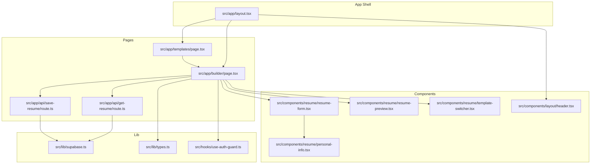
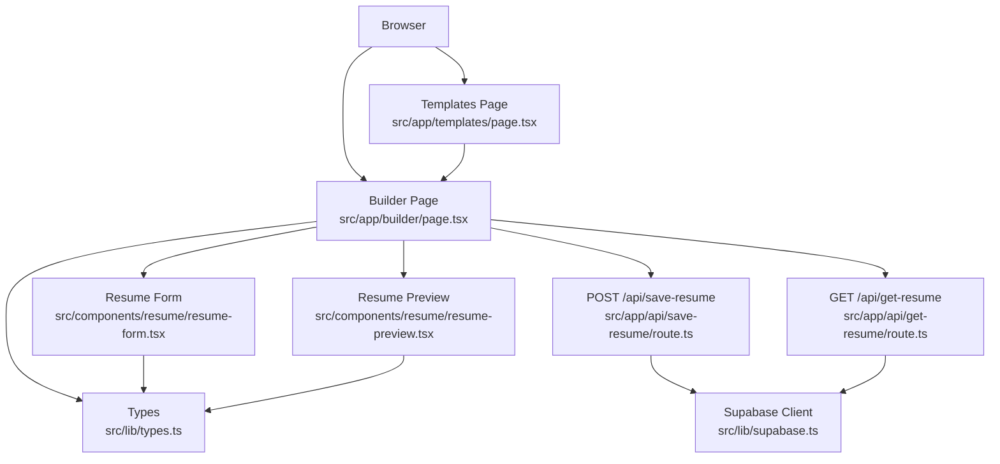
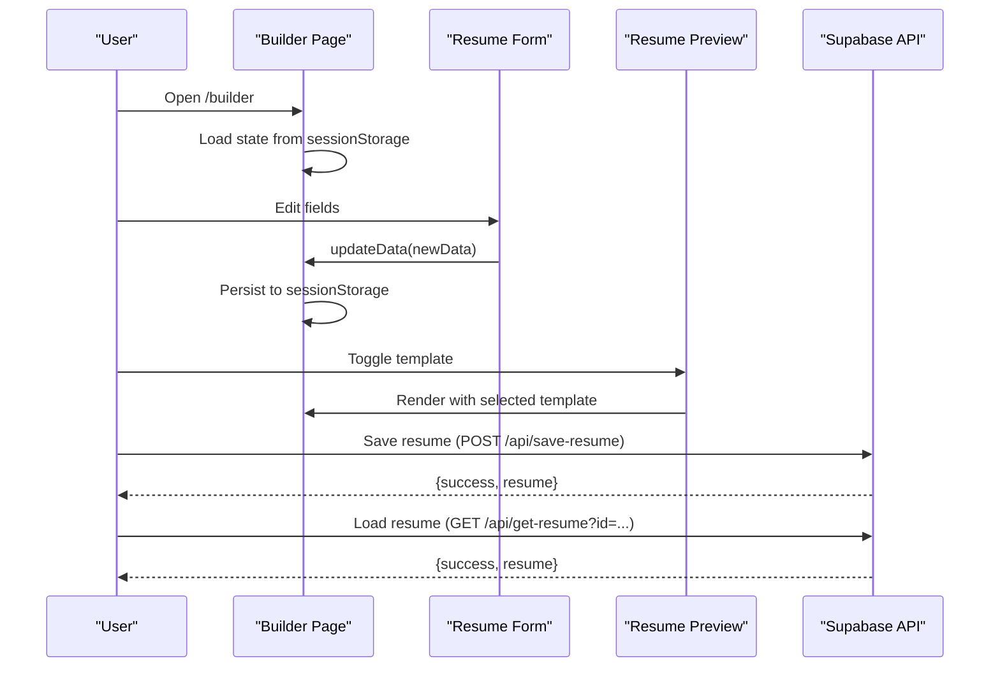
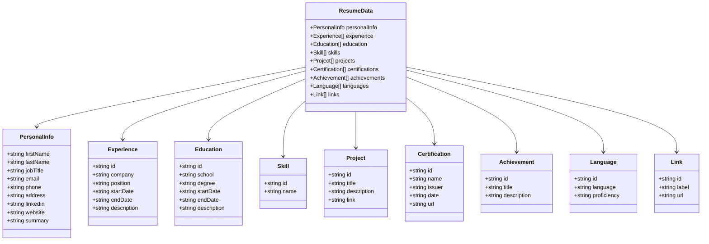
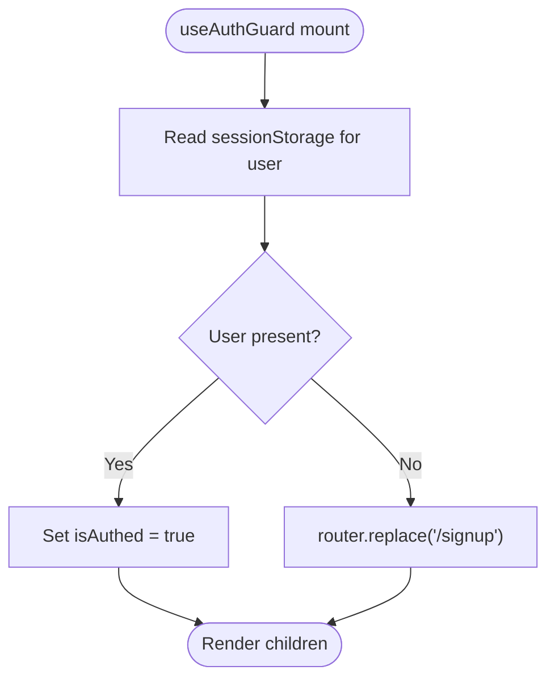
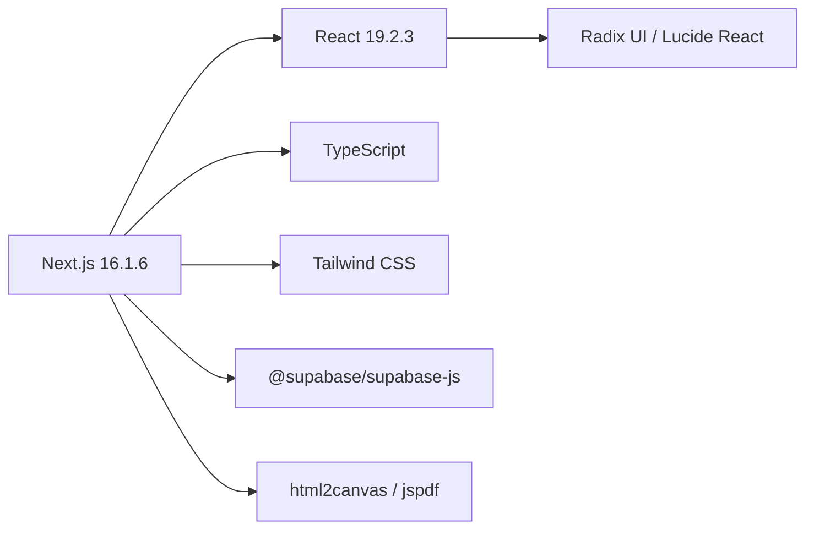

# Project Overview

<cite>
**Referenced Files in This Document**
- [README.md](file://README.md)
- [package.json](file://package.json)
- [next.config.ts](file://next.config.ts)
- [tsconfig.json](file://tsconfig.json)
- [src/lib/supabase.ts](file://src/lib/supabase.ts)
- [src/lib/types.ts](file://src/lib/types.ts)
- [src/app/layout.tsx](file://src/app/layout.tsx)
- [src/app/builder/page.tsx](file://src/app/builder/page.tsx)
- [src/app/templates/page.tsx](file://src/app/templates/page.tsx)
- [src/app/api/get-resume/route.ts](file://src/app/api/get-resume/route.ts)
- [src/app/api/save-resume/route.ts](file://src/app/api/save-resume/route.ts)
- [src/hooks/use-auth-guard.ts](file://src/hooks/use-auth-guard.ts)
- [src/components/resume/resume-form.tsx](file://src/components/resume/resume-form.tsx)
- [src/components/resume/resume-preview.tsx](file://src/components/resume/resume-preview.tsx)
- [src/components/resume/personal-info.tsx](file://src/components/resume/personal-info.tsx)
- [src/components/resume/template-switcher.tsx](file://src/components/resume/template-switcher.tsx)
- [src/components/layout/header.tsx](file://src/components/layout/header.tsx)
</cite>

## Table of Contents
1. [Introduction](#introduction)
2. [Project Structure](#project-structure)
3. [Core Components](#core-components)
4. [Architecture Overview](#architecture-overview)
5. [Detailed Component Analysis](#detailed-component-analysis)
6. [Dependency Analysis](#dependency-analysis)
7. [Performance Considerations](#performance-considerations)
8. [Troubleshooting Guide](#troubleshooting-guide)
9. [Conclusion](#conclusion)

## Introduction
nh.intern is a professional resume builder web application designed to help users create polished, ATS-friendly resumes quickly and efficiently. Its core value proposition is a streamlined authoring experience with a live preview, a curated set of modern templates, and seamless persistence via Supabase. The platform targets professionals seeking a fast, reliable way to build and export resumes without the complexity of desktop tools.

Key capabilities:
- Resume creation with structured sections (personal info, experience, education, skills, projects, certifications, achievements, languages, links)
- Live editor with real-time preview and template switching
- Multiple resume templates optimized for different industries and aesthetics
- Local-first editing with session-backed persistence and server-backed storage
- Authentication guard and protected APIs for secure resume access

## Project Structure
The project follows Next.js App Router conventions with a clear separation of concerns:
- Application shell and global styles in the root app layout
- Feature pages under src/app (builder, templates, API routes)
- Reusable UI components under src/components
- Shared types and utilities under src/lib
- Client-side hooks for auth and UI behavior

**Diagram sources**
- [src/app/layout.tsx:1-47](file://src/app/layout.tsx#L1-L47)
- [src/app/builder/page.tsx:1-79](file://src/app/builder/page.tsx#L1-L79)
- [src/app/templates/page.tsx:1-178](file://src/app/templates/page.tsx#L1-L178)
- [src/app/api/get-resume/route.ts:1-50](file://src/app/api/get-resume/route.ts#L1-L50)
- [src/app/api/save-resume/route.ts:1-52](file://src/app/api/save-resume/route.ts#L1-L52)
- [src/components/resume/resume-form.tsx:1-84](file://src/components/resume/resume-form.tsx#L1-L84)
- [src/components/resume/resume-preview.tsx:1-800](file://src/components/resume/resume-preview.tsx#L1-L800)
- [src/components/resume/template-switcher.tsx:1-159](file://src/components/resume/template-switcher.tsx#L1-L159)
- [src/components/resume/personal-info.tsx:1-118](file://src/components/resume/personal-info.tsx#L1-L118)
- [src/components/layout/header.tsx:1-44](file://src/components/layout/header.tsx#L1-L44)
- [src/lib/supabase.ts:1-11](file://src/lib/supabase.ts#L1-L11)
- [src/lib/types.ts:1-103](file://src/lib/types.ts#L1-L103)
- [src/hooks/use-auth-guard.ts:1-25](file://src/hooks/use-auth-guard.ts#L1-L25)

**Section sources**
- [README.md:1-37](file://README.md#L1-L37)
- [src/app/layout.tsx:1-47](file://src/app/layout.tsx#L1-L47)
- [src/app/builder/page.tsx:1-79](file://src/app/builder/page.tsx#L1-L79)
- [src/app/templates/page.tsx:1-178](file://src/app/templates/page.tsx#L1-L178)

## Core Components
- Resume data model: Strongly typed ResumeData and related interfaces define the shape of editable content.
- Builder page: Orchestrates the editor and preview panes, manages template selection, and persists data locally.
- Resume form: Modular field groups (personal info, experience, education, etc.) update the shared state.
- Resume preview: Renders a live preview using multiple template variants.
- Templates page: Browse and select from curated templates.
- Supabase integration: Provides client-side database access for saving and loading resumes.
- Auth guard: Client-side protection for authenticated flows.

Practical examples:
- Creating a new resume: Navigate to the templates page, choose a template, then use the builder to fill sections. The editor updates in real time.
- Switching templates: Use the template switcher in the builder to preview different designs without losing content.
- Saving and loading: Use the save API to persist to Supabase; load existing resumes via the get API.

**Section sources**
- [src/lib/types.ts:69-103](file://src/lib/types.ts#L69-L103)
- [src/app/builder/page.tsx:11-79](file://src/app/builder/page.tsx#L11-L79)
- [src/components/resume/resume-form.tsx:19-84](file://src/components/resume/resume-form.tsx#L19-L84)
- [src/components/resume/resume-preview.tsx:789-800](file://src/components/resume/resume-preview.tsx#L789-L800)
- [src/app/templates/page.tsx:10-74](file://src/app/templates/page.tsx#L10-L74)
- [src/lib/supabase.ts:1-11](file://src/lib/supabase.ts#L1-L11)
- [src/hooks/use-auth-guard.ts:9-24](file://src/hooks/use-auth-guard.ts#L9-L24)

## Architecture Overview
The application uses a client-driven architecture with Next.js App Router and Supabase for persistence:
- Client-side state management for editing and preview
- Session storage for local persistence during a session
- Supabase for authenticated storage and retrieval of resumes
- Template rendering via dedicated preview components

**Diagram sources**
- [src/app/builder/page.tsx:11-79](file://src/app/builder/page.tsx#L11-L79)
- [src/components/resume/resume-form.tsx:19-84](file://src/components/resume/resume-form.tsx#L19-L84)
- [src/components/resume/resume-preview.tsx:789-800](file://src/components/resume/resume-preview.tsx#L789-L800)
- [src/app/templates/page.tsx:76-178](file://src/app/templates/page.tsx#L76-L178)
- [src/app/api/get-resume/route.ts:4-49](file://src/app/api/get-resume/route.ts#L4-L49)
- [src/app/api/save-resume/route.ts:4-51](file://src/app/api/save-resume/route.ts#L4-L51)
- [src/lib/supabase.ts:1-11](file://src/lib/supabase.ts#L1-L11)
- [src/lib/types.ts:69-103](file://src/lib/types.ts#L69-L103)

## Detailed Component Analysis

### Builder Page Workflow
The builder coordinates editing, previewing, and persistence:
- Initializes state from sessionStorage or defaults
- Updates state as users edit fields
- Persists to sessionStorage on change
- Uses template switcher to change preview templates
- Calls save and load APIs for server-backed storage

**Diagram sources**
- [src/app/builder/page.tsx:11-79](file://src/app/builder/page.tsx#L11-L79)
- [src/components/resume/resume-form.tsx:19-84](file://src/components/resume/resume-form.tsx#L19-L84)
- [src/components/resume/resume-preview.tsx:789-800](file://src/components/resume/resume-preview.tsx#L789-L800)
- [src/app/api/save-resume/route.ts:4-51](file://src/app/api/save-resume/route.ts#L4-L51)
- [src/app/api/get-resume/route.ts:4-49](file://src/app/api/get-resume/route.ts#L4-L49)

**Section sources**
- [src/app/builder/page.tsx:11-79](file://src/app/builder/page.tsx#L11-L79)
- [src/components/resume/resume-form.tsx:19-84](file://src/components/resume/resume-form.tsx#L19-L84)
- [src/components/resume/resume-preview.tsx:789-800](file://src/components/resume/resume-preview.tsx#L789-L800)
- [src/app/api/save-resume/route.ts:4-51](file://src/app/api/save-resume/route.ts#L4-L51)
- [src/app/api/get-resume/route.ts:4-49](file://src/app/api/get-resume/route.ts#L4-L49)

### Resume Data Model
The ResumeData type defines the canonical structure for all resume content, enabling consistent editing and rendering across components.

**Diagram sources**
- [src/lib/types.ts:1-103](file://src/lib/types.ts#L1-L103)

**Section sources**
- [src/lib/types.ts:1-103](file://src/lib/types.ts#L1-L103)

### Authentication Guard
The client-side auth guard checks for a stored user session and redirects accordingly, ensuring protected flows.

**Diagram sources**
- [src/hooks/use-auth-guard.ts:9-24](file://src/hooks/use-auth-guard.ts#L9-L24)

**Section sources**
- [src/hooks/use-auth-guard.ts:9-24](file://src/hooks/use-auth-guard.ts#L9-L24)

### Conceptual Overview
Beginners can think of nh.intern as a guided, visual editor:
- Choose a template that fits your industry or style
- Fill in your details in the left panel
- See your resume update instantly in the right panel
- Save your work to the cloud and return later

Experts can focus on:
- The strongly typed ResumeData model enabling robust editing
- The modular component architecture supporting easy extension
- Supabase integration for scalable, secure storage
- Client-side session persistence for offline-friendly editing

## Dependency Analysis
Technology stack and relationships:
- Next.js 16.1.6 powers the framework and routing
- React 19.2.3 provides the UI runtime
- TypeScript enforces type safety across components and APIs
- Supabase client enables database operations
- Tailwind CSS and UI primitives deliver responsive styling
- html2canvas and jspdf support print/export workflows

**Diagram sources**
- [package.json:11-40](file://package.json#L11-L40)
- [next.config.ts:1-8](file://next.config.ts#L1-L8)
- [tsconfig.json:1-35](file://tsconfig.json#L1-L35)

**Section sources**
- [package.json:11-40](file://package.json#L11-L40)
- [next.config.ts:1-8](file://next.config.ts#L1-L8)
- [tsconfig.json:1-35](file://tsconfig.json#L1-L35)

## Performance Considerations
- Client-side state updates are efficient; keep edits scoped to minimize re-renders
- Template rendering is lightweight; avoid heavy computations inside preview components
- Use sessionStorage for frequent local saves to reduce server load
- Lazy-load images for templates to improve initial page speed
- Consider debouncing save operations to Supabase for rapid typing scenarios

## Troubleshooting Guide
Common issues and resolutions:
- Authentication errors when saving/loading: Ensure the client-side auth guard detects a valid session and that Supabase credentials are configured.
- Resume not loading: Verify the resume ID exists and belongs to the authenticated user.
- Template switching does not persist: Confirm the builder updates URL parameters and the preview reads the current template.
- Export/print issues: Ensure the preview container is rendered and accessible before invoking print/export actions.

**Section sources**
- [src/app/api/get-resume/route.ts:4-49](file://src/app/api/get-resume/route.ts#L4-L49)
- [src/app/api/save-resume/route.ts:4-51](file://src/app/api/save-resume/route.ts#L4-L51)
- [src/hooks/use-auth-guard.ts:9-24](file://src/hooks/use-auth-guard.ts#L9-L24)
- [src/app/builder/page.tsx:38-42](file://src/app/builder/page.tsx#L38-L42)

## Conclusion
nh.intern delivers a modern, developer-friendly resume builder with a clean architecture, strong typing, and flexible templating. It balances ease-of-use for beginners with extensibility and performance for advanced users, leveraging Next.js, React, TypeScript, and Supabase to provide a smooth, reliable experience from creation to export.