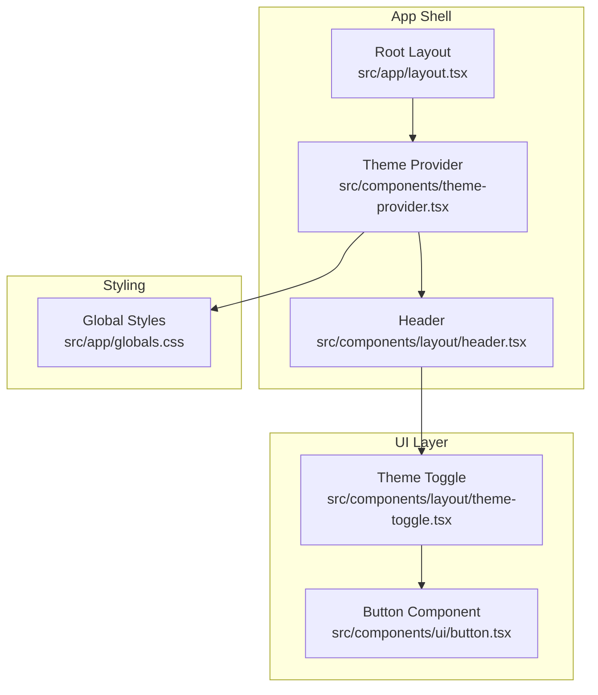
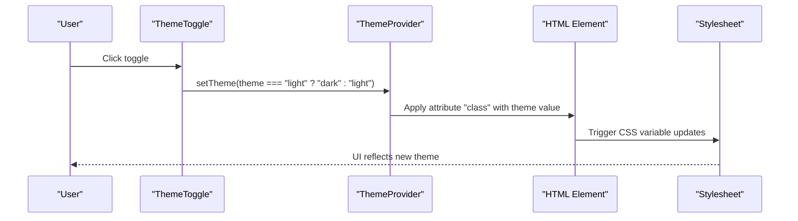
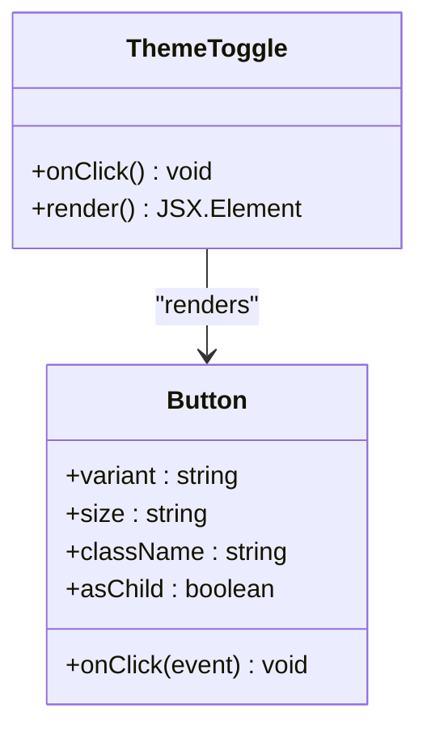
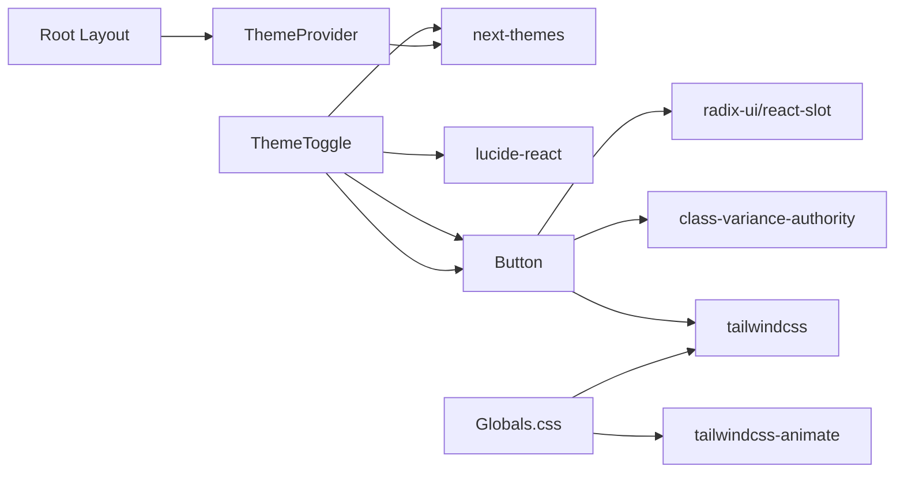
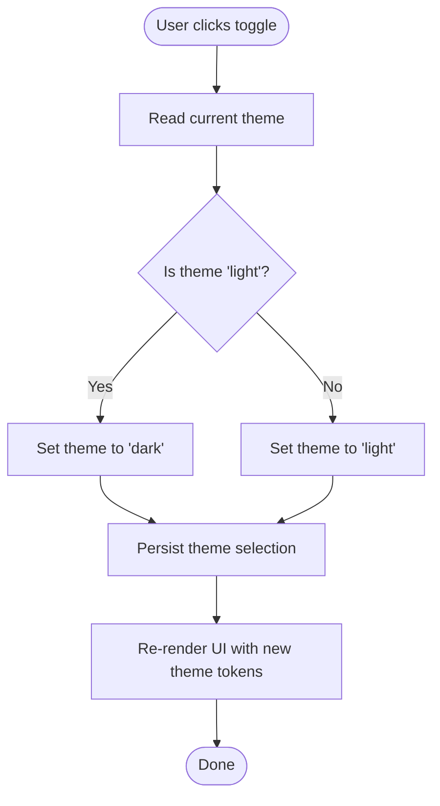

# Dark and Light Mode Toggle

<cite>
**Referenced Files in This Document**
- [theme-toggle.tsx](file://src/components/layout/theme-toggle.tsx)
- [theme-provider.tsx](file://src/components/theme-provider.tsx)
- [layout.tsx](file://src/app/layout.tsx)
- [globals.css](file://src/app/globals.css)
- [header.tsx](file://src/components/layout/header.tsx)
- [button.tsx](file://src/components/ui/button.tsx)
- [package.json](file://package.json)
</cite>

## Table of Contents
1. [Introduction](#introduction)
2. [Project Structure](#project-structure)
3. [Core Components](#core-components)
4. [Architecture Overview](#architecture-overview)
5. [Detailed Component Analysis](#detailed-component-analysis)
6. [Dependency Analysis](#dependency-analysis)
7. [Performance Considerations](#performance-considerations)
8. [Troubleshooting Guide](#troubleshooting-guide)
9. [Conclusion](#conclusion)
10. [Appendices](#appendices)

## Introduction
This document explains the dark and light mode toggle functionality implemented in the project. It covers the theme switcher component, user interaction patterns, state management, styling approach, accessibility features, and persistence of user preferences. It also provides guidance on customizing the toggle appearance, adding keyboard shortcuts, integrating with system theme detection, ensuring cross-browser compatibility, optimizing performance, and applying user experience best practices.

## Project Structure
The theme system is composed of:
- A theme provider that wraps the application and manages theme state.
- A theme toggle component that switches between light and dark themes.
- Global styles that define theme tokens and Tailwind variants.
- A header that integrates the toggle into the navigation bar.
- A reusable button component used by the toggle.

**Diagram sources**
- [layout.tsx:25-49](file://src/app/layout.tsx#L25-L49)
- [theme-provider.tsx:7-9](file://src/components/theme-provider.tsx#L7-L9)
- [header.tsx:94](file://src/components/layout/header.tsx#L94)
- [theme-toggle.tsx:12-23](file://src/components/layout/theme-toggle.tsx#L12-L23)
- [button.tsx:42-53](file://src/components/ui/button.tsx#L42-L53)
- [globals.css:5,57,88](file://src/app/globals.css#L5,L57,L88)

**Section sources**
- [layout.tsx:25-49](file://src/app/layout.tsx#L25-L49)
- [theme-provider.tsx:7-9](file://src/components/theme-provider.tsx#L7-L9)
- [header.tsx:94](file://src/components/layout/header.tsx#L94)
- [theme-toggle.tsx:12-23](file://src/components/layout/theme-toggle.tsx#L12-L23)
- [button.tsx:42-53](file://src/components/ui/button.tsx#L42-L53)
- [globals.css:5,57,88](file://src/app/globals.css#L5,L57,L88)

## Core Components
- ThemeProvider: Wraps the application and exposes theme state and controls via next-themes.
- ThemeToggle: A small, accessible toggle that switches between light and dark modes.
- Button: Reusable button component used by the toggle.
- Global Styles: Define theme tokens and Tailwind variants for dark mode.

Key responsibilities:
- ThemeProvider sets up the theme context with attributes and defaults.
- ThemeToggle reads the current theme and toggles between light and dark.
- Button provides consistent styling and behavior for interactive elements.
- Global Styles define CSS variables and dark-mode variants for consistent theming.

**Section sources**
- [theme-provider.tsx:7-9](file://src/components/theme-provider.tsx#L7-L9)
- [theme-toggle.tsx:9-24](file://src/components/layout/theme-toggle.tsx#L9-L24)
- [button.tsx:36-57](file://src/components/ui/button.tsx#L36-L57)
- [globals.css:5,57,88](file://src/app/globals.css#L5,L57,L88)

## Architecture Overview
The theme system uses next-themes to manage theme state and persistence. The provider is configured in the root layout to apply the theme to the HTML element. The toggle component reads the current theme and updates it, triggering re-rendering of the UI with new CSS variables.

**Diagram sources**
- [theme-toggle.tsx:10,16](file://src/components/layout/theme-toggle.tsx#L10,L16)
- [layout.tsx:35-45](file://src/app/layout.tsx#L35-L45)
- [globals.css:5,57,88](file://src/app/globals.css#L5,L57,L88)

## Detailed Component Analysis

### ThemeToggle Component
Purpose:
- Provides a compact, accessible toggle to switch between light and dark themes.
- Uses Lucide icons for sun/moon indicators and Tailwind transitions for smooth swap.

Implementation highlights:
- Reads current theme and writes the opposite theme on click.
- Uses a ghost-styled icon button sized for touch targets.
- Implements a visually distinct sun and moon icon pair with transitions.
- Adds screen-reader text for accessibility.

Props and behavior:
- Props: Inherits from the Button component (variant, size, className, onClick).
- Behavior: Toggles between "light" and "dark" themes.

Accessibility:
- Hidden label text ensures assistive technologies announce the control purpose.
- Uses a button element for native semantics and keyboard support.

Styling approach:
- Icons are positioned absolutely and transition between visible/hidden states.
- Uses dark mode variants to flip icon visibility and rotation.
- Rounded full shape for a pill-like appearance.

Animation effects:
- Smooth transitions between icon states using Tailwind transition utilities.
- Rotation and scaling transforms create a fluid swap effect.

Persistence:
- The provider persists the selected theme in the DOM attribute and can persist to storage depending on configuration.

Customization examples (paths):
- Change icon set by replacing Lucide icons with alternatives.
- Adjust sizing by changing the button size prop.
- Modify colors by editing CSS variables in global styles.

Keyboard shortcuts:
- The button is focusable and clickable via Enter/Space by default.
- Extend with custom key handlers if needed.

Integration with system theme detection:
- The provider supports detecting OS-level theme preferences.
- Configure the provider to respect system preference and handle automatic switching.

**Section sources**
- [theme-toggle.tsx:9-24](file://src/components/layout/theme-toggle.tsx#L9-L24)
- [button.tsx:36-57](file://src/components/ui/button.tsx#L36-L57)
- [globals.css:5,57,88](file://src/app/globals.css#L5,L57,L88)

#### Class Diagram: ThemeToggle and Button

**Diagram sources**
- [theme-toggle.tsx:12-23](file://src/components/layout/theme-toggle.tsx#L12-L23)
- [button.tsx:36-57](file://src/components/ui/button.tsx#L36-L57)

### ThemeProvider and Root Layout
Role:
- The ThemeProvider wraps the entire application and exposes theme controls.
- The root layout configures the provider with attributes and default theme.

Configuration:
- Attribute: "class" is used to apply the theme to the HTML element.
- Default theme: "dark" is set at startup.
- Transition behavior: disables transition on first render to prevent flash.

Effects:
- Applying the "dark" class to the HTML element triggers Tailwind’s dark variant.
- CSS variables update automatically, causing the UI to reflect the new theme.

**Section sources**
- [layout.tsx:35-45](file://src/app/layout.tsx#L35-L45)
- [theme-provider.tsx:7-9](file://src/components/theme-provider.tsx#L7-L9)

### Global Styles and Dark Mode Tokens
Role:
- Defines CSS variables for theme tokens in both light and dark contexts.
- Establishes a custom dark variant for Tailwind utilities.
- Provides a theme layer with animations and tokens.

Key points:
- CSS variables are defined in :root and .dark blocks.
- Tailwind’s dark variant is enabled via a custom variant.
- The theme layer maps CSS variables to Tailwind tokens for consistent usage.

Implications:
- All components inherit theme tokens from CSS variables.
- Dark mode is activated by applying the "dark" class to the HTML element.

**Section sources**
- [globals.css:5,57,88](file://src/app/globals.css#L5,L57,L88)

### Header Integration
Role:
- Places the ThemeToggle in the header alongside navigation and auth controls.
- Ensures the toggle is always accessible in the UI.

Behavior:
- The toggle appears consistently across pages because it is rendered inside the shared header.

**Section sources**
- [header.tsx:94](file://src/components/layout/header.tsx#L94)

## Dependency Analysis
External libraries:
- next-themes: Manages theme state, persistence, and system preference detection.
- lucide-react: Provides SVG icons for the toggle.
- radix-ui/react-slot and class-variance-authority: Enable flexible button composition and variants.
- tailwindcss and tailwindcss-animate: Provide styling and animation utilities.

Internal dependencies:
- ThemeToggle depends on the Button component and next-themes.
- ThemeProvider wraps the app and is configured in the root layout.
- Global styles depend on Tailwind variants and CSS variables.

**Diagram sources**
- [package.json:23,21,13,16,29,22](file://package.json#L23,L21,L13,L16,L29,L22)
- [theme-toggle.tsx:4,5,7](file://src/components/layout/theme-toggle.tsx#L4,L5,L7)
- [button.tsx:2,3,8](file://src/components/ui/button.tsx#L2,L3,L8)
- [theme-provider.tsx:4](file://src/components/theme-provider.tsx#L4)
- [layout.tsx:5](file://src/app/layout.tsx#L5)
- [globals.css:1,3](file://src/app/globals.css#L1,L3)

**Section sources**
- [package.json:23,21,13,16,29,22](file://package.json#L23,L21,L13,L16,L29,L22)
- [theme-toggle.tsx:4,5,7](file://src/components/layout/theme-toggle.tsx#L4,L5,L7)
- [button.tsx:2,3,8](file://src/components/ui/button.tsx#L2,L3,L8)
- [theme-provider.tsx:4](file://src/components/theme-provider.tsx#L4)
- [layout.tsx:5](file://src/app/layout.tsx#L5)
- [globals.css:1,3](file://src/app/globals.css#L1,L3)

## Performance Considerations
- Minimize layout thrashing by avoiding forced synchronous layouts during theme changes.
- Disable transitions on initial hydration to prevent visual flicker when the theme is known.
- Keep icon assets lightweight; Lucide icons are efficient vector graphics.
- Use CSS variables for theme tokens to reduce reflows and repaints.
- Prefer Tailwind utilities for transitions to leverage GPU acceleration.

[No sources needed since this section provides general guidance]

## Troubleshooting Guide
Common issues and resolutions:
- Theme does not persist across sessions:
  - Verify the provider is configured to persist the theme in storage.
  - Ensure the attribute is set to "class" so the HTML element receives the theme class.
- Toggle does not change icons:
  - Confirm the dark variant is enabled and icons use dark-specific classes.
  - Check that the button size and icon sizes match the intended layout.
- Flash of incorrect theme on initial load:
  - Use the provider’s option to disable transition on first render.
  - Ensure the default theme aligns with the intended startup state.
- Accessibility concerns:
  - Confirm the screen-reader label is present.
  - Test keyboard navigation and focus indicators.

**Section sources**
- [layout.tsx:35-45](file://src/app/layout.tsx#L35-L45)
- [theme-toggle.tsx:19-21](file://src/components/layout/theme-toggle.tsx#L19-L21)
- [globals.css:5,57,88](file://src/app/globals.css#L5,L57,L88)

## Conclusion
The theme toggle is a focused, accessible, and performant component that leverages next-themes for state management and persistence. Its integration with the global stylesheet and Tailwind’s dark variant ensures consistent theming across the application. By following the customization and best practice guidelines in this document, teams can extend the toggle to meet diverse UX requirements while maintaining reliability and performance.

[No sources needed since this section summarizes without analyzing specific files]

## Appendices

### A. Theme Switching Logic Flow

**Diagram sources**
- [theme-toggle.tsx:10,16](file://src/components/layout/theme-toggle.tsx#L10,L16)
- [layout.tsx:35-45](file://src/app/layout.tsx#L35-L45)
- [globals.css:5,57,88](file://src/app/globals.css#L5,L57,L88)

### B. Accessibility Checklist
- Ensure the control is keyboard accessible (Enter/Space).
- Provide a screen-reader label describing the action.
- Maintain sufficient color contrast in both themes.
- Preserve focus indicators and visible states.
- Avoid relying solely on icons; include text alternatives.

**Section sources**
- [theme-toggle.tsx:21](file://src/components/layout/theme-toggle.tsx#L21)
- [globals.css:5,57,88](file://src/app/globals.css#L5,L57,L88)

### C. Customization Examples (Paths)
- Replace icons: [theme-toggle.tsx:19-20](file://src/components/layout/theme-toggle.tsx#L19-L20)
- Adjust button size: [theme-toggle.tsx:14-17](file://src/components/layout/theme-toggle.tsx#L14-L17)
- Modify colors: [globals.css:5,57,88](file://src/app/globals.css#L5,L57,L88)
- Add keyboard shortcut: [theme-toggle.tsx:16](file://src/components/layout/theme-toggle.tsx#L16)

### D. Integration with System Theme Detection
- Configure the provider to detect OS-level theme preferences.
- Optionally set a fallback to system preference when the user has not made a choice.
- Handle automatic switching when the OS theme changes.

**Section sources**
- [layout.tsx:35-45](file://src/app/layout.tsx#L35-L45)
- [package.json:23](file://package.json#L23)