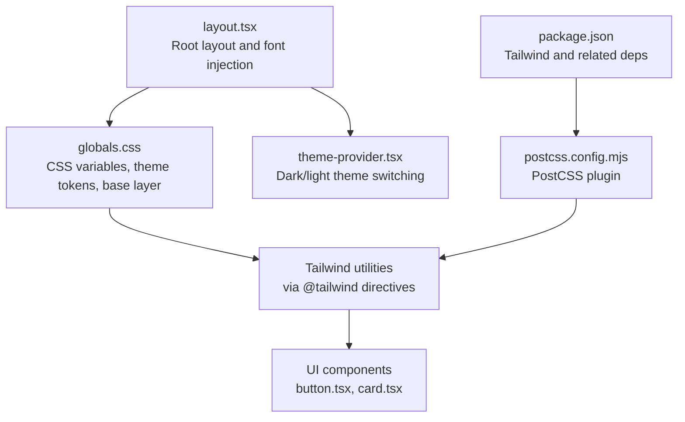
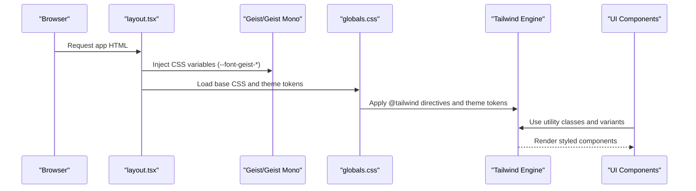
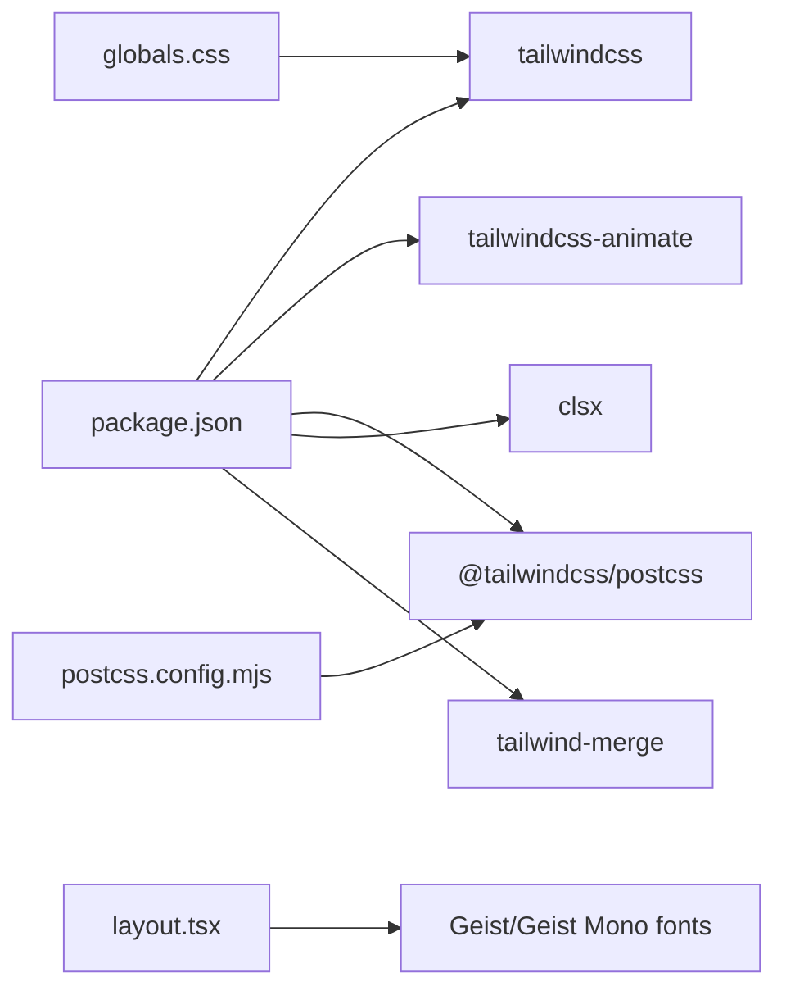

# Global Styling Configuration

<cite>
**Referenced Files in This Document**
- [globals.css](file://src/app/globals.css)
- [layout.tsx](file://src/app/layout.tsx)
- [theme-provider.tsx](file://src/components/theme-provider.tsx)
- [postcss.config.mjs](file://postcss.config.mjs)
- [package.json](file://package.json)
- [button.tsx](file://src/components/ui/button.tsx)
- [card.tsx](file://src/components/ui/card.tsx)
- [utils.ts](file://src/lib/utils.ts)
</cite>

## Table of Contents
1. [Introduction](#introduction)
2. [Project Structure](#project-structure)
3. [Core Components](#core-components)
4. [Architecture Overview](#architecture-overview)
5. [Detailed Component Analysis](#detailed-component-analysis)
6. [Dependency Analysis](#dependency-analysis)
7. [Performance Considerations](#performance-considerations)
8. [Troubleshooting Guide](#troubleshooting-guide)
9. [Conclusion](#conclusion)

## Introduction
This document explains the global styling configuration and CSS architecture of the project. It covers the Tailwind CSS setup, custom CSS variables, and font loading strategy using Geist and Geist Mono. It also documents the global utility classes, spacing systems, and responsive breakpoints, along with the design system customization patterns, CSS organization, optimization techniques, and browser compatibility strategies.

## Project Structure
The styling system is organized around three pillars:
- Global CSS layer that defines design tokens and base styles
- Font loading via Next.js font optimization with Geist and Geist Mono
- Tailwind CSS integration through PostCSS and component-level variants

**Diagram sources**
- [layout.tsx:1-50](file://src/app/layout.tsx#L1-L50)
- [globals.css:1-169](file://src/app/globals.css#L1-L169)
- [theme-provider.tsx:1-10](file://src/components/theme-provider.tsx#L1-L10)
- [postcss.config.mjs:1-8](file://postcss.config.mjs#L1-L8)
- [package.json:1-43](file://package.json#L1-L43)

**Section sources**
- [layout.tsx:1-50](file://src/app/layout.tsx#L1-L50)
- [globals.css:1-169](file://src/app/globals.css#L1-L169)
- [postcss.config.mjs:1-8](file://postcss.config.mjs#L1-L8)
- [package.json:1-43](file://package.json#L1-L43)

## Core Components
- Design tokens and theme variables: Centralized in CSS custom properties and exposed as Tailwind theme tokens for consistent usage across components.
- Dark theme variant: A custom dark variant selector ensures theme-aware selectors apply consistently.
- Base layer: Normalized base styles and global resets are applied via Tailwind layers.
- Font system: Geist (sans-serif) and Geist Mono (monospace) are injected as CSS variables for seamless Tailwind integration.
- Utility merging: A centralized utility function merges Tailwind classes safely.

Key implementation references:
- Design tokens and theme exposure: [globals.css:7-125](file://src/app/globals.css#L7-L125)
- Dark variant: [globals.css:5](file://src/app/globals.css#L5)
- Base layer: [globals.css:161-169](file://src/app/globals.css#L161-L169)
- Font injection: [layout.tsx:10-18](file://src/app/layout.tsx#L10-L18)
- Theme provider: [theme-provider.tsx:7-9](file://src/components/theme-provider.tsx#L7-L9)
- Utility merging: [utils.ts:4-6](file://src/lib/utils.ts#L4-L6)

**Section sources**
- [globals.css:5-169](file://src/app/globals.css#L5-L169)
- [layout.tsx:10-18](file://src/app/layout.tsx#L10-L18)
- [theme-provider.tsx:7-9](file://src/components/theme-provider.tsx#L7-L9)
- [utils.ts:4-6](file://src/lib/utils.ts#L4-L6)

## Architecture Overview
The styling pipeline integrates Next.js font optimization, CSS custom properties, Tailwind utilities, and component-level variants.

**Diagram sources**
- [layout.tsx:10-18](file://src/app/layout.tsx#L10-L18)
- [globals.css:1-169](file://src/app/globals.css#L1-L169)
- [button.tsx:7-34](file://src/components/ui/button.tsx#L7-L34)
- [card.tsx:5-17](file://src/components/ui/card.tsx#L5-L17)

## Detailed Component Analysis

### Tailwind CSS Setup and Integration
- PostCSS plugin: Tailwind is enabled via the official PostCSS plugin configured in the project.
- Directives: The global stylesheet imports Tailwind and registers a custom dark variant and animation plugin.
- Theme tokens: CSS variables are mapped into Tailwind’s theme for consistent design system usage.

Implementation references:
- Plugin registration: [postcss.config.mjs:2-4](file://postcss.config.mjs#L2-L4)
- Tailwind imports and plugin: [globals.css:1-3](file://src/app/globals.css#L1-L3)
- Custom dark variant: [globals.css:5](file://src/app/globals.css#L5)
- Theme token mapping: [globals.css:88-125](file://src/app/globals.css#L88-L125)

**Section sources**
- [postcss.config.mjs:1-8](file://postcss.config.mjs#L1-L8)
- [globals.css:1-125](file://src/app/globals.css#L1-L125)

### Design Tokens and CSS Variables
- Color palette: Defined in :root and .dark blocks, including primary/accent colors, backgrounds, borders, and sidebar tokens.
- Typography: Exposed via --font-geist-sans and --font-geist-mono variables.
- Spacing and radii: Radius tokens standardized for consistent corner radii across components.
- Animations: Custom keyframes and animation tokens for interactive states.

Implementation references:
- Color tokens: [globals.css:7-55](file://src/app/globals.css#L7-L55)
- Dark overrides: [globals.css:57-86](file://src/app/globals.css#L57-L86)
- Theme mapping: [globals.css:88-125](file://src/app/globals.css#L88-L125)
- Animations: [globals.css:126-159](file://src/app/globals.css#L126-L159)

**Section sources**
- [globals.css:7-159](file://src/app/globals.css#L7-L159)

### Font Loading Strategy with Geist and Geist Mono
- Next.js font optimization: Geist and Geist Mono are imported and configured with a CSS variable for seamless Tailwind usage.
- Variable assignment: The font variables are attached to the body element so Tailwind utilities can consume them.
- Subset selection: Latin subset is used for optimal performance.

Implementation references:
- Font imports and variables: [layout.tsx:10-18](file://src/app/layout.tsx#L10-L18)
- Body class injection: [layout.tsx:32-34](file://src/app/layout.tsx#L32-L34)

**Section sources**
- [layout.tsx:10-18](file://src/app/layout.tsx#L10-L18)
- [layout.tsx:32-34](file://src/app/layout.tsx#L32-L34)

### Global Utility Classes and Base Layer
- Base layer: Applies border and outline tokens globally and sets body background and text colors.
- Border and ring tokens: Unified via CSS variables for consistent borders and focus rings.
- Antialiasing and layout helpers: Applied at the body level for readability and layout scaffolding.

Implementation references:
- Base layer rules: [globals.css:161-169](file://src/app/globals.css#L161-L169)

**Section sources**
- [globals.css:161-169](file://src/app/globals.css#L161-L169)

### Component-Level Variants and Utility Merging
- Variants: Buttons and cards use class variance authority (CVA) to define consistent variants and sizes.
- Utility merging: A centralized cn function merges classes with Tailwind merge to avoid conflicts.

Implementation references:
- Button variants: [button.tsx:7-34](file://src/components/ui/button.tsx#L7-L34)
- Card composition: [card.tsx:5-17](file://src/components/ui/card.tsx#L5-L17)
- Utility merging: [utils.ts:4-6](file://src/lib/utils.ts#L4-L6)

**Section sources**
- [button.tsx:7-34](file://src/components/ui/button.tsx#L7-L34)
- [card.tsx:5-17](file://src/components/ui/card.tsx#L5-L17)
- [utils.ts:4-6](file://src/lib/utils.ts#L4-L6)

### Dark Theme Variant and Switching
- Custom variant: A dark variant selector targets descendants under the dark class for theme-aware styling.
- Provider: The theme provider manages light/dark toggling and persistence.

Implementation references:
- Dark variant: [globals.css:5](file://src/app/globals.css#L5)
- Theme provider: [theme-provider.tsx:7-9](file://src/components/theme-provider.tsx#L7-L9)
- Root layout theme props: [layout.tsx:35-39](file://src/app/layout.tsx#L35-L39)

**Section sources**
- [globals.css:5](file://src/app/globals.css#L5)
- [theme-provider.tsx:7-9](file://src/components/theme-provider.tsx#L7-L9)
- [layout.tsx:35-39](file://src/app/layout.tsx#L35-L39)

### Responsive Breakpoints and Spacing Systems
- Breakpoints: Tailwind’s default breakpoints are used implicitly via utilities (e.g., md:, lg:).
- Spacing: Consistent spacing tokens derived from theme tokens enable predictable margins/paddings.
- Radii: Standardized radius tokens ensure consistent corner radii across components.

Implementation references:
- Utilities with responsive prefixes: [button.tsx:22-27](file://src/components/ui/button.tsx#L22-L27)
- Theme radii mapping: [globals.css:109-112](file://src/app/globals.css#L109-L112)

**Section sources**
- [button.tsx:22-27](file://src/components/ui/button.tsx#L22-L27)
- [globals.css:109-112](file://src/app/globals.css#L109-L112)

### Customizing the Design System
Patterns for extending the design system:
- Add new tokens: Define CSS variables in :root and map them into Tailwind’s theme block.
- Extend variants: Use CVA to add new variants or sizes to existing components.
- Compose utilities: Use the cn function to merge base classes with variant classes safely.

Implementation references:
- Token definition: [globals.css:7-55](file://src/app/globals.css#L7-L55)
- Theme mapping: [globals.css:88-125](file://src/app/globals.css#L88-L125)
- Button variants: [button.tsx:10-33](file://src/components/ui/button.tsx#L10-L33)
- Utility merging: [utils.ts:4-6](file://src/lib/utils.ts#L4-L6)

**Section sources**
- [globals.css:7-125](file://src/app/globals.css#L7-L125)
- [button.tsx:10-33](file://src/components/ui/button.tsx#L10-L33)
- [utils.ts:4-6](file://src/lib/utils.ts#L4-L6)

### Maintaining CSS Organization
- Centralized tokens: Keep all design tokens in the global stylesheet.
- Component-specific styles: Prefer Tailwind utilities and CVA variants over ad hoc component styles.
- Base layer: Use the base layer for global resets and defaults.

Implementation references:
- Global tokens: [globals.css:7-125](file://src/app/globals.css#L7-L125)
- Base layer: [globals.css:161-169](file://src/app/globals.css#L161-L169)
- Component composition: [card.tsx:5-17](file://src/components/ui/card.tsx#L5-L17)

**Section sources**
- [globals.css:7-169](file://src/app/globals.css#L7-L169)
- [card.tsx:5-17](file://src/components/ui/card.tsx#L5-L17)

## Dependency Analysis
The styling stack depends on Tailwind CSS v4, PostCSS, and Next.js font optimization. The project also leverages class variance authority and tailwind merge for robust component styling.

**Diagram sources**
- [package.json:11-41](file://package.json#L11-L41)
- [postcss.config.mjs:1-8](file://postcss.config.mjs#L1-L8)
- [layout.tsx:10-18](file://src/app/layout.tsx#L10-L18)
- [globals.css:1-3](file://src/app/globals.css#L1-L3)

**Section sources**
- [package.json:11-41](file://package.json#L11-L41)
- [postcss.config.mjs:1-8](file://postcss.config.mjs#L1-L8)
- [layout.tsx:10-18](file://src/app/layout.tsx#L10-L18)
- [globals.css:1-3](file://src/app/globals.css#L1-L3)

## Performance Considerations
- Font optimization: Next.js font optimization injects only the necessary font subsets and variables, minimizing render-blocking and improving First Contentful Paint.
- Tailwind purging: Tailwind CSS v4 is optimized for build-time purging; ensure production builds exclude unused utilities.
- CSS variable usage: Centralized tokens reduce duplication and improve maintainability; avoid excessive reflows by limiting dynamic style updates.
- Utility merging: Using the cn function prevents redundant classes and reduces CSS bloat.

Recommendations:
- Keep font subsets minimal (already set to latin).
- Audit unused utilities in production builds.
- Prefer CSS variables for theme tokens to avoid runtime style recalculation.

**Section sources**
- [layout.tsx:10-18](file://src/app/layout.tsx#L10-L18)
- [utils.ts:4-6](file://src/lib/utils.ts#L4-L6)

## Troubleshooting Guide
Common issues and resolutions:
- Fonts not applying: Verify the font variables are attached to the body and Tailwind utilities reference the correct CSS variables.
- Theme not switching: Confirm the theme provider is wrapping the app and the dark variant selector targets the correct DOM nodes.
- Styles not taking effect: Ensure the base layer is loaded and Tailwind directives are present in the global stylesheet.

References:
- Font variables on body: [layout.tsx:32-34](file://src/app/layout.tsx#L32-L34)
- Theme provider wrapper: [layout.tsx:35-45](file://src/app/layout.tsx#L35-L45)
- Base layer rules: [globals.css:161-169](file://src/app/globals.css#L161-L169)

**Section sources**
- [layout.tsx:32-45](file://src/app/layout.tsx#L32-L45)
- [globals.css:161-169](file://src/app/globals.css#L161-L169)

## Conclusion
The project employs a clean, scalable CSS architecture built on Tailwind CSS v4, Next.js font optimization, and a centralized token system. By leveraging CSS variables, component variants, and a theme provider, the design system remains consistent, maintainable, and performant. Following the outlined patterns ensures smooth customization and optimization across browsers and devices.