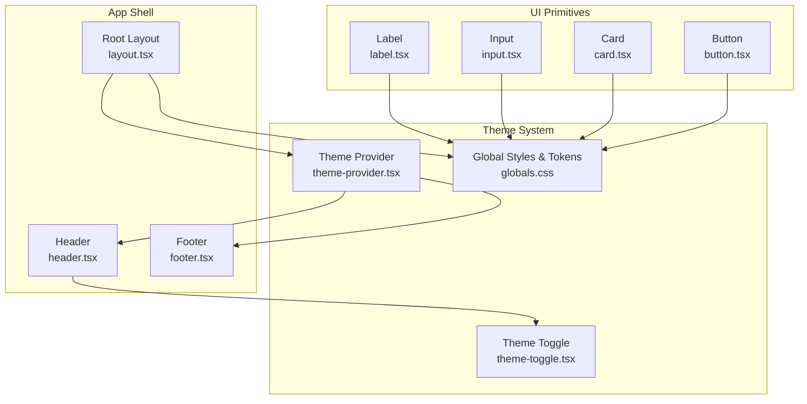
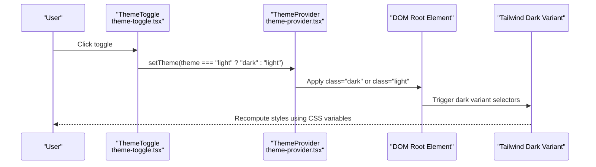
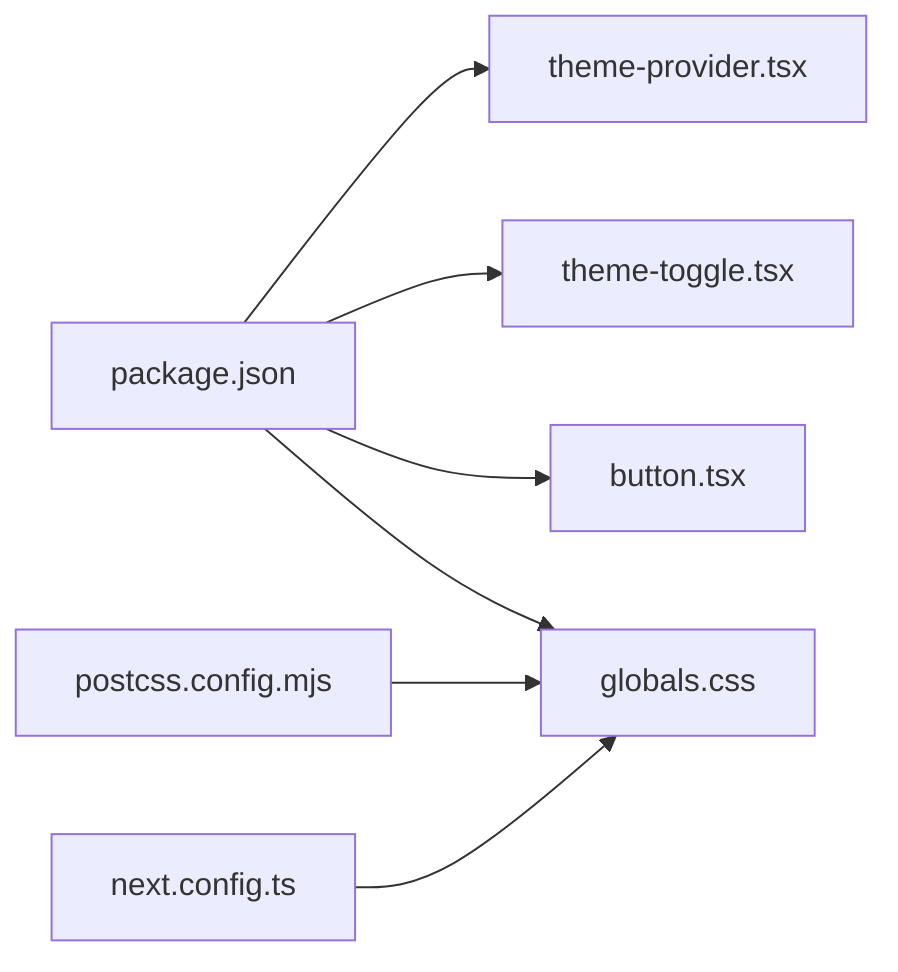

# Styling and Theming

<cite>
**Referenced Files in This Document**
- [globals.css](file://src/app/globals.css)
- [theme-provider.tsx](file://src/components/theme-provider.tsx)
- [theme-toggle.tsx](file://src/components/layout/theme-toggle.tsx)
- [layout.tsx](file://src/app/layout.tsx)
- [button.tsx](file://src/components/ui/button.tsx)
- [card.tsx](file://src/components/ui/card.tsx)
- [input.tsx](file://src/components/ui/input.tsx)
- [label.tsx](file://src/components/layout/label.tsx)
- [header.tsx](file://src/components/layout/header.tsx)
- [footer.tsx](file://src/components/layout/footer.tsx)
- [utils.ts](file://src/lib/utils.ts)
- [package.json](file://package.json)
- [postcss.config.mjs](file://postcss.config.mjs)
- [next.config.ts](file://next.config.ts)
</cite>

## Table of Contents
1. [Introduction](#introduction)
2. [Project Structure](#project-structure)
3. [Core Components](#core-components)
4. [Architecture Overview](#architecture-overview)
5. [Detailed Component Analysis](#detailed-component-analysis)
6. [Dependency Analysis](#dependency-analysis)
7. [Performance Considerations](#performance-considerations)
8. [Troubleshooting Guide](#troubleshooting-guide)
9. [Conclusion](#conclusion)
10. [Appendices](#appendices)

## Introduction
This section documents the styling and theming system of the resume builder application. It explains how Tailwind CSS is configured, how the theme provider enables dark/light mode, and how component-level styles are applied using CSS-in-JS patterns via class variance authority (CVA). It also covers the theme customization options, color schemes, typography system, and responsive design patterns. Practical guidance is included for applying themes, customizing component styles, maintaining design consistency, optimizing CSS performance, and extending the theme system with new themes and advanced styling patterns.

## Project Structure
The styling system is organized around:
- Global CSS and theme tokens defined in a single stylesheet
- A theme provider that manages theme persistence and switching
- UI primitives built with CVA for consistent variants and sizes
- Layout components that integrate the theme toggle and apply global styles

**Diagram sources**
- [layout.tsx:25-49](file://src/app/layout.tsx#L25-L49)
- [theme-provider.tsx:7-9](file://src/components/theme-provider.tsx#L7-L9)
- [theme-toggle.tsx:9-24](file://src/components/layout/theme-toggle.tsx#L9-L24)
- [globals.css:1-169](file://src/app/globals.css#L1-L169)
- [button.tsx:7-34](file://src/components/ui/button.tsx#L7-L34)
- [card.tsx:5-76](file://src/components/ui/card.tsx#L5-L76)
- [input.tsx:7-20](file://src/components/ui/input.tsx#L7-L20)
- [label.tsx:7-14](file://src/components/layout/label.tsx#L7-L14)

**Section sources**
- [layout.tsx:1-50](file://src/app/layout.tsx#L1-L50)
- [globals.css:1-169](file://src/app/globals.css#L1-L169)

## Core Components
- Theme Provider: Wraps the app to enable theme switching and persistence using a lightweight provider.
- Theme Toggle: A client-side component that switches between light and dark modes.
- Global Styles: Centralized theme tokens, CSS variables, and Tailwind v4 directives for animations and base layers.
- UI Primitives: Reusable components with CVA variants and sizes that consume theme tokens.

Key implementation references:
- Theme provider wrapper and default theme configuration
- Theme toggle logic and icon transitions
- Global CSS variables and theme tokens
- CVA-based button variants and sizes
- Utility function for merging class names

**Section sources**
- [theme-provider.tsx:7-9](file://src/components/theme-provider.tsx#L7-L9)
- [theme-toggle.tsx:9-24](file://src/components/layout/theme-toggle.tsx#L9-L24)
- [globals.css:7-169](file://src/app/globals.css#L7-L169)
- [button.tsx:7-34](file://src/components/ui/button.tsx#L7-L34)
- [utils.ts:4-6](file://src/lib/utils.ts#L4-L6)

## Architecture Overview
The theming architecture integrates Tailwind CSS v4 with CSS variables and a theme provider to deliver a cohesive dark/light mode experience. The provider sets a class on the root element, which Tailwind’s dark variant responds to. Global CSS defines theme tokens and animations, while UI primitives use CVA to remain theme-aware.

**Diagram sources**
- [theme-toggle.tsx:10-16](file://src/components/layout/theme-toggle.tsx#L10-L16)
- [theme-provider.tsx:7-9](file://src/components/theme-provider.tsx#L7-L9)
- [globals.css:57-86](file://src/app/globals.css#L57-L86)

**Section sources**
- [layout.tsx:35-45](file://src/app/layout.tsx#L35-L45)
- [globals.css:5-86](file://src/app/globals.css#L5-L86)

## Detailed Component Analysis

### Tailwind CSS Configuration and Theme Tokens
- CSS variables define semantic tokens for background, foreground, primary, secondary, muted, accent, destructive, borders, inputs, and rings.
- A custom dark variant selector targets descendants inside a parent with the dark class.
- Tailwind v4 directives include plugin usage, theme extraction, and base layer application.
- Animations and keyframes are defined for interactive feedback.

Practical implications:
- All UI components read from CSS variables, ensuring consistent theming across components.
- Adding or modifying tokens updates the entire UI automatically.

**Section sources**
- [globals.css:7-169](file://src/app/globals.css#L7-L169)

### Theme Provider Implementation
- The provider is initialized at the root layout with attributes controlling how the theme is persisted and applied.
- The default theme is set to dark, and transitions are disabled to avoid visible flicker during hydration.

Best practices:
- Keep the provider close to the root to minimize re-renders.
- Avoid unnecessary transitions during initial load to prevent FOUC.

**Section sources**
- [layout.tsx:35-39](file://src/app/layout.tsx#L35-L39)
- [theme-provider.tsx:7-9](file://src/components/theme-provider.tsx#L7-L9)

### Dark/Light Mode Toggle
- The toggle reads the current theme and flips it on click.
- Icons animate to reflect the active theme, with accessibility support via screen reader text.
- Uses a button primitive for consistent behavior and styling.

Usage tips:
- Place the toggle in a prominent location in the header.
- Combine with persistent storage to honor user preference across sessions.

**Section sources**
- [theme-toggle.tsx:9-24](file://src/components/layout/theme-toggle.tsx#L9-L24)
- [header.tsx:29-93](file://src/components/layout/header.tsx#L29-L93)

### CSS-in-JS Patterns with CVA
- Button variants and sizes are defined with CVA, enabling consistent styling across the app.
- Utilities merge classes safely, preventing conflicts and reducing duplication.

How it works:
- Variants map to semantic tokens (e.g., primary, secondary, destructive).
- Sizes standardize spacing and typography.
- The utility function ensures only meaningful classes are applied.

**Section sources**
- [button.tsx:7-34](file://src/components/ui/button.tsx#L7-L34)
- [utils.ts:4-6](file://src/lib/utils.ts#L4-L6)

### Component-Level Styling Approaches
- Cards use border, background, and shadow tokens for depth and consistency.
- Inputs inherit from input and ring tokens for focus states.
- Labels maintain consistent typography and disabled states.

Consistency guidelines:
- Prefer tokens over hardcoded values.
- Use semantic variants for actions and states.

**Section sources**
- [card.tsx:5-76](file://src/components/ui/card.tsx#L5-L76)
- [input.tsx:7-20](file://src/components/ui/input.tsx#L7-L20)
- [label.tsx:7-14](file://src/components/layout/label.tsx#L7-L14)

### Typography System
- Two font families are declared and exposed as CSS variables for use in Tailwind.
- Base layer applies font variables globally, ensuring consistent typography.

Integration:
- Use font variables in component classes to align with the design system.

**Section sources**
- [layout.tsx:10-18](file://src/app/layout.tsx#L10-L18)
- [globals.css:123-124](file://src/app/globals.css#L123-L124)

### Responsive Design Patterns
- Layout containers use responsive padding and widths.
- Navigation and buttons adapt across breakpoints.
- Icons and spacing scale appropriately with size variants.

Patterns:
- Use container utilities for consistent horizontal rhythm.
- Leverage size variants for compact layouts on small screens.

**Section sources**
- [header.tsx:31-93](file://src/components/layout/header.tsx#L31-L93)

### Applying Themes and Maintaining Consistency
- Apply theme tokens to backgrounds, borders, and text to keep components aligned.
- Use CVA variants to enforce consistent action styles.
- Merge classes with the utility function to avoid overrides.

Examples:
- Buttons: choose variant and size to match the intended interaction.
- Cards: rely on semantic tokens for elevation and contrast.
- Inputs: inherit focus and disabled states from shared tokens.

**Section sources**
- [button.tsx:10-32](file://src/components/ui/button.tsx#L10-L32)
- [card.tsx:11-14](file://src/components/ui/card.tsx#L11-L14)
- [input.tsx:12-18](file://src/components/ui/input.tsx#L12-L18)
- [utils.ts:4-6](file://src/lib/utils.ts#L4-L6)

### Extending the Theme System
- Add new tokens in the global CSS to introduce new palettes or roles.
- Define new CVA variants for components to expand interaction patterns.
- Introduce additional dark/light overrides if needed for specific components.

Guidance:
- Keep token names semantic and scoped to their role.
- Document new variants and sizes for team consistency.

**Section sources**
- [globals.css:88-125](file://src/app/globals.css#L88-L125)
- [button.tsx:10-32](file://src/components/ui/button.tsx#L10-L32)

## Dependency Analysis
External libraries and build configuration underpin the styling system:
- Tailwind CSS v4 and PostCSS integration
- next-themes for theme management
- class variance authority and tailwind-merge for component styling
- lucide-react for icons

**Diagram sources**
- [package.json:11-31](file://package.json#L11-L31)
- [postcss.config.mjs:1-7](file://postcss.config.mjs#L1-L7)
- [next.config.ts:1-7](file://next.config.ts#L1-L7)
- [theme-provider.tsx:4](file://src/components/theme-provider.tsx#L4)
- [theme-toggle.tsx:4](file://src/components/layout/theme-toggle.tsx#L4)
- [button.tsx:3](file://src/components/ui/button.tsx#L3)
- [globals.css:1-3](file://src/app/globals.css#L1-L3)

**Section sources**
- [package.json:11-31](file://package.json#L11-L31)
- [postcss.config.mjs:1-7](file://postcss.config.mjs#L1-L7)
- [next.config.ts:1-7](file://next.config.ts#L1-L7)

## Performance Considerations
- Minimize CSS by relying on shared tokens and CVA variants to reduce duplication.
- Disable theme transition on initial render to avoid FOUC and jank.
- Use the utility function to merge classes efficiently and avoid redundant styles.
- Keep animations subtle and scoped to interactive states.

[No sources needed since this section provides general guidance]

## Troubleshooting Guide
Common issues and resolutions:
- Theme does not switch: verify the provider is wrapping the app and the toggle invokes the setter correctly.
- FOUC on initial load: ensure the provider disables transitions during hydration.
- Conflicting styles: use the utility function to merge classes and avoid manual overrides.
- Missing fonts: confirm font variables are applied to the body and Tailwind utilities reference them.

**Section sources**
- [layout.tsx:35-39](file://src/app/layout.tsx#L35-L39)
- [theme-toggle.tsx:10-16](file://src/components/layout/theme-toggle.tsx#L10-L16)
- [utils.ts:4-6](file://src/lib/utils.ts#L4-L6)

## Conclusion
The resume builder’s styling and theming system leverages Tailwind CSS v4, CSS variables, and a theme provider to deliver a consistent, responsive, and accessible design. CVA-based UI primitives ensure predictable styling across components, while global tokens unify color and typography. By following the documented patterns and best practices, teams can extend the theme system, add custom themes, and maintain design consistency at scale.

[No sources needed since this section summarizes without analyzing specific files]

## Appendices

### Practical Examples Index
- Applying theme tokens to a card component
- Creating a new button variant with CVA
- Customizing the theme toggle behavior
- Defining a new semantic token and consuming it in components

[No sources needed since this section lists examples conceptually]