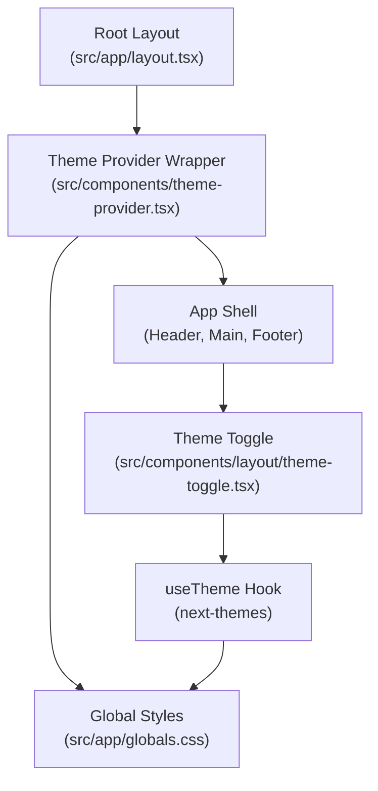
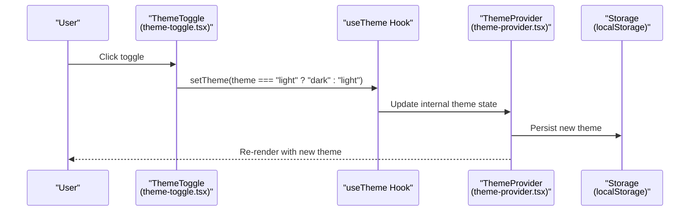
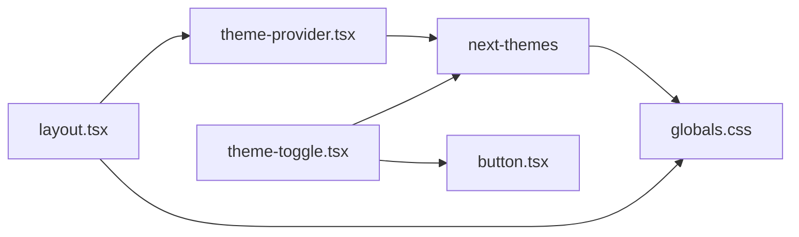

# Theme Provider

<cite>
**Referenced Files in This Document**
- [theme-provider.tsx](file://src/components/theme-provider.tsx)
- [layout.tsx](file://src/app/layout.tsx)
- [theme-toggle.tsx](file://src/components/layout/theme-toggle.tsx)
- [globals.css](file://src/app/globals.css)
- [button.tsx](file://src/components/ui/button.tsx)
- [package.json](file://package.json)
- [next.config.ts](file://next.config.ts)
- [tsconfig.json](file://tsconfig.json)
</cite>

## Table of Contents
1. [Introduction](#introduction)
2. [Project Structure](#project-structure)
3. [Core Components](#core-components)
4. [Architecture Overview](#architecture-overview)
5. [Detailed Component Analysis](#detailed-component-analysis)
6. [Dependency Analysis](#dependency-analysis)
7. [Performance Considerations](#performance-considerations)
8. [Troubleshooting Guide](#troubleshooting-guide)
9. [Conclusion](#conclusion)

## Introduction
This document explains the Theme Provider component implementation used to enable theme switching in the application. It covers how the provider wraps the app, configuration options such as defaultTheme, attribute, and disableTransitionOnChange, persistence via local storage, server-side rendering (SSR) compatibility, and practical usage patterns. It also includes guidance on extending themes, avoiding hydration warnings, and best practices for performance and maintainability.

## Project Structure
The theme system is implemented using a thin wrapper around the next-themes provider and is wired into the root layout. Theme-aware UI components use the useTheme hook to read and update the current theme. Global styles define CSS variables and dark-mode variants.

**Diagram sources**
- [layout.tsx:25-45](file://src/app/layout.tsx#L25-L45)
- [theme-provider.tsx:7-9](file://src/components/theme-provider.tsx#L7-L9)
- [theme-toggle.tsx:9-10](file://src/components/layout/theme-toggle.tsx#L9-L10)
- [globals.css:5-86](file://src/app/globals.css#L5-L86)

**Section sources**
- [layout.tsx:25-45](file://src/app/layout.tsx#L25-L45)
- [theme-provider.tsx:7-9](file://src/components/theme-provider.tsx#L7-L9)
- [globals.css:5-86](file://src/app/globals.css#L5-L86)

## Core Components
- ThemeProvider wrapper: A minimal React component that forwards props to next-themes’ ThemeProvider. It enables theme switching and persistence.
- Root layout integration: The provider is mounted at the top level of the app shell with configuration for attribute, defaultTheme, and transition behavior.
- Theme toggle: A UI control that reads the current theme and toggles between light and dark modes.
- Global CSS: Defines CSS variables and dark mode variants to apply theme styles consistently.

Key configuration options used in the app:
- attribute: "class" — applies the theme as a class on the html element.
- defaultTheme: "dark" — sets the initial theme to dark.
- disableTransitionOnChange: true — disables CSS transitions during theme change to avoid visible flicker.

Persistence and SSR:
- Persistence is handled by next-themes using local storage by default.
- Hydration warnings are mitigated by suppressing hydration mismatch in the root html tag and ensuring the server-rendered HTML reflects the chosen default theme.

**Section sources**
- [theme-provider.tsx:7-9](file://src/components/theme-provider.tsx#L7-L9)
- [layout.tsx:35-39](file://src/app/layout.tsx#L35-L39)
- [theme-toggle.tsx:9-10](file://src/components/layout/theme-toggle.tsx#L9-L10)
- [globals.css:5-86](file://src/app/globals.css#L5-L86)

## Architecture Overview
The theme system follows a unidirectional data flow: the provider manages state, the UI reads it via useTheme, and user actions trigger updates that persist automatically.

**Diagram sources**
- [theme-toggle.tsx:16](file://src/components/layout/theme-toggle.tsx#L16)
- [theme-provider.tsx:7-9](file://src/components/theme-provider.tsx#L7-L9)

## Detailed Component Analysis

### ThemeProvider Wrapper
- Purpose: Thin wrapper around next-themes’ ThemeProvider to expose configuration and children.
- Behavior: Accepts all ThemeProviderProps and spreads them into the underlying provider.
- Usage: Mounted in the root layout with attribute, defaultTheme, and disableTransitionOnChange configured.

Configuration highlights:
- attribute: "class" ensures the theme is applied as a class on the html element, enabling CSS selectors like .dark.
- defaultTheme: "dark" sets the initial theme server-side and client-side.
- disableTransitionOnChange: true prevents CSS transitions during theme change to avoid flicker.

Persistence:
- next-themes persists the selected theme in local storage by default. On subsequent loads, it restores the stored theme.

SSR compatibility:
- The root html element suppresses hydration warnings to align server-rendered markup with client behavior.
- The provider’s defaultTheme aligns server-side rendering with client-side expectations.

Practical usage examples:
- Wrap the app shell in the root layout with desired attributes.
- Pass additional next-themes props (e.g., storageKey, themes) to customize behavior.

Extending theme capabilities:
- Add custom themes by defining new CSS variables and variants in global styles.
- Use the attribute value to target theme-specific styles in components.

**Section sources**
- [theme-provider.tsx:7-9](file://src/components/theme-provider.tsx#L7-L9)
- [layout.tsx:35-39](file://src/app/layout.tsx#L35-L39)
- [globals.css:5-86](file://src/app/globals.css#L5-L86)

### Theme Toggle Component
- Purpose: Provides a user interface to switch between light and dark themes.
- Implementation: Uses useTheme to read the current theme and set the opposite theme on click.
- Styling: Uses a button component with icon variants for sun/moon visuals.

Integration:
- The button component relies on CSS variables defined globally, so theme changes propagate automatically.

**Section sources**
- [theme-toggle.tsx:9-24](file://src/components/layout/theme-toggle.tsx#L9-L24)
- [button.tsx:42-53](file://src/components/ui/button.tsx#L42-L53)

### Global Styles and Dark Mode
- CSS variables: Define color tokens for background, foreground, primary, secondary, muted, accent, destructive, borders, input, and ring.
- Dark variant: The .dark class redefines variables for dark mode.
- Tailwind theme: Variables are exposed to Tailwind utilities via @theme inline.

Effects:
- Theme switching toggles the html class (attribute="class"), which activates .dark and applies appropriate colors.
- Components using Tailwind utilities automatically reflect theme changes.

**Section sources**
- [globals.css:5-86](file://src/app/globals.css#L5-L86)

## Dependency Analysis
External dependencies relevant to theming:
- next-themes: Provides the ThemeProvider and useTheme hook for theme management and persistence.
- lucide-react: Icons used in the theme toggle.
- tailwind-merge and clsx: Utility functions for merging Tailwind classes.

Internal relationships:
- Root layout depends on ThemeProvider wrapper.
- ThemeToggle depends on useTheme from next-themes.
- Global styles depend on CSS variables defined in globals.css.

**Diagram sources**
- [layout.tsx:25-45](file://src/app/layout.tsx#L25-L45)
- [theme-provider.tsx:7-9](file://src/components/theme-provider.tsx#L7-L9)
- [theme-toggle.tsx:9-10](file://src/components/layout/theme-toggle.tsx#L9-L10)
- [button.tsx:42-53](file://src/components/ui/button.tsx#L42-L53)
- [globals.css:5-86](file://src/app/globals.css#L5-L86)

**Section sources**
- [package.json:23](file://package.json#L23)
- [layout.tsx:25-45](file://src/app/layout.tsx#L25-L45)
- [theme-provider.tsx:7-9](file://src/components/theme-provider.tsx#L7-L9)
- [theme-toggle.tsx:9-10](file://src/components/layout/theme-toggle.tsx#L9-L10)
- [button.tsx:42-53](file://src/components/ui/button.tsx#L42-L53)
- [globals.css:5-86](file://src/app/globals.css#L5-L86)

## Performance Considerations
- disableTransitionOnChange reduces perceived flicker during theme switches by disabling transitions while the DOM updates.
- Using attribute="class" avoids expensive style recalculations compared to CSS custom property-only approaches.
- Persisting theme in local storage minimizes unnecessary re-renders after initial load.
- Keep the number of global CSS variables reasonable to limit cascade complexity.

Best practices:
- Centralize theme configuration in the root layout wrapper to avoid duplication.
- Prefer CSS variables for colors and spacing to minimize reflows.
- Avoid heavy animations on theme change; keep transitions subtle.

[No sources needed since this section provides general guidance]

## Troubleshooting Guide
Common issues and resolutions:
- Hydration warnings: The root html element suppresses hydration mismatches. Ensure defaultTheme matches the intended initial theme and that the provider is mounted at the root.
- No visible theme change: Verify attribute is set to "class" and that the .dark selector targets the correct elements.
- Transition flicker: Confirm disableTransitionOnChange is enabled to prevent CSS transitions during theme updates.
- Persistent theme not applied: Check that local storage contains the expected key and that the provider is not overridden elsewhere.

**Section sources**
- [layout.tsx:31](file://src/app/layout.tsx#L31)
- [layout.tsx:35-39](file://src/app/layout.tsx#L35-L39)
- [globals.css:5-86](file://src/app/globals.css#L5-L86)

## Conclusion
The Theme Provider component integrates next-themes into the application via a minimal wrapper, enabling robust theme switching with persistence and SSR-friendly defaults. By configuring attribute, defaultTheme, and disableTransitionOnChange, the app achieves smooth, reliable theming. Global CSS variables and dark mode variants ensure consistent styling across components, while the theme toggle offers a simple user interface for switching themes. Following the best practices outlined above helps maintain performance and reliability as the theme system scales.