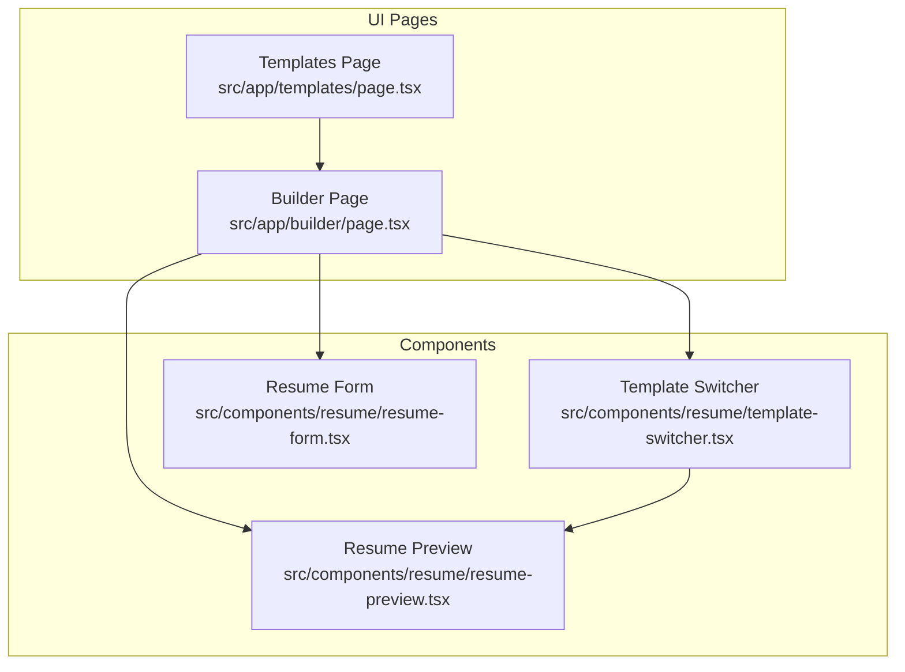
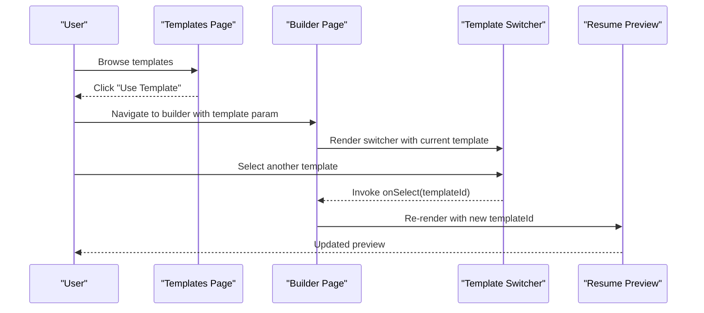
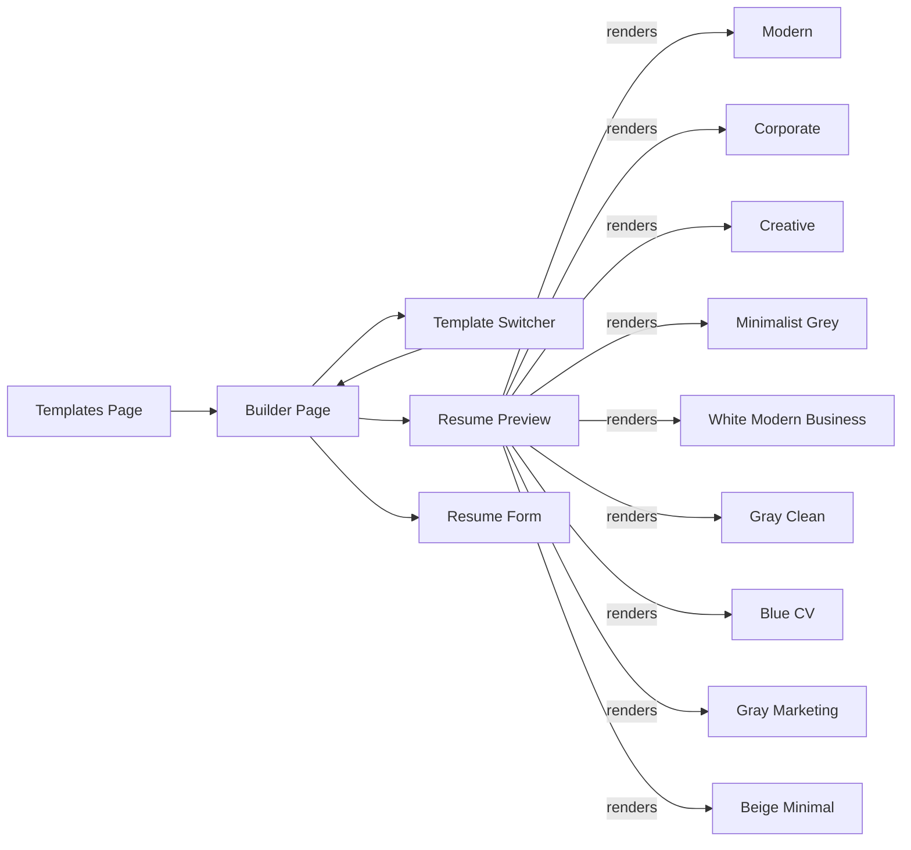

# Available Template Library

<cite>
**Referenced Files in This Document**
- [page.tsx](file://src/app/templates/page.tsx)
- [page.tsx](file://src/app/builder/page.tsx)
- [resume-preview.tsx](file://src/components/resume/resume-preview.tsx)
- [template-switcher.tsx](file://src/components/resume/template-switcher.tsx)
- [resume-form.tsx](file://src/components/resume/resume-form.tsx)
</cite>

## Table of Contents
1. [Introduction](#introduction)
2. [Project Structure](#project-structure)
3. [Core Components](#core-components)
4. [Architecture Overview](#architecture-overview)
5. [Detailed Component Analysis](#detailed-component-analysis)
6. [Template Categories and Descriptions](#template-categories-and-descriptions)
7. [Template Naming Conventions and Organization](#template-naming-conventions-and-organization)
8. [Template Comparison and Selection Guide](#template-comparison-and-selection-guide)
9. [Customization and Styling Options](#customization-and-styling-options)
10. [Dependency Analysis](#dependency-analysis)
11. [Performance Considerations](#performance-considerations)
12. [Troubleshooting Guide](#troubleshooting-guide)
13. [Conclusion](#conclusion)

## Introduction
This document describes the complete template library for the resume builder application. It catalogs all available resume templates, explains their categories, design philosophies, and intended use cases. It also documents how templates are organized, selected, rendered, and customized within the component system, along with practical guidance for choosing the right template for different industries and career stages.

## Project Structure
The template system spans three primary areas:
- Template selection page: displays available templates and metadata
- Template switcher: allows changing templates during editing
- Resume preview: renders the selected template with user data

**Diagram sources**
- [page.tsx:10-74](file://src/app/templates/page.tsx#L10-L74)
- [page.tsx:11-68](file://src/app/builder/page.tsx#L11-L68)
- [template-switcher.tsx:76-158](file://src/components/resume/template-switcher.tsx#L76-L158)
- [resume-preview.tsx:789-800](file://src/components/resume/resume-preview.tsx#L789-L800)

**Section sources**
- [page.tsx:10-74](file://src/app/templates/page.tsx#L10-L74)
- [page.tsx:11-68](file://src/app/builder/page.tsx#L11-L68)
- [template-switcher.tsx:76-158](file://src/components/resume/template-switcher.tsx#L76-L158)
- [resume-preview.tsx:789-800](file://src/components/resume/resume-preview.tsx#L789-L800)

## Core Components
- Templates page: Presents a grid of template cards with images, names, descriptions, and selection actions.
- Template switcher: Provides an overlay panel to browse and select templates while editing.
- Resume preview: Renders the chosen template with user-entered data.
- Resume form: Collects and updates resume data segments (personal info, experience, education, etc.).

Key responsibilities:
- Templates page: Curates the list of available templates and routes to the builder with a selected template ID.
- Template switcher: Manages the open/close state and selection callback to update the current template.
- Resume preview: Chooses the correct template renderer based on the selected template ID and renders the resume content.
- Resume form: Updates the central resume data state and persists it to session storage.

**Section sources**
- [page.tsx:76-177](file://src/app/templates/page.tsx#L76-L177)
- [template-switcher.tsx:76-158](file://src/components/resume/template-switcher.tsx#L76-L158)
- [resume-preview.tsx:789-800](file://src/components/resume/resume-preview.tsx#L789-L800)
- [resume-form.tsx:19-82](file://src/components/resume/resume-form.tsx#L19-L82)

## Architecture Overview
The template system follows a straightforward selection-render flow:
- Users browse templates on the Templates page.
- Users select a template to open the Builder.
- The Builder’s Template Switcher allows switching templates during editing.
- The Resume Preview component renders the selected template with the current resume data.

**Diagram sources**
- [page.tsx:141-145](file://src/app/templates/page.tsx#L141-L145)
- [page.tsx:38-42](file://src/app/builder/page.tsx#L38-L42)
- [template-switcher.tsx:119-122](file://src/components/resume/template-switcher.tsx#L119-L122)
- [resume-preview.tsx:789-790](file://src/components/resume/resume-preview.tsx#L789-L790)

## Detailed Component Analysis

### Templates Page
- Displays a responsive grid of template cards.
- Each card includes:
  - Template image placeholder
  - Name and description
  - “Most Popular” badge for featured templates
  - Action buttons to select and preview
- Uses animation and hover effects for interactivity.

Rendering highlights:
- Grid layout adapts from single column on small screens to three columns on larger screens.
- Hover overlay reveals the “Use Template” action.
- Cards indicate ATS optimization and multi-page support.

Selection flow:
- Clicking “Use Template” or “Select & Continue” navigates to the builder with the template ID as a query parameter.

**Section sources**
- [page.tsx:76-177](file://src/app/templates/page.tsx#L76-L177)

### Template Switcher
- Opens a sidebar overlay with a grid of template thumbnails.
- Highlights the currently selected template with a check indicator.
- On selection, invokes the parent’s onSelect handler and closes the overlay.

Interaction model:
- Toggle open/close via a button.
- Clicking a thumbnail triggers the selection callback and auto-close.

**Section sources**
- [template-switcher.tsx:76-158](file://src/components/resume/template-switcher.tsx#L76-L158)

### Resume Preview
- Receives the current template ID and the full resume data.
- Renders the appropriate template component based on the ID.
- Supports printing/export to PDF via a print hook.

Template rendering:
- The component selects a template renderer function based on the template ID and passes the resume data to it.
- Each template renderer is implemented as a separate component with its own styling and layout.

Export capability:
- Integrates a print hook to generate a PDF using the browser’s print dialog.

**Section sources**
- [resume-preview.tsx:789-800](file://src/components/resume/resume-preview.tsx#L789-L800)

### Resume Form
- Composes multiple editable sections (personal info, experience, education, skills, projects, certifications, achievements, languages, links).
- Updates the central resume data state and persists it to session storage.

**Section sources**
- [resume-form.tsx:19-82](file://src/components/resume/resume-form.tsx#L19-L82)

## Template Categories and Descriptions
The template library includes the following categories and representative styles. Each template is identified by a unique ID used internally and referenced in URLs and state.

- Modern Professional
  - Design philosophy: Clean, modern, ATS-friendly layout suitable for technology and creative industries.
  - Target audience: Early-to-mid-career professionals seeking a contemporary look.
  - Use cases: Software engineering, marketing, design, entrepreneurship.
  - Characteristics: Sans-serif typography, balanced white space, clear section hierarchy.

- Corporate Standard
  - Design philosophy: Traditional serif-based layout optimized for formal industries.
  - Target audience: Finance, law, consulting, academia.
  - Use cases: Executive roles, compliance, legal positions, research.
  - Characteristics: Serif fonts, centered headings, structured sections, conservative color palette.

- Portfolio Creative
  - Design philosophy: Bold typography and a two-column layout to showcase personality and work.
  - Target audience: Designers, writers, marketers, entrepreneurs.
  - Use cases: Creative roles, freelancing, portfolio-heavy applications.
  - Characteristics: High-contrast sidebar, expressive typography, visual separators.

- Black White Minimalist
  - Design philosophy: Ultra-minimal with strong typographic emphasis and high contrast.
  - Target audience: Recent graduates, analysts, engineers, detail-oriented roles.
  - Use cases: Quantitative fields, administrative roles, entry-level positions.
  - Characteristics: Monochrome palette, thin borders, sparse content areas.

- Business Graduate
  - Design philosophy: Clean, professional layout tailored for recent graduates.
  - Target audience: Entry-level business roles, MBAs, internships.
  - Use cases: MBA programs, entry-level management, corporate training roles.
  - Characteristics: Balanced proportions, subtle blue accents, readable sans-serif.

- Science & Engineering
  - Design philosophy: Functional, clean layout emphasizing clarity and precision.
  - Target audience: STEM professionals, researchers, engineers.
  - Use cases: R&D, engineering, data science, laboratory roles.
  - Characteristics: Neutral tones, structured lists, concise descriptions.

- Simple Professional
  - Design philosophy: Standard professional layout with a blue accent color.
  - Target audience: General professionals across industries.
  - Use cases: Administrative, customer service, sales, support roles.
  - Characteristics: Blue header band, consistent spacing, easy scanning.

- Gray & White Clean
  - Design philosophy: Minimalist two-column layout with neutral grays.
  - Target audience: Professionals preferring understated elegance.
  - Use cases: Consulting, writing, project coordination.
  - Characteristics: Light gray sidebar/columns, crisp typography, ample margins.

- Business Real Estate
  - Design philosophy: Warm beige and serif-based elegance for business contexts.
  - Target audience: Real estate, sales, client-facing roles.
  - Use cases: Sales positions, client relations, business development.
  - Characteristics: Beige background, serif headings, classic proportions.

Note: Additional executive and tech-focused templates are available for specialized needs.

**Section sources**
- [page.tsx:10-74](file://src/app/templates/page.tsx#L10-L74)
- [template-switcher.tsx:8-69](file://src/components/resume/template-switcher.tsx#L8-L69)

## Template Naming Conventions and Organization
- Internal IDs: short, hyphenated identifiers used in routing and state (e.g., modern, corporate, creative, minimalist-grey, white-modern-business, gray-clean, blue-cv, gray-marketing, beige-minimal).
- File organization: Template renderers are implemented as React components within the resume preview module. They are named after their intended style (e.g., CorporateTemplate, CreativeTemplate, MinimalistGreyTemplate, etc.) and exported by the preview component.
- Selection mechanism: Templates are selected either from the Templates page (via URL parameter) or from the Template Switcher (via callback), and the preview component conditionally renders the matching template.

Best practices:
- Keep internal IDs lowercase and hyphenated for consistency.
- Group related templates under logical categories (Modern, Corporate, Creative, Executive, Technical, Minimalist, Elegant) to aid discovery and selection.

**Section sources**
- [page.tsx:14-17](file://src/app/templates/page.tsx#L14-L17)
- [page.tsx:20-24](file://src/app/templates/page.tsx#L20-L24)
- [page.tsx:26-31](file://src/app/templates/page.tsx#L26-L31)
- [page.tsx:33-45](file://src/app/templates/page.tsx#L33-L45)
- [page.tsx:47-59](file://src/app/templates/page.tsx#L47-L59)
- [page.tsx:61-66](file://src/app/templates/page.tsx#L61-L66)
- [page.tsx:68-73](file://src/app/templates/page.tsx#L68-L73)
- [template-switcher.tsx:10-13](file://src/components/resume/template-switcher.tsx#L10-L13)
- [template-switcher.tsx:30-33](file://src/components/resume/template-switcher.tsx#L30-L33)
- [template-switcher.tsx:35-38](file://src/components/resume/template-switcher.tsx#L35-L38)
- [template-switcher.tsx:45-48](file://src/components/resume/template-switcher.tsx#L45-L48)
- [template-switcher.tsx:50-53](file://src/components/resume/template-switcher.tsx#L50-L53)
- [template-switcher.tsx:55-58](file://src/components/resume/template-switcher.tsx#L55-L58)
- [template-switcher.tsx:60-63](file://src/components/resume/template-switcher.tsx#L60-L63)
- [template-switcher.tsx:65-68](file://src/components/resume/template-switcher.tsx#L65-L68)

## Template Comparison and Selection Guide
Below is a comparative overview of the available templates to help choose the right fit for your industry and career stage.

| Template ID | Category | Typography | Color Scheme | Layout | Best For |
| --- | --- | --- | --- | --- | --- |
| modern | Modern | Sans-serif | Primary accent | Single-column | Tech, creative, early/mid-career |
| corporate | Corporate | Serif | Black/White | Centered headings | Law, finance, formal roles |
| creative | Creative | Sans-serif | Dark sidebar + light content | Two-column | Design, marketing, freelancers |
| minimalist-grey | Minimalist | Sans-serif | Monochrome | Single-column | Entry-level, analytics |
| white-modern-business | Modern | Sans-serif | Blue accents | Single-column | MBAs, business roles |
| gray-clean | Minimalist | Sans-serif | Neutrals | Single-column | Clean presentation |
| blue-cv | Professional | Sans-serif | Blue header | Single-column | General professional |
| gray-marketing | Minimalist | Sans-serif | Gray/light split | Two-column | Marketing, sales |
| beige-minimal | Elegant | Serif | Beige background | Single-column | Real estate, client-facing |

Selection tips:
- Choose Modern Professional for tech and creative roles requiring a contemporary feel.
- Choose Corporate Standard for traditional, formal industries.
- Choose Portfolio Creative for roles where visual impact matters.
- Choose Black White Minimalist for clean, focused presentations.
- Choose Business Graduate for recent graduates and entry-level business roles.
- Choose Science & Engineering for STEM fields prioritizing clarity.
- Choose Simple Professional for general professional roles.
- Choose Gray & White Clean for a balanced minimal look.
- Choose Business Real Estate for client-facing roles needing warmth and elegance.

[No sources needed since this section provides a consolidated comparison derived from earlier sections]

## Customization and Styling Options
Styling approaches per template:
- Modern Professional: Emphasizes primary color accents, clear section dividers, and readable sans-serif fonts.
- Corporate Standard: Uses serif fonts, centered layouts, and structured borders for authority.
- Portfolio Creative: Implements a dark sidebar with light content, bold typography, and visual separators.
- Black White Minimalist: Relies on monochrome palette, thin borders, and sparse spacing for focus.
- Business Graduate: Incorporates a blue header band and balanced proportions for professionalism.
- Science & Engineering: Prioritizes neutral tones, structured lists, and concise descriptions.
- Simple Professional: Features a blue header band and consistent spacing for readability.
- Gray & White Clean: Utilizes a light gray sidebar/columns with crisp typography.
- Business Real Estate: Employs a beige background and serif headings for classic appeal.

Customization guidelines:
- Maintain ATS-friendliness: Keep semantic headings and readable fonts.
- Preserve brand consistency: Use the template’s intended color scheme and typography.
- Adjust sparingly: Minor tweaks to spacing and accents are acceptable; avoid major structural changes.
- Export considerations: Ensure print/export compatibility by keeping inline styles minimal and avoiding external dependencies.

**Section sources**
- [resume-preview.tsx:14-200](file://src/components/resume/resume-preview.tsx#L14-L200)
- [resume-preview.tsx:202-375](file://src/components/resume/resume-preview.tsx#L202-L375)
- [resume-preview.tsx:377-555](file://src/components/resume/resume-preview.tsx#L377-L555)
- [resume-preview.tsx:558-583](file://src/components/resume/resume-preview.tsx#L558-L583)
- [resume-preview.tsx:586-607](file://src/components/resume/resume-preview.tsx#L586-L607)
- [resume-preview.tsx:610-629](file://src/components/resume/resume-preview.tsx#L610-L629)
- [resume-preview.tsx:632-651](file://src/components/resume/resume-preview.tsx#L632-L651)
- [resume-preview.tsx:654-675](file://src/components/resume/resume-preview.tsx#L654-L675)
- [resume-preview.tsx:678-697](file://src/components/resume/resume-preview.tsx#L678-L697)
- [resume-preview.tsx:701-727](file://src/components/resume/resume-preview.tsx#L701-L727)
- [resume-preview.tsx:730-758](file://src/components/resume/resume-preview.tsx#L730-L758)
- [resume-preview.tsx:761-787](file://src/components/resume/resume-preview.tsx#L761-L787)

## Dependency Analysis
The template system exhibits low coupling and clear separation of concerns:
- Templates page depends on UI primitives and navigation to pass the template ID to the builder.
- Builder composes the form, progress bar, preview, and template switcher.
- Template switcher updates the current template and communicates with the builder.
- Resume preview renders the selected template component and integrates printing.

**Diagram sources**
- [page.tsx:141-145](file://src/app/templates/page.tsx#L141-L145)
- [page.tsx:52-63](file://src/app/builder/page.tsx#L52-L63)
- [template-switcher.tsx:119-122](file://src/components/resume/template-switcher.tsx#L119-L122)
- [resume-preview.tsx:789-790](file://src/components/resume/resume-preview.tsx#L789-L790)

**Section sources**
- [page.tsx:76-177](file://src/app/templates/page.tsx#L76-L177)
- [page.tsx:11-68](file://src/app/builder/page.tsx#L11-L68)
- [template-switcher.tsx:76-158](file://src/components/resume/template-switcher.tsx#L76-L158)
- [resume-preview.tsx:789-800](file://src/components/resume/resume-preview.tsx#L789-L800)

## Performance Considerations
- Rendering cost: Each template renderer is a lightweight component; rendering one at a time minimizes overhead.
- State persistence: Session storage is used to persist resume data, reducing server round trips.
- Print/export: Using a dedicated print hook avoids heavy third-party libraries and ensures fast exports.
- Images: Template preview images are served locally; ensure they are optimized for web delivery.

[No sources needed since this section provides general guidance]

## Troubleshooting Guide
Common issues and resolutions:
- Template not applying: Verify the template ID passed to the builder matches one of the supported IDs.
- Preview not updating: Ensure the Template Switcher’s onSelect callback updates the URL parameter and re-renders the preview.
- Export fails: Confirm the print hook is invoked and the browser’s print dialog is accessible.
- Data not persisting: Check that session storage is enabled and the data update function is called on edits.

**Section sources**
- [page.tsx:38-42](file://src/app/builder/page.tsx#L38-L42)
- [resume-preview.tsx:796-800](file://src/components/resume/resume-preview.tsx#L796-L800)
- [resume-form.tsx:34-36](file://src/components/resume/resume-form.tsx#L34-L36)

## Conclusion
The template library offers a diverse set of professionally designed resumes tailored to different industries and career stages. By leveraging the Templates page, Template Switcher, and Resume Preview components, users can quickly find, apply, and customize a suitable template while maintaining ATS-friendliness and export readiness. Selecting the right template enhances the visual impact of your resume and aligns with industry expectations.