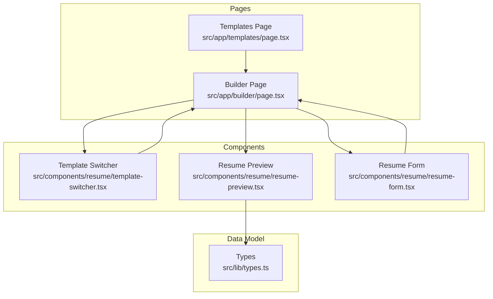
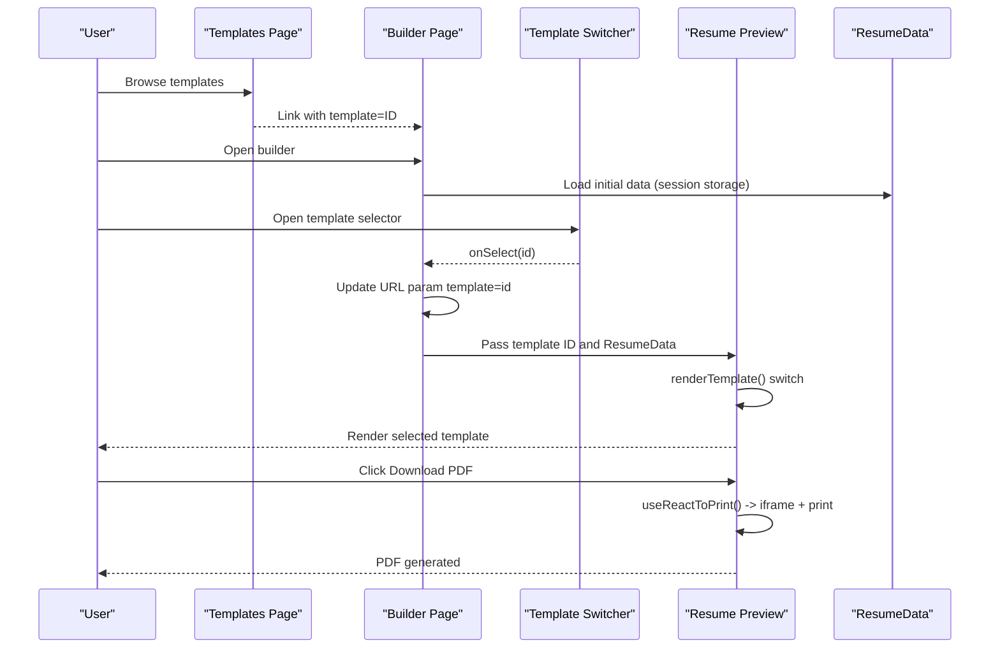
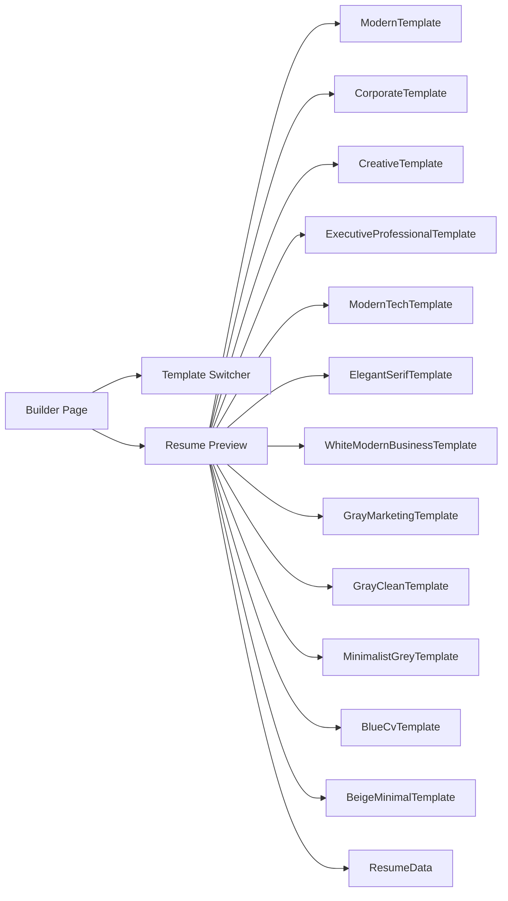

# Template Rendering Engine

<cite>
**Referenced Files in This Document**
- [page.tsx](file://src/app/templates/page.tsx)
- [page.tsx](file://src/app/builder/page.tsx)
- [resume-preview.tsx](file://src/components/resume/resume-preview.tsx)
- [template-switcher.tsx](file://src/components/resume/template-switcher.tsx)
- [resume-form.tsx](file://src/components/resume/resume-form.tsx)
- [types.ts](file://src/lib/types.ts)
- [layout.tsx](file://src/app/layout.tsx)
- [globals.css](file://src/app/globals.css)
</cite>

## Table of Contents
1. [Introduction](#introduction)
2. [Project Structure](#project-structure)
3. [Core Components](#core-components)
4. [Architecture Overview](#architecture-overview)
5. [Detailed Component Analysis](#detailed-component-analysis)
6. [Dependency Analysis](#dependency-analysis)
7. [Performance Considerations](#performance-considerations)
8. [Troubleshooting Guide](#troubleshooting-guide)
9. [Conclusion](#conclusion)

## Introduction
This document explains the template rendering engine that powers the resume preview system. It covers how templates are selected dynamically, how the ResumeData model drives rendering, and how each template component implements a distinct visual style. It also documents the template switching logic, prop handling, and the rendering pipeline that produces printable PDFs via a client-side print engine.

## Project Structure
The template system spans three primary areas:
- Template discovery and selection: a curated list of templates with metadata and images
- Template switching UI: a sidebar modal to choose among available templates
- Rendering engine: a factory-style switch that renders the selected template with ResumeData

**Diagram sources**
- [page.tsx:10-74](file://src/app/templates/page.tsx#L10-L74)
- [page.tsx:11-68](file://src/app/builder/page.tsx#L11-L68)
- [template-switcher.tsx:8-69](file://src/components/resume/template-switcher.tsx#L8-L69)
- [resume-preview.tsx:789-879](file://src/components/resume/resume-preview.tsx#L789-L879)
- [resume-form.tsx:19-84](file://src/components/resume/resume-form.tsx#L19-L84)
- [types.ts:69-79](file://src/lib/types.ts#L69-L79)

**Section sources**
- [page.tsx:10-74](file://src/app/templates/page.tsx#L10-L74)
- [page.tsx:11-68](file://src/app/builder/page.tsx#L11-L68)
- [template-switcher.tsx:8-69](file://src/components/resume/template-switcher.tsx#L8-L69)
- [resume-preview.tsx:789-879](file://src/components/resume/resume-preview.tsx#L789-L879)
- [resume-form.tsx:19-84](file://src/components/resume/resume-form.tsx#L19-L84)
- [types.ts:69-79](file://src/lib/types.ts#L69-L79)

## Core Components
- Templates Page: Presents available templates with images and descriptions, linking to the builder with a template parameter.
- Builder Page: Orchestrates editing and preview, manages template selection state, and persists user data.
- Template Switcher: Modal sidebar to browse and select templates.
- Resume Preview: Renders the chosen template using ResumeData and exposes a PDF download action.
- Resume Form: Editable sections that update ResumeData in real time.
- Types: Defines ResumeData and all subsections (personal info, experience, education, skills, projects, certifications, achievements, languages, links).

Key responsibilities:
- Dynamic template selection via URL parameter and state
- Factory-style rendering of template components
- Prop-driven rendering with ResumeData
- Client-side PDF generation using a print engine

**Section sources**
- [page.tsx:76-177](file://src/app/templates/page.tsx#L76-L177)
- [page.tsx:11-68](file://src/app/builder/page.tsx#L11-L68)
- [template-switcher.tsx:76-159](file://src/components/resume/template-switcher.tsx#L76-L159)
- [resume-preview.tsx:789-879](file://src/components/resume/resume-preview.tsx#L789-L879)
- [resume-form.tsx:19-84](file://src/components/resume/resume-form.tsx#L19-L84)
- [types.ts:69-79](file://src/lib/types.ts#L69-L79)

## Architecture Overview
The rendering pipeline connects user actions to visual output and printable exports:

**Diagram sources**
- [page.tsx:141-168](file://src/app/templates/page.tsx#L141-L168)
- [page.tsx:38-42](file://src/app/builder/page.tsx#L38-L42)
- [template-switcher.tsx:119-122](file://src/components/resume/template-switcher.tsx#L119-L122)
- [resume-preview.tsx:810-839](file://src/components/resume/resume-preview.tsx#L810-L839)

## Detailed Component Analysis

### Template Discovery and Selection
- Templates Page defines a curated list of templates with id, name, description, image, and popularity flag. Each card links to the builder with the template id as a query parameter.
- Builder Page reads the template id from URL parameters and passes it to ResumePreview and TemplateSwitcher.

Implementation highlights:
- URL parameter drives template selection
- Session storage persists ResumeData across sessions
- TemplateSwitcher opens a modal to browse and select templates

**Section sources**
- [page.tsx:10-74](file://src/app/templates/page.tsx#L10-L74)
- [page.tsx:118-173](file://src/app/templates/page.tsx#L118-L173)
- [page.tsx:11-42](file://src/app/builder/page.tsx#L11-L42)
- [template-switcher.tsx:76-159](file://src/components/resume/template-switcher.tsx#L76-L159)

### Template Switching Logic and Props
- TemplateSwitcher receives currentTemplate and onSelect props. When a user selects a template, onSelect is called with the chosen id, and the builder updates the URL accordingly.
- The builder’s handleTemplateSelect updates the URL search parameters and navigates without a full reload.

Prop handling:
- currentTemplate: string — the active template id
- onSelect: (id: string) => void — callback invoked when a template is selected

**Section sources**
- [template-switcher.tsx:71-74](file://src/components/resume/template-switcher.tsx#L71-L74)
- [template-switcher.tsx:119-122](file://src/components/resume/template-switcher.tsx#L119-L122)
- [page.tsx:38-42](file://src/app/builder/page.tsx#L38-L42)

### Template Rendering Pipeline and Factory
- ResumePreview accepts ResumeData and an optional template id (defaults to modern).
- renderTemplate() uses a switch statement to map template ids to specific template components.
- The selected template component receives ResumeData and renders the appropriate sections.

Template id to component mapping:
- modern → ModernTemplate
- professional/corporate → CorporateTemplate
- creative → CreativeTemplate
- executive-professional → ExecutiveProfessionalTemplate
- modern-tech → ModernTechTemplate
- elegant-serif → ElegantSerifTemplate
- white-modern-business → WhiteModernBusinessTemplate
- gray-marketing → GrayMarketingTemplate
- gray-clean → GrayCleanTemplate
- minimalist-grey → MinimalistGreyTemplate
- blue-cv → BlueCvTemplate
- beige-minimal → BeigeMinimalTemplate

Rendering behavior:
- Each template component destructures ResumeData and conditionally renders sections only when data exists
- Special handling for CreativeTemplate removes inner padding to support its two-column layout

**Section sources**
- [resume-preview.tsx:789-879](file://src/components/resume/resume-preview.tsx#L789-L879)
- [resume-preview.tsx:810-839](file://src/components/resume/resume-preview.tsx#L810-L839)
- [resume-preview.tsx:14-200](file://src/components/resume/resume-preview.tsx#L14-L200)
- [resume-preview.tsx:202-375](file://src/components/resume/resume-preview.tsx#L202-L375)
- [resume-preview.tsx:377-555](file://src/components/resume/resume-preview.tsx#L377-L555)
- [resume-preview.tsx:558-583](file://src/components/resume/resume-preview.tsx#L558-L583)
- [resume-preview.tsx:586-607](file://src/components/resume/resume-preview.tsx#L586-L607)
- [resume-preview.tsx:610-629](file://src/components/resume/resume-preview.tsx#L610-L629)
- [resume-preview.tsx:632-651](file://src/components/resume/resume-preview.tsx#L632-L651)
- [resume-preview.tsx:654-675](file://src/components/resume/resume-preview.tsx#L654-L675)
- [resume-preview.tsx:678-697](file://src/components/resume/resume-preview.tsx#L678-L697)
- [resume-preview.tsx:701-727](file://src/components/resume/resume-preview.tsx#L701-L727)
- [resume-preview.tsx:730-758](file://src/components/resume/resume-preview.tsx#L730-L758)
- [resume-preview.tsx:761-787](file://src/components/resume/resume-preview.tsx#L761-L787)

### ResumeData Model and Section Mapping
ResumeData is the single source of truth for rendering. Each template component consumes the relevant parts of ResumeData and renders matching sections. The model includes:
- personalInfo: name, contact, summary
- experience: list of jobs
- education: list of degrees
- skills: list of skills
- projects: list of projects
- certifications: list of certs
- achievements: list of accomplishments
- languages: list of languages and proficiency
- links: list of external links

Template components map sections as follows:
- ModernTemplate: personal summary, experience, education, projects, skills, certifications, achievements, languages, links
- CorporateTemplate: serif-based layout with centered headings and bullet lists
- CreativeTemplate: two-column layout with a dark sidebar and light main content
- ExecutiveProfessionalTemplate: bold typography and strong borders
- ModernTechTemplate: dark theme with teal accents and timeline visuals
- ElegantSerifTemplate: classic serif font with formal spacing
- WhiteModernBusinessTemplate: clean sans-serif with blue accents
- GrayMarketingTemplate: split layout with gray sidebar and white content
- GrayCleanTemplate: minimal spacing and clean typography
- MinimalistGreyTemplate: subtle greyscale with thin typography
- BlueCvTemplate: blue header with white content area
- BeigeMinimalTemplate: warm beige background with brown text
- WhiteModernBusinessTemplate: modern sans-serif with blue branding
- GrayMarketingTemplate: balanced split with gray and white
- GrayCleanTemplate: clean typography with muted grays
- MinimalistGreyTemplate: minimalist greyscale
- BlueCvTemplate: blue branding with white content
- BeigeMinimalTemplate: warm beige with brown tones

**Section sources**
- [types.ts:69-79](file://src/lib/types.ts#L69-L79)
- [resume-preview.tsx:14-200](file://src/components/resume/resume-preview.tsx#L14-L200)
- [resume-preview.tsx:202-375](file://src/components/resume/resume-preview.tsx#L202-L375)
- [resume-preview.tsx:377-555](file://src/components/resume/resume-preview.tsx#L377-L555)
- [resume-preview.tsx:558-697](file://src/components/resume/resume-preview.tsx#L558-L697)
- [resume-preview.tsx:701-787](file://src/components/resume/resume-preview.tsx#L701-L787)

### PDF Export and Print Engine
- ResumePreview integrates a print-based PDF export using a print engine. When the user clicks “Download PDF,” the component triggers the print engine to capture the rendered template and produce a PDF.
- The wrapper element uses a fixed aspect ratio and special print styles to ensure accurate output across templates.

Key behaviors:
- useReactToPrint captures the ref of the resume container
- Document title is derived from personalInfo
- Download button disables during generation to prevent duplicate triggers

**Section sources**
- [resume-preview.tsx:796-808](file://src/components/resume/resume-preview.tsx#L796-L808)
- [resume-preview.tsx:841-879](file://src/components/resume/resume-preview.tsx#L841-L879)

### Extending the Rendering Engine
To add a new template:
1. Define a new template component that accepts ResumeData and renders the desired sections.
2. Add a new case in renderTemplate() that maps a new template id to the component.
3. Optionally add the template id to the template lists in Templates Page and Template Switcher for discoverability.
4. Test the new template with the print engine to ensure proper PDF output.

Customization tips:
- Use Tailwind classes for consistent styling across themes
- For two-column layouts, remove inner padding on the outer container to avoid extra margins
- Preserve semantic headings and lists for accessibility and ATS compatibility

**Section sources**
- [resume-preview.tsx:810-839](file://src/components/resume/resume-preview.tsx#L810-L839)
- [page.tsx:10-74](file://src/app/templates/page.tsx#L10-L74)
- [template-switcher.tsx:8-69](file://src/components/resume/template-switcher.tsx#L8-L69)

## Dependency Analysis
The template rendering engine exhibits low coupling and high cohesion:
- Builder depends on TemplateSwitcher and ResumePreview
- ResumePreview depends on ResumeData and template components
- Template components depend only on ResumeData
- Templates Page and Template Switcher share template metadata arrays

**Diagram sources**
- [page.tsx:44-64](file://src/app/builder/page.tsx#L44-L64)
- [resume-preview.tsx:810-839](file://src/components/resume/resume-preview.tsx#L810-L839)
- [types.ts:69-79](file://src/lib/types.ts#L69-L79)

**Section sources**
- [page.tsx:44-64](file://src/app/builder/page.tsx#L44-L64)
- [resume-preview.tsx:810-839](file://src/components/resume/resume-preview.tsx#L810-L839)
- [types.ts:69-79](file://src/lib/types.ts#L69-L79)

## Performance Considerations
- Rendering cost: Each template component iterates over arrays (experience, education, projects, etc.). Keep arrays reasonably sized for optimal performance.
- Memoization: Consider memoizing ResumeData updates in the builder to reduce unnecessary re-renders.
- Print engine: The PDF generation occurs client-side; large or complex templates may increase print time. Keep templates streamlined for best UX.
- Images: Template preview images are served locally; ensure they are optimized to minimize load times.

## Troubleshooting Guide
Common issues and resolutions:
- Template not rendering: Verify the template id matches a case in renderTemplate(). Default case falls back to ModernTemplate.
- Empty sections: Ensure the corresponding ResumeData arrays are populated. Template components conditionally render only when data exists.
- Two-column layout misalignment: For templates like CreativeTemplate, confirm the wrapper padding is removed to avoid extra margins.
- PDF missing backgrounds: Confirm print styles are applied and background printing is enabled in the print engine configuration.
- URL parameter not updating: Ensure handleTemplateSelect updates the URL and router navigation is triggered.

**Section sources**
- [resume-preview.tsx:810-839](file://src/components/resume/resume-preview.tsx#L810-L839)
- [page.tsx:38-42](file://src/app/builder/page.tsx#L38-L42)
- [template-switcher.tsx:119-122](file://src/components/resume/template-switcher.tsx#L119-L122)

## Conclusion
The template rendering engine uses a clean, extensible factory pattern to render diverse resume designs from a unified ResumeData model. Users can browse and select templates, edit content in real time, and export high-fidelity PDFs using a robust client-side print engine. Extending the system involves adding new template components and mapping ids in the renderer, with minimal impact on existing functionality.