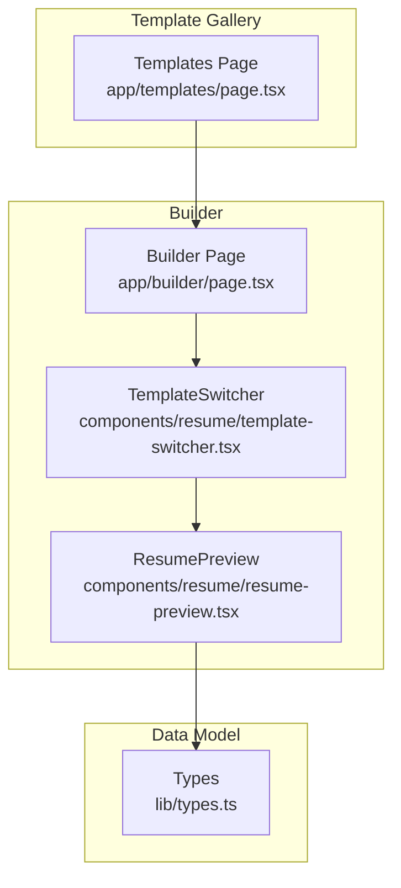
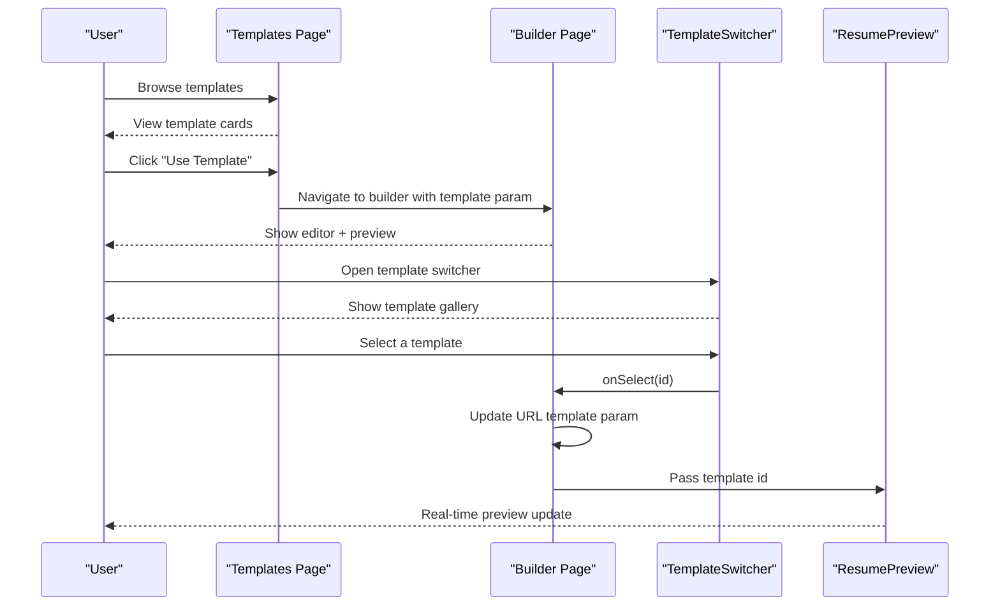
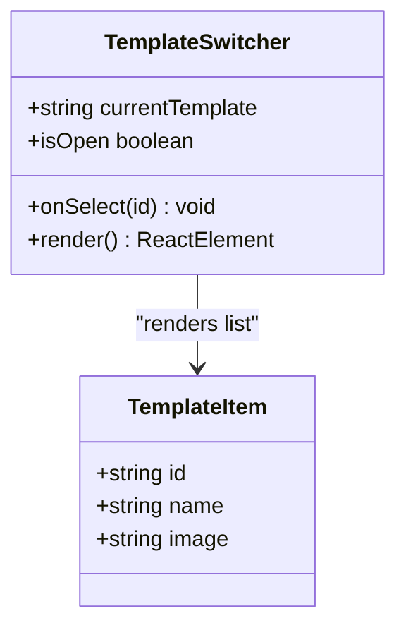
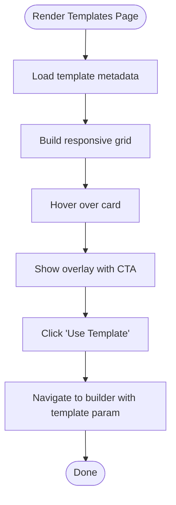
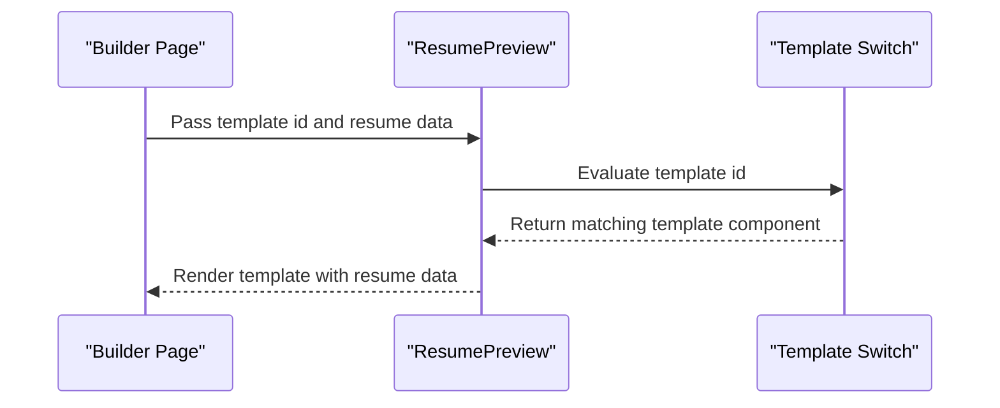
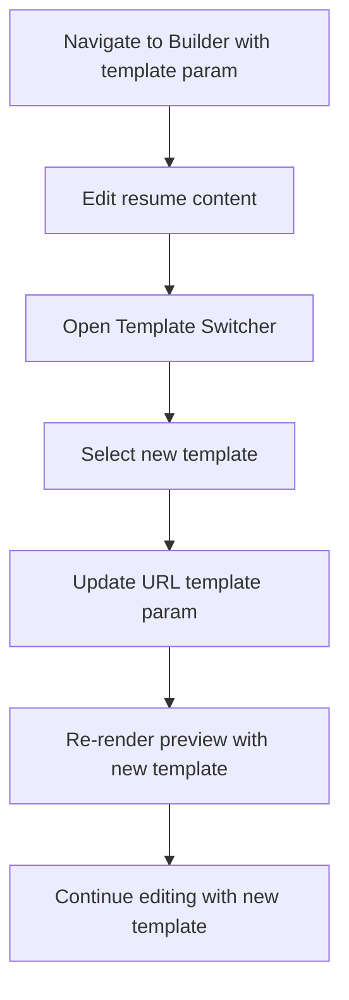
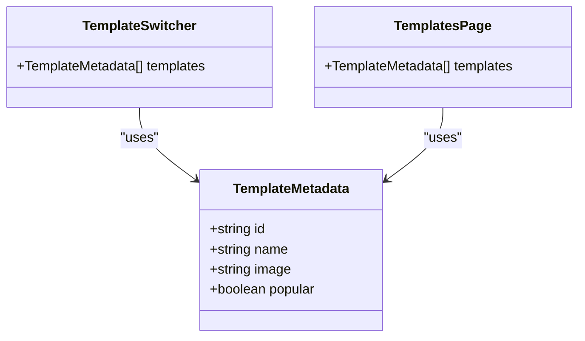
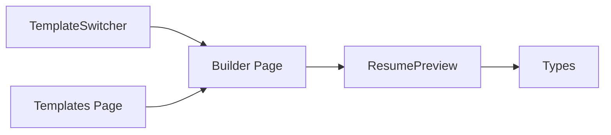

# Template Switching Interface

<cite>
**Referenced Files in This Document**
- [template-switcher.tsx](file://src/components/resume/template-switcher.tsx)
- [page.tsx](file://src/app/templates/page.tsx)
- [page.tsx](file://src/app/builder/page.tsx)
- [resume-preview.tsx](file://src/components/resume/resume-preview.tsx)
- [types.ts](file://src/lib/types.ts)
</cite>

## Table of Contents
1. [Introduction](#introduction)
2. [Project Structure](#project-structure)
3. [Core Components](#core-components)
4. [Architecture Overview](#architecture-overview)
5. [Detailed Component Analysis](#detailed-component-analysis)
6. [Dependency Analysis](#dependency-analysis)
7. [Performance Considerations](#performance-considerations)
8. [Troubleshooting Guide](#troubleshooting-guide)
9. [Conclusion](#conclusion)

## Introduction
This document explains the template switching interface that enables users to browse, preview, and select different resume templates. It covers the template gallery implementation, the template preview system, and the user interaction patterns for selecting templates. It documents the TemplateSwitcher component architecture, how templates are organized and presented, the template selection workflow, state management, and real-time preview updates. It also includes guidance on adding new templates and maintaining template consistency.

## Project Structure
The template switching interface spans several key areas:
- Template gallery page for browsing templates
- Template selection sidebar for quick switching during editing
- Template preview component that renders the selected template
- Shared data model for resume content

**Diagram sources**
- [page.tsx:76-177](file://src/app/templates/page.tsx#L76-L177)
- [page.tsx:11-78](file://src/app/builder/page.tsx#L11-L78)
- [template-switcher.tsx:76-158](file://src/components/resume/template-switcher.tsx#L76-L158)
- [resume-preview.tsx:789-879](file://src/components/resume/resume-preview.tsx#L789-L879)
- [types.ts:69-103](file://src/lib/types.ts#L69-L103)

**Section sources**
- [page.tsx:76-177](file://src/app/templates/page.tsx#L76-L177)
- [page.tsx:11-78](file://src/app/builder/page.tsx#L11-L78)
- [template-switcher.tsx:76-158](file://src/components/resume/template-switcher.tsx#L76-L158)
- [resume-preview.tsx:789-879](file://src/components/resume/resume-preview.tsx#L789-L879)
- [types.ts:69-103](file://src/lib/types.ts#L69-L103)

## Core Components
- TemplateSwitcher: A floating sidebar that displays available templates and lets users switch in-place while editing.
- Templates Page: A gallery page showcasing templates with descriptions and a “Use Template” action.
- ResumePreview: Renders the selected template in real-time based on current resume data and template ID.
- Types: Defines the resume data structure used across components.

Key responsibilities:
- TemplateSwitcher: Manages visibility state, tracks the current template, and triggers selection callbacks.
- Templates Page: Provides a grid of template cards with hover actions and direct navigation to the builder with a selected template.
- ResumePreview: Switches between template components based on the template ID prop and renders the resume content accordingly.

**Section sources**
- [template-switcher.tsx:76-158](file://src/components/resume/template-switcher.tsx#L76-L158)
- [page.tsx:76-177](file://src/app/templates/page.tsx#L76-L177)
- [resume-preview.tsx:810-839](file://src/components/resume/resume-preview.tsx#L810-L839)
- [types.ts:69-103](file://src/lib/types.ts#L69-L103)

## Architecture Overview
The template switching architecture integrates a gallery-first discovery flow with an in-place switching mechanism during editing.

**Diagram sources**
- [page.tsx:141-145](file://src/app/templates/page.tsx#L141-L145)
- [page.tsx:38-42](file://src/app/builder/page.tsx#L38-L42)
- [template-switcher.tsx:119-122](file://src/components/resume/template-switcher.tsx#L119-L122)
- [resume-preview.tsx:810-839](file://src/components/resume/resume-preview.tsx#L810-L839)

## Detailed Component Analysis

### TemplateSwitcher Component
The TemplateSwitcher is a reusable UI component that:
- Displays a list of templates in a slide-out sidebar
- Highlights the currently selected template
- Updates the template selection and closes the drawer on selection

Implementation highlights:
- State management: Tracks whether the drawer is open
- Props: Receives currentTemplate and onSelect callback
- Visual indicators: Selected template is highlighted with a checkmark and “Current” badge
- Interaction: Clicking a template invokes onSelect and closes the drawer

**Diagram sources**
- [template-switcher.tsx:71-74](file://src/components/resume/template-switcher.tsx#L71-L74)
- [template-switcher.tsx:8-69](file://src/components/resume/template-switcher.tsx#L8-L69)

**Section sources**
- [template-switcher.tsx:76-158](file://src/components/resume/template-switcher.tsx#L76-L158)

### Templates Page (Gallery)
The Templates Page presents a responsive grid of template cards:
- Each card shows a preview image, name, description, and “Most Popular” badge
- Hover overlay reveals a CTA to use the template
- Cards link to the builder with the template ID as a URL parameter

Responsive design:
- Grid layout adapts from 1 column on small screens to 3 columns on large screens
- Motion animations enhance the browsing experience

**Diagram sources**
- [page.tsx:112-177](file://src/app/templates/page.tsx#L112-L177)

**Section sources**
- [page.tsx:76-177](file://src/app/templates/page.tsx#L76-L177)

### ResumePreview and Template Rendering
ResumePreview renders the selected template in real-time:
- Receives template ID and resume data props
- Switches between template components based on the template ID
- Uses a print engine to generate downloadable PDFs

Template rendering logic:
- A switch statement maps template IDs to specific template components
- Default case falls back to a modern template
- The preview area maintains consistent A4 proportions and adjusts padding per template

**Diagram sources**
- [resume-preview.tsx:810-839](file://src/components/resume/resume-preview.tsx#L810-L839)
- [resume-preview.tsx:854-864](file://src/components/resume/resume-preview.tsx#L854-L864)

**Section sources**
- [resume-preview.tsx:789-879](file://src/components/resume/resume-preview.tsx#L789-L879)
- [types.ts:69-103](file://src/lib/types.ts#L69-L103)

### Template Selection Workflow
The selection workflow connects gallery browsing to in-place switching:
- Gallery selection navigates to the builder with a template parameter
- During editing, users can open the TemplateSwitcher to quickly change templates
- Selection updates the URL parameter and immediately re-renders the preview

**Diagram sources**
- [page.tsx:38-42](file://src/app/builder/page.tsx#L38-L42)
- [template-switcher.tsx:119-122](file://src/components/resume/template-switcher.tsx#L119-L122)
- [resume-preview.tsx:810-839](file://src/components/resume/resume-preview.tsx#L810-L839)

**Section sources**
- [page.tsx:38-42](file://src/app/builder/page.tsx#L38-L42)
- [template-switcher.tsx:119-122](file://src/components/resume/template-switcher.tsx#L119-L122)

### Template Organization and Presentation
Templates are represented as a static list with:
- id: used to identify and switch templates
- name: human-readable display name
- image: preview image path
- Additional attributes (e.g., popular flag) in the gallery context

Template IDs align with the switch statement in ResumePreview to ensure consistent routing.

**Diagram sources**
- [template-switcher.tsx:8-69](file://src/components/resume/template-switcher.tsx#L8-L69)
- [page.tsx:10-74](file://src/app/templates/page.tsx#L10-L74)

**Section sources**
- [template-switcher.tsx:8-69](file://src/components/resume/template-switcher.tsx#L8-L69)
- [page.tsx:10-74](file://src/app/templates/page.tsx#L10-L74)

### Adding New Templates
To add a new template:
1. Define a new template component in ResumePreview with a unique template ID
2. Extend the switch statement in ResumePreview to map the new ID to the component
3. Add a new entry to the template lists in both TemplateSwitcher and Templates Page
4. Provide a preview image under the public templates directory
5. Ensure the template ID is consistent across the gallery, switcher, and builder

Guidance:
- Keep template IDs stable and descriptive
- Maintain consistent data shapes using the shared ResumeData interface
- Test the new template in both desktop and mobile preview sizes

**Section sources**
- [resume-preview.tsx:810-839](file://src/components/resume/resume-preview.tsx#L810-L839)
- [template-switcher.tsx:8-69](file://src/components/resume/template-switcher.tsx#L8-L69)
- [page.tsx:10-74](file://src/app/templates/page.tsx#L10-L74)
- [types.ts:69-103](file://src/lib/types.ts#L69-L103)

## Dependency Analysis
The template switching system exhibits low coupling and clear separation of concerns:
- TemplateSwitcher depends on the builder’s URL parameter handling and the preview component
- Templates Page depends on the builder route and template metadata
- ResumePreview depends on the template ID and the shared resume data model

**Diagram sources**
- [template-switcher.tsx:52-52](file://src/components/resume/template-switcher.tsx#L52-L52)
- [page.tsx:38-42](file://src/app/builder/page.tsx#L38-L42)
- [resume-preview.tsx:789-879](file://src/components/resume/resume-preview.tsx#L789-L879)
- [types.ts:69-103](file://src/lib/types.ts#L69-L103)

**Section sources**
- [template-switcher.tsx:52-52](file://src/components/resume/template-switcher.tsx#L52-L52)
- [page.tsx:38-42](file://src/app/builder/page.tsx#L38-L42)
- [resume-preview.tsx:789-879](file://src/components/resume/resume-preview.tsx#L789-L879)
- [types.ts:69-103](file://src/lib/types.ts#L69-L103)

## Performance Considerations
- Real-time preview updates: Template switching re-renders the preview component; keep template components efficient and avoid heavy computations inside render
- Image loading: Ensure preview images are optimized and sized appropriately to minimize load times
- URL parameter updates: Using URL updates avoids unnecessary state churn and enables direct linking to templates
- Responsive layout: The gallery uses CSS grid and motion animations; ensure smooth performance on lower-powered devices

## Troubleshooting Guide
Common issues and resolutions:
- Template not rendering: Verify the template ID exists in the switch statement and matches the ID used in the gallery and switcher
- Preview not updating: Confirm the builder passes the correct template ID to ResumePreview and that the URL parameter is updated on selection
- Missing preview image: Ensure the image path exists and is accessible under the public templates directory
- Inconsistent styling: Check that the template component uses the shared ResumeData structure and applies consistent spacing and typography

**Section sources**
- [resume-preview.tsx:810-839](file://src/components/resume/resume-preview.tsx#L810-L839)
- [page.tsx:38-42](file://src/app/builder/page.tsx#L38-L42)
- [template-switcher.tsx:119-122](file://src/components/resume/template-switcher.tsx#L119-L122)

## Conclusion
The template switching interface combines a discoverable gallery with an efficient in-place selector, enabling users to explore templates and apply changes instantly. The architecture cleanly separates presentation, selection, and rendering, while the shared data model ensures consistency across components. Extending the system with new templates requires minimal changes and follows established patterns for ID mapping, preview rendering, and user interaction.