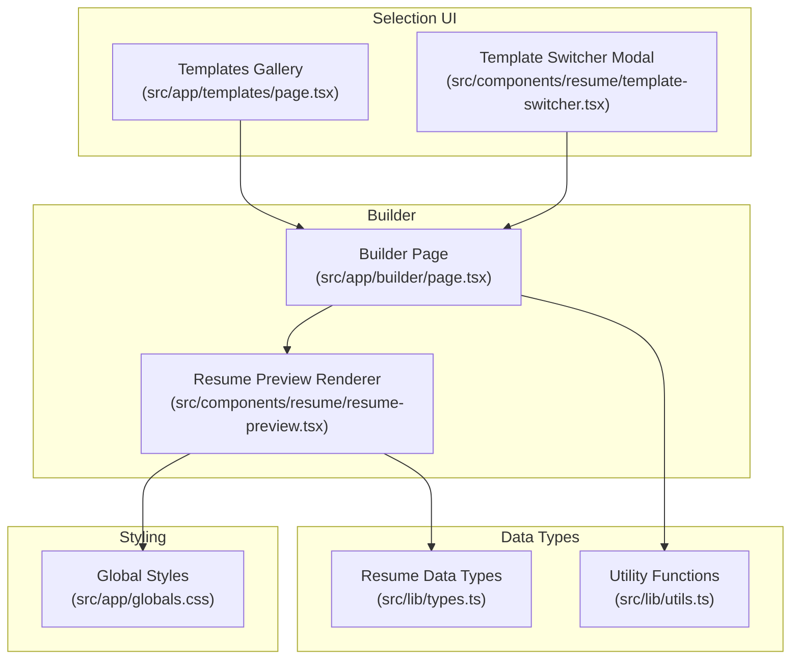
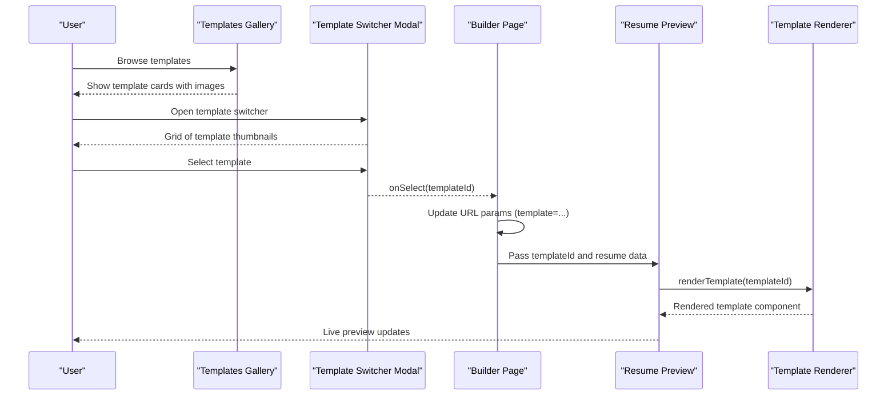
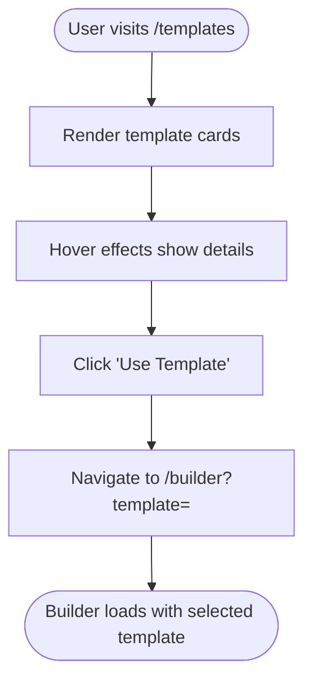
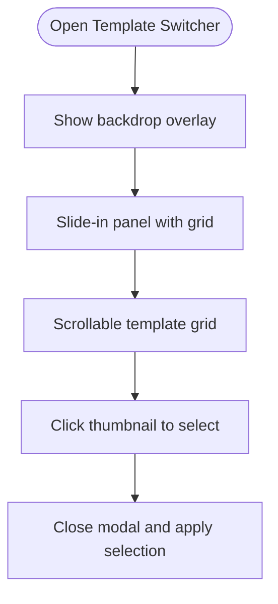
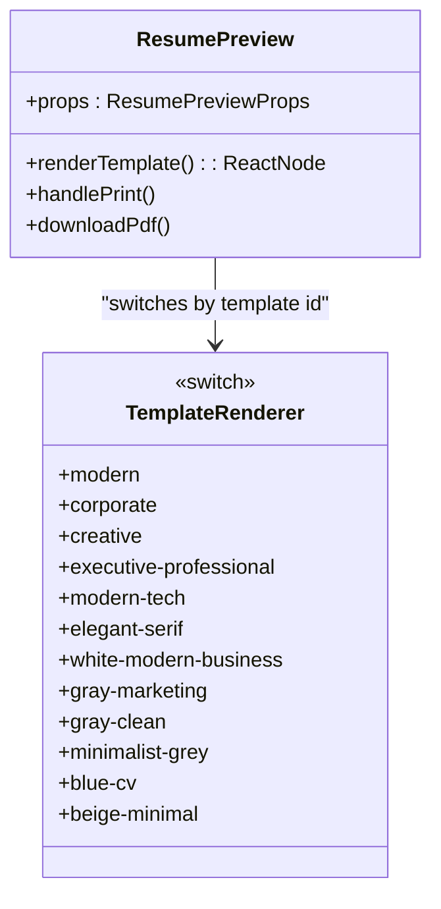
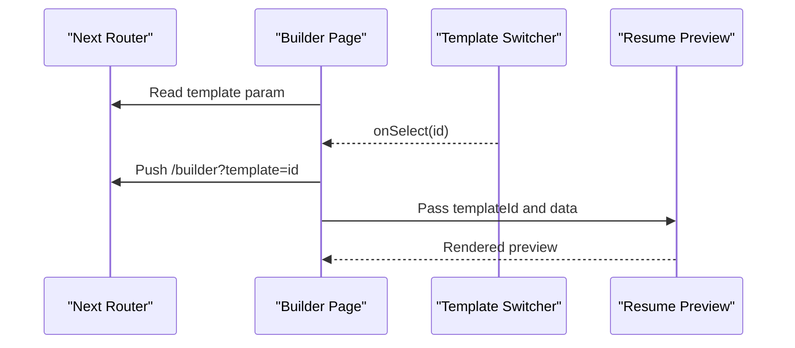
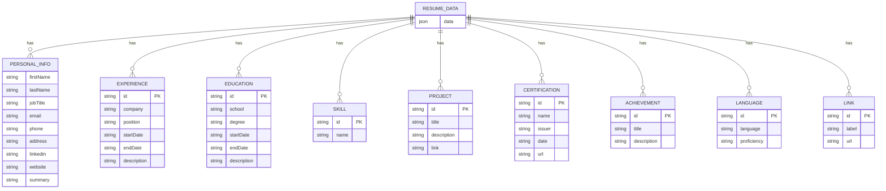
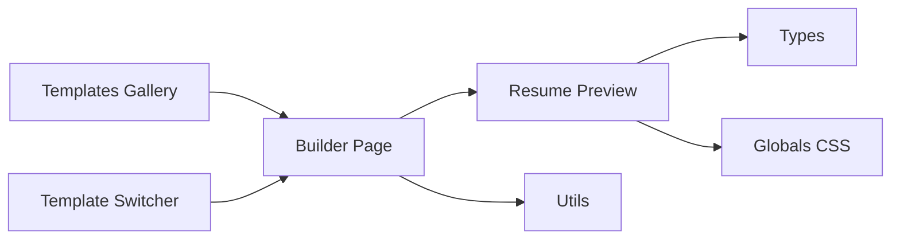

# Template System

<cite>
**Referenced Files in This Document**
- [template-switcher.tsx](file://src/components/resume/template-switcher.tsx)
- [page.tsx](file://src/app/templates/page.tsx)
- [resume-preview.tsx](file://src/components/resume/resume-preview.tsx)
- [page.tsx](file://src/app/builder/page.tsx)
- [types.ts](file://src/lib/types.ts)
- [globals.css](file://src/app/globals.css)
- [utils.ts](file://src/lib/utils.ts)
</cite>

## Table of Contents
1. [Introduction](#introduction)
2. [Project Structure](#project-structure)
3. [Core Components](#core-components)
4. [Architecture Overview](#architecture-overview)
5. [Detailed Component Analysis](#detailed-component-analysis)
6. [Dependency Analysis](#dependency-analysis)
7. [Performance Considerations](#performance-considerations)
8. [Troubleshooting Guide](#troubleshooting-guide)
9. [Conclusion](#conclusion)

## Introduction
This document explains the template system of the resume builder application. It covers the template rendering engine architecture, template switching mechanism, available template categories, template structure and styling, responsive design patterns, preview and selection interfaces, PDF generation pipeline, customization guidelines, and best practices for extending the template library.

## Project Structure
The template system spans three main areas:
- Template selection UI: a modal-based template picker and a gallery page for browsing templates
- Template rendering engine: a runtime component that renders the selected template with resume data
- Builder integration: the main builder page that orchestrates editing, preview, and template switching

**Diagram sources**
- [page.tsx:10-74](file://src/app/templates/page.tsx#L10-74)
- [template-switcher.tsx:8-69](file://src/components/resume/template-switcher.tsx#L8-69)
- [page.tsx:11-67](file://src/app/builder/page.tsx#L11-67)
- [resume-preview.tsx:789-879](file://src/components/resume/resume-preview.tsx#L789-879)
- [types.ts:69-103](file://src/lib/types.ts#L69-103)
- [utils.ts:4-6](file://src/lib/utils.ts#L4-6)
- [globals.css:1-169](file://src/app/globals.css#L1-169)

**Section sources**
- [page.tsx:10-74](file://src/app/templates/page.tsx#L10-74)
- [template-switcher.tsx:8-69](file://src/components/resume/template-switcher.tsx#L8-69)
- [page.tsx:11-67](file://src/app/builder/page.tsx#L11-67)
- [resume-preview.tsx:789-879](file://src/components/resume/resume-preview.tsx#L789-879)
- [types.ts:69-103](file://src/lib/types.ts#L69-103)
- [utils.ts:4-6](file://src/lib/utils.ts#L4-6)
- [globals.css:1-169](file://src/app/globals.css#L1-169)

## Core Components
- Template gallery page: displays available templates with images, descriptions, and selection actions
- Template switcher modal: allows users to browse and select templates with a preview grid
- Resume preview renderer: dynamically renders the selected template with live resume data and supports PDF export
- Builder page: integrates editing, template switching, and preview in a responsive layout
- Data types: strongly typed resume data model used across components
- Utilities: shared utility functions (e.g., class merging)

Key responsibilities:
- Selection: templates gallery and modal present previews and trigger navigation
- Rendering: preview renderer selects the appropriate template component and applies styles
- Persistence: builder page persists resume data and template selection via URL parameters and session storage
- Styling: global Tailwind-based theme and dark mode support

**Section sources**
- [page.tsx:76-177](file://src/app/templates/page.tsx#L76-177)
- [template-switcher.tsx:76-158](file://src/components/resume/template-switcher.tsx#L76-158)
- [resume-preview.tsx:810-839](file://src/components/resume/resume-preview.tsx#L810-839)
- [page.tsx:11-67](file://src/app/builder/page.tsx#L11-67)
- [types.ts:69-103](file://src/lib/types.ts#L69-103)
- [utils.ts:4-6](file://src/lib/utils.ts#L4-6)

## Architecture Overview
The template system follows a modular, component-driven architecture:
- Selection layer: users choose templates from a gallery or modal
- Builder orchestration: manages state, routing, and template selection
- Rendering layer: switches between template components based on selection
- Export pipeline: generates PDFs client-side using a print engine

**Diagram sources**
- [page.tsx:118-173](file://src/app/templates/page.tsx#L118-173)
- [template-switcher.tsx:119-122](file://src/components/resume/template-switcher.tsx#L119-122)
- [page.tsx:38-42](file://src/app/builder/page.tsx#L38-42)
- [resume-preview.tsx:810-839](file://src/components/resume/resume-preview.tsx#L810-839)

## Detailed Component Analysis

### Template Gallery and Selection
The gallery page presents templates with:
- Preview images
- Descriptions and popular badges
- Hover actions to preview and select
- Responsive grid layout with animations

**Diagram sources**
- [page.tsx:112-173](file://src/app/templates/page.tsx#L112-173)

**Section sources**
- [page.tsx:10-74](file://src/app/templates/page.tsx#L10-74)
- [page.tsx:76-177](file://src/app/templates/page.tsx#L76-177)

### Template Switcher Modal
The modal provides an immersive template selection experience:
- Overlay backdrop with animation
- Right-side sliding panel with scrollable grid
- Thumbnail previews with hover scaling
- Current selection indicator and badge
- Smooth transitions and focus management

**Diagram sources**
- [template-switcher.tsx:86-155](file://src/components/resume/template-switcher.tsx#L86-155)

**Section sources**
- [template-switcher.tsx:76-158](file://src/components/resume/template-switcher.tsx#L76-158)

### Resume Preview and Template Rendering Engine
The preview component:
- Receives resume data and selected template ID
- Uses a switch statement to render the appropriate template component
- Provides a PDF download button using a print engine
- Applies responsive wrapper and print-friendly styles

Available templates and IDs:
- modern
- corporate / professional
- creative
- executive-professional
- modern-tech
- elegant-serif
- white-modern-business
- gray-marketing
- gray-clean
- minimalist-grey
- blue-cv
- beige-minimal

**Diagram sources**
- [resume-preview.tsx:810-839](file://src/components/resume/resume-preview.tsx#L810-839)

**Section sources**
- [resume-preview.tsx:789-879](file://src/components/resume/resume-preview.tsx#L789-879)
- [resume-preview.tsx:810-839](file://src/components/resume/resume-preview.tsx#L810-839)

### Builder Integration
The builder page:
- Reads template from URL parameters
- Persists resume data in session storage
- Integrates template switcher and preview panels
- Updates URL when a new template is selected

**Diagram sources**
- [page.tsx:11-67](file://src/app/builder/page.tsx#L11-67)
- [template-switcher.tsx:119-122](file://src/components/resume/template-switcher.tsx#L119-122)

**Section sources**
- [page.tsx:11-67](file://src/app/builder/page.tsx#L11-67)

### Data Model and Type Safety
The resume data model defines structured fields for all resume sections. This ensures:
- Consistent data shape across components
- Type-safe rendering in template components
- Easier maintenance and extension

**Diagram sources**
- [types.ts:69-103](file://src/lib/types.ts#L69-103)

**Section sources**
- [types.ts:1-103](file://src/lib/types.ts#L1-103)

### Styling and Responsive Design
Global styling:
- Tailwind-based theme with custom CSS variables
- Dark mode support via CSS variables and variants
- Base layer styles for consistent typography and borders

Responsive patterns:
- Grid layouts adapt from 1 to 3 columns on larger screens
- Aspect ratios maintained for preview containers
- Mobile-first design with hidden controls on small screens

**Section sources**
- [globals.css:1-169](file://src/app/globals.css#L1-169)
- [page.tsx:112-117](file://src/app/templates/page.tsx#L112-117)
- [resume-preview.tsx:854-864](file://src/components/resume/resume-preview.tsx#L854-864)

## Dependency Analysis
The template system exhibits low coupling and high cohesion:
- Selection components depend on URL parameters and navigation
- Preview component depends on resume data types and template IDs
- Builder coordinates selection and preview without tight coupling
- Utilities provide shared helpers (e.g., class merging)

**Diagram sources**
- [page.tsx:118-173](file://src/app/templates/page.tsx#L118-173)
- [template-switcher.tsx:119-122](file://src/components/resume/template-switcher.tsx#L119-122)
- [page.tsx:38-67](file://src/app/builder/page.tsx#L38-67)
- [resume-preview.tsx:810-839](file://src/components/resume/resume-preview.tsx#L810-839)
- [types.ts:69-103](file://src/lib/types.ts#L69-103)
- [utils.ts:4-6](file://src/lib/utils.ts#L4-6)
- [globals.css:1-169](file://src/app/globals.css#L1-169)

**Section sources**
- [page.tsx:118-173](file://src/app/templates/page.tsx#L118-173)
- [template-switcher.tsx:119-122](file://src/components/resume/template-switcher.tsx#L119-122)
- [page.tsx:38-67](file://src/app/builder/page.tsx#L38-67)
- [resume-preview.tsx:810-839](file://src/components/resume/resume-preview.tsx#L810-839)
- [types.ts:69-103](file://src/lib/types.ts#L69-103)
- [utils.ts:4-6](file://src/lib/utils.ts#L4-6)
- [globals.css:1-169](file://src/app/globals.css#L1-169)

## Performance Considerations
- Template rendering: Each template is a separate component; consider lazy-loading for large template sets
- Preview updates: Keep resume data updates minimal to reduce re-renders
- Images: Use appropriately sized preview images to minimize bandwidth
- Print pipeline: Client-side PDF generation avoids server overhead but may impact large documents
- CSS: Tailwind utilities are efficient; avoid excessive custom CSS in templates

## Troubleshooting Guide
Common issues and resolutions:
- Template not changing: Verify URL parameter updates and builder state persistence
- Preview not updating: Ensure resume data is passed correctly to the preview component
- Print quality: Confirm print styles are applied and browser print settings are default
- Styling inconsistencies: Check Tailwind configuration and dark mode variables

**Section sources**
- [page.tsx:38-42](file://src/app/builder/page.tsx#L38-42)
- [resume-preview.tsx:810-839](file://src/components/resume/resume-preview.tsx#L810-839)
- [globals.css:57-86](file://src/app/globals.css#L57-86)

## Conclusion
The template system combines a clean selection interface with a flexible rendering engine. It leverages Next.js routing, React components, and Tailwind CSS to deliver a responsive, customizable experience. The modular design enables easy addition of new templates and consistent styling across the application.