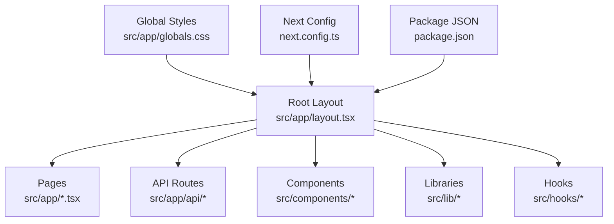
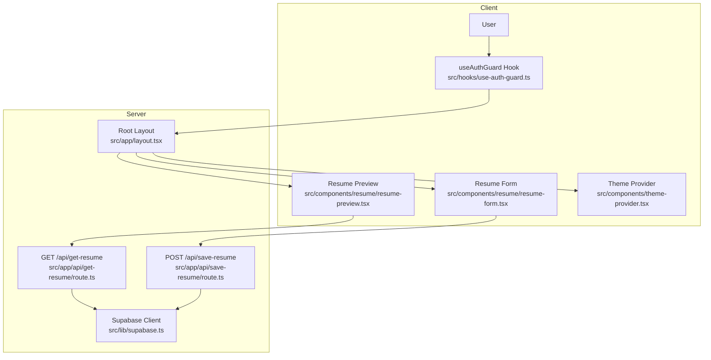
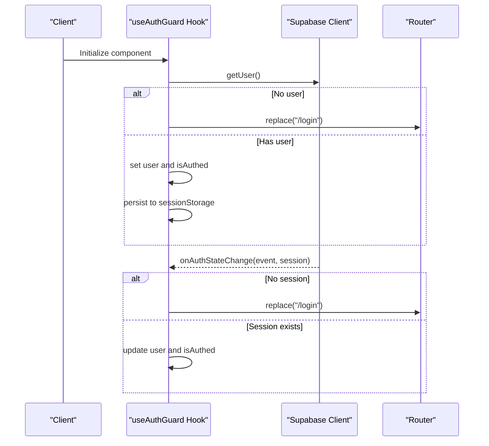
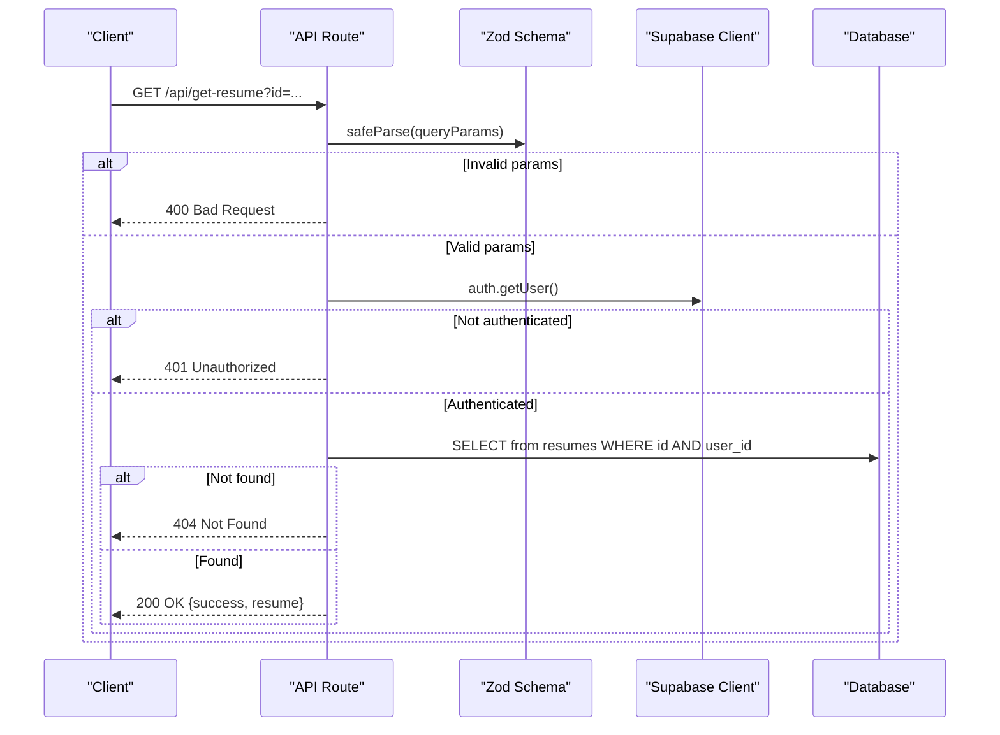
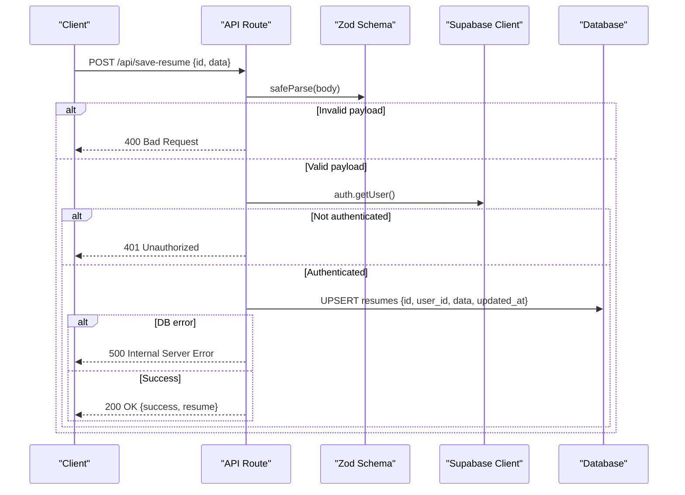
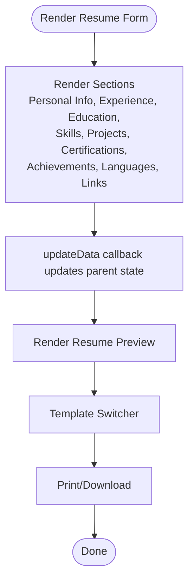
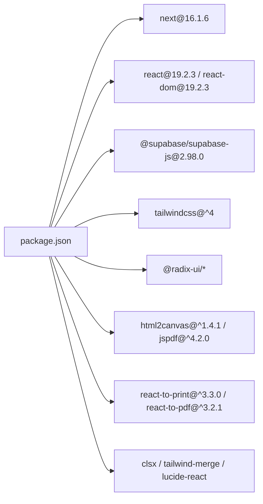

# Troubleshooting and FAQ

<cite>
**Referenced Files in This Document**
- [README.md](file://README.md)
- [package.json](file://package.json)
- [next.config.ts](file://next.config.ts)
- [src/lib/supabase.ts](file://src/lib/supabase.ts)
- [src/hooks/use-auth-guard.ts](file://src/hooks/use-auth-guard.ts)
- [src/app/api/get-resume/route.ts](file://src/app/api/get-resume/route.ts)
- [src/app/api/save-resume/route.ts](file://src/app/api/save-resume/route.ts)
- [src/app/layout.tsx](file://src/app/layout.tsx)
- [src/components/theme-provider.tsx](file://src/components/theme-provider.tsx)
- [src/components/resume/resume-form.tsx](file://src/components/resume/resume-form.tsx)
- [src/components/resume/resume-preview.tsx](file://src/components/resume/resume-preview.tsx)
- [src/lib/utils.ts](file://src/lib/utils.ts)
- [src/lib/types.ts](file://src/lib/types.ts)
- [GOOGLE_OAUTH_SETUP.md](file://GOOGLE_OAUTH_SETUP.md)
</cite>

## Table of Contents
1. [Introduction](#introduction)
2. [Project Structure](#project-structure)
3. [Core Components](#core-components)
4. [Architecture Overview](#architecture-overview)
5. [Detailed Component Analysis](#detailed-component-analysis)
6. [Dependency Analysis](#dependency-analysis)
7. [Performance Considerations](#performance-considerations)
8. [Troubleshooting Guide](#troubleshooting-guide)
9. [Conclusion](#conclusion)
10. [Appendices](#appendices)

## Introduction
This section provides a practical guide to diagnosing and resolving common issues in the nh.intern project. It covers setup and environment configuration, dependency conflicts, runtime errors, API integration problems, template rendering issues, debugging techniques for state and data flow, authentication problems, performance bottlenecks, build and deployment failures, browser compatibility and mobile responsiveness, accessibility concerns, feature limitations, customization options, integration possibilities, security considerations, data migration, and upgrade procedures. The goal is to equip developers and operators with a systematic approach to troubleshooting.

## Project Structure
The project is a Next.js application with a clear separation of concerns:
- Application pages and API routes under src/app
- Shared components under src/components
- Libraries and utilities under src/lib
- Hooks under src/hooks
- Global styles and fonts under src/app/globals.css and src/app/layout.tsx
- Configuration files for Next.js, TypeScript, ESLint, Tailwind CSS, and PostCSS

**Diagram sources**
- [src/app/layout.tsx:1-50](file://src/app/layout.tsx#L1-L50)
- [next.config.ts:1-8](file://next.config.ts#L1-L8)
- [package.json:1-43](file://package.json#L1-L43)

**Section sources**
- [README.md:1-37](file://README.md#L1-L37)
- [package.json:1-43](file://package.json#L1-L43)
- [next.config.ts:1-8](file://next.config.ts#L1-L8)
- [src/app/layout.tsx:1-50](file://src/app/layout.tsx#L1-L50)

## Core Components
- Authentication guard: Validates user session and redirects unauthenticated users to the login page.
- Supabase client: Centralized client initialization with environment variables for Supabase URL and anonymous key.
- API endpoints: Secure endpoints for fetching and saving resumes with Zod validation and error handling.
- Resume form and preview: Modular components for editing and rendering resumes with multiple templates.
- Theme provider: Manages light/dark mode and theme persistence.

Key implementation references:
- Authentication guard: [src/hooks/use-auth-guard.ts:1-51](file://src/hooks/use-auth-guard.ts#L1-L51)
- Supabase client: [src/lib/supabase.ts:1-11](file://src/lib/supabase.ts#L1-L11)
- Get resume API: [src/app/api/get-resume/route.ts:1-58](file://src/app/api/get-resume/route.ts#L1-L58)
- Save resume API: [src/app/api/save-resume/route.ts:1-83](file://src/app/api/save-resume/route.ts#L1-L83)
- Resume form: [src/components/resume/resume-form.tsx:1-84](file://src/components/resume/resume-form.tsx#L1-L84)
- Resume preview: [src/components/resume/resume-preview.tsx:1-800](file://src/components/resume/resume-preview.tsx#L1-L800)
- Theme provider: [src/components/theme-provider.tsx:1-10](file://src/components/theme-provider.tsx#L1-L10)

**Section sources**
- [src/hooks/use-auth-guard.ts:1-51](file://src/hooks/use-auth-guard.ts#L1-L51)
- [src/lib/supabase.ts:1-11](file://src/lib/supabase.ts#L1-L11)
- [src/app/api/get-resume/route.ts:1-58](file://src/app/api/get-resume/route.ts#L1-L58)
- [src/app/api/save-resume/route.ts:1-83](file://src/app/api/save-resume/route.ts#L1-L83)
- [src/components/resume/resume-form.tsx:1-84](file://src/components/resume/resume-form.tsx#L1-L84)
- [src/components/resume/resume-preview.tsx:1-800](file://src/components/resume/resume-preview.tsx#L1-L800)
- [src/components/theme-provider.tsx:1-10](file://src/components/theme-provider.tsx#L1-L10)

## Architecture Overview
The application follows a client-server model with Next.js App Router APIs and Supabase for authentication and data persistence. The authentication guard ensures protected routes, while the resume APIs handle CRUD operations with validation and error reporting.

**Diagram sources**
- [src/hooks/use-auth-guard.ts:1-51](file://src/hooks/use-auth-guard.ts#L1-L51)
- [src/components/resume/resume-form.tsx:1-84](file://src/components/resume/resume-form.tsx#L1-L84)
- [src/components/resume/resume-preview.tsx:1-800](file://src/components/resume/resume-preview.tsx#L1-L800)
- [src/components/theme-provider.tsx:1-10](file://src/components/theme-provider.tsx#L1-L10)
- [src/app/layout.tsx:1-50](file://src/app/layout.tsx#L1-L50)
- [src/app/api/get-resume/route.ts:1-58](file://src/app/api/get-resume/route.ts#L1-L58)
- [src/app/api/save-resume/route.ts:1-83](file://src/app/api/save-resume/route.ts#L1-L83)
- [src/lib/supabase.ts:1-11](file://src/lib/supabase.ts#L1-L11)

## Detailed Component Analysis

### Authentication Guard
The authentication guard checks the current user session, redirects to the login page if missing, and subscribes to auth state changes. It also persists user data to sessionStorage for backward compatibility.

**Diagram sources**
- [src/hooks/use-auth-guard.ts:16-47](file://src/hooks/use-auth-guard.ts#L16-L47)
- [src/lib/supabase.ts:1-11](file://src/lib/supabase.ts#L1-L11)

**Section sources**
- [src/hooks/use-auth-guard.ts:1-51](file://src/hooks/use-auth-guard.ts#L1-L51)
- [src/lib/supabase.ts:1-11](file://src/lib/supabase.ts#L1-L11)

### Resume APIs
The resume APIs validate requests, enforce authentication, and interact with the Supabase database. They return structured error responses and log errors for debugging.

**Diagram sources**
- [src/app/api/get-resume/route.ts:10-57](file://src/app/api/get-resume/route.ts#L10-L57)
- [src/lib/supabase.ts:1-11](file://src/lib/supabase.ts#L1-L11)

**Diagram sources**
- [src/app/api/save-resume/route.ts:31-82](file://src/app/api/save-resume/route.ts#L31-L82)
- [src/lib/supabase.ts:1-11](file://src/lib/supabase.ts#L1-L11)

**Section sources**
- [src/app/api/get-resume/route.ts:1-58](file://src/app/api/get-resume/route.ts#L1-L58)
- [src/app/api/save-resume/route.ts:1-83](file://src/app/api/save-resume/route.ts#L1-L83)

### Resume Form and Preview
The resume form composes multiple editable sections and updates the parent state. The preview renders the selected template and supports printing and downloading.

**Diagram sources**
- [src/components/resume/resume-form.tsx:19-82](file://src/components/resume/resume-form.tsx#L19-L82)
- [src/components/resume/resume-preview.tsx:789-800](file://src/components/resume/resume-preview.tsx#L789-L800)

**Section sources**
- [src/components/resume/resume-form.tsx:1-84](file://src/components/resume/resume-form.tsx#L1-L84)
- [src/components/resume/resume-preview.tsx:1-800](file://src/components/resume/resume-preview.tsx#L1-L800)

## Dependency Analysis
The project relies on Next.js, React 19, Supabase, Radix UI, Tailwind CSS v4, and related libraries. The package.json defines scripts for development, building, starting, and linting.

**Diagram sources**
- [package.json:11-31](file://package.json#L11-L31)

**Section sources**
- [package.json:1-43](file://package.json#L1-L43)

## Performance Considerations
- Rendering templates: The preview component includes multiple template variants. Consider lazy-loading templates or memoizing rendered sections to reduce re-renders.
- Printing and PDF generation: Printing and PDF conversion can be resource-intensive. Debounce print triggers and avoid unnecessary re-renders before printing.
- Supabase queries: Use selective field retrieval and pagination for large datasets. Cache frequently accessed data where appropriate.
- Fonts and CSS: Optimize font loading and avoid excessive CSS classes. Use Tailwind utilities efficiently.
- Build performance: Keep dependencies updated and remove unused packages to minimize bundle size.

## Troubleshooting Guide

### Setup and Environment Configuration
- Development server does not start:
  - Ensure Node.js and npm/yarn/pnpm/bun are installed and compatible with the project scripts.
  - Verify port 3000 is free or configure NEXT_PORT appropriately.
  - Confirm environment variables for Supabase are set locally if testing authentication features.
- Environment variables:
  - Supabase URL and anonymous key are loaded from environment variables. If undefined, the client falls back to placeholder values. Set NEXT_PUBLIC_SUPABASE_URL and NEXT_PUBLIC_SUPABASE_ANON_KEY in your environment.
- Next.js configuration:
  - next.config.ts currently has no overrides. If adding plugins or custom configurations, ensure compatibility with Next.js 16.x.

**Section sources**
- [README.md:5-15](file://README.md#L5-L15)
- [src/lib/supabase.ts:3-7](file://src/lib/supabase.ts#L3-L7)
- [next.config.ts:3-5](file://next.config.ts#L3-L5)

### Dependency Conflicts
- Version mismatches:
  - Align React and React DOM versions with Next.js requirements.
  - Ensure Tailwind CSS v4 compatibility with PostCSS and related plugins.
- Peer dependencies:
  - Resolve peer dependency warnings for Radix UI, Tailwind CSS, and related packages.
- Lockfile issues:
  - Prefer using the package manager specified in your team’s workflow (e.g., npm, pnpm) consistently.

**Section sources**
- [package.json:11-31](file://package.json#L11-L31)

### Runtime Errors
- Authentication errors:
  - If users are redirected to the login page unexpectedly, verify the Supabase auth state and session persistence. Check for network errors or invalid cookies/localStorage.
  - Ensure the auth state listener is active and subscriptions are properly cleaned up.
- API errors:
  - For GET /api/get-resume, confirm the resume ID and user ownership. Validate query parameters and handle 404 gracefully.
  - For POST /api/save-resume, validate the request body against the schema and handle 500 errors from the database.
- Supabase connectivity:
  - If Supabase calls fail, verify the Supabase URL and anonymous key. Check network connectivity and firewall rules.

**Section sources**
- [src/hooks/use-auth-guard.ts:16-47](file://src/hooks/use-auth-guard.ts#L16-L47)
- [src/app/api/get-resume/route.ts:10-57](file://src/app/api/get-resume/route.ts#L10-L57)
- [src/app/api/save-resume/route.ts:31-82](file://src/app/api/save-resume/route.ts#L31-L82)
- [src/lib/supabase.ts:1-11](file://src/lib/supabase.ts#L1-L11)

### API Integration Problems
- Parameter validation:
  - Both APIs use Zod schemas. Review validation messages to identify malformed requests.
- CORS and redirects:
  - For OAuth and Supabase callbacks, ensure redirect URLs match the site URL configuration in Supabase and Google Cloud Console.
- Error logging:
  - Inspect server logs for detailed error traces during API failures.

**Section sources**
- [src/app/api/get-resume/route.ts:5-8](file://src/app/api/get-resume/route.ts#L5-L8)
- [src/app/api/save-resume/route.ts:5-29](file://src/app/api/save-resume/route.ts#L5-L29)
- [GOOGLE_OAUTH_SETUP.md:40-49](file://GOOGLE_OAUTH_SETUP.md#L40-L49)

### Template Rendering Issues
- Missing or empty sections:
  - Verify that the resume data contains expected arrays and objects. Ensure keys align with ResumeData types.
- Print/PDF output:
  - If printing fails, confirm the target element ref is attached and the document title is set. Test with a simple template first.
- Template switching:
  - Ensure the selected template prop is passed correctly to the preview component.

**Section sources**
- [src/components/resume/resume-preview.tsx:789-800](file://src/components/resume/resume-preview.tsx#L789-L800)
- [src/lib/types.ts:69-79](file://src/lib/types.ts#L69-L79)

### Debugging Techniques
- Component state:
  - Use React DevTools to inspect props and state in ResumeForm and ResumePreview.
  - Log intermediate state updates in updateData callbacks to trace data flow.
- Data flow:
  - Trace API calls from ResumeForm to the backend and back. Verify payload shapes and response handling.
- Authentication:
  - Monitor auth state changes via the hook and ensure session storage sync occurs after successful login.
- Theming:
  - Verify theme provider configuration and theme switching behavior.

**Section sources**
- [src/components/resume/resume-form.tsx:19-82](file://src/components/resume/resume-form.tsx#L19-L82)
- [src/components/resume/resume-preview.tsx:789-800](file://src/components/resume/resume-preview.tsx#L789-L800)
- [src/hooks/use-auth-guard.ts:16-47](file://src/hooks/use-auth-guard.ts#L16-L47)
- [src/components/theme-provider.tsx:7-9](file://src/components/theme-provider.tsx#L7-L9)

### Performance Issues
- Slow printing/PDF:
  - Reduce DOM complexity in the preview before printing. Consider disabling animations and heavy images temporarily.
- Large datasets:
  - Paginate or filter resume lists. Cache frequently accessed data.
- Bundle size:
  - Audit dependencies and remove unused components. Use dynamic imports for heavy libraries.

**Section sources**
- [src/components/resume/resume-preview.tsx:789-800](file://src/components/resume/resume-preview.tsx#L789-L800)

### Build Failures
- Lint errors:
  - Run the linter and fix reported issues. Ensure ESLint config matches Next.js 16.x.
- Type errors:
  - Validate TypeScript types, especially in resume data structures and API handlers.
- PostCSS/Tailwind:
  - Ensure Tailwind CSS v4 is properly configured with PostCSS and that the build pipeline includes required plugins.

**Section sources**
- [package.json:9, 37-40](file://package.json#L9,L37-L40)

### Deployment Problems
- Vercel deployment:
  - Follow the official Next.js deployment documentation. Ensure environment variables are configured in the platform.
- Local builds:
  - Clear caches and reinstall dependencies if builds fail intermittently.

**Section sources**
- [README.md:32-36](file://README.md#L32-L36)

### Browser Compatibility and Mobile Responsiveness
- Modern browsers:
  - The project targets modern browsers. Test on Chrome, Firefox, Safari, and Edge.
- Mobile:
  - Use responsive breakpoints and ensure touch-friendly controls. Validate forms and buttons on small screens.
- CSS utilities:
  - Tailwind utilities should adapt to various screen sizes. Avoid fixed widths that break on mobile.

**Section sources**
- [src/app/layout.tsx:32-34](file://src/app/layout.tsx#L32-L34)

### Accessibility Concerns
- Semantic HTML:
  - Ensure proper headings, labels, and landmarks in components.
- Keyboard navigation:
  - Verify focus order and keyboard interactions for forms and buttons.
- ARIA attributes:
  - Use ARIA roles and labels where custom components lack semantics.
- Color contrast:
  - Validate sufficient contrast in both light and dark themes.

**Section sources**
- [src/components/resume/resume-form.tsx:21-81](file://src/components/resume/resume-form.tsx#L21-L81)
- [src/components/theme-provider.tsx:7-9](file://src/components/theme-provider.tsx#L7-L9)

### Feature Limitations, Customization, and Integrations
- Feature limitations:
  - The resume builder supports multiple sections and templates. Extend types and components to add new fields.
- Customization:
  - Modify templates in the preview component or add new ones following existing patterns.
- Integrations:
  - OAuth providers require precise redirect URL configuration. Follow the Google OAuth setup guide for correct setup.

**Section sources**
- [src/lib/types.ts:1-103](file://src/lib/types.ts#L1-L103)
- [src/components/resume/resume-preview.tsx:14-787](file://src/components/resume/resume-preview.tsx#L14-L787)
- [GOOGLE_OAUTH_SETUP.md:1-49](file://GOOGLE_OAUTH_SETUP.md#L1-L49)

### Security Concerns
- Environment variables:
  - Never commit secrets. Use secure storage for Supabase credentials.
- Authentication:
  - Enforce server-side checks for user ownership of resumes. Validate all inputs.
- CORS and redirects:
  - Match redirect URIs precisely to prevent open redirect vulnerabilities.

**Section sources**
- [src/lib/supabase.ts:3-7](file://src/lib/supabase.ts#L3-L7)
- [src/app/api/get-resume/route.ts:24-32](file://src/app/api/get-resume/route.ts#L24-L32)
- [src/app/api/save-resume/route.ts:46-54](file://src/app/api/save-resume/route.ts#L46-L54)
- [GOOGLE_OAUTH_SETUP.md:40-49](file://GOOGLE_OAUTH_SETUP.md#L40-L49)

### Data Migration and Upgrade Procedures
- Data migration:
  - When changing ResumeData types, implement migrations to transform stored data. Back up user data before changes.
- Upgrading Next.js and dependencies:
  - Review breaking changes in Next.js 16.x and related libraries. Test thoroughly after upgrades.
- Supabase schema:
  - Apply schema changes carefully and update API handlers accordingly.

**Section sources**
- [src/lib/types.ts:69-103](file://src/lib/types.ts#L69-L103)
- [package.json:22, 24, 25](file://package.json#L22,L24,L25)

## Conclusion
By following the systematic troubleshooting steps and leveraging the provided diagrams and references, you can effectively diagnose and resolve issues across setup, environment configuration, authentication, API integration, rendering, performance, and deployment. Regularly validate environment variables, keep dependencies updated, and adhere to security best practices to maintain a robust and reliable application.

## Appendices

### Frequently Asked Questions (FAQ)
- How do I enable “Sign in with Google”?
  - Configure OAuth credentials in Google Cloud Console and add them to Supabase. Ensure redirect URLs match the site URL configuration.
- Why am I being redirected to the login page?
  - Check the auth state and session persistence. Verify Supabase credentials and network connectivity.
- How do I fix validation errors on resume save?
  - Ensure the request body matches the Zod schema for resume data. Validate required fields and array structures.
- Why does printing fail?
  - Confirm the target element ref is attached and the document title is set. Simplify the preview content for testing.
- How do I customize templates?
  - Add new template components following the existing pattern and pass the selected template to the preview component.

**Section sources**
- [GOOGLE_OAUTH_SETUP.md:1-49](file://GOOGLE_OAUTH_SETUP.md#L1-L49)
- [src/hooks/use-auth-guard.ts:16-47](file://src/hooks/use-auth-guard.ts#L16-L47)
- [src/app/api/save-resume/route.ts:5-29](file://src/app/api/save-resume/route.ts#L5-L29)
- [src/components/resume/resume-preview.tsx:789-800](file://src/components/resume/resume-preview.tsx#L789-L800)
- [src/components/resume/resume-preview.tsx:14-787](file://src/components/resume/resume-preview.tsx#L14-L787)