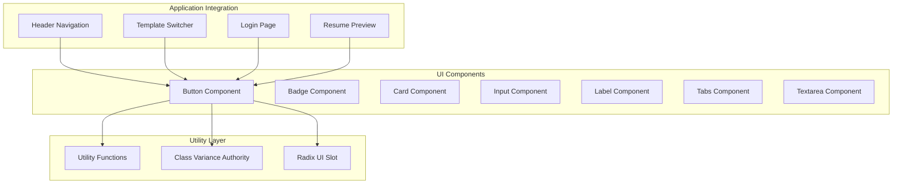
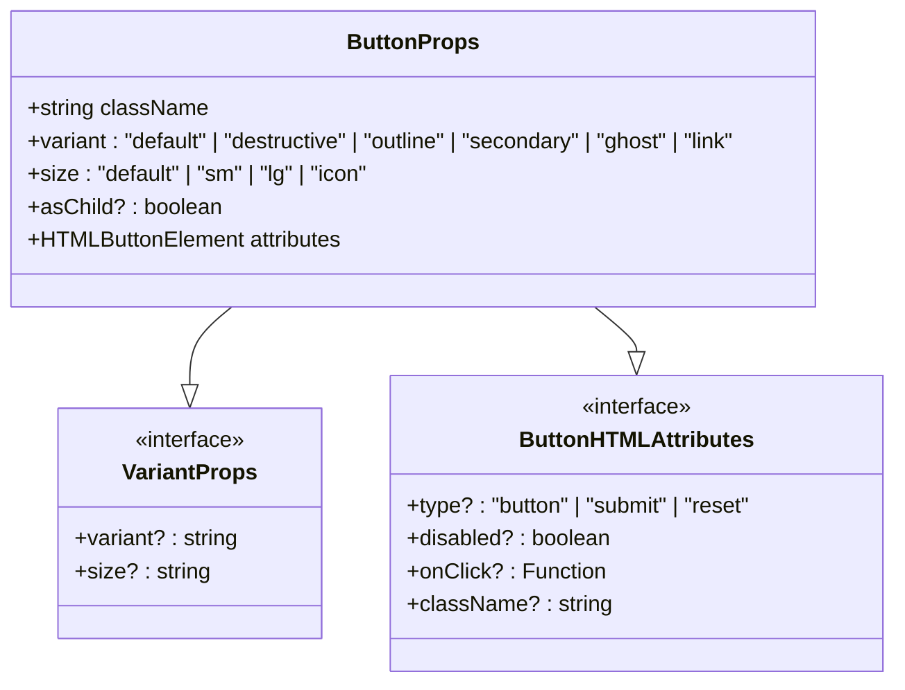
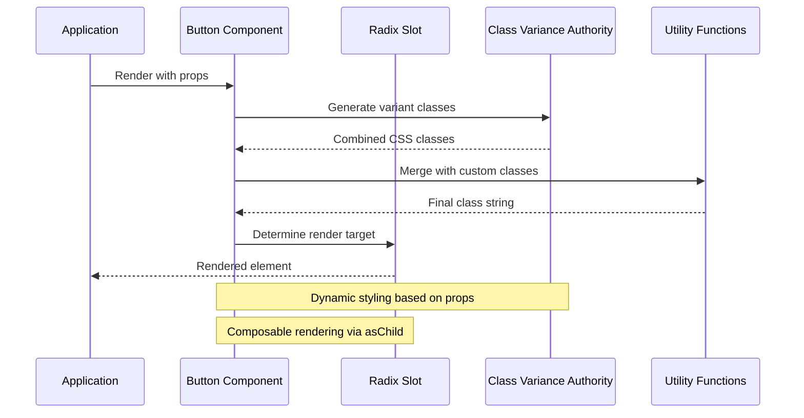
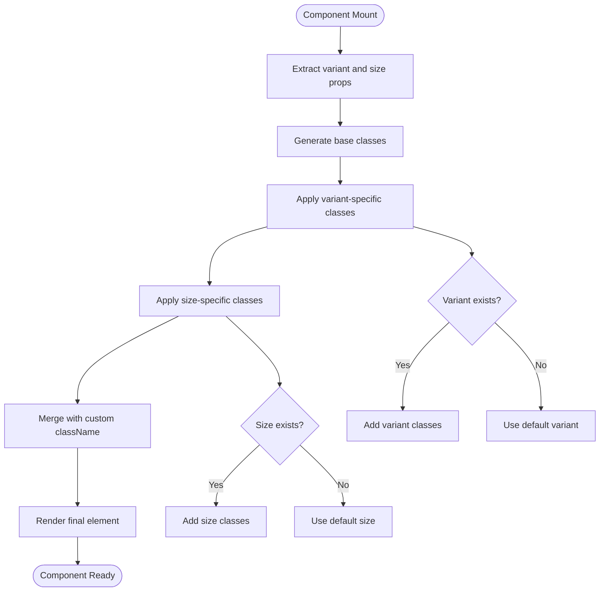
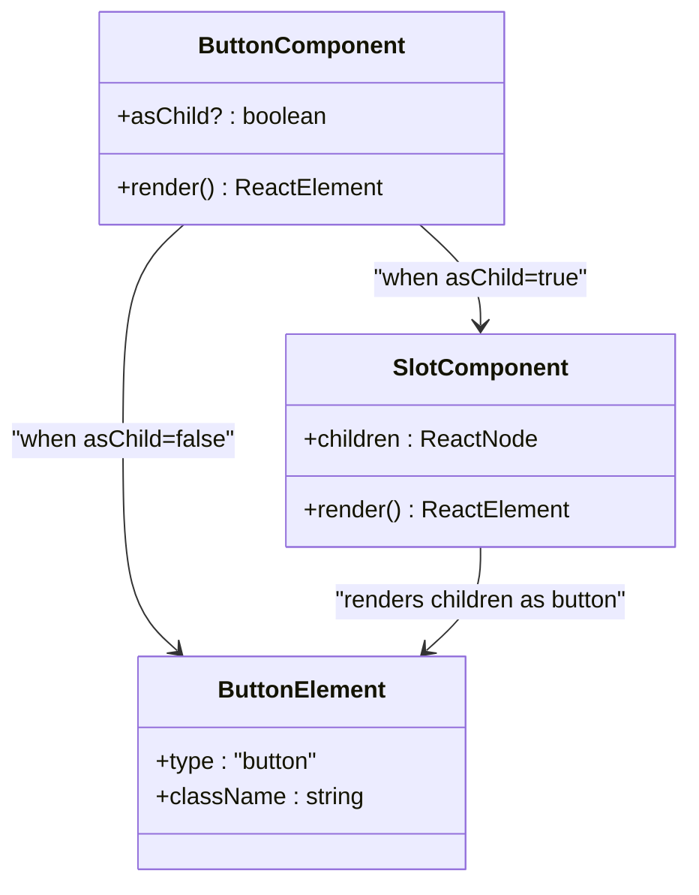
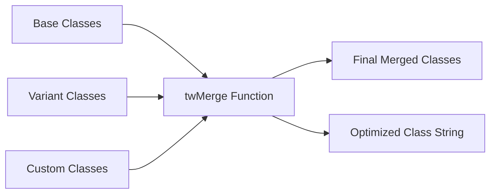
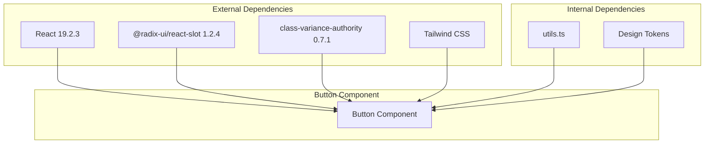
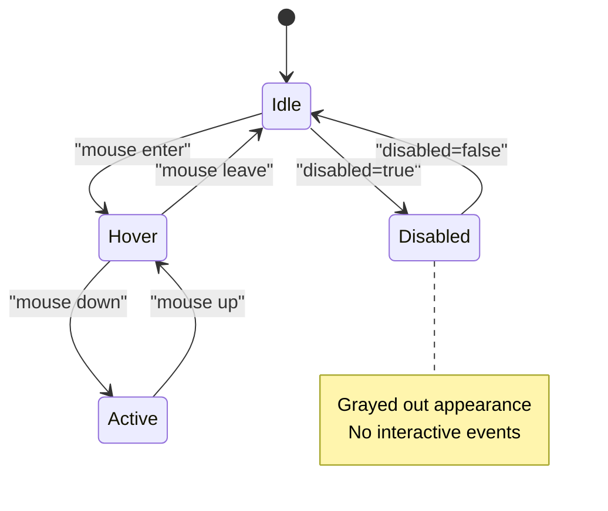
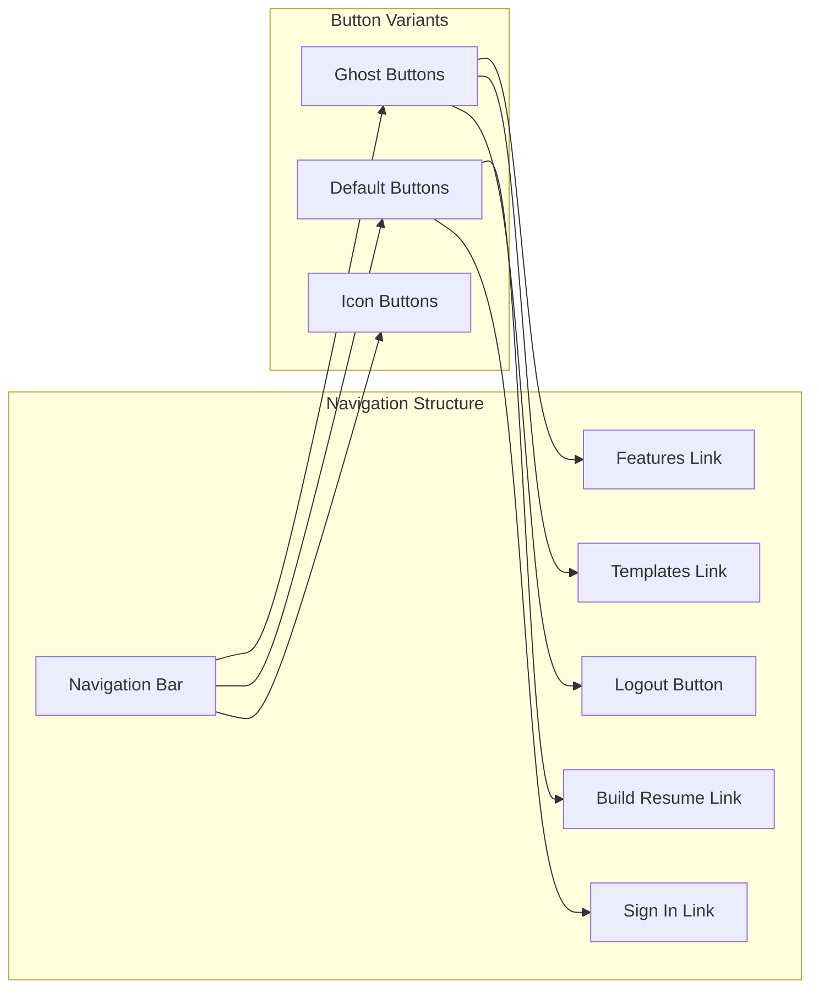

# Button Component

<cite>
**Referenced Files in This Document**
- [button.tsx](file://src/components/ui/button.tsx)
- [utils.ts](file://src/lib/utils.ts)
- [header.tsx](file://src/components/layout/header.tsx)
- [template-switcher.tsx](file://src/components/resume/template-switcher.tsx)
- [login.page.tsx](file://src/app/login/page.tsx)
- [page.tsx](file://src/app/page.tsx)
- [resume-preview.tsx](file://src/components/resume/resume-preview.tsx)
- [package.json](file://package.json)
</cite>

## Table of Contents
1. [Introduction](#introduction)
2. [Project Structure](#project-structure)
3. [Core Components](#core-components)
4. [Architecture Overview](#architecture-overview)
5. [Detailed Component Analysis](#detailed-component-analysis)
6. [Dependency Analysis](#dependency-analysis)
7. [Performance Considerations](#performance-considerations)
8. [Accessibility and Keyboard Navigation](#accessibility-and-keyboard-navigation)
9. [Usage Examples](#usage-examples)
10. [Extending Button Variants](#extending-button-variants)
11. [Troubleshooting Guide](#troubleshooting-guide)
12. [Conclusion](#conclusion)

## Introduction
The Button component is a foundational UI element designed to provide consistent, accessible, and customizable interactive controls across the application. It leverages modern React patterns and design system principles to ensure uniform behavior and appearance. The component supports multiple visual variants and sizing options, integrates seamlessly with form controls, and maintains excellent accessibility standards.

Key design goals:
- Consistent styling through class-variance-authority
- Composability via Radix UI's Slot component
- Full accessibility compliance with keyboard navigation
- Responsive behavior across different screen sizes
- Extensible architecture for future customization

## Project Structure
The Button component follows a modular architecture within the UI system:

**Diagram sources**
- [button.tsx:1-57](file://src/components/ui/button.tsx#L1-L57)
- [utils.ts:1-7](file://src/lib/utils.ts#L1-L7)

**Section sources**
- [button.tsx:1-57](file://src/components/ui/button.tsx#L1-L57)
- [utils.ts:1-7](file://src/lib/utils.ts#L1-L7)

## Core Components
The Button component consists of several key architectural elements that work together to provide robust functionality:

### Props Interface
The component accepts a comprehensive set of props through TypeScript interfaces:

**Diagram sources**
- [button.tsx:36-40](file://src/components/ui/button.tsx#L36-L40)

### Variant System
The component supports six distinct visual variants, each optimized for specific use cases:

| Variant | Purpose | Visual Characteristics |
|---------|---------|----------------------|
| `default` | Primary actions, main CTA | Solid primary color background with hover effect |
| `destructive` | Dangerous operations | Red color scheme for error states |
| `outline` | Secondary actions, less prominent | Border-only styling with colored text |
| `secondary` | Alternative actions | Light secondary background |
| `ghost` | Minimal impact actions | Transparent background with hover effects |
| `link` | Hyperlink-style buttons | Underlined text with hover underline |

### Size Options
Four standardized size options provide flexibility across different contexts:

| Size | Dimensions | Use Cases |
|------|------------|-----------|
| `default` | 40x160px | Standard form buttons, general actions |
| `sm` | 36x48px | Compact interfaces, small screens |
| `lg` | 44x128px | Prominent CTAs, hero sections |
| `icon` | 40x40px | Icon-only actions, toolbar buttons |

**Section sources**
- [button.tsx:7-34](file://src/components/ui/button.tsx#L7-L34)
- [button.tsx:36-40](file://src/components/ui/button.tsx#L36-L40)

## Architecture Overview
The Button component implements a sophisticated architecture combining modern React patterns with design system best practices:

**Diagram sources**
- [button.tsx:42-53](file://src/components/ui/button.tsx#L42-L53)
- [button.tsx:7-34](file://src/components/ui/button.tsx#L7-L34)
- [utils.ts:4-6](file://src/lib/utils.ts#L4-L6)

### Implementation Pattern
The component uses React.forwardRef for proper DOM ref forwarding and implements a render prop pattern through the asChild attribute. This allows the Button to render as different HTML elements while maintaining consistent styling and behavior.

**Section sources**
- [button.tsx:42-57](file://src/components/ui/button.tsx#L42-L57)

## Detailed Component Analysis

### Class Variance Authority Integration
The component leverages class-variance-authority for dynamic class generation:

**Diagram sources**
- [button.tsx:7-34](file://src/components/ui/button.tsx#L7-L34)
- [button.tsx:42-53](file://src/components/ui/button.tsx#L42-L53)

### Radix UI Slot Composability
The asChild functionality enables seamless integration with routing libraries and semantic markup:

**Diagram sources**
- [button.tsx:42-53](file://src/components/ui/button.tsx#L42-L53)

**Section sources**
- [button.tsx:1-57](file://src/components/ui/button.tsx#L1-L57)

### Utility Function Integration
The component integrates with a centralized utility function for class merging:

**Diagram sources**
- [utils.ts:4-6](file://src/lib/utils.ts#L4-L6)

**Section sources**
- [utils.ts:1-7](file://src/lib/utils.ts#L1-L7)

## Dependency Analysis
The Button component has minimal but essential dependencies that support its functionality:

**Diagram sources**
- [package.json:11-30](file://package.json#L11-L30)
- [button.tsx:1-57](file://src/components/ui/button.tsx#L1-L57)

### Package Dependencies
The component relies on three core external packages:
- **React**: Core framework for component rendering
- **@radix-ui/react-slot**: Enables composable rendering patterns
- **class-variance-authority**: Provides type-safe variant styling
- **clsx/tailwind-merge**: Handles efficient class merging

**Section sources**
- [package.json:11-30](file://package.json#L11-L30)

## Performance Considerations
The Button component is optimized for performance through several architectural decisions:

### Rendering Optimization
- **Memoized class generation**: Variant classes are computed once per render cycle
- **Minimal re-renders**: Uses forwardRef to avoid unnecessary wrapper components
- **Efficient class merging**: Utilizes twMerge for optimal class string generation

### Bundle Size Impact
- **Tree-shakable imports**: Only required dependencies are imported
- **Lightweight implementation**: Single-file component with minimal overhead
- **Shared utilities**: Reuses existing utility functions to reduce duplication

## Accessibility and Keyboard Navigation
The Button component implements comprehensive accessibility features:

### Focus Management
- **Visible focus indicators**: Ring-based focus states with proper contrast
- **Keyboard navigation**: Full tab navigation support
- **Focus trapping**: Maintains focus within modal contexts when applicable

### Screen Reader Support
- **Semantic HTML**: Renders appropriate button semantics
- **ARIA attributes**: Supports aria-disabled and role attributes
- **Label association**: Works seamlessly with form labels

### Interactive States
- **Hover states**: Clear visual feedback for pointer interactions
- **Active states**: Distinct pressed state indication
- **Disabled states**: Proper disabled styling and interaction blocking

## Usage Examples

### Basic Button States
The component demonstrates various interactive states through real-world implementations:

**Diagram sources**
- [button.tsx:8-34](file://src/components/ui/button.tsx#L8-L34)

### Form Integration Examples
The Button component integrates seamlessly with form controls:

| Example Context | Props Configuration | Behavior |
|----------------|-------------------|----------|
| Login Form | `type="submit"` | Submits parent form |
| Loading State | `disabled={loading}` | Prevents multiple submissions |
| Conditional Text | Dynamic children | Updates based on state |
| Validation Feedback | `className="text-destructive"` | Visual error indication |

### Navigation Integration
The component works effectively within navigation systems:

**Diagram sources**
- [header.tsx:44-92](file://src/components/layout/header.tsx#L44-L92)

**Section sources**
- [header.tsx:44-92](file://src/components/layout/header.tsx#L44-L92)
- [login.page.tsx:96-99](file://src/app/login/page.tsx#L96-L99)
- [template-switcher.tsx:80-84](file://src/components/resume/template-switcher.tsx#L80-L84)

## Extending Button Variants
The component provides a structured approach for adding new variants while maintaining design system consistency:

### Adding New Variants
To extend the Button component with new variants:

1. **Define variant specifications** in the cva configuration
2. **Add variant classes** following existing naming conventions
3. **Update TypeScript interfaces** for type safety
4. **Test accessibility compliance** with screen readers
5. **Document usage examples** and best practices

### Customization Guidelines
- **Consistent spacing**: Follow established padding and margin patterns
- **Color harmony**: Use design tokens for consistent color schemes
- **Typography consistency**: Maintain font weights and sizes
- **Motion standards**: Implement smooth transitions and animations
- **Responsive behavior**: Test across different screen sizes

### Best Practices for Extension
- **Minimal variance**: Keep variant differences focused and meaningful
- **Accessibility first**: Ensure all variants meet WCAG guidelines
- **Performance conscious**: Avoid heavy computations in render methods
- **Documentation required**: Update component documentation with new variants
- **Backward compatibility**: Maintain existing variant APIs

## Troubleshooting Guide

### Common Issues and Solutions

#### Variant Classes Not Applying
**Symptoms**: Button appears without expected styling
**Causes**: 
- Missing variant prop value
- Conflicting custom classes overriding variants
- Tailwind CSS purging removing unused classes

**Solutions**:
- Verify variant prop matches available options
- Check class order in className prop
- Ensure variant classes aren't being purged

#### asChild Rendering Issues
**Symptoms**: Button renders incorrectly when using asChild
**Causes**:
- Missing child elements in asChild mode
- Incorrect slot composition
- Prop conflicts between button and wrapper elements

**Solutions**:
- Ensure proper child element structure
- Verify slot composition matches expected pattern
- Check for prop conflicts in wrapper components

#### Accessibility Problems
**Symptoms**: Screen reader issues or keyboard navigation problems
**Causes**:
- Missing aria attributes
- Improper focus management
- Inconsistent interactive states

**Solutions**:
- Add appropriate aria attributes for context
- Implement proper focus trap patterns
- Ensure consistent hover/focus states

### Performance Optimization Tips
- **Avoid excessive re-renders**: Memoize variant calculations
- **Optimize class merging**: Minimize class string concatenation
- **Lazy loading**: Consider lazy loading for heavy button variants
- **Bundle analysis**: Regularly audit bundle size impact

**Section sources**
- [button.tsx:42-57](file://src/components/ui/button.tsx#L42-L57)
- [utils.ts:4-6](file://src/lib/utils.ts#L4-L6)

## Conclusion
The Button component represents a mature, production-ready implementation of a fundamental UI primitive. Its architecture balances flexibility with consistency, providing developers with a powerful yet predictable component for building user interfaces.

Key strengths include:
- **Type-safe variants**: Comprehensive TypeScript support prevents runtime errors
- **Accessible design**: Built-in accessibility features meet modern standards
- **Composable architecture**: Radix UI Slot integration enables flexible rendering
- **Performance optimization**: Efficient class generation and minimal overhead
- **Extensible design**: Well-structured foundation for future enhancements

The component serves as an excellent foundation for building consistent, accessible user interfaces while maintaining the flexibility needed for diverse application requirements. Its implementation demonstrates best practices in React component development and design system integration.