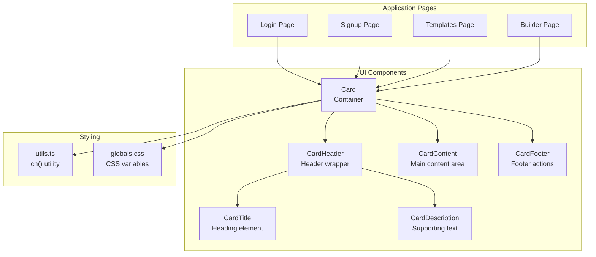
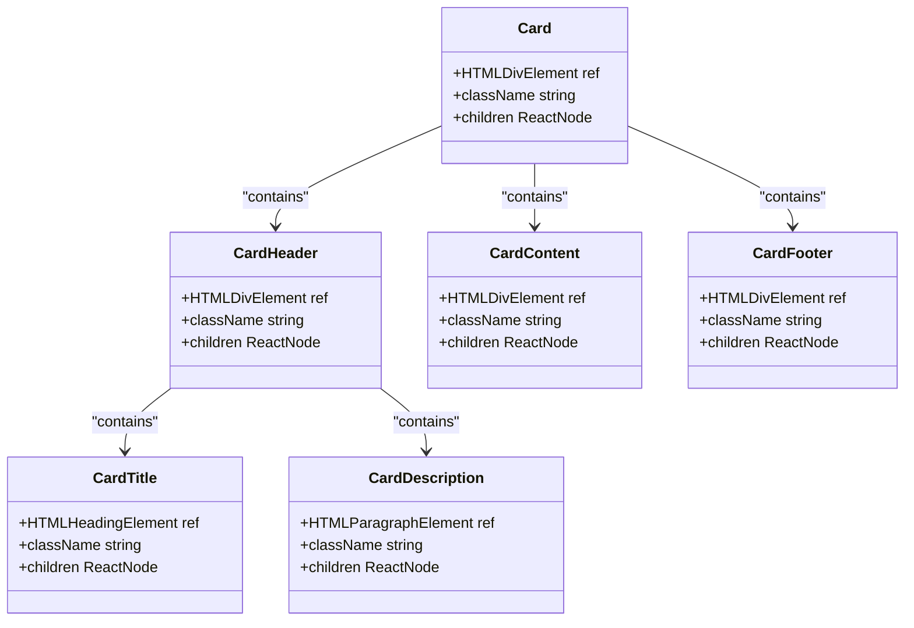
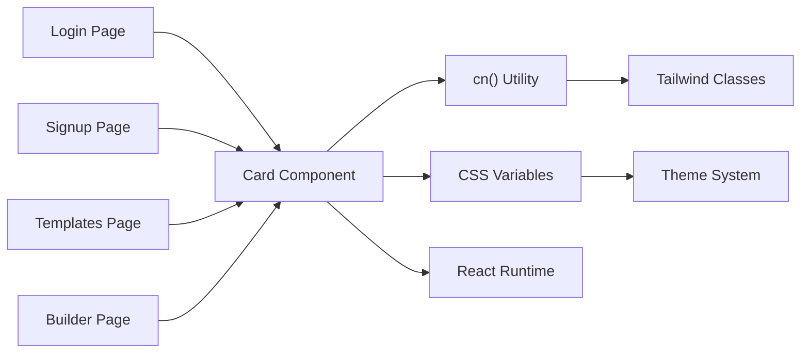
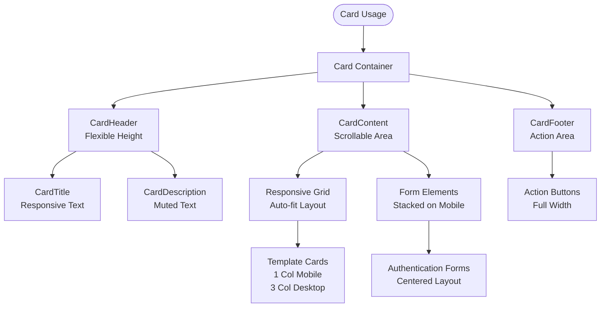

# Card Component

<cite>
**Referenced Files in This Document**
- [card.tsx](file://src/components/ui/card.tsx)
- [page.tsx](file://src/app/templates/page.tsx)
- [page.tsx](file://src/app/login/page.tsx)
- [page.tsx](file://src/app/signup/page.tsx)
- [page.tsx](file://src/app/builder/page.tsx)
- [utils.ts](file://src/lib/utils.ts)
- [globals.css](file://src/app/globals.css)
- [resume-form.tsx](file://src/components/resume/resume-form.tsx)
- [resume-preview.tsx](file://src/components/resume/resume-preview.tsx)
</cite>

## Table of Contents
1. [Introduction](#introduction)
2. [Project Structure](#project-structure)
3. [Core Components](#core-components)
4. [Architecture Overview](#architecture-overview)
5. [Detailed Component Analysis](#detailed-component-analysis)
6. [Dependency Analysis](#dependency-analysis)
7. [Performance Considerations](#performance-considerations)
8. [Accessibility and Semantic Structure](#accessibility-and-semantic-structure)
9. [Responsive Behavior](#responsive-behavior)
10. [Usage Examples](#usage-examples)
11. [Extending Card Variants](#extending-card-variants)
12. [Integration Guidelines](#integration-guidelines)
13. [Troubleshooting Guide](#troubleshooting-guide)
14. [Conclusion](#conclusion)

## Introduction
The Card component system provides a cohesive foundation for organizing content blocks with consistent spacing, visual hierarchy, and responsive behavior. It consists of a main Card container and complementary sub-components: CardHeader, CardTitle, CardDescription, CardContent, and CardFooter. These components work together to create structured, accessible, and visually appealing content sections across the application.

The system leverages Tailwind CSS utility classes for styling, a centralized color palette defined in global CSS variables, and a shared utility function for merging class names. It is used extensively across authentication flows, template selection, and the resume builder interface.

## Project Structure
The Card component system is organized within the UI components module and is consumed across multiple application pages and features.



**Diagram sources**
- [card.tsx:1-77](file://src/components/ui/card.tsx#L1-L77)
- [page.tsx:59-109](file://src/app/login/page.tsx#L59-L109)
- [page.tsx:76-146](file://src/app/signup/page.tsx#L76-L146)
- [page.tsx:120-171](file://src/app/templates/page.tsx#L120-L171)
- [page.tsx:48-64](file://src/app/builder/page.tsx#L48-L64)
- [utils.ts:4-6](file://src/lib/utils.ts#L4-L6)
- [globals.css:11-12](file://src/app/globals.css#L11-L12)

**Section sources**
- [card.tsx:1-77](file://src/components/ui/card.tsx#L1-L77)
- [page.tsx:59-109](file://src/app/login/page.tsx#L59-L109)
- [page.tsx:76-146](file://src/app/signup/page.tsx#L76-L146)
- [page.tsx:120-171](file://src/app/templates/page.tsx#L120-L171)
- [page.tsx:48-64](file://src/app/builder/page.tsx#L48-L64)
- [utils.ts:4-6](file://src/lib/utils.ts#L4-L6)
- [globals.css:11-12](file://src/app/globals.css#L11-L12)

## Core Components
The Card system comprises six primary components, each designed for a specific role in content organization:

- Card: The main container providing rounded corners, border, background, and shadow styling.
- CardHeader: A vertical stack container for title and description elements.
- CardTitle: A semantic heading element for primary card titles.
- CardDescription: A supporting paragraph element for contextual descriptions.
- CardContent: The main content area with appropriate padding and spacing.
- CardFooter: A horizontal action container with consistent spacing.

Each component uses React.forwardRef to expose refs and applies Tailwind utility classes for consistent styling. The Card component integrates with CSS variables for theme-aware colors and shadows.

**Section sources**
- [card.tsx:5-18](file://src/components/ui/card.tsx#L5-L18)
- [card.tsx:20-30](file://src/components/ui/card.tsx#L20-L30)
- [card.tsx:32-42](file://src/components/ui/card.tsx#L32-L42)
- [card.tsx:44-54](file://src/components/ui/card.tsx#L44-L54)
- [card.tsx:56-62](file://src/components/ui/card.tsx#L56-L62)
- [card.tsx:64-74](file://src/components/ui/card.tsx#L64-L74)

## Architecture Overview
The Card component system follows a composition pattern where the main Card acts as a structural wrapper, while sub-components provide semantic meaning and spacing. The system relies on:

- Tailwind CSS for utility-first styling
- CSS custom properties for theme-aware colors
- A centralized cn() utility for safe class merging
- Semantic HTML elements for accessibility



**Diagram sources**
- [card.tsx:5-18](file://src/components/ui/card.tsx#L5-L18)
- [card.tsx:20-30](file://src/components/ui/card.tsx#L20-L30)
- [card.tsx:32-42](file://src/components/ui/card.tsx#L32-L42)
- [card.tsx:44-54](file://src/components/ui/card.tsx#L44-L54)
- [card.tsx:56-62](file://src/components/ui/card.tsx#L56-L62)
- [card.tsx:64-74](file://src/components/ui/card.tsx#L64-L74)

## Detailed Component Analysis

### Card Container
The Card component serves as the foundational container with built-in styling for borders, backgrounds, and shadows. It accepts arbitrary HTML attributes and merges them with default classes using the cn() utility.

Key characteristics:
- Rounded corners via border-radius
- Theme-aware background and foreground colors
- Subtle shadow for depth
- Flexible width and height through className prop

**Section sources**
- [card.tsx:5-18](file://src/components/ui/card.tsx#L5-L18)

### CardHeader
CardHeader provides a vertical stacking container for the card's header content. It establishes consistent spacing and alignment for title and description elements.

Implementation details:
- Flex column direction for vertical stacking
- Space management between child elements
- Padding configuration for proper breathing room

**Section sources**
- [card.tsx:20-30](file://src/components/ui/card.tsx#L20-L30)

### CardTitle
CardTitle renders a semantic heading element optimized for card titles. It uses typography utilities for appropriate sizing and weight.

Design considerations:
- Semantic heading element for accessibility
- Typography utilities for consistent sizing
- Responsive text handling

**Section sources**
- [card.tsx:32-42](file://src/components/ui/card.tsx#L32-L42)

### CardDescription
CardDescription provides a supporting text element for contextual information. It uses muted colors to de-emphasize secondary content.

Styling approach:
- Muted foreground color for contrast
- Appropriate font size for readability
- Consistent spacing with other header elements

**Section sources**
- [card.tsx:44-54](file://src/components/ui/card.tsx#L44-L54)

### CardContent
CardContent manages the main content area with specific padding rules to maintain visual hierarchy and spacing.

Layout features:
- Top padding removal for seamless integration
- Full padding on other sides for content breathing room
- Flexible content area for diverse content types

**Section sources**
- [card.tsx:56-62](file://src/components/ui/card.tsx#L56-L62)

### CardFooter
CardFooter creates a dedicated area for actions and supplementary controls. It aligns content horizontally and maintains consistent spacing.

Functional aspects:
- Horizontal alignment for action buttons
- Consistent padding for action areas
- Flexible content distribution

**Section sources**
- [card.tsx:64-74](file://src/components/ui/card.tsx#L64-L74)

## Dependency Analysis
The Card component system has minimal external dependencies and integrates cleanly with the broader application architecture.



**Diagram sources**
- [card.tsx:3-3](file://src/components/ui/card.tsx#L3-L3)
- [utils.ts:4-6](file://src/lib/utils.ts#L4-L6)
- [globals.css:11-12](file://src/app/globals.css#L11-L12)
- [page.tsx:59-109](file://src/app/login/page.tsx#L59-L109)
- [page.tsx:76-146](file://src/app/signup/page.tsx#L76-L146)
- [page.tsx:120-171](file://src/app/templates/page.tsx#L120-L171)
- [page.tsx:48-64](file://src/app/builder/page.tsx#L48-L64)

**Section sources**
- [card.tsx:3-3](file://src/components/ui/card.tsx#L3-L3)
- [utils.ts:4-6](file://src/lib/utils.ts#L4-L6)
- [globals.css:11-12](file://src/app/globals.css#L11-L12)
- [page.tsx:59-109](file://src/app/login/page.tsx#L59-L109)
- [page.tsx:76-146](file://src/app/signup/page.tsx#L76-L146)
- [page.tsx:120-171](file://src/app/templates/page.tsx#L120-L171)
- [page.tsx:48-64](file://src/app/builder/page.tsx#L48-L64)

## Performance Considerations
The Card component system is designed for optimal performance through several mechanisms:

- Lightweight implementation using forwardRef
- Minimal DOM nodes per component
- Utility-first styling avoiding runtime calculations
- Efficient class merging with cn() utility
- No unnecessary re-renders in static usage

Best practices for performance:
- Use className prop for minimal overrides
- Avoid deep nesting of Card components
- Leverage CSS variables for theme changes
- Combine with responsive utilities for adaptive layouts

## Accessibility and Semantic Structure
The Card component system prioritizes accessibility through semantic HTML and proper ARIA attributes:

- CardTitle uses semantic heading elements
- CardDescription provides context for screen readers
- Proper heading hierarchy maintained
- Focus management considerations for interactive content
- Color contrast maintained across themes

Accessibility features:
- Semantic HTML structure preserved
- Color contrast compliant with WCAG guidelines
- Focus indicators for interactive elements
- Screen reader friendly content organization

## Responsive Behavior
The Card components are designed to adapt seamlessly across different screen sizes and contexts:



**Diagram sources**
- [page.tsx:112-174](file://src/app/templates/page.tsx#L112-L174)
- [page.tsx:59-109](file://src/app/login/page.tsx#L59-L109)
- [page.tsx:76-146](file://src/app/signup/page.tsx#L76-L146)

Responsive patterns demonstrated:
- Template selection cards adapt from 1 to 3 columns
- Authentication forms remain centered and readable
- Content areas adjust padding and spacing automatically
- Action areas maintain consistent sizing across breakpoints

**Section sources**
- [page.tsx:112-174](file://src/app/templates/page.tsx#L112-L174)
- [page.tsx:59-109](file://src/app/login/page.tsx#L59-L109)
- [page.tsx:76-146](file://src/app/signup/page.tsx#L76-L146)

## Usage Examples

### Authentication Card Layout
The most common usage pattern places the Card as the primary container for login and signup forms, with proper semantic structure and spacing.

```mermaid
sequenceDiagram
participant User as "User"
participant Page as "Authentication Page"
participant Card as "Card Component"
participant Header as "CardHeader"
participant Title as "CardTitle"
participant Desc as "CardDescription"
participant Content as "CardContent"
User->>Page : Navigate to Login/Signup
Page->>Card : Render Card with form
Card->>Header : Create header section
Header->>Title : Add main title
Header->>Desc : Add description text
Card->>Content : Add form elements
Content->>Content : Render input fields
Content->>Content : Display error/success messages
```

**Diagram sources**
- [page.tsx:59-109](file://src/app/login/page.tsx#L59-L109)
- [page.tsx:76-146](file://src/app/signup/page.tsx#L76-L146)
- [card.tsx:20-30](file://src/components/ui/card.tsx#L20-L30)
- [card.tsx:32-42](file://src/components/ui/card.tsx#L32-L42)
- [card.tsx:44-54](file://src/components/ui/card.tsx#L44-L54)
- [card.tsx:56-62](file://src/components/ui/card.tsx#L56-L62)

### Template Selection Cards
The Templates page demonstrates advanced Card usage with hover effects, overlays, and responsive grid layouts.

Key features:
- Hover animations and shadow transitions
- Overlay content with semi-transparent backgrounds
- Responsive grid adapting to screen size
- Integration with navigation and action buttons

**Section sources**
- [page.tsx:120-171](file://src/app/templates/page.tsx#L120-L171)

### Dashboard and Form Containers
The Builder page showcases Card components integrated with complex form layouts and preview areas.

Integration patterns:
- Card as form container with proper spacing
- Combination with other UI components
- Responsive layout management
- State-driven content updates

**Section sources**
- [page.tsx:48-64](file://src/app/builder/page.tsx#L48-L64)

## Extending Card Variants
The Card system supports customization through several approaches:

### Shadow and Border Customization
- Modify shadow classes for different elevation levels
- Adjust border utilities for emphasis or subtlety
- Use theme-specific colors for consistent branding

### Content Organization Patterns
- Combine CardHeader/CardTitle/CardDescription for informational cards
- Use CardContent for dense content areas requiring scrolling
- Implement CardFooter for action-heavy interfaces

### Styling Extensions
- Apply background variations for thematic differentiation
- Customize padding for compact or spacious layouts
- Integrate with animation libraries for enhanced UX

## Integration Guidelines
When integrating Card components with other UI elements:

### Form Integration
- Place form elements within CardContent for consistent spacing
- Use CardHeader for form titles and descriptions
- Ensure proper focus management and error messaging

### Navigation Integration
- Use CardFooter for action buttons and navigation elements
- Maintain consistent button sizing and placement
- Consider sticky positioning for persistent actions

### Content Integration
- Combine with grid systems for responsive layouts
- Use within modal dialogs and lightboxes
- Integrate with tabbed interfaces and accordions

## Troubleshooting Guide
Common issues and solutions when working with Card components:

### Styling Conflicts
- Verify CSS variable precedence in globals.css
- Check for conflicting Tailwind utility classes
- Ensure proper class merging with cn() utility

### Responsiveness Issues
- Test responsive breakpoints across different screen sizes
- Verify grid behavior in Card-based layouts
- Check for overflow issues in content areas

### Accessibility Concerns
- Confirm proper heading hierarchy
- Validate color contrast ratios
- Test keyboard navigation and focus management

**Section sources**
- [globals.css:11-12](file://src/app/globals.css#L11-L12)
- [utils.ts:4-6](file://src/lib/utils.ts#L4-L6)

## Conclusion
The Card component system provides a robust, accessible, and flexible foundation for organizing content across the application. Its modular design enables consistent styling, semantic structure, and responsive behavior while maintaining performance and extensibility. The system successfully balances simplicity with customization capabilities, making it suitable for diverse use cases from authentication forms to complex dashboard layouts.

Through careful attention to accessibility, responsive design, and integration patterns, the Card components serve as a reliable building block for creating coherent user experiences throughout the application.