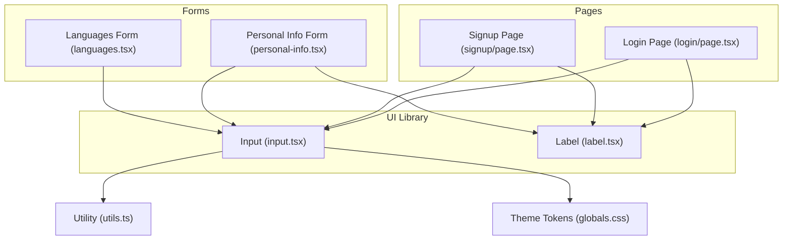
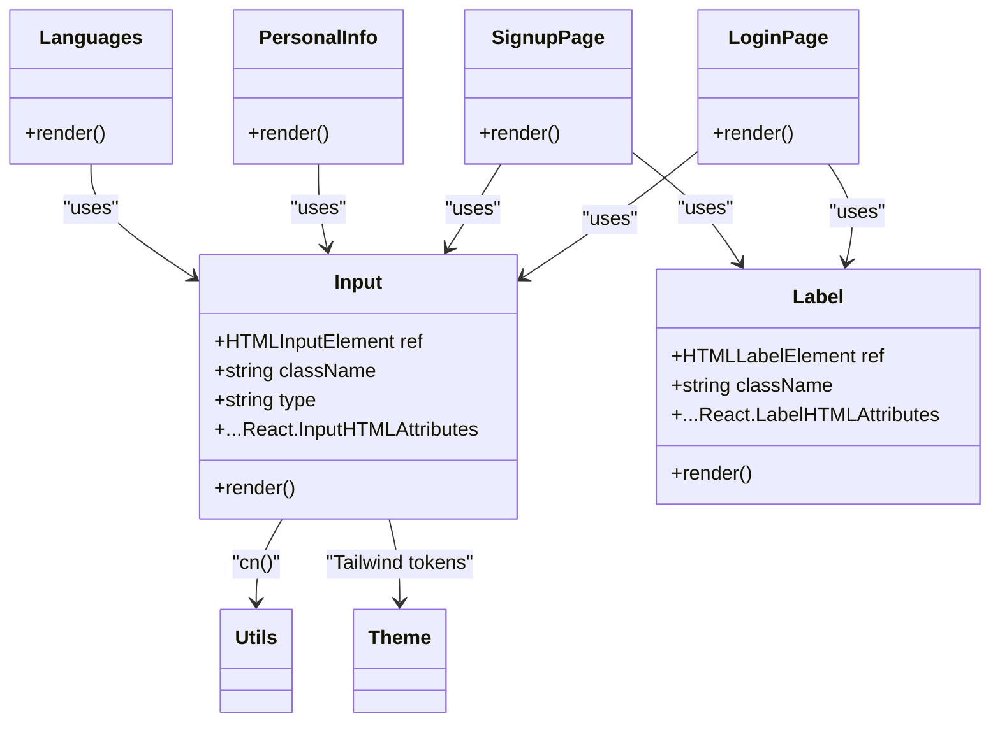
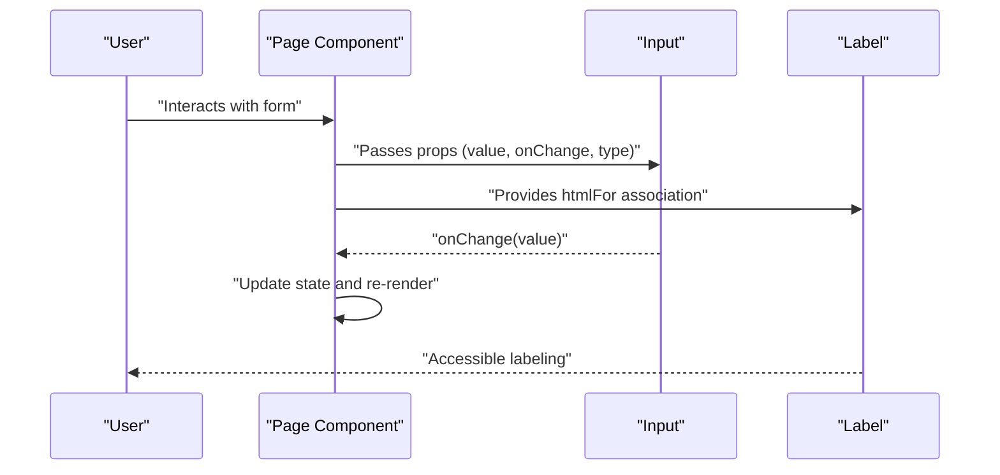
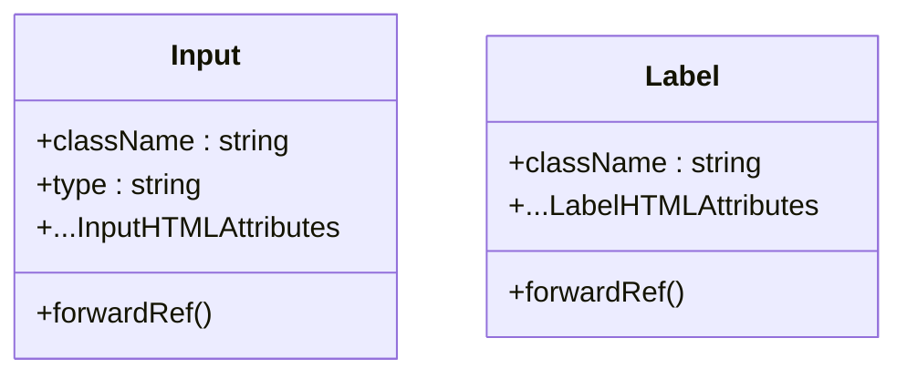
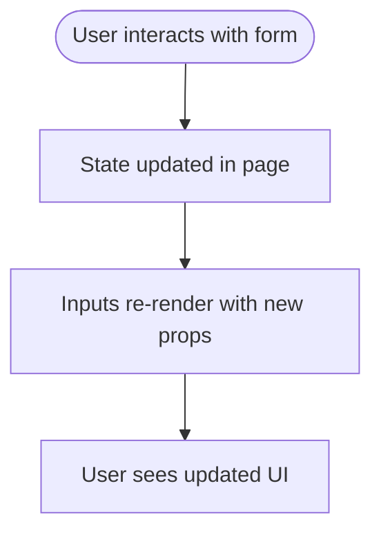
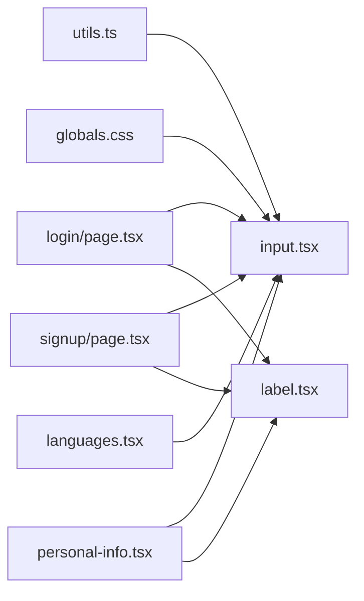

# Input Component

<cite>
**Referenced Files in This Document**
- [input.tsx](file://src/components/ui/input.tsx)
- [label.tsx](file://src/components/ui/label.tsx)
- [login/page.tsx](file://src/app/login/page.tsx)
- [signup/page.tsx](file://src/app/signup/page.tsx)
- [personal-info.tsx](file://src/components/resume/personal-info.tsx)
- [languages.tsx](file://src/components/resume/languages.tsx)
- [globals.css](file://src/app/globals.css)
- [utils.ts](file://src/lib/utils.ts)
- [types.ts](file://src/lib/types.ts)
</cite>

## Table of Contents
1. [Introduction](#introduction)
2. [Project Structure](#project-structure)
3. [Core Components](#core-components)
4. [Architecture Overview](#architecture-overview)
5. [Detailed Component Analysis](#detailed-component-analysis)
6. [Dependency Analysis](#dependency-analysis)
7. [Performance Considerations](#performance-considerations)
8. [Troubleshooting Guide](#troubleshooting-guide)
9. [Conclusion](#conclusion)
10. [Appendices](#appendices)

## Introduction
This document provides comprehensive documentation for the Input component used across the application. It covers the component's props interface, styling approach, form integration capabilities, input type handling, validation states, error messaging, accessibility features, and practical usage patterns. It also includes guidelines for customization, responsive behavior, and integration with form validation libraries.

## Project Structure
The Input component is part of the shared UI library and is consumed by multiple pages and form sections:
- The Input component is defined under the UI components folder.
- It is used in authentication pages (login and signup) and in the resume builder (personal info and languages sections).
- Global styles define theme tokens that influence Input appearance.

**Diagram sources**
- [input.tsx:1-25](file://src/components/ui/input.tsx#L1-L25)
- [label.tsx:1-19](file://src/components/ui/label.tsx#L1-L19)
- [login/page.tsx:1-113](file://src/app/login/page.tsx#L1-L113)
- [signup/page.tsx:1-150](file://src/app/signup/page.tsx#L1-L150)
- [personal-info.tsx:1-118](file://src/components/resume/personal-info.tsx#L1-L118)
- [languages.tsx:1-60](file://src/components/resume/languages.tsx#L1-L60)
- [utils.ts:1-7](file://src/lib/utils.ts#L1-L7)
- [globals.css:1-169](file://src/app/globals.css#L1-L169)

**Section sources**
- [input.tsx:1-25](file://src/components/ui/input.tsx#L1-L25)
- [label.tsx:1-19](file://src/components/ui/label.tsx#L1-L19)
- [login/page.tsx:1-113](file://src/app/login/page.tsx#L1-L113)
- [signup/page.tsx:1-150](file://src/app/signup/page.tsx#L1-L150)
- [personal-info.tsx:1-118](file://src/components/resume/personal-info.tsx#L1-L118)
- [languages.tsx:1-60](file://src/components/resume/languages.tsx#L1-L60)
- [globals.css:1-169](file://src/app/globals.css#L1-L169)
- [utils.ts:1-7](file://src/lib/utils.ts#L1-L7)

## Core Components
- Input component: A thin wrapper around the native HTML input element with Tailwind-based styling and forwardRef support.
- Label component: A thin wrapper around the native HTML label element with forwardRef support and disabled state styling.

Key characteristics:
- Props interface: Inherits all standard HTML input attributes via React.InputHTMLAttributes<HTMLInputElement>.
- Styling: Uses a consistent set of Tailwind utility classes for sizing, borders, background, focus states, and disabled state.
- Accessibility: Integrates with Label via htmlFor to associate labels with inputs.

Usage examples:
- Authentication forms (login and signup) demonstrate email, password, and text inputs with placeholders and required attributes.
- Resume builder sections show inputs for personal details and languages, including specialized placeholders and controlled inputs.

**Section sources**
- [input.tsx:5-22](file://src/components/ui/input.tsx#L5-L22)
- [label.tsx:5-16](file://src/components/ui/label.tsx#L5-L16)
- [login/page.tsx:74-95](file://src/app/login/page.tsx#L74-L95)
- [signup/page.tsx:97-132](file://src/app/signup/page.tsx#L97-L132)
- [personal-info.tsx:23-101](file://src/components/resume/personal-info.tsx#L23-L101)
- [languages.tsx:37-43](file://src/components/resume/languages.tsx#L37-L43)

## Architecture Overview
The Input component is a leaf-level UI primitive that composes:
- Tailwind utility classes for styling.
- ForwardRef to expose the underlying input DOM node.
- Utility function for merging class names.

It is consumed by:
- Pages that render forms (login, signup).
- Form sections within the resume builder (personal info, languages).

**Diagram sources**
- [input.tsx:7-21](file://src/components/ui/input.tsx#L7-L21)
- [label.tsx:7-15](file://src/components/ui/label.tsx#L7-L15)
- [login/page.tsx:12-112](file://src/app/login/page.tsx#L12-L112)
- [signup/page.tsx:12-149](file://src/app/signup/page.tsx#L12-L149)
- [personal-info.tsx:13-117](file://src/components/resume/personal-info.tsx#L13-L117)
- [languages.tsx:34-43](file://src/components/resume/languages.tsx#L34-L43)
- [utils.ts:4-6](file://src/lib/utils.ts#L4-L6)
- [globals.css:88-169](file://src/app/globals.css#L88-L169)

## Detailed Component Analysis

### Props Interface
- Inherits all standard HTML input attributes (type, value, onChange, placeholder, required, disabled, etc.).
- Accepts a className prop to extend or override default styles.
- Exposes a ref of type HTMLInputElement via forwardRef.

Implementation highlights:
- Uses React.InputHTMLAttributes<HTMLInputElement> to maintain parity with native input semantics.
- Merges provided className with default Tailwind classes using a utility function.

**Section sources**
- [input.tsx:5-15](file://src/components/ui/input.tsx#L5-L15)

### Styling Approach
Default styling includes:
- Consistent height and width sizing.
- Rounded corners and border tokens.
- Background and placeholder color tokens.
- Focus-visible ring with offset and ring color tokens.
- Disabled cursor and opacity states.

Theme integration:
- Tokens for background, border, ring, and muted foreground are defined globally and consumed by the component’s Tailwind classes.

Customization:
- Extend or override default styles by passing additional className values.
- Combine with layout utilities (e.g., w-full, h-8) for responsive sizing.

**Section sources**
- [input.tsx:12-15](file://src/components/ui/input.tsx#L12-L15)
- [globals.css:37-40](file://src/app/globals.css#L37-L40)
- [globals.css:106-107](file://src/app/globals.css#L106-L107)

### Form Integration Capabilities
Common patterns observed:
- Controlled inputs with useState hooks in pages.
- Label association via htmlFor to improve accessibility and usability.
- Required attributes for mandatory fields.
- Placeholder text for hints.
- Integration with form submission handlers.

Examples:
- Login page demonstrates email and password inputs with required attributes and controlled state updates.
- Signup page shows similar patterns with additional validation constraints (e.g., minimum length).
- Resume builder sections use inputs bound to structured data with onChange handlers.

**Section sources**
- [login/page.tsx:14-95](file://src/app/login/page.tsx#L14-L95)
- [signup/page.tsx:14-132](file://src/app/signup/page.tsx#L14-L132)
- [personal-info.tsx:14-16](file://src/components/resume/personal-info.tsx#L14-L16)
- [languages.tsx:37-43](file://src/components/resume/languages.tsx#L37-L43)

### Input Types, Validation States, and Error Messaging
Supported input types:
- text, email, password, and others inherited from HTML input.

Validation states:
- Disabled state via disabled attribute.
- Focus-visible state via focus-visible ring utilities.
- Controlled state via value and onChange.

Error messaging:
- Pages display contextual error messages above forms.
- Inputs themselves do not render error text; errors are shown externally and can be styled accordingly.

Accessibility:
- Labels use htmlFor to associate with inputs.
- Focus-visible ring ensures keyboard navigation visibility.

**Section sources**
- [login/page.tsx:68-72](file://src/app/login/page.tsx#L68-L72)
- [signup/page.tsx:85-89](file://src/app/signup/page.tsx#L85-L89)
- [input.tsx:13-14](file://src/components/ui/input.tsx#L13-L14)

### Usage Examples
- Authentication forms:
  - Email and password inputs with placeholders and required attributes.
  - Controlled state updates via onChange handlers.
- Personal information form:
  - Multiple inputs for name, job title, email, phone, address, LinkedIn, website, and summary.
  - Structured data updates via a single handleChange function.
- Languages form:
  - Compact inputs for language and proficiency with reduced height.

**Section sources**
- [login/page.tsx:74-95](file://src/app/login/page.tsx#L74-L95)
- [signup/page.tsx:97-132](file://src/app/signup/page.tsx#L97-L132)
- [personal-info.tsx:23-101](file://src/components/resume/personal-info.tsx#L23-L101)
- [languages.tsx:37-43](file://src/components/resume/languages.tsx#L37-L43)

### Accessibility Features
- Label association: htmlFor on Label matches the input id for improved screen reader support and click-to-focus behavior.
- Focus management: focus-visible ring ensures keyboard navigation visibility.
- Disabled state: disabled attribute and associated styling indicate non-interactive state.

Note: Additional ARIA attributes (e.g., aria-describedby, aria-invalid) are not present in current usage but can be added when integrating with validation libraries.

**Section sources**
- [label.tsx:11-11](file://src/components/ui/label.tsx#L11-L11)
- [input.tsx:13-14](file://src/components/ui/input.tsx#L13-L14)
- [login/page.tsx:75-83](file://src/app/login/page.tsx#L75-L83)
- [signup/page.tsx:99-106](file://src/app/signup/page.tsx#L99-L106)

### Styling Customization Guidelines
- Use className to extend defaults (e.g., w-full, h-8, rounded, border-red-500).
- Leverage Tailwind utilities for responsive layouts and spacing.
- Combine with layout components (cards, grids) for consistent form design.
- Respect theme tokens by avoiding hard-coded colors; rely on background, border, ring, and muted-foreground tokens.

Responsive behavior:
- Use width utilities (e.g., w-full) for full-width inputs in forms.
- Adjust height for compact controls (e.g., h-8) in dense lists.

**Section sources**
- [input.tsx:12-15](file://src/components/ui/input.tsx#L12-L15)
- [personal-info.tsx:64-71](file://src/components/resume/personal-info.tsx#L64-L71)
- [languages.tsx:42-42](file://src/components/resume/languages.tsx#L42-L42)
- [globals.css:106-107](file://src/app/globals.css#L106-L107)

### Integration with Form Validation Libraries
Recommended approach:
- Add validation libraries (e.g., Zod) to define schemas and derive typed errors.
- Apply error classes conditionally (e.g., border-red-500) based on validation state.
- Display error messages near inputs or at the top of forms.
- Optionally add aria-invalid and aria-describedby for enhanced accessibility.

Current repository does not include validation libraries; the above is a recommended pattern for future integration.

[No sources needed since this section provides general guidance]

### Specialized Input Formats and Common Use Cases
- Search inputs: Use text type with placeholder hints; combine with buttons or icons externally.
- File uploads: Prefer input type file; ensure proper accept attributes and onChange handling for preview or upload workflows.
- Specialized formats: Use type=email, type=tel, and appropriate placeholders; enforce constraints via validation libraries.

Current usage focuses on text, email, and password types; file inputs would follow the same Input API surface.

[No sources needed since this section provides general guidance]

## Architecture Overview
The Input component participates in a unidirectional data flow:
- Pages manage state and pass controlled props to Input.
- Label provides accessible association.
- Utilities and theme tokens shape visual presentation.

**Diagram sources**
- [login/page.tsx:14-95](file://src/app/login/page.tsx#L14-L95)
- [signup/page.tsx:14-132](file://src/app/signup/page.tsx#L14-L132)
- [input.tsx:7-21](file://src/components/ui/input.tsx#L7-L21)
- [label.tsx:7-15](file://src/components/ui/label.tsx#L7-L15)

## Detailed Component Analysis

### Component Composition
- Input renders an HTML input with merged class names and forwards refs.
- Label renders an HTML label with optional className extension.

**Diagram sources**
- [input.tsx:7-21](file://src/components/ui/input.tsx#L7-L21)
- [label.tsx:7-15](file://src/components/ui/label.tsx#L7-L15)

### Data Flow in Forms
- Pages maintain local state for form fields.
- Inputs receive controlled props and propagate changes via callbacks.
- Labels associate text with inputs for accessibility.

[No sources needed since this diagram shows conceptual workflow, not actual code structure]

**Section sources**
- [login/page.tsx:14-95](file://src/app/login/page.tsx#L14-L95)
- [signup/page.tsx:14-132](file://src/app/signup/page.tsx#L14-L132)
- [personal-info.tsx:14-16](file://src/components/resume/personal-info.tsx#L14-L16)
- [languages.tsx:37-43](file://src/components/resume/languages.tsx#L37-L43)

## Dependency Analysis
Direct dependencies:
- Input depends on utility function for class merging and Tailwind tokens for styling.
- Pages depend on Input and Label for form rendering.
- Resume builder sections depend on Input for structured data editing.

Potential circular dependencies:
- None observed; Input is a leaf component with no downstream UI dependencies.

External integrations:
- Theme tokens from global CSS influence component appearance.
- No third-party validation libraries are currently integrated.

**Diagram sources**
- [utils.ts:4-6](file://src/lib/utils.ts#L4-L6)
- [globals.css:106-107](file://src/app/globals.css#L106-L107)
- [input.tsx:3-3](file://src/components/ui/input.tsx#L3-L3)
- [login/page.tsx:7-8](file://src/app/login/page.tsx#L7-L8)
- [signup/page.tsx:7-8](file://src/app/signup/page.tsx#L7-L8)
- [personal-info.tsx:3-4](file://src/components/resume/personal-info.tsx#L3-L4)
- [languages.tsx:1-1](file://src/components/resume/languages.tsx#L1-L1)
- [label.tsx:1-1](file://src/components/ui/label.tsx#L1-L1)

**Section sources**
- [utils.ts:1-7](file://src/lib/utils.ts#L1-L7)
- [globals.css:1-169](file://src/app/globals.css#L1-L169)
- [input.tsx:1-25](file://src/components/ui/input.tsx#L1-L25)
- [label.tsx:1-19](file://src/components/ui/label.tsx#L1-L19)
- [login/page.tsx:1-113](file://src/app/login/page.tsx#L1-L113)
- [signup/page.tsx:1-150](file://src/app/signup/page.tsx#L1-L150)
- [personal-info.tsx:1-118](file://src/components/resume/personal-info.tsx#L1-L118)
- [languages.tsx:1-60](file://src/components/resume/languages.tsx#L1-L60)

## Performance Considerations
- Keep className additions minimal to avoid excessive Tailwind class churn.
- Prefer controlled components to prevent unnecessary re-renders in parent components.
- Use responsive utilities judiciously to balance bundle size and readability.

[No sources needed since this section provides general guidance]

## Troubleshooting Guide
Common issues and resolutions:
- Input not visible: Verify Tailwind utilities and theme tokens are applied; ensure className overrides do not remove essential styles.
- Focus ring not visible: Confirm focus-visible ring utilities are present; test keyboard navigation.
- Disabled state not working: Ensure disabled attribute is passed; verify disabled styles are not overridden.
- Label not associated: Confirm htmlFor on Label matches input id; test click-to-focus behavior.
- Controlled input not updating: Ensure value and onChange are both provided and state updates are handled correctly.

**Section sources**
- [input.tsx:12-15](file://src/components/ui/input.tsx#L12-L15)
- [label.tsx:11-11](file://src/components/ui/label.tsx#L11-L11)
- [login/page.tsx:75-83](file://src/app/login/page.tsx#L75-L83)
- [signup/page.tsx:99-106](file://src/app/signup/page.tsx#L99-L106)

## Conclusion
The Input component provides a minimal, accessible, and highly customizable foundation for forms. Its integration with Label, utility-driven styling, and controlled usage patterns supports robust form experiences across authentication and resume builder contexts. Extending it with validation libraries and ARIA attributes enables comprehensive accessibility and user feedback.

[No sources needed since this section summarizes without analyzing specific files]

## Appendices

### Props Reference
- className: Optional string to extend default styles.
- type: Standard HTML input type (text, email, password, etc.).
- All other standard HTML input attributes are supported via the inherited props interface.

**Section sources**
- [input.tsx:5-15](file://src/components/ui/input.tsx#L5-L15)

### Theme Tokens Used by Input
- background, border, ring, muted-foreground are referenced in default styles.
- These tokens are defined in global CSS and adapt to light/dark modes.

**Section sources**
- [input.tsx:12-15](file://src/components/ui/input.tsx#L12-L15)
- [globals.css:37-40](file://src/app/globals.css#L37-L40)
- [globals.css:106-107](file://src/app/globals.css#L106-L107)

### Example Data Structures for Controlled Inputs
- Resume builder sections use structured data interfaces to manage form state.

**Section sources**
- [types.ts:1-103](file://src/lib/types.ts#L1-L103)
- [personal-info.tsx:8-16](file://src/components/resume/personal-info.tsx#L8-L16)
- [languages.tsx:34-54](file://src/components/resume/languages.tsx#L34-L54)