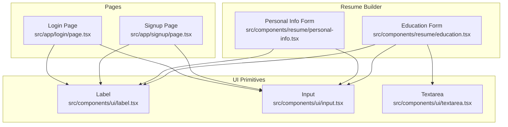
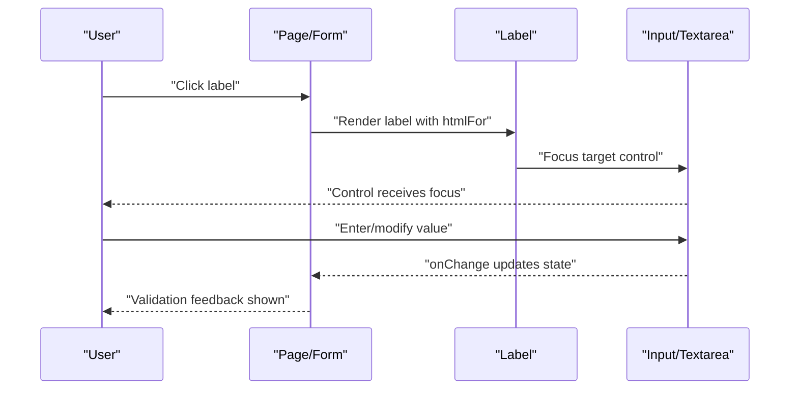
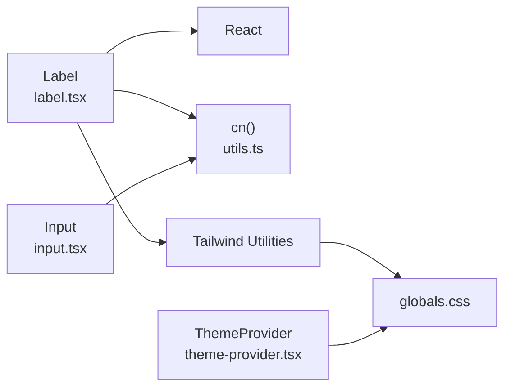

# Label Component

<cite>
**Referenced Files in This Document**
- [label.tsx](file://src/components/ui/label.tsx)
- [input.tsx](file://src/components/ui/input.tsx)
- [textarea.tsx](file://src/components/ui/textarea.tsx)
- [login/page.tsx](file://src/app/login/page.tsx)
- [signup/page.tsx](file://src/app/signup/page.tsx)
- [personal-info.tsx](file://src/components/resume/personal-info.tsx)
- [education.tsx](file://src/components/resume/education.tsx)
- [globals.css](file://src/app/globals.css)
- [theme-provider.tsx](file://src/components/theme-provider.tsx)
- [utils.ts](file://src/lib/utils.ts)
</cite>

## Table of Contents
1. [Introduction](#introduction)
2. [Project Structure](#project-structure)
3. [Core Components](#core-components)
4. [Architecture Overview](#architecture-overview)
5. [Detailed Component Analysis](#detailed-component-analysis)
6. [Dependency Analysis](#dependency-analysis)
7. [Performance Considerations](#performance-considerations)
8. [Troubleshooting Guide](#troubleshooting-guide)
9. [Conclusion](#conclusion)
10. [Appendices](#appendices)

## Introduction
This document provides comprehensive documentation for the Label component used across the application’s forms. It explains the component’s props interface, styling approach, and form integration capabilities. It also covers accessibility features, keyboard navigation, and practical usage patterns such as label positioning, required field indicators, error state labeling, inline labels, floating labels, and conditional label display. Guidance is included for styling customization, responsive behavior, and integration with validation systems.

## Project Structure
The Label component resides in the UI primitives layer alongside Input and Textarea. It is consumed by authentication pages and resume builder components to associate labels with form controls and improve usability and accessibility.

**Diagram sources**
- [label.tsx:1-19](file://src/components/ui/label.tsx#L1-L19)
- [input.tsx:1-25](file://src/components/ui/input.tsx#L1-L25)
- [textarea.tsx:1-24](file://src/components/ui/textarea.tsx#L1-L24)
- [login/page.tsx:1-113](file://src/app/login/page.tsx#L1-L113)
- [signup/page.tsx:1-150](file://src/app/signup/page.tsx#L1-L150)
- [personal-info.tsx:1-118](file://src/components/resume/personal-info.tsx#L1-L118)
- [education.tsx:1-112](file://src/components/resume/education.tsx#L1-L112)

**Section sources**
- [label.tsx:1-19](file://src/components/ui/label.tsx#L1-L19)
- [input.tsx:1-25](file://src/components/ui/input.tsx#L1-L25)
- [textarea.tsx:1-24](file://src/components/ui/textarea.tsx#L1-L24)
- [login/page.tsx:1-113](file://src/app/login/page.tsx#L1-L113)
- [signup/page.tsx:1-150](file://src/app/signup/page.tsx#L1-L150)
- [personal-info.tsx:1-118](file://src/components/resume/personal-info.tsx#L1-L118)
- [education.tsx:1-112](file://src/components/resume/education.tsx#L1-L112)

## Core Components
- Label: A thin wrapper around the native HTML label element with forwardRef support and Tailwind-based default styling. It inherits all standard label attributes and adds disabled state styling via peer selectors.
- Input: A styled text input with focus-visible ring, disabled state handling, and optional file-like inputs for upload scenarios.
- Textarea: A styled multiline text area with focus-visible ring and disabled state handling.

Key characteristics:
- Props interface: Extends native HTML label attributes, enabling standard label behavior and accessibility.
- Styling: Uses Tailwind utility classes for typography and disabled state opacity.
- Integration: Works seamlessly with Input and Textarea by sharing IDs and label associations.

**Section sources**
- [label.tsx:5-16](file://src/components/ui/label.tsx#L5-L16)
- [input.tsx:5-22](file://src/components/ui/input.tsx#L5-L22)
- [textarea.tsx:5-21](file://src/components/ui/textarea.tsx#L5-L21)

## Architecture Overview
The Label component participates in form control associations through explicit ID-to-for relationships. It is used across authentication and resume builder forms to provide accessible, styled labels that reflect enabled/disabled states and integrate with validation feedback.

**Diagram sources**
- [login/page.tsx:74-95](file://src/app/login/page.tsx#L74-L95)
- [signup/page.tsx:97-132](file://src/app/signup/page.tsx#L97-L132)
- [personal-info.tsx:22-113](file://src/components/resume/personal-info.tsx#L22-L113)
- [education.tsx:58-99](file://src/components/resume/education.tsx#L58-L99)

## Detailed Component Analysis

### Props Interface
- LabelProps: Inherits all standard HTML label attributes (e.g., htmlFor, className, onClick). This enables semantic labeling, accessibility, and extensibility.
- Default className: Includes typography and disabled-state styling; consumers can append additional classes via the className prop.

Usage patterns:
- Required fields: Combine label with required attributes on the associated input.
- Error states: Display validation messages adjacent to the input and keep the label visible for context.
- Conditional rendering: Hide or show labels based on form state or layout needs.

**Section sources**
- [label.tsx:5-16](file://src/components/ui/label.tsx#L5-L16)
- [login/page.tsx:74-95](file://src/app/login/page.tsx#L74-L95)
- [signup/page.tsx:97-132](file://src/app/signup/page.tsx#L97-L132)

### Styling Approach
- Typography: Small, medium-weight, and tight line height for concise labels.
- Disabled state: Opacity reduction and non-interactive cursor when paired with disabled inputs.
- Composition: Accepts className to merge with defaults using a utility that merges Tailwind classes safely.

Responsive behavior:
- Labels adapt to container widths and remain legible across breakpoints.
- In stacked layouts, labels appear above inputs; in grid layouts, alignment remains consistent.

Accessibility:
- Proper association via htmlFor ensures screen readers announce labels when controls receive focus.
- Focus management aligns with native label behavior.

**Section sources**
- [label.tsx:11-11](file://src/components/ui/label.tsx#L11-L11)
- [utils.ts:4-6](file://src/lib/utils.ts#L4-L6)
- [globals.css:161-169](file://src/app/globals.css#L161-L169)

### Form Integration Capabilities
- Authentication forms: Labels are consistently paired with inputs using matching IDs, ensuring reliable focus and accessibility.
- Resume builder forms: Labels support dynamic forms with multiple repeated sections, maintaining clarity and usability.

Patterns demonstrated:
- Inline labels: Labels positioned adjacent to inputs in compact layouts.
- Stacked labels: Labels above inputs for improved readability.
- Floating labels: While not implemented here, the component supports floating label patterns by combining label placement with input focus states.

**Section sources**
- [login/page.tsx:74-95](file://src/app/login/page.tsx#L74-L95)
- [signup/page.tsx:97-132](file://src/app/signup/page.tsx#L97-L132)
- [personal-info.tsx:22-113](file://src/components/resume/personal-info.tsx#L22-L113)
- [education.tsx:58-99](file://src/components/resume/education.tsx#L58-L99)

### Accessibility Features
- Association: Using htmlFor connects labels to inputs, enabling screen readers to announce labels upon focus.
- Keyboard navigation: Clicking a label focuses the associated control, improving keyboard-only usability.
- Disabled state: Labels reflect disabled state styling to indicate non-interactive contexts.
- Theming: Global theme provider and CSS variables ensure consistent color and contrast across light/dark modes.

**Section sources**
- [login/page.tsx:74-95](file://src/app/login/page.tsx#L74-L95)
- [signup/page.tsx:97-132](file://src/app/signup/page.tsx#L97-L132)
- [theme-provider.tsx:7-9](file://src/components/theme-provider.tsx#L7-L9)
- [globals.css:57-86](file://src/app/globals.css#L57-L86)

### Usage Examples

#### Label Positioning
- Stacked labels: Place the label above the input for readability.
- Inline labels: Place the label beside the input for compact layouts.

References:
- [login/page.tsx:74-95](file://src/app/login/page.tsx#L74-L95)
- [signup/page.tsx:97-132](file://src/app/signup/page.tsx#L97-L132)
- [personal-info.tsx:22-113](file://src/components/resume/personal-info.tsx#L22-L113)

#### Required Field Indicators
- Mark inputs as required and optionally augment labels to indicate mandatory fields.

References:
- [login/page.tsx:82-94](file://src/app/login/page.tsx#L82-L94)
- [signup/page.tsx:105-131](file://src/app/signup/page.tsx#L105-L131)

#### Error State Labeling
- Display validation messages near inputs while keeping labels visible for context.

References:
- [login/page.tsx:68-72](file://src/app/login/page.tsx#L68-L72)
- [signup/page.tsx:85-89](file://src/app/signup/page.tsx#L85-L89)

#### Conditional Label Display
- Hide/show labels based on layout or state (e.g., floating label behavior).

References:
- [personal-info.tsx:22-113](file://src/components/resume/personal-info.tsx#L22-L113)
- [education.tsx:58-99](file://src/components/resume/education.tsx#L58-L99)

### Class Model

```mermaid
classDiagram
class Label {
+LabelProps props
+forwardRef<HTMLLabelElement>
+className : "text-sm font-medium leading-none peer-disabled : cursor-not-allowed peer-disabled : opacity-70"
}
class Input {
+InputProps props
+forwardRef<HTMLInputElement>
+className : "flex h-10 w-full rounded-md border border-input bg-background px-3 py-2 text-sm ring-offset-background file : border-0 file : bg-transparent file : text-sm file : font-medium placeholder : text-muted-foreground focus-visible : outline-none focus-visible : ring-2 focus-visible : ring-ring focus-visible : ring-offset-2 disabled : cursor-not-allowed disabled : opacity-50"
}
class Textarea {
+TextareaProps props
+forwardRef<HTMLTextAreaElement>
+className : "flex min-h-[80px] w-full rounded-md border border-input bg-background px-3 py-2 text-sm ring-offset-background placeholder : text-muted-foreground focus-visible : outline-none focus-visible : ring-2 focus-visible : ring-ring focus-visible : ring-offset-2 disabled : cursor-not-allowed disabled : opacity-50"
}
Label --> Input : "associated via htmlFor"
Label --> Textarea : "associated via htmlFor"
```

**Diagram sources**
- [label.tsx:5-16](file://src/components/ui/label.tsx#L5-L16)
- [input.tsx:5-22](file://src/components/ui/input.tsx#L5-L22)
- [textarea.tsx:5-21](file://src/components/ui/textarea.tsx#L5-L21)

## Dependency Analysis
- Internal dependencies:
  - Label depends on React for forwardRef and native label semantics.
  - Utility function for merging Tailwind classes supports safe composition.
- External dependencies:
  - Tailwind CSS for styling utilities.
  - next-themes for theme-aware rendering.

**Diagram sources**
- [label.tsx:1-19](file://src/components/ui/label.tsx#L1-L19)
- [input.tsx:1-25](file://src/components/ui/input.tsx#L1-L25)
- [utils.ts:4-6](file://src/lib/utils.ts#L4-L6)
- [globals.css:1-169](file://src/app/globals.css#L1-L169)
- [theme-provider.tsx:7-9](file://src/components/theme-provider.tsx#L7-L9)

**Section sources**
- [label.tsx:1-19](file://src/components/ui/label.tsx#L1-L19)
- [input.tsx:1-25](file://src/components/ui/input.tsx#L1-L25)
- [utils.ts:4-6](file://src/lib/utils.ts#L4-L6)
- [globals.css:1-169](file://src/app/globals.css#L1-L169)
- [theme-provider.tsx:7-9](file://src/components/theme-provider.tsx#L7-L9)

## Performance Considerations
- Rendering cost: Minimal overhead as Label is a lightweight wrapper around the native label element.
- Styling cost: Tailwind utilities are applied at build time; runtime cost is negligible.
- Composition cost: Using the utility function for class merging is efficient and avoids unnecessary re-renders.

## Troubleshooting Guide
Common issues and resolutions:
- Label not focusing input: Ensure the label’s htmlFor matches the input’s id.
- Disabled label not visually reflecting disabled state: Verify the associated input is disabled; the label’s disabled class is applied conditionally.
- Styling conflicts: Use the className prop to override defaults; leverage the utility function for safe merging.

**Section sources**
- [label.tsx:11-11](file://src/components/ui/label.tsx#L11-L11)
- [input.tsx:12-18](file://src/components/ui/input.tsx#L12-L18)
- [utils.ts:4-6](file://src/lib/utils.ts#L4-L6)

## Conclusion
The Label component provides a simple, accessible, and extensible foundation for labeling form controls. Its minimal implementation, strong integration with Input and Textarea, and built-in disabled state styling make it suitable for a wide range of form layouts. By following the documented patterns for association, accessibility, and styling, teams can maintain consistent UX and accessibility across the application.

## Appendices

### Best Practices for Styling Customization
- Keep typography consistent: Use the existing small, medium-weight style for labels.
- Respect disabled states: Preserve reduced opacity and pointer behavior for disabled labels.
- Compose classes safely: Use the provided utility function to merge Tailwind classes without conflicts.

### Responsive Behavior Guidelines
- Stacked vs. inline: Choose label placement based on viewport and form density.
- Grid layouts: Align labels with their respective inputs across breakpoints.

### Validation Integration Patterns
- Display validation messages adjacent to inputs while retaining labels for context.
- Use aria-invalid and aria-describedby to connect validation feedback to inputs when needed.