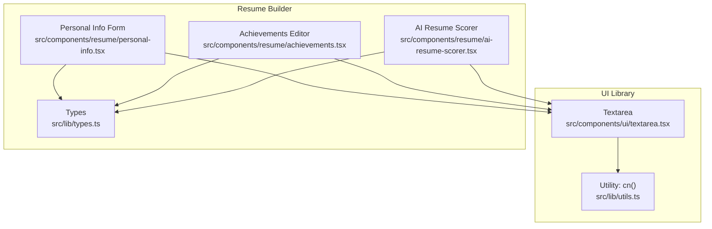
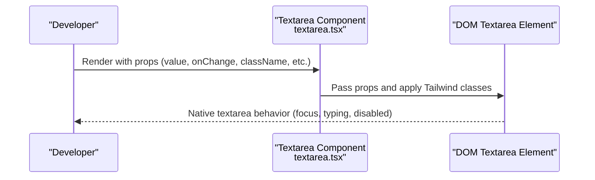
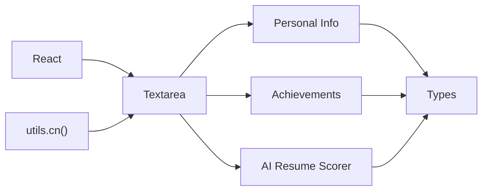

# Textarea Component

<cite>
**Referenced Files in This Document**
- [textarea.tsx](file://src/components/ui/textarea.tsx)
- [personal-info.tsx](file://src/components/resume/personal-info.tsx)
- [achievements.tsx](file://src/components/resume/achievements.tsx)
- [ai-resume-scorer.tsx](file://src/components/resume/ai-resume-scorer.tsx)
- [types.ts](file://src/lib/types.ts)
- [utils.ts](file://src/lib/utils.ts)
</cite>

## Table of Contents
1. [Introduction](#introduction)
2. [Project Structure](#project-structure)
3. [Core Components](#core-components)
4. [Architecture Overview](#architecture-overview)
5. [Detailed Component Analysis](#detailed-component-analysis)
6. [Dependency Analysis](#dependency-analysis)
7. [Performance Considerations](#performance-considerations)
8. [Troubleshooting Guide](#troubleshooting-guide)
9. [Conclusion](#conclusion)
10. [Appendices](#appendices)

## Introduction
This document provides comprehensive documentation for the Textarea component used across the resume builder application. It explains the component’s props interface, styling, behavior, and practical usage in forms, comment sections, and content editors. It also covers accessibility, styling customization, responsive behavior, and integration with form validation. Advanced features such as auto-resize, character counting, and contenteditable alternatives are addressed conceptually to guide future enhancements.

## Project Structure
The Textarea component is part of the UI library and is consumed by various resume-related features:
- The base component resides under the UI module.
- Consumers include resume editing pages and specialized tools such as the AI Resume Scorer.

**Diagram sources**
- [textarea.tsx:1-24](file://src/components/ui/textarea.tsx#L1-L24)
- [utils.ts:1-7](file://src/lib/utils.ts#L1-L7)
- [personal-info.tsx:1-118](file://src/components/resume/personal-info.tsx#L1-L118)
- [achievements.tsx:1-63](file://src/components/resume/achievements.tsx#L1-L63)
- [ai-resume-scorer.tsx:1-301](file://src/components/resume/ai-resume-scorer.tsx#L1-L301)
- [types.ts:1-103](file://src/lib/types.ts#L1-L103)

**Section sources**
- [textarea.tsx:1-24](file://src/components/ui/textarea.tsx#L1-L24)
- [utils.ts:1-7](file://src/lib/utils.ts#L1-L7)

## Core Components
The Textarea component is a thin wrapper around the native HTML textarea element. It accepts all standard textarea attributes and augments them with Tailwind-based styling and optional className overrides.

Key characteristics:
- Props interface: Inherits all HTML textarea attributes via React’s built-in type for textarea elements.
- Ref forwarding: Uses forwardRef to expose the underlying textarea DOM node.
- Styling: Applies a consistent set of Tailwind utility classes for layout, borders, background, padding, typography, focus states, and disabled states.
- Accessibility: Inherits native accessibility features from the textarea element.

Usage examples across the application:
- Personal summary in the Personal Info form.
- Descriptions in the Achievements editor.
- Optional job description input in the AI Resume Scorer.

**Section sources**
- [textarea.tsx:5-21](file://src/components/ui/textarea.tsx#L5-L21)
- [personal-info.tsx:103-113](file://src/components/resume/personal-info.tsx#L103-L113)
- [achievements.tsx:43-51](file://src/components/resume/achievements.tsx#L43-L51)
- [ai-resume-scorer.tsx:132-140](file://src/components/resume/ai-resume-scorer.tsx#L132-L140)

## Architecture Overview
The Textarea component sits at the UI layer and is consumed by domain-specific components. It does not introduce any custom logic for auto-resize or character counting; these capabilities are typically handled by consumers or external libraries when needed.

**Diagram sources**
- [textarea.tsx:7-20](file://src/components/ui/textarea.tsx#L7-L20)

## Detailed Component Analysis

### Props Interface and Behavior
- Props type: Extends the standard HTML textarea attributes, enabling full compatibility with native behavior and accessibility semantics.
- Ref forwarding: Exposes the underlying textarea DOM node for imperative actions (e.g., focus, selection).
- Styling: Combines a base set of Tailwind classes with optional className overrides via a utility function that merges and deduplicates classes.

Practical usage patterns:
- Controlled value management via onChange handlers in parent components.
- Placeholder text for hints and guidance.
- Disabled state for read-only scenarios.
- Custom height via className (e.g., min-height utilities) when needed.

**Section sources**
- [textarea.tsx:5-21](file://src/components/ui/textarea.tsx#L5-L21)
- [utils.ts:4-6](file://src/lib/utils.ts#L4-L6)

### Multiline Text Input and Value Management
- Multiline support: Native textarea inherently supports multiple lines; consumers can adjust rows via className utilities or CSS if desired.
- Value management: Typical pattern is to pass value and onChange from a parent component, updating local state and then propagating changes upward through callbacks.

Examples in the codebase:
- Personal summary updates via a shared handler that writes to a typed data structure.
- Achievement descriptions are edited inline with onChange updates.

**Section sources**
- [personal-info.tsx:13-16](file://src/components/resume/personal-info.tsx#L13-L16)
- [personal-info.tsx:103-113](file://src/components/resume/personal-info.tsx#L103-L113)
- [achievements.tsx:19-22](file://src/components/resume/achievements.tsx#L19-L22)
- [achievements.tsx:43-51](file://src/components/resume/achievements.tsx#L43-L51)

### Placeholder Text
- Placeholders are passed directly to the component and rendered natively.
- They provide contextual hints and improve usability without altering the component’s internal logic.

**Section sources**
- [personal-info.tsx:108-109](file://src/components/resume/personal-info.tsx#L108-L109)
- [achievements.tsx:46-47](file://src/components/resume/achievements.tsx#L46-L47)
- [ai-resume-scorer.tsx:134-139](file://src/components/resume/ai-resume-scorer.tsx#L134-L139)

### Resize Behavior
- Native textarea resizability: The component does not enforce fixed or constrained resizing; consumers can control resize behavior via className utilities (e.g., resize-both, resize-y, resize-none).
- Auto-resize: Not implemented within the component itself. If needed, consumers can implement auto-resize using a library or custom logic that adjusts height based on scrollHeight.

[No sources needed since this section provides conceptual guidance]

### Accessibility Features
- Native accessibility: As a native textarea, the component inherits standard ARIA roles and keyboard behaviors automatically.
- Recommended enhancements (conceptual):
  - aria-describedby for associating helper text or character count.
  - aria-invalid for validation errors.
  - Proper labeling via associated Label components.
  - Keyboard shortcuts (e.g., Ctrl/Cmd+Enter for submit) can be added by consumers.

**Section sources**
- [personal-info.tsx:104-112](file://src/components/resume/personal-info.tsx#L104-L112)
- [achievements.tsx:44-50](file://src/components/resume/achievements.tsx#L44-L50)
- [ai-resume-scorer.tsx:132-140](file://src/components/resume/ai-resume-scorer.tsx#L132-L140)

### Usage Examples

#### Forms
- Personal Info form uses Textarea for professional summary with controlled value and onChange handling.
- The form leverages a shared handler to update typed data structures.

**Section sources**
- [personal-info.tsx:13-16](file://src/components/resume/personal-info.tsx#L13-L16)
- [personal-info.tsx:103-113](file://src/components/resume/personal-info.tsx#L103-L113)
- [types.ts:1-11](file://src/lib/types.ts#L1-L11)

#### Comment Sections and Content Editors
- Achievements editor demonstrates a repeatable pattern for editing descriptions with onChange updates.
- The component integrates seamlessly with lists and dynamic item creation/removal.

**Section sources**
- [achievements.tsx:15-22](file://src/components/resume/achievements.tsx#L15-L22)
- [achievements.tsx:43-51](file://src/components/resume/achievements.tsx#L43-L51)

#### Content Editors (AI Scoring Tool)
- The AI Resume Scorer uses Textarea for optional job description input, enabling targeted analysis.
- The component participates in a modal-like flow with loading and error states managed by the consumer.

**Section sources**
- [ai-resume-scorer.tsx:27-66](file://src/components/resume/ai-resume-scorer.tsx#L27-L66)
- [ai-resume-scorer.tsx:132-140](file://src/components/resume/ai-resume-scorer.tsx#L132-L140)

### Advanced Features

#### Auto-Resize
- Current implementation: None within the component.
- Consumer approach: Use a library or implement a resize listener that updates height based on scrollHeight.
- Benefits: Improves UX by avoiding scrollbars and maintaining consistent viewport.

[No sources needed since this section provides conceptual guidance]

#### Character Counting
- Current implementation: None within the component.
- Consumer approach: Track length in onChange and conditionally style the component or show a counter element.
- Example pattern: Enforce a maximum length and visually indicate nearing limits.

**Section sources**
- [projects.tsx:70-74](file://src/components/resume/projects.tsx#L70-L74)
- [projects.tsx:83-84](file://src/components/resume/projects.tsx#L83-L84)

#### ContentEditable Alternatives
- Native textarea is preferred for multi-line text input in forms.
- ContentEditable can be considered for rich text scenarios but introduces complexity around sanitization, accessibility, and cross-browser behavior.

[No sources needed since this section provides conceptual guidance]

## Dependency Analysis
The Textarea component depends on:
- React for component definition and ref forwarding.
- A utility function for merging Tailwind classes.

Consumers depend on:
- The Textarea component for rendering multi-line inputs.
- Typed data structures for controlled value management.

**Diagram sources**
- [textarea.tsx:1-24](file://src/components/ui/textarea.tsx#L1-L24)
- [utils.ts:1-7](file://src/lib/utils.ts#L1-L7)
- [personal-info.tsx:1-118](file://src/components/resume/personal-info.tsx#L1-L118)
- [achievements.tsx:1-63](file://src/components/resume/achievements.tsx#L1-L63)
- [ai-resume-scorer.tsx:1-301](file://src/components/resume/ai-resume-scorer.tsx#L1-L301)
- [types.ts:1-103](file://src/lib/types.ts#L1-L103)

**Section sources**
- [textarea.tsx:1-24](file://src/components/ui/textarea.tsx#L1-L24)
- [utils.ts:1-7](file://src/lib/utils.ts#L1-L7)

## Performance Considerations
- Rendering cost: Minimal; the component forwards props and applies static Tailwind classes.
- Controlled inputs: Prefer controlled components to avoid unnecessary re-renders in consumers.
- Large content: For very long texts, consider virtualization or pagination in higher-order containers.

[No sources needed since this section provides general guidance]

## Troubleshooting Guide
Common issues and resolutions:
- Placeholder not visible: Ensure placeholder is provided and className does not override text color unintentionally.
- Focus ring conflicts: Adjust focus-related classes via className if conflicting with custom designs.
- Disabled state: Verify disabled prop is applied consistently across consumers.
- Validation feedback: Use aria-invalid and associate error messages with the component using aria-describedby.

**Section sources**
- [textarea.tsx:11-17](file://src/components/ui/textarea.tsx#L11-L17)

## Conclusion
The Textarea component provides a minimal, accessible, and highly customizable foundation for multi-line text input across the application. Its design emphasizes composition with consumers who manage value, validation, and advanced behaviors like auto-resize and character counting. By leveraging the component’s props interface and consistent styling, developers can build robust forms, editors, and interactive experiences.

[No sources needed since this section summarizes without analyzing specific files]

## Appendices

### Props Reference
- Inherits all standard HTML textarea attributes (e.g., value, onChange, placeholder, disabled, rows, cols).
- Additional className prop allows Tailwind-based customization.

**Section sources**
- [textarea.tsx:5-21](file://src/components/ui/textarea.tsx#L5-L21)

### Styling Customization Guidelines
- Use className to adjust min-height, padding, and borders.
- Combine with layout utilities (e.g., w-full, max-w-full) for responsive behavior.
- Override focus and disabled styles via className for brand consistency.

**Section sources**
- [textarea.tsx:11-17](file://src/components/ui/textarea.tsx#L11-L17)
- [personal-info.tsx:109-112](file://src/components/resume/personal-info.tsx#L109-L112)

### Integration with Form Validation
- Controlled components: Pass value and onChange from a parent form state.
- Validation: Trigger onChange on input change or blur; surface errors via aria-invalid and assistive text.

**Section sources**
- [personal-info.tsx:13-16](file://src/components/resume/personal-info.tsx#L13-L16)
- [achievements.tsx:19-22](file://src/components/resume/achievements.tsx#L19-L22)