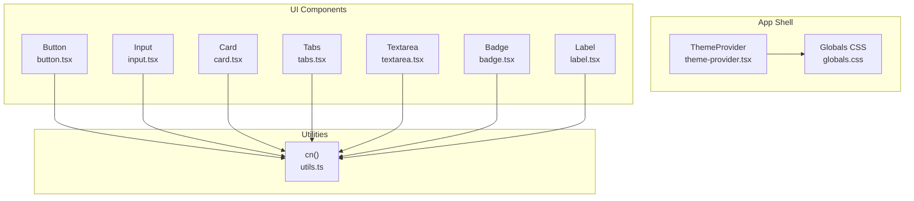
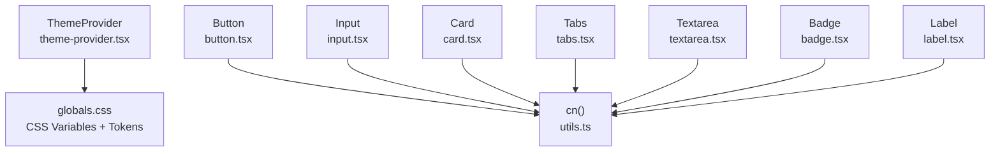
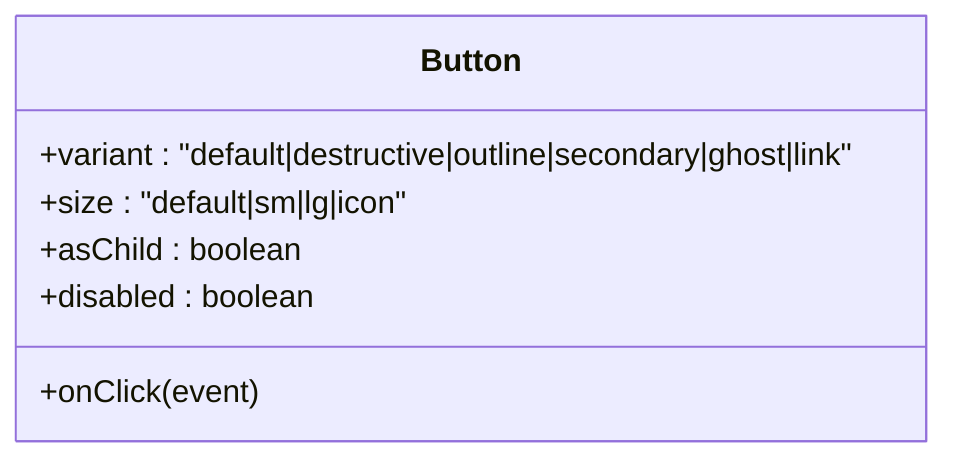
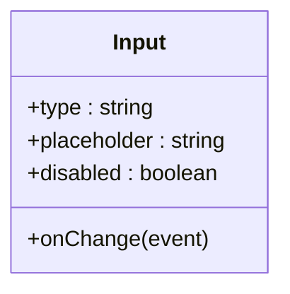
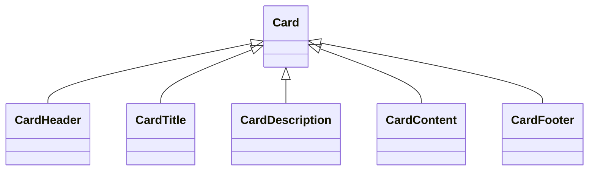
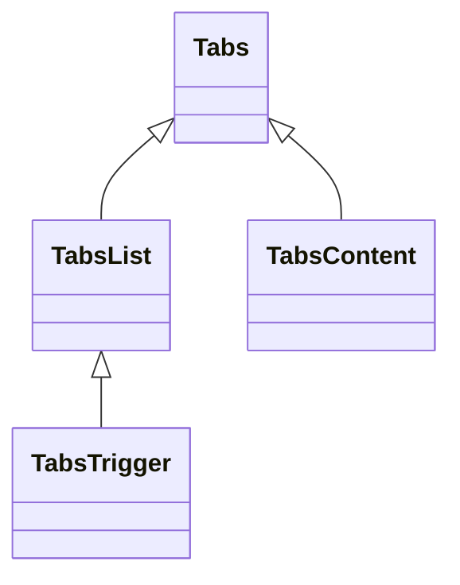
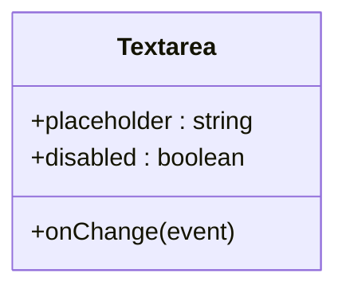
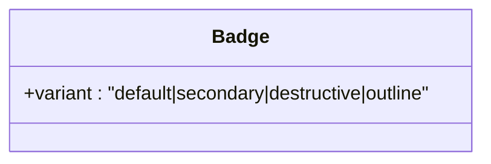
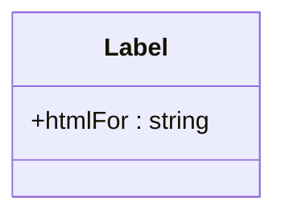
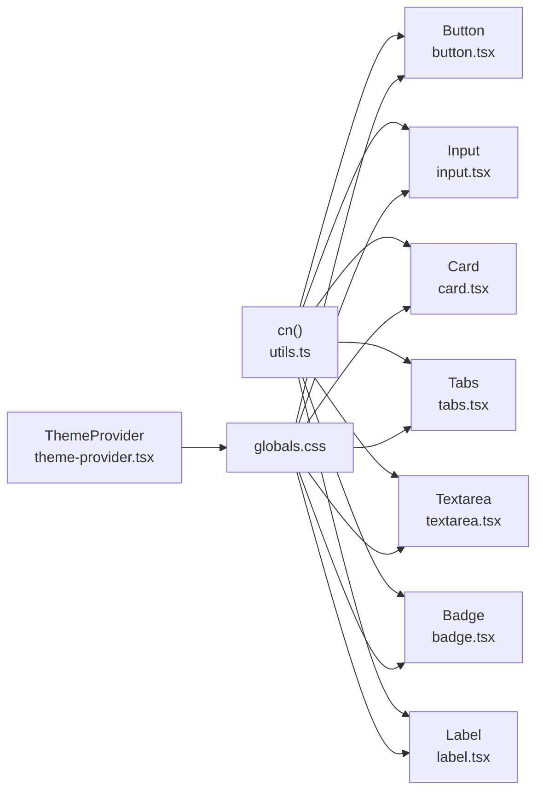

# UI Component Library

<cite>
**Referenced Files in This Document**
- [button.tsx](file://src/components/ui/button.tsx)
- [input.tsx](file://src/components/ui/input.tsx)
- [card.tsx](file://src/components/ui/card.tsx)
- [tabs.tsx](file://src/components/ui/tabs.tsx)
- [textarea.tsx](file://src/components/ui/textarea.tsx)
- [badge.tsx](file://src/components/ui/badge.tsx)
- [label.tsx](file://src/components/ui/label.tsx)
- [globals.css](file://src/app/globals.css)
- [utils.ts](file://src/lib/utils.ts)
- [theme-provider.tsx](file://src/components/theme-provider.tsx)
- [header.tsx](file://src/components/layout/header.tsx)
- [personal-info.tsx](file://src/components/resume/personal-info.tsx)
- [skills.tsx](file://src/components/resume/skills.tsx)
</cite>

## Table of Contents
1. [Introduction](#introduction)
2. [Project Structure](#project-structure)
3. [Core Components](#core-components)
4. [Architecture Overview](#architecture-overview)
5. [Detailed Component Analysis](#detailed-component-analysis)
6. [Dependency Analysis](#dependency-analysis)
7. [Performance Considerations](#performance-considerations)
8. [Troubleshooting Guide](#troubleshooting-guide)
9. [Conclusion](#conclusion)
10. [Appendices](#appendices)

## Introduction
This document describes the UI component library used in the resume builder application. It focuses on seven reusable components: Button, Input, Card, Tabs, Textarea, Badge, and Label. For each component, we document props/attributes, variants and sizes, styling approaches, accessibility considerations, responsive usage patterns, and integration with forms and theming. We also provide guidelines for composition, extensibility, and maintaining design system consistency.

## Project Structure
The UI components live under src/components/ui and are styled via Tailwind CSS with a custom theme. Utility helpers merge Tailwind classes safely, and the app-wide theme provider enables light/dark mode switching.

**Diagram sources**
- [theme-provider.tsx:1-10](file://src/components/theme-provider.tsx#L1-L10)
- [globals.css:1-169](file://src/app/globals.css#L1-L169)
- [button.tsx:1-57](file://src/components/ui/button.tsx#L1-L57)
- [input.tsx:1-25](file://src/components/ui/input.tsx#L1-L25)
- [card.tsx:1-77](file://src/components/ui/card.tsx#L1-L77)
- [tabs.tsx:1-56](file://src/components/ui/tabs.tsx#L1-L56)
- [textarea.tsx:1-24](file://src/components/ui/textarea.tsx#L1-L24)
- [badge.tsx:1-36](file://src/components/ui/badge.tsx#L1-L36)
- [label.tsx:1-19](file://src/components/ui/label.tsx#L1-L19)
- [utils.ts:1-7](file://src/lib/utils.ts#L1-L7)

**Section sources**
- [globals.css:1-169](file://src/app/globals.css#L1-L169)
- [utils.ts:1-7](file://src/lib/utils.ts#L1-L7)
- [theme-provider.tsx:1-10](file://src/components/theme-provider.tsx#L1-L10)

## Core Components
Below are the documented components, their props, variants, and usage patterns.

- Button
  - Purpose: Interactive actions with multiple visual variants and sizing options.
  - Props:
    - Inherits native button attributes.
    - variant: default, destructive, outline, secondary, ghost, link.
    - size: default, sm, lg, icon.
    - asChild: render as a radix slot wrapper.
  - Accessibility: Supports focus-visible ring and disabled state.
  - Styling: Uses class variance authority (CVA) with Tailwind classes merged via cn().
  - Usage examples:
    - Variants and sizes: [header.tsx:38-85](file://src/components/layout/header.tsx#L38-L85)
    - Icon variant: [skills.tsx:38-40](file://src/components/resume/skills.tsx#L38-L40)

- Input
  - Purpose: Single-line text entry with consistent focus and disabled states.
  - Props:
    - Inherits native input attributes (type, placeholder, etc.).
  - Accessibility: Focus ring and disabled cursor behavior.
  - Styling: Tailwind classes for border, background, padding, and focus ring.
  - Usage examples:
    - Personal info fields: [personal-info.tsx:23-101](file://src/components/resume/personal-info.tsx#L23-L101)

- Card
  - Purpose: Container with header, title, description, content, and footer slots.
  - Slots:
    - Card, CardHeader, CardTitle, CardDescription, CardContent, CardFooter.
  - Accessibility: Structural semantics via heading element for titles.
  - Styling: Shadow, rounded borders, and card foreground tokens.
  - Usage examples:
    - Composition pattern: [personal-info.tsx:13-118](file://src/components/resume/personal-info.tsx#L13-L118)

- Tabs
  - Purpose: Organize content into selectable sections.
  - Parts:
    - Tabs, TabsList, TabsTrigger, TabsContent.
  - Accessibility: Uses Radix UI primitives with proper ARIA roles and keyboard navigation.
  - Styling: Active trigger styling and focus rings.
  - Usage examples:
    - Integration pattern: [tabs.tsx:8-56](file://src/components/ui/tabs.tsx#L8-L56)

- Textarea
  - Purpose: Multi-line text entry with consistent focus and disabled states.
  - Props:
    - Inherits native textarea attributes.
  - Accessibility: Focus ring and disabled cursor behavior.
  - Styling: Tailwind classes for border, background, padding, and focus ring.
  - Usage examples:
    - Professional summary field: [personal-info.tsx:104-112](file://src/components/resume/personal-info.tsx#L104-L112)

- Badge
  - Purpose: Short labels for status or metadata.
  - Props:
    - variant: default, secondary, destructive, outline.
  - Accessibility: Renders a div; ensure semantic meaning is provided by surrounding context.
  - Styling: CVA with border, padding, rounded corners, and focus ring utilities.
  - Usage examples:
    - Status badges: [skills.tsx:44-62](file://src/components/resume/skills.tsx#L44-L62)

- Label
  - Purpose: Associates text with form controls.
  - Props:
    - Inherits native label attributes.
  - Accessibility: Peer disabled state styling aligns with form controls.
  - Styling: Font weight and disabled opacity applied conditionally.
  - Usage examples:
    - Field labels: [personal-info.tsx:23-101](file://src/components/resume/personal-info.tsx#L23-L101)

**Section sources**
- [button.tsx:36-57](file://src/components/ui/button.tsx#L36-L57)
- [input.tsx:5-25](file://src/components/ui/input.tsx#L5-L25)
- [card.tsx:5-77](file://src/components/ui/card.tsx#L5-L77)
- [tabs.tsx:8-56](file://src/components/ui/tabs.tsx#L8-L56)
- [textarea.tsx:5-24](file://src/components/ui/textarea.tsx#L5-L24)
- [badge.tsx:25-36](file://src/components/ui/badge.tsx#L25-L36)
- [label.tsx:5-19](file://src/components/ui/label.tsx#L5-L19)

## Architecture Overview
The UI components rely on a shared styling system:
- Tailwind CSS with custom CSS variables for theme tokens.
- A cn() utility that merges Tailwind classes safely.
- ThemeProvider enabling light/dark mode via next-themes.

**Diagram sources**
- [theme-provider.tsx:1-10](file://src/components/theme-provider.tsx#L1-L10)
- [globals.css:1-169](file://src/app/globals.css#L1-L169)
- [utils.ts:1-7](file://src/lib/utils.ts#L1-L7)
- [button.tsx:1-57](file://src/components/ui/button.tsx#L1-L57)
- [input.tsx:1-25](file://src/components/ui/input.tsx#L1-L25)
- [card.tsx:1-77](file://src/components/ui/card.tsx#L1-L77)
- [tabs.tsx:1-56](file://src/components/ui/tabs.tsx#L1-L56)
- [textarea.tsx:1-24](file://src/components/ui/textarea.tsx#L1-L24)
- [badge.tsx:1-36](file://src/components/ui/badge.tsx#L1-L36)
- [label.tsx:1-19](file://src/components/ui/label.tsx#L1-L19)

## Detailed Component Analysis

### Button
- Variants and sizes are defined via CVA and applied through cn(). Disabled and focus-visible states are handled consistently.
- Composition pattern: asChild allows rendering Button as another component (e.g., Link) while preserving styling and behavior.
- Accessibility: Focus ring and disabled pointer-events.
- Usage examples:
  - Ghost and outline buttons in navigation: [header.tsx:38-85](file://src/components/layout/header.tsx#L38-L85)
  - Icon button with plus icon: [skills.tsx:38-40](file://src/components/resume/skills.tsx#L38-L40)

**Diagram sources**
- [button.tsx:36-57](file://src/components/ui/button.tsx#L36-L57)

**Section sources**
- [button.tsx:7-34](file://src/components/ui/button.tsx#L7-L34)
- [button.tsx:36-57](file://src/components/ui/button.tsx#L36-L57)
- [header.tsx:38-85](file://src/components/layout/header.tsx#L38-L85)
- [skills.tsx:38-40](file://src/components/resume/skills.tsx#L38-L40)

### Input
- Provides consistent focus-visible ring, placeholder styling, and disabled cursor behavior.
- Accessibility: Works seamlessly with Label for screen readers.

**Diagram sources**
- [input.tsx:5-25](file://src/components/ui/input.tsx#L5-L25)

**Section sources**
- [input.tsx:7-21](file://src/components/ui/input.tsx#L7-L21)
- [personal-info.tsx:23-101](file://src/components/resume/personal-info.tsx#L23-L101)

### Card
- Composed set of parts for structured content presentation.
- Accessibility: Title rendered as heading element.

**Diagram sources**
- [card.tsx:5-77](file://src/components/ui/card.tsx#L5-L77)

**Section sources**
- [card.tsx:5-77](file://src/components/ui/card.tsx#L5-L77)
- [personal-info.tsx:13-118](file://src/components/resume/personal-info.tsx#L13-L118)

### Tabs
- Built on Radix UI primitives for robust keyboard navigation and ARIA support.
- Active state styling and focus rings.

**Diagram sources**
- [tabs.tsx:8-56](file://src/components/ui/tabs.tsx#L8-L56)

**Section sources**
- [tabs.tsx:8-56](file://src/components/ui/tabs.tsx#L8-L56)

### Textarea
- Consistent focus-visible ring and disabled cursor behavior.

**Diagram sources**
- [textarea.tsx:5-24](file://src/components/ui/textarea.tsx#L5-L24)

**Section sources**
- [textarea.tsx:7-19](file://src/components/ui/textarea.tsx#L7-L19)
- [personal-info.tsx:104-112](file://src/components/resume/personal-info.tsx#L104-L112)

### Badge
- Lightweight indicator with variant-based styling.

**Diagram sources**
- [badge.tsx:25-36](file://src/components/ui/badge.tsx#L25-L36)

**Section sources**
- [badge.tsx:5-23](file://src/components/ui/badge.tsx#L5-L23)
- [badge.tsx:25-36](file://src/components/ui/badge.tsx#L25-L36)
- [skills.tsx:44-62](file://src/components/resume/skills.tsx#L44-L62)

### Label
- Associates text with form controls; integrates with disabled states via peer selectors.

**Diagram sources**
- [label.tsx:5-19](file://src/components/ui/label.tsx#L5-L19)

**Section sources**
- [label.tsx:7-15](file://src/components/ui/label.tsx#L7-L15)
- [personal-info.tsx:23-101](file://src/components/resume/personal-info.tsx#L23-L101)

## Dependency Analysis
- Styling pipeline: Components depend on cn() to merge Tailwind classes and respect overrides.
- Theming: globals.css defines CSS variables and tokens; ThemeProvider supplies theme context.
- Composition: Button supports asChild to wrap anchor tags or other components.

**Diagram sources**
- [utils.ts:1-7](file://src/lib/utils.ts#L1-L7)
- [button.tsx:1-57](file://src/components/ui/button.tsx#L1-L57)
- [input.tsx:1-25](file://src/components/ui/input.tsx#L1-L25)
- [card.tsx:1-77](file://src/components/ui/card.tsx#L1-L77)
- [tabs.tsx:1-56](file://src/components/ui/tabs.tsx#L1-L56)
- [textarea.tsx:1-24](file://src/components/ui/textarea.tsx#L1-L24)
- [badge.tsx:1-36](file://src/components/ui/badge.tsx#L1-L36)
- [label.tsx:1-19](file://src/components/ui/label.tsx#L1-L19)
- [theme-provider.tsx:1-10](file://src/components/theme-provider.tsx#L1-L10)
- [globals.css:1-169](file://src/app/globals.css#L1-L169)

**Section sources**
- [utils.ts:1-7](file://src/lib/utils.ts#L1-L7)
- [globals.css:1-169](file://src/app/globals.css#L1-L169)
- [theme-provider.tsx:1-10](file://src/components/theme-provider.tsx#L1-L10)

## Performance Considerations
- Prefer variant and size props over ad-hoc class overrides to keep the number of generated variants minimal.
- Use cn() to avoid redundant Tailwind classes and reduce CSS bundle size.
- Keep component composition shallow; avoid deeply nested wrappers that increase re-render scope.
- Defer heavy computations outside render paths (e.g., memoization for derived form data).
- Leverage browser caching for static assets and ensure efficient hydration in client components.

## Troubleshooting Guide
- Focus ring not visible:
  - Ensure focus-visible utilities are present in component classes and that the component receives focus via keyboard navigation.
- Disabled state not applying:
  - Verify disabled prop is passed and that pointer-events and opacity classes are included.
- Theming inconsistencies:
  - Confirm ThemeProvider is wrapping the app and that CSS variables are defined in globals.css.
- asChild rendering issues:
  - Ensure the wrapped component accepts className and forwards refs properly.

**Section sources**
- [button.tsx:42-53](file://src/components/ui/button.tsx#L42-L53)
- [input.tsx:7-21](file://src/components/ui/input.tsx#L7-L21)
- [textarea.tsx:7-19](file://src/components/ui/textarea.tsx#L7-L19)
- [globals.css:1-169](file://src/app/globals.css#L1-L169)
- [theme-provider.tsx:7-9](file://src/components/theme-provider.tsx#L7-L9)

## Conclusion
The UI component library follows a consistent design system built on Tailwind CSS, CVA variants, and a centralized theme. Components are accessible, responsive-friendly, and easy to compose. By adhering to the documented patterns and leveraging the provided utilities and theme tokens, developers can extend the library while maintaining visual and behavioral consistency.

## Appendices

### Responsive Design Guidelines
- Use grid and flex utilities to adapt layouts across breakpoints (e.g., two-column forms on medium screens).
- Prefer relative units and spacing tokens for scalable layouts.
- Test focus rings and touch targets on small screens.

### Accessibility Compliance Checklist
- All interactive controls expose focus indicators and keyboard operability.
- Labels are associated with inputs using htmlFor and aria-describedby where appropriate.
- Disabled states communicate non-interactive state clearly.
- Sufficient color contrast maintained across light/dark themes.

### Theming Support
- CSS variables define primary, secondary, muted, border, and ring tokens.
- next-themes manages theme switching; ensure ThemeProvider wraps the application shell.

**Section sources**
- [globals.css:7-55](file://src/app/globals.css#L7-L55)
- [theme-provider.tsx:7-9](file://src/components/theme-provider.tsx#L7-L9)

### Form Validation Integration Patterns
- Bind onChange handlers to update form state incrementally.
- Render component-specific feedback near the field using Badge or Label.
- Use destructive variant for error states and secondary for informational badges.

**Section sources**
- [personal-info.tsx:14-16](file://src/components/resume/personal-info.tsx#L14-L16)
- [skills.tsx:24-32](file://src/components/resume/skills.tsx#L24-L32)

### Cross-Browser Compatibility
- Focus rings and disabled states are supported across modern browsers.
- Test form controls in Safari and Edge for focus and placeholder behavior.
- Avoid vendor-prefixed utilities; rely on Tailwind’s normalized base layer.

### Extensibility Best Practices
- Add new variants via CVA in existing components or create new components with shared utilities.
- Keep component APIs minimal; favor composition over deep nesting.
- Document variants, sizes, and accessibility behavior for maintainability.