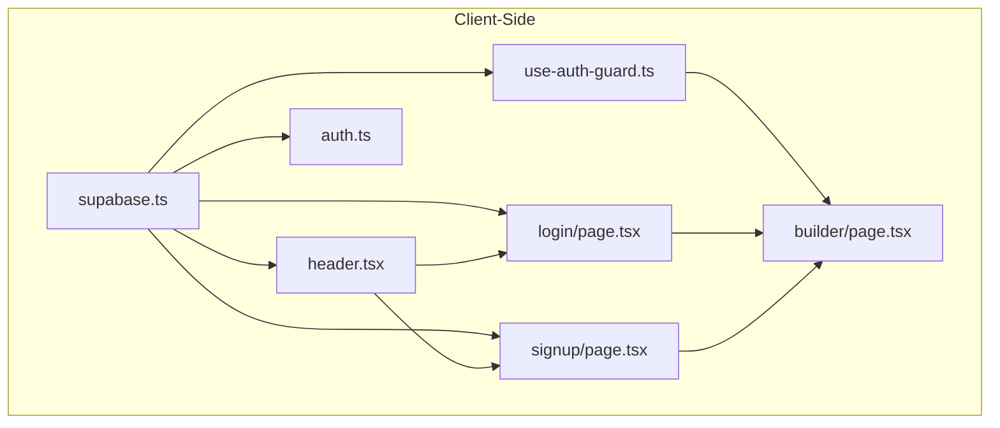
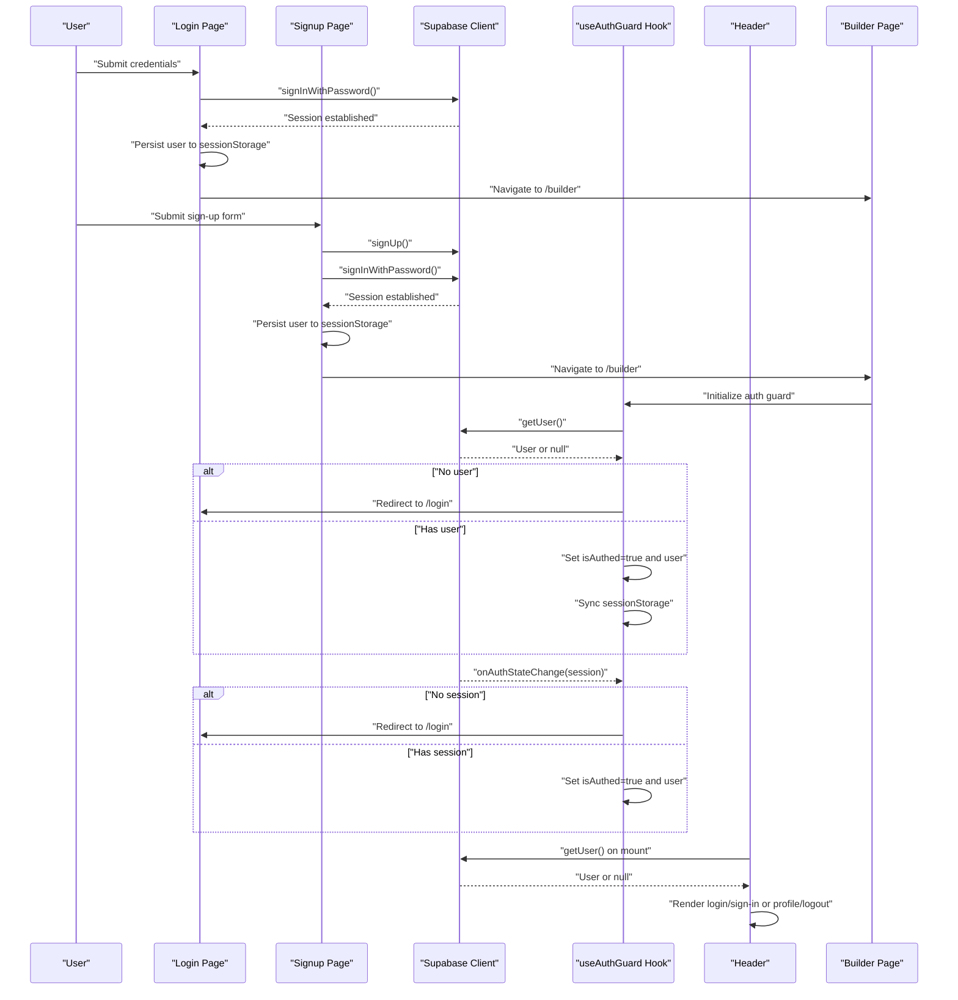
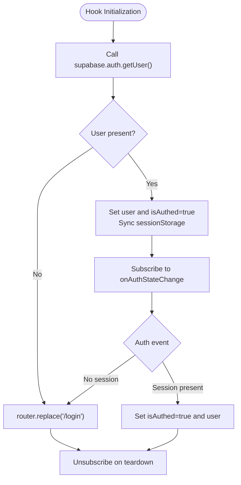
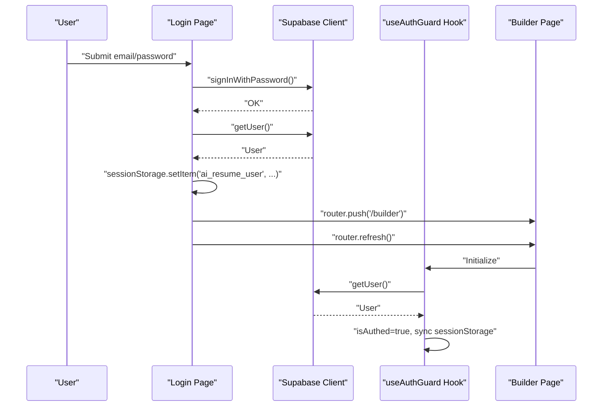
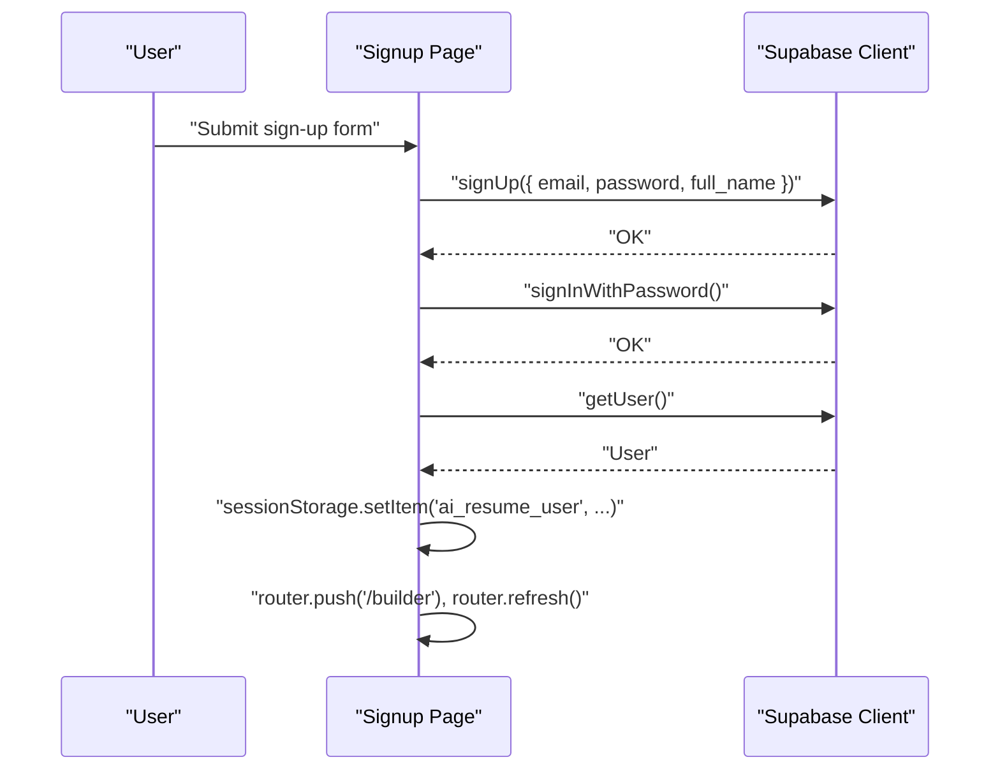
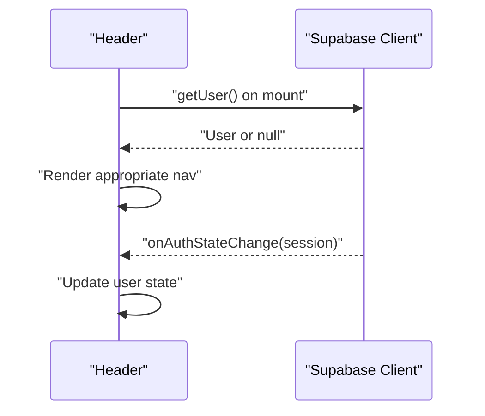
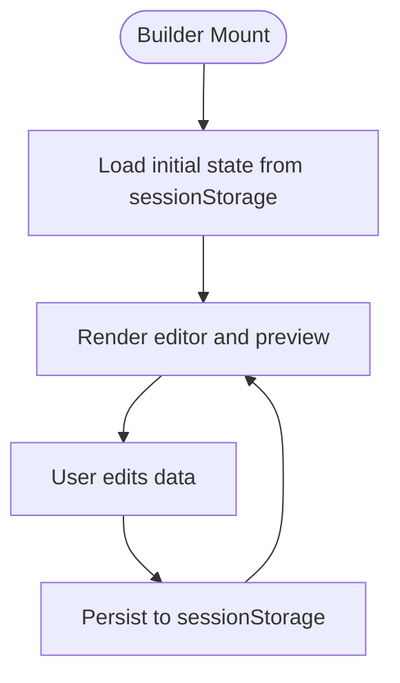
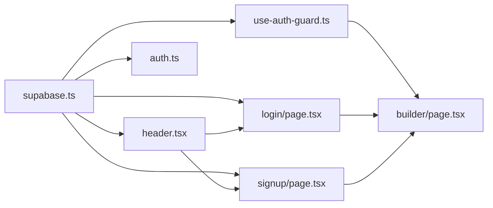

# Authentication Flow

<cite>
**Referenced Files in This Document**
- [use-auth-guard.ts](file://src/hooks/use-auth-guard.ts)
- [supabase.ts](file://src/lib/supabase.ts)
- [auth.ts](file://src/lib/auth.ts)
- [header.tsx](file://src/components/layout/header.tsx)
- [login/page.tsx](file://src/app/login/page.tsx)
- [signup/page.tsx](file://src/app/signup/page.tsx)
- [builder/page.tsx](file://src/app/builder/page.tsx)
- [GOOGLE_OAUTH_SETUP.md](file://GOOGLE_OAUTH_SETUP.md)
- [package.json](file://package.json)
</cite>

## Table of Contents
1. [Introduction](#introduction)
2. [Project Structure](#project-structure)
3. [Core Components](#core-components)
4. [Architecture Overview](#architecture-overview)
5. [Detailed Component Analysis](#detailed-component-analysis)
6. [Dependency Analysis](#dependency-analysis)
7. [Performance Considerations](#performance-considerations)
8. [Security Considerations](#security-considerations)
9. [Troubleshooting Guide](#troubleshooting-guide)
10. [Conclusion](#conclusion)

## Introduction
This document explains the authentication flow in the resume builder application. It covers client-side authentication guards, session persistence using sessionStorage, route protection, and the sign-up and login processes. It also provides practical guidance for implementing authentication guards for protected routes, handling authentication state changes, and managing the user session lifecycle. Security considerations for client-side storage, session validation, and preventing unauthorized access are addressed.

## Project Structure
The authentication implementation spans several client-side modules:
- Supabase client initialization
- Authentication utilities for logout and current user retrieval
- A reusable client-side authentication guard hook
- Login and sign-up pages that establish sessions
- A header component that reflects authentication state
- Protected route content (builder page) that relies on authentication state

**Diagram sources**
- [use-auth-guard.ts:1-51](file://src/hooks/use-auth-guard.ts#L1-L51)
- [supabase.ts:1-11](file://src/lib/supabase.ts#L1-L11)
- [auth.ts:1-17](file://src/lib/auth.ts#L1-L17)
- [login/page.tsx:1-106](file://src/app/login/page.tsx#L1-L106)
- [signup/page.tsx:1-141](file://src/app/signup/page.tsx#L1-L141)
- [header.tsx:1-96](file://src/components/layout/header.tsx#L1-L96)
- [builder/page.tsx:1-79](file://src/app/builder/page.tsx#L1-L79)

**Section sources**
- [use-auth-guard.ts:1-51](file://src/hooks/use-auth-guard.ts#L1-L51)
- [supabase.ts:1-11](file://src/lib/supabase.ts#L1-L11)
- [auth.ts:1-17](file://src/lib/auth.ts#L1-L17)
- [login/page.tsx:1-106](file://src/app/login/page.tsx#L1-L106)
- [signup/page.tsx:1-141](file://src/app/signup/page.tsx#L1-L141)
- [header.tsx:1-96](file://src/components/layout/header.tsx#L1-L96)
- [builder/page.tsx:1-79](file://src/app/builder/page.tsx#L1-L79)

## Core Components
- Supabase client initialization: Provides the Supabase client used across the app for authentication operations.
- Authentication utilities: Expose logout and current user retrieval helpers.
- Authentication guard hook: Centralized client-side guard that checks authentication state, redirects unauthenticated users, and synchronizes session data to sessionStorage.
- Login and sign-up pages: Implement user registration and authentication, persist session data to sessionStorage, and redirect to the builder.
- Header component: Reflects authentication state and exposes logout actions.
- Protected route content: Builder page consumes authentication state and persists form data to sessionStorage.

**Section sources**
- [supabase.ts:1-11](file://src/lib/supabase.ts#L1-L11)
- [auth.ts:1-17](file://src/lib/auth.ts#L1-L17)
- [use-auth-guard.ts:1-51](file://src/hooks/use-auth-guard.ts#L1-L51)
- [login/page.tsx:1-106](file://src/app/login/page.tsx#L1-L106)
- [signup/page.tsx:1-141](file://src/app/signup/page.tsx#L1-L141)
- [header.tsx:1-96](file://src/components/layout/header.tsx#L1-L96)
- [builder/page.tsx:1-79](file://src/app/builder/page.tsx#L1-L79)

## Architecture Overview
The authentication architecture combines Supabase’s serverless authentication with client-side session synchronization and route protection.

**Diagram sources**
- [login/page.tsx:19-48](file://src/app/login/page.tsx#L19-L48)
- [signup/page.tsx:21-63](file://src/app/signup/page.tsx#L21-L63)
- [use-auth-guard.ts:16-47](file://src/hooks/use-auth-guard.ts#L16-L47)
- [header.tsx:15-27](file://src/components/layout/header.tsx#L15-L27)
- [builder/page.tsx:11-36](file://src/app/builder/page.tsx#L11-L36)

## Detailed Component Analysis

### Authentication Guard Hook (useAuthGuard)
The hook performs:
- Initial authentication check via Supabase getUser
- Conditional redirect to /login if no user is found
- Session synchronization to sessionStorage for backward compatibility
- Subscription to Supabase onAuthStateChange events
- Cleanup of subscriptions on component unmount

**Diagram sources**
- [use-auth-guard.ts:16-47](file://src/hooks/use-auth-guard.ts#L16-L47)

**Section sources**
- [use-auth-guard.ts:1-51](file://src/hooks/use-auth-guard.ts#L1-L51)

### Supabase Client Initialization
The Supabase client is created from environment variables and exported for use across the application. It underpins authentication operations in pages and utilities.

**Section sources**
- [supabase.ts:1-11](file://src/lib/supabase.ts#L1-L11)

### Authentication Utilities
- Logout: Signs out the user via Supabase, clears sessionStorage, and navigates to /login.
- Current user: Retrieves the current user via Supabase getUser.

**Section sources**
- [auth.ts:1-17](file://src/lib/auth.ts#L1-L17)

### Login Process
The login page:
- Submits credentials to Supabase signInWithPassword
- On success, retrieves the user and persists a minimal user object to sessionStorage
- Navigates to /builder and refreshes the route

**Diagram sources**
- [login/page.tsx:19-48](file://src/app/login/page.tsx#L19-L48)
- [use-auth-guard.ts:16-31](file://src/hooks/use-auth-guard.ts#L16-L31)

**Section sources**
- [login/page.tsx:1-106](file://src/app/login/page.tsx#L1-L106)

### Sign-Up and Auto-Login Process
The sign-up page:
- Calls Supabase signUp with optional user metadata
- Immediately attempts signInWithPassword to auto-log in
- Persists user to sessionStorage and navigates to /builder

**Diagram sources**
- [signup/page.tsx:21-63](file://src/app/signup/page.tsx#L21-L63)

**Section sources**
- [signup/page.tsx:1-141](file://src/app/signup/page.tsx#L1-L141)

### Header Authentication State
The header component:
- Fetches the current user on mount
- Subscribes to onAuthStateChange to keep the UI in sync
- Renders either login/sign-up buttons or user profile and logout

**Diagram sources**
- [header.tsx:15-27](file://src/components/layout/header.tsx#L15-L27)

**Section sources**
- [header.tsx:1-96](file://src/components/layout/header.tsx#L1-L96)

### Protected Route Content (Builder)
The builder page:
- Initializes state from sessionStorage to avoid hydration mismatches
- Saves updates to sessionStorage on change
- Does not implement an explicit guard here; relies on the global guard in the hook to protect navigation

**Diagram sources**
- [builder/page.tsx:16-36](file://src/app/builder/page.tsx#L16-L36)

**Section sources**
- [builder/page.tsx:1-79](file://src/app/builder/page.tsx#L1-L79)

### Implementing Authentication Guards for Protected Routes
To protect routes:
- Use the authentication guard hook on pages that require authentication
- Ensure the hook runs during page initialization and subscribes to auth state changes
- Persist a minimal user object to sessionStorage for UI consistency and backward compatibility
- Redirect to /login when no user is detected

Practical example pattern:
- Wrap the page content with the guard hook
- On successful authentication, set isAuthed and user, and synchronize sessionStorage
- On auth state changes, update state and redirect if necessary

**Section sources**
- [use-auth-guard.ts:11-50](file://src/hooks/use-auth-guard.ts#L11-L50)

### Handling Authentication State Changes
- Subscribe to onAuthStateChange to react to login/logout events
- Update internal state and sessionStorage accordingly
- Unsubscribe on cleanup to prevent memory leaks

**Section sources**
- [use-auth-guard.ts:35-47](file://src/hooks/use-auth-guard.ts#L35-L47)
- [header.tsx:22-27](file://src/components/layout/header.tsx#L22-L27)

### Managing User Session Lifecycle
- Establish session on login and sign-up
- Persist user data to sessionStorage for UI continuity
- Clear sessionStorage on logout
- Refresh routes after navigation to ensure client-side state aligns with server state

**Section sources**
- [login/page.tsx:32-42](file://src/app/login/page.tsx#L32-L42)
- [signup/page.tsx:47-57](file://src/app/signup/page.tsx#L47-L57)
- [auth.ts:3-11](file://src/lib/auth.ts#L3-L11)

## Dependency Analysis
The authentication flow depends on:
- Supabase client for authentication operations
- Next.js router for programmatic navigation
- React state and effects for UI synchronization
- sessionStorage for client-side persistence

**Diagram sources**
- [supabase.ts:1-11](file://src/lib/supabase.ts#L1-L11)
- [login/page.tsx:1-106](file://src/app/login/page.tsx#L1-L106)
- [signup/page.tsx:1-141](file://src/app/signup/page.tsx#L1-L141)
- [header.tsx:1-96](file://src/components/layout/header.tsx#L1-L96)
- [use-auth-guard.ts:1-51](file://src/hooks/use-auth-guard.ts#L1-L51)
- [auth.ts:1-17](file://src/lib/auth.ts#L1-L17)
- [builder/page.tsx:1-79](file://src/app/builder/page.tsx#L1-L79)

**Section sources**
- [package.json:11-30](file://package.json#L11-L30)

## Performance Considerations
- Minimize re-renders by initializing state from sessionStorage to avoid unnecessary state updates during hydration.
- Debounce or batch auth state updates to reduce frequent re-renders.
- Keep the user object in sessionStorage minimal to reduce serialization overhead.
- Use router.refresh strategically to ensure client-side state aligns with server state after navigation.

## Security Considerations
- Client-side storage risks: Avoid storing sensitive tokens or secrets in sessionStorage. The current implementation stores a minimal user object suitable for UI rendering.
- Session validation: Always verify the user via Supabase getUser on mount and on auth state changes to ensure the session is still valid.
- Unauthorized access prevention: Redirect unauthenticated users to /login and rely on Supabase’s backend for server-side validation of protected resources.
- Environment variables: Ensure NEXT_PUBLIC_SUPABASE_URL and NEXT_PUBLIC_SUPABASE_ANON_KEY are properly configured and not exposed in client bundles.
- OAuth configuration: Follow the Google OAuth setup guide to configure authorized origins and redirect URIs correctly in both Google Cloud Console and Supabase.

**Section sources**
- [GOOGLE_OAUTH_SETUP.md:1-49](file://GOOGLE_OAUTH_SETUP.md#L1-L49)
- [supabase.ts:3-7](file://src/lib/supabase.ts#L3-L7)

## Troubleshooting Guide
- Navigation loops: If the guard redirects to /login repeatedly, verify that Supabase getUser returns a user object and that sessionStorage is being written correctly.
- Stuck on loading: Ensure onAuthStateChange subscriptions are active and that the hook is mounted on protected pages.
- Logout not clearing state: Confirm that logout removes the sessionStorage item and navigates to /login.
- Header not updating: Verify that the header subscribes to onAuthStateChange and updates state accordingly.

**Section sources**
- [use-auth-guard.ts:35-47](file://src/hooks/use-auth-guard.ts#L35-L47)
- [auth.ts:3-11](file://src/lib/auth.ts#L3-L11)
- [header.tsx:22-27](file://src/components/layout/header.tsx#L22-L27)

## Conclusion
The authentication flow leverages Supabase for secure authentication while using sessionStorage to maintain a minimal client-side user object for UI consistency. The useAuthGuard hook centralizes route protection, handles auth state changes, and ensures seamless redirection. The login and sign-up pages establish sessions and persist user data for immediate UI updates. Following the security and troubleshooting guidance helps maintain a robust and reliable authentication experience.