# Session Management

<cite>
**Referenced Files in This Document**
- [supabase.ts](file://src/lib/supabase.ts)
- [auth.ts](file://src/lib/auth.ts)
- [use-auth-guard.ts](file://src/hooks/use-auth-guard.ts)
- [login/page.tsx](file://src/app/login/page.tsx)
- [signup/page.tsx](file://src/app/signup/page.tsx)
- [header.tsx](file://src/components/layout/header.tsx)
- [builder/page.tsx](file://src/app/builder/page.tsx)
- [layout.tsx](file://src/app/layout.tsx)
- [types.ts](file://src/lib/types.ts)
</cite>

## Table of Contents
1. [Introduction](#introduction)
2. [Project Structure](#project-structure)
3. [Core Components](#core-components)
4. [Architecture Overview](#architecture-overview)
5. [Detailed Component Analysis](#detailed-component-analysis)
6. [Dependency Analysis](#dependency-analysis)
7. [Performance Considerations](#performance-considerations)
8. [Security Best Practices](#security-best-practices)
9. [Troubleshooting Guide](#troubleshooting-guide)
10. [Conclusion](#conclusion)

## Introduction
This document explains the session management implementation in the user management system. It covers client-side session handling using sessionStorage, user data persistence, session validation, automatic cleanup, and the integration with Supabase authentication for server-side session validation. It also documents the session lifecycle from registration through login to logout, token management, expiration handling, restoration on page reload, handling expired sessions, concurrent session management, and security best practices.

## Project Structure
The session management spans several layers:
- Supabase client configuration with automatic token refresh and session persistence
- Authentication guards and pages for login and signup
- Client-side utilities for logout and current user retrieval
- UI components reacting to auth state changes
- Builder page leveraging sessionStorage for user data persistence

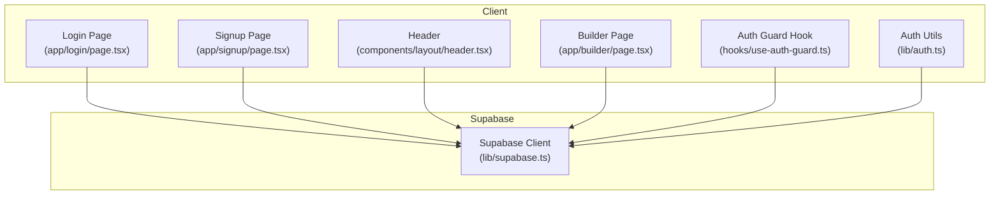

**Diagram sources**
- [login/page.tsx:12-55](file://src/app/login/page.tsx#L12-L55)
- [signup/page.tsx:21-72](file://src/app/signup/page.tsx#L21-L72)
- [header.tsx:12-32](file://src/components/layout/header.tsx#L12-L32)
- [builder/page.tsx:11-78](file://src/app/builder/page.tsx#L11-L78)
- [use-auth-guard.ts:11-56](file://src/hooks/use-auth-guard.ts#L11-L56)
- [auth.ts:3-16](file://src/lib/auth.ts#L3-L16)
- [supabase.ts:10-25](file://src/lib/supabase.ts#L10-L25)

**Section sources**
- [supabase.ts:10-25](file://src/lib/supabase.ts#L10-L25)
- [login/page.tsx:12-55](file://src/app/login/page.tsx#L12-L55)
- [signup/page.tsx:21-72](file://src/app/signup/page.tsx#L21-L72)
- [header.tsx:12-32](file://src/components/layout/header.tsx#L12-L32)
- [builder/page.tsx:11-78](file://src/app/builder/page.tsx#L11-L78)
- [use-auth-guard.ts:11-56](file://src/hooks/use-auth-guard.ts#L11-L56)
- [auth.ts:3-16](file://src/lib/auth.ts#L3-L16)

## Core Components
- Supabase client configured with auto-refresh, persisted sessions, and URL session detection
- Auth guard hook that validates user state, persists minimal user info to sessionStorage, and subscribes to auth state changes
- Login and signup pages that trigger Supabase authentication and synchronize sessionStorage
- Logout utility that signs out from Supabase and clears sessionStorage
- Header component that reacts to auth state changes and triggers logout
- Builder page that initializes and persists resume data to sessionStorage

**Section sources**
- [supabase.ts:10-25](file://src/lib/supabase.ts#L10-L25)
- [use-auth-guard.ts:11-56](file://src/hooks/use-auth-guard.ts#L11-L56)
- [login/page.tsx:19-55](file://src/app/login/page.tsx#L19-L55)
- [signup/page.tsx:21-72](file://src/app/signup/page.tsx#L21-L72)
- [auth.ts:3-16](file://src/lib/auth.ts#L3-L16)
- [header.tsx:12-32](file://src/components/layout/header.tsx#L12-L32)
- [builder/page.tsx:16-32](file://src/app/builder/page.tsx#L16-L32)

## Architecture Overview
The system integrates Supabase for server-side session validation while maintaining a lightweight client-side cache in sessionStorage for user identity and application data.

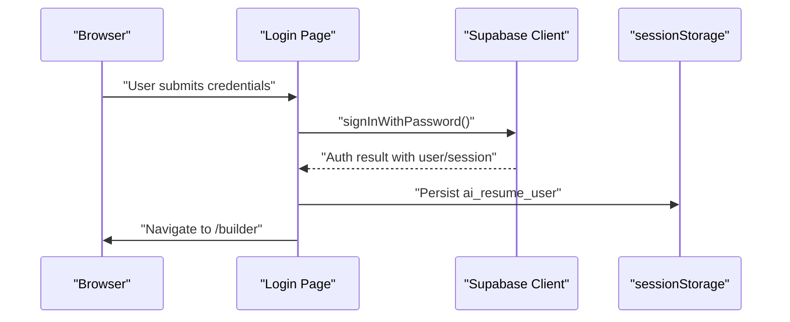

**Diagram sources**
- [login/page.tsx:19-41](file://src/app/login/page.tsx#L19-L41)
- [supabase.ts:10-25](file://src/lib/supabase.ts#L10-L25)

## Detailed Component Analysis

### Supabase Client Configuration
- Enables auto-refresh of tokens and persistent sessions
- Detects sessions in the URL to support OAuth flows
- Includes a development-time session retrieval test

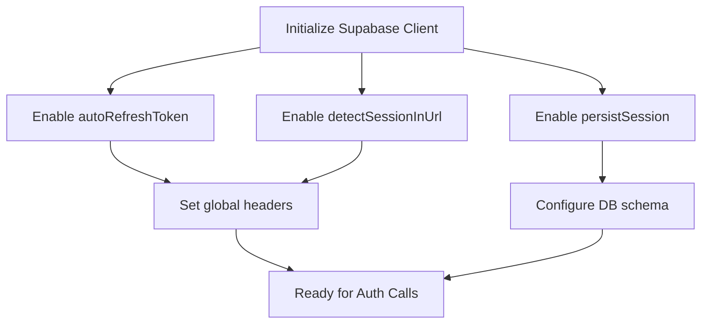

**Diagram sources**
- [supabase.ts:10-25](file://src/lib/supabase.ts#L10-L25)

**Section sources**
- [supabase.ts:10-25](file://src/lib/supabase.ts#L10-L25)

### Authentication Guard Hook
- Validates user on mount via Supabase getUser
- Persists minimal user identity to sessionStorage for UI and cross-component access
- Subscribes to onAuthStateChange to react to external auth events (e.g., server-side session invalidation)
- Handles transient network errors without redirecting

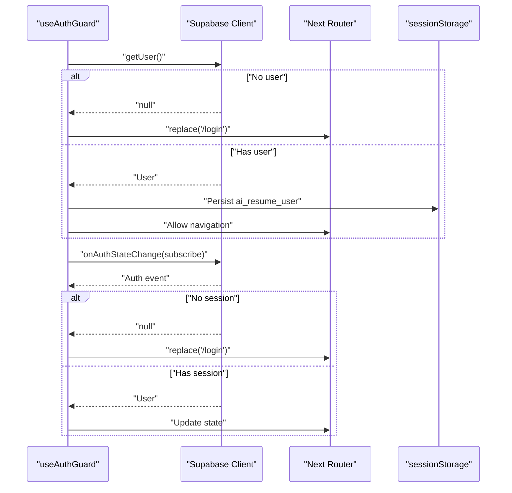

**Diagram sources**
- [use-auth-guard.ts:16-50](file://src/hooks/use-auth-guard.ts#L16-L50)

**Section sources**
- [use-auth-guard.ts:11-56](file://src/hooks/use-auth-guard.ts#L11-L56)

### Login Page
- Submits credentials to Supabase
- On success, persists user identity to sessionStorage
- Navigates to the builder and refreshes the route

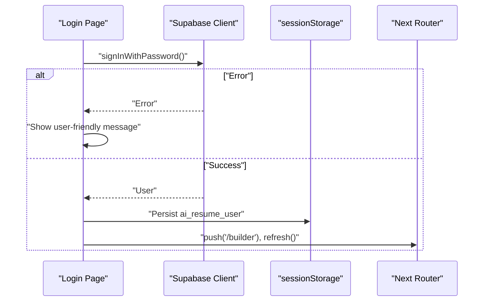

**Diagram sources**
- [login/page.tsx:19-41](file://src/app/login/page.tsx#L19-L41)

**Section sources**
- [login/page.tsx:12-55](file://src/app/login/page.tsx#L12-L55)

### Signup Page
- Registers a new user with optional profile data
- Immediately logs the user in and persists identity to sessionStorage
- Navigates to the builder

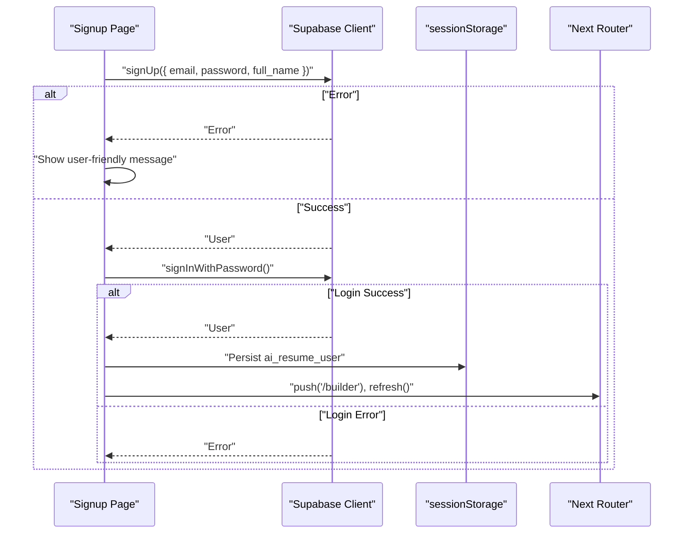

**Diagram sources**
- [signup/page.tsx:27-56](file://src/app/signup/page.tsx#L27-L56)

**Section sources**
- [signup/page.tsx:12-72](file://src/app/signup/page.tsx#L12-L72)

### Header Component
- Retrieves current user on mount via Supabase getUser
- Subscribes to auth state changes to update UI state
- Invokes logout utility on user action

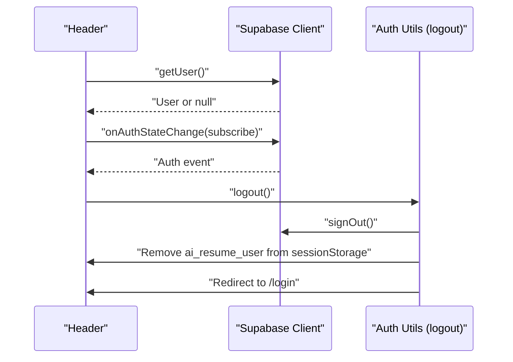

**Diagram sources**
- [header.tsx:15-31](file://src/components/layout/header.tsx#L15-L31)
- [auth.ts:3-11](file://src/lib/auth.ts#L3-L11)

**Section sources**
- [header.tsx:12-32](file://src/components/layout/header.tsx#L12-L32)
- [auth.ts:3-16](file://src/lib/auth.ts#L3-L16)

### Logout Utility
- Signs out from Supabase
- Removes user identity from sessionStorage
- Redirects to the login page

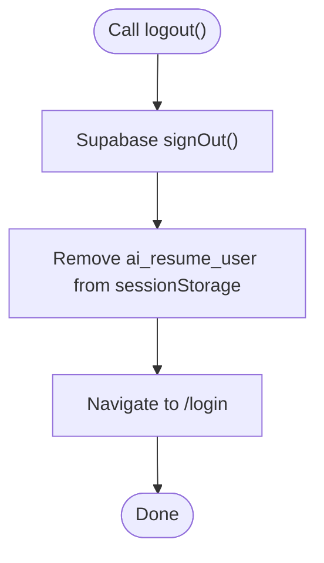

**Diagram sources**
- [auth.ts:3-11](file://src/lib/auth.ts#L3-L11)

**Section sources**
- [auth.ts:3-16](file://src/lib/auth.ts#L3-L16)

### Builder Page and Data Persistence
- Initializes resume data from sessionStorage on mount
- Persists updates to sessionStorage automatically
- Provides a responsive split-pane editor and preview

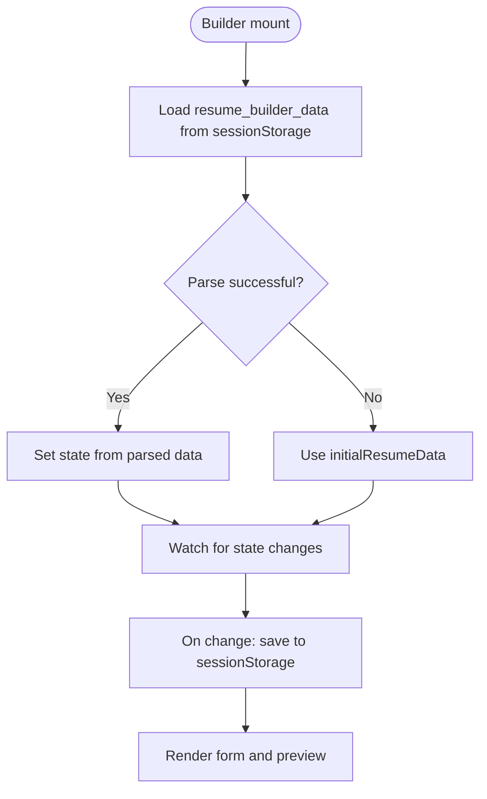

**Diagram sources**
- [builder/page.tsx:16-32](file://src/app/builder/page.tsx#L16-L32)
- [types.ts:69-101](file://src/lib/types.ts#L69-L101)

**Section sources**
- [builder/page.tsx:11-78](file://src/app/builder/page.tsx#L11-L78)
- [types.ts:69-101](file://src/lib/types.ts#L69-L101)

### Session Lifecycle: Registration → Login → Builder → Logout
- Registration: Supabase creates the user, then immediately logs them in and persists identity
- Login: Supabase authenticates, then persists identity and navigates to the builder
- Builder: Application state is restored from sessionStorage and saved on changes
- Logout: Supabase sign-out removes server-side session; client removes identity and redirects

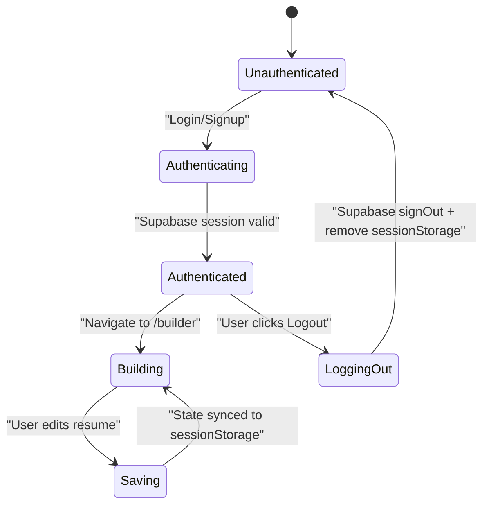

**Diagram sources**
- [signup/page.tsx:42-56](file://src/app/signup/page.tsx#L42-L56)
- [login/page.tsx:32-41](file://src/app/login/page.tsx#L32-L41)
- [builder/page.tsx:16-32](file://src/app/builder/page.tsx#L16-L32)
- [auth.ts:3-11](file://src/lib/auth.ts#L3-L11)

## Dependency Analysis
- Supabase client is a shared dependency across authentication pages, the auth guard, and the header component
- The auth guard depends on Supabase getUser and onAuthStateChange
- Pages depend on Supabase auth APIs and sessionStorage for identity persistence
- The header depends on Supabase getUser and the logout utility
- The builder depends on sessionStorage for resume data persistence

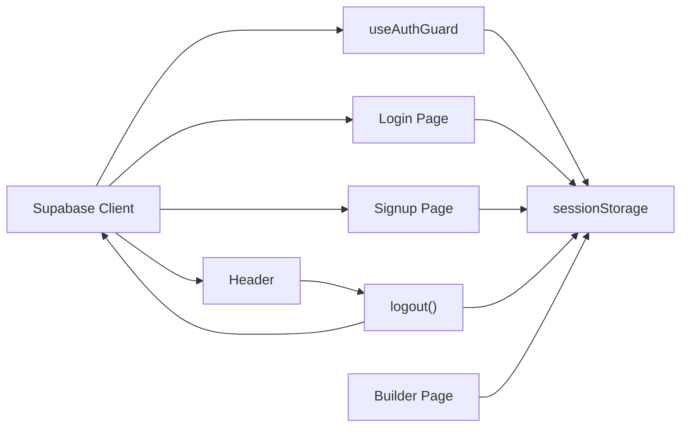

**Diagram sources**
- [supabase.ts:10-25](file://src/lib/supabase.ts#L10-L25)
- [use-auth-guard.ts:19-49](file://src/hooks/use-auth-guard.ts#L19-L49)
- [login/page.tsx:25-38](file://src/app/login/page.tsx#L25-L38)
- [signup/page.tsx:43-53](file://src/app/signup/page.tsx#L43-L53)
- [header.tsx:18-29](file://src/components/layout/header.tsx#L18-L29)
- [auth.ts:3-11](file://src/lib/auth.ts#L3-L11)
- [builder/page.tsx:18-32](file://src/app/builder/page.tsx#L18-L32)

**Section sources**
- [supabase.ts:10-25](file://src/lib/supabase.ts#L10-L25)
- [use-auth-guard.ts:11-56](file://src/hooks/use-auth-guard.ts#L11-L56)
- [login/page.tsx:12-55](file://src/app/login/page.tsx#L12-L55)
- [signup/page.tsx:12-72](file://src/app/signup/page.tsx#L12-L72)
- [header.tsx:12-32](file://src/components/layout/header.tsx#L12-L32)
- [auth.ts:3-16](file://src/lib/auth.ts#L3-L16)
- [builder/page.tsx:11-78](file://src/app/builder/page.tsx#L11-L78)

## Performance Considerations
- Supabase autoRefreshToken minimizes manual token management overhead
- Using sessionStorage for user identity reduces repeated server calls for basic UI state
- Initializing builder state from sessionStorage avoids unnecessary fetches and improves perceived performance
- Subscriptions to onAuthStateChange ensure immediate UI updates without polling

[No sources needed since this section provides general guidance]

## Security Best Practices
- Prefer Supabase-managed sessions over client-side-only storage for sensitive tokens
- Limit sessionStorage content to non-sensitive identifiers (e.g., user ID and email)
- Use HTTPS and secure cookies on the server for production deployments
- Sanitize user inputs and avoid storing secrets in sessionStorage
- Implement CSRF protections at the application level
- Regularly audit Supabase policies and RLS rules
- Monitor and log authentication events for suspicious activity

[No sources needed since this section provides general guidance]

## Troubleshooting Guide
Common issues and resolutions:
- Session not restored after reload
  - Verify sessionStorage contains the expected keys and values
  - Confirm the builder initializes state from sessionStorage on mount
- Redirect loop to login
  - Check Supabase configuration and environment variables
  - Ensure onAuthStateChange subscriptions are active
- Network errors during auth checks
  - The auth guard tolerates transient network errors; verify connectivity and retry
- Logout does not clear identity
  - Ensure the logout utility is invoked and sessionStorage removal occurs

**Section sources**
- [use-auth-guard.ts:16-37](file://src/hooks/use-auth-guard.ts#L16-L37)
- [auth.ts:3-11](file://src/lib/auth.ts#L3-L11)
- [builder/page.tsx:16-32](file://src/app/builder/page.tsx#L16-L32)

## Conclusion
The session management system combines Supabase’s robust server-side authentication with client-side sessionStorage for a responsive and reliable user experience. The auth guard, login/signup flows, header reactions, and builder data persistence collectively provide a complete lifecycle from registration to logout, with clear fallbacks and cleanup paths.