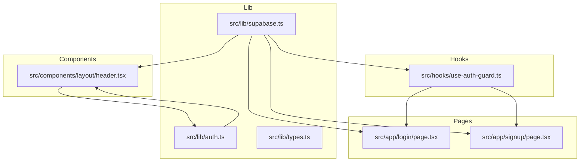
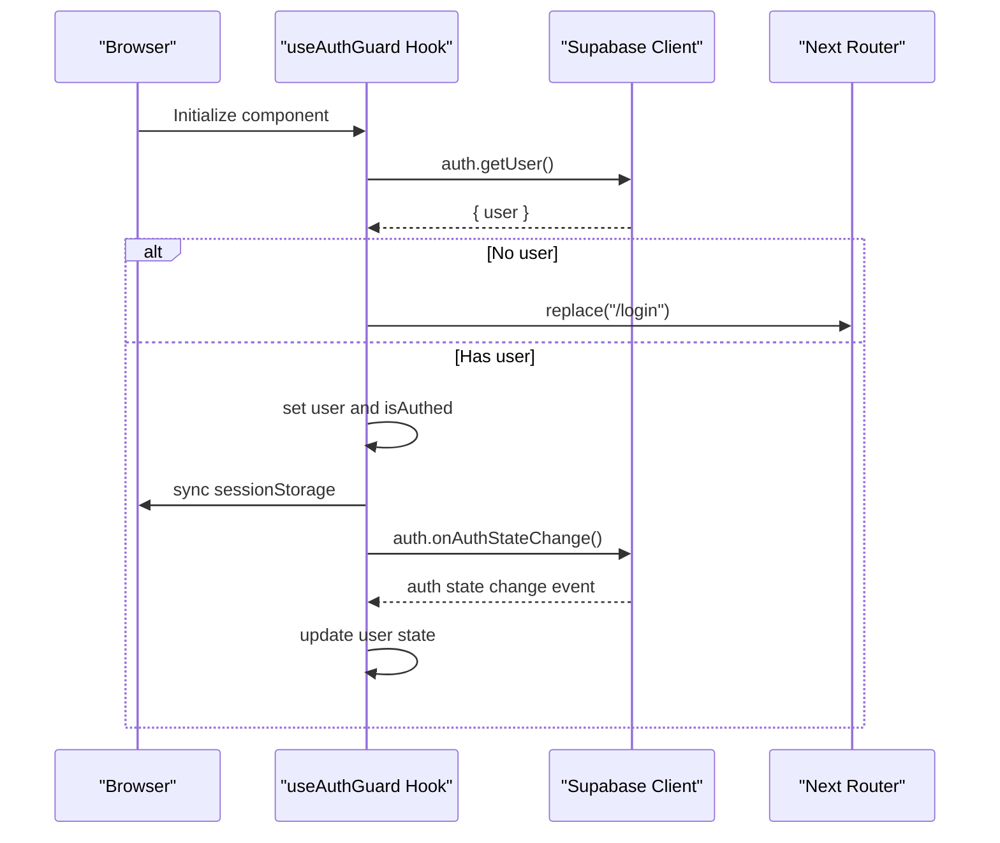
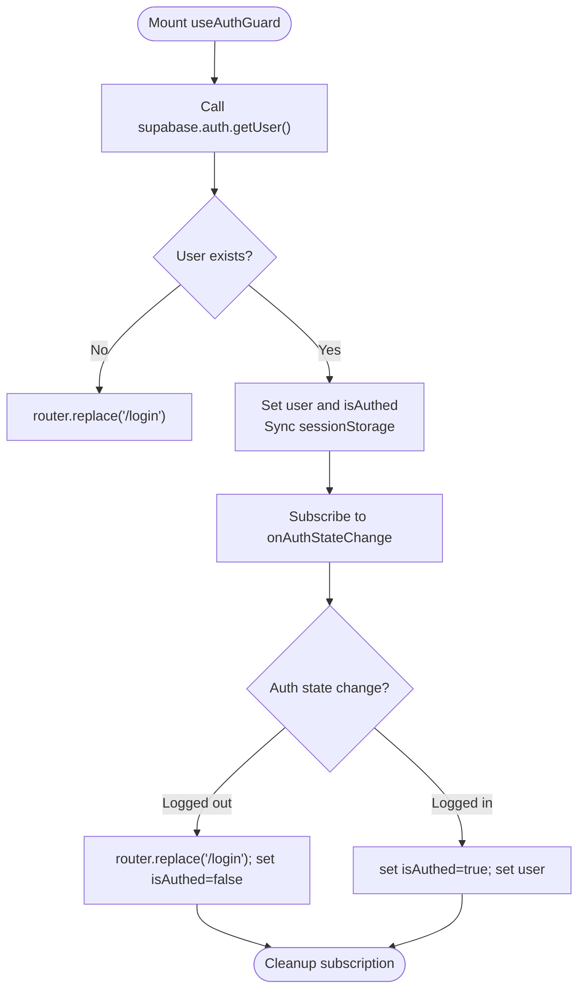
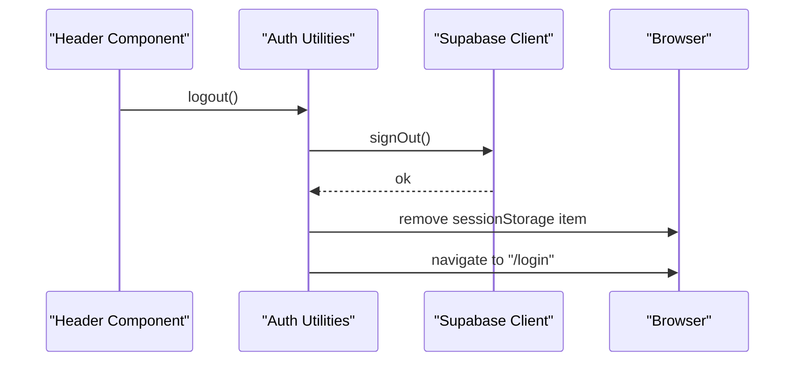
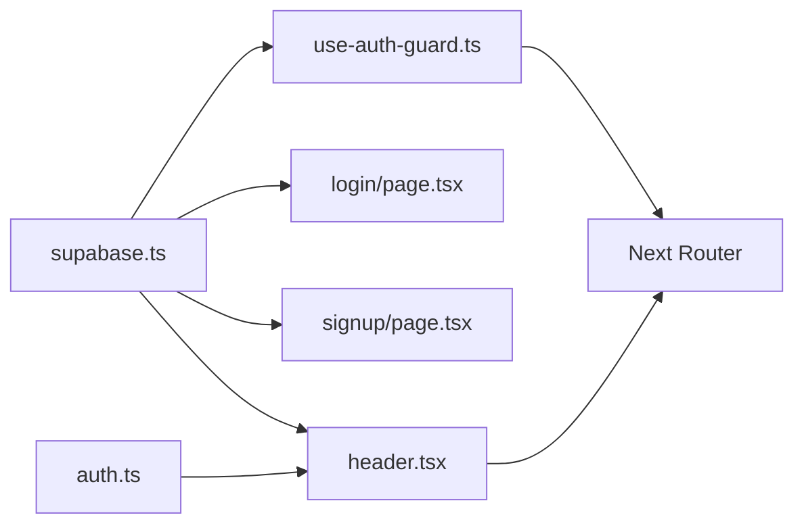

# User Management

<cite>
**Referenced Files in This Document**
- [supabase.ts](file://src/lib/supabase.ts)
- [use-auth-guard.ts](file://src/hooks/use-auth-guard.ts)
- [auth.ts](file://src/lib/auth.ts)
- [login/page.tsx](file://src/app/login/page.tsx)
- [signup/page.tsx](file://src/app/signup/page.tsx)
- [header.tsx](file://src/components/layout/header.tsx)
- [types.ts](file://src/lib/types.ts)
- [GOOGLE_OAUTH_SETUP.md](file://GOOGLE_OAUTH_SETUP.md)
</cite>

## Table of Contents
1. [Introduction](#introduction)
2. [Project Structure](#project-structure)
3. [Core Components](#core-components)
4. [Architecture Overview](#architecture-overview)
5. [Detailed Component Analysis](#detailed-component-analysis)
6. [Dependency Analysis](#dependency-analysis)
7. [Performance Considerations](#performance-considerations)
8. [Security Considerations](#security-considerations)
9. [Troubleshooting Guide](#troubleshooting-guide)
10. [Extending User Management](#extending-user-management)
11. [Conclusion](#conclusion)

## Introduction
This section documents the user management system of the resume builder application, focusing on authentication, session management, and user state handling powered by Supabase Auth. It explains the authentication flow, protected routes, user state synchronization, and practical patterns for implementing user-specific features. It also covers sign-up, login, logout, password reset, and email verification workflows, along with security considerations, token management, and privacy practices.

## Project Structure
The user management system spans several key areas:
- Supabase client initialization for authentication
- Authentication guards for protecting routes
- Login and signup pages with form handling
- Global header component for user state and logout
- Utility functions for logout and current user retrieval
- OAuth setup guide for Google authentication



**Diagram sources**
- [supabase.ts:1-11](file://src/lib/supabase.ts#L1-L11)
- [auth.ts:1-17](file://src/lib/auth.ts#L1-L17)
- [use-auth-guard.ts:1-50](file://src/hooks/use-auth-guard.ts#L1-L50)
- [login/page.tsx:1-106](file://src/app/login/page.tsx#L1-L106)
- [signup/page.tsx:1-141](file://src/app/signup/page.tsx#L1-L141)
- [header.tsx:1-95](file://src/components/layout/header.tsx#L1-L95)

**Section sources**
- [supabase.ts:1-11](file://src/lib/supabase.ts#L1-L11)
- [use-auth-guard.ts:1-50](file://src/hooks/use-auth-guard.ts#L1-L50)
- [auth.ts:1-17](file://src/lib/auth.ts#L1-L17)
- [login/page.tsx:1-106](file://src/app/login/page.tsx#L1-L106)
- [signup/page.tsx:1-141](file://src/app/signup/page.tsx#L1-L141)
- [header.tsx:1-95](file://src/components/layout/header.tsx#L1-L95)

## Core Components
- Supabase client initialization: Provides the Supabase client instance used across the app for authentication operations.
- Authentication guard hook: Performs client-side authentication checks and subscribes to auth state changes to keep user state synchronized.
- Login page: Handles email/password login, displays errors, and redirects upon successful authentication.
- Signup page: Manages new user registration, optional auto-login, and success/error messaging.
- Header component: Displays user info and logout button, and reacts to auth state changes.
- Auth utilities: Exposes logout and current user retrieval helpers.

**Section sources**
- [supabase.ts:1-11](file://src/lib/supabase.ts#L1-L11)
- [use-auth-guard.ts:1-50](file://src/hooks/use-auth-guard.ts#L1-L50)
- [login/page.tsx:1-106](file://src/app/login/page.tsx#L1-L106)
- [signup/page.tsx:1-141](file://src/app/signup/page.tsx#L1-L141)
- [header.tsx:1-95](file://src/components/layout/header.tsx#L1-L95)
- [auth.ts:1-17](file://src/lib/auth.ts#L1-L17)

## Architecture Overview
The authentication architecture centers on Supabase Auth. The Supabase client is initialized once and reused across modules. Pages and components use the client to authenticate users, while a global guard ensures protected routes remain inaccessible to unauthenticated users. Auth state changes are subscribed to centrally to maintain consistent user state across the UI.



**Diagram sources**
- [use-auth-guard.ts:15-46](file://src/hooks/use-auth-guard.ts#L15-L46)
- [supabase.ts:1-11](file://src/lib/supabase.ts#L1-L11)

**Section sources**
- [use-auth-guard.ts:1-50](file://src/hooks/use-auth-guard.ts#L1-L50)
- [supabase.ts:1-11](file://src/lib/supabase.ts#L1-L11)

## Detailed Component Analysis

### Supabase Client Initialization
- Initializes the Supabase client using environment variables for URL and anonymous key.
- Ensures safe defaults if environment variables are missing.
- Exports a singleton client instance for use across the application.

**Section sources**
- [supabase.ts:1-11](file://src/lib/supabase.ts#L1-L11)

### Authentication Guard Implementation
- Checks current user on mount using `getUser()`.
- Redirects to `/login` if no user is found.
- Subscribes to `onAuthStateChange` to react to login/logout events.
- Synchronizes user data to `sessionStorage` for backward compatibility.
- Returns `{ isAuthed, user }` to enable conditional rendering.



**Diagram sources**
- [use-auth-guard.ts:15-46](file://src/hooks/use-auth-guard.ts#L15-L46)

**Section sources**
- [use-auth-guard.ts:1-50](file://src/hooks/use-auth-guard.ts#L1-L50)

### Protected Routes
- The authentication guard enforces protection by redirecting unauthenticated users to `/login`.
- Components using the guard should render nothing until `isAuthed` is true to avoid flicker and inconsistent UI.
- For server-side route protection, integrate with Next.js middleware to check session validity before rendering pages.

**Section sources**
- [use-auth-guard.ts:19-24](file://src/hooks/use-auth-guard.ts#L19-L24)

### Login Process
- Captures email and password from the form.
- Calls `signInWithPassword` via the Supabase client.
- On success, retrieves the current user and stores a minimal user object in `sessionStorage`.
- Navigates to `/builder` and refreshes to ensure route protection updates.

```mermaid
sequenceDiagram
participant User as "User"
participant LoginPage as "Login Page"
participant Supabase as "Supabase Client"
participant Router as "Next Router"
User->>LoginPage : Submit credentials
LoginPage->>Supabase : signInWithPassword({ email, password })
alt Error
Supabase-->>LoginPage : error
LoginPage->>LoginPage : show error message
else Success
Supabase-->>LoginPage : ok
LoginPage->>Supabase : auth.getUser()
Supabase-->>LoginPage : { user }
LoginPage->>LoginPage : store user in sessionStorage
LoginPage->>Router : push("/builder"); refresh()
end
```

**Diagram sources**
- [login/page.tsx:19-48](file://src/app/login/page.tsx#L19-L48)
- [supabase.ts:1-11](file://src/lib/supabase.ts#L1-L11)

**Section sources**
- [login/page.tsx:1-106](file://src/app/login/page.tsx#L1-L106)

### Signup Process
- Captures full name, email, and password.
- Calls `signUp` with optional user metadata (e.g., full name).
- On success, triggers automatic login via `signInWithPassword`.
- After successful login, persists user data to `sessionStorage` and navigates to `/builder`.

```mermaid
sequenceDiagram
participant User as "User"
participant SignupPage as "Signup Page"
participant Supabase as "Supabase Client"
participant Router as "Next Router"
User->>SignupPage : Submit form
SignupPage->>Supabase : signUp({ email, password, options.data.full_name })
alt Error
Supabase-->>SignupPage : error
SignupPage->>SignupPage : show error message
else Success
SignupPage->>SignupPage : set success flag
SignupPage->>Supabase : signInWithPassword({ email, password })
alt Login Success
Supabase-->>SignupPage : ok
SignupPage->>Supabase : auth.getUser()
Supabase-->>SignupPage : { user }
SignupPage->>SignupPage : store user in sessionStorage
SignupPage->>Router : push("/builder"); refresh()
else Login Error
Supabase-->>SignupPage : error
SignupPage->>SignupPage : show error message
end
end
```

**Diagram sources**
- [signup/page.tsx:21-63](file://src/app/signup/page.tsx#L21-L63)
- [supabase.ts:1-11](file://src/lib/supabase.ts#L1-L11)

**Section sources**
- [signup/page.tsx:1-141](file://src/app/signup/page.tsx#L1-L141)

### Logout Process
- Invokes `supabase.auth.signOut()` to terminate the session.
- Removes the stored user object from `sessionStorage`.
- Redirects to `/login` to ensure the UI reflects the logged-out state.



**Diagram sources**
- [header.tsx:63-71](file://src/components/layout/header.tsx#L63-L71)
- [auth.ts:3-11](file://src/lib/auth.ts#L3-L11)
- [supabase.ts:1-11](file://src/lib/supabase.ts#L1-L11)

**Section sources**
- [auth.ts:1-17](file://src/lib/auth.ts#L1-L17)
- [header.tsx:1-95](file://src/components/layout/header.tsx#L1-L95)

### User State Management
- Centralized auth state subscription in the header component keeps the UI in sync with Supabase’s current session.
- The authentication guard maintains local state and synchronizes with `sessionStorage` for backward compatibility.
- Use the current user helper to fetch the latest user data when needed.

**Section sources**
- [header.tsx:14-26](file://src/components/layout/header.tsx#L14-L26)
- [use-auth-guard.ts:24-29](file://src/hooks/use-auth-guard.ts#L24-L29)
- [auth.ts:13-16](file://src/lib/auth.ts#L13-L16)

### Password Reset Workflow
- Trigger password reset via the Supabase client’s password recovery method.
- Ensure the application handles success and error states gracefully.
- Redirect users to a confirmation page or back to the login page after initiating the reset.

[No sources needed since this section provides general guidance]

### Email Verification Workflow
- Enable Supabase Auth’s email confirmation setting to require verified emails.
- On sign-up, inform users to check their inbox for a confirmation link.
- After confirmation, the user can log in normally; the app should reflect the updated auth status automatically.

[No sources needed since this section provides general guidance]

### Implementing User-Specific Features
- Use the current user’s ID to scope data storage and retrieval (e.g., resume entries).
- Enforce access control by checking the authenticated user’s identity before allowing edits or deletions.
- Persist user preferences and settings under the authenticated user’s namespace.

**Section sources**
- [types.ts:69-101](file://src/lib/types.ts#L69-L101)

## Dependency Analysis
The user management system exhibits clear separation of concerns:
- Supabase client is a shared dependency for authentication operations.
- The guard depends on the client and router to enforce protection.
- Pages depend on the client for authentication actions.
- The header depends on the client and auth utilities for UI state and logout.
- Auth utilities encapsulate logout and current user retrieval.



**Diagram sources**
- [supabase.ts:1-11](file://src/lib/supabase.ts#L1-L11)
- [use-auth-guard.ts:1-50](file://src/hooks/use-auth-guard.ts#L1-L50)
- [login/page.tsx:1-106](file://src/app/login/page.tsx#L1-L106)
- [signup/page.tsx:1-141](file://src/app/signup/page.tsx#L1-L141)
- [header.tsx:1-95](file://src/components/layout/header.tsx#L1-L95)
- [auth.ts:1-17](file://src/lib/auth.ts#L1-L17)

**Section sources**
- [supabase.ts:1-11](file://src/lib/supabase.ts#L1-L11)
- [use-auth-guard.ts:1-50](file://src/hooks/use-auth-guard.ts#L1-L50)
- [login/page.tsx:1-106](file://src/app/login/page.tsx#L1-L106)
- [signup/page.tsx:1-141](file://src/app/signup/page.tsx#L1-L141)
- [header.tsx:1-95](file://src/components/layout/header.tsx#L1-L95)
- [auth.ts:1-17](file://src/lib/auth.ts#L1-L17)

## Performance Considerations
- Minimize repeated calls to `getUser()` by caching the user object in local state where appropriate.
- Unsubscribe from auth state changes when components unmount to prevent memory leaks.
- Defer heavy computations until after authentication is confirmed to avoid unnecessary work for unauthenticated users.

[No sources needed since this section provides general guidance]

## Security Considerations
- Environment variables: Ensure Supabase URL and anonymous keys are configured securely and not exposed in client bundles.
- Token management: Rely on Supabase Auth’s built-in session handling; avoid storing sensitive tokens in client storage beyond what is necessary for session continuity.
- Session storage: The current implementation stores a minimal user object in `sessionStorage`. Keep this data minimal and avoid storing secrets.
- Input validation: Validate and sanitize user inputs on forms to prevent injection attacks.
- Redirects: Configure Supabase redirect URLs correctly for OAuth to prevent open redirect vulnerabilities.

**Section sources**
- [supabase.ts:3-7](file://src/lib/supabase.ts#L3-L7)
- [GOOGLE_OAUTH_SETUP.md:40-49](file://GOOGLE_OAUTH_SETUP.md#L40-L49)

## Troubleshooting Guide
- Authentication guard does not redirect: Verify that `getUser()` returns a user object and that the router is correctly imported and used.
- Auth state changes not reflected: Ensure the subscription to `onAuthStateChange` is active and properly unsubscribed on cleanup.
- Login fails silently: Capture and display the error returned by `signInWithPassword` to identify the cause.
- Logout does not clear state: Confirm that `sessionStorage` is cleared and the browser navigates to `/login`.
- OAuth callback issues: Review redirect URL configuration in Supabase and ensure it matches the application’s deployment domain.

**Section sources**
- [use-auth-guard.ts:15-46](file://src/hooks/use-auth-guard.ts#L15-L46)
- [login/page.tsx:24-48](file://src/app/login/page.tsx#L24-L48)
- [auth.ts:3-11](file://src/lib/auth.ts#L3-L11)
- [GOOGLE_OAUTH_SETUP.md:40-49](file://GOOGLE_OAUTH_SETUP.md#L40-L49)

## Extending User Management
- Integrate additional providers: Follow the OAuth setup guide to configure Google and other providers, ensuring redirect URLs are correctly set in both the provider console and Supabase.
- Custom user metadata: Store additional user preferences or settings in Supabase tables keyed by the authenticated user’s ID.
- Multi-factor authentication: Enable MFA in Supabase and extend the UI to support MFA enrollment and verification flows.
- Role-based access control: Implement roles in Supabase and gate features based on user roles in the UI.

**Section sources**
- [GOOGLE_OAUTH_SETUP.md:40-49](file://GOOGLE_OAUTH_SETUP.md#L40-L49)

## Conclusion
The resume builder’s user management system leverages Supabase Auth for secure, reliable authentication. The guard ensures protected routes, while login and signup pages provide straightforward user onboarding. The header component and auth utilities keep user state synchronized and enable seamless logout. By following the outlined security and extension practices, the system can evolve to support advanced features like OAuth, MFA, and role-based access control.