# User Profile Handling

<cite>
**Referenced Files in This Document**
- [supabase.ts](file://src/lib/supabase.ts)
- [types.ts](file://src/lib/types.ts)
- [use-auth-guard.ts](file://src/hooks/use-auth-guard.ts)
- [login page.tsx](file://src/app/login/page.tsx)
- [header.tsx](file://src/components/layout/header.tsx)
- [resume builder page.tsx](file://src/app/builder/page.tsx)
- [resume form.tsx](file://src/components/resume/resume-form.tsx)
- [personal info.tsx](file://src/components/resume/personal-info.tsx)
- [profile progress bar.tsx](file://src/components/resume/progress-bar.tsx)
- [resume preview.tsx](file://src/components/resume/resume-preview.tsx)
- [supabase-setup.sql](file://supabase-setup.sql)
- [layout.tsx](file://src/app/layout.tsx)
</cite>

## Table of Contents
1. [Introduction](#introduction)
2. [Project Structure](#project-structure)
3. [Core Components](#core-components)
4. [Architecture Overview](#architecture-overview)
5. [Detailed Component Analysis](#detailed-component-analysis)
6. [Dependency Analysis](#dependency-analysis)
7. [Performance Considerations](#performance-considerations)
8. [Privacy and Data Protection](#privacy-and-data-protection)
9. [Troubleshooting Guide](#troubleshooting-guide)
10. [Conclusion](#conclusion)

## Introduction
This document explains how user profiles are handled within the authentication system, focusing on storage, retrieval, and lifecycle management. It covers the integration with Supabase for user profile persistence, including profile updates, data synchronization, and user-specific data isolation. It also documents the user object structure, profile fields, and validation processes, and provides practical examples for implementing user profile CRUD operations, handling updates, and managing user preferences. Privacy considerations, data protection measures, and user consent management are addressed throughout.

## Project Structure
The user profile system spans several layers:
- Authentication client initialization and session management
- Supabase schema and Row Level Security (RLS) policies
- Frontend components that render and manage user profile data
- Resume data model and local/session storage for user edits

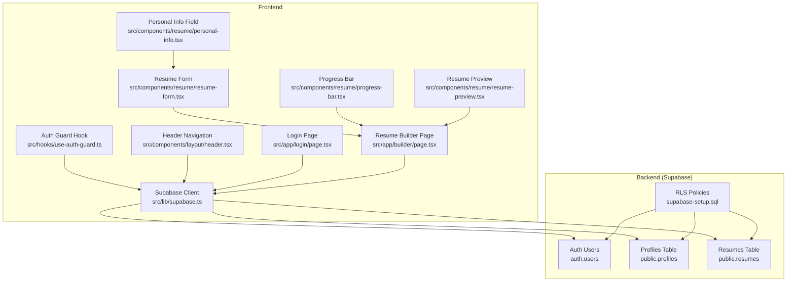

**Diagram sources**
- [supabase.ts:1-35](file://src/lib/supabase.ts#L1-L35)
- [use-auth-guard.ts:1-57](file://src/hooks/use-auth-guard.ts#L1-L57)
- [header.tsx:1-101](file://src/components/layout/header.tsx#L1-L101)
- [login page.tsx:1-113](file://src/app/login/page.tsx#L1-L113)
- [resume builder page.tsx:1-79](file://src/app/builder/page.tsx#L1-L79)
- [resume form.tsx:1-84](file://src/components/resume/resume-form.tsx#L1-L84)
- [personal info.tsx:1-118](file://src/components/resume/personal-info.tsx#L1-L118)
- [profile progress bar.tsx:1-100](file://src/components/resume/progress-bar.tsx#L1-L100)
- [resume preview.tsx:1-700](file://src/components/resume/resume-preview.tsx#L1-L700)
- [supabase-setup.sql:1-58](file://supabase-setup.sql#L1-L58)

**Section sources**
- [supabase.ts:1-35](file://src/lib/supabase.ts#L1-L35)
- [supabase-setup.sql:1-58](file://supabase-setup.sql#L1-L58)
- [layout.tsx:1-50](file://src/app/layout.tsx#L1-L50)

## Core Components
- Supabase client initialization with automatic session refresh, persistence, and URL detection
- Auth guard hook that ensures protected routes are only accessible to authenticated users
- Header component that displays the current user and provides logout
- Login page that authenticates users and persists minimal session data
- Resume builder that manages resume data locally and can be extended to persist to Supabase
- Types for resume data and profile fields

Key responsibilities:
- Authentication and session lifecycle
- User identity exposure in UI
- Local-first editing of resume data with optional persistence
- Profile data isolation via Supabase RLS

**Section sources**
- [supabase.ts:1-35](file://src/lib/supabase.ts#L1-L35)
- [use-auth-guard.ts:1-57](file://src/hooks/use-auth-guard.ts#L1-L57)
- [header.tsx:1-101](file://src/components/layout/header.tsx#L1-L101)
- [login page.tsx:1-113](file://src/app/login/page.tsx#L1-L113)
- [resume builder page.tsx:1-79](file://src/app/builder/page.tsx#L1-L79)
- [types.ts:1-103](file://src/lib/types.ts#L1-L103)

## Architecture Overview
The system integrates Supabase Auth for identity and Supabase Postgres for data. The Supabase client is configured with automatic token refresh and session persistence. The frontend enforces authentication via a custom hook and exposes the current user in the header. Profile data is stored in a dedicated table with RLS policies ensuring per-user isolation. Resume data is stored in a JSONB column for flexibility and performance.

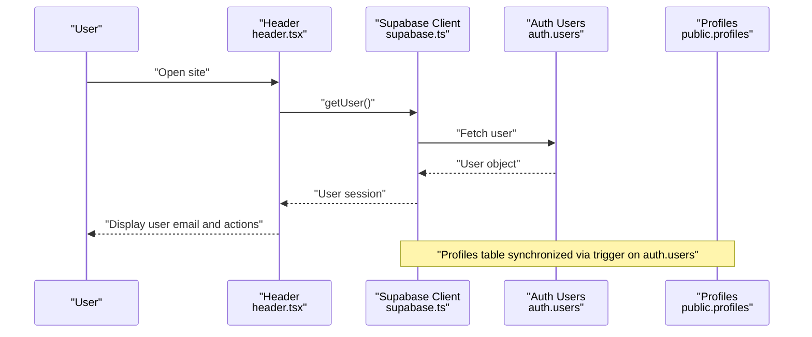

**Diagram sources**
- [header.tsx:15-32](file://src/components/layout/header.tsx#L15-L32)
- [supabase.ts:10-25](file://src/lib/supabase.ts#L10-L25)
- [supabase-setup.sql:38-57](file://supabase-setup.sql#L38-L57)

## Detailed Component Analysis

### Supabase Client Initialization
The Supabase client is initialized with:
- Automatic token refresh and session persistence
- Detection of session in URL
- Custom headers for application identification
- Optional development-time connection testing

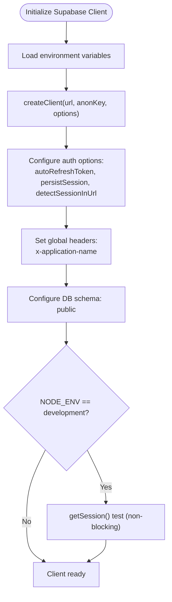

**Diagram sources**
- [supabase.ts:3-33](file://src/lib/supabase.ts#L3-L33)

**Section sources**
- [supabase.ts:1-35](file://src/lib/supabase.ts#L1-L35)

### Authentication Guard and Session Management
The auth guard hook:
- Checks for an existing user session
- Redirects unauthenticated users to the login page
- Subscribes to auth state changes and updates internal state
- Persists a minimal user object to sessionStorage for backward compatibility

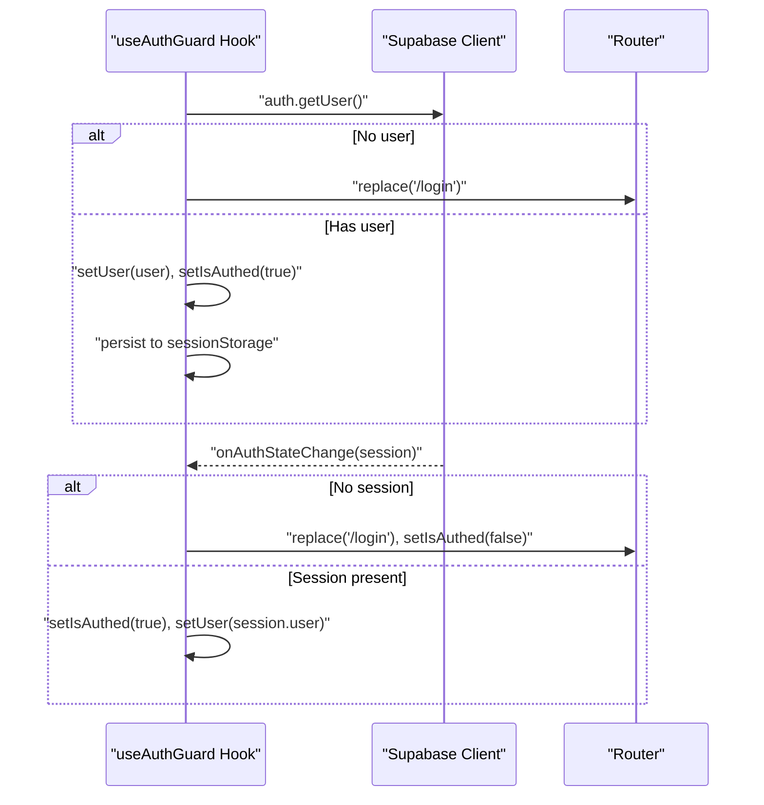

**Diagram sources**
- [use-auth-guard.ts:16-53](file://src/hooks/use-auth-guard.ts#L16-L53)

**Section sources**
- [use-auth-guard.ts:1-57](file://src/hooks/use-auth-guard.ts#L1-L57)

### Header Navigation and Logout
The header component:
- Fetches the current user on mount
- Subscribes to auth state changes
- Displays user email and logout action
- Uses a logout utility to sign out the user

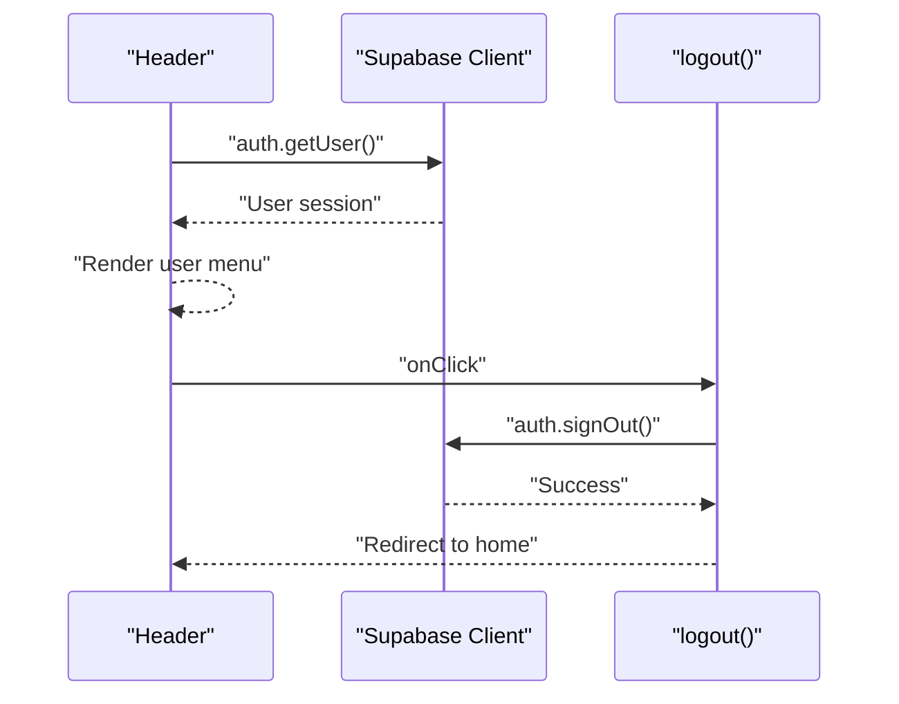

**Diagram sources**
- [header.tsx:15-32](file://src/components/layout/header.tsx#L15-L32)

**Section sources**
- [header.tsx:1-101](file://src/components/layout/header.tsx#L1-L101)

### Login Flow and Error Handling
The login page:
- Collects email and password
- Calls Supabase to authenticate
- Stores a minimal user object in sessionStorage
- Provides user-friendly error messages for network and credential errors

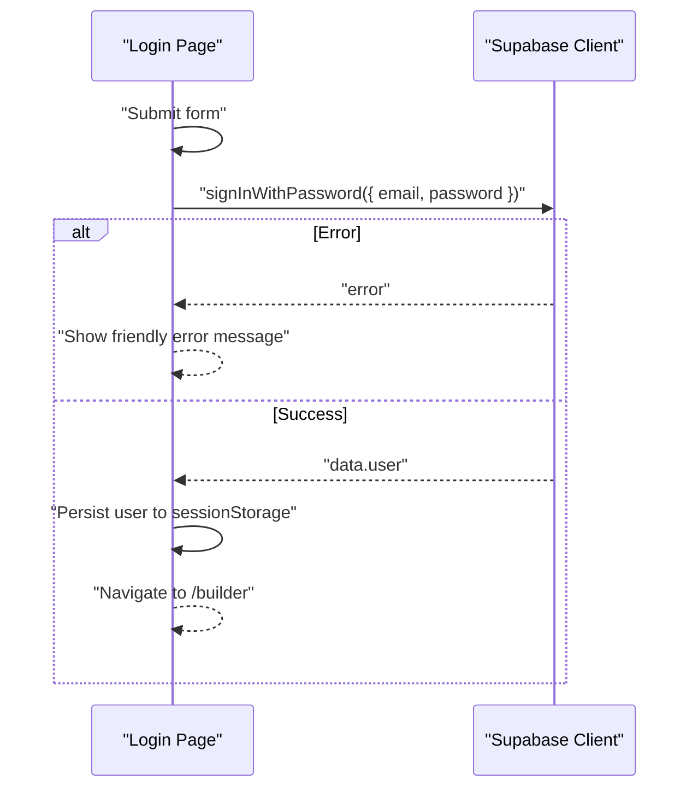

**Diagram sources**
- [login page.tsx:19-55](file://src/app/login/page.tsx#L19-L55)

**Section sources**
- [login page.tsx:1-113](file://src/app/login/page.tsx#L1-L113)

### Resume Builder and Local Data Management
The resume builder:
- Initializes resume data from sessionStorage if available
- Saves changes to sessionStorage on each update
- Exposes a function to update partial resume data
- Integrates with form components for editing

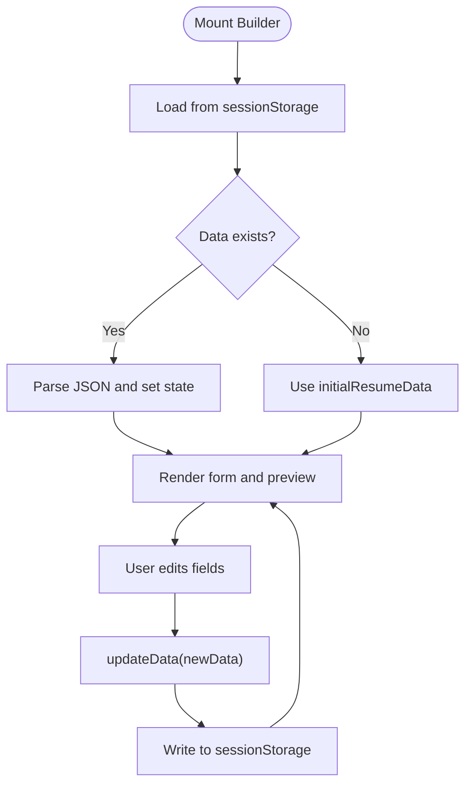

**Diagram sources**
- [resume builder page.tsx:11-36](file://src/app/builder/page.tsx#L11-L36)

**Section sources**
- [resume builder page.tsx:1-79](file://src/app/builder/page.tsx#L1-L79)
- [types.ts:81-101](file://src/lib/types.ts#L81-L101)

### Resume Form and Personal Information Fields
The resume form composes multiple field components:
- Personal information fields (first name, last name, job title, email, phone, address, LinkedIn, website, summary)
- Experience, education, skills, projects, certifications, achievements, languages, and links

Each field component updates the parent state via a callback, enabling incremental edits.

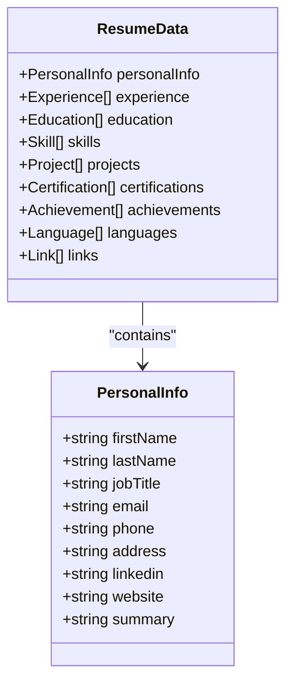

**Diagram sources**
- [types.ts:1-103](file://src/lib/types.ts#L1-L103)
- [resume form.tsx:19-81](file://src/components/resume/resume-form.tsx#L19-L81)
- [personal info.tsx:13-117](file://src/components/resume/personal-info.tsx#L13-L117)

**Section sources**
- [resume form.tsx:1-84](file://src/components/resume/resume-form.tsx#L1-L84)
- [personal info.tsx:1-118](file://src/components/resume/personal-info.tsx#L1-L118)
- [types.ts:1-103](file://src/lib/types.ts#L1-L103)

### Profile Progress Tracking
The progress bar computes a profile strength score based on filled resume sections and renders a color-coded indicator. This encourages users to complete their profiles.

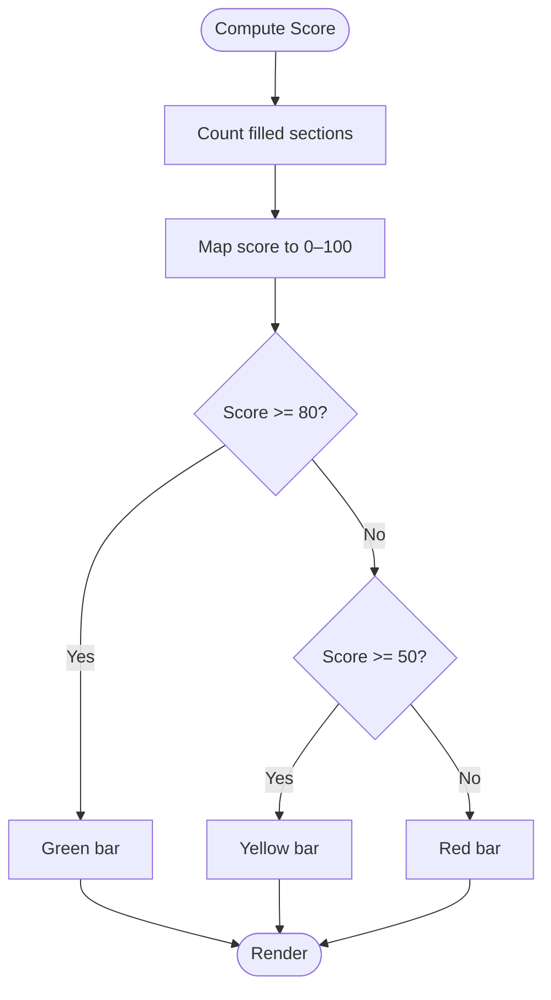

**Diagram sources**
- [profile progress bar.tsx:39-72](file://src/components/resume/progress-bar.tsx#L39-L72)

**Section sources**
- [profile progress bar.tsx:1-100](file://src/components/resume/progress-bar.tsx#L1-L100)

### Supabase Schema and RLS Policies
The Supabase setup defines:
- Profiles table with user identity, email, full name, avatar URL, and provider
- Resumes table storing JSONB resume data linked to users
- Row Level Security policies ensuring users can only access their own data
- A trigger that automatically creates a profile record when a user is created

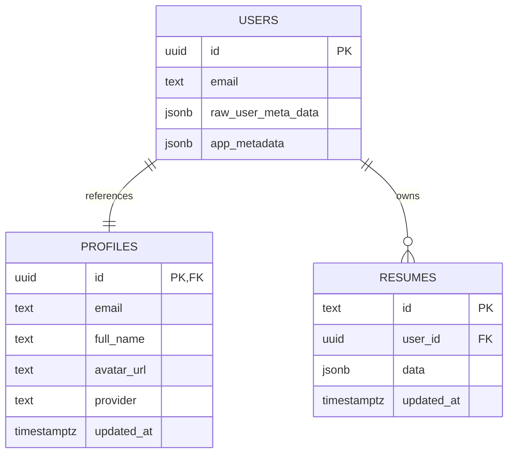

**Diagram sources**
- [supabase-setup.sql:3-29](file://supabase-setup.sql#L3-L29)
- [supabase-setup.sql:38-57](file://supabase-setup.sql#L38-L57)

**Section sources**
- [supabase-setup.sql:1-58](file://supabase-setup.sql#L1-L58)

## Dependency Analysis
- The auth guard depends on the Supabase client for user session checks and auth state subscriptions.
- The header depends on the Supabase client for user retrieval and auth state changes.
- The login page depends on the Supabase client for authentication and session persistence.
- The resume builder depends on the resume data types and local/session storage for editing.
- Supabase RLS policies depend on the auth users table and enforce per-user data isolation.

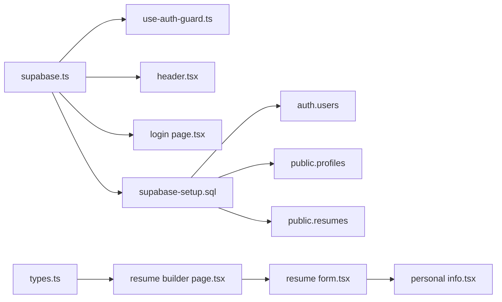

**Diagram sources**
- [supabase.ts:1-35](file://src/lib/supabase.ts#L1-L35)
- [use-auth-guard.ts:1-57](file://src/hooks/use-auth-guard.ts#L1-L57)
- [header.tsx:1-101](file://src/components/layout/header.tsx#L1-L101)
- [login page.tsx:1-113](file://src/app/login/page.tsx#L1-L113)
- [resume builder page.tsx:1-79](file://src/app/builder/page.tsx#L1-L79)
- [resume form.tsx:1-84](file://src/components/resume/resume-form.tsx#L1-L84)
- [personal info.tsx:1-118](file://src/components/resume/personal-info.tsx#L1-L118)
- [types.ts:1-103](file://src/lib/types.ts#L1-L103)
- [supabase-setup.sql:1-58](file://supabase-setup.sql#L1-L58)

**Section sources**
- [supabase.ts:1-35](file://src/lib/supabase.ts#L1-L35)
- [use-auth-guard.ts:1-57](file://src/hooks/use-auth-guard.ts#L1-L57)
- [header.tsx:1-101](file://src/components/layout/header.tsx#L1-L101)
- [login page.tsx:1-113](file://src/app/login/page.tsx#L1-L113)
- [resume builder page.tsx:1-79](file://src/app/builder/page.tsx#L1-L79)
- [resume form.tsx:1-84](file://src/components/resume/resume-form.tsx#L1-L84)
- [personal info.tsx:1-118](file://src/components/resume/personal-info.tsx#L1-L118)
- [types.ts:1-103](file://src/lib/types.ts#L1-L103)
- [supabase-setup.sql:1-58](file://supabase-setup.sql#L1-L58)

## Performance Considerations
- Local-first editing reduces server load during drafting; resume data is persisted to sessionStorage for immediate availability.
- JSONB storage in the resumes table minimizes join complexity and enables fast reads of the entire resume state.
- Supabase RLS policies are enforced server-side, ensuring efficient filtering without client-side scanning.
- The Supabase client is configured with automatic token refresh and session persistence to minimize re-authentication overhead.

[No sources needed since this section provides general guidance]

## Privacy and Data Protection
- Data isolation: RLS policies restrict access to user-specific data in both profiles and resumes.
- Minimal session storage: The application stores only essential user identifiers in sessionStorage for backward compatibility.
- Secure defaults: Supabase client is configured with secure defaults and development-time connectivity warnings.
- Consent and transparency: While not implemented in the current code, profile updates and data access should be accompanied by clear notices and user controls.

**Section sources**
- [supabase-setup.sql:11-19](file://supabase-setup.sql#L11-L19)
- [supabase-setup.sql:31-36](file://supabase-setup.sql#L31-L36)
- [use-auth-guard.ts:26-31](file://src/hooks/use-auth-guard.ts#L26-L31)
- [login page.tsx:32-38](file://src/app/login/page.tsx#L32-L38)

## Troubleshooting Guide
Common issues and resolutions:
- Authentication failures: Network errors are caught and surfaced as user-friendly messages; verify Supabase URL and keys in environment variables.
- Session inconsistencies: The auth guard subscribes to auth state changes; ensure the subscription is active and not prematurely unsubscribed.
- Profile synchronization: New users are automatically added to the profiles table via a trigger; verify the trigger exists and runs after auth.user creation.
- Data persistence: Resume data is stored in sessionStorage; if edits do not persist, check for storage quota limits or browser privacy settings blocking sessionStorage.

**Section sources**
- [login page.tsx:42-54](file://src/app/login/page.tsx#L42-L54)
- [use-auth-guard.ts:32-36](file://src/hooks/use-auth-guard.ts#L32-L36)
- [supabase-setup.sql:54-57](file://supabase-setup.sql#L54-L57)

## Conclusion
The user profile handling system leverages Supabase Auth for identity and Supabase Postgres for data, with robust RLS policies ensuring user-specific data isolation. The frontend provides a seamless authentication experience, real-time user state updates, and a flexible resume editor that prioritizes local-first editing while remaining extensible for server-side persistence. Privacy and data protection are addressed through secure defaults and minimal session storage, with clear pathways to enhance consent and transparency.